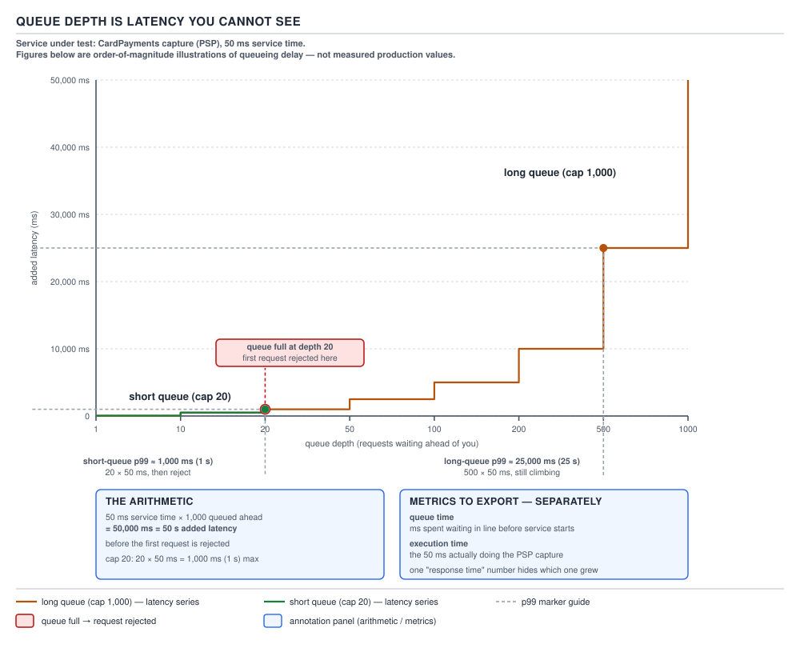
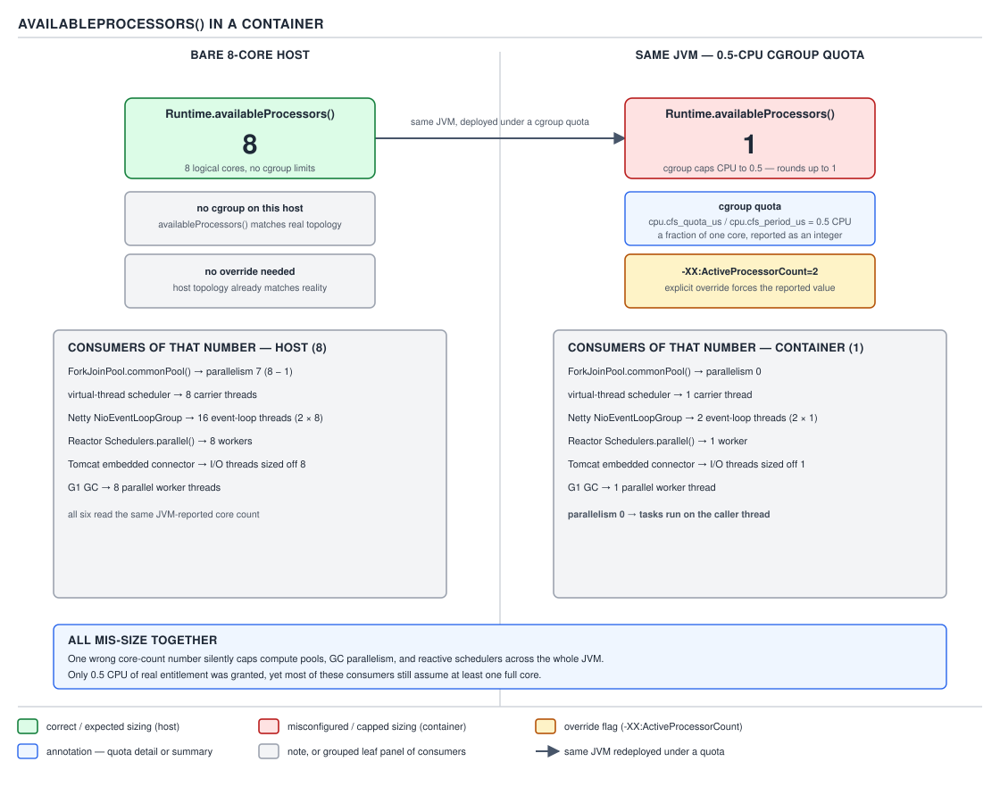

# 05 Multithreading and Concurrency — Pool sizing and executor configuration — INTERMEDIATE (§2.4)

**Target version: Java 21 LTS.** | **Part 2 of 5** | [Index](../00-index.md)
Previous: [Choosing a synchronization primitive](../locks/02-choosing-a-primitive.md) · Next: [The atomicity decision in practice](../atomics/02-the-atomicity-decision.md)

Sizing a `ThreadPoolExecutor` is not a lookup table — it is an application of Little's law to a
specific workload, plus a queue sized on purpose, plus a number the container lies about. This file
derives the two sizing formulas, works the QuizStakes numbers through them, sizes the queue in
front of the pool, and walks the four knobs that turn a pool from a policy into an accident.

## The CPU-bound formula

**Mental model.** A CPU-bound pool is a photo finish: every thread wants the CPU at the same time,
and there are exactly as many lanes as cores. Any thread you add beyond the core count doesn't run
faster — it waits in line, and the only thing it buys you is a thread ready to jump in the instant
a lane opens because the runner in it stumbled.

**Why it exists.** Before container-aware sizing became routine, the naive move was "more threads,
more throughput." For a workload that is pure computation — hashing a batch of `Movement` rows to
verify ledger integrity, say — that's backwards. Extra threads beyond the core count add nothing
but context-switch overhead and cache pollution, because there is no idle CPU time for them to
fill.

**When to reach for it, and when not.** Use `N_threads = N_cores + 1` only for workloads that are
genuinely CPU-bound — no I/O, no lock waits, no downstream calls. QuizStakes has few of these in
the hot path (settlement ledger-imbalance checks, bonus-split rounding batches are the closest
examples); most of the platform is I/O-bound and belongs to the formula in the next section.

**How it works.** `[NUM]` The formula is `N_cores + 1`. The "+1" is not superstition — it covers
the case where one thread takes a page fault or a compulsory cache miss and stalls for a moment
that is imperceptible to a human but long enough that an idle core would otherwise sit doing
nothing. One spare thread is cheap insurance against that stall wasting a core-width of throughput;
two or three spares buy nothing further because the stalls aren't simultaneous across every core at
once.

```java
int poolSize = Runtime.getRuntime().availableProcessors() + 1;
ExecutorService ledgerIntegrityPool =
        new ThreadPoolExecutor(poolSize, poolSize, 0L, TimeUnit.MILLISECONDS,
                new LinkedBlockingQueue<>(500));
```

**The gotcha.** This formula silently assumes a single, homogeneous, CPU-bound workload with no
downstream limit — see §2.4.4 below, which applies to both formulas equally.

**Interview:** "Why `N+1` and not `N`?" — because a thread pool sized exactly to the core count
leaves a core idle for the duration of any stall (page fault, GC pause fragment, cache miss); the
spare thread fills that gap without adding meaningful contention.

> **Definition.** The CPU-bound pool-sizing formula sizes the pool one thread larger than the core
> count so that a single-core stall never leaves a CPU idle, while adding no more threads than the
> workload can actually use in parallel.

## The I/O-bound formula, derived from Little's law

**Mental model.** An I/O-bound thread spends most of its life waiting, not computing — like an
operator who has submitted a chargeback dispute to the card network and is now sitting with nothing
to do until the network answers. The number of operators you need isn't set by how fast any one of
them types; it's set by how many disputes are in flight at once, which is a function of arrival
rate and how long each one takes to come back.

**Why it exists.** The CPU-bound formula fails immediately for anything that calls out —
`CardPayments` waiting on the PSP, `FundsLedger` waiting on a database round trip. A pool sized to
`cores + 1` for such work would leave almost every core idle almost all the time, because the
threads are blocked on I/O, not competing for CPU.

**When to reach for it, and when not.** Use it for any pool whose tasks spend real wall-clock time
blocked — waiting on the identity vendor, a bank settlement call, a database write. Do not reach
for it if the downstream itself is the bottleneck (§2.4.10) — sizing the pool bigger than the
downstream can serve just moves the queue, it doesn't remove it.

**How it works.** `[PROVE]` `[NUM]` Little's law states `L = λ × W` — the average number of items
in a system (`L`) equals the arrival rate (`λ`) times the average time each item spends in the
system (`W`). A thread executing one task *is* an item in the system for the task's duration, so
`L` here is exactly "how many threads are simultaneously occupied" — which is what the pool must
be sized to hold.

Split a task's wall-clock time `W` into wait time `W_wait` (blocked on I/O) and compute time
`W_compute` (actually using the CPU). A single core can only ever be doing compute work for one
task at a time, so the number of *cores* required to sustain arrival rate `λ` is `λ × W_compute`.
The number of *threads* required is `λ × W`, because a thread sits occupied for the whole
`W_wait + W_compute`, not just the compute portion. Dividing threads by cores and writing the ratio
in terms of wait and compute:

```
threads / cores = W / W_compute = (W_wait + W_compute) / W_compute = 1 + W_wait / W_compute
```

Scale by the number of cores, and add a utilisation target `U` (< 1) because running every core at
literal 100% leaves zero headroom for arrival bursts:

```
N_threads = N_cores × U × (1 + W_wait / W_compute)
```

This is Little's law wearing a different name — the pool size is nothing but "how many concurrent
in-flight tasks does this arrival rate and this latency imply," scaled down from cores to account
for the fraction of each task's time that isn't CPU-bound.

### Worked example: 8 cores, 90% utilisation, 100 ms wait, 2 ms compute

`[NUM]` `[PROVE]` QuizStakes' `PaymentService` pool, sized against the card PSP's authorise call
(p50 240 ms is the real figure from the domain reference, but the syllabus fixes this specific
worked example at a round 100 ms downstream wait and 2 ms of local compute — carry both numbers
through explicitly rather than silently swapping one in):

```
N_threads = N_cores × U × (1 + W/C)
          = 8 × 0.9 × (1 + 100/2)
          = 8 × 0.9 × (1 + 50)
          = 8 × 0.9 × 51
          = 7.2 × 51
          = 367.2  →  367 threads
```

Every multiplication step matters here: `100/2 = 50`, `1 + 50 = 51`, `8 × 0.9 = 7.2`,
`7.2 × 51 = 367.2`, truncated to **367** threads.

**The immediate observation, and it is the argument for virtual threads.** 367 *platform* threads
is a bad idea on its own terms — each carries roughly a megabyte of reserved stack, so 367 commit
350+ MB of address space before running a byte of `PaymentService` code, and the OS scheduler now
context-switches across 367 kernel-visible threads to serve 8 cores' worth of actual compute. The
formula is correct; platform threads are the wrong instrument to hold its answer. A virtual-thread
executor absorbs exactly this shape of workload — high wait, low compute, high concurrency —
because parking a virtual thread costs no platform thread and no reserved stack.

**Insight:** the formula's output tells you the *concurrency* the workload demands, not the
*resource* you should provision it with. When the answer comes out in the hundreds, that's the
signal to change the execution model, not to raise `maximumPoolSize`.

> **Definition.** The I/O-bound pool-sizing formula, derived from Little's law, sizes the pool to
> `N_cores × U × (1 + W/C)` — enough concurrently occupied threads to sustain the target
> utilisation given how much of each task's time is spent waiting versus computing.

## Why the formula is a starting point, not an answer

Both formulas assume a single, homogeneous workload with no downstream limit and a stable `W/C`
ratio. Real services mix workloads (a fast card rail and a slow bank rail through the same
`PaymentService`), wait time varies by percentile (240 ms p50 vs 11 s p99 on the same PSP call),
and a downstream capacity ceiling (§2.4.10) makes the formula's answer moot past that ceiling.
Treat the output as a starting point for load testing — measure queue depth and task latency in
production (§2.4.14), then adjust.

## Sizing the queue, not just the pool

**Mental model.** A bounded queue in front of an executor is a waiting room. The queue doesn't
make work go faster; it hides the fact that work has arrived faster than the pool can absorb it,
for exactly as long as the waiting room has chairs — and every second a task spends sitting in a
chair is a second added to that task's total latency, invisible to anyone only watching how fast
the pool itself executes tasks.

**Why it exists.** Without a queue, a burst of submissions beyond `maximumPoolSize` has only one
place to go: `RejectedExecutionException` immediately. A queue absorbs short bursts so a momentary
spike doesn't fail requests that would have succeeded a few hundred milliseconds later — but the
queue is a latency budget, not a free absorber, and treating it as free is where incidents come
from.

**When to reach for it, and when not.** A short queue suits a latency-sensitive path where a slow
answer is worse than a fast rejection — stake reservation, where the Quiz Engine is waiting on the
`ReserveStake` response within its own round timeout. A long, or unbounded, queue suits a
throughput-oriented batch path where eventual completion matters more than individual latency — a
`PaymentRun` file generation step queuing thousands of withdrawal transactions is fine to let sit,
because nothing downstream is polling for an instant answer. `[X-REF 20]`

**How it works.** `[NUM]` `[PROVE]` The core arithmetic: **queue length × per-task service time =
added latency**, on top of however long the task itself takes to execute once a thread picks it
up. This is Little's law again, read backwards — instead of asking how many threads a given
arrival rate needs, it asks how much time a given queue depth adds before a task is even seen by a
thread.

Take a queue sitting in front of a withdrawal-processing pool whose per-task service time is a
steady 50 ms, with the queue at its full depth of 1000 tasks:

```
added latency (worst case) = queue depth × service time
                            = 1000 × 50 ms
                            = 50,000 ms
                            = 50 s
```

The last task to enter a 1000-deep queue waits for all 999 tasks ahead of it to be serviced, each
taking 50 ms, before it is even dispatched to a thread — **50 seconds** of pure queue time, before
that task has executed a single instruction of its own, and before the *next* submission after it
gets rejected outright because the queue is now full.



**D-120** — Queue depth is latency you cannot see.

The diagram plots added latency against queue depth for the same 50 ms service, as two series — a
short queue (depth 20, capping added latency near 1 s) and a long queue (depth 1000, climbing
linearly to 50 s before the first rejection fires). Both mark their p99: the short queue's sits low
and flat because it sheds load before latency can climb; the long queue's sits wherever the queue
happened to be nearly full at measurement time, which is exactly the instability that makes long
queues dangerous. The diagram also labels the two metrics worth exporting: **queue time** and
**execution time**, because a single "task latency" number conflates them.

## The latency-vs-loss decision

A short queue sheds load early and keeps p99 low, at the cost of rejecting requests that a slightly
longer wait would have served successfully. A long queue absorbs bursts and protects throughput,
at the cost of destroying p99 the moment sustained arrivals exceed capacity — every task queued
behind a backlog inherits that backlog's full latency, even though its own service time never
changed. `[X-REF 20]`

**Pitfall:** treating "we haven't seen a rejection" as evidence the pool is healthy. A long queue
can absorb arrivals faster than it can drain them for a long time before the first
`RejectedExecutionException` ever fires — by which point every task that transited the queue during
the backlog already paid the latency tax in D-120, whether or not it was ever rejected. Absence of
rejections is not absence of a problem; queue depth and queue time are the metrics that show the
problem while it's still forming.

**Interview:** "Should the queue be big or small?" — there is no universally right answer; a short
queue trades throughput for predictable latency (good for synchronous, user-facing calls like stake
reservation), a long queue trades latency for absorbing bursts (good for asynchronous batch work
like payment-run file generation). Say which one the specific workload needs and why.

## The sane default: `core == max`, plus `allowCoreThreadTimeOut`

`corePoolSize == maximumPoolSize` with a bounded queue is the sane default for a server pool.
`ThreadPoolExecutor` only grows past `corePoolSize` once the queue is *full*, so a gap between core
and max means bursts queue to full depth before any extra thread spins up — the opposite of what
people expect from "max size." Setting them equal keeps the thread count predictable, leaving the
queue as the sole burst absorber. Add `allowCoreThreadTimeOut(true)` if idle cost matters, letting
core threads retire too — useful for a bulkhead pool (§2.4.9) idle outside specific windows.

## The four-parameter interaction matrix

**Mental model.** Four knobs — core size, max size, queue capacity, rejection policy — interact,
and most combinations of them express a coherent policy even when they look odd in isolation.
Reading the matrix as "what does this combination mean" rather than memorising defaults is what
turns a `ThreadPoolExecutor` constructor call into a deliberate choice.

`[X-REF 07]` and `[X-REF 08]` cover the individual queue implementations and rejection-handler
classes in depth; this table is about the *combinations*.

| Core / Max / Queue | Policy meaning | Under a burst | Under sustained overload | QuizStakes workload it suits |
|---|---|---|---|---|
| `core = max`, bounded queue, `AbortPolicy` | Fixed capacity, fail fast past the queue | Queues to capacity, then rejects | Steady, visible rejection rate at the ceiling | Stake reservation: Quiz Engine needs a fast honest answer within its own timeout |
| `core < max`, bounded queue, `AbortPolicy` | Elastic up to `max`, but only *after* the queue is full | Queue fills first, extra threads spin up late | Threads churn at the edge, adding creation cost on top of the problem | Rarely the right shape — usually unconsidered sizing |
| `core = max`, unbounded queue | Absorb everything, never reject | Queue grows without bound | Unbounded memory growth; OOM risk before any rejection | Never, for anything user-facing; tolerable for a strictly bounded batch |
| `core = max`, bounded queue, `CallerRunsPolicy` | Backpressure onto the submitter | Submitter is throttled, runs the task inline | Submission rate naturally capped by caller's own throughput | `PaymentRun` file generation from a scheduler thread — slowing it is acceptable |
| `core = max`, bounded queue, `DiscardPolicy` / `DiscardOldestPolicy` | Silent shedding, not a loud failure | Tasks vanish with no signal to the caller | Silent data loss, hard to diagnose | Almost never for money; defensible for best-effort telemetry |
| Small core, small bounded queue, `AbortPolicy` | Deliberately tight bulkhead (§2.4.9) | Rejects quickly, protects the rest of the process | Isolated failure — this pool starves, others unaffected | Isolating `DocumentVerification` vendor calls from the request pool |

**D-119** — The four-parameter interaction matrix.

**Pitfall:** reaching for `CallerRunsPolicy` as a universal safe default. It is only safe when the
submitting thread can afford to be blocked doing the task's work — inside an HTTP request-handling
thread, `CallerRunsPolicy` on an internal pool just moves the backpressure into request latency,
which is often worse than a clean rejection the caller can retry.

## Per-workload pools (bulkheads) and how many is too many

`[NUM]` A per-dependency bulkhead pool stops one slow dependency (a watchlist-provider call in
`ScreeningService`) from starving threads that would otherwise serve a fast one (`BalanceView`
reads). But each pool is idle threads plus a queue resident whether or not it's busy: ten bulkhead
pools of forty threads each is **400 threads**, mostly idle. Past a handful of genuinely
independent failure domains, the isolation benefit stops paying for the fixed cost.

**Gotcha:** default-sized bulkheads multiply the container-CPU-limit trap below — ten pools each
sized off a wrong `availableProcessors()` reading compounds the error tenfold.

> **Definition.** A bulkhead is a dedicated executor per downstream dependency, trading idle
> thread and queue overhead for isolation between failure domains.

## Sizing against the downstream limit, not the local one

`[X-REF 08]` A thread pool is a valve upstream of a pipe; a wider valve than the pipe doesn't move
more water, it relocates where it backs up. Every downstream dependency has its own capacity
ceiling — a 20-connection JDBC pool, a PSP concurrency cap — and a pool sized past that ceiling
just moves the queue from a visible `ThreadPoolExecutor` queue to an invisible one downstream: a
200-thread `PaymentService` pool calling a 20-connection `FundsLedger` pool doesn't process 10x
more writes, it just leaves 180 threads blocked waiting for a connection instead of in its own
queue.

**Pitfall:** raising `maximumPoolSize` because "the pool looks saturated" without checking what's
downstream — high active count and high queue depth look identical whether the pool itself is
undersized or the downstream is the real ceiling, and the fix for the two is opposite.

> **Definition.** A pool's effective throughput is capped by the tightest capacity ceiling in its
> call chain, not by its own configured size.

## Container CPU limits and `availableProcessors()`

**Mental model.** `Runtime.getRuntime().availableProcessors()` is supposed to answer "how many
cores do I have," and every auto-sizing default in the JVM and its ecosystem asks it that question.
Inside a cgroup-limited container, that answer and the true entitlement used to be two different
numbers, and every consumer inherited the wrong one at once.

**Why it exists.** `[X-REF 19]` `[TRAP]` `[RESEARCH]` A container given a `0.5` CPU quota is
entitled to half a core's worth of compute time, share-scheduled against the rest of the host.
**Unverified:** the exact JDK version at which `availableProcessors()` began reading cgroup CPU
quota could not be confirmed against an allowed primary source this session (`javaalmanac.io`'s
JDK 10 listing omits it; `bugs.openjdk.org`, where the enhancement is tracked, returned HTTP 403 as
the style packet warned). Secondary sources place it around JDK 10, backported to 8u191, with
`-XX:ActiveProcessorCount=<n>` as an override on the affected versions — the version number is
unverified, the mechanism and flag are reliable.

**How it works.** Given a 0.5-CPU cgroup quota, the container-aware JVM reports `1` from
`availableProcessors()` — quotas round up to a whole core, since the JVM's threading model has no
notion of half a thread. An 8-core bare-metal host with no cgroup limit reports `8`, correctly.
`-XX:ActiveProcessorCount=N` overrides whatever the JVM would otherwise compute.



**D-121** — `availableProcessors()` in a container.

The diagram places the 8-core bare-metal host (`availableProcessors() = 8`) beside the same JVM
under a 0.5-CPU cgroup quota (`availableProcessors() = 1`), with `-XX:ActiveProcessorCount` drawn
as the override path between the wrong auto-detected value and the value the operator actually
wants. Beneath both, it lists every consumer of that single number: the common `ForkJoinPool`, the
virtual-thread scheduler's default carrier count, Netty's default event-loop-group size, Tomcat's
default connector thread count, Reactor's `Schedulers.parallel()`, and G1's worker-thread count.

**The point that has to land: every one of those consumers mis-sizes together, from the same wrong
number, which is why the symptom is diffuse rather than a single obvious failure.** `[X-REF 06]`
Debugging it by tuning one of the six independently looks like whack-a-mole, because fixing the
Tomcat connector count does nothing for the Netty event loop sitting on the same wrong `1`.

**Pitfall:** discovering the trap by tuning the one component visible in a profiler (usually the
request-handling pool) and declaring victory, while five other subsystems are still silently sized
off the same wrong number. The fix is at the source — `-XX:ActiveProcessorCount`, or a whole-core
cgroup quota — not per-consumer.

**Interview:** "Why would an 8-core box run slower in a container than bare metal for the same
code?" — because `availableProcessors()` inside a fractional-CPU cgroup quota rounds down to a
small integer, and every JVM subsystem and library that auto-sizes off that call now under-provisions
its thread count, all at once, for a reason that shows up nowhere in application logs.

## Warm-up

`[X-REF 06]` `prestartAllCoreThreads()` starts every core thread immediately rather than lazily on
first task submission, avoiding the small latency spike of thread creation on a cold pool's first
burst. It does not avoid the JIT-warmup interaction: the first roughly one thousand invocations of
any hot method still run through the interpreter or C1 before C2 compiles it, so the first
thousand requests through a freshly started `PaymentService` pool are slow regardless of how many
threads are already running, purely because the bytecode itself hasn't been optimised yet.

## Monitoring a pool in production

`[X-REF 20]` A `ThreadPoolExecutor` without metrics is a black box diagnosed by guessing. Export at
minimum: **queue depth**, **active count**, **completed count**, **rejection count** (any non-zero
rate means the pool is at its ceiling), and **task latency split into queue time and execution
time** — queue time is the metric almost nobody exports, and the one that explains most incidents:
flat execution time with climbing queue time means the pool is falling behind arrivals, exactly as
D-120 shows.

**Gotcha:** a single blended "task latency" metric makes a queueing problem look like a slowness
problem — an on-call engineer profiles code that hasn't changed while missing that the pool is
under-provisioned for the arrival burst.

> **Definition.** Queue time and execution time are the two components of task latency through an
> executor — one measures capacity pressure, the other the task's own cost, and conflating them
> hides which one actually moved.

## Micrometer's `ExecutorServiceMetrics`

`[RESEARCH]` `[X-REF 20]` Micrometer instruments a wrapped `ExecutorService` under an `executor`
metric name tagged by the pool's name: `executor.pool.size`, `executor.pool.core` /
`executor.pool.max` (configured bounds), `executor.active`, `executor.queued`,
`executor.queue.remaining`, and `executor.completed`. It does not, out of the box, split queue
time from execution time as a timer — that split has to be instrumented separately by timestamping
submission versus start-of-execution, since the wrapper only sees the executor's own bookkeeping
counters. **Unverified:** the exact metric names for the current Micrometer major version were not
re-verified against a live reference this session (Micrometer's docs site was not on the allowed
host list); the names above match the long-stable `ExecutorServiceMetrics` API.

## Rejection as a feature

A rejection is a fast, honest failure: the caller finds out immediately and can retry, shed, or
surface a clear error. A full queue that silently sits on work for tens of seconds (D-120) is a
slow, dishonest failure — discovered only when a timeout fires elsewhere in the chain. Treating
`RejectedExecutionException` as a bug to eliminate, rather than a signal to size for, is how
systems end up choosing the dishonest failure mode by default.

## Sizing a scheduled pool

A `ScheduledThreadPoolExecutor` runs all scheduled tasks through a shared worker pool; one long task
— an operator report job hanging on a slow query — blocks every other task on that worker during
the overrun, including a time-critical bonus-expiry sweep. Either size for the worst plausible
concurrent overlap, or — usually better — keep the scheduled pool thin and dispatch each task's
body to a separate executor, so the scheduler only triggers work, never performs it.

## The "pool of one" pattern

A single-threaded executor serialises access to a resource that isn't thread-safe — a single writer
appending to a `PaymentRun` file before handoff to the banking partner — and is often better than a
lock around the same resource: a lock blocks contending threads with no visibility into the
backlog, while a pool of one gives every caller an observable queue depth, never blocks on a
monitor, and makes the serialisation structural rather than something every caller must remember.

> **Definition.** The pool-of-one pattern serialises a non-thread-safe resource through a
> single-threaded executor's queue, trading lock contention for an observable, non-blocking queue.

---

## Pitfalls

### Assuming a bigger `maximumPoolSize` always increases throughput

**Wrong**

```java
// FundsLedger's connection pool caps at 20 connections.
ExecutorService paymentPool = new ThreadPoolExecutor(
        200, 200, 0L, TimeUnit.MILLISECONDS, new LinkedBlockingQueue<>(5000));
// "200 threads should give us 10x the throughput of a 20-connection pool."
```

Raising the thread count past the downstream's own ceiling does not raise throughput — 180 of
those 200 threads spend their time blocked acquiring a database connection instead of blocked in
the `ThreadPoolExecutor`'s own queue. Effective concurrency into `FundsLedger` is still 20.

**Right**

```java
// Size to the downstream ceiling, not past it, leaving queueing at the pool boundary
// where it is observable, rather than inside the connection pool where it usually isn't.
ExecutorService paymentPool = new ThreadPoolExecutor(
        24, 24, 0L, TimeUnit.MILLISECONDS, new LinkedBlockingQueue<>(200));
```

**Why people believe it:** the sizing formula (§2.4.2) only looks at the caller's own wait/compute
ratio; it says nothing about the ceiling of whatever the caller is calling.

### Believing a container reports its true core count

**Wrong**

```java
// Deployed with a 0.5-CPU cgroup quota.
int threads = Runtime.getRuntime().availableProcessors(); // returns 1, not "half a core"
ExecutorService pool = Executors.newFixedThreadPool(threads * 4); // sized off a wrong "1"
```

Every default-sized subsystem in the process — the common `ForkJoinPool`, the virtual-thread
scheduler, Netty, Tomcat, Reactor, G1 — reads the same wrong `1` and under-provisions together,
producing a diffuse, hard-to-attribute slowdown.

**Right**

```java
// Set -XX:ActiveProcessorCount=<n> to the entitled core count, or size the cgroup
// quota to a whole number of cores so every consumer agrees on the same true number.
```

**Why people believe it:** `availableProcessors()` looks like a simple hardware query, and most
code calling it predates container CPU quotas being common.

---

## Cheat sheet

| Item | Value / rule |
|---|---|
| CPU-bound formula | `N_cores + 1` |
| I/O-bound formula | `N_cores × U × (1 + W/C)` |
| Worked example | `8 × 0.9 × (1 + 100/2) = 8 × 0.9 × 51 = 367` |
| Queue latency formula | `queue depth × service time = added latency` |
| Worked example | `1000 × 50 ms = 50,000 ms = 50 s` |
| Sane default config | `core == max`, bounded queue, `+allowCoreThreadTimeOut` if idle cost matters |
| Sizing rule | Size to the downstream's ceiling, never past it |
| Container CPU trap | 0.5-CPU cgroup quota → `availableProcessors() = 1`; override with `-XX:ActiveProcessorCount` |
| Mis-sized together | common `ForkJoinPool`, virtual-thread scheduler, Netty, Tomcat, Reactor, G1 workers |
| Two latency metrics to export | queue time (capacity pressure), execution time (task cost) |
| Rejection vs full queue | rejection = fast honest failure; full queue = slow dishonest one |
| Scheduled pool rule | one slow task blocks the scheduler — dispatch bodies to a separate executor |
| Pool of one | serialises a non-thread-safe resource with an observable queue instead of a lock |

## Self-test

**Q1.** Derive the I/O-bound pool-sizing formula from Little's law in one line, and state what
each symbol means.

<details><summary>Answer</summary>

`L = λ × W` (Little's law). A thread occupied by a task is an item in the system, so `L` is the
required thread count. Splitting `W` into wait (`W_wait`) and compute (`W_compute`), the number of
*cores* needed is `λ × W_compute`, so `threads / cores = W / W_compute = 1 + W_wait/W_compute`.
Scaling by core count and a utilisation target `U < 1` gives
`N_threads = N_cores × U × (1 + W_wait / W_compute)`.

</details>

**Q2.** Work through `8 × 0.9 × (1 + 100/2)` step by step and state the final integer pool size.

<details><summary>Answer</summary>

`100/2 = 50`; `1 + 50 = 51`; `8 × 0.9 = 7.2`; `7.2 × 51 = 367.2`, truncated to **367** threads.

</details>

**Q3.** Why is 367 platform threads a bad answer even though the formula that produced it is
correct?

<details><summary>Answer</summary>

The formula correctly states how much concurrency the workload needs, but platform threads are the
wrong instrument to hold that concurrency: each reserves roughly a megabyte of stack and is a
kernel-visible scheduling unit, so 367 of them commit hundreds of megabytes and force heavy
OS-level context switching to serve only 8 cores' worth of actual compute. A virtual-thread
executor absorbs the same concurrency without those costs, because parking a virtual thread costs
no platform thread.

</details>

**Q4.** A 1000-deep queue sits in front of a steady 50 ms service. What is the worst-case added
latency for the last task admitted just before the queue fills, and what happens to the next
submission after that?

<details><summary>Answer</summary>

`1000 × 50 ms = 50,000 ms = 50 s` of added latency before that task is even dispatched to a thread.
The next submission after the queue is full is rejected immediately (assuming `AbortPolicy` or
similar) rather than queued.

</details>

**Q5.** Why is `corePoolSize == maximumPoolSize` usually the sane default rather than leaving a gap
between them?

<details><summary>Answer</summary>

`ThreadPoolExecutor` only grows past `corePoolSize` once the queue is completely full, so a gap
between core and max means every burst is queued to full depth before any extra thread ever spins
up — the opposite of the elastic behaviour people usually expect from "max size." Setting them
equal makes the pool's thread count predictable at all times, leaving the queue as the sole burst
absorber.

</details>

**Q6.** A 0.5-CPU cgroup quota causes `availableProcessors()` to report what value, and why does
that matter beyond the one pool that calls it directly?

<details><summary>Answer</summary>

It reports `1` — cgroup CPU quotas round up to a whole core for this purpose. It matters beyond one
pool because the common `ForkJoinPool`, the virtual-thread scheduler, Netty's event loops, Tomcat's
connector pool, Reactor's parallel scheduler, and G1's worker threads all default-size off the same
call, so every one of them under-provisions simultaneously, producing a diffuse symptom rather than
a single obvious failure.

</details>

**Q7.** Name the fix for the container-CPU-limit trap, and explain why fixing only the most visible
consumer (say, the request-handling thread pool) is insufficient.

<details><summary>Answer</summary>

Set `-XX:ActiveProcessorCount` to the true entitled core count (or size the cgroup quota to a whole
number of cores). Fixing only the visible consumer leaves every other subsystem reading the same
wrong `availableProcessors()` value, so the underlying cause remains and resurfaces in whichever
subsystem is profiled next.

</details>

**Q8.** What is the difference between queue time and execution time, and why does blending them
into one "task latency" metric hide the real problem?

<details><summary>Answer</summary>

Queue time is how long a task waits before a thread picks it up (capacity pressure); execution time
is how long the task takes to run once picked up (task cost). A blended metric that rises looks
identical whether the task got slower or the pool fell behind arrivals, sending an investigator
toward profiling code that hasn't changed when the real cause is insufficient capacity.

</details>

**Q9.** Why can a "pool of one" be preferable to a lock for serialising access to a non-thread-safe
resource?

<details><summary>Answer</summary>

A lock makes contending threads block and compete with no visibility into backlog; a single-threaded
executor gives every caller an observable queue depth, never blocks on a monitor (callers submit
and move on, or await a `Future`), and makes serialisation structural rather than dependent on
every caller remembering to acquire the lock correctly.

</details>

## Open questions

- **Unverified:** the exact JDK version at which `Runtime.getRuntime().availableProcessors()`
  began reflecting cgroup CPU quota (commonly cited as JDK 10, backported to 8u191) could not be
  confirmed against an allowed primary source this session — `javaalmanac.io`'s JDK 10 listing does
  not mention it, and `bugs.openjdk.org` (where the tracking issue lives) returned HTTP 403. The
  mechanism itself and the `-XX:ActiveProcessorCount` override are treated as reliable; only the
  specific version number is in question.
- **Unverified:** the current Micrometer `ExecutorServiceMetrics` metric name set was matched
  against the long-stable API shape rather than a live current-version reference, since
  Micrometer's own documentation host was not on the session's allowed-host list.

---

**Leaves covered:** 2.4.1–2.4.18 (18 leaves)
**Leaves deferred:** none
**Diagrams included:** D-119, D-120, D-121
**Target version:** Java 21 LTS
**Lines:** 600
