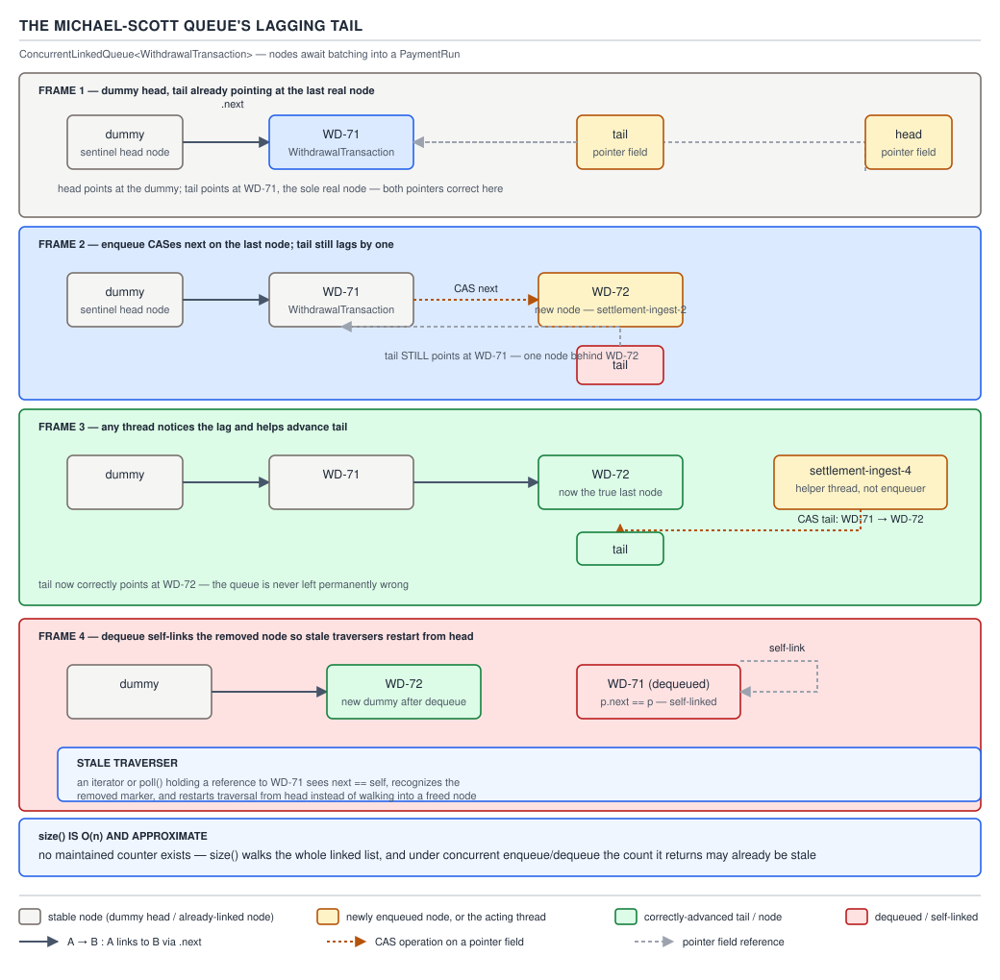

# 05 Multithreading and Concurrency — Queue internals — INTERNALS (§3.10, leaves 3.10.1–3.10.11)

**Target version: Java 21 LTS.** | **Part 3 of 5** | [Index](../00-index.md)
Previous: [Striped64, LongAdder and false sharing](../atomics/03-internals-striped64-and-false-sharing.md) · Next: [Executor and Future internals](05b-internals-executor-and-future-internals.md)

`java.util.concurrent`'s queues are the substrate under every executor and producer/consumer
pipeline in this topic. `ThreadPoolExecutor` (Part 3, next file) is a `BlockingQueue<Runnable>`
wrapped in worker-thread bookkeeping; the payment-run submission path, the withdrawal-approval
pipeline, and the bonus-expiry sweep are all, underneath, one of the queues in this file.
Understanding *how* they synchronize — not just their `Javadoc` — is what separates "I called
`poll()`" from reasoning about why a queue stalls at 3,400 settlements/sec.

### `ConcurrentLinkedQueue`: the Michael–Scott lock-free queue and its lagging tail

**Mental model.** Picture a singly linked list with two pointers, `head` and `tail`, both
`volatile`. `head` always points at a dummy node whose `next` is the real first element;
`tail` is *allowed to point one node behind the actual last node*. It is not a snapshot of
"where the queue currently ends" — it is a hint that every thread cooperatively keeps
approximately current, and any thread that notices it lagging fixes it for everyone.

**Why it exists.** A blocking queue backed by a lock is the obvious way to build a queue for
QuizStakes' bank-withdrawal pipeline, but a lock serializes *every* enqueue and dequeue behind
one mutex even when the operations touch opposite ends of the list and could, in principle,
proceed independently. `ConcurrentLinkedQueue` removes that lock entirely: enqueue and dequeue
each need only a single successful CAS to complete, contending only against other enqueuers or
other dequeuers, never against each other.

**When to reach for it, and when not.** Use it for an unbounded, non-blocking hand-off queue
where producers and consumers poll rather than park — a best-effort audit-event sink fed by
every service in §4 of the QuizStakes catalog, where a slow consumer must never apply
backpressure to a producer. Do **not** reach for it when a thread needs to *wait* for an
element: it has no blocking `take()`. The bank-withdrawal queue behind a `PaymentRun` needs a
worker to sleep until a transaction arrives — that is `LinkedBlockingQueue`, below — and
`size()` here is O(n) and approximate (leaf 3.10.3), ruling it out wherever an exact, fast
count of pending items is needed.

**How it works — the source walk.** The class javadoc (JDK 21, `ConcurrentLinkedQueue.java`)
states the algorithm outright: *"This implementation employs an efficient non-blocking
algorithm based on one described in Simple, Fast, and Practical Non-Blocking and Blocking
Concurrent Queue Algorithms by Maged M. Michael and Michael L. Scott."* The implementation
notes go further and justify the lag explicitly: *"Both head and tail are permitted to lag. In
fact, failing to update them every time one could is a significant optimization (fewer
CASes)... we use a slack threshold of two; that is, we update head/tail when the current
pointer appears to be two or more steps away from the first/last node."* `[PROVE]` The proof
that this is safe rather than merely fast: correctness of the queue depends only on the
*linked-list structure* (the `next` chain) being right, not on `tail` pointing at the true
last node. Any thread that walks off the end of `tail` finds `q == null` is false and instead
finds a further `next`, and simply continues walking — the lag costs at most one extra hop,
never a wrong answer. `[SOURCE]`

`offer()`, the enqueue path (quoted, JDK 21):

```java
public boolean offer(E e) {
    final Node<E> newNode = new Node<E>(Objects.requireNonNull(e));
    for (Node<E> t = tail, p = t;;) {
        Node<E> q = p.next;
        if (q == null) {
            if (NEXT.compareAndSet(p, null, newNode)) {
                // Successful CAS is the linearization point
                if (p != t) // hop two nodes at a time; failure is OK
                    TAIL.weakCompareAndSet(this, t, newNode);
                return true;
            }
        }
        else if (p == q)
            p = (t != (t = tail)) ? t : head;
        else
            p = (p != t && t != (t = tail)) ? t : q;
    }
}
```

Read line by line. `p` starts at the current `tail` and walks forward looking for the real
last node (`q == null`). The `NEXT.compareAndSet(p, null, newNode)` is the one CAS that
actually links the new node in — this is the **linearization point**: the instant this CAS
succeeds, the enqueue has logically happened, even though `tail` itself has not moved yet.
Immediately after, `if (p != t) TAIL.weakCompareAndSet(...)` is the "opportunistic help":
*if* this thread had to walk past the stale `tail` to find the real end, it also tries to
advance `tail` to the node it just inserted — and it does not care whether that CAS succeeds,
because whoever enqueues next will do the same walk-and-fix. The `p == q` branch handles a
self-linked (removed) node encountered mid-walk by restarting from `head` (see below).

`poll()`, the dequeue path and the self-link (quoted, JDK 21):

```java
public E poll() {
    restartFromHead: for (;;) {
        for (Node<E> h = head, p = h, q;; p = q) {
            final E item;
            if ((item = p.item) != null && p.casItem(item, null)) {
                // Successful CAS is the linearization point
                if (p != h) // hop two nodes at a time
                    updateHead(h, ((q = p.next) != null) ? q : p);
                return item;
            }
            else if ((q = p.next) == null) {
                updateHead(h, p);
                return null;
            }
            else if (p == q)
                continue restartFromHead;
        }
    }
}
```

The linearization point here is `p.casItem(item, null)` — nulling out the item field is what
makes the node logically dequeued, independent of whether `head` gets moved in the same call.
`updateHead(h, p)` is documented in the source as: *"Tries to CAS head to p. If successful,
repoint old head to itself as sentinel for succ(), below."* — this is the **self-link**
(leaf 3.10.2): the old head node's `next` field is set to point at *itself*, `p.next == p`.
`[SOURCE]`



**D-178** — The Michael–Scott queue's lagging tail.

**Insight:** the self-link is not cleanup, it is a **signal**. A thread that captured a
reference to a node before it was dequeued and unlinked will, on its next step, see
`p.next == p` and know unambiguously that `p` is stale garbage rather than a legitimate part
of the chain — the `p == q` branches in both `offer()` and `poll()` exist purely to detect
exactly this and restart traversal from the current `head`. Without the self-link, a stale
traverser could walk forever down a chain of nodes that have already been logically removed
and are no longer reachable from `head`, because nothing marks that chain as dead.

`[PROVE]` **Why `size()` is O(n) and approximate** (leaf 3.10.3): there is no maintained
counter, because maintaining one would require every `offer()`/`poll()` to also update a
shared field — reintroducing exactly the contention point the lock-free design exists to
avoid. `size()` (quoted, JDK 21):

```java
public int size() {
    restartFromHead: for (;;) {
        int count = 0;
        for (Node<E> p = first(); p != null;) {
            if (p.item != null)
                if (++count == Integer.MAX_VALUE)
                    break;
            if (p == (p = p.next))
                continue restartFromHead;
        }
        return count;
    }
}
```

It walks the entire live chain, counting non-null items — O(n) by construction — and the
javadoc states the consequence plainly: *"if elements are added or removed during execution of
this method, the returned result may be inaccurate."* A `size()` call racing with concurrent
`offer()`/`poll()` calls can under- or over-count; it was never a snapshot and the source does
not pretend otherwise.

`[PROVE]` `[RESEARCH]` **GC as the reclamation scheme** (leaf 3.10.4). The self-link trick, and
the whole lock-free design, is only safe because a thread that still holds a reference to a
removed node keeps that node's memory alive through ordinary garbage collection — there is no
window in which the JVM frees a node another thread might still dereference. The equivalent
algorithm in C++ needs **hazard pointers** or **epoch-based reclamation**: explicit bookkeeping
so a thread can publish "I am still looking at this node" before another thread may `free()`
it, because nothing else there guarantees the memory outlives every possible reader. Java's GC
already gives that guarantee for every object, for free, so Michael–Scott ports over unmodified
with no reclamation scheme bolted on — a genuine, citable advantage of managed memory for
lock-free structures, and one of the few places "Java has a GC" is the winning interview answer
rather than the caveat.

> **`ConcurrentLinkedQueue` is** the Michael–Scott lock-free queue: `head`/`tail` are volatile,
> `tail` is deliberately allowed to lag by one node so every enqueue costs one CAS instead of
> two, dequeued nodes are self-linked (`p.next == p`) so stale traversers detect staleness and
> restart, and the whole scheme is safe only because the GC — not hazard pointers — is the
> memory reclamation mechanism.

### `LinkedTransferQueue` and the dual-queue design

**Mental model.** A normal queue only ever holds data waiting for a consumer. A **dual queue**
can hold *either* data waiting for a consumer *or* a consumer's request waiting for data — never
both kinds at once, because the moment one kind is enqueued while the other kind is waiting,
the two are matched and removed together instead of one going onto the list.

**Why it exists.** `SynchronousQueue` needs a direct hand-off with zero storage; a plain
blocking queue needs storage but no hand-off. QuizStakes' stake-settlement path sometimes wants
a hybrid — if an operator's approval worker is already waiting, a withdrawal notification
should hand off immediately with no node touching memory, but if none is waiting it should
queue like an ordinary `LinkedBlockingQueue` rather than block the producer. `LinkedTransferQueue`
(Java 7) generalizes both behaviours in one implementation; `transfer()` blocks the producer
until a consumer has actually taken the element — stronger than `put()`, which only guarantees
storage.

**When to reach for it, and when not.** Reach for it when a producer needs to know its item was
*received*, not merely enqueued — `transfer()` — or for a queue that behaves like an unbounded
`LinkedBlockingQueue` under load but degrades to zero-copy hand-off under light load. Do not
default to it over `LinkedBlockingQueue`: the dual-mode logic costs more per operation, and most
pipelines never need the `transfer()` guarantee.

`[RESEARCH]` `[SOURCE]` **How it works.** The class documentation describes nodes that *"may
represent either data or requests. When a thread tries to enqueue a data node, but encounters a
request node, it instead 'matches' and removes it; and vice versa for enqueuing requests."*
Like `ConcurrentLinkedQueue`, it avoids CAS-ing `head`/`tail` on every operation: matched nodes
sit toward the front, unmatched toward the back, and the pointers only move once the true
position has drifted past a small **slack** threshold — the source's own comment puts the
empirically-chosen slack at one to three hops. `SynchronousQueue` (Java 6+) is described in its
own javadoc as *"extensions of the dual stack and dual queue algorithms described in
'Nonblocking Concurrent Objects with Condition Synchronization', by W. N. Scherer III and
M. L. Scott"* — the same family, minus the storage.

**Supporting fact — `SynchronousQueue`'s two implementations** (leaf 3.10.6). `[SOURCE]` A
`SynchronousQueue` never stores an element; every `put()` blocks until a matching `take()`
arrives, and vice versa. Its constructor picks the underlying transferer by fairness:

```java
public SynchronousQueue(boolean fair) {
    transferer = fair ? new TransferQueue<E>() : new TransferStack<E>();
}
```

`TransferStack` is LIFO and unfair — cheaper, but can starve an old waiter under sustained
load. `TransferQueue` is FIFO and fair — arrival order, at the cost of a heavier structure.
**Gotcha:** the no-arg constructor is unfair (a `TransferStack`); callers needing FIFO ordering
— serializing PSP payout callbacks so the oldest waiting settlement thread wins — must pass
`true` explicitly.

> **`LinkedTransferQueue`** is a dual-queue lock-free structure whose nodes are either data or
> requests and match on contact instead of always queuing; `SynchronousQueue` is the same
> family with zero storage, implemented as an unfair LIFO `TransferStack` or a fair FIFO
> `TransferQueue` chosen by the constructor's `fair` flag.

### `ArrayBlockingQueue` internals

**Mental model.** A single fixed-size circular array wrapped by exactly one `ReentrantLock`,
with two `Condition`s carved out of it — no lock-free cleverness here at all, and that is the
point: a bounded array queue is simple enough that one lock isn't a bottleneck at realistic
depths, and simplicity buys predictable, bounded memory with no per-element node allocation.

**Why it exists.** QuizStakes' bank-withdrawal queue behind a `PaymentRun` needs a hard cap —
accepting unbounded withdrawal requests into an in-memory queue while a banking-partner payout
window is closed would let memory grow without limit during an outage. `ArrayBlockingQueue`
gives that cap directly: `put()` blocks once `count == items.length` rather than accepting
without limit.

**When to reach for it, and when not.** Reach for it when the queue's maximum depth is a
capacity-planning decision, not an accident — sizing the bank-withdrawal queue to, say, one
banking-partner payout window's worth of transactions. Prefer `LinkedBlockingQueue` (below)
when unbounded depth is acceptable and enqueue/dequeue concurrency matters more than a hard
memory cap, since a single lock here serializes producers against consumers even though they
touch different array indices.

**How it works.** `[SOURCE]` `[BUILD]` Fields (quoted, JDK 21): the backing array, the two
circular indices, the live count, and the single lock with its two conditions:

```java
final Object[] items;
int takeIndex;
int putIndex;
int count;

final ReentrantLock lock;
private final Condition notEmpty;
private final Condition notFull;
```

The private `enqueue()` and `dequeue()` helpers do the actual array bookkeeping and signal the
*other* side's condition — `enqueue()` ends with `notEmpty.signal()`, `dequeue()` ends with
`notFull.signal()`. `put()` and `take()` are thin wrappers that wait on the condition that
means "there is nothing for me to do yet" before delegating:

```java
// put(), abbreviated to the wait/enqueue shape
while (count == items.length)
    notFull.await();
enqueue(e);

// take(), abbreviated to the wait/dequeue shape
while (count == 0)
    notEmpty.await();
return dequeue();
```

Because `takeIndex` and `putIndex` wrap circularly (`if (++putIndex == items.length) putIndex
= 0;`), the array is reused indefinitely without shifting elements — the entire structure is
one lock, one array, two integer cursors, and one shared `count`.

> **`ArrayBlockingQueue`** is a circular array behind one `ReentrantLock` with two `Condition`s
> carved from it; `put()` waits on `notFull` and signals `notEmpty`, `take()` waits on
> `notEmpty` and signals `notFull`, and the single lock means producers and consumers always
> serialize against each other even though they touch different slots.

### `LinkedBlockingQueue` internals: the two-lock split and its cascading signal

**Mental model.** Where `ArrayBlockingQueue` uses one lock for both ends, `LinkedBlockingQueue`
splits into **two independent locks** — `putLock` for the tail, `takeLock` for the head — so a
producer appending a node and a consumer removing one can genuinely run concurrently, provided
the queue is neither empty nor (if bounded) full. It is a linked list, so unbounded depth costs
nothing but per-node allocation.

**Why it exists.** `ArrayBlockingQueue`'s single lock is fine at low contention, but at
QuizStakes' bank-withdrawal-queue scale — feeding a `PaymentRun` while stake settlement runs at
3,400/sec elsewhere — forcing every producer to wait behind every consumer wastes concurrency
the workload doesn't need to give up. Splitting the lock lets `put()`/`take()` run in parallel
whenever the queue has both room and content.

**When to reach for it, and when not.** Default choice for a producer/consumer pipeline with
independent, roughly-balanced put/take rates and no hard need for array-backed cache locality.
Prefer `ArrayBlockingQueue` when the bound must be enforced with zero per-element allocation, or
when producer fairness matters more than throughput (its lock can be constructed fair;
`LinkedBlockingQueue` has no fairness option).

`[SOURCE]` **How it works.** Fields (quoted, JDK 21):

```java
private final int capacity;
private final AtomicInteger count = new AtomicInteger();

transient Node<E> head;
private transient Node<E> last;

private final ReentrantLock takeLock = new ReentrantLock();
private final Condition notEmpty = takeLock.newCondition();
private final ReentrantLock putLock = new ReentrantLock();
private final Condition notFull = putLock.newCondition();
```

`[PROVE]` **The two-lock proof obligation** (leaf 3.10.9) — this design only works because
`count` is shared state read and written under *two different locks*, so it cannot be a plain
`int`: a `put()` under `putLock` and a `take()` under `takeLock` can both observe and modify
`count` at the same physical instant, and only a single atomic variable — `AtomicInteger` —
gives that read-modify-write pattern a correct, race-free result without forcing both
operations under one lock, which would defeat the entire point of splitting them.

The **cascading signal** (leaf 3.10.8) is the mechanism that keeps the two halves coordinated
despite never sharing a lock. `signalNotEmpty()` and `signalNotFull()`:

```java
private void signalNotEmpty() {
    final ReentrantLock takeLock = this.takeLock;
    takeLock.lock();
    try {
        notEmpty.signal();
    } finally {
        takeLock.unlock();
    }
}

private void signalNotFull() {
    final ReentrantLock putLock = this.putLock;
    putLock.lock();
    try {
        notFull.signal();
    } finally {
        putLock.unlock();
    }
}
```

Notice `signalNotEmpty()` acquires `takeLock`, not `putLock` — `put()` calls it, but it briefly
crosses over to the *other* lock purely to safely signal the condition that lives there. `[PROVE]`
**Why a put must signal not-empty only on the 0→1 transition** (leaf 3.10.9): if every `put()`
signalled unconditionally, each one would pay the cost of acquiring `takeLock` even when
takers were already busy and had no need of a wakeup — wasted lock traffic on the hot path. By
signalling only when `count` goes from 0 to 1 (the queue was empty and a taker might be
parked), the common case of a already-flowing pipeline pays no cross-lock cost at all; the same
logic in reverse governs `signalNotFull()` on the *capacity → capacity-1* transition.
`fullyLock()`/`fullyUnlock()` acquire and release both locks together, in a fixed order
(`putLock` then `takeLock`), and exist solely for operations that must see a globally
consistent view — `size()`, bulk removal, iteration setup — never for ordinary `put`/`take`.

> **`LinkedBlockingQueue`** splits `put`/`take` across independent `putLock`/`takeLock` pairs
> for real producer-consumer concurrency, uses an `AtomicInteger count` because that field is
> the only state genuinely shared between the two locks, and signals the opposite lock's
> condition only on the 0→1 / capacity→capacity-1 transition to avoid needless cross-lock
> wakeups.

### Supporting facts

**`PriorityBlockingQueue` internals** (leaf 3.10.10). `[SOURCE]` `[X-REF 02]` Backed by a
binary heap in a plain resizable array, guarded by one `ReentrantLock` — no split locks, since
a heap has no natural head/tail split. The one wrinkle: growing the backing array happens
outside the main lock, guarded by a dedicated `allocationSpinLock` (CAS on an int acting as a
lock bit), so a resize in progress never blocks a taker removing the current head. **Gotcha:**
ordering follows the supplied `Comparator` or natural ordering, never insertion order — equal
elements have no guaranteed relative order, surprising callers expecting FIFO tie-breaking. The
heap mechanics themselves (sift-up/down, array doubling) are ordinary binary-heap material
covered in guide 02; only the synchronization is new here.

> A `PriorityBlockingQueue` is a binary heap array behind one lock, with resize gated by a
> separate spinlock so growth never blocks a taker.

### `DelayQueue` internals and the leader thread

**Mental model.** A `PriorityBlockingQueue`-shaped heap of elements ordered by their delay
expiry, plus one extra piece of state: a nominated **leader** thread. Only the leader ever
does a *timed* wait; every other waiter blocks indefinitely until explicitly woken. It is the
queue behind QuizStakes' bonus-expiry sweep — bonuses expire 30 days from grant, and a worker
pool needs to wake exactly when the next bonus in line actually expires, not poll on a fixed
interval.

**Why it exists.** Without the leader optimisation, every thread waiting on the queue's head
would independently time-wait for the same expiry. If ten workers are polling the bonus-expiry
queue, all ten wake when the head's delay elapses, race to grab it, and nine go back to sleep
having burned a wakeup and a lock acquisition for nothing — a **thundering herd**.

**When to reach for it, and when not.** Use it for exactly what it is built for: a "not before
time T" work queue — the bonus-expiry sweep, a stale-reservation reaper for stake reservations
that were never settled or voided within a timeout window. Do not use it for a queue with no
per-element readiness time; that is plain overhead versus `PriorityBlockingQueue` or
`LinkedBlockingQueue`.

`[PROVE]` `[SOURCE]` **How it works.** Fields (quoted, JDK 21):

```java
private final transient ReentrantLock lock = new ReentrantLock();
private final PriorityQueue<E> q = new PriorityQueue<E>();
private Thread leader;
private final Condition available = lock.newCondition();
```

`take()`, under `lock`, checks the head of `q`. If the head's delay has already elapsed, it is
removed and returned immediately — no waiting at all. Otherwise: if `leader == null`, the
calling thread claims leadership (`leader = thisThread`) and does
`available.awaitNanos(delay)` — a bounded, timed wait for exactly as long as remains until the
head expires. Any thread arriving while a leader already exists instead calls
`available.await()` with **no timeout**, parking indefinitely. In the `finally` block, a thread
that was leader clears `leader` back to `null` and, only if the queue is still non-empty, calls
`available.signal()` — waking exactly one follower, which then either finds a fresh head to
elapse (and takes it without waiting) or itself becomes the new leader for whatever is left.

`[PROVE]` This cannot lose a wakeup because leadership is cleared and a signal issued from the
*same* `finally` block that held the lock throughout the wait — no window exists where a leader
gives up leadership without also either taking the head itself or handing a signal to a
successor. Every parked follower is guaranteed to be woken by *some* future leader's `finally`
block, even one that was not leading when the follower first parked.

**Pitfall:** assuming every `DelayQueue` waiter does a timed wait, and thus that the queue
"polls" itself, misdiagnoses a stuck sweep — most threads are parked with **no timeout**, and
the fix is to check whether the leader thread died or was interrupted without running its
`finally` block, not to add more waiter threads.

> **`DelayQueue`** is a `PriorityQueue` heap behind one lock and one `Condition`, where only one
> nominated leader thread ever does a bounded timed wait on the head's remaining delay and
> every other waiter parks indefinitely, avoiding a thundering herd of simultaneous timed waits.

## Pitfalls

### Assuming `ConcurrentLinkedQueue.size()` is O(1) because most concurrent collections advertise cheap reads

**Wrong**
```java
ConcurrentLinkedQueue<Movement> auditSink = new ConcurrentLinkedQueue<>();
// fed continuously by every bonus grant/clawback, checked every settlement (3,400/sec)
if (auditSink.size() > 10_000) flushToLedgerAudit(auditSink);
```
Calling `size()` on the hot path walks the entire live chain every time — an O(n) traversal,
thousands of times a second, contending with the enqueues it is trying to measure.

**Right**
```java
AtomicInteger approxSize = new AtomicInteger();   // maintained alongside, not derived
// offer(m); approxSize.incrementAndGet();   /   poll(); approxSize.decrementAndGet();
if (approxSize.get() > 10_000) flushToLedgerAudit(auditSink);
```
Track an approximate counter alongside the queue instead of asking the queue itself.

**Why people believe it:** `ConcurrentHashMap.size()` and similar collections have made
"concurrent collection reads are cheap" feel like a blanket rule, and the Javadoc's own
warning is easy to skim past when the method signature looks like any other collection's.

### Assuming `LinkedBlockingQueue`'s two locks mean `put()` and `take()` never block each other

**Wrong**
```java
// belief: putLock and takeLock are fully independent, so put/take never interact
LinkedBlockingQueue<WithdrawalTransaction> q = new LinkedBlockingQueue<>(1);   // capacity 1
```
With capacity 1, a `put()` still blocks on `notFull` whenever the single slot is occupied — the
two-lock split only lets `put()`/`take()` proceed *concurrently when there is room*.

**Right**
```java
LinkedBlockingQueue<WithdrawalTransaction> q = new LinkedBlockingQueue<>();   // unbounded,
// or sized to the actual PaymentRun batch window, not to 1
```
Size the queue to the workload's real buffering need; the two-lock design buys concurrency
between the two ends, not immunity from the capacity contract either end still enforces.

**Why people believe it:** "two locks" reads as "producers and consumers never wait on each
other", conflating *lock* contention (reduced) with *capacity* contention (unchanged — still
governed by the shared `count`).

## Cheat sheet

| Queue | Lock model | Bound | Ordering | Key mechanism |
|---|---|---|---|---|
| `ConcurrentLinkedQueue` | Lock-free (CAS) | Unbounded | FIFO | Michael–Scott, lagging tail, self-link |
| `LinkedTransferQueue` | Lock-free (CAS) | Unbounded | FIFO | Dual queue: data/request nodes match on contact |
| `SynchronousQueue` | Lock-free (CAS) | Zero storage | LIFO (unfair) / FIFO (fair) | `TransferStack` / `TransferQueue`, chosen by `fair` |
| `ArrayBlockingQueue` | 1 `ReentrantLock`, 2 `Condition`s | Fixed array | FIFO | `enqueue`/`dequeue` signal the other condition |
| `LinkedBlockingQueue` | 2 locks (`putLock`/`takeLock`) | Optional | FIFO | `AtomicInteger count`, cascading signal on 0→1 / cap→cap-1 |
| `PriorityBlockingQueue` | 1 `ReentrantLock` + resize spinlock | Unbounded | Heap order | `allocationSpinLock` frees resize from the main lock |
| `DelayQueue` | 1 `ReentrantLock` + 1 `Condition` | Unbounded | Delay order | Leader thread: 1 timed wait, rest wait indefinitely |

## Self-test

**Q1.** Why is `ConcurrentLinkedQueue`'s `tail` deliberately allowed to lag behind the true
last node by up to one hop, rather than always pointing at it?

<details><summary>Answer</summary>

Keeping `tail` exact would need two CASes per enqueue — one to link, one to advance `tail`.
Allowing a one-node lag means the linking CAS alone completes the enqueue (the linearization
point); advancing `tail` becomes opportunistic — whichever thread notices the lag fixes it with
a `weakCompareAndSet` whose failure is ignored, since a later operation will fix it anyway.

</details>

**Q2.** What does `p.next == p` mean in `ConcurrentLinkedQueue`, and what does a thread that
encounters it do?

<details><summary>Answer</summary>

It marks node `p` as dequeued and self-linked — stale garbage, no longer part of the live
chain. A traverser that encounters `p == p.next` restarts from the current `head` instead of
falling off into a detached chain of dead nodes.

</details>

**Q3.** Why don't the JDK's lock-free queues need hazard pointers or epoch-based reclamation,
the way an equivalent C++ implementation would?

<details><summary>Answer</summary>

Hazard pointers and epoch reclamation exist to stop memory being freed while another thread
might still read it. Java's GC already guarantees no object is collected while any thread holds
a live reference — the Michael–Scott algorithm's safety depends entirely on stale nodes staying
valid until every referencing thread is done with them, which the JVM provides for free.

</details>

**Q4.** In `LinkedBlockingQueue`, why must `count` be an `AtomicInteger` rather than a plain
`int` guarded by one of the two locks?

<details><summary>Answer</summary>

`count` is read and modified from both `put()` (under `putLock`) and `take()` (under
`takeLock`), and the two locks give no mutual exclusion against each other. A plain `int`
across two independently-locked paths is a data race; `AtomicInteger` fixes that without
forcing both operations under one shared lock, preserving the throughput the split exists for.

</details>

**Q5.** Why does a `put()` on `LinkedBlockingQueue` signal `notEmpty` only when `count` goes
from 0 to 1, rather than after every successful enqueue?

<details><summary>Answer</summary>

Signalling `notEmpty` means crossing over to acquire `takeLock` — extra cost on an otherwise
independent path. If the queue was already non-empty, any waiting taker was already going to be
woken by a prior transition; only empty→one-element can possibly need a fresh wakeup.

</details>

**Q6.** What problem does the leader thread in `DelayQueue` solve, and what do non-leader
waiters do instead?

<details><summary>Answer</summary>

Without a leader, every waiter would independently time-wait for the head's remaining delay and
all wake simultaneously when it elapses — a thundering herd where only one finds useful work.
With a leader, only one thread does a bounded `awaitNanos(delay)`; every other waiter calls
`await()` with no timeout and stays parked until a leader's `finally` block signals it.

</details>

**Q7.** A `ConcurrentLinkedQueue.size()` call racing against concurrent `offer()`/`poll()`
sometimes disagrees with a manual count taken moments later. Is this a bug?

<details><summary>Answer</summary>

No. The javadoc states the O(n) traversal's result may be inaccurate under concurrent
modification — it was never a snapshot. Treat `size()` as approximate, never as a precise count
to branch correctness on.

</details>

**Q8.** Why does `SynchronousQueue`'s no-argument constructor choose the unfair `TransferStack`
rather than the fair `TransferQueue`?

<details><summary>Answer</summary>

`TransferStack` (LIFO) is lighter and gives higher throughput, at the cost of potentially
starving a long-waiting thread. The JDK defaults to throughput over fairness; a caller needing
FIFO ordering among waiters must explicitly pass `true` for the `TransferQueue` (fair) mode.

</details>

---

**Leaves covered:** 3.10.1–3.10.11 (11 leaves)
**Leaves deferred:** none
**Diagrams included:** D-178
**Target version:** Java 21 LTS
**Lines:** 599
