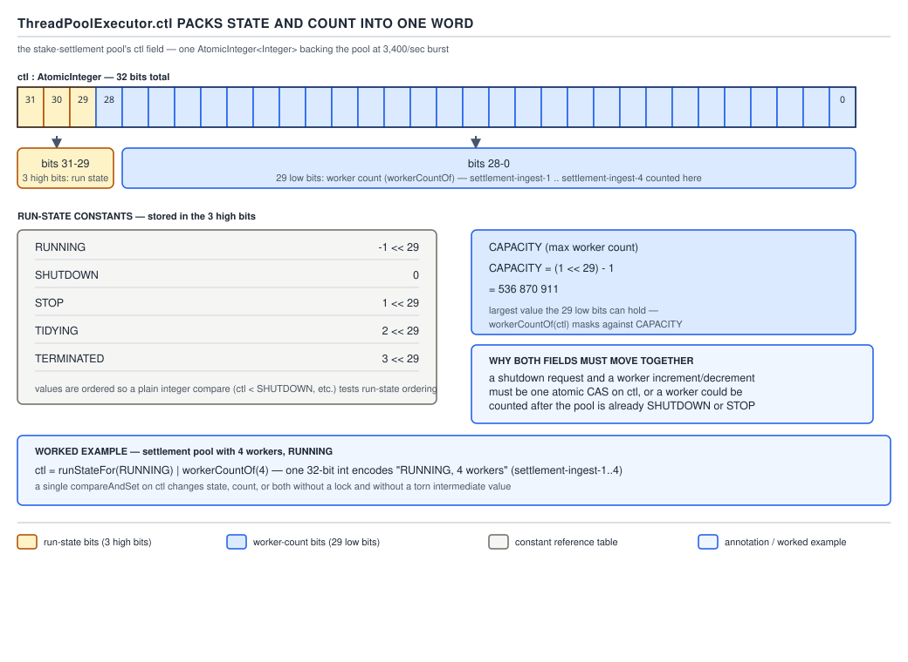
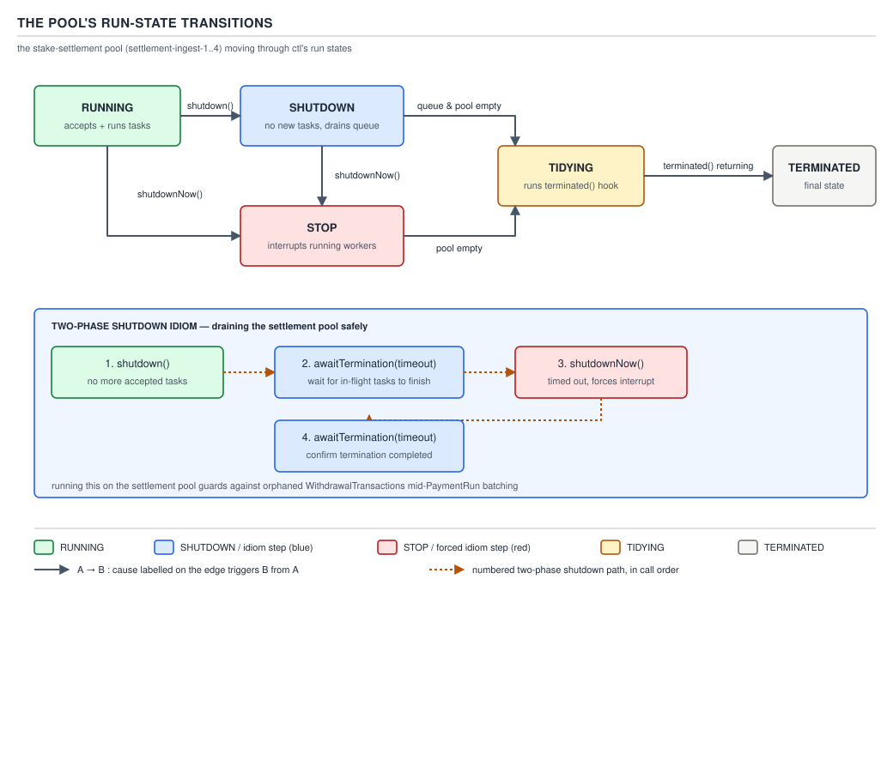
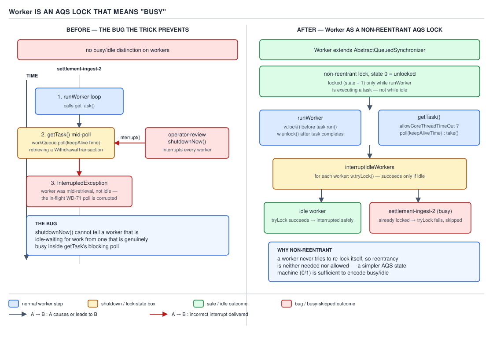
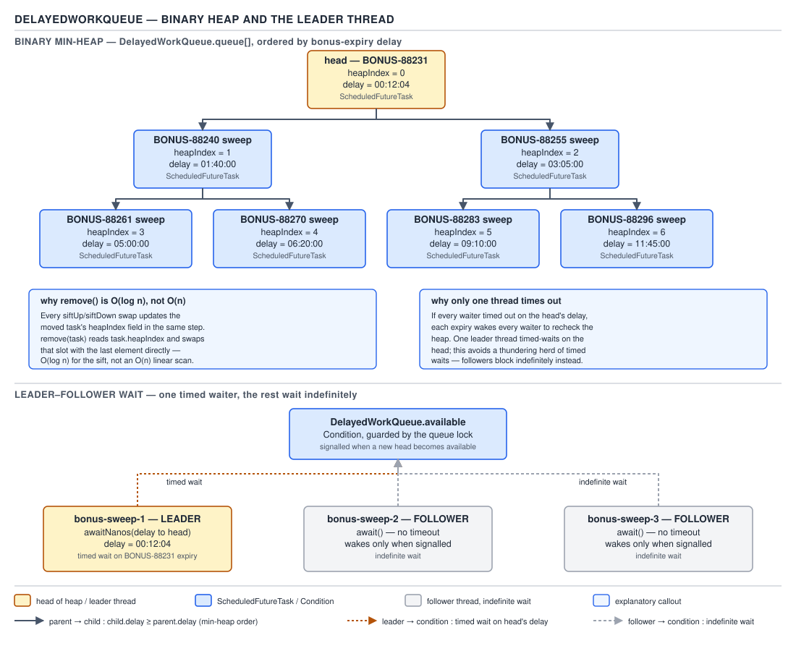
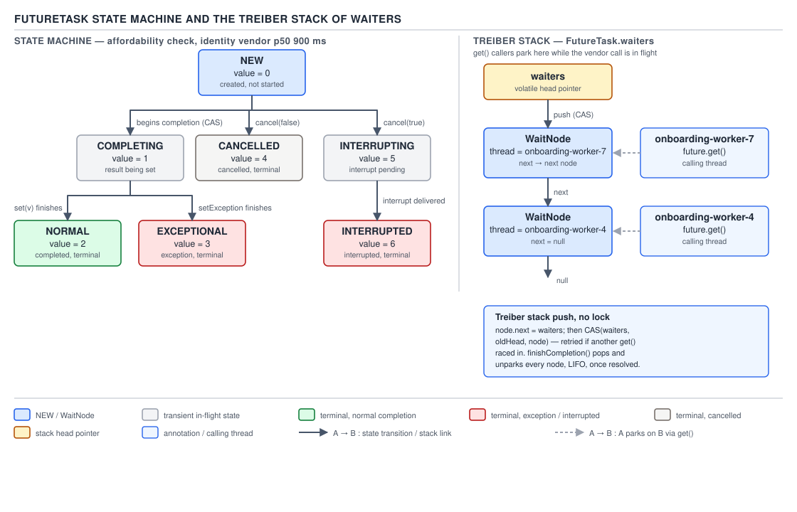
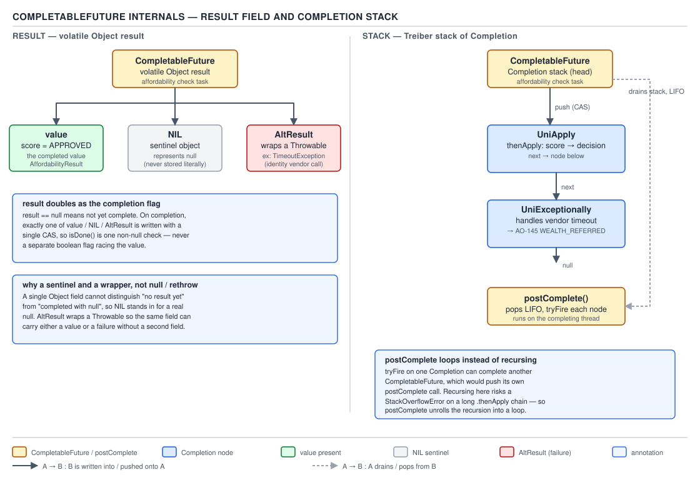

# 05 Multithreading and Concurrency — Executor and Future internals — INTERNALS (§3.10, leaves 3.10.12–3.10.24)

**Target version: Java 21 LTS.** | **Part 3 of 5** | [Index](../00-index.md)
Previous: [Queue internals](05a-internals-queue-internals.md) · Next: [ForkJoinPool and work stealing](../fork-join/02-internals-work-stealing.md)

Everything here lives inside `ThreadPoolExecutor`, `ScheduledThreadPoolExecutor`, `FutureTask`,
and `CompletableFuture`. The thread that runs `SettleStake` batches spends its life governed by
one packed integer and a lock that was never meant to protect data.

## `ctl`: one `AtomicInteger`, two questions answered at once

### Mental model, why it exists, when to reach for it

`ThreadPoolExecutor` must answer two questions atomically, every time a worker is born, dies, or
the pool changes phase: *what state is the pool in* and *how many workers exist right now*. Two
separate fields — `volatile int runState` and `volatile int workerCount` — cannot be updated
together without a lock, so the JDK authors pack both into one 32-bit `AtomicInteger` and update
them with a single CAS. Without this, code could transiently observe "SHUTDOWN with 3 workers"
then "RUNNING with 2 workers" from pure interleaving — a state that never really existed — and any
"is it safe to add a worker" decision needs state and count as one indivisible fact. You never
touch `ctl` directly (it is `private`); you reach for `getPoolSize()`, `isShutdown()`,
`isTerminating()`, `isTerminated()`, which decode it. The raw layout matters when reading a heap
dump or debugging a `shutdownNow` that interrupted the wrong threads.

### How it works — the bit layout

```java
private final AtomicInteger ctl = new AtomicInteger(ctlOf(RUNNING, 0));
private static final int COUNT_BITS = Integer.SIZE - 3;                 // 32 - 3 = 29
private static final int COUNT_MASK = (1 << COUNT_BITS) - 1;            // CAPACITY

// runState is stored in the high-order bits
private static final int RUNNING    = -1 << COUNT_BITS; // 0xE0000000
private static final int SHUTDOWN   =  0 << COUNT_BITS; // 0x00000000
private static final int STOP       =  1 << COUNT_BITS; // 0x20000000
private static final int TIDYING    =  2 << COUNT_BITS; // 0x40000000
private static final int TERMINATED =  3 << COUNT_BITS; // 0x60000000

private static int runStateOf(int c)     { return c & ~COUNT_MASK; }
private static int workerCountOf(int c)  { return c & COUNT_MASK; }
private static int ctlOf(int rs, int wc) { return rs | wc; }
```

`COUNT_BITS = 29` because `Integer.SIZE` is 32 and 3 bits are reserved for run state — five
values (`RUNNING`, `SHUTDOWN`, `STOP`, `TIDYING`, `TERMINATED`) fit in 3 bits with three values
spare. `CAPACITY = (1 << 29) - 1 = 536 870 911` `[NUM]` is therefore both the mask for extracting
the count and the maximum worker count the pool can ever hold — a limit nobody hits in practice,
but it is a real ceiling, not documentation fluff.

`RUNNING = -1 << 29` is deliberately the *only* negative run-state constant. In two's-complement,
`-1` is all-ones (`0xFFFFFFFF`), so `-1 << 29` sets the top 3 bits to `111` and the low 29 bits to
`0`. That makes `RUNNING` the numerically smallest `ctl` value for any given count, and every
other state (`SHUTDOWN = 0`, `STOP = 1<<29`, `TIDYING = 2<<29`, `TERMINATED = 3<<29`) numerically
larger — so `ctl.get() < SHUTDOWN` is a valid one-comparison test for "still running", and the run
states form a strictly increasing sequence you can compare with `<` instead of switching on an
enum. `[PROVE]`



**D-179** — `ThreadPoolExecutor.ctl` packs state and count.

**Why they are packed together, proved.** `addWorker` must check "still accepting work" and "room
for one more worker" as a single fact, or it races a concurrent `shutdown()`: with two fields, a
thread could read `workerCount < max` (true), get preempted, have `shutdown()` flip the state,
resume, and add a worker to a pool that just decided to stop — a worker stranded in `getTask()`
forever once the queue drains. With one `AtomicInteger`, `compareAndIncrementWorkerCount(c)` CASes
the *exact* `c` the state check just read; if state changed in between, the CAS fails and the
caller re-reads — atomicity the two-field version could not give. `[PROVE]`

**QuizStakes:** the stake-settlement pool's operator calls `shutdownNow()` mid-burst, at 3,400
settlements/sec. The pool's `ctl` at that instant might read `0x2000_0007` — top 3 bits `001`
(`STOP`), low 29 bits `7` (seven live workers), both decoded from one atomic read. The monitoring
dashboard can never observe "STOP with 7 workers" one tick and a stale "RUNNING with 7 workers"
the next — `ctl` cannot tear.

### Run-state transition graph

```java
advanceRunState(SHUTDOWN);   // shutdown(): only exit from RUNNING via "no new work"
advanceRunState(STOP);       // shutdownNow(): from RUNNING or SHUTDOWN
// tryTerminate(): SHUTDOWN -> TIDYING once queue AND pool are both empty
if (isRunning(c) || runStateAtLeast(c, TIDYING) ||
    (runStateOf(c) == SHUTDOWN && ! workQueue.isEmpty())) return;
if (workerCountOf(c) != 0) { interruptIdleWorkers(ONLY_ONE); return; }
if (ctl.compareAndSet(c, ctlOf(TIDYING, 0))) {
    try { terminated(); } finally { ctl.set(ctlOf(TERMINATED, 0)); termination.signalAll(); }
}
```

`RUNNING → SHUTDOWN` fires only from `shutdown()`: stop accepting new tasks, keep draining the
queue. `RUNNING → STOP` or `SHUTDOWN → STOP` fires only from `shutdownNow()`: stop accepting,
drain nothing, interrupt every worker. `SHUTDOWN → TIDYING` (or `STOP → TIDYING`) fires inside
`tryTerminate()` once both the queue and worker set are empty — the guard `workerCountOf(c) != 0`
first tries `interruptIdleWorkers(ONLY_ONE)` to wake one more idle worker so it notices the
shutdown and exits, rather than transitioning immediately. `TIDYING → TERMINATED` fires
unconditionally right after the user-overridable hook `terminated()` runs — the supported place to
release pool-wide resources, since it runs exactly once, between those two states. `[SOURCE]`



**D-180** — The pool's run-state transitions.

**Insight:** `tryTerminate()` is called from three unrelated places — the end of `shutdown()`,
`shutdownNow()`, and every `processWorkerExit()` — because "did the last termination condition
just become true" cannot be answered from a single call site; each caller re-checks the same
predicate, and whichever observes both conditions true performs the CAS.

## `execute()`'s double-check after enqueueing

```java
public void execute(Runnable command) {
    int c = ctl.get();
    if (workerCountOf(c) < corePoolSize) {
        if (addWorker(command, true)) return;
        c = ctl.get();
    }
    if (isRunning(c) && workQueue.offer(command)) {
        int recheck = ctl.get();
        if (! isRunning(recheck) && remove(command))
            reject(command);
        else if (workerCountOf(recheck) == 0)
            addWorker(null, false);
    }
    else if (! addWorker(command, false))
        reject(command);
}
```

Almost every blog reduces this to "core threads, then queue, then max threads, then reject" and
stops. The line that gets skipped is the **re-read of `ctl` after the successful `offer`**. A
task can be enqueued while the pool is `RUNNING`, and `shutdown()` can then run on another thread
*between* the `offer` and the recheck; without the recheck the task sits in the queue forever,
since `shutdown()` only wakes idle workers rather than scanning the queue for late arrivals. The
recheck catches exactly that race: if the pool stopped running, pull the task back out with
`remove(command)` and reject it; if the pool is still running but happens to have zero workers
(every worker exited between the `offer` and now, e.g. via `allowCoreThreadTimeOut`), spin up a
worker with a `null` first task so `getTask()` picks up the stranded task. `[SOURCE]` `[PROVE]`

**Pitfall:** assuming `execute()` is "check state once, then act". A task submitted at the exact
moment `shutdown()` runs concurrently can be enqueued and then silently orphaned if the recheck
is skipped — which is exactly the bug this code prevents, and exactly the detail every
from-memory whiteboard explanation of `ThreadPoolExecutor` omits.

## `Worker` is an AQS lock, not a data guard

### Mental model

`AbstractQueuedSynchronizer` (AQS) is normally introduced as the machinery behind
`ReentrantLock` — something protecting a critical section. `Worker` uses AQS for a completely
different purpose: it is a **non-reentrant lock whose locked/unlocked state means "this worker
thread is currently running a task"**. Nothing about task data is protected by it — the lock
exists purely so other code can ask, without touching the worker's execution state, "is this one
busy right now?"

```java
private final class Worker extends AbstractQueuedSynchronizer implements Runnable {
    final Thread thread;
    Runnable firstTask;
    volatile long completedTasks;

    Worker(Runnable firstTask) {
        setState(-1);                 // inhibit interrupts until runWorker starts
        this.firstTask = firstTask;
        this.thread = getThreadFactory().newThread(this);
    }

    protected boolean isHeldExclusively() { return getState() != 0; }

    protected boolean tryAcquire(int unused) {
        if (compareAndSetState(0, 1)) { setExclusiveOwnerThread(Thread.currentThread()); return true; }
        return false;
    }

    protected boolean tryRelease(int unused) {
        setExclusiveOwnerThread(null); setState(0); return true;
    }

    public void lock()        { acquire(1); }
    public boolean tryLock()  { return tryAcquire(1); }
    public void unlock()      { release(1); }
}
```

`setState(-1)` is a magic value, neither `0` (unlocked) nor `1` (locked) — it exists solely to make
`tryLock()` fail before `runWorker` calls `unlock()` once at the very start, resetting state to
`0`. That prevents `interruptIfStarted()` from interrupting a worker whose `Thread` exists but
whose `run()` has not started. `tryAcquire` is a single CAS, `0 → 1`, non-reentrant on purpose — a
worker never locks itself twice, and the whole point is a binary, externally-observable flag.
`[SOURCE]`

### Why it exists, and when the pattern is worth reusing

`shutdownNow()` should interrupt threads idle in `getTask()` — harmless, it just wakes the
blocking `take()` — but must **not** interrupt a thread mid-`SettleStake`, where interrupting can
leave ledger state half-applied. That "idle" vs. "busy" distinction needs a fast, lock-free,
externally queryable flag, and AQS already provides exactly that primitive, so the JDK authors
reused it instead of inventing a bespoke one. You never instantiate `Worker` yourself — it is
`private` — but the pattern (subclass AQS purely as a state flag, not a data guard) is worth
reaching for whenever you need a cheap, CAS-based, `tryLock`-queryable busy flag with no need for
reentrancy or condition queues.

### How it works — `interruptIdleWorkers`

```java
private void interruptIdleWorkers(boolean onlyOne) {
    final ReentrantLock mainLock = this.mainLock;
    mainLock.lock();
    try {
        for (Worker w : workers) {
            Thread t = w.thread;
            if (!t.isInterrupted() && w.tryLock()) {
                try { t.interrupt(); }
                catch (SecurityException ignore) {}
                finally { w.unlock(); }
            }
            if (onlyOne) break;
        }
    } finally { mainLock.unlock(); }
}
```

`w.tryLock()` is the whole mechanism. If the worker is mid-task, its lock is held (state `1`),
`tryAcquire` CASes `0 → 1` and fails, `tryLock()` returns `false`, and the loop **skips that
worker entirely** — no interrupt sent. If idle in `getTask()`'s blocking `take()`, the lock is
unlocked (state `0`), `tryLock()` succeeds, the interrupt is delivered, and the lock releases so
`runWorker`'s own `w.lock()` still works correctly afterward. `[SOURCE]` `[PROVE]`



**D-181** — `Worker` is an AQS lock that means "busy".

**Insight:** this is the entire mechanism behind "`shutdownNow()` does not interrupt a task
mid-flight." It falls straight out of `interruptIdleWorkers`'s `tryLock`, called identically by
`shutdown()` (`onlyOne=false`, idle workers only) and `shutdownNow()` (interrupts every worker it
can lock — busy ones stay protected by the same check). **QuizStakes:** an operator calls
`shutdownNow()` on the settlement pool while worker 4 is three lines into applying a
`SettleStake` ledger entry; its `Worker` lock is held, `tryLock()` returns `false`, and that
thread finishes writing uninterrupted — "best effort" is precisely this AQS check.

## `runWorker` / `getTask`

```java
final void runWorker(Worker w) {
    Thread wt = Thread.currentThread();
    Runnable task = w.firstTask; w.firstTask = null;
    w.unlock();                       // allow interrupts, state -1 -> 0
    boolean completedAbruptly = true;
    try {
        while (task != null || (task = getTask()) != null) {
            w.lock();                 // mark busy
            try { beforeExecute(wt, task); task.run(); }
            finally { afterExecute(task, null); task = null; w.completedTasks++; w.unlock(); }
        }
        completedAbruptly = false;
    } finally { processWorkerExit(w, completedAbruptly); }
}

private Runnable getTask() {
    boolean timedOut = false;
    for (;;) {
        int c = ctl.get();
        if (runStateAtLeast(c, SHUTDOWN) && (runStateAtLeast(c, STOP) || workQueue.isEmpty())) {
            decrementWorkerCount(); return null;
        }
        int wc = workerCountOf(c);
        boolean timed = allowCoreThreadTimeOut || wc > corePoolSize;
        if ((wc > maximumPoolSize || (timed && timedOut)) && (wc > 1 || workQueue.isEmpty())) {
            if (compareAndDecrementWorkerCount(c)) return null;
            continue;
        }
        try {
            Runnable r = timed ? workQueue.poll(keepAliveTime, TimeUnit.NANOSECONDS)
                                : workQueue.take();
            if (r != null) return r;
            timedOut = true;
        } catch (InterruptedException retry) { timedOut = false; }
    }
}
```

`w.lock()` brackets exactly the task execution — that CAS from `0 → 1` is what
`interruptIdleWorkers` observes as "busy". `getTask()` picks `poll` vs. `take` from `timed =
allowCoreThreadTimeOut || wc > corePoolSize`; a thread beyond `corePoolSize` (or every thread if
`allowCoreThreadTimeOut`) uses timed `poll(keepAliveTime,…)` and a timeout with the shrink
condition satisfied ends that worker — `keepAliveTime` actually enforced. A core thread with
`allowCoreThreadTimeOut == false` blocks in `take()` and never times out. `[SOURCE]`

## `processWorkerExit` and `completedTaskCount`

A task that throws propagates out of `task.run()`, so `completedAbruptly` stays `true`.
`processWorkerExit` folds `completedTaskCount += w.completedTasks`, removes the worker, and —
critically — calls `addWorker(null, false)` when `completedAbruptly` is true, which is why one
task throwing does not shrink the pool: the dead worker is replaced by a fresh one into `getTask()`.

## `ScheduledThreadPoolExecutor.DelayedWorkQueue`

A hand-rolled binary min-heap over `RunnableScheduledFuture`, ordered by `getDelay`. Unlike a
generic `PriorityQueue`-backed `DelayQueue`, each task stores `heapIndex` — its own position in
the backing array — so `remove(Object)` locates it directly instead of scanning: cancellation is
`O(log n)`, not `O(n)`. This matters when a scheduler running periodic reconciliation jobs
accumulates thousands of cancelled-but-unrun entries with `removeOnCancel` false. `[SOURCE]` `[NUM]`

It reuses the same **leader-follower** optimization as `DelayQueue` (full treatment in
[Queue internals](05a-internals-queue-internals.md), leaf 3.10.11): only the `leader` thread
waits with a bounded `awaitNanos` for the head's exact delay; every other waiter parks
indefinitely until signalled — at most one thread ever burns a timed wait.



**D-182** — `DelayedWorkQueue` and the leader thread.

## `ScheduledFutureTask.run()` and periodic re-enqueue

```java
public void run() {
    boolean periodic = isPeriodic();
    if (!canRunInCurrentRunState(periodic)) cancel(false);
    else if (!periodic) ScheduledFutureTask.super.run();
    else if (ScheduledFutureTask.super.runAndReset()) {
        setNextRunTime();
        reExecutePeriodic(outerTask);
    }
}
```

For a one-shot task, `run()` calls plain `FutureTask.run()`. For a periodic task it calls
`runAndReset()` instead — runs the body but leaves `FutureTask` in `NEW` rather than `NORMAL`, so
the same `Callable` can run again. `runAndReset()` returns `false` if the task threw, and the
`else if` chain simply never reaches `setNextRunTime()`/`reExecutePeriodic` — no separate
cancellation call, the chain just stops advancing. This is the entire mechanism behind "an
uncaught exception in `scheduleAtFixedRate` silently cancels all future runs." `[SOURCE]` `[PROVE]`

`setNextRunTime()` differs per mode: fixed-rate adds the period to the *previous scheduled time*
(wall-clock grid, catch-up bursts on a slow run); fixed-delay adds the delay to the *actual
completion time* (never overlaps, no catch-up). See `## Pitfalls` for the exception consequence.

## `FutureTask`'s state machine

```java
private volatile int state;
private static final int NEW          = 0;
private static final int COMPLETING   = 1;
private static final int NORMAL       = 2;
private static final int EXCEPTIONAL  = 3;
private static final int CANCELLED    = 4;
private static final int INTERRUPTING = 5;
private static final int INTERRUPTED  = 6;
```

Seven integer values, `[NUM]`. `COMPLETING` and `INTERRUPTING` are **transient** — no caller
observes them for long; they exist only to make the `NEW → {NORMAL, EXCEPTIONAL, CANCELLED,
INTERRUPTED}` transition appear atomic to `get()` even though setting the result and flipping
`state` are two separate writes. `set(V v)` does: CAS `state` `NEW → COMPLETING`, store the
result into `outcome`, then plain-store `state = NORMAL` — safe because `state` is read with
volatile semantics by `get()`, giving happens-before over the `outcome` write. `[SOURCE]`



**D-183** — `FutureTask`'s state machine, seven states with their integer values.

A Treiber stack of `WaitNode` nodes handles threads blocked in `get()`:

```java
private static final class WaitNode {
    volatile Thread thread;
    volatile WaitNode next;
    WaitNode() { thread = Thread.currentThread(); }
}
private volatile WaitNode waiters;
```

Each waiter CASes itself onto the head of `waiters` — a lock-free singly linked stack, simpler
than a Michael-Scott queue since there is no tail to coordinate, push is one CAS on the head.
`finishCompletion()`, run once the task settles, walks the whole stack, `unpark`s every waiter,
and clears `waiters` to `null`.

## `CompletableFuture` internals

### Mental model, and why it exists

Where `FutureTask` is a single-slot box with waiters parked on it, `CompletableFuture` is a
**dependency graph node**: a result slot plus a **Treiber stack of pending `Completion`
callbacks**, each itself a `CompletableFuture` waiting on this one. Completing it does not just
wake blocked `get()` callers — it pops and fires every registered
`thenApply`/`thenCompose`/`whenComplete` callback, each of which may complete *another* future,
whose own stack then fires, cascading down the chain. `Future.get()` is pull-based and blocking —
there is no way to say "run this when it's done" without a parked thread. `CompletableFuture`
needed a push-based model to support chaining and combining (`thenCombine`, `allOf`) without a
thread per pending callback, so it stores callbacks as data and fires them from whichever thread
happens to complete the future.

### How it works

```java
volatile Object result;       // null while incomplete
volatile Completion stack;    // Treiber stack of dependent actions

static final AltResult NIL = new AltResult(null);

static final class AltResult {
    final Throwable ex;
    AltResult(Throwable x) { this.ex = x; }
}
```

`result` is `null` while incomplete, the actual value when completed with a non-null value, or an
`AltResult` for **both** exceptional completion and normal completion with a `null` value —
`AltResult(null)` (the `NIL` sentinel) means "completed successfully with `null`". `[SOURCE]` This
is exactly why `result == null` unambiguously means incomplete: a completed-with-null future
stores `NIL`, never the raw Java `null` reference, in that field. `[SOURCE]`

Completion pushes onto and pops from `stack` with plain CAS loops (`tryPushStack`), the same
lock-free-stack pattern as `FutureTask`'s `WaitNode` list. `postComplete()`, called once a future
transitions to complete, pops the entire stack and calls `tryFire` on each `Completion`. `[SOURCE]`
`[PROVE]`

```java
final void postComplete() {
    CompletableFuture<?> f = this; Completion h;
    while ((h = f.stack) != null || (f != this && (h = (f = this).stack) != null)) {
        CompletableFuture<?> d; Completion t;
        if (f.casStack(h, t = h.next)) {
            if (t != null) {
                if (f != this) { pushStack(h); continue; }
                h.next = null;
            }
            f = (d = h.tryFire(NESTED)) == null ? this : d;
        }
    }
}
```

`tryFire(NESTED)` returning non-null `d` means firing that completion completed another
`CompletableFuture` (the next link in a `thenApply` chain) — instead of recursing into that
future's own `postComplete()`, which blows the stack on tens of thousands of chained calls, the
loop reassigns `f = d` and keeps iterating, turning recursion into iteration. `[SOURCE]` `[PROVE]`



**D-184** — `CompletableFuture` internals: `AltResult`, the Treiber completion stack, and
`postComplete`'s recursion-avoiding loop.

**QuizStakes:** a chain of 50,000 `CompletableFuture<Void>` stages over one day's ~19.8M
`LedgerEntry` reconciliation batch, each stage calling `thenRun(nextBatch)`. Without unrolling,
completing stage one recursively completes stage two inside stage one's frame, 50,000 frames
deep — guaranteed `StackOverflowError`. Unrolling resolves it in one loop, constant stack depth.

`ForkJoinPool.commonPool()` / `ASYNC_POOL`: every `*Async` method with no explicit executor uses
`commonPool()` if `parallelism > 1`, else a `ThreadPerTaskExecutor` spawning one `Thread` per task
— on a host pinned to a single usable core, `parallelism == 1` silently switches `thenApplyAsync`
from pool-reuse to a fresh thread per call. `[SOURCE]`

## Pitfalls

### Assuming `shutdownNow()` guarantees no task keeps running

**Wrong**

```java
executorService.shutdownNow();
processSettlementReport(); // assumes no writer is still active
```

`shutdownNow()`'s javadoc says "best-effort" precisely because a task that already holds the
`Worker` lock is skipped by `interruptIdleWorkers`'s `tryLock` check entirely — interrupting it
depends on that task's own code checking `Thread.interrupted()` or blocking interruptibly.

**Right**

```java
executorService.shutdownNow();
boolean finished = executorService.awaitTermination(30, TimeUnit.SECONDS);
if (!finished) log.warn("settlement pool did not drain within 30s of shutdownNow");
```

Wait on `awaitTermination` and treat `false` as "some worker did not cooperate."

**Why people believe it:** the name "now" implies immediacy, and for idle workers it genuinely is
— the idle/busy asymmetry is exactly the subtlety this file exists to explain.

### Assuming a periodic `ScheduledFuture` resumes after a thrown exception

**Wrong**

```java
scheduler.scheduleAtFixedRate(this::reconcileLedgerBatch, 0, 1, TimeUnit.MINUTES);
// assumption: if one run throws, the next scheduled run still fires
```

`runAndReset()` returns `false` on any uncaught `Throwable`, so the `else if` chain that would
call `setNextRunTime()`/`reExecutePeriodic` is never reached — the chain simply stops.

**Right**

```java
scheduler.scheduleAtFixedRate(() -> {
    try { reconcileLedgerBatch(); }
    catch (Exception e) { log.error("reconciliation batch failed, will retry next tick", e); }
}, 0, 1, TimeUnit.MINUTES);
```

Catch inside the task body so the chain always reaches `setNextRunTime()`.

**Why people believe it:** cron-like schedulers elsewhere typically resume after a failed run,
and this API gives no visible signal that it does not.

## Cheat sheet

| Fact | Value / mechanism |
|---|---|
| `ctl` layout | high 3 bits run state, low 29 bits worker count |
| `ctl` constants | `RUNNING=-1<<29 (0xE0000000)`, `SHUTDOWN=0`, `STOP=1<<29 (0x20000000)`, `TIDYING=2<<29 (0x40000000)`, `TERMINATED=3<<29 (0x60000000)` |
| `CAPACITY` | `(1<<29)-1` = `536 870 911` |
| Run-state order | `RUNNING < SHUTDOWN < STOP < TIDYING < TERMINATED` |
| `Worker` extends | `AbstractQueuedSynchronizer implements Runnable` — non-reentrant lock as busy flag |
| `interruptIdleWorkers` skips | any worker whose `tryLock()` fails (mid-task) |
| `getTask` blocking choice | `poll(keepAliveTime,…)` if `allowCoreThreadTimeOut \|\| wc>core`, else `take()` |
| A thrown task | still triggers `addWorker(null,false)` — pool self-heals worker count |
| `DelayedWorkQueue.remove` | O(log n) via stored `heapIndex`, not O(n) scan |
| `FutureTask` states | `NEW=0, COMPLETING=1, NORMAL=2, EXCEPTIONAL=3, CANCELLED=4, INTERRUPTING=5, INTERRUPTED=6` |
| `FutureTask` waiters | Treiber stack of `WaitNode` |
| `CompletableFuture.result` | `null`=incomplete; value; or `AltResult` (exception, or `NIL` for null-value success) |
| `CompletableFuture` callbacks | Treiber stack of `Completion`, fired by `postComplete()` |
| `postComplete` stack safety | iterative loop reassigning `f = d`, not recursion |
| Async-method pool | `commonPool()` if `parallelism > 1`, else one `Thread` per task |

## Self-test

**Q1.** Why is `RUNNING` defined as `-1 << 29` instead of some positive small constant?

<details><summary>Answer</summary>

So the five run states form a strictly increasing sequence (`RUNNING < SHUTDOWN < STOP < TIDYING
< TERMINATED`) regardless of worker count, letting code use `ctl.get() < SHUTDOWN` to mean "still
running" instead of masking and switching.

</details>

**Q2.** What does the re-read of `ctl` immediately after `workQueue.offer(command)` inside
`execute()` protect against?

<details><summary>Answer</summary>

A race where the pool transitions out of `RUNNING` between the successful `offer` and the
recheck. The recheck removes and rejects the just-enqueued task if the pool stopped, or spins up
a replacement worker if the worker count dropped to zero — either case would otherwise strand
the task in the queue.

</details>

**Q3.** Why does `Worker` extend `AbstractQueuedSynchronizer` when it protects no shared data
structure?

<details><summary>Answer</summary>

Its held/unheld state is repurposed as a lock-free, CAS-able "busy" flag. `runWorker` holds the
lock only while executing a task; `interruptIdleWorkers` uses `tryLock()` to skip any worker
holding it — how `shutdownNow()` avoids interrupting a thread mid-task without a separate field.

</details>

**Q4.** A `ScheduledThreadPoolExecutor` periodic task throws an uncaught `RuntimeException` on its
third run. What happens to runs four onward?

<details><summary>Answer</summary>

They never fire. `runAndReset()` returns `false` on a thrown exception, so the `else if` chain
that would call `setNextRunTime()`/`reExecutePeriodic()` is never reached — the periodic chain
silently stops.

</details>

**Q5.** Name the two situations `CompletableFuture`'s `result` field being an `AltResult` covers.

<details><summary>Answer</summary>

Exceptional completion (wraps the `Throwable`) and normal completion with a `null` value
(`AltResult(null)`, the `NIL` sentinel). Both need the wrapper because `result == null` is
reserved to mean "not yet complete".

</details>

**Q6.** Why does `postComplete()` reassign `f = d` instead of calling `d.postComplete()`
recursively when firing a `Completion` completes another future?

<details><summary>Answer</summary>

To keep stack depth constant regardless of chain length — a long chain would otherwise recurse
one frame per stage, guaranteeing `StackOverflowError`. Unrolling into an iterative loop makes
chain length irrelevant to stack usage.

</details>

---

**Leaves covered:** 3.10.12–3.10.24 (13 leaves)
**Leaves deferred:** none
**Diagrams included:** D-179, D-180, D-181, D-182, D-183, D-184
**Target version:** Java 21 LTS
**Lines:** 600
