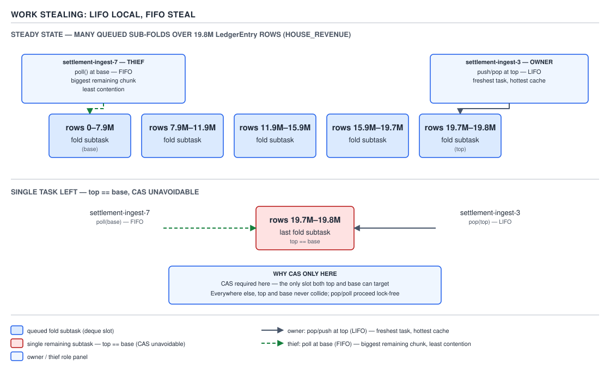
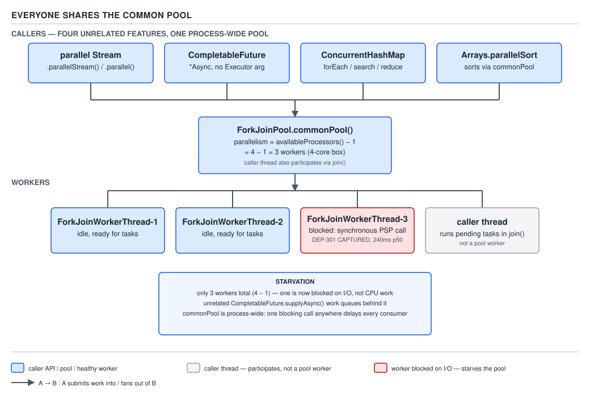

# 05 Multithreading and Concurrency — Fork/join — BASICS (§1.22)

**Target version: Java 21 LTS.** | **Part 1 of 5** | [Index](../00-index.md)
Previous: [CompletableFuture — executors, timeouts and lifecycle](../completable-future/01b-basics-executors-timeouts-lifecycle.md) · Next: [ThreadLocal](../thread-local/01-basics.md)

Fork/join is what a parallel stream, `CompletableFuture.supplyAsync`, and `ConcurrentHashMap`'s
bulk operations all quietly run on top of. QuizStakes' nightly reconciliation job — folding
~19.8M `LedgerEntry` rows for one day to recompute the `HOUSE_REVENUE` total — is exactly the
shape fork/join was built for: one big array, one associative combine, no shared mutable state,
recursively splittable.

### The divide-and-conquer skeleton

**Mental model.** Picture a single `LedgerEntry[]` for the day as one long shelf. Fork/join treats
it the way a person sorting a warehouse would: keep splitting the shelf in half until each half is
small enough to scan by hand, scan the small pieces, then walk back up combining partial totals
into the final one. The recursion tree *is* the parallelism — there is no separate scheduling step.

**Why it exists.** Before fork/join (added in Java 7, JSR 166y), recursive divide-and-conquer work
had no good concurrent primitive. Hand-rolling it with a fixed `ThreadPoolExecutor` and
`Future.get()` starves quickly: every level of recursion submits new tasks and blocks a pool
thread waiting on them, so a thread pool sized for N cores locks up after N nested `get()` calls.
Fork/join's answer is **work stealing**: a worker that would otherwise block on `join()` instead
executes other queued work, so blocking never removes a thread from the available pool.

**When to reach for it, and when not.** Fork/join is for CPU-bound, recursively decomposable work
with a `join()` dependency between subtasks — reducing an array, walking a tree, a
divide-and-conquer sort. It is the wrong tool for independent tasks with no combine step (plain
`ExecutorService` is simpler and avoids deque/steal overhead entirely — see 1.22.16) and the wrong
tool for I/O-bound work (see 1.22.12). `Executors.newWorkStealingPool()` sits in between: it is
backed by a `ForkJoinPool` for the stealing behaviour but is meant for independent, never-joined
tasks (1.22.9).

**How it works.** `RecursiveTask<V>.compute()` (or `RecursiveAction.compute()` for no return value)
follows one shape: if the slice is small enough, compute it directly (the **sequential base
case**); otherwise split it, `fork()` one half so another worker can steal it, compute the other
half on the current thread, then `join()` the forked half and combine. `[PROVE]`: forking the
*second* half and computing the first inline, rather than forking both, means the calling thread
never idles waiting for two stolen results — it always has its own subtask to make progress on
while the fork sits in the deque for a thief. `fork(); fork(); join(); join();` forks both halves,
so the calling thread has nothing left to compute — it can only wait, wasting the very thread that
should be doing work. The right pattern is always **fork one, compute the other, join one**:

```java
public final class HouseRevenueFoldTask extends RecursiveTask<Money> {

    private static final int SEQUENTIAL_THRESHOLD = 4_000; // see 1.22.13

    private final LedgerEntry[] entries;
    private final int from;   // inclusive
    private final int to;     // exclusive

    public HouseRevenueFoldTask(LedgerEntry[] entries, int from, int to) {
        this.entries = entries;
        this.from = from;
        this.to = to;
    }

    @Override
    protected Money compute() {
        int length = to - from;
        if (length <= SEQUENTIAL_THRESHOLD) {
            return sumSequentially();
        }
        int mid = from + length / 2;
        HouseRevenueFoldTask right = new HouseRevenueFoldTask(entries, mid, to);
        right.fork();                              // hand the right half to a thief
        Money leftTotal = new HouseRevenueFoldTask(entries, from, mid).compute(); // do the left half now
        Money rightTotal = right.join();           // wait for (or help finish) the right half
        return leftTotal.plus(rightTotal);
    }

    private Money sumSequentially() {
        Money total = Money.zero(Currency.GBP);
        for (int i = from; i < to; i++) {
            LedgerEntry entry = entries[i];
            if (entry.position() == LedgerPosition.HOUSE_REVENUE) {
                total = total.plus(entry.amount());
            }
        }
        return total;
    }
}
```

Driven with `ForkJoinPool.commonPool().invoke(new HouseRevenueFoldTask(entries, 0, entries.length))`.

> **Definition:** Fork/join is a work-stealing framework for recursive, CPU-bound tasks: `fork()`
> hands a subtask to the pool, `join()` retrieves its result while helping with other queued work
> instead of blocking, and every worker's own deque holds its still-unforked or forked-but-not-yet-
> stolen tasks.

**Family.** `ForkJoinTask<V>` is the abstract root. `RecursiveAction` computes with no return value
(a side-effecting sweep). `RecursiveTask<V>` returns a value (the fold above). `CountedCompleter<T>`
is completion-based — it triggers `onCompletion()` when a pending-count reaches zero rather than
being `join()`ed, useful when a subtask should propagate results without a thread ever blocking on
it. This file treats `RecursiveTask` as the workhorse; `CountedCompleter` is a supporting fact only
here, expanded in the INTERNALS file.

### Work stealing: LIFO-local, FIFO-steal

**Mental model.** Every worker thread owns a double-ended queue (deque) of `ForkJoinTask`s, not a
shared queue. The owner treats its own deque like a stack — push and pop at the same end (`top`).
A thief treats every *other* worker's deque like a queue — it only ever takes from the opposite
end (`base`).

**Why it exists.** A shared work queue across all workers would need a lock (or CAS ring) on every
push and pop, and it would destroy cache locality — the task a worker just created is the one most
likely to still be hot in that worker's cache, but a shared FIFO queue would hand it to whichever
worker happens to dequeue next. Per-worker deques with opposite-end access solve both problems at
once.

**When to reach for it, and when not.** This is not a choice the caller makes — it is `ForkJoinPool`'s
internal task-storage discipline, contrasted here against a single shared queue (what a naive
hand-rolled work-stealing implementation would reach for, and why it loses).

**How it works, and why LIFO-local / FIFO-steal is the right pair.** `[PROVE]` Two competing goals:

1. **The owner wants locality and low overhead.** The most recently forked task is the one whose
   inputs (the `LedgerEntry` slice, the loop counters) are still in L1/L2 cache for this worker.
   Popping from `top` — the same end just pushed to — gets that task back before it goes cold, and
   because only the owner ever touches `top` under normal conditions, most pushes and pops need no
   synchronization at all.
2. **The thief wants the *biggest* remaining chunk, and minimum contention with the owner.**
   Recursive splitting means the deque holds tasks ordered smallest-forked-most-recently (at
   `top`) to largest-forked-earliest (at `base`) — because each `compute()` call forks the second
   half and only recurses further on tasks it computes itself, so the earliest forks in a deque
   are always the coarsest-grained work still outstanding. Stealing from `base` therefore hands
   the thief the largest available slice, minimising the number of steals needed to redistribute
   an unbalanced load. Stealing from `base` also physically separates thief access from owner
   access (`top`) — the two only collide when the deque holds exactly one task, which is the one
   case that needs a CAS to resolve who wins it. Every other push, pop, and steal proceeds without
   contention.

If the pairing were reversed — thieves stealing from `top` — a thief would take the *smallest,
freshest* task, evicting it from the cache that made it fast in the first place, while
simultaneously colliding with the owner on every steal. LIFO-local / FIFO-steal is the only pairing
that gets both properties (locality for the owner, big-chunk low-contention stealing for the
thief) simultaneously.



**D-091** — Work stealing: LIFO local, FIFO steal.

**Insight:** the single-CAS case in the diagram — one task left in a deque, owner popping from
`top` while a thief polls `base` and both land on the same slot — is not an edge case to special-
case away. It is the *only* place fork/join needs atomic coordination on the fast path; everything
else is uncontended by construction.

**Interview:** "Why does the owner use LIFO but a thief uses FIFO?" — locality for the owner
(freshest task, hottest cache, no synchronization needed), biggest-remaining-chunk and least
contention for the thief (steals from the opposite end, so the two only ever compete for one slot).

### The common pool: width and who else uses it

**Mental model.** `ForkJoinPool.commonPool()` is a single, JVM-wide, lazily-initialized pool that
every unconfigured parallel construct in the JDK shares — you almost never construct a
`ForkJoinPool` yourself in application code.

**Why it exists.** Before the common pool (Java 8), every JDK feature that wanted internal
parallelism — parallel streams, `CompletableFuture`'s no-executor async methods — would either
need its own private pool (wasteful, and now there are N pools each undersized for the machine) or
push pool management onto the caller. The common pool gives the whole JVM one correctly-sized,
shared pool instead.

**When to reach for it, and when not.** Reach for the common pool implicitly, by using
`parallelStream()`, `CompletableFuture.supplyAsync(fn)` with no executor argument, or
`Arrays.parallelSort`. Do *not* reach for it explicitly when the work can block on I/O (1.22.12) or
when work from unrelated parts of the application would contend for the same fixed-width pool —
build a dedicated `ForkJoinPool` instead, sized and isolated for that workload.

**How it works.** `[NUM]` The common pool's target parallelism defaults to
`Runtime.getRuntime().availableProcessors() - 1`. On a 4-core box: `4 − 1 = 3` common-pool worker
threads. The `− 1` is deliberate, not a rounding artifact: the thread that calls into the common
pool — e.g. the thread that calls `parallelStream().sum()` — **participates directly** as a
compute-bound worker for the duration of that call (via `ForkJoinPool.managedBlock`-style
internal help, or simply by executing `compute()` inline before joining). So the effective
parallelism for that one call is `3 workers + 1 caller = 4`, matching the 4 cores exactly.
Parallelism is tunable with the system property
`java.util.concurrent.ForkJoinPool.common.parallelism`. The common pool's threads are daemon
threads, are created via `ForkJoinPool.commonPool()`'s internal `ForkJoinWorkerThreadFactory`, and
are never explicitly shut down — they live for the process lifetime (`shutdown()` on the common
pool is a no-op).

**Every consumer of the common pool shares that same fixed width** — a parallel stream, an
unconfigured `CompletableFuture.*Async` call, `ConcurrentHashMap`'s bulk operations
(`forEach`, `search`, `reduce` with a parallelism threshold), and `Arrays.parallelSort` all queue
onto the same 3 (on a 4-core box) worker deques.



**D-092** — Everyone shares the common pool.

**Pitfall:** treating the common pool as free, unlimited parallelism. A reconciliation job that
runs `entries.parallelStream()` on the ledger fold while, on the same box, an unrelated
`CompletableFuture.supplyAsync(...)` call and a `ConcurrentHashMap.forEach` bulk scan are also in
flight, are all fighting over the same 3 worker threads. The symptom is not an exception — it is
silently worse latency than the "parallel" label promised, because the pool has no notion of which
caller's work matters more.

`[RESEARCH]` `common.maximumSpares` bounds how many *extra* compensating threads the common pool
may create beyond target parallelism when workers block via `ManagedBlocker` or a compensated
`join()`; its documented default in the Java 21 `ForkJoinPool` javadoc is **256**, tunable via
`java.util.concurrent.ForkJoinPool.common.maximumSpares`.

### ManagedBlocker

**Mental model.** `ForkJoinPool.ManagedBlocker` is a permission slip: it tells the pool "this
worker is about to block for a real reason, so if you need to maintain target parallelism, go
ahead and spin up one more thread while I'm out."

**Why it exists.** Fork/join sizes its worker count for *compute*-bound work — parallelism equals
core count (minus one, for the common pool). A worker that blocks on I/O or on an external lock
without telling the pool simply disappears from the available pool for that duration, and nothing
compensates: the remaining workers do not know a slot has gone idle-but-not-free. `ManagedBlocker`
gives fork/join the hook it needs to compensate correctly.

**When to reach for it, and when not.** Reach for it only when a fork/join task must genuinely
block (waiting on a bank-partner payout-file callback socket, for instance) and cannot be
restructured as pure compute followed by an async continuation. Prefer restructuring the task to
avoid blocking entirely — a `CompletableFuture` chain off the blocking call is nearly always
better inside a fork/join task than `ManagedBlocker`, because compensation still burns a
thread-creation cost and adds one more thread the JVM must schedule.

**How it works.** `[SOURCE]` The interface, from the Java 21 `ForkJoinPool` javadoc:

```java
public static interface ManagedBlocker {
    boolean block() throws InterruptedException;
    boolean isReleasable();
}
```

`isReleasable()` must return `true` if blocking is unnecessary — checked first, so a blocker whose
condition is already satisfied never blocks at all. `block()` performs the actual block "if
necessary (perhaps internally invoking `isReleasable` before actually blocking)" and returns `true`
once no further blocking is needed. A worker calls `ForkJoinPool.managedBlock(blocker)`, which the
pool uses as the signal to compensate — attempting to start or reactivate a spare thread so target
parallelism is maintained while the calling worker is parked.

`[BUILD]` A `ManagedBlocker` around a synchronous wait for a bank-partner payout-file acknowledgement
inside a fork/join task:

```java
public final class PayoutFileAckBlocker implements ForkJoinPool.ManagedBlocker {

    private final CountDownLatch ackReceived;

    public PayoutFileAckBlocker(CountDownLatch ackReceived) {
        this.ackReceived = ackReceived;
    }

    @Override
    public boolean block() throws InterruptedException {
        ackReceived.await(45, TimeUnit.SECONDS); // p99 payout-file ack, per style packet
        return isReleasable();
    }

    @Override
    public boolean isReleasable() {
        return ackReceived.getCount() == 0;
    }
}

// inside a RecursiveAction.compute():
ForkJoinPool.managedBlock(new PayoutFileAckBlocker(ackLatch));
```

`[RESEARCH]` `CompletableFuture.join()` called from inside a common-pool worker already triggers an
internal compensation path comparable to `ManagedBlocker` — the JDK's own `CompletableFuture`
implementation calls into the pool's compensation machinery so that a chain of `.thenApplyAsync()`
stages joined from within the pool does not silently starve it. Application code blocking on a
raw `Lock`, `Socket`, or `Thread.sleep` gets no such help automatically — it must call
`ForkJoinPool.managedBlock` itself, exactly why 1.22.12 is a `[TRAP]`.

**Pitfall:** blocking I/O inside a `compute()` body with no `ManagedBlocker`. Say a
`RecursiveAction` opens a socket read against the identity-verification vendor per leaf instead of
computing over an in-memory `LedgerEntry[]`. With 3 common-pool workers (4-core box) and p99
latency of 38 seconds against that vendor, three blocked leaves stall the entire pool for up to 38
seconds — every other queued task, including unrelated parallel-stream and
`CompletableFuture` work sharing the pool, waits behind them. `ManagedBlocker` is the only supported
fix short of moving the blocking work off fork/join entirely.

> **Definition:** `ManagedBlocker` is the fork/join API for telling the pool "I am about to block
> for real" so it can compensate by starting a spare worker, keeping compute-bound parallelism at
> its target level while the blocking thread is unavailable.

### The sequential threshold

**Mental model.** The threshold is the line where "split further" stops paying for itself — below
it, the cost of forking a task (allocation, queue push, potential steal, join) outweighs the work
being split.

**Why it exists / gotcha.** Split all the way down to single-element tasks and the fork/join
bookkeeping dominates: creating a `HouseRevenueFoldTask` object, pushing and later popping it from
a deque, and joining it, costs vastly more than summing a handful of `LedgerEntry` rows directly.
Split too coarsely and there is not enough parallelism to use the available cores — a 4-core box
computing two halves of 9.9M rows each gets only 2-way parallelism no matter how many workers are
idle.

**How it's chosen.** `[NUM]` The standard rule of thumb is **100 to 10,000 basic operations per
leaf task** — for the ledger fold, "basic operation" is one row's read-plus-compare-plus-add, so a
threshold in the low thousands (`SEQUENTIAL_THRESHOLD = 4_000` in the code above) keeps each leaf's
real work several orders of magnitude above the per-fork overhead while still producing thousands
of leaf tasks across 19.8M rows — far more than enough to keep 3–4 workers saturated and load-
balanced via stealing. There is no single correct number: it depends on how expensive one
iteration's body is, and the right move in production code is to benchmark a few thresholds on
representative data rather than trust a rule of thumb blindly.

> **Definition:** the sequential threshold is the leaf-task size below which `compute()` stops
> recursing and switches to a plain sequential loop, chosen so per-task overhead stays negligible
> next to the work it wraps.

### Supporting facts

**`ForkJoinPool` constructors (1.22.8).** The simple constructor takes just a parallelism level.
The full constructor (Java 9+) adds a `ForkJoinWorkerThreadFactory`, an
`UncaughtExceptionHandler`, an `asyncMode` flag, and four Java-9-specific tuning knobs:
`corePoolSize`, `maximumPoolSize`, `minimumRunnable` (the minimum number of workers the pool tries
to keep running even under heavy blocking), and a `saturate` predicate invoked when the pool
cannot create another compensating thread and must decide whether to run the blocked task anyway
or throw. `[RESEARCH]` Gotcha: `corePoolSize` on `ForkJoinPool` does not mean what it means on
`ThreadPoolExecutor` — it bounds warm idle threads, not a floor below which tasks queue instead of
running.

> **Definition:** the Java-9 constructor exposes the same compensation machinery `ManagedBlocker`
> relies on, as explicit tuning knobs, for callers who need to bound how far the pool will grow.

**`asyncMode` and work-stealing pools (1.22.9).** `[RESEARCH]` Passing `asyncMode = true` makes
every worker's own queue **FIFO instead of LIFO** — appropriate for tasks that are fire-and-forget
event handlers, never `fork()`ed-and-`join()`ed in the divide-and-conquer sense. This is exactly
what `Executors.newWorkStealingPool()` configures internally: a `ForkJoinPool` in async mode,
intended for independent event-style tasks rather than recursive compute.

> **Definition:** `asyncMode` trades the owner's cache-locality benefit of LIFO for FIFO fairness,
> appropriate only when tasks have no join dependency on each other.

**Exception handling (1.22.14).** An exception thrown inside `compute()` is captured by the task
and rethrown from `join()` directly (unchecked, wrapped only if the original was checked) and from
`get()` wrapped in `ExecutionException`, matching `Future`'s contract. `getException()` returns the
captured throwable without rethrowing; `completeExceptionally(Throwable)` lets external code fail
a task early; `isCompletedAbnormally()` reports whether the task finished via exception or
cancellation.

> **Definition:** `ForkJoinTask` exception propagation mirrors `Future`, with `join()` rethrowing
> unwrapped and `get()` wrapping in `ExecutionException`.

**Bulk driving operations (1.22.15).** `ForkJoinTask.invokeAll(t1, t2)` forks and joins a fixed set
of tasks in one call. `ForkJoinTask.invoke()` runs a single task to completion, blocking the
caller. `helpQuiesce()` lets a worker assist with any outstanding work until none remains rather
than idling. `pool.awaitQuiescence(timeout, unit)` blocks the calling thread (not a worker) until
the pool has no active or queued tasks, or the timeout elapses — useful for a caller that submitted
many independent top-level tasks and wants a single join point.

> **Definition:** these are the batch and quiescence primitives layered on top of individual
> `fork()`/`join()` pairs for driving multiple tasks or waiting out an entire pool.

**Fork/join versus a plain executor (1.22.16).** Fork/join earns its keep specifically for
recursive, CPU-bound, non-blocking work with an internal `join()` dependency between subtasks —
the ledger fold above. For a batch of *independent* tasks with no combine step (send 3,400
settlement-confirmation emails, say), a plain `ExecutorService` is simpler, has no deque-stealing
overhead to pay for, and does not tie up common-pool capacity that parallel streams and
`CompletableFuture` also depend on.

| | `ForkJoinPool` | `ThreadPoolExecutor` |
|---|---|---|
| Task shape | Recursive, splittable, joined | Independent, flat |
| Queue discipline | Per-worker deque, LIFO-local/FIFO-steal | One shared queue |
| Blocking a task | Starves without `ManagedBlocker` | Fine — just occupies one thread |
| Sizing | CPU-core-bound (`availableProcessors − 1` for common pool) | Sized for I/O-wait ratio |
| Best fit | Ledger fold, tree walk, `parallelSort` | Independent I/O calls, fire-and-forget jobs |

## Pitfalls

### Assuming `fork(); fork(); join(); join();` is just a style choice

**Wrong**

```java
protected Money compute() {
    if (length <= SEQUENTIAL_THRESHOLD) return sumSequentially();
    HouseRevenueFoldTask left = new HouseRevenueFoldTask(entries, from, mid);
    HouseRevenueFoldTask right = new HouseRevenueFoldTask(entries, mid, to);
    left.fork();
    right.fork();
    return left.join().plus(right.join()); // calling thread now does zero compute of its own
}
```

**Right**

```java
protected Money compute() {
    if (length <= SEQUENTIAL_THRESHOLD) return sumSequentially();
    HouseRevenueFoldTask right = new HouseRevenueFoldTask(entries, mid, to);
    right.fork();
    Money left = new HouseRevenueFoldTask(entries, from, mid).compute(); // caller stays busy
    return left.plus(right.join());
}
```

**Why people believe it:** both halves are "forked" symmetrically in the wrong version, which
looks more parallel and more elegant. It is strictly worse — the calling thread does no useful
work of its own and only waits, wasting exactly the thread capacity fork/join exists to keep busy.

### Treating blocking I/O inside `compute()` as harmless

**Wrong**

```java
protected Money compute() {
    // ... splits down to a leaf, then:
    IdentityVerdict verdict = identityVendorClient.verifySync(personId); // blocks, up to 38s p99
    return verdict.isClear() ? processedTotal() : Money.zero(Currency.GBP);
}
```

**Right**

```java
protected Money compute() {
    CountDownLatch done = new CountDownLatch(1);
    identityVendorClient.verifyAsync(personId, verdict -> done.countDown());
    ForkJoinPool.managedBlock(new IdentityVerdictBlocker(done)); // pool compensates
    return processedTotal();
}
```

**Why people believe it:** a single blocking call looks cheap in isolation, and it *is* cheap when
only one leaf blocks. The failure only shows up under load, when enough leaves block
simultaneously to exceed the pool's compensation-free capacity — by which point the pool feels
"randomly slow" rather than obviously broken.

## Cheat sheet

| Fact | Value / rule |
|---|---|
| Fork pattern | fork one, compute the other inline, join |
| Owner access | `top`, LIFO (freshest task, hottest cache) |
| Thief access | `base`, FIFO (biggest remaining chunk, least contention) |
| CAS needed | only when exactly one task remains in a deque |
| Common pool parallelism | `availableProcessors() − 1`; caller participates too |
| Tune common pool width | `-Djava.util.concurrent.ForkJoinPool.common.parallelism=N` |
| `common.maximumSpares` default | 256 (compensating threads beyond target parallelism) |
| Common pool consumers | parallel streams, unconfigured `CompletableFuture.*Async`, `ConcurrentHashMap` bulk ops, `Arrays.parallelSort` |
| Common pool threads | daemon, never explicitly shut down |
| Blocking without compensation | starves the pool — use `ManagedBlocker` |
| Sequential threshold rule of thumb | 100–10,000 basic ops per leaf |
| `asyncMode = true` | worker queues become FIFO — for independent, never-joined tasks |
| `join()` exceptions | rethrown directly, unwrapped |
| `get()` exceptions | wrapped in `ExecutionException` |
| Right tool for independent, non-joined tasks | plain `ExecutorService`, not fork/join |

## Self-test

**Q1.** Why does `compute()` fork the second half and compute the first half inline, rather than
forking both halves?

<details><summary>Answer</summary>

Forking both halves leaves the calling thread with nothing of its own to compute — it can only
wait on two joins, wasting the very thread capacity fork/join is designed to keep busy. Computing
one half inline means the caller is always doing useful work while the forked half either gets
stolen or, if no thief is available, gets picked back up by the caller itself when it reaches
`join()`.

</details>

**Q2.** Why does a worker pop its own tasks from the same end (`top`) it pushes to, while a thief
pulls from the opposite end (`base`)?

<details><summary>Answer</summary>

Two goals, one deque. The owner wants cache locality and near-zero synchronization: the most
recently forked task is still hot in the owner's cache, and popping from the same end just pushed
to means only the owner normally touches `top`. A thief wants the largest remaining chunk to
minimise the number of steals needed, and recursive forking means the coarsest-grained,
earliest-forked tasks sit at `base` — so stealing from `base` gets the biggest chunk while also
physically separating thief traffic from owner traffic, so the two only ever contend when exactly
one task is left.

</details>

**Q3.** On an 8-core box, how many common-pool worker threads exist by default, and what is the
effective parallelism for a single `parallelStream()` call made from the main thread?

<details><summary>Answer</summary>

`availableProcessors() − 1 = 8 − 1 = 7` common-pool workers. The calling thread participates
directly in that call's compute, so effective parallelism for that one call is `7 + 1 = 8`,
matching the core count.

</details>

**Q4.** A `RecursiveAction` calls a synchronous socket read against the watchlist provider with no
`ManagedBlocker`. On a 4-core box under load, what happens to unrelated `parallelStream()` calls
running concurrently elsewhere in the same JVM?

<details><summary>Answer</summary>

They stall. The blocking leaf occupies one of the 3 common-pool workers without any compensation,
and because every unconfigured parallel construct shares the same fixed-width common pool, enough
simultaneously-blocked leaves can starve the pool for everyone — including work that has nothing
to do with the blocking call. `ManagedBlocker` is the supported fix; it tells the pool to spin up a
compensating thread instead of quietly losing a slot.

</details>

**Q5.** What does `ManagedBlocker.isReleasable()` do, and why is it checked separately from
`block()`?

<details><summary>Answer</summary>

`isReleasable()` reports whether blocking is unnecessary right now — checked first (and again
inside `block()`) so that a blocker whose condition is already satisfied returns immediately
without ever actually parking the thread or triggering pool compensation. Separating it from
`block()` lets the pool cheaply poll readiness without the cost of an actual block/compensate
cycle every time.

</details>

**Q6.** Why is a threshold of, say, 5 rows too small for the `HouseRevenueFoldTask` ledger fold,
and why is a threshold of 10,000,000 (roughly the whole day's row count) too large?

<details><summary>Answer</summary>

At 5 rows per leaf, the cost of allocating a task object, pushing/popping it from a deque, and
potentially stealing and joining it swamps the few nanoseconds of actual summing work — overhead
dominates. At 10,000,000, the very first split produces only two leaf tasks for the whole day's
19.8M rows, so no more than 2-way parallelism is ever achieved regardless of how many cores or
workers are available — the work is too coarse to load-balance.

</details>

**Q7.** What is the practical difference between `ForkJoinTask.join()` throwing an exception and
`ForkJoinTask.get()` throwing one?

<details><summary>Answer</summary>

`join()` rethrows the captured exception directly (unchecked; a checked exception is wrapped), so
callers inside `compute()` bodies see it as-is. `get()` follows the `Future` contract and always
wraps the captured exception in `ExecutionException`, because `get()` is the API shared with
ordinary `Future`s and must preserve that contract.

</details>

**Q8.** Why is `Executors.newWorkStealingPool()` still built on a `ForkJoinPool`, even though it is
meant for independent, never-joined tasks rather than recursive compute?

<details><summary>Answer</summary>

It reuses the work-stealing deque machinery for load balancing across workers, but configures
`asyncMode = true`, switching every worker's queue to FIFO. That trades away the owner's LIFO cache
locality benefit — which only matters for recursively forked-and-joined tasks — in exchange for
fair, in-order handling of independent event-style tasks, which is the shape it targets.

</details>

---

**Leaves covered:** 1.22.1–1.22.16 (16 leaves)
**Leaves deferred:** none
**Diagrams included:** D-091, D-092
**Target version:** Java 21 LTS
**Lines:** 565
