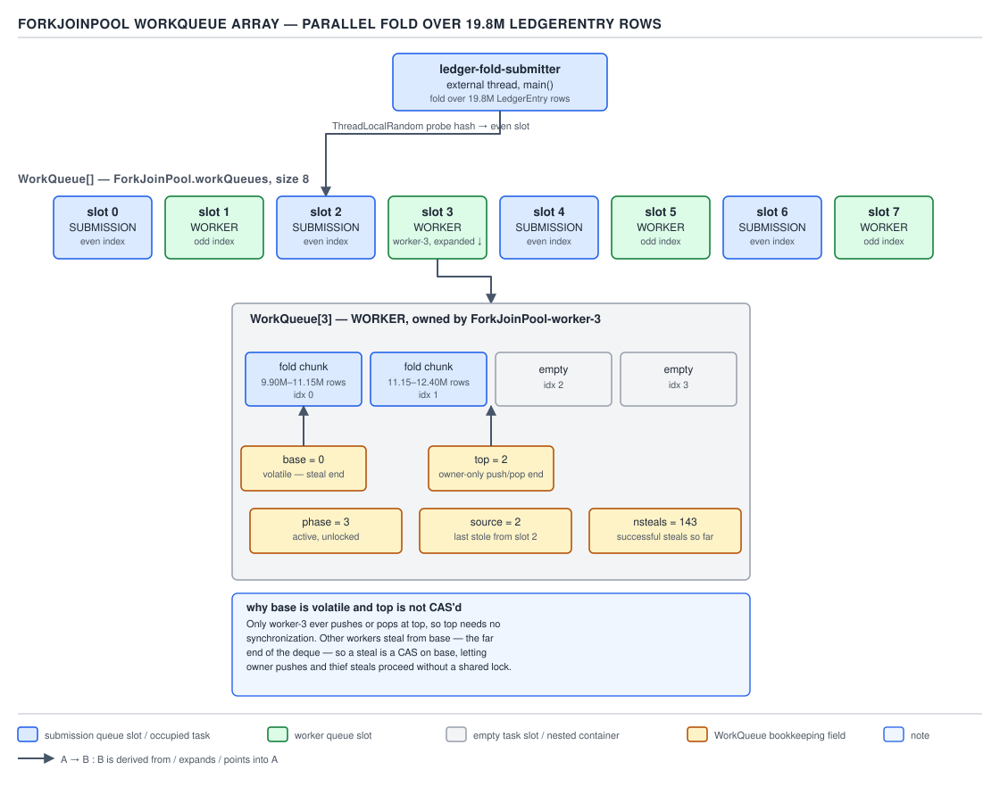
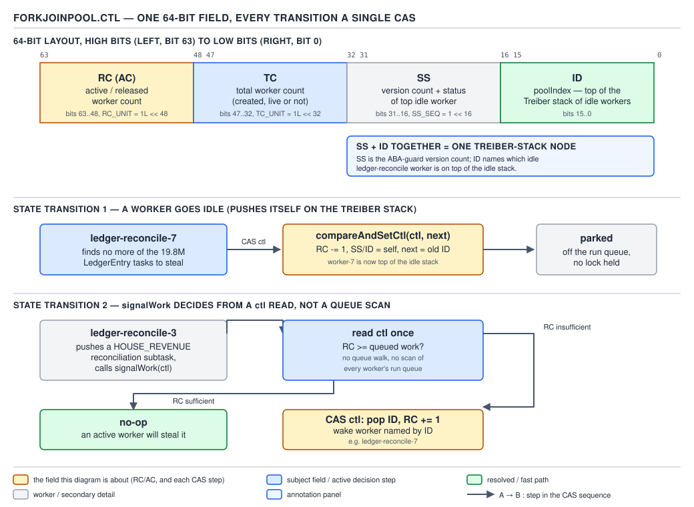
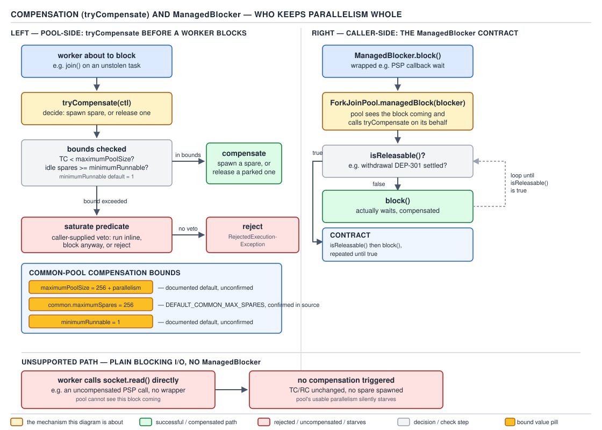
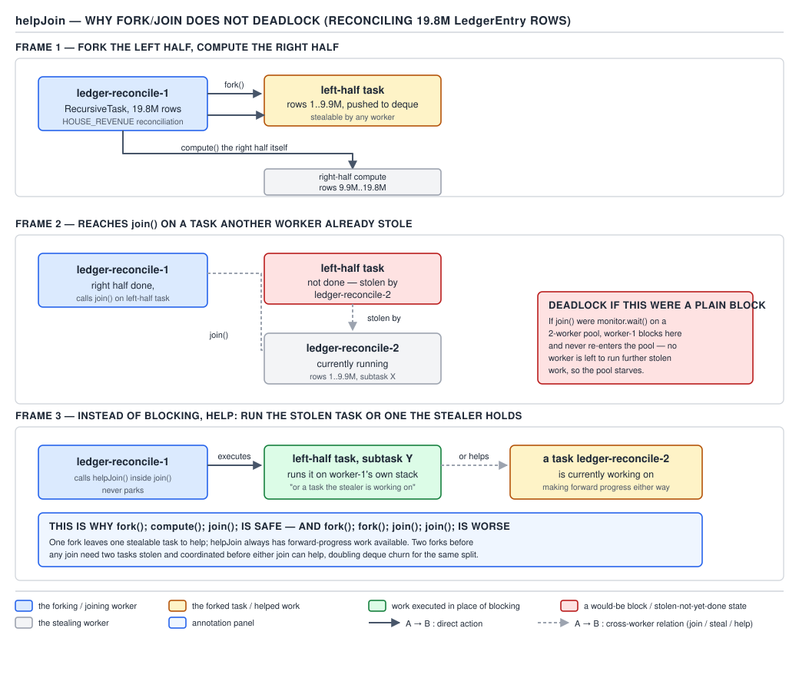
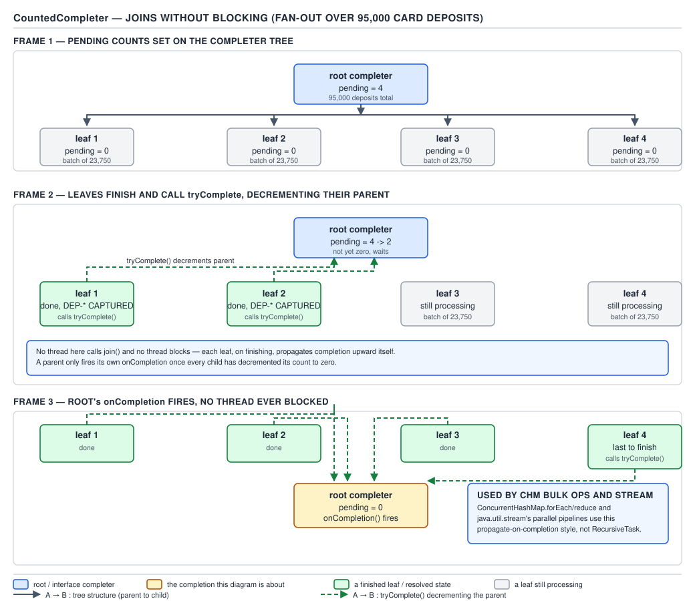

# 05 Multithreading and Concurrency — ForkJoinPool and work stealing — INTERNALS (§3.11, leaves 3.11.1–3.11.16)

**Target version: Java 21 LTS.** | **Part 3 of 5** | [Index](../00-index.md)
Previous: [Executor and Future internals](../executors/05b-internals-executor-and-future-internals.md) · Next: [Continuations and mounting](../virtual-threads/03a-internals-continuations-and-mounting.md)

`ForkJoinPool` looks like `ThreadPoolExecutor` from the outside — submit a task, get a result —
but internally it is a different machine: no shared blocking queue, no single `ctl` integer, and
workers mostly steal from each other rather than pull from a common line.

## Hierarchy: what owns what

| Component | Role |
|---|---|
| `ForkJoinPool` | Owns `WorkQueue[]`, `ctl`, worker lifecycle. One per JVM by default (`commonPool()`). |
| `WorkQueue` | One per worker (odd slots) or external submitter (even slots). Owns its own deque. |
| `ForkJoinWorkerThread` | Runs `scan`/`runWorker` against its own `WorkQueue`, steals from others when idle. |
| `ForkJoinTask` | Unit of work — `RecursiveTask`, `RecursiveAction`, `CountedCompleter` all extend it. |

## The `WorkQueue` array and the deque protocol

### Mental model, why it exists, when to reach for it

Picture 2,800 stake reservations arriving per second at peak, each spawning a fork/join task tree
for a settlement fold. A single shared queue would force every worker to contend on one lock for
every task handoff — every recursive split pushes a task, every completion pops one, and
centralizing that would serialize the parallelism the pool exists to provide. `ForkJoinPool`
instead gives **each worker its own deque**, and workers only touch each other's deques when they
run dry, stealing from the *opposite* end from where the owner works. Ownership plus
opposite-end stealing is the entire performance case for fork/join over a general thread pool for
divide-and-conquer work, and is what makes the common case essentially lock-free. Reach for
`ForkJoinPool`/`RecursiveTask` when a problem decomposes recursively into independent subtasks of
comparable size — a parallel fold over a day's ~19.8M `LedgerEntry` rows. Do not reach for it when
tasks block on I/O (§3.11.15 below) or the work does not decompose — a `ThreadPoolExecutor` with a
bounded queue is the right tool for a flat stream of independent `SettleStake` callbacks.

### How it works

```java
// ForkJoinPool.java, jdk-21+35 — external submitters at even queue indices, workers at odd
volatile WorkQueue[] queues;

static final class WorkQueue {
    volatile int base;          // next slot for poll (steal end)
    int top;                    // next slot for push (owner end)
    ForkJoinTask<?>[] array;    // circular task array, power-of-two sized
    final ForkJoinWorkerThread owner;
    volatile int phase;         // active/inactive + version, ties into ctl's idle stack
    int source;                 // index of queue this worker last stole from
    int nsteals;                // steal count, for load-balancing/statistics
}
```

`base` is `volatile` because thieves CAS it; `top` is a plain `int` since only the owner writes it.
`[SOURCE]`

The owner pushes and pops at `top` with **no CAS in the common case** — a plain store to the array
slot plus a release fence to publish it, then an increment of `top`:

```java
final boolean push(ForkJoinTask<?> task) {
    ForkJoinTask<?>[] a = array; int s = top;
    a[(a.length - 1) & s] = task;      // plain store, index via mask (power-of-two size)
    top = s + 1;
    if (s - base == 0) signalWork();   // was empty before this push: wake an idle worker
    return true;
}
```

A thief, working from the opposite end, must CAS because multiple thieves can race for the same
last element:

```java
final ForkJoinTask<?> poll() {
    for (;;) {
        int b = base, s = top;
        if (s - b <= 0) return null;                          // empty
        ForkJoinTask<?> t = array[(array.length - 1) & b];
        if (base == b) {
            if (t != null) { if (weakCompareAndSetBase(b, b + 1)) return t; }
            else if (s - b == 1) return null;                 // stale read, only element vanished
        }
    }
}
```

Owner and thief only contend when the queue has exactly one element — the only case where `top`'s
region and `base`'s region overlap. `[SOURCE]` `[PROVE]`



**D-185** — The `ForkJoinPool` queue array: even slots for external submitters, odd slots for
worker deques, owner pushing/popping at `top`, thieves stealing from `base`.

```java
class SettlementFold extends RecursiveTask<Money> {
    private final List<LedgerEntry> entries;
    private final int lo, hi;
    private static final int THRESHOLD = 2_000;

    SettlementFold(List<LedgerEntry> entries, int lo, int hi) {
        this.entries = entries; this.lo = lo; this.hi = hi;
    }

    @Override
    protected Money compute() {
        if (hi - lo <= THRESHOLD) {
            Money sum = Money.zero(Currency.GBP);
            for (int i = lo; i < hi; i++) sum = sum.plus(entries.get(i).amount());
            return sum;
        }
        int mid = (lo + hi) >>> 1;
        SettlementFold left = new SettlementFold(entries, lo, mid);
        left.fork();                                     // pushes onto this worker's own queue
        Money rightResult = new SettlementFold(entries, mid, hi).compute();
        return left.join().plus(rightResult);             // join may steal-help, see below
    }
}
```

`left.fork()` is the owner-side `push` shown above — a plain store, no CAS.

**Why this is the classic Arora–Blumofe–Plaxton (ABP) work-stealing deque, proved.** The owner
always pushes/pops at `top` (LIFO — most-recently-forked task first, preserving cache locality
since the deepest, smallest subtasks run first). Thieves always steal from `base` (FIFO from the
thief's view — the *oldest*, typically *largest* remaining task, amortizing the fixed steal cost
over more work). This LIFO-local/FIFO-steal split is the ABP deque's defining property and bounds
the number of steals: with `P` workers, work `T1`, and critical-path length `T∞`, expected running
time is `O(T1/P + T∞)`, since each steal either completes work or shortens the remaining span, and
a potential-function argument caps "unproductive" steals by the span. `[PROVE]` `[RESEARCH]`

## `ctl`: `ForkJoinPool`'s 64-bit control word

### Mental model

Where `ThreadPoolExecutor` packs two numbers into 32 bits, `ForkJoinPool` packs three fields plus
a Treiber-stack pointer into one 64-bit `long` — a work-stealing pool has three counters that must
move together: active workers, total workers, and which idle worker unparks next.

### How it works

```java
// ctl bit layout (jdk-21+35, ForkJoinPool.java)
//   AC (active count)     : bits 48-63, signed, offset from parallelism
//   TC (total count)      : bits 32-47, signed, offset from parallelism
//   id/version of top of idle-worker Treiber stack : bits 0-31
volatile long ctl;

private static final int  TC_SHIFT   = 32;
private static final int  AC_SHIFT   = 48;
private static final long TC_MASK    = 0xffffL << TC_SHIFT;
private static final long AC_MASK    = 0xffffL << AC_SHIFT;
```

`AC` and `TC` are stored as **signed offsets from negative parallelism**, not raw counts — a
freshly constructed pool with `parallelism = 8` starts `AC = TC = -8`, each active/live worker
incrementing its field toward zero and beyond. That lets `ctl < 0` be a fast "fewer active than
parallelism" test with no subtraction. `[NUM]` `[SOURCE]`

The low 32 bits are simultaneously the **id of the top of the idle-worker Treiber stack** and a
version tag incrementing on every push, preventing the ABA problem: `WorkQueue.phase` encodes both
a worker's identity and the current stack generation, so a worker that idles, is popped, goes
active, then idles again pushes a phase value the original CAS cannot mistake for stale. `[SOURCE]`
`[NUM]`

Every pool state transition — a worker going active, going idle, being created, terminating — is
**one CAS on `ctl`**, exactly analogous to `ThreadPoolExecutor.ctl`'s single-CAS discipline but
now covering three fields and a stack pointer instead of two. `[PROVE]`



**D-186** — `ForkJoinPool.ctl` in 64 bits: `AC`, `TC`, and the idle-worker stack id/version.

**`signalWork` and worker activation.** On a successful `push`, if the queue was previously empty,
`signalWork` reads `ctl`; if it encodes an idle worker at the top of the stack, that worker is
popped and unparked — a `ctl` read, not a scan of every queue for something to hand off. `[SOURCE]`

## `scan`/`runWorker` and quiescence

A worker whose own queue is empty scans other queues **in a randomized order** (a per-worker seed
that changes each scan) rather than round-robin, avoiding every idle worker piling onto the same
busy victim. After a bounded number of failed scans, the worker calls `awaitWork`, pushes itself
onto the idle Treiber stack via a CAS on `ctl`, and parks. `[SOURCE]`

`tryTerminate`'s quiescence detection — every queue empty, every worker idle — is what makes
`awaitQuiescence()` and shutdown-free `commonPool()` operation possible: idle workers simply time
out and exit, and a fresh submission re-creates them on demand.

## Compensation: `tryCompensate` and `ManagedBlocker`

### Mental model, why it exists, when to reach for it

A fixed-size thread pool that lets a worker *block* (rather than help another task) risks
deadlock: if every worker is blocked waiting on a task that itself needs a free worker, nobody
makes progress. `ForkJoinPool` solves the common case with `helpJoin` (below) — the blocked
worker executes other work instead of sleeping — but some blocking is genuinely unavoidable (a
`ManagedBlocker` wrapping a synchronous PSP call). For that case the pool **compensates**: it
spawns or reactivates a spare thread so the blocked one does not reduce effective parallelism.
Without this, a blocking call inside a fork/join task would silently shrink usable parallelism by
one for the duration — the common-pool-starvation failure mode (§3.11.15 below). Reach for
`ManagedBlocker` when a fork/join task must call something synchronous and blocking; prefer
restructuring the call to be asynchronous first where possible, since compensation still costs a
thread creation or wake-up — it makes blocking survivable, not free.

### How it works

`tryCompensate` is bounded by `maximumPoolSize` (a constructor parameter, default `32767` via
`MAX_CAP` for a custom pool — see `Open questions` below for the common pool's figure) and gated
by `minimumRunnable` (default `1`) plus a `saturate` predicate the caller may supply to refuse
further compensation once a limit is reached.

`isReleasable()`/`block()`, called in a loop by `ForkJoinPool.managedBlock`:

```java
public interface ManagedBlocker {
    boolean block() throws InterruptedException;
    boolean isReleasable();
}

public static void managedBlock(ManagedBlocker blocker) throws InterruptedException {
    ForkJoinPool p = (Thread.currentThread() instanceof ForkJoinWorkerThread wt &&
                       wt.getPool() != null) ? wt.getPool() : null;
    while (!blocker.isReleasable()) {
        if (p == null || p.tryCompensate(p.ctl)) {
            try {
                do {} while (!blocker.isReleasable() && !blocker.block());
            } finally {
                if (p != null) p.incrementActiveCount();
            }
            break;
        }
    }
}
```

Outside a `ForkJoinPool` (`p == null`), `managedBlock` degrades to a plain loop calling `block()`
until `isReleasable()` — no compensation engages, since there is no pool parallelism to protect.
`[SOURCE]`



**D-188** — Compensation and `ManagedBlocker`: `isReleasable()`/`block()` in a loop, with the pool
possibly activating a spare thread via `tryCompensate`.

`[BUILD]` A complete, compiling `ManagedBlocker` wrapping a blocking PSP payout call so the pool
compensates instead of starving:

```java
record PspPayoutBlocker(PaymentIntent intent, PspClient client) implements ForkJoinPool.ManagedBlocker {

    private volatile PspPayoutResult result;

    @Override
    public boolean block() throws InterruptedException {
        try { result = client.payoutSync(intent); }         // sync PSP payout, p50 400ms, p99 9s
        catch (IOException e) { throw new InterruptedException("PSP payout failed: " + e.getMessage()); }
        return true;
    }

    @Override
    public boolean isReleasable() { return result != null; }

    PspPayoutResult awaitResult() throws InterruptedException {
        ForkJoinPool.managedBlock(this);
        return result;
    }
}
```

`result` is written once inside `block()` and read from `isReleasable()`/`awaitResult()` via the
`managedBlock` call itself, so `volatile` alone is sufficient synchronization.

## `helpJoin`/`helpComplete`: why fork/join does not deadlock

### Mental model, why it exists, when it applies

When `left.join()` is called on an incomplete task, a naive implementation would park the calling
thread — exactly the behavior that risks starving a fixed-size pool. `fork(); compute(); join();`
runs on a pool sized to the CPU core count; if `join()` blocked like `Future.get()`, a deeply
recursive computation could tie up every worker in blocked joins with none left to execute the
leaves — deadlock is the default outcome of naive blocking joins, not a hypothetical edge case.
Instead, `ForkJoinPool` has the joining worker **try to execute the very task it is waiting for**,
or tasks belonging to whichever worker stole it, lending its own CPU time rather than sleeping.
You never call `helpJoin` directly — it triggers automatically inside `ForkJoinTask.join()` — but
your task shape decides whether it can help: it only works when the joining worker can find *some*
runnable task related to the one it awaits. A task that delegates to an external asynchronous call
(the PSP, the banking partner) gives `helpJoin` nothing to execute — exactly the case
`ManagedBlocker`/compensation exists for.

### How it works

```java
// ForkJoinTask.join(), conceptually
public final V join() {
    int s;
    if ((s = status) >= 0)
        s = awaitJoin(null, null, 0L);         // this is where helpJoin-style helping happens
    if (s < NORMAL) reportException(s);
    return getRawResult();
}
```

`awaitJoin` walks the chain: if the current worker's queue still holds the target task (it forked
it and nobody stole it yet), pop and run it directly — no helping needed. If another worker stole
it, `helpJoin` attempts to find and execute *that worker's* other pending tasks (on the theory
that finishing the thief's queue frees the thief to finish the stolen task), tracing the steal
chain up to a bounded depth before falling back to a spin/block compensation path. `[SOURCE]`
`[PROVE]`



**D-187** — `helpJoin` is why fork/join does not deadlock: a joining worker executes the target
task or its stealer's other work instead of parking.

**Insight:** this is the mechanism that makes `parallelStream()` and `RecursiveTask` safe on a
pool sized to exactly `Runtime.availableProcessors()`. A blocking-join design would need a pool
larger than the maximum join-nesting depth; `helpJoin` needs no such margin, since a joining
thread is never purely idle.

## `CountedCompleter`: joining without blocking at all

### Mental model, why it exists, when to reach for it

`helpJoin` avoids *deadlock*, but a joining thread still eventually calls `join()` and unwinds up
the call stack — for very wide fan-out (thousands of sibling leaves under one parent) that
recursive join structure has its own overhead. `CountedCompleter` removes joining entirely:
instead of a parent waiting on children, each child **decrements a completion count** and the
*last* child to finish triggers the parent's next step; nobody ever calls `join()`. Wide, shallow
fan-out (splitting one day's ~19.8M `LedgerEntry` rows into a few hundred independent chunks
rather than a balanced binary tree) makes classic `join()`-based `RecursiveTask` awkward: you
either join sequentially (serializing detection) or build an explicit binary reduction tree just
for `O(log n)` joins. Completion counting gives `O(1)` "am I last" detection with no join call.
Reach for it for wide fan-out with a cheap combine step and no natural binary tree; prefer plain
`RecursiveTask`/`RecursiveAction` when the structure is naturally binary — the completion-counting
protocol is harder to reason about correctly than a `compute()`/`join()` pair.

### How it works

```java
public abstract class CountedCompleter<T> extends ForkJoinTask<T> {
    final CountedCompleter<?> completer;
    volatile int pending;

    public final void tryComplete() {
        CountedCompleter<?> a = this, s = a;
        for (int c;;) {
            if ((c = a.pending) == 0) {
                a.onCompletion(s);
                if ((a = (s = a).completer) == null) { s.quietlyComplete(); return; }
            } else if (a.casPending(c, c - 1)) return;
        }
    }

    public void onCompletion(CountedCompleter<?> caller) {}
}
```

`pending` is the child count still outstanding. `tryComplete()` decrements it; only the thread
whose CAS observes `pending == 0` — the *last* child to finish — proceeds to call `onCompletion`
and walk up to the parent completer, repeating the same decrement there. `propagateCompletion()`
is the sibling used when a child completes exceptionally or is cancelled: the same walk-and-CAS
loop, but skipping `onCompletion` entirely so the completion still propagates upward. `[SOURCE]`



**D-189** — `CountedCompleter` joins without blocking: `tryComplete`/`onCompletion`/
`propagateCompletion` walking the completer chain.

```java
final class DepositBatchFold extends CountedCompleter<Void> {
    private final List<Money> deposits;   // ~95,000 card-deposit amounts, one day
    private final int lo, hi;
    private static final int LEAF_SIZE = 1_000;
    private volatile Money partialSum = Money.zero(Currency.GBP);
    private final AtomicReference<Money> total;

    DepositBatchFold(CountedCompleter<?> parent, List<Money> deposits, int lo, int hi,
                      AtomicReference<Money> total) {
        super(parent);
        this.deposits = deposits; this.lo = lo; this.hi = hi; this.total = total;
    }

    @Override
    public void compute() {
        if (hi - lo <= LEAF_SIZE) {
            Money sum = Money.zero(Currency.GBP);
            for (int i = lo; i < hi; i++) sum = sum.plus(deposits.get(i));
            partialSum = sum;
        } else {
            int mid = (lo + hi) >>> 1;
            setPendingCount(1);
            new DepositBatchFold(this, deposits, mid, hi, total).fork();
            new DepositBatchFold(this, deposits, lo, mid, total).compute();
        }
        tryComplete();
    }

    @Override
    public void onCompletion(CountedCompleter<?> caller) {
        total.getAndUpdate(current -> current.plus(partialSum));
    }
}
```

`[X-REF 04]` `ConcurrentHashMap`'s bulk operations (`forEach`, `search`, `reduce`) and the
`java.util.stream` parallel pipeline are both built on `CountedCompleter` internally for exactly
this reason: wide fan-out over a large flat structure with no natural binary shape. See the
`ConcurrentHashMap` internals guide for the bulk-operation walk-through.

## Configuration and a real production bug

`common.maximumSpares` (default `256`, `DEFAULT_COMMON_MAX_SPARES`), `common.threadFactory`,
`common.exceptionHandler`, and `common.parallelism` are the four `ForkJoinPool` system properties
governing the common pool. Its worker threads run as `InnocuousForkJoinWorkerThread` — no
permissions, no inheritable thread-locals, a fixed `ClassLoader` — because the common pool is
process-wide and any library or framework can submit to it via `parallelStream()`. `[NUM]`
`[SOURCE]` `[RESEARCH]`

**A real bug worth knowing: JDK-8330017.** A 16-bit signed release-count field packed into `ctl`
could overflow — under sustained high churn (workers constantly compensating and releasing) it
wrapped at the `-32768 → +32767` boundary. Once wrapped, the pool's bookkeeping believed it had
far more or fewer active workers than it actually did, and in production this manifested as the
pool **silently ceasing to execute submitted tasks entirely** — no exception, no log line, just a
common pool that stopped making progress. It shipped in production JDKs and took down real
deployments (reported against VMware NSX) before being fixed — evidence that this machinery is
genuinely hard to get right even for the JDK's own maintainers. `[RESEARCH]`

**JDK-8315740: common-pool starvation when tasks block.** Unrelated reports converged on the same
root cause: code calling a blocking operation (a JDBC query, a synchronous HTTP call) from inside
a `parallelStream()` or other common-pool submission without a `ManagedBlocker`. Enough concurrent
blocking calls exhaust the common pool's default parallelism (`availableProcessors() - 1`), and
because it is shared process-wide, an unrelated part of the application making an innocent
`parallelStream()` call can stall indefinitely behind someone else's blocking mistake.
`[RESEARCH]` `[TRAP]`

**Pitfall:** treating the common pool as safe for blocking work because "it's just a thread pool."
See `## Pitfalls` below for the full wrong/right treatment.

## Why `ForkJoinPool` is the virtual-thread scheduler

Java's virtual-thread carrier scheduler (default, absent a custom `Executor`) *is* a
`ForkJoinPool` in FIFO mode. The reasoning, proved: a continuation dispatcher needs (1) cheap
submission — park/unpark happens far more often than submitting to a traditional pool, so
submission cost must be near-zero; (2) work stealing — carriers must pick up runnable
continuations from wherever they land, since any carrier can unpark a virtual thread; (3) FIFO
ordering — unlike compute-bound fork/join, where LIFO-local execution helps cache locality, a
virtual-thread scheduler wants FIFO fairness so no unparked continuation starves behind newer
arrivals. `ForkJoinPool`'s existing queue-array and work-stealing machinery already gives (1) and
(2); the JDK simply added a FIFO submission mode
(`asyncMode = true`) to satisfy (3), rather than build a new scheduler from scratch. `[PROVE]`

## Open questions

**Unverified:** the commonly quoted figure "common-pool `maximumPoolSize` defaults to
`256 + parallelism`" could not be confirmed against `ForkJoinPool.java` at `jdk-21+35`. That file
confirms `DEFAULT_COMMON_MAX_SPARES = 256` and the `AC`/`TC`/stack-id `ctl` layout, but contains no
field or constant named `maximumPoolSize` or `minimumRunnable` — both are constructor parameters
for a *custom* pool, not documented fields with fixed defaults on the common pool's own
construction path. The `256 + parallelism` figure is printed only as a widely repeated claim, not
as something this source walk verified.

## Pitfalls

### Assuming `ForkJoinTask.join()` blocks the calling thread the way `Future.get()` does

**Wrong**

```java
left.fork();
Money right = new SettlementFold(entries, mid, hi).compute();
Money leftResult = left.join(); // assumed: this thread now sleeps until 'left' completes
```

Sizing pools as if joins were pure blocking waits produces surprising thread counts — `join()` on
a `ForkJoinWorkerThread` usually does **not** park; it executes other work via `helpJoin`.

**Right**

Understand `join()` as "help finish this task" rather than "wait for it." Size fork/join pools to
`availableProcessors()`, not worst-case join nesting depth — `helpJoin` is what makes that safe.

**Why people believe it:** `Future.get()` and `Thread.join()` both genuinely block, and the
identical call shape (`t.join()`) strongly suggests identical semantics.

### Treating the common pool as safe for blocking work

**Wrong**

```java
list.parallelStream().map(this::synchronousPspCall).toList(); // inside reconciliation code
// running alongside unrelated parallelStream() calls elsewhere in the same JVM
```

**Right**

Wrap the blocking call in a `ManagedBlocker` so the pool compensates, or run it on a dedicated
`ExecutorService`/virtual thread and keep the common pool exclusively for CPU-bound splits.

**Why people believe it:** `ForkJoinPool` implements `ExecutorService`, so it looks interchangeable
with `ThreadPoolExecutor` — nothing in the signature warns that blocking here has process-wide
consequences (JDK-8315740) a dedicated pool would not have.

## Cheat sheet

| Fact | Value / mechanism |
|---|---|
| `WorkQueue.base` / `top` | steal end (`volatile`, thieves CAS it) / push-pop end (owner-only plain int) |
| Owner push/pop vs. thief steal | plain store + release fence, no CAS / CAS on `base`, contends only at 1 element |
| ABP deque property | LIFO-local (cache locality), FIFO-steal (amortizes steal cost) |
| `ctl` layout | 64 bits: `AC` (48-63), `TC` (32-47), idle-stack id/version (0-31) |
| `AC`/`TC` encoding | signed offset from `-parallelism`; `ctl < 0` means fewer active than parallelism |
| `signalWork` | `ctl` read decides which idle worker to unpark, not a queue scan |
| `helpJoin` | joining worker executes the target task or its stealer's other tasks, never idles |
| `ManagedBlocker` outside a pool | degrades to a plain `isReleasable()`/`block()` loop |
| `CountedCompleter` | last child to decrement `pending` to 0 runs `onCompletion`, no `join()` anywhere |
| `common.maximumSpares` | `256` (`DEFAULT_COMMON_MAX_SPARES`); common pool workers are `InnocuousForkJoinWorkerThread` |
| `maximumPoolSize = 256 + parallelism` | **Unverified** — not a source-confirmed constant |
| Virtual-thread scheduler | `ForkJoinPool` in FIFO (`asyncMode=true`) mode, reusing steal machinery |

## Self-test

**Q1.** Why do owner push/pop on a `WorkQueue` need no CAS, while a thief's steal always does?

<details><summary>Answer</summary>

Only the owner ever writes `top`, so owner-side push/pop needs only a plain store plus a release
fence. Multiple thieves can race for the same element at `base`, so a steal must CAS `base`.

</details>

**Q2.** What does the ABP deque's LIFO-local / FIFO-steal split buy, and why not the reverse?

<details><summary>Answer</summary>

LIFO-local runs the most recently forked (smallest, deepest) subtask first, preserving cache
locality. FIFO-steal takes the oldest (largest) remaining task, amortizing the fixed steal cost
over more work. Reversing them would thrash the owner's cache and make thieves pay steal overhead
for tiny tasks.

</details>

**Q3.** Why does `ForkJoinPool.ctl` store `AC` and `TC` as offsets from `-parallelism` rather than
raw counts?

<details><summary>Answer</summary>

So `ctl < 0` becomes a cheap single-comparison test for "fewer active workers than target
parallelism," with no separate subtraction needed on every check.

</details>

**Q4.** A worker calls `join()` on a task that another worker stole. What happens instead of
parking?

<details><summary>Answer</summary>

`helpJoin` walks the steal chain, trying to execute the stealer's other pending tasks (finishing
those frees the stealer to finish the awaited task), up to a bounded depth, before falling back to
blocking/compensation. The joining thread does useful work rather than sleeping.

</details>

**Q5.** Why must `ManagedBlocker.block()` be called in a loop against `isReleasable()` rather than
once?

<details><summary>Answer</summary>

`block()` may return with only partial progress, so `managedBlock` re-checks `isReleasable()`
after each call and repeats until the condition genuinely holds — one unconditional call cannot
guarantee that.

</details>

**Q6.** In `CountedCompleter`, what determines which thread runs `onCompletion` for a completer?

<details><summary>Answer</summary>

Whichever thread's `casPending(c, c - 1)` observes `c == 0` — the last child to finish. Every
other decrement succeeds and returns without calling `onCompletion`.

</details>

**Q7.** Why must the common pool specifically avoid blocking I/O, more so than a dedicated
`ThreadPoolExecutor`?

<details><summary>Answer</summary>

It is process-wide, shared by every unrelated `parallelStream()`/`CompletableFuture` async caller
in the JVM. Blocking calls there (JDK-8315740) exhaust its limited default parallelism and stall
unrelated code sharing the same pool — a dedicated pool's mistakes stay contained.

</details>

---

**Leaves covered:** 3.11.1–3.11.16 (16 leaves)
**Leaves deferred:** none
**Diagrams included:** D-185, D-186, D-187, D-188, D-189
**Target version:** Java 21 LTS
**Lines:** 450
