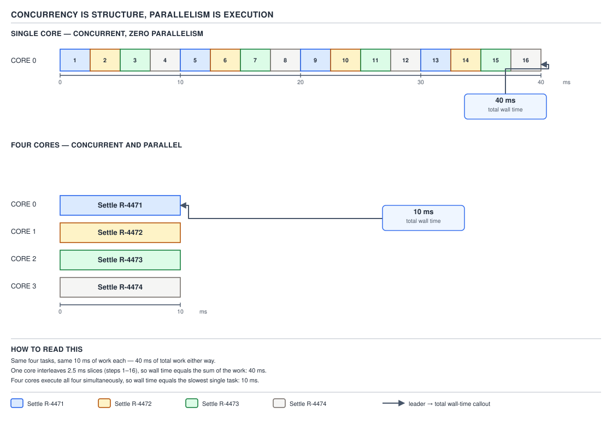
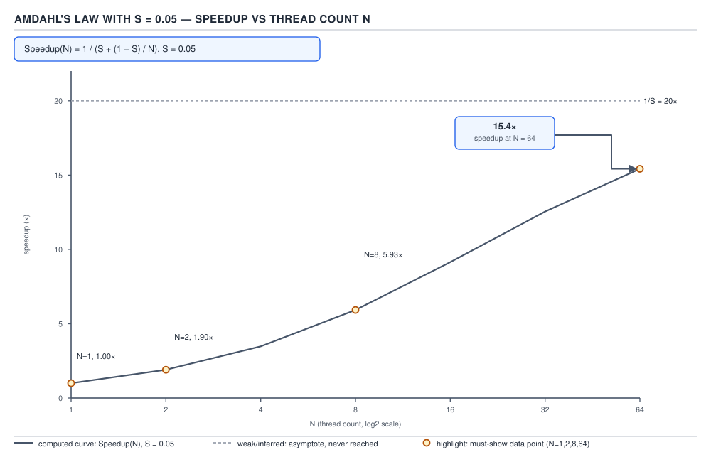
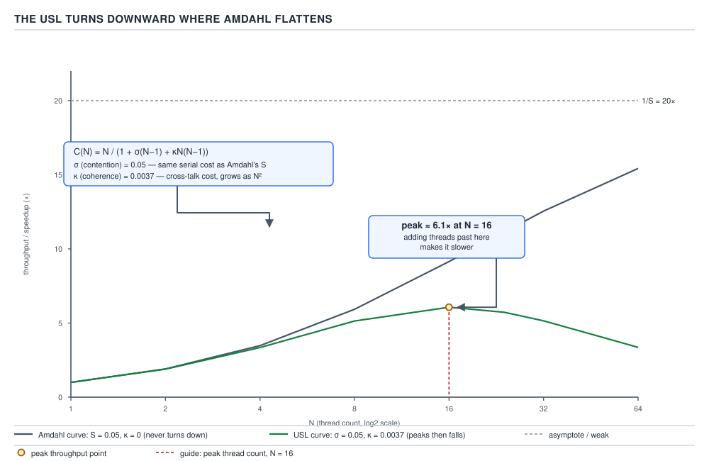
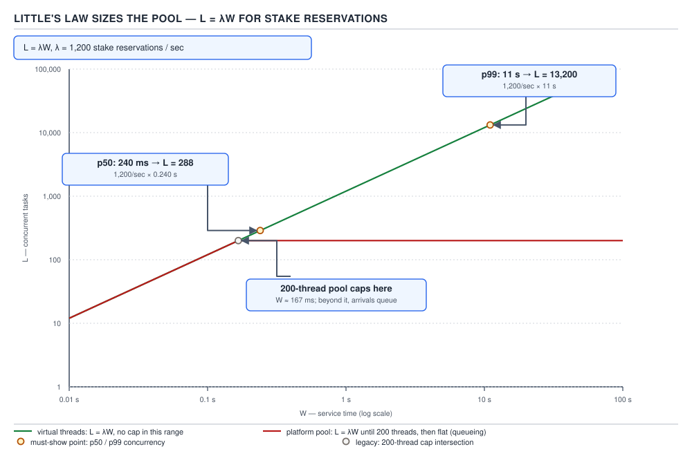

# 05 Multithreading and Concurrency — Foundations — BASICS (§1.1)

**Target version: Java 21 LTS.** | **Part 1 of 5** | [Index](../00-index.md)
Next: [Foundations — the OS substrate](02-basics-os-substrate.md)

## Why concurrency exists at all

`PaymentService` sits between three facts it cannot avoid: **1,200 stake reservations/sec** at
peak, the card PSP's authorise call answering in **240 ms at p50** but **11 s at p99**, and
**55,000 concurrent sessions** overall. None of those is the same problem, and conflating them is
where most concurrency designs go wrong before a line of code is written.

### 1. Throughput, latency, and blocking-tolerance are three different problems

`[BASICS]`

**Mental model.** Three separate dials on `PaymentService`'s dashboard: **throughput** — how many
reservations complete per second, sustained; **latency** — how fast *one* request finishes, and
whether its own sub-steps can run concurrently to shorten it; **blocking-tolerance** — while one
thread sits idle on the PSP's 11 s tail, can the other 54,999 sessions still be served?

**Why it exists.** Before cheap multi-core hardware, all three were solved (badly) by one lever —
a faster CPU. Once that lever stopped working (leaf 2), each needs its own architecture: more
parallel workers for throughput, decomposed sub-steps for latency, and *not committing a scarce OS
thread to a task that's only waiting* for blocking-tolerance.

**When to reach for which.** A pool sized for throughput does nothing for one request's latency
unless that request's own work is split across workers (`CompletableFuture`/structured concurrency
fan-out, later files). Growing a pool to "fix" a latency complaint when the real constraint is
throughput just adds context-switch overhead. Diagnose the dial before turning it.

**Example.**

```java
// Throughput: many independent reservations, bounded by pool size.
ExecutorService pool = Executors.newFixedThreadPool(200);
requests.forEach(req -> pool.submit(() -> paymentService.reserveStake(req)));

// Latency: split ONE reservation's independent sub-steps so it finishes sooner.
try (var scope = new StructuredTaskScope.ShutdownOnFailure()) {
    var fraud = scope.fork(() -> screeningService.checkStake(clientId, amount));
    var limit = scope.fork(() -> clientRestrictions.checkStakeLimit(clientId, amount));
    scope.join().throwIfFailed();
    return StakeSplit.combine(fraud.get(), limit.get());
}
```

**Pitfall:** growing a thread pool to fix a latency complaint when throughput was already fine —
more threads than cores just adds context-switch overhead without shortening any single request.

> **Throughput** is work completed per unit time; **latency** is time to complete one unit of work;
> **blocking-tolerance** is serving other work while a thread waits — tuning one does not fix the
> other two.

### 2. The hardware forcing function: the free lunch ended around 2004–2006 `[RESEARCH]`

`[BASICS]`

**Mental model.** For three decades code got faster for free — next year's CPU, same code, higher
clock speed. Around 2004–2006 that stopped: Intel cancelled the 4 GHz Pentium 4 ("Tejas") in 2004,
the moment Herb Sutter's essay "The Free Lunch Is Over" made famous.

**Why it exists.** Dynamic power scales roughly with the cube of clock frequency (`C·V²·f`, voltage
rising with frequency); past ~3.5–4 GHz on air cooling the heat cost outweighed the gain.
Chipmakers redirected Moore's-law transistor growth into more cores per die instead of a faster
core.

**How it works.** A 2005 server ran one core near 3.8 GHz. A 2025 server runs 64+ cores, each
clocked *lower* (often 2.5–3.5 GHz base) with better per-clock throughput — but the aggregate gain
is dominated by core count. A single-threaded, CPU-bound call captures almost none of that
investment; it runs at roughly the same clock speed it did fifteen years ago.

**Gotcha.** "The CPU is faster now" is often false at the single-thread level and true only in
aggregate — which is exactly why Amdahl's law and thread-count sizing (next leaves) became
first-class concerns.

> The free lunch was single-core clock scaling; it ended when the power/heat cost of higher clock
> speed stopped paying off, forcing gains since ~2006 to come from more cores, not faster ones.

### 3. Concurrency versus parallelism `[TRAP]`

`[BASICS]`

**Mental model.** Concurrency is how work is *structured* — independent tasks safe to interleave.
Parallelism is whether hardware actually executes more than one *at the same instant*. One cook
working four dishes by switching between them is concurrency; four cooks on four dishes is
parallelism.

**Why it exists.** A program can be well-structured for concurrency and still get zero speedup if
the hardware never overlaps its execution.

**When to reach for which framing.** "Concurrency" for correctness/structure questions (can these
be interleaved safely); "parallelism" for throughput/hardware questions (are N cores actually used).
A single-core machine can run well-structured concurrent code with **zero** parallelism — no wall
clock speedup versus sequential, because only one instruction stream executes at a physical
instant.



**D-001** — Concurrency is structure, parallelism is execution.

The diagram shows four `SettleStake` tasks two ways: on a single core, the scheduler slices time
between them (interleaved slices, zero parallelism, wall time ≈ sum of the work); on four cores,
all four run at once, one per core, wall time ≈ the longest single task.

**Example.**

```java
List<Callable<Void>> tasks = List.of(stakeA, stakeB, stakeC, stakeD).stream()
        .<Callable<Void>>map(id -> () -> { quizEngine.settleStake(id); return null; })
        .toList();

Executors.newSingleThreadExecutor().invokeAll(tasks); // concurrent, zero parallelism
Executors.newFixedThreadPool(4).invokeAll(tasks);      // same structure, real parallelism
```

**Pitfall:** assuming "I used `ExecutorService`, therefore my code runs in parallel." Submitting
tasks only makes them *eligible* for parallel execution — a single-threaded executor, or a
single-core machine, runs them one at a time regardless.

> **Concurrency** is a structural property — tasks are independent enough to interleave;
> **parallelism** is a runtime property — those tasks actually execute at the same instant on
> separate hardware.

### 4. The three costs of concurrency

`[BASICS]`

**Mechanism.** **Correctness risk (races)** — two threads settling the same stake's ledger entries
unsynchronised can lose an update to `CLIENT_CASH_AVAILABLE`. **Liveness risk** (deadlock,
livelock, starvation) — two threads transferring between two client wallets, each holding one
wallet's lock and waiting on the other's, never progress. **Performance risk** — more threads than
cores means wasted context switches, and shared mutable state (the `AtomicLong` behind 3,400
settlements/sec) bounced between cores' caches generates coherence traffic that can dominate actual
work.

**Gotcha.** These trade off against each other, not just against the sequential baseline — adding a
lock to fix a race risks a deadlock; removing all locking to dodge deadlock risks reintroducing the
race. The rest of this topic is the catalogue of tools that shift this balance.

> Concurrency trades the single risk "too slow" for three new risks — races (wrong answer),
> liveness failures (no answer), and overhead (slower than expected) — and every primitive in this
> topic is a trade among the three.

### 5. Amdahl's law: the ceiling on speedup from parallelism `[PROVE]` `[NUM]`

`[BASICS]`

**Mental model.** However many cores you add, the part of a job that *must* run serially caps how
fast the whole job can ever finish — a relay where one leg must always be run by one runner no
matter how many runners join the other legs.

**Why it exists.** Amdahl formalised this in 1967: any real program has a serial fraction that
cannot be parallelised — setup, a shared resource touched one-at-a-time, an ordered merge.

**When to reach for it.** Whenever "just add more threads/cores" is proposed as a throughput fix —
compute the ceiling before investing effort.

**How it works — the proof.** Let `S` be the serial fraction, `(1−S)` the perfectly parallel
fraction, `N` processors, time on 1 processor normalised to 1:

```
T(N) = S + (1 − S) / N
Speedup(N) = T(1) / T(N) = 1 / (S + (1 − S) / N)
```

As `N → ∞`, `(1−S)/N → 0`, so speedup approaches the ceiling `1/S`.

**Worked example.** A batch settlement run where 5% is strictly serial (a single append-only
checkpoint write every settlement waits behind), `S = 0.05`, at `N = 64`:

```
Speedup(64) = 1 / (0.05 + 0.95/64) = 1 / (0.05 + 0.0148) = 1 / 0.0648 ≈ 15.4×
```

Not 64×. The asymptote as `N → ∞` is `1/0.05 = 20×` — 64 cores already capture 15.4 of the 20
available.



**D-002** — Amdahl's law with S = 0.05.

The curve passes through `N = 1` (1×), `N = 2`, `N = 8`, `N = 64` (15.4×, labelled), flattening
toward the dashed asymptote at `1/S = 20`.

**Interview:** "Why doesn't doubling cores double throughput?" — a nonzero serial fraction `S`
caps speedup at `1/S`; shrink `S` before adding cores.

**Gotcha.** Amdahl assumes the parallel fraction scales with zero added coordination cost per
extra processor. Real systems pay a *growing* cost as `N` rises — which the USL below models and
Amdahl does not.

> Amdahl's law bounds parallel speedup at `1/S`, where `S` is the unparallelisable fraction — the
> serial fraction, not processor count, sets the ceiling.

### 6. The universal scalability law: why more threads can make things slower `[RESEARCH]`

`[BASICS]`

**Mental model.** Amdahl says speedup flattens and never worsens. Reality is often worse: past
some thread count, throughput *turns downward*. The universal scalability law (USL, Neil Gunther)
is the correction.

**Why it exists.** Amdahl has no term for coordination cost *growing with N*. Real systems pay two
extra taxes: **contention** (σ) — threads serialising on shared resources (every settlement thread
queuing for one `AtomicLong`), and **coherence** (κ) — the cost of keeping N cores' cached copies of
shared state consistent, which grows worse than linearly because every core must be notified of
every other core's writes.

**When to reach for it.** When observed throughput has already started declining as thread count
rises, or to predict where that decline begins.

**How it works.**

```
X(N) = N / (1 + σ(N − 1) + κN(N − 1))
```

`σ` alone reproduces Amdahl's flattening. `κ` is new: a *quadratic* penalty in `N` (coherence
traffic grows with the number of pairs, `N(N−1)`). Once `κN(N−1)` outgrows the linear numerator,
`X(N)` falls as `N` rises — a downturn Amdahl's formula, with no such term, can never produce.



**D-003** — The USL turns downward where Amdahl flattens.

Both curves share an axis: Amdahl asymptotically flattens; the USL tracks it at low `N`, peaks at a
labelled thread count, then bends down as κ's quadratic penalty overtakes the linear gain. σ and κ
are labelled at the terms responsible for flattening and downturn respectively.

**Insight:** before scaling a contended service out to more threads, ask whether its σ/κ profile
plateaus or turns over — a pool sized past the peak is strictly worse than a smaller one.

**Gotcha.** Fitting σ and κ needs several measured data points across a range of `N` — it's a
diagnostic/predictive model, not something to guess from first principles.

> The USL adds a linear contention term (σ) and a quadratic coherence term (κ) to Amdahl's model,
> which is why real systems can get slower past a peak thread count, not merely stop improving.

### 7. Little's law: sizing the pool from throughput and latency `[PROVE]` `[NUM]`

`[BASICS]`

**Mental model.** Little's law connects the average number of things in a system (`L`), the
arrival rate (`λ`), and the average time each spends in the system (`W`) — turning "1,200
reservations/sec at 240 ms each" into a concrete worker count.

**Why it exists.** Without it, pool sizing is guesswork; with it, it's arithmetic from two
measurable numbers.

**When to reach for it.** Sizing any pool — including `PaymentService`'s platform pool (leaf
1.24.19) and general capacity planning (leaf 2.4.2).

**How it works — the proof.** In steady state (arrivals equal departures):

```
L = λ × W
```

A conservation law (John Little, 1961) independent of arrival distribution, service-time
distribution, or scheduling discipline.

**Worked example.** `λ = 1,200`/sec. At the PSP's **p50 of 240 ms**:

```
L = 1,200 × 0.240 = 288
```

At the **p99 of 11 s**:

```
L = 1,200 × 11 = 13,200
```

A 45× jump between typical and tail.



**D-004** — Little's law sizes the pool.

The diagram plots required concurrency (`L`) against PSP latency (`W`) at the fixed 1,200/sec
arrival rate, marking both worked points (288 at 240 ms, 13,200 at 11 s) against a horizontal line
at a 200-thread platform pool — already exceeded at p50 — and a virtual-thread line showing no cap
in this range.

**Interview:** "How do you size a pool for a downstream call with variable latency?" — `L = λW`
at both typical and tail latency; a platform pool sized for the typical case starves under the
tail unless the threading model itself has no fixed cap.

**Gotcha.** `L = λW` states what concurrency is *needed*, not what to naively provision at the
tail — queuing instead of provisioning changes `W`, which feeds back into `L`.

> Little's law: average concurrency equals arrival rate times time-in-system (`L = λW`) — a
> downstream call's tail latency, not just its median, determines the concurrency a caller must
> sustain.

### 8. Where a server's thread count comes from: four models `[NUM]`

`[BASICS]`

**Mental model.** Every framework answers the same question differently: when a request arrives,
which thread runs it, and how many exist at once?

**Hierarchy before details.** All four sit on one axis — how tightly thread count is coupled to
concurrent connections:

| Model | Threads at 55k peak sessions | Memory | Blocking allowed? | Code style | Failure mode when overloaded |
|---|---|---|---|---|---|
| Thread-per-connection | ~55,000 platform threads | Very high (~1 MB+ stack each) | Yes, freely | Simple, sequential, blocking | Thread-table/memory exhaustion; crashes or refuses connections |
| Bounded pool (Java 5–21) | Fixed, e.g. 200 | Bounded, predictable | Yes, risks starving the pool | Simple, blocking, fragile tuning | Requests queue then time out/reject; latency cliff |
| Thread-per-request, virtual threads (21+) | ~55,000 virtual threads, few carriers | Low per-thread, heap-allocated, grows on demand | Yes, freely (parks, frees carrier) | Simple, blocking, same code as per-connection | No thread-count wall itself; backpressure must come from elsewhere |
| Event loop (Netty/reactive) | Small fixed, e.g. 1/core | Very low | No — blocks the whole loop | Callback/async, harder to debug | One slow blocking call starves the whole loop |

**D-005** — Four ways a server gets its thread count.

**Why it exists.** Thread-per-connection was simplest but its per-thread memory made it
impractical past thousands of connections, forcing bounded pools, then event loops that decoupled
thread count from connection count entirely. Virtual threads (Loom, Java 21) reopen
thread-per-request at scale by making the *thread* cheap instead of the programming model harder.

**When to reach for which.** Bounded pool for naturally capped, low concurrency (batch
settlement). Thread-per-request on virtual threads as the default from Java 21 onward. Event loop
still wins for near-entirely non-blocking, small-per-request-state workloads (a raw TCP proxy); it
rarely wins for a service like `PaymentService` fanning out to slow, blocking downstreams.

**Gotcha.** Virtual threads remove *platform*-thread memory cost, not downstream capacity limits —
the PSP's own concurrency limits and `FundsLedger`'s pool still bound useful concurrency, which is
exactly what Little's law quantifies regardless of threading model.

> The four models trade memory cost, blocking-tolerance, and code simplicity along one axis: how
> tightly thread count is coupled to concurrent request count.

### 9. Why Java made threads a language feature, and what that cost `[VERSION-TRAP]`

`[SUPPORTING FACT]`

**Mechanism.** Java 1.0 (1996) built threading into the language — every object inherits a monitor
(`synchronized`) and `wait`/`notify` from `Object`; `Thread`/`Runnable` are core types. Unusual for
the time and approachable, but it fossilised early design choices into the platform's most
fundamental class.

**Gotcha / `[VERSION-TRAP]`.** `Thread.stop()`, `suspend()`, `resume()` were part of the original
API and inherently unsafe — `stop()` could release locks mid-invariant-update, corrupting shared
state (a wallet transfer half-applied). As of **Java 20**, calling them throws
`UnsupportedOperationException`, not merely a warning. Code written against JDK 8–19 that calls
them compiles fine but fails at runtime on 20+.

> Java made every object a lock and every thread first-class from version 1.0 — accessible early,
> but the unsafe control methods it shipped (`stop`/`suspend`/`resume`) took over two decades to
> fully remove (Java 20).

### 10. "Thread-per-request until you can't," and why virtual threads restore it

`[BASICS]`

**Mental model.** For most of Java's server history, "one thread per request, block freely, write
sequential code" was the default — until connection counts outgrew what platform threads could
afford, forcing a fifteen-year detour into reactive/async purely to work around thread cost, not
because callbacks were inherently easier to reason about.

**Why it exists.** Reactive frameworks (RxJava, Reactor, Netty) decoupled thread count from
connection count at a steep cost: stack traces that don't reflect logical flow, logic expressed as
chained operators instead of straight-line code. Teams paid that price because thread-per-connection
genuinely didn't scale in memory.

**When virtual threads change the calculus.** A blocked virtual thread frees its carrier platform
thread back to a small pool, so 55,000 concurrently blocked virtual threads cost far less than
55,000 blocked platform threads. `PaymentService` can call the PSP synchronously inside a virtual
thread, exactly like thread-per-connection, without the memory bill.

**Gotcha.** Virtual threads restore thread-per-request *as an option*, not as an automatic fix for
reactive-style decisions already baked into a codebase — code already built on non-blocking
operators doesn't benefit from switching its executor, since the savings only apply to code that
actually blocks a thread.

> Virtual threads (21+) let a server return to thread-per-request, simple blocking code at the
> concurrency levels that previously forced reactive adoption — because the thing that made
> thread-per-connection expensive (platform-thread memory/scheduling cost) no longer scales with
> virtual-thread count.

---

## Pitfalls

### Assuming more threads/cores always means proportionally more throughput

**Wrong**

```java
ExecutorService pool = Executors.newFixedThreadPool(64); // was 32
// "We doubled the pool, throughput should double." Observed: barely moved, latency got worse.
```

**Right**

Compute Amdahl's ceiling first: if 5% of the settlement path is serial, speedup is capped at
`1/0.05 = 20×` regardless of thread count, and past some point the USL's coherence term can make
things *worse*. Profile the serial/contended fraction before adding threads.

**Why people believe it:** "more workers = more work done" holds only for independent work with
no shared bottleneck; intuition doesn't account for the serial section or coherence cost until the
laws make it explicit.

### Treating concurrent code as automatically parallel

**Wrong**

```java
Executors.newSingleThreadExecutor().submit(() -> quizEngine.settleStake(stakeA));
// Assumption: "this runs in parallel with other submitted tasks because I used an ExecutorService."
```

**Right**

A single-threaded executor runs submitted tasks one after another — concurrent structure, zero
parallelism. Use `Executors.newFixedThreadPool(n)` with `n > 1` on multiple cores for real
simultaneous execution.

**Why people believe it:** `submit`/`Future` vocabulary is identical in both cases, so the API
gives no visible signal about how many things actually execute at once — that's pool size and
hardware, not the API.

---

## Cheat sheet

| Concept | One-line takeaway |
|---|---|
| Throughput vs latency vs blocking-tolerance | Three separate dials — diagnose before tuning |
| Free lunch ended (~2004–2006) | Clock speed stalled on power/heat; gains since come from more cores |
| Concurrency vs parallelism | Structure vs execution; single core can be concurrent, zero parallelism |
| Three costs | Correctness (races), liveness (deadlock/livelock/starvation), performance (switches, coherence) |
| Amdahl's law | `Speedup = 1/(S + (1−S)/N)`; ceiling `1/S` as `N → ∞` |
| USL | Amdahl + contention (σ, linear) + coherence (κ, quadratic); throughput can fall past peak N |
| Little's law | `L = λW`; concurrency needed = arrival rate × time-in-system, p50 and p99 |
| Four threading models | Per-connection, bounded pool, per-request virtual threads, event loop |
| Threads as a language feature | Every object a monitor since 1.0; `stop`/`suspend`/`resume` throw since Java 20 |
| Virtual threads restore thread-per-request | Cheap blocked threads remove reactive style's original reason |

---

## Self-test

**Q1.** A team doubles a pool from 32 to 64 threads; throughput barely changes. Which two laws
explain why, and what would you measure first?

<details><summary>Answer</summary>

Amdahl's law and the USL. Estimate the serial fraction `S` — if `1/S` was already nearly reached
at 32 threads, 64 buys little. If throughput is actually *falling*, the USL's coherence term is
dominating and 64 is past the peak.

</details>

**Q2.** Why can a single-core machine run "concurrent" code with zero parallelism — is that a bug?

<details><summary>Answer</summary>

Concurrency is structural (tasks safe to interleave); parallelism is whether hardware executes
more than one at the same instant. A single core interleaves time slices without ever running two
simultaneously — not a bug, since interleaving still lets a blocked task yield the core to a
runnable one, improving responsiveness with zero speedup.

</details>

**Q3.** With 1,200 reservations/sec and the PSP's p50 of 240 ms, how many concurrent in-flight
reservations does the system need? What about the p99 of 11 s?

<details><summary>Answer</summary>

`L = λW`. p50: `1,200 × 0.240 = 288`. p99: `1,200 × 11 = 13,200` — a 45× jump that a fixed
200-thread pool (below even the p50 need) cannot absorb without a threading model with no
per-request thread cost, or explicit shedding.

</details>

**Q4.** How does the USL's prediction diverge from Amdahl's as thread count `N` grows large?

<details><summary>Answer</summary>

Amdahl predicts speedup asymptotically flattens toward `1/S` and never worsens. The USL adds a
coherence term (κ) growing quadratically with `N`, which can overtake the linear numerator, so
throughput actually turns downward past a peak `N` — something Amdahl's formula has no term to
express.

</details>

**Q5.** Why does `Thread.stop()` compile on Java 21 but throw at runtime on Java 20+, and why was
it unsafe?

<details><summary>Answer</summary>

It remains on `Thread` for source/binary compatibility but throws `UnsupportedOperationException`
when invoked from Java 20 onward. It was unsafe because it could terminate a thread mid-operation,
releasing locks while shared state was half-updated — e.g., a wallet transfer stopped mid-flight
could leave one side debited with the other never credited.

</details>

**Q6.** "With virtual threads, thread count doesn't matter anymore." What's wrong with that claim?

<details><summary>Answer</summary>

Virtual threads remove platform-thread memory/OS cost, not downstream concurrency limits — the
PSP's own limits and `FundsLedger`'s pool still bound useful concurrency. Little's law still
governs what's needed and sustainable regardless of local thread cost.

</details>

---

**Leaves covered:** 1.1.1–1.1.10 (10 leaves)
**Leaves deferred:** none
**Diagrams included:** D-001, D-002, D-003, D-004, D-005
**Target version:** Java 21 LTS
**Lines:** 516
