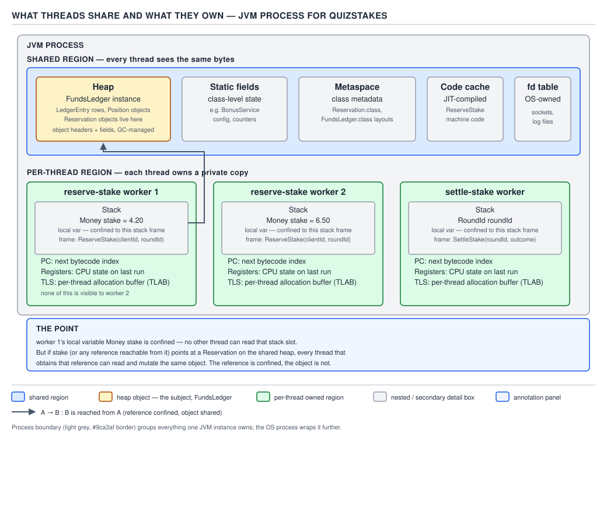
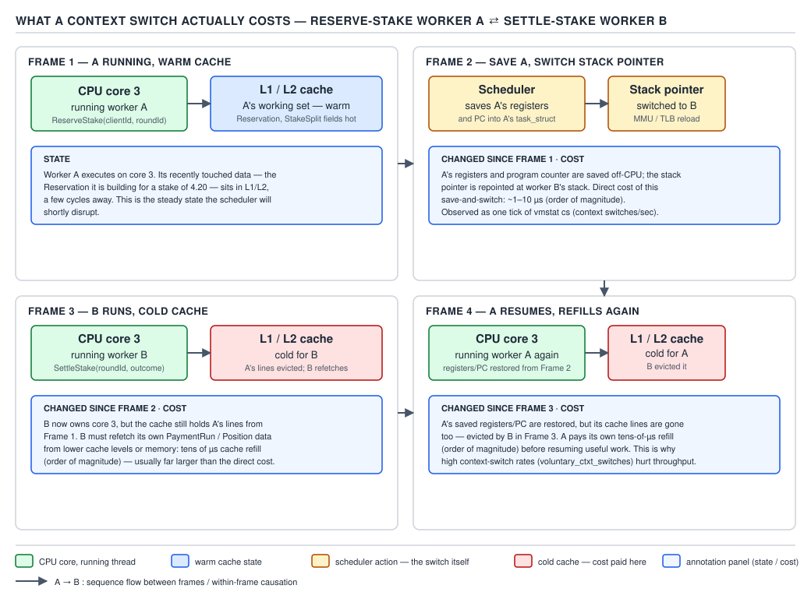
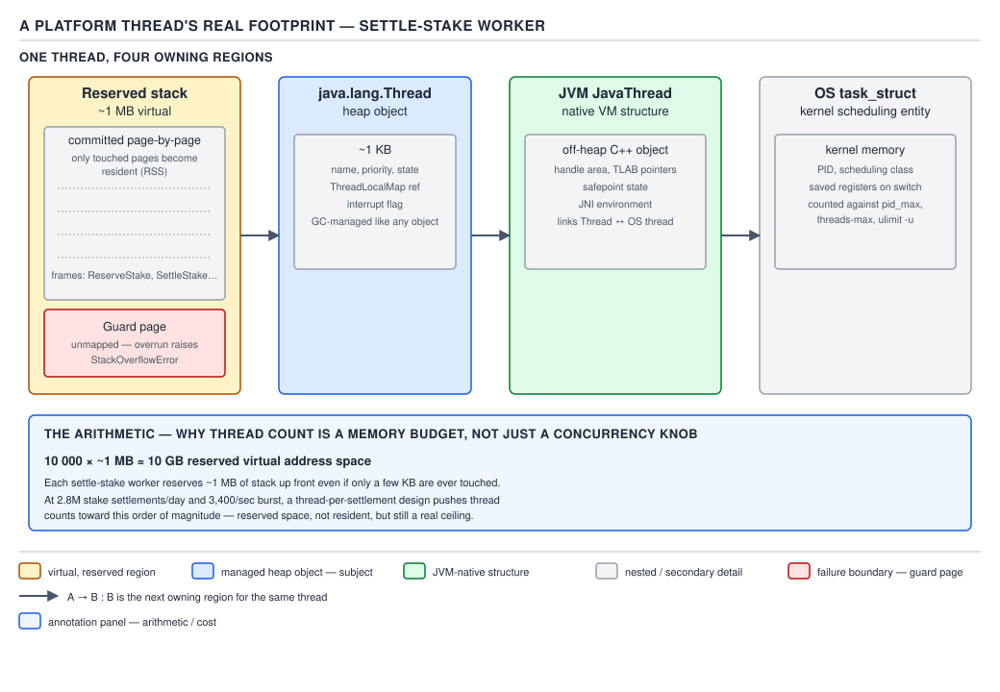
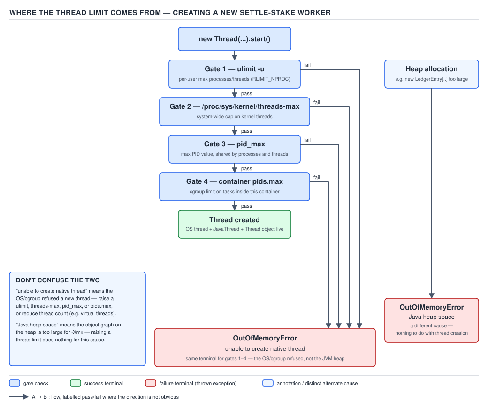

# 05 Multithreading and Concurrency — Foundations — BASICS (§1.2)

**Target version: Java 21 LTS.** | **Part 1 of 5** | [Index](../00-index.md)
Previous: [Foundations — why concurrency exists](01-basics-why-concurrency.md) · Next: [Threads — the Thread API](../threads/01-basics-thread-api.md)

A process is one virtual address space, one file-descriptor table, and one or more threads
running inside it; the OS keeps processes apart with page tables, so one `PaymentService`
instance crashing cannot corrupt another process's memory. A thread is the unit the scheduler
actually moves: a program counter, a register set, a stack, and some scheduler bookkeeping. Every
JVM you run — the one serving `ReserveStake` calls, the one running a `PaymentRun` batch — is one
process containing many threads, and everything in this file is about what those threads share
inside that one process, and what a thread costs the OS to create and switch between.

## The share/own split

Threads in the same process **share** the heap, static fields, metaspace, the JIT code cache, and
the file-descriptor table. Each thread **owns** its own stack, its own program counter, its own
register set, and its own thread-local storage. Every concurrency bug you will debug this topic —
race, visibility failure, deadlock — lives in the shared half. Nothing you do to a thread's own
stack can ever race with another thread, because no other thread can see it.

**Why it exists.** A process needs one shared heap so that objects can outlive the call that
created them and be reached from anywhere — a `FundsLedger` instance has to be visible to the
thread handling a card deposit and the thread handling a stake settlement, or the ledger could not
be a single source of truth. But a shared *everything* would make every local variable a
potential race, and every method call would need synchronization just to increment a loop counter.
The split is the compromise: give every thread a private stack for its own call frames and locals,
and let only the things that genuinely need to be reachable from multiple threads live on the
shared heap.

**When it matters, and when it doesn't.** It matters the moment a reference crosses from a stack
to the heap — passed into a constructor, stored in a field, put into a collection another thread
can reach. It does not matter for a primitive local that never leaves its frame: a `long` loop
counter inside `settleStake` is invisible to every other thread by construction, no lock needed.
The sibling question this sets up for the rest of the topic — *is this variable confined to one
thread or reachable from several* — is the first question to ask about any field before reaching
for `synchronized` or `AtomicLong`.

**How it works.** The JVM maps each thread's stack as a private region of the process's address
space — on Linux, via `pthread_create`'s stack allocation, backed by a separate memory mapping per
thread. The heap, metaspace, and code cache are single mappings shared by every thread's page
table entries pointing at the same physical pages. A method call pushes a new frame onto the
calling thread's stack; that frame's locals are ordinary stack slots, popped and gone when the
method returns, and no instruction exists for one thread to address another thread's stack frames
directly. The only way data crosses from one thread to another is through something both threads
can see: the heap, a static field, or a value handed off through a shared object (a queue, a
future, a lock's protected state).



**D-006** — What threads share and what they own.

```java
final class StakeReservationHandler {

    private final FundsLedger fundsLedger; // one instance, shared heap object

    StakeReservationHandler(FundsLedger fundsLedger) {
        this.fundsLedger = fundsLedger;
    }

    Reservation reserveStake(ClientId clientId, Money stake) {
        // 'stake' is a local Money reference: it lives on THIS thread's stack frame.
        // No other thread can read this local — it is unreachable by construction.
        StakeSplit split = fundsLedger.computeSplit(clientId, stake);

        // But the object the local points at is not automatically safe: computeSplit
        // and reserve both hand 'stake' and the resulting Reservation to the shared
        // FundsLedger, and from that point on every thread calling reserveStake or
        // settleStake for this client can reach the same Reservation on the heap.
        return fundsLedger.reserve(clientId, split);
    }
}
```

`stake` the local reference is confined to one stack; the `Reservation` it produces is not — it is
filed into the shared `FundsLedger`, and every thread touching this client's wallet from here on
is touching the same heap object.

**The gotcha.** "Local variables are thread-safe" is true and gets misquoted into "objects
referenced only by locals are thread-safe," which is false the instant that local is a reference
type passed to something shared. A `Money stake` parameter is safe; the `Reservation` it helps
build, once handed to `fundsLedger.reserve(...)`, is not — and nothing in the syntax marks that
transition. The bug is never in the local; it is in what the local was allowed to reach.

> A thread's stack, program counter, registers, and thread-locals are private to it by
> construction; the heap, static fields, metaspace, code cache, and fd table are shared by every
> thread in the process, and that shared half is where every data race actually lives.

**Interview:** "Are local variables thread-safe?" — yes, always, because they are unreachable from
other threads; the trap is a local *reference* to a shared object, which is not.

### The 1:1 threading model, and what came before it `[RESEARCH]`

Java threads today map 1:1 onto OS threads: `Thread.start()` calls `pthread_create` (or the
platform equivalent) and every scheduling decision is made by the OS, not the JVM. This was not
always true. JDK 1.1 on Solaris shipped "green threads" — an M:N model where the JVM itself
multiplexed many Java threads onto one OS thread — and it was removed by JDK 1.3 because it could
not use multiple CPU cores and blocked the whole JVM on one blocking syscall. Every JDK from 1.3
through 20 is strictly 1:1. Virtual threads (JDK 21) are the M:N model returning, but scheduled
in user space by the JDK's own `ForkJoinPool` carrier scheduler rather than by Solaris-era green
threads' cooperative model — the mechanism is new even though the shape rhymes with 1996.

## Context-switch mechanics and cost

A context switch is the OS suspending one thread's execution state and resuming another's on the
same CPU core. Picture a single desk: the OS clears everything the current occupant was working on
into a drawer (registers, stack pointer), pulls a different occupant's drawer out, and sets their
materials back on the desk. The desk itself — the CPU core — never changes; only what is loaded
into it does.

**Why it exists.** A CPU core runs one instruction stream at a time. To give the illusion of many
threads running "at once" on a machine with fewer cores than runnable threads, the OS scheduler
time-slices: it runs thread A for a slice, then switches to thread B, then back to A. Without
context switching, a single blocking database call in one request-handling thread would stall
every other thread that happened to be scheduled on that core.

**When it matters, and when it doesn't.** It matters at the margins of thread-pool sizing: a
`FixedThreadPool` far larger than the core count doing CPU-bound work (deriving `Stakeable` and
`Withdrawable` totals from ledger positions) pays repeated context-switch and cache-refill cost
for no throughput gain, because the CPUs were already saturated. It barely registers for a small
pool of I/O-bound threads waiting on the identity vendor or the PSP — those threads are voluntarily
off-CPU anyway, and the switch cost is dwarfed by the hundreds of milliseconds of network wait.

**How it works.** On a voluntary switch (a thread blocks on I/O, a lock, or `park`), the OS saves
that thread's registers and stack pointer into its `task_struct`, picks the next runnable thread
from its ready queue, restores that thread's saved registers and stack pointer, and resumes it. An
involuntary switch happens when the scheduler preempts a still-runnable thread because its time
slice expired or a higher-priority thread became ready. Switching threads within the same process
does not require a full page-table (address-space) switch — that expensive step is reserved for
switching *processes* — but the new thread still starts with cold L1/L2 cache lines and a flushed
TLB for its own working set, so the CPU pays a cache-refill penalty even though no address-space
switch occurred.

**These numbers are order-of-magnitude, not measured constants** — no authoritative
per-instruction table exists, and the true cost depends on core, kernel, and cache topology. As an
order of magnitude: the direct save/restore work costs roughly 1–10 µs; the cache-refill penalty
that follows, as the resumed thread repopulates L1/L2 with its own working set, adds tens of
microseconds more. `[NUM]`



**D-007** — What a context switch actually costs.

You see these switches, you do not compute them from source: `vmstat 1` reports a `cs` (context
switches per second) column system-wide; `pidstat -w <pid>` breaks voluntary versus involuntary
switches down per process; and `/proc/<pid>/status` exposes per-process
`voluntary_ctxt_switches` and `nonvoluntary_ctxt_switches` counters directly.

```
$ cat /proc/$(pgrep -f PaymentService)/status | grep ctxt_switches
voluntary_ctxt_switches:        184213
nonvoluntary_ctxt_switches:       9042
```

A high voluntary count on the payment service is expected — its threads are constantly blocking on
the PSP and the banking partner. A rising *nonvoluntary* count on a CPU-bound pool is the signal
that the pool is oversized for the cores available and threads are being preempted mid-slice.

**The gotcha.** Context-switch cost is invisible in a profiler that only samples user-space stack
traces, because the cost is paid by the kernel between samples. A thread pool sized to "keep every
core busy" using naive thread-count-equals-core-count math on CPU-bound work, but that in practice
also does occasional blocking I/O, ends up thrashing: too few threads to cover the blocking gaps,
or — the opposite mistake — far too many, spending cycles switching instead of computing.

> A context switch saves one thread's register state and stack pointer and restores another's;
> the direct cost is on the order of 1–10 µs, with a further tens-of-µs cache-refill penalty as
> the resumed thread repopulates a cold L1/L2 — both order-of-magnitude figures, never measured
> constants.

**Insight:** two threads on the same core are never truly concurrent, only interleaved; true
concurrency requires two cores. Context switching is what makes one core *look* concurrent, at a
real, nonzero cost per switch.

## Platform-thread footprint

A platform thread is expensive in a way that surprises people who think of a `Thread` as a small
Java object, because most of its cost is not the Java object at all — it is the OS-level machinery
backing it, reserved the moment `start()` runs.

**Why it exists.** Each thread needs its own stack for the reason established above — call frames
must be private — and a stack needs a fixed, contiguous address range decided up front, because
growing it later would require relocating every pointer into it, which the JVM cannot do safely.
Reserving a large, fixed range per thread is simple and safe; it is also the direct cause of the
scaling ceiling this file ends on.

**When it matters, and when it doesn't.** It matters the instant you try to model one client
connection or one in-flight `ReserveStake` request as one platform thread at QuizStakes' 55k peak
concurrent sessions — the stack reservation alone would demand tens of gigabytes of address space
before a single byte of actual request state is counted. It barely matters for a fixed pool of a
few hundred worker threads doing CPU-bound settlement math, where the aggregate footprint is
megabytes, not gigabytes.

**How it works.** On 64-bit Linux the default reserved stack size is about 1 MB (`-Xss1m`), but
that reservation is *virtual* address space, not physical memory — pages are committed lazily as
the stack actually grows, plus one committed guard page at the low end that triggers
`StackOverflowError` instead of silently corrupting adjacent memory. Beyond the stack: a
`java.lang.Thread` heap object of roughly 1 KB, a JVM-internal `JavaThread` control structure
holding GC and safepoint bookkeeping, and an OS `task_struct` the kernel scheduler operates on.
The ratio is stark — roughly 1 KB of Java-heap object is the visible tip over multiple megabytes of
backing stack and kernel structures. `[NUM]`

The arithmetic that makes this concrete: 10 000 platform threads × ~1 MB reserved stack ≈ 10 GB of
reserved address space, before counting a single `JavaThread`, `task_struct`, or heap-resident
`Thread` object. `[NUM]`



**D-008** — A platform thread's real footprint.

```java
// Illustrative only — never actually spin up 10,000 platform threads to serve
// concurrent stake reservations; this is the exact anti-pattern this file argues against.
ExecutorService oneThreadPerSession = Executors.newFixedThreadPool(10_000);
for (int i = 0; i < 10_000; i++) {
    oneThreadPerSession.submit(() -> reserveStake(clientId, stake));
}
// ~10,000 × ~1 MB reserved stack ≈ 10 GB of address space committed to stacks alone,
// for work that is mostly waiting on the PSP or the identity vendor, not computing.
```

**The gotcha.** Reserved is not committed, so `top`'s resident-set size will not show 10 GB on day
one — pages fill in lazily as each stack actually grows, so the failure often shows up late, under
load, as either an `OutOfMemoryError` from the address-space or commit-limit being hit, or as the
thread-count ceiling covered next. Sizing a thread pool by "how much heap do I have" while ignoring
stack reservation is the same mistake in the opposite direction.

> A platform thread reserves roughly a megabyte of stack address space plus a guard page, backs a
> roughly 1 KB `java.lang.Thread` heap object with a JVM `JavaThread` and an OS `task_struct`, and
> at 10 000 threads that reservation alone is already on the order of 10 GB.

### OS scheduling and Java thread priority `[TRAP]` `[NUM]`

The OS scheduler (Linux's Completely Fair Scheduler, CFS, for ordinary threads; separate
real-time classes exist but Java threads do not use them) decides which runnable thread gets the
core next, based on time slices and dynamic priority accounting — not on anything the JVM
controls directly. Java exposes `Thread.setPriority` with ten levels
(`MIN_PRIORITY` = 1, `NORM_PRIORITY` = 5, `MAX_PRIORITY` = 10), but on Linux these map, at best,
to a narrow `nice` value hint that CFS is free to largely ignore. **Pitfall:** treating
`Thread.setPriority(Thread.MAX_PRIORITY)` on the thread settling stakes as a way to guarantee it
beats out lower-priority threads is a belief carried over from single-core, priority-driven RTOS
scheduling; on Linux the effect is marginal to nonexistent, and the fix for "this thread must run
promptly" is a dedicated executor or a real scheduling class configured at the OS level, not a
Java-level priority knob.

### Daemon versus non-daemon threads `[TRAP]`

A non-daemon thread keeps the JVM alive; the process exits only once every non-daemon thread has
terminated. A daemon thread is background-only — the JVM will kill it abruptly the moment it is
the last kind left running, with no guarantee that its `finally` blocks or shutdown hooks execute.
`setDaemon(true)` must be called before `start()`; calling it after the thread is already running
throws `IllegalThreadStateException`. **Pitfall:** marking the thread that flushes buffered ledger
entries to durable storage as a daemon on the belief that "daemon just means background" — if it
is the last thread standing during shutdown, the JVM can kill it mid-flush, losing exactly the
writes durability existed to protect. Background does not mean disposable; daemon means disposable.

### `ThreadGroup`: legacy, kept only because `Thread` requires one `[RESEARCH]` `[VERSION-TRAP]`

`ThreadGroup` is a pre-`java.util.concurrent` grouping mechanism, effectively deprecated for
management purposes today: `ThreadGroup.stop`/`suspend`/`resume` were removed along with the
`Thread` equivalents, and `destroy`/`allowThreadSuspension` were deprecated for removal starting in
JDK 16 with further degradation in JDK 19. It survives in the platform only because every
`Thread` constructor still requires belonging to a group, not because it is a recommended tool —
reach for a named `ExecutorService` and structured logging for grouping and management instead.

### Identifying a thread at runtime `[RESEARCH]`

`Thread.currentThread()` returns the calling thread; `getName()`/`setName(String)` read and write
its display name; `isAlive()` reports whether it has started and not yet terminated. `getId()` is
deprecated since JDK 19 in favor of `threadId()`, which returns the same `long` identifier without
the now-discouraged method name. `isVirtual()` (JDK 21) reports whether a `Thread` instance is a
virtual thread, the one piece of this API that did not exist before this LTS.

### Naming threads for the 3 a.m. thread dump

A pool thread named `pool-2-thread-3` tells a human nothing when they are staring at a `jstack`
dump during an incident; a thread named `stake-settlement-3` or `bank-payment-run-worker-1` tells
them immediately which workload is stuck. Name threads for what they do, not for the pool
implementation detail that created them — the cost is a `ThreadFactory` with a naming scheme, paid
once, and the payoff is every incident afterward.

## Where the thread limit actually comes from

This is not a mechanism you choose to use; it is the diagnosis you run when thread creation starts
throwing. Picture four gates in series between "call `start()`" and "get a runnable OS thread" —
clear all four or the JVM throws.

**Why it exists.** An unbounded number of threads per process would let one runaway process
exhaust kernel thread-table memory and starve every other process on the host, so the OS enforces
several independent ceilings, and a container runtime layers one more on top.

**When it matters, and when it doesn't.** It matters the moment thread creation starts throwing in
production under load — a burst of concurrent `ReserveStake` handling, for instance, that pushes
past whatever ceiling is lowest on that host. It is invisible under normal load precisely because
these gates are usually set far above steady-state thread counts; the failure mode is specifically
a *burst* or a *leak* pushing past a limit nobody had reason to check before.

**How it works.** Four independent gates, any one of which can fail the request:

| Gate | Where it's set | Typical failure surface |
|---|---|---|
| `ulimit -u` | per-user process/thread limit, `/etc/security/limits.conf` or the shell | a single user account running too many JVMs or too many threads |
| `/proc/sys/kernel/threads-max` | system-wide kernel ceiling | rare on a dedicated host; more likely on a shared or under-provisioned VM |
| `pid_max` | system-wide PID namespace ceiling (threads consume PIDs too, via `clone`) | very high thread counts, or many short-lived processes churning PIDs |
| container `pids.max` | cgroup limit set by the container runtime / orchestrator | the everyday cause in Kubernetes: a per-pod `pids.max` far tighter than the host's own limits |

Any gate failing surfaces identically from Java's point of view: `Thread.start()` throws
`OutOfMemoryError: unable to create native thread`. `[NUM]`



**D-009** — Where the thread limit comes from.

```
Exception in thread "stake-settlement-pool-worker" java.lang.OutOfMemoryError:
    unable to create native thread: possibly out of memory or process/resource limits reached
        at java.base/java.lang.Thread.start0(Native Method)
        at java.base/java.lang.Thread.start(Thread.java:1553)
        at ...StakeSettlementPool.expandPool(StakeSettlementPool.java:88)
```

**The gotcha.** The exception name is `OutOfMemoryError`, and the reflex is to look at heap usage
— `jstat -gc`, GC logs, heap dumps — and find nothing wrong, because the cause is not heap
exhaustion at all. A `FundsLedger`-backed service running healthily under a 512 MB heap can still
throw this error if its container's `pids.max` is set to 256 and a burst of `ReserveStake` traffic
tries to spin up a 300th platform thread. Heap exhaustion and native-thread-creation failure share
an exception class name and nothing else; check `pids.max`, `ulimit -u`, and `threads-max` before
touching heap settings.

**Interview:** "You get `OutOfMemoryError: unable to create native thread` but heap usage looks
fine — where do you look?" — the answer is the four OS/container thread-count gates
(`ulimit -u`, `threads-max`, `pid_max`, container `pids.max`), not the heap, because the error
name is misleading; it is a thread-creation failure, not a memory-exhaustion one in the usual
sense.

> `OutOfMemoryError: unable to create native thread` means one of `ulimit -u`,
> `/proc/sys/kernel/threads-max`, `pid_max`, or a container's `pids.max` refused to hand out one
> more OS thread — a distinct failure from heap exhaustion despite sharing an exception class.

## Pitfalls

### Assuming a local reference makes the object it points to thread-safe

**Wrong**
```java
Money stake = Money.of("4.20", "GBP");
Reservation reservation = fundsLedger.reserve(clientId, stake.toSplit());
sharedReservations.put(clientId, reservation); // now on the shared heap
// "stake was just a local, so this must all be safe" — false: reservation is shared now.
```

**Right**
```java
Money stake = Money.of("4.20", "GBP");
StakeSplit split = stake.toSplit();
Reservation reservation = fundsLedger.reserve(clientId, split); // FundsLedger owns the
                                                                  // synchronization for
                                                                  // anything it publishes
sharedReservations.put(clientId, reservation); // publication is FundsLedger's contract, not ours
```

**Why people believe it:** "locals are thread-safe" is taught correctly and then over-generalized
to "anything a local touches is thread-safe," dropping the distinction between the *reference*
(confined) and the *object* (not, once it reaches the heap through that reference).

### Treating `OutOfMemoryError: unable to create native thread` as a heap problem

**Wrong**
```
# sees OutOfMemoryError, immediately reaches for:
$ jmap -heap $(pgrep -f StakeSettlementPool)
# heap usage is fine — 40% of a healthy 1 GB heap — "must be a transient blip", restart the pod
```

**Right**
```
$ cat /sys/fs/cgroup/pids.max
256
$ ls /proc/$(pgrep -f StakeSettlementPool)/task | wc -l
254
# the container's pids.max, not the heap, is the ceiling being hit
```

**Why people believe it:** the exception class is `OutOfMemoryError`, the same class heap
exhaustion throws, so the reflex is to check heap first — the message text says "unable to create
native thread" but it is easy to pattern-match on the class name alone under incident pressure.

## Cheat sheet

| Fact | Value |
|---|---|
| Threads share | heap, static fields, metaspace, code cache, fd table |
| Threads own | stack, PC, registers, thread-local storage |
| Java threading model (JDK 21) | 1:1 with OS threads; green threads (M:N) removed in JDK 1.3 |
| Context switch, direct cost | ~1–10 µs (order of magnitude) |
| Context switch, cache-refill penalty | tens of µs (order of magnitude) |
| Context-switch counters | `vmstat cs`, `pidstat -w`, `/proc/<pid>/status voluntary_ctxt_switches` |
| Platform thread default stack | ~1 MB reserved (`-Xss1m`), committed lazily, plus a guard page |
| 10 000 platform threads | ≈ 10 GB reserved address space (stacks alone) |
| `java.lang.Thread` heap object | ~1 KB |
| Java thread priority range | 1 (`MIN_PRIORITY`) – 10 (`MAX_PRIORITY`), 5 = `NORM_PRIORITY`; advisory on Linux |
| Daemon thread | JVM can kill mid-work, no `finally` guarantee; `setDaemon` before `start()` only |
| `getId()` vs `threadId()` | `getId()` deprecated JDK 19; use `threadId()` |
| `isVirtual()` | JDK 21+, reports virtual vs platform |
| Thread limit gates (in order) | `ulimit -u` → `threads-max` → `pid_max` → container `pids.max` |
| Thread-creation failure | `OutOfMemoryError: unable to create native thread` — not a heap problem |

## Self-test

**Q1.** Why is a local `int` counter automatically thread-safe, but a local `Reservation`
reference is not once it is passed to `fundsLedger.reserve(...)`?

<details><summary>Answer</summary>

The local `int` lives entirely on the owning thread's stack and no instruction lets another thread
address that stack frame, so it is unreachable by construction. A local *reference* is equally
confined as a reference, but the object it points to — once handed to a shared component like
`FundsLedger` and stored on the heap or in a shared collection — becomes reachable from every
thread that can reach `FundsLedger`. Thread-safety of the reference says nothing about
thread-safety of what it points to.

</details>

**Q2.** What actually gets copied or switched during a context switch, and what does not?

<details><summary>Answer</summary>

The thread's register contents and stack pointer are saved and restored; within one process, the
address space (page tables) is not switched, because both the outgoing and incoming threads share
the same process's memory mappings. What is not preserved across the switch is cache locality —
the incoming thread starts with cold L1/L2 lines for its own working set, which is why the
cache-refill penalty is separate from, and larger than, the direct save/restore cost.

</details>

**Q3.** Why are context-switch cost figures always described as order-of-magnitude rather than
precise numbers?

<details><summary>Answer</summary>

Because the true cost depends on the specific CPU microarchitecture, kernel version, cache sizes,
and what else is competing for those caches at the moment of the switch — no authoritative
per-instruction table exists that holds across hardware generations. Stating "~1–10 µs direct,
tens of µs cache-refill" as a fixed measured constant would overstate the precision anyone can
actually claim; it is a planning estimate, not a benchmark result.

</details>

**Q4.** Why does reserving 10 000 platform-thread stacks not immediately show up as 10 GB of
resident memory in `top`?

<details><summary>Answer</summary>

The ~1 MB per thread is reserved *virtual* address space, and pages are committed to physical
memory lazily as each thread's stack actually grows through use. A pool of 10 000 mostly-idle
threads can reserve ~10 GB of address space while committing only a small fraction of that as
resident memory — which is exactly why the failure mode often surfaces late, under sustained load,
rather than immediately at pool creation.

</details>

**Q5.** A service throws `OutOfMemoryError: unable to create native thread` while `jmap -heap`
shows the heap at 40% utilization. What do you check next, and why is the heap check misleading?

<details><summary>Answer</summary>

Check the four thread-creation gates: `ulimit -u`, `/proc/sys/kernel/threads-max`, `pid_max`, and,
if containerized, the cgroup's `pids.max`. The heap check is misleading because the exception
shares the `OutOfMemoryError` class with genuine heap exhaustion, but its actual cause is the OS
or container refusing to hand out one more native thread — a completely separate resource from
Java heap.

</details>

**Q6.** Why does Linux largely ignore `Thread.setPriority(Thread.MAX_PRIORITY)`?

<details><summary>Answer</summary>

Java's ten priority levels are, at best, mapped to a narrow `nice`-style hint for Linux's
Completely Fair Scheduler, which makes its own scheduling decisions based on fairness accounting
rather than obeying an application-level priority request. The API exists across platforms
including ones with real priority scheduling, but on Linux it is advisory and its effect on actual
scheduling order is marginal.

</details>

**Q7.** Why can a daemon thread lose data that a non-daemon thread would have safely flushed?

<details><summary>Answer</summary>

When the JVM decides to exit because only daemon threads remain, it terminates them immediately
and does not guarantee running their `finally` blocks or shutdown hooks. A thread mid-write to
durable storage — flushing buffered ledger entries, for instance — can be killed between
"buffered" and "durable," losing exactly the data the write existed to protect. A non-daemon
thread instead keeps the JVM alive until it finishes on its own terms.

</details>

**Q8.** Why is `ThreadGroup` still part of every `Thread`'s construction even though it is
effectively deprecated for management?

<details><summary>Answer</summary>

`ThreadGroup` predates `java.util.concurrent` and was the original grouping and bulk-management
mechanism, but its management methods (`stop`, `suspend`, `resume`) were removed alongside the
equivalent `Thread` methods, and `destroy`/`allowThreadSuspension` were deprecated for removal
starting in JDK 16. It remains only as a structural requirement of the `Thread` constructor, not
as a recommended API — named `ExecutorService`s and structured logging are the current tools for
grouping and managing threads.

</details>

**Q9.** Why does naming a thread `stake-settlement-3` instead of `pool-2-thread-3` matter for
anything other than readability?

<details><summary>Answer</summary>

A thread dump (`jstack`, or a JFR thread dump event) taken during an incident is read by a human
under time pressure, and the thread name is the only clue available about what workload that
thread was running when it stalled. `pool-2-thread-3` requires cross-referencing pool
configuration to guess the workload; `stake-settlement-3` tells the responder immediately, cutting
diagnosis time exactly when it matters most.

</details>

**Q10.** Why is `getId()` deprecated in favor of `threadId()` rather than simply removed?

<details><summary>Answer</summary>

`getId()` was deprecated in JDK 19 for eventual removal because its name was inconsistent with the
`Thread` API's naming conventions and could be confused with other identity-like methods;
`threadId()` returns the identical `long` value under a clearer name. It is a rename for API
consistency, not a behavioral change, which is why both coexist during the deprecation period
rather than `getId()` being removed outright.

</details>

---

**Leaves covered:** 1.2.1–1.2.15 (15 leaves)
**Leaves deferred:** none
**Diagrams included:** D-006, D-007, D-008, D-009
**Target version:** Java 21 LTS
**Lines:** 544
