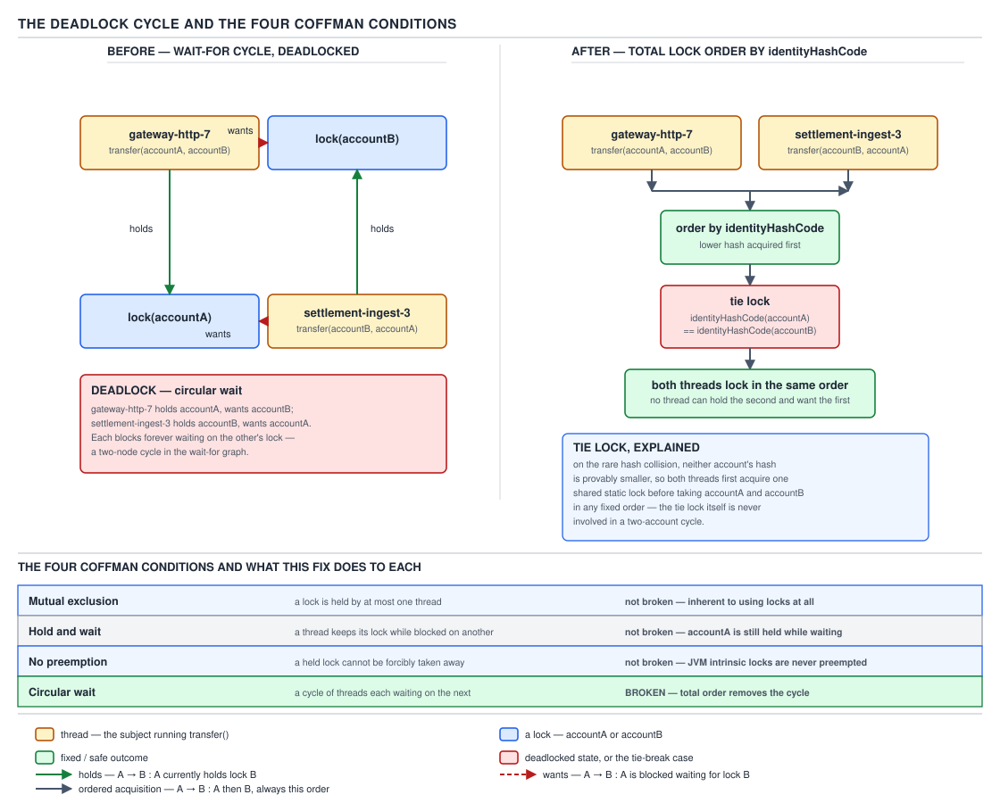

# 05 Multithreading and Concurrency — Liveness failures — BASICS (§1.26)

**Target version: Java 21 LTS.** | **Part 1 of 5** | [Index](../00-index.md)
Previous: [Structured concurrency and scoped values](../structured-concurrency/01-basics.md) · Next: [Part 1 interview wrap-up](../90-interview-basics.md)

A correctness bug gives you a wrong answer. A liveness failure gives you no answer, ever — the
thread is alive, holds no exception, and simply never finishes. This file covers deadlock,
livelock, starvation, the lock convoy, and the missed signal — all five look identical from the
outside (a stuck request, a wedged `PaymentRun`), and the skill is telling them apart from a dump.

## Deadlock and the four Coffman conditions

**Mental model.** Deadlock is a cycle in a directed "wait-for" graph: draw an edge from thread T to
thread U whenever T is blocked waiting for a lock that U currently holds. If that graph ever
contains a cycle, every thread on the cycle is stuck forever — none of them can make the one move
that would let the next one proceed. It is not a probability that occasionally goes badly: once the
cycle closes, it is permanent. The only two ways out are one participant timing out and giving up,
or the JVM process ending.

**Why it exists.** Locks exist so two threads cannot process the same money at once. But the moment
you need *two* locks to complete one operation — moving 20 from account A to account B needs both
A's lock and B's lock held simultaneously — you have created the precondition for a cycle. Nothing
about `synchronized` or `ReentrantLock` stops two threads from acquiring the same two locks in
opposite orders.

**When to reach for lock ordering, and when not.** Global lock ordering (§1.26.5 below) is the
right fix whenever the set of locks is enumerable and comparable — accounts, rows, resources with a
stable identity. It is the wrong fix when the lock set is discovered dynamically at run time from
untrusted input, or when a call to acquire a second lock must invoke code you do not control (open
calls, below, win there instead).

**How it works — the four Coffman conditions, worked through.** A deadlock cycle requires all four
of these simultaneously; remove any single one and no cycle can ever form, even under adversarial
scheduling.

1. **Mutual exclusion** — a resource can be held by only one thread at a time. `transfer` needs
   account A locked exclusively while it debits it; two settlement threads cannot both hold A's
   lock.
2. **Hold-and-wait** — a thread keeps the locks it already has while it blocks trying to acquire
   another. `transfer(A, B)` holds A's lock and, still holding it, blocks on B's lock.
3. **No preemption** — a lock cannot be forcibly taken away from the thread holding it; the holder
   must release it voluntarily.
4. **Circular wait** — there exists a cycle T₁ waits for T₂'s lock, T₂ waits for T₃'s lock, …, Tₙ
   waits for T₁'s lock. With two threads this collapses to the simplest case: T₁ waits for T₂,
   T₂ waits for T₁.

`[PROVE]` Why all four are *necessary*, and why breaking any one is *sufficient*: remove mutual
exclusion and there is nothing to contend for, so no wait-for edge can ever form. Remove
hold-and-wait — release everything before requesting anything new, or acquire the whole working set
atomically — and a thread can never sit blocked while itself holding a resource another thread
needs, so an edge can point *into* a blocked thread but never *out* of one still holding something;
the cycle cannot close. Remove no-preemption — let a timed attempt fail and back off instead of
blocking forever — and any prospective cycle breaks the instant one participant's timeout fires.
Remove circular wait by imposing a total order on acquisition and the wait-for graph can only point
"forward," so no edge can ever complete a cycle. Each fix attacks a different edge of the same
necessary condition; you never need to break more than one.

| Coffman condition | The fix that breaks it | Mechanism |
|---|---|---|
| Circular wait | Global lock ordering (`identityHashCode`) | Total order on acquisition means no edge can point backward |
| Hold-and-wait | Acquire-all-atomically / acquire nothing until you can get everything | A thread never blocks while already holding a resource another thread wants |
| No preemption | `tryLock(timeout)` with backoff | A stuck attempt fails and releases instead of waiting forever |
| Mutual exclusion | Lock-free algorithms (CAS-based) | Nothing is ever exclusively held, so there is nothing to wait for |

**The diagram.**



**D-104** — The deadlock cycle and the four Coffman conditions.

**The transfer deadlock, concrete.** `FundsLedger.transfer(accountA, accountB)` running
concurrently with its mirror `transfer(accountB, accountA)` — one client sending a top-up to a
second client while that second client refunds the first — is the canonical two-node cycle:

```java
// BROKEN — classic lock-ordering deadlock
public void transfer(Account from, Account to, Money amount) {
    synchronized (from) {
        synchronized (to) {
            from.debit(amount);
            to.credit(amount);
        }
    }
}
```

Thread T1 calls `transfer(accountA, accountB, ...)`: locks `accountA`, then blocks acquiring
`accountB`. Thread T2 calls `transfer(accountB, accountA, ...)`: locks `accountB` first, then
blocks acquiring `accountA`. T1 holds A and wants B; T2 holds B and wants A. Neither ever proceeds.
Source order review cannot catch this — both call sites look identical; the deadlock only exists
because of which *arguments* arrived in which order (§1.26.6, below).

**`[BUILD]` The ordering fix, including the tie lock.** Compare a stable, total order on the two
accounts' identities and always acquire the lower one first, regardless of which one is `from` and
which is `to`. `Account.id()` is a `UUID`-backed `AccountId`, which has no natural numeric ordering
cheaper than a string compare, so the ordering key here is `System.identityHashCode`, with an
explicit tie lock for the rare case where two distinct `Account` objects collide on hash code:

```java
public final class FundsLedger {

    // One dedicated lock purely to serialise the tie-break path. It is never
    // used to protect ledger state directly — only to make the "hashes collided"
    // branch itself atomic across every transfer that hits it.
    private static final Object TIE_LOCK = new Object();

    public void transfer(Account from, Account to, Money amount) {
        if (from.id().equals(to.id())) {
            throw new IllegalArgumentException("cannot transfer to the same account");
        }

        int fromHash = System.identityHashCode(from);
        int toHash = System.identityHashCode(to);

        if (fromHash < toHash) {
            synchronized (from) {
                synchronized (to) {
                    doTransfer(from, to, amount);
                }
            }
        } else if (fromHash > toHash) {
            synchronized (to) {
                synchronized (from) {
                    doTransfer(from, to, amount);
                }
            }
        } else {
            // Hash collision: identityHashCode gives no usable order at all.
            // Fall back to a single global lock for just this pair so that
            // every thread hitting the collision serialises the same way.
            synchronized (TIE_LOCK) {
                synchronized (from) {
                    synchronized (to) {
                        doTransfer(from, to, amount);
                    }
                }
            }
        }
    }

    private void doTransfer(Account from, Account to, Money amount) {
        from.debit(amount);
        to.credit(amount);
    }
}
```

Every thread now locks accounts in the same relative order regardless of which side of the transfer
it started from, so the wait-for graph can never point backward and the deadlock is gone. The tie
lock exists because `identityHashCode` has no ordering guarantee across distinct objects on
collision; without it, colliding accounts could still be ordered inconsistently by different
threads.

**Insight:** the fix does not remove hold-and-wait, mutual exclusion, or no-preemption — it only
attacks circular wait. That is enough, because all four conditions must hold simultaneously.

**Dynamic lock ordering and why review misses it.** §1.26.6: the deadlock above is *dynamic* — it
depends on which `Account` objects are passed as `from` and `to` at the call site, not on anything
visible in `transfer`'s source. A reviewer reading `transfer` in isolation sees one consistent
acquisition order and correctly approves it — the bug exists only in the *composition* of two call
sites whose arguments happen to be swapped, which is why these survive review far more often than
data races do.

**Deadlock via alien methods and the open-call fix.** §1.26.7: a subtler variant needs no explicit
second lock at all. If `transfer` calls an "alien" method it does not control — a
`NotificationService` listener registered by unrelated code — while still holding `accountA`'s
lock, and that method re-enters `FundsLedger` and tries to lock `accountB` (held by a thread itself
waiting on `accountA`), the same cycle forms invisibly. §1.26.8: the structural fix is the **open
call** — never invoke a method you do not control while holding a lock. Copy out what you need,
release the lock, then call:

```java
public void transfer(Account from, Account to, Money amount) {
    Movement movement;
    synchronized (from) {
        synchronized (to) {
            movement = doTransfer(from, to, amount);
        }
    }
    // Open call: no lock held here, so a re-entrant call from
    // NotificationService cannot close a cycle back through this thread.
    notificationService.publish(movement);
}
```

**`[BUILD]` `tryLock` with timeout and randomised backoff.** §1.26.10: the alternative to strict
ordering is to never block indefinitely at all — attempt both locks with a bound, and release and
retry after a jittered pause if the second attempt fails. This breaks no-preemption instead of
circular wait, and it is the right choice when the lock set cannot be totally ordered in advance
(§1.26.9's resource deadlocks — two independently-owned connection pools, for instance, with no
shared identity to order on):

```java
public boolean transferWithTimeout(Account from, Account to, Money amount,
                                    Duration attemptTimeout, int maxAttempts) throws InterruptedException {
    ReentrantLock fromLock = from.lock();
    ReentrantLock toLock = to.lock();
    ThreadLocalRandom random = ThreadLocalRandom.current();

    for (int attempt = 0; attempt < maxAttempts; attempt++) {
        if (fromLock.tryLock(attemptTimeout.toMillis(), TimeUnit.MILLISECONDS)) {
            try {
                if (toLock.tryLock(attemptTimeout.toMillis(), TimeUnit.MILLISECONDS)) {
                    try {
                        from.debit(amount);
                        to.credit(amount);
                        return true;
                    } finally {
                        toLock.unlock();
                    }
                }
            } finally {
                fromLock.unlock();
            }
        }
        // Backoff before retrying, randomised so contending threads don't
        // resynchronise and repeat the same failed pairing forever (livelock).
        Thread.sleep(random.nextLong(5, 50));
    }
    return false;
}
```

Jitter matters here for the same reason it matters for livelock below: without it, two threads
timing out at the same instant retry at the same instant and can fail the same way indefinitely.

**A bounded thread pool as a resource deadlock.** §1.26.9's second case: a fixed-size executor
where task A submits task B and blocks on B's `Future` before returning. If the pool is saturated
with tasks like A, B never gets a worker to run on. This is a deadlock with no explicit lock
anywhere — the "resource" is a pool thread. `CompletableFuture` chaining without a bounded,
task-owned executor is the common way this reaches production.

## Livelock, starvation, the lock convoy, and the missed signal

These four are commonly confused with deadlock because the symptom looks the same from a client's
point of view — a stuck request — but the thread dump tells them apart immediately, which is the
entire reason to know the distinctions cold.

**Mental model.** Deadlock is threads frozen solid. The other three are threads that are *running*
but making no useful progress, or a healthy majority throttled behind one unhealthy minority. CPU
usage is the fastest discriminator: deadlock burns none, livelock burns plenty, starvation and the
convoy sit somewhere in between depending on what the unlucky thread is doing while it waits.

**Why livelock and starvation exist as distinct failures.** Once you defend against deadlock with
`tryLock` timeouts and backoff, you have traded one failure mode for another: two threads can now
back off, retry, collide again, back off, retry, collide again — forever, without either ever
blocking. That is livelock, and it is a direct consequence of the deadlock-avoidance mechanism
itself. Starvation and the convoy, by contrast, come from *unfairness* — a scheduler or a lock
implementation that lets some threads through preferentially and simply never gets around to
others.

**When each shows up.** Livelock: retry loops, optimistic-concurrency conflict resolution, message
redelivery. Starvation: a barging (unfair) lock under one hot thread, or priority inversion.
Lock convoy: any lock protecting a fast-path operation that occasionally, briefly, gets slow.

**How each works.**

*Livelock — the corridor dance and the poison message.* The corridor dance: two threads each detect
contention and politely yield to the other, but both yield the same way at the same time, so both
retry and collide again — like two people stepping aside in a corridor, both the same direction,
repeatedly. The QuizStakes instance: a poison `WithdrawalTransaction` — one referencing an
already-`LIFTED` `RestrictionKey` in a way the consumer's retry logic never recognises as terminal —
gets redelivered by the message broker forever. The consumer thread is fully busy: pull message,
attempt, throw, nack, redeliver, repeat. CPU sits near 100%; throughput on that transaction is
exactly zero. Fix: exponential randomised backoff between redelivery attempts, and a max-attempts
count that routes the message to a dead-letter queue instead of retrying indefinitely. `[X-REF 14]`
— the messaging guide covers offset management and DLQ routing in full; the fix at this layer is
simply: cap retries, then quarantine.

*Starvation — a thread that never gets the resource.* Causes: a **barging lock** (lets any
requester jump the queue, including one that just released and immediately re-requests) combined
with one hot thread that requests constantly, so the longest-waiting thread never wins; unmanaged
**thread priorities**, where a low-priority thread is perpetually pre-empted on a platform that
honors priority strictly; and an **unfair `ReadWriteLock`** under constant readers, where a writer
is starved because the lock keeps admitting new readers ahead of it. `ReentrantReadWriteLock`'s
fair mode exists to bound this.

*Lock convoy.* Many threads queue behind one *momentarily* slow holder of a normally-fast lock —
say, a `Position` lock usually held for microseconds during a stake settlement, but one holder
stalls on a page fault or GC pause while holding it. Queued threads wake roughly together when it
releases, contend again, and stay bunched because each hand-off across a contended lock costs a
context switch — the pack takes longer to disperse than it took to form.

**The diagram.**

| Failure | Any thread running? | Does CPU rise? | What the thread dump shows | Root cause | Fix | QuizStakes symptom |
|---|---|---|---|---|---|---|
| Deadlock | No — all cycle members `BLOCKED` | No, drops toward idle | `jstack`: "Found one Java-level deadlock", explicit cycle | Circular wait + the other 3 Coffman conditions | Lock ordering / `tryLock` timeout / open calls | A wedged `PaymentRun` — sign-off thread and settlement thread deadlocked on the run and a `WithdrawalTransaction` |
| Livelock | Yes, continuously | Yes, often to near 100% on the affected threads | Threads `RUNNABLE`, repeating the same call stack across dumps taken seconds apart | Retry/backoff with no jitter or no cap | Randomised exponential backoff + max-attempts + DLQ | A poison `WithdrawalTransaction` redelivered forever |
| Starvation | Yes, other threads run fine | No | The starved thread sits `WAITING`/`BLOCKED` across many consecutive dumps while others cycle | Barging lock, priority skew, unfair `ReadWriteLock` | Fair lock mode, priority hygiene, bounded wait queue | A rare writer (e.g. a nightly reconciliation job) never running under constant read traffic |
| Lock convoy | Yes, but serialised | Briefly, then flat despite backlog | Long, roughly equal-length `BLOCKED` chains behind one lock across the whole thread pool | One transient slow holder plus hand-off cost | Reduce hold time, use finer-grained locks, shed load instead of queueing behind one lock | Every settlement serialising behind one slow holder |
| Missed signal | Yes, one thread parked forever | No | A thread `WAITING` on `Object.wait()`/`Condition.await()` with no corresponding notifier ever visible in the dump | `notify()`/`signal()` fired before the waiter called `wait()`/`await()`, and the condition was never rechecked | Always `wait()`/`await()` in a `while` loop rechecking the guard condition, never `if` | A settlement worker parked waiting for a stake reservation that already arrived before it started waiting |

**D-105** — Deadlock, livelock, starvation, convoy, and the missed signal, compared.

**Missed signal, briefly.** §1.26.14 folds the lost-wakeup failure from the wait/notify guide
(§1.12.12) into this family because it produces the same symptom class — a thread parked forever —
even though its cause is unrelated to locking order. The fix is the same one covered there: check
the guard predicate in a `while`, not an `if`, so a signal that arrived early is never missed.

## What the deadlock detector cannot see

**Mental model.** `jstack` and `ThreadMXBean` only know about the two kinds of blocking the JVM
itself tracks: object monitors (`synchronized`) and "ownable synchronizers" (the AQS base beneath
`ReentrantLock`, `ReentrantReadWriteLock`, and friends, which expose an owner thread the detector
can walk). Anything else that can make a thread wait — a semaphore permit, a full queue, another
task in the same pool, a class-init lock, a database row lock, a lock on another machine — is
invisible to it, because none of those have an "owner thread" the JVM can introspect.

**Why it matters.** A team that has internalised "just run `jstack`" for monitor and `ReentrantLock`
cycles will reflexively reach for the same tool on a `Semaphore`-based resource pool exhaustion and
find nothing — not because there is no deadlock, but because the tool
cannot see that category of wait at all.

**`[DUMP]` Reading a real cycle.** The two-account transfer deadlock, reproduced in the exact
documented `jstack` format — this output is reproduced from the documented structure of a "Found
one Java-level deadlock" report, not captured from a live run:

```
Found one Java-level deadlock:
=============================
"transfer-worker-1":
  waiting to lock monitor 0x00007f2a1c003e28 (object 0x000000076ab62208, a com.quizstakes.ledger.Account),
  which is held by "transfer-worker-2"
"transfer-worker-2":
  waiting to lock monitor 0x00007f2a1c0041a0 (object 0x000000076ab62260, a com.quizstakes.ledger.Account),
  which is held by "transfer-worker-1"

Java stack information for the threads listed above:
===================================================
"transfer-worker-1":
        at com.quizstakes.ledger.FundsLedger.transfer(FundsLedger.java:14)
        - waiting to lock <0x000000076ab62208> (a com.quizstakes.ledger.Account)
        - locked <0x000000076ab62260> (a com.quizstakes.ledger.Account)
"transfer-worker-2":
        at com.quizstakes.ledger.FundsLedger.transfer(FundsLedger.java:14)
        - waiting to lock <0x000000076ab62260> (a com.quizstakes.ledger.Account)
        - locked <0x000000076ab62208> (a com.quizstakes.ledger.Account)

Found a total of 1 deadlock.
```

Read line by line: the header names the failure explicitly, so you never have to infer it from
symptoms alone. Each thread's block states `waiting to lock` and, critically, `which is held by` —
that clause is the wait-for edge itself. The stack section repeats those two facts but attaches
them to `FundsLedger.java:14`, exactly the *second* `synchronized` block — the point each thread
blocked. Matching the two monitor addresses across both threads is how you confirm it is genuinely
a two-node cycle on the same two objects, not two unrelated stalls printed adjacently.

**`[RESEARCH]` `findDeadlockedThreads()` versus `findMonitorDeadlockedThreads()`.** Per the current
`ThreadMXBean` javadoc (Java SE 17–25, unchanged across that range):
`findMonitorDeadlockedThreads()` finds cycles deadlocked waiting to acquire **object monitors
only** — `synchronized` blocks and methods. `findDeadlockedThreads()` finds cycles deadlocked on
**object monitors or ownable synchronizers** — so it also sees `ReentrantLock`/
`ReentrantReadWriteLock` cycles, built on `AbstractOwnableSynchronizer`, which exposes an explicit
owner thread the bean can walk.
`findDeadlockedThreads()` is therefore the strictly more capable check and the one worth running as
a periodic production guard-rail — cheap enough (a snapshot walk of live thread states, not a
stop-the-world pause) to poll every few seconds and page on a non-empty result.

**`[BUILD]` A guard-rail poller.**

```java
public final class DeadlockGuard {

    private final ThreadMXBean threadMxBean = ManagementFactory.getThreadMXBean();

    public Optional<String> checkForDeadlock() {
        long[] deadlockedIds = threadMxBean.findDeadlockedThreads();
        if (deadlockedIds == null) {
            return Optional.empty();
        }
        ThreadInfo[] infos = threadMxBean.getThreadInfo(deadlockedIds, true, true);
        StringBuilder report = new StringBuilder("Deadlock detected among ")
                .append(infos.length).append(" threads:\n");
        for (ThreadInfo info : infos) {
            report.append(info.getThreadName())
                  .append(" waiting on ").append(info.getLockName())
                  .append(" held by ").append(info.getLockOwnerName())
                  .append('\n');
        }
        return Optional.of(report.toString());
    }
}
```

**Trap:** `[TRAP]` `[RESEARCH]` the JVM **detects** a deadlock — it can enumerate the cycle on
request — but it never **breaks** one. There is no JVM mechanism that revokes a monitor or a lock
from a thread that holds it; that would violate no-preemption at the language level, and the whole
platform relies on that guarantee for correctness elsewhere. Once `findDeadlockedThreads()` reports
a cycle, the only ways out are the application's own timeout/preemption logic (if it has any) or
killing the process. This is precisely why prevention — lock ordering, `tryLock` timeouts, open
calls — is the load-bearing defence and detection is only the alarm, never the fix.

| What's stuck | `jstack` shows it | `findDeadlockedThreads()` | `findMonitorDeadlockedThreads()` | How you actually detect it |
|---|---|---|---|---|
| Monitor cycle (`synchronized`) | Yes, "Found one Java-level deadlock" | Yes | Yes | Either tool |
| `ReentrantLock` cycle (ownable synchronizer) | Yes, listed as "Locked ownable synchronizers" | Yes | **No** | `findDeadlockedThreads()`, not the monitor-only variant |
| `Semaphore` permits exhausted in a cycle | No — a permit has no owner thread | No | No | Application metrics: permits acquired vs. released, timeout on `tryAcquire`, custom instrumentation |
| Bounded queue (producers full, consumers blocked on a dependent producer) | No | No | No | Queue depth + age metrics, `tryOffer`/`tryPoll` with timeout, alerting on sustained full-queue duration |
| Thread-pool task dependency (task A awaits task B, pool saturated with A) | Partial — shows threads `WAITING` on a `Future`, but not the causal cycle | No | No | Bounded, task-type-segregated executors; never block on a `Future` from within a task on the same pool |
| Class-initialisation lock | Sometimes — appears as threads blocked in `<clinit>`, easy to misread as a hang | No | No | `jstack` read carefully for `<clinit>` frames across multiple threads; avoid triggering class init from within a static initializer of a related class |
| Database lock (row/table lock wait) | No — the JVM thread just looks `RUNNABLE` inside a JDBC call | No | No | Database-side lock/wait views (e.g. lock-wait diagnostics), statement timeouts |
| Distributed lock (across services/nodes) | No — each JVM only sees its own local wait | No | No | Lock-service lease expiry, distributed tracing correlating the wait across services, lease timeouts as the structural fix |

**D-106** — What the deadlock detector cannot see.

The footer line above the table generalises: **the JVM detects but never breaks a deadlock**, and
that detection itself only covers monitors and ownable synchronizers — everything else needs its
own timeout-based detection built by the application or the surrounding infrastructure.

**The never-do list.** §1.26.20, three rules that prevent most of this file from ever mattering in
production:

1. Never hold two locks while calling code you do not control (§1.26.7's open-call rule).
2. Never hold a lock across I/O — a slow network call or disk write while holding a `Position` lock
   is exactly how a momentary stall becomes a lock convoy.
3. Never hold a lock while acquiring a pooled resource (a database connection, a thread from
   another pool) — the pool itself becomes an un-orderable second lock, and you are back to a
   resource deadlock with no way to impose a total order on it.

## Pitfalls

### Assuming code review can catch a lock-ordering deadlock

**Wrong**

```java
// Reviewer reads this method in isolation and approves it: locks are
// acquired in a single, consistent order within the method body.
public void transfer(Account from, Account to, Money amount) {
    synchronized (from) {
        synchronized (to) {
            from.debit(amount);
            to.credit(amount);
        }
    }
}
```

The method looks correct on its own. The deadlock only exists because some caller invokes
`transfer(accountA, accountB, amt)` while another concurrently invokes
`transfer(accountB, accountA, amt)` — a fact visible nowhere in this file.

**Right**

Order lock acquisition by a property of the arguments, not by parameter position — the
`identityHashCode`-with-tie-lock version earlier in this file — so that both call sites acquire the
same two locks in the same order regardless of which one is logically `from` and which is `to`.

**Why people believe it:** code review is trained to look for a single method with an inconsistent
lock order inside it, because that pattern is easy to spot. Dynamic lock-ordering deadlocks look
identical to correct code at every call site; the defect is a property of the *set* of call sites,
which no single diff shows.

### Treating high CPU as evidence the system is healthy

**Wrong**

Dashboard alerting only fires on low throughput plus low CPU (the deadlock signature), so a
livelocked consumer thread — pegged near 100% CPU retrying a poison message — never pages anyone,
because "CPU is high, so something is working."

**Right**

Alert on throughput independent of CPU: a queue whose consumed-message count is flat while CPU on
its consumer threads is elevated is livelock, not load. Pair a CPU metric with a progress metric
(messages acked, transactions committed) and alert on the *divergence* between them.

**Why people believe it:** most operational training teaches "high CPU = busy = working," which is
true for genuine load but exactly backwards for a thread spinning through a doomed retry loop.

## Cheat sheet

| Concept | One-line fact |
|---|---|
| Coffman conditions | Mutual exclusion, hold-and-wait, no preemption, circular wait — all four required |
| Break circular wait | Global lock ordering (`identityHashCode` + tie lock for collisions) |
| Break hold-and-wait | Acquire everything atomically, or nothing |
| Break no-preemption | `tryLock(timeout)` + randomised backoff |
| Break mutual exclusion | Lock-free (CAS-based) algorithms |
| Open call | Never hold a lock while calling code you don't control |
| Livelock | Threads run, CPU rises, zero progress — fix with jittered backoff + retry cap + DLQ |
| Starvation | One thread never wins the resource — barging lock, priority skew, unfair `ReadWriteLock` |
| Lock convoy | Pack of threads serialise behind one transiently slow holder, stay bunched after it clears |
| Missed signal | Signal fired before `wait()`; fix by rechecking the guard in a `while` loop |
| `findDeadlockedThreads()` | Monitors + ownable synchronizers (`ReentrantLock` included) |
| `findMonitorDeadlockedThreads()` | Monitors only — misses `ReentrantLock` cycles |
| What the detector can't see | Semaphores, bounded queues, pool task dependencies, class-init locks, DB locks, distributed locks |
| JVM and deadlock | Detects, never breaks. Prevention is the only real fix |
| Never-do list | Two locks + alien call; lock across I/O; lock while acquiring a pooled resource |

## Self-test

**Q1.** Why does the transfer deadlock need a tie lock in addition to the `identityHashCode` compare?

<details><summary>Answer</summary>

`identityHashCode` is a 32-bit value with no uniqueness guarantee; two distinct `Account` objects
can collide. When they do, `<`/`>` gives no usable order, so different threads could still order
the pair inconsistently. The tie lock forces every thread hitting that collision through one shared
serialisation point, restoring a consistent order for exactly the case the hash compare cannot
resolve.

</details>

**Q2.** A dashboard shows a consumer thread at 95% CPU and zero messages acked per minute for ten
minutes. Deadlock or livelock, and how do you confirm it?

<details><summary>Answer</summary>

Livelock — deadlocked threads are `BLOCKED`, burning no CPU. A thread pegged at high CPU is
`RUNNABLE` and executing, consistent only with a retry loop making no progress. Confirm with two
`jstack` dumps seconds apart: a livelocked thread repeats the same call stack in both, while a
deadlocked thread stays `BLOCKED` with an explicit "Found one Java-level deadlock" cycle.

</details>

**Q3.** Why can't `findMonitorDeadlockedThreads()` see a cycle built entirely from two
`ReentrantLock`s?

<details><summary>Answer</summary>

It only walks object-monitor state — the data structure behind `synchronized`. A `ReentrantLock` is
not a monitor; it is built on `AbstractQueuedSynchronizer`/`AbstractOwnableSynchronizer`, exposing
owner information through a different API. `findDeadlockedThreads()` was added specifically to
also walk that ownable-synchronizer state, which is why it is the strictly safer default check.

</details>

**Q4.** A resource pool is exhausted and every borrowing thread is stuck. `findDeadlockedThreads()`
returns null. Is there definitely no deadlock?

<details><summary>Answer</summary>

Not necessarily — only that there is no deadlock the JVM's detector can see, which is limited to
monitors and ownable synchronizers. A `Semaphore`-guarded pool, a full bounded queue, a task
dependency, a class-init lock, a database row lock, or a distributed lock can all stall permanently
with no owner-thread relationship the bean can introspect. Detect those with application-level
metrics instead (permits held, queue depth/age, DB lock-wait views).

</details>

**Q5.** Why is "just restart the box" not actually a fix for deadlock, only a recovery?

<details><summary>Answer</summary>

Because nothing about the restart changes the code path that produced the cycle — the same
argument order, the same two locks, the same lack of a total order, are all still present. The
process comes back healthy only because the in-memory thread states that formed the cycle are
gone, not because the precondition for forming another one was removed. The fix is one of the four
Coffman-breaking strategies applied to the code, not an operational action.

</details>

**Q6.** Why does an unfair `ReadWriteLock` risk starving writers specifically, rather than readers?

<details><summary>Answer</summary>

Because an unfair implementation lets new reader acquisitions barge ahead of a queued writer as
long as the lock is read-locked and more readers keep arriving. Under steady read traffic (the
common case), a writer's turn — which requires the lock to go fully idle — may never come, since
the read count effectively never reaches zero. Readers don't have the symmetric problem: a writer,
once admitted, blocks everyone equally rather than itself being starved.

</details>

**Q7.** What's the structural difference between the corridor-dance livelock and the poison-message
livelock?

<details><summary>Answer</summary>

The corridor dance is two peers detecting contention and both retreating in a way that recreates
the same contention — each behaving "correctly" in isolation. The poison message is a single
consumer stuck retrying one doomed unit of work with no second peer involved, only a retry policy
with no cap and no way to recognise the message as terminal. Both burn CPU for zero progress, but
the fix differs: jittered backoff desynchronises the corridor dance's two retries; a max-attempts
count plus a DLQ removes the poison message from the retry path entirely.

</details>

**Q8.** A lock convoy has already formed under heavy settlement load. Does raising the thread pool
size fix it?

<details><summary>Answer</summary>

No — more threads only means more contenders queueing behind the same lock, increasing the convoy
size and hand-off cost without touching the root cause: one transient slow holder plus a
serialising lock. The real fixes: shrink the critical section (move I/O out of it), split into
finer-grained locks so unrelated settlements don't queue together, or shed load instead of queueing.

</details>

---

**Leaves covered:** 1.26.1–1.26.20 (20 leaves)
**Leaves deferred:** none
**Diagrams included:** D-104, D-105, D-106
**Target version:** Java 21 LTS
**Lines:** 600
