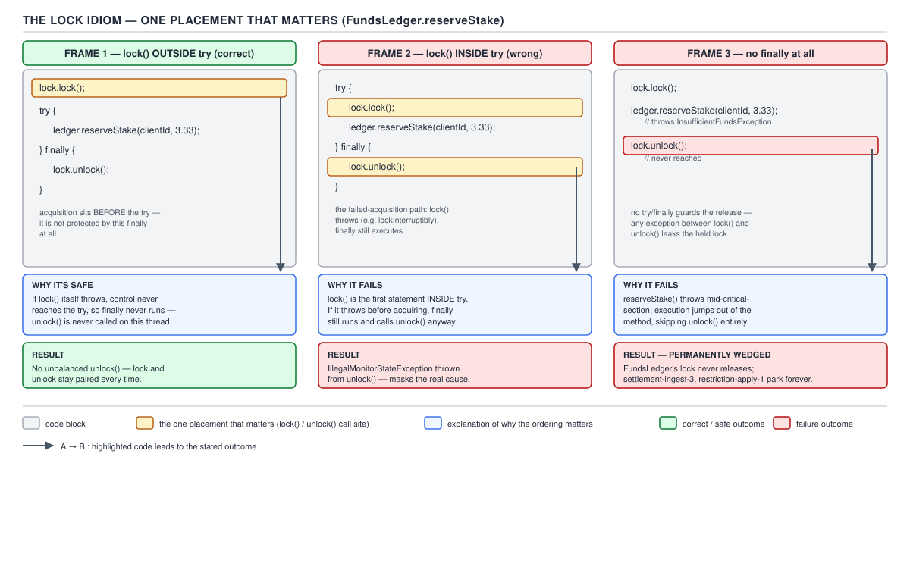
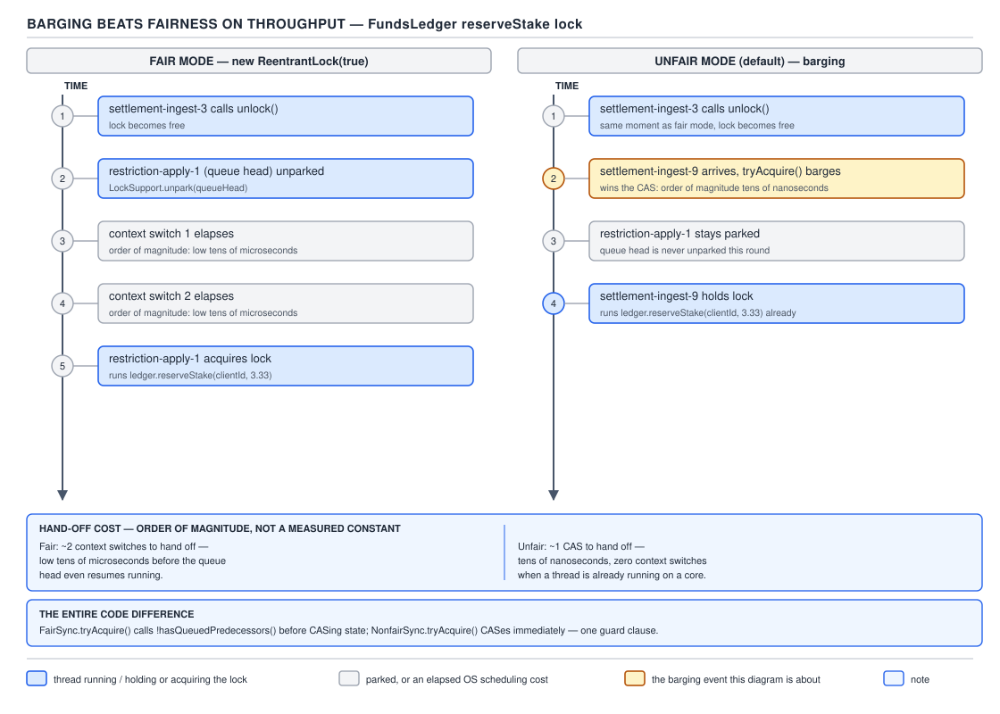
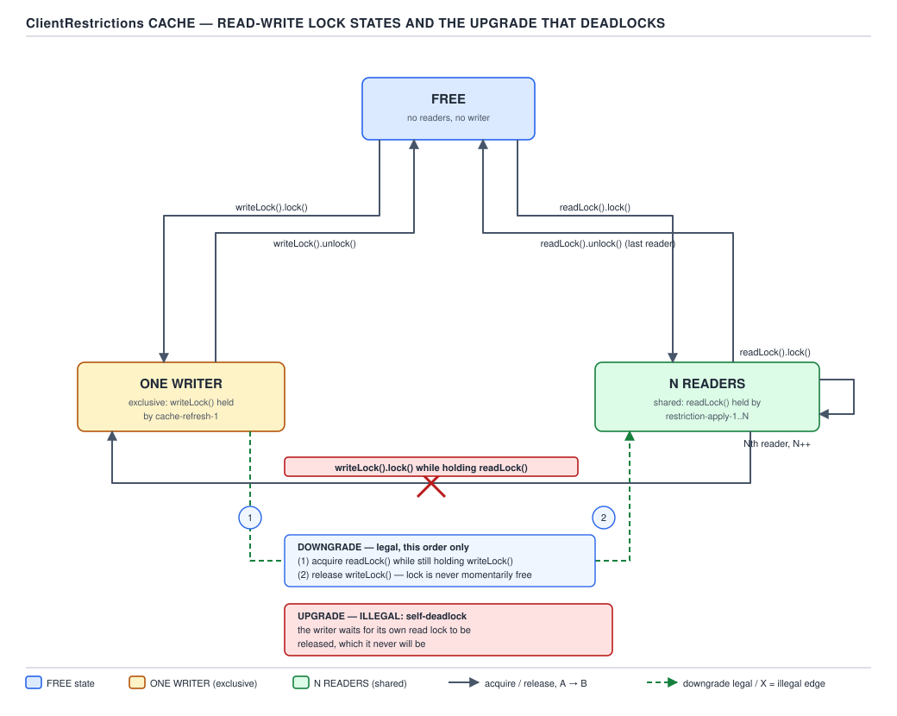

# 05 Multithreading and Concurrency — Explicit locks — BASICS (§1.14, leaves 1.14.1–1.14.18)

**Target version: Java 21 LTS.** | **Part 1 of 5** | [Index](../00-index.md)
Previous: [Adders, VarHandles and the ordering levels](../atomics/01b-basics-adders-varhandles-ordering.md) · Next: [StampedLock and LockSupport](01b-basics-stampedlock-and-locksupport.md)

`synchronized` gives you exactly one lock shape: block-scoped, reentrant, released automatically on exit or exception, one implicit condition. Explicit locks in `java.util.concurrent.locks` give up that automatic release in exchange for four things `synchronized` cannot do: try the lock and back off if it's busy, wait for it with a timeout, be interrupted while waiting, and — the two features this file spends most of its budget on — choose fairness policy and split one lock into several named wait-conditions.

## The `Lock` interface

`Lock` is the contract: `lock()`, `lockInterruptibly()`, `tryLock()`, `tryLock(long, TimeUnit)`, `unlock()`, `newCondition()`. `ReentrantLock` is the general-purpose implementation — same reentrancy and mutual-exclusion guarantee as `synchronized`, plus everything the interface promises. Nothing here is auto-released: the object holding the lock state does not know when your method returns or throws. That single fact is why leaf 1.14.2 exists.

### The mandatory idiom, and the one placement that matters

**Why it exists.** A `synchronized` block cannot leak its lock — the JVM inserts the release on every exit path, including exceptional ones, as part of the bytecode contract (`monitorenter`/`monitorexit` with an exception-table entry that guarantees the matching `monitorexit`). `Lock` is a plain interface backed by a plain object; `unlock()` is a method call like any other, and a method call you don't reach never runs. Before `java.util.concurrent.locks` existed, the only way to add timeout or interruptibility to mutual exclusion was to hand-roll it with `wait`/`notify` and a boolean flag — workable, but every such implementation had to re-solve the same acquisition/release bookkeeping that `Lock` now does once, correctly.

**When to reach for it.** Reach for an explicit lock when you need `tryLock`, a timeout, interruptibility, fairness, or more than one condition on the same guarded state. Otherwise `synchronized` wins on brevity and on the exact guarantee this section is about: it cannot forget to release.

**The mechanism, and the trap.** The correct idiom acquires the lock *before* the `try` block starts:

```java
walletLock.lock();
try {
    debitCashAvailable(clientId, amount);
    creditCashReserved(clientId, amount);
} finally {
    walletLock.unlock();
}
```

If `lock()` throws or blocks forever, execution never reaches the `try`, so `finally` never runs an `unlock()` against a lock this thread never acquired. Move `lock()` inside the `try` and the story changes: `lock()` still has to complete before the body runs, so in the ordinary case nothing looks different. The failure mode is narrower but real — `lockInterruptibly()` can throw `InterruptedException` *while* acquiring, and any exception thrown by application code that runs between "started acquiring" and "fully acquired" (rare, but plugin-style `Lock` implementations exist) reaches the `finally` with the lock never held. `unlock()` then runs against a lock this thread does not own, and `ReentrantLock.unlock()` throws `IllegalMonitorStateException` for that. The rule that avoids the whole class of bug: acquisition is never inside the `try` it protects.



**D-057** — The `Lock` idiom, and the one placement that matters.

**Pitfall:** forgetting the `finally` entirely — `walletLock.lock(); debitCashAvailable(...); walletLock.unlock();` — is the leaf 1.14.3 trap. `synchronized` releases on exception automatically; `Lock` has no such safety net. If `debitCashAvailable` throws because the wallet has insufficient stakeable funds, `unlock()` on the line after it never runs, `walletLock` stays held forever, and every other thread that later calls `walletLock.lock()` for that same wallet blocks permanently. There is no timeout, no log line, no exception on the blocked callers — the service just stops making progress on that wallet, and the only visible symptom in production is a growing queue of stuck withdrawal and stake requests with no exception anywhere. The fix is always `try { … } finally { unlock(); }`, with `lock()` outside the `try`.

> **Definition:** `Lock` is an interface for manual mutual exclusion whose release is a method call, not a JVM-enforced guarantee — which makes `lock(); try { … } finally { unlock(); }`, acquisition strictly outside the `try`, the only safe idiom.

## `ReentrantLock`: what it buys over `synchronized`

`ReentrantLock` gives the same reentrant, mutually-exclusive semantics as a `synchronized` block, then layers on: polled acquisition (`tryLock()`), timed acquisition (`tryLock(long, TimeUnit)`), interruptible acquisition (`lockInterruptibly()`), a fairness policy, multiple named conditions, and instrumentation. It is built on `AbstractQueuedSynchronizer` (AQS) — the same queuing framework this topic's internals files walk in detail — using a single `int state` for the hold count.

Instrumentation methods worth knowing by name rather than by heavy use: `isLocked()`, `isHeldByCurrentThread()`, `getHoldCount()` (reentrancy depth for the calling thread), `getQueueLength()` (an estimate of threads waiting to acquire), `hasQueuedThreads()`, `hasQueuedThread(Thread)`, `getWaitQueueLength(Condition)` (an estimate of threads waiting on a given condition), and the protected `getOwner()` for subclasses. These are diagnostic, not synchronization primitives in their own right — `getQueueLength()` in particular is a best-effort estimate, not a value you should branch production logic on, because the queue can change between the read and the decision.

## `tryLock()` versus `tryLock(0, unit)`: the barging trap

These look identical — both return immediately, both return `false` rather than block. They are not the same call. `tryLock()` **barges**: it always attempts an immediate CAS on the lock state, even when the lock was constructed with `fair = true` and other threads are already queued waiting their turn. `tryLock(0, TimeUnit.SECONDS)`, by contrast, goes through the timed-acquire path, and in a fair lock that path checks the queue first — if any thread is already waiting, `tryLock(0, unit)` returns `false` rather than jump the line. The zero timeout does not mean "the same as the no-arg form, just spelled differently"; it means "give fairness exactly one chance to say no, then give up."

**Pitfall:** code that assumes fairness is respected everywhere just because the lock was built with `new ReentrantLock(true)`, then calls the bare `tryLock()` on a hot path "to avoid blocking," has silently reintroduced barging into an otherwise-fair lock. The fix is either to accept barging (drop the fairness requirement, since a stray `tryLock()` defeats it anyway) or to use `tryLock(0, TimeUnit.SECONDS)` everywhere a non-blocking attempt is needed under a fair lock.

## Fairness versus barging

**Mental model.** An unfair lock is a doorway: whoever is standing in front of it when it opens walks through, queue or no queue. A fair lock is a ticket line: the doorway only opens for the ticket at the front, no matter who else is standing closer.

**Why it exists / the tradeoff.** `new ReentrantLock()` is unfair by default; `new ReentrantLock(true)` makes it fair — FIFO grant order, no barging, ever. Fairness exists because unfair locks can, in principle, starve a queued thread indefinitely if arriving threads keep barging in ahead of it. What it costs is the reason almost nobody turns it on: every fair hand-off has to wake the exact thread at the head of the queue and wait for the OS scheduler to actually run it, which is a context switch, versus an unfair hand-off where an arriving thread already running on a CPU can just take the lock with no wake-up involved at all.

**Why unfair is faster — worked through, not asserted.** Picture the `walletLock` guarding a client's four buckets under load: dozens of stake settlements per second all wanting a brief critical section on the same wallet. Thread A holds the lock and is about to release it. Thread B is queued, parked, waiting its turn. Thread C is a brand-new settlement arriving at that exact instant.

- **Fair mode:** A releases the lock. The AQS release path finds B at the queue head and unparks it. B is currently blocked, off any CPU core; the OS scheduler has to notice the unparked thread, schedule it, and context-switch it back onto a core before B can even attempt the CAS on the lock state. C, arriving during that window, is required to queue behind B even though the lock is sitting free the whole time A→B is happening. Two context switches are on the critical path of every single hand-off: park B out, then schedule B back in.
- **Unfair mode:** A releases the lock. C is already running, already holds a CPU, and attempts the CAS on the lock state immediately — no wake-up needed because C was never asleep. C very often wins that race and proceeds without B ever being touched. B stays parked, and only gets its turn on some later release when no barging thread happens to be arriving at the same instant.

Order of magnitude only, because no authoritative per-instruction table exists for park/unpark costs across JVMs and OSes: a context switch plus scheduling latency runs somewhere in the microseconds-to-tens-of-microseconds range on commodity hardware, while an uncontended CAS is nanoseconds. Skipping even one such wake-up on the common path is why unfair mode wins by a large factor under contention — not a fixed percentage, since it depends entirely on how often an arriving thread beats the parked one to the punch, but the direction and the order of magnitude are consistent across implementations. The entire code difference between the two policies is one guard in the acquire path: a fair `ReentrantLock` calls `hasQueuedPredecessors()` before attempting the CAS and refuses to jump ahead if it returns `true`; an unfair lock skips that check and always tries the CAS first.



**D-058** — Barging beats fairness on throughput.

**Insight:** fairness prevents *starvation* — no thread waits forever — but it does not prevent **lock convoys**: a sequence of threads each holding the lock only briefly can still serialize behind each other with a full park/unpark cycle on every single hand-off, so a fair lock under heavy short-hold contention can have dramatically lower throughput than the same workload unfair, even though no individual thread is starved.

**Interview:** "Why is the default `ReentrantLock` unfair?" — because avoiding the wake-up-and-context-switch on every hand-off usually wins by a large factor on throughput, and starvation in practice is rare enough that most code should default to unfair and reach for fairness only when a measured starvation problem demands it.

> **Definition:** fairness trades throughput for a FIFO grant-order guarantee — a fair lock never lets an arriving thread barge ahead of one already queued, at the cost of a park/unpark cycle on every hand-off that an unfair lock can often skip.

## `Condition`: named wait-sets on one lock

**Mental model.** A `synchronized` block has exactly one implicit wait-set — every waiter calls `wait()` on the same monitor and `notifyAll()` has to wake all of them even when only one kind of waiter can actually proceed. A `Condition` is a wait-set you can name and create as many of as you need, all still guarded by the same lock's mutual exclusion.

**Why it exists.** Before `Condition`, a bounded buffer guarded by `synchronized` had one wait-set doing two unrelated jobs: producers waiting for space and consumers waiting for data both called `wait()` on the same monitor. A `notifyAll()` after a single item was added had to wake every waiter — producers and consumers alike — even though only one waiting consumer could actually make progress; the rest woke up, rechecked their condition, found it still false, and went straight back to sleep. `Condition` lets each kind of waiter sleep on its own queue.

**API mapping.** `Condition.await()` ↔ `Object.wait()`; `await(time, unit)` / `awaitNanos(long)` ↔ timed `wait`; `awaitUninterruptibly()` has no monitor equivalent; `awaitUntil(Date)` is a deadline form; `signal()` ↔ `notify()`; `signalAll()` ↔ `notifyAll()`. Every `Condition` is created from a `Lock` via `newCondition()` and is only usable while that lock is held, exactly as `wait`/`notify` require the monitor.

### Multiple conditions on one lock — the headline feature

Leaf 1.14.11 `[BUILD]`. A bounded queue of withdrawal transactions awaiting the next `PaymentRun`, guarded by one `ReentrantLock` with two conditions — `notFull` for producers, `notEmpty` for consumers — so a `signal()` only ever wakes a thread that can actually proceed:

```java
import java.util.concurrent.locks.Condition;
import java.util.concurrent.locks.ReentrantLock;
import java.util.ArrayDeque;
import java.util.Queue;

public final class WithdrawalRunBuffer {

    private final ReentrantLock lock = new ReentrantLock();
    private final Condition notFull = lock.newCondition();
    private final Condition notEmpty = lock.newCondition();
    private final Queue<WithdrawalTransaction> pending = new ArrayDeque<>();
    private final int capacity;

    public WithdrawalRunBuffer(int capacity) {
        this.capacity = capacity;
    }

    public void submit(WithdrawalTransaction txn) throws InterruptedException {
        lock.lock();
        try {
            while (pending.size() == capacity) {
                notFull.await();
            }
            pending.add(txn);
            notEmpty.signal();
        } finally {
            lock.unlock();
        }
    }

    public WithdrawalTransaction takeForPaymentRun() throws InterruptedException {
        lock.lock();
        try {
            while (pending.isEmpty()) {
                notEmpty.await();
            }
            WithdrawalTransaction txn = pending.remove();
            notFull.signal();
            return txn;
        } finally {
            lock.unlock();
        }
    }
}
```

A batch operator's `PaymentRun` collector calls `takeForPaymentRun()` and parks on `notEmpty` until a withdrawal is queued; a withdrawal request calls `submit()` and parks on `notFull` only when the buffer is at capacity. Signalling `notEmpty` after an add never wakes a producer waiting on `notFull` — that queue is a different object entirely, so the wasted-wakeup problem `synchronized`'s single wait-set has is structurally impossible here.

**Pitfall:** mixing the two APIs — calling `wait()`/`notify()` on a `Condition` object, or `signal()`/`await()` on a plain monitor — is a distinct trap from forgetting `while`. `Condition` is not a monitor and does not implement `wait`/`notify`; calling `Object.wait()` on a `Condition` instance just waits on that object's own intrinsic monitor, which nothing else is signalling, and the thread hangs forever with no exception. The fix is to never let the two vocabularies touch: a `Lock`'s waiters use `Condition.await`/`signal` exclusively, a monitor's waiters use `wait`/`notify` exclusively.

**Pitfall:** `Condition.await()` must be called inside a `while` loop re-checking the guard condition, exactly as `Object.wait()` must — spurious wakeup is a documented possibility for both, and a bare `if (pending.isEmpty()) notEmpty.await();` can return from `await()` with the queue still empty, letting `takeForPaymentRun()` proceed to `pending.remove()` on an empty queue.

> **Definition:** `Condition` decouples a lock's wait-set from the lock itself, so `ReentrantLock` can host as many independently-signalled wait-queues as the guarded state has distinct "waiting for X" cases — the fix for `notifyAll()` waking waiters that still can't proceed.

### `awaitNanos` returns the remaining time, not the elapsed time

Leaf 1.14.14 `[SOURCE]`. The javadoc for `Condition.awaitNanos(long nanosTimeout)` states the return value is *"An estimate of the `nanosTimeout` value minus the time spent waiting upon return from this method, or a value less than or equal to zero if it timed out."* That phrasing is the whole trap and the whole fix in one sentence: the method does not tell you how long you waited, it tells you how much of your budget is left. A correct deadline loop feeds that return value straight back in as the next call's argument:

```java
long remainingNanos = unit.toNanos(timeout);
lock.lock();
try {
    while (pending.isEmpty()) {
        if (remainingNanos <= 0L) {
            return null;
        }
        remainingNanos = notEmpty.awaitNanos(remainingNanos);
    }
    return pending.remove();
} finally {
    lock.unlock();
}
```

Writing this with elapsed-time bookkeeping instead — `long start = System.nanoTime(); ... awaitNanos(timeout - (System.nanoTime() - start))` — also works, but duplicates arithmetic `awaitNanos` already does for you and is a common source of off-by-one deadline bugs under spurious wakeup; taking the return value directly is both shorter and the documented contract.

> **Definition:** `awaitNanos` returns remaining budget, not elapsed time, so a correct timed-wait loop reassigns the return value into the next call's argument rather than recomputing a deadline by hand.

## `ReentrantReadWriteLock`: many readers or one writer

**Mental model.** One `ReentrantReadWriteLock` object exposes two `Lock` views — `readLock()` and `writeLock()` — over one shared state. Any number of threads can hold the read lock at once; the write lock is exclusive against both readers and other writers. It is the same mutual-exclusion primitive as `ReentrantLock`, split by whether the holder promises not to mutate.

**Why it exists.** A plain `ReentrantLock` serializes every access to guarded state, readers included, even though two readers running concurrently can never corrupt anything a writer isn't also touching at the same instant. `ClientRestrictions` lookups — checking whether a client is `SELF_EXCLUDED` or `WITHDRAWAL_HELD` before letting an action through — run on close to every request, while the underlying restriction set changes rarely; serializing all of those reads behind one exclusive lock wastes concurrency that costs nothing to give back.

**When to reach for it, and when not.** `ReentrantReadWriteLock` wins when reads dominate heavily and each critical section does enough work to amortise the read-write lock's extra bookkeeping — acquiring and releasing it costs more instructions than a plain `ReentrantLock` because it has to track reader count, writer identity, and (in fair mode) separate reader/writer queues. Both fair and non-fair modes are available, same constructor shape as `ReentrantLock`. Where it loses: workloads with any meaningful write fraction, or critical sections so short that the extra bookkeeping outweighs the concurrency gained by letting readers overlap — there, a plain `ReentrantLock` is both simpler and faster.

```java
import java.util.concurrent.locks.ReentrantReadWriteLock;

public final class ClientRestrictionsCache {

    private final ReentrantReadWriteLock rw = new ReentrantReadWriteLock();
    private java.util.Set<RestrictionKey> active = java.util.Set.of();

    public boolean isRestricted(RestrictionType type, RestrictionSource source) {
        rw.readLock().lock();
        try {
            return active.contains(new RestrictionKey(type, source));
        } finally {
            rw.readLock().unlock();
        }
    }

    public void refresh(java.util.Set<RestrictionKey> latest) {
        rw.writeLock().lock();
        try {
            this.active = java.util.Set.copyOf(latest);
        } finally {
            rw.writeLock().unlock();
        }
    }
}
```

`ClientRestrictionsCache` is read-dominated at 99% of calls — every gate check on deposit, stake and withdrawal paths calls `isRestricted`, while `refresh` only runs when compliance or an operator changes something. Any number of `isRestricted` calls run concurrently under the read lock; `refresh` blocks until every in-flight reader finishes, then holds exclusive access for the swap.

### Downgrading is legal; upgrading self-deadlocks

Downgrading — holding the write lock, then acquiring the read lock *before* releasing the write lock — is explicitly supported and is the one safe way to move from exclusive to shared access without a gap where another writer could sneak in and change the state you just wrote:

```java
rw.writeLock().lock();
try {
    active = java.util.Set.copyOf(latest);
    rw.readLock().lock();   // acquire read lock while still holding write lock
} finally {
    rw.writeLock().unlock(); // now safe to drop write, read lock still held
}
try {
    // continue under read lock, guaranteed to see the write just made
} finally {
    rw.readLock().unlock();
}
```

Upgrading — holding the read lock and then trying to acquire the write lock — is **not supported** and deadlocks by construction, not by a documented restriction that merely throws. `ReentrantReadWriteLock`'s write lock cannot be acquired while any reader holds the read lock, including the calling thread itself: the lock has no way to tell "the only reader left is me, so let me through" from "some other thread still holds a read lock." A thread that calls `writeLock().lock()` while holding `readLock()` therefore waits for its own read lock to be released — which it never will, because the same thread is now blocked trying to acquire the write lock instead of running the code that would release the read lock. The fix is never to attempt it: release the read lock fully, then acquire the write lock fresh, accepting that another thread may change the state in the gap and re-checking after acquiring.



**D-059** — Read-write lock states, and the upgrade that deadlocks.

**Pitfall:** reaching for read-write locks reflexively on anything with more reads than writes, then finding throughput *worse* than a plain `ReentrantLock`. If `isRestricted` were a single `Set.contains` call taking tens of nanoseconds, the extra bookkeeping `ReentrantReadWriteLock` does per acquisition can cost more than the plain lock ever would have, and a workload at even 10–20% writes gives writers enough exclusive-access windows that readers rarely overlap in practice anyway — measure before reaching for it, and default to `ReentrantLock` unless the read fraction and the critical-section length both justify the extra machinery.

> **Definition:** `ReentrantReadWriteLock` lets any number of readers hold the lock concurrently against one exclusive writer, and pays for that with heavier per-acquisition bookkeeping — worth it only when reads dominate heavily and each critical section is long enough to amortise the cost; write-lock-to-read-lock downgrading is safe, read-lock-to-write-lock upgrading self-deadlocks.

## Reader and writer starvation, and the write-preference heuristic

In non-fair mode, `ReentrantReadWriteLock` biases toward writers to bound writer starvation: when a writer is waiting, the lock's non-fair acquisition path prefers to let that writer proceed over admitting new readers that arrive after it, rather than letting a continuous stream of overlapping readers starve the writer indefinitely. The precise ordering guarantees are unspecified by the javadoc for non-fair mode — the class documentation deliberately reserves the right to reorder for throughput — so treat "writers get preference over newly arriving readers" as the documented intent rather than a hard guarantee to code against. Fair mode removes the ambiguity at a cost: fair mode grants exactly in arrival order for both readers and writers, favoring neither reader-starvation nor writer-starvation over the other but paying the same context-switch price on every hand-off that fair `ReentrantLock` does.

**Interview:** "Can readers starve writers, or writers starve readers, in `ReentrantReadWriteLock`?" — in non-fair mode a continuous stream of readers is prevented from starving a waiting writer by the write-preference heuristic; use fair mode when strict arrival-order fairness matters more than throughput.

## Pitfalls

### Assuming `lock()` inside the `try` is equivalent to `lock()` before it

**Wrong**

```java
try {
    walletLock.lock();
    debitCashAvailable(clientId, amount);
} finally {
    walletLock.unlock();
}
```

If `lock()` throws partway through acquisition (interruption via `lockInterruptibly`, or an exception from a custom `Lock` implementation's acquire path), control reaches `finally` with the lock never held, and `unlock()` throws `IllegalMonitorStateException` against a lock this thread doesn't own — or worse, silently releases a lock some *other* thread holds, if the `Lock` implementation doesn't check ownership.

**Right**

```java
walletLock.lock();
try {
    debitCashAvailable(clientId, amount);
} finally {
    walletLock.unlock();
}
```

Acquisition strictly outside the `try` guarantees `finally` only ever runs when this thread genuinely holds the lock.

**Why people believe it:** `try`/`finally` "wrapping everything" looks more defensive, and for exceptions thrown by the *body* it makes no difference — the divergence only shows up on the much rarer case of an exception during acquisition itself, which most manual testing never exercises.

### Believing fairness is respected by every acquisition path on a fair lock

**Wrong**

```java
ReentrantLock fairLock = new ReentrantLock(true);
// ... elsewhere, on a hot path:
if (fairLock.tryLock()) {
    // barges ahead of any queued thread, even though fairLock is "fair"
}
```

**Right**

```java
if (fairLock.tryLock(0, TimeUnit.SECONDS)) {
    // respects fairness: fails fast if any thread is already queued
}
```

**Why people believe it:** the no-arg and zero-timeout forms of `tryLock` read as interchangeable "try once, don't block" calls, and nothing in either signature hints that one of them checks the queue and the other doesn't.

## Cheat sheet

| Concept | Key fact |
|---|---|
| `Lock` idiom | `lock()` outside `try`, `unlock()` in `finally` — never the reverse |
| Forgotten `finally` | Permanently wedged lock, no exception, no timeout — silent hang |
| `ReentrantLock` vs `synchronized` | Adds tryLock, timed/interruptible acquire, fairness, multiple conditions, instrumentation |
| `tryLock()` | Always barges, fair or not |
| `tryLock(0, unit)` | Respects fairness — fails if a thread is already queued |
| Fair lock | FIFO, no barging, one park/unpark cycle per hand-off — throughput cost |
| Unfair lock (default) | Barging allowed, can skip the wake-up entirely — faster under contention |
| `hasQueuedPredecessors()` | The entire code difference between fair and unfair acquire |
| Fairness prevents | Starvation. Does **not** prevent lock convoys |
| `Condition` | Named wait-set per `Lock`; `await`/`signal`/`signalAll` map to `wait`/`notify`/`notifyAll` |
| Multiple conditions | One lock, several queues (`notFull`, `notEmpty`) — signal only who can proceed |
| Mixing APIs | `wait`/`notify` on a `Condition`, or `signal`/`await` on a monitor — hangs, no exception |
| `Condition.await` | Must be in a `while` loop — spurious wakeup applies |
| `awaitNanos` | Returns **remaining** time — feed the return value into the next call |
| `ReentrantReadWriteLock` | Many readers or one writer, same lock object, two `Lock` views |
| Downgrade (write → read) | Legal — acquire read before releasing write |
| Upgrade (read → write) | **Self-deadlocks** — not supported |
| RW-lock wins when | Reads dominate heavily AND critical section is long enough to amortise overhead |
| RW-lock loses when | Writes are non-trivial fraction, or critical section is very short |
| Non-fair RW-lock | Write-preference heuristic bounds writer starvation; exact order unspecified |
| Fair RW-lock | Strict arrival order for both readers and writers |

## Self-test

**Q1.** Why does placing `lock()` inside the `try` block (rather than before it) matter, even though it looks equivalent for exceptions thrown by the method body?

<details><summary>Answer</summary>

If `lock()` itself throws or is interrupted partway through acquisition, control reaches the `finally` block with the lock never actually held by this thread. `unlock()` then runs against a lock this thread doesn't own, which `ReentrantLock` reports as `IllegalMonitorStateException`. Keeping `lock()` strictly outside the `try` guarantees the `finally` only ever executes when the lock is genuinely held.

</details>

**Q2.** A wallet's `ReentrantLock` is acquired but the code between `lock()` and `unlock()` throws an unchecked exception, and there is no `finally`. What happens to every other thread that later calls `lock()` on that same `ReentrantLock`?

<details><summary>Answer</summary>

They block forever. `Lock`, unlike `synchronized`, does not release automatically on an exceptional exit — release is a plain method call that was never reached. Every subsequent caller of `lock()` on the same lock object queues indefinitely with no exception and no timeout; the only visible symptom is a growing backlog of stuck operations on that wallet.

</details>

**Q3.** What is the actual difference between `tryLock()` and `tryLock(0, TimeUnit.SECONDS)` on a fair `ReentrantLock`?

<details><summary>Answer</summary>

`tryLock()` always barges — it attempts the CAS immediately regardless of whether other threads are already queued, even on a fair lock. `tryLock(0, unit)` goes through the timed-acquire path, which on a fair lock checks for queued predecessors first and returns `false` immediately if any exist, rather than jumping the line. They are not interchangeable spellings of the same "non-blocking attempt" idea.

</details>

**Q4.** Work through why an unfair `ReentrantLock` is typically faster than a fair one under contention.

<details><summary>Answer</summary>

On a fair lock, releasing the lock requires waking the parked thread at the head of the queue and waiting for the OS scheduler to actually run it before it can attempt the CAS — a full park/unpark cycle and a context switch on every hand-off. On an unfair lock, a thread that is already running on a CPU when the lock becomes free can attempt the CAS immediately with no wake-up needed at all, and often wins the race before any parked thread is even touched. Skipping that wake-up on the common path is why unfair mode wins by a large factor under contention, though the exact factor depends on how often an arriving thread beats a parked one and no authoritative constant exists — only the direction and order of magnitude are reliable.

</details>

**Q5.** Does fairness prevent lock convoys? Explain.

<details><summary>Answer</summary>

No. Fairness prevents starvation — no thread waits forever — but a fair lock under heavy contention with short hold times can still serialize every single hand-off through a full park/unpark cycle, producing a "convoy" of threads each waiting on the OS scheduler in turn. Throughput can be dramatically worse than the same workload unfair, even though no individual thread is starved.

</details>

**Q6.** Why does `ReentrantLock` support multiple `Condition` objects instead of one implicit wait-set like `synchronized`?

<details><summary>Answer</summary>

A single wait-set forces every kind of waiter onto the same queue, so a `notifyAll()` wakes waiters that still can't proceed — for example waking producers when only a consumer's condition actually changed. Separate `Condition` objects (`notFull`, `notEmpty`) let each kind of waiter sleep on its own queue, so `signal()` only ever wakes a thread whose specific condition is now worth rechecking.

</details>

**Q7.** What happens if you call `Object.wait()` on a `Condition` instance, or `Condition.signal()` while holding only a monitor?

<details><summary>Answer</summary>

`Condition` does not implement the monitor wait/notify protocol. Calling `Object.wait()` on a `Condition` object waits on that object's own intrinsic monitor, which nothing signals — the thread hangs forever with no exception. The two APIs — `wait`/`notify` on monitors, `await`/`signal` on `Condition` — must never be mixed.

</details>

**Q8.** What does `awaitNanos` actually return, and how does that shape a correct timed-wait loop?

<details><summary>Answer</summary>

It returns an estimate of the *remaining* time budget — the original timeout minus time already spent waiting — not the elapsed time, and a value ≤ 0 if it timed out. A correct deadline loop feeds that returned value directly into the next call's argument (`remainingNanos = notEmpty.awaitNanos(remainingNanos);`) rather than recomputing a deadline from `System.nanoTime()` by hand.

</details>

**Q9.** Why does upgrading from a read lock to a write lock on `ReentrantReadWriteLock` deadlock, while downgrading works fine?

<details><summary>Answer</summary>

The write lock cannot be granted while any reader holds the read lock, including the calling thread itself, because the lock has no way to distinguish "the only remaining reader is me" from "another thread still holds a read lock." A thread holding the read lock that calls `writeLock().lock()` blocks waiting for its own read lock to be released — but it can never release it, because it is now blocked instead of running the code that would call `readLock().unlock()`. Downgrading works because the read lock is acquired while the write lock is still held, so there is no gap where another writer could interleave, and no such circular wait exists.

</details>

**Q10.** When does `ReentrantReadWriteLock` actually outperform a plain `ReentrantLock`, and when does it lose?

<details><summary>Answer</summary>

It wins when reads dominate heavily and each critical section is long enough to amortise the read-write lock's extra per-acquisition bookkeeping (tracking reader count, writer identity, and separate queues). It loses when the write fraction is non-trivial — writers still get exclusive access windows that reduce reader overlap in practice — or when the critical section is so short that the bookkeeping overhead outweighs any concurrency gained from letting readers overlap; there, a plain `ReentrantLock` is both simpler and faster.

</details>

---

**Leaves covered:** 1.14.1–1.14.18 (18 leaves)
**Leaves deferred:** none
**Diagrams included:** D-057, D-058, D-059
**Target version:** Java 21 LTS
**Lines:** 407
