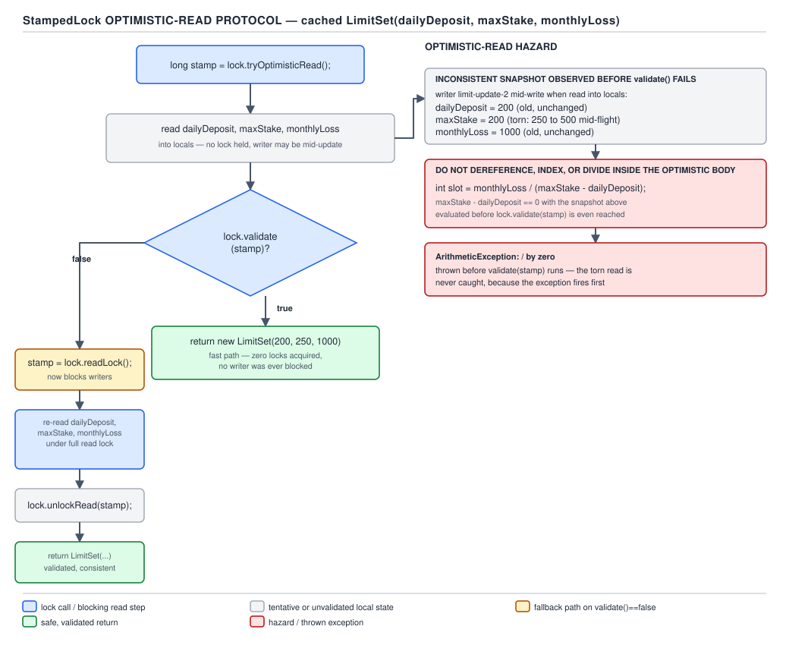
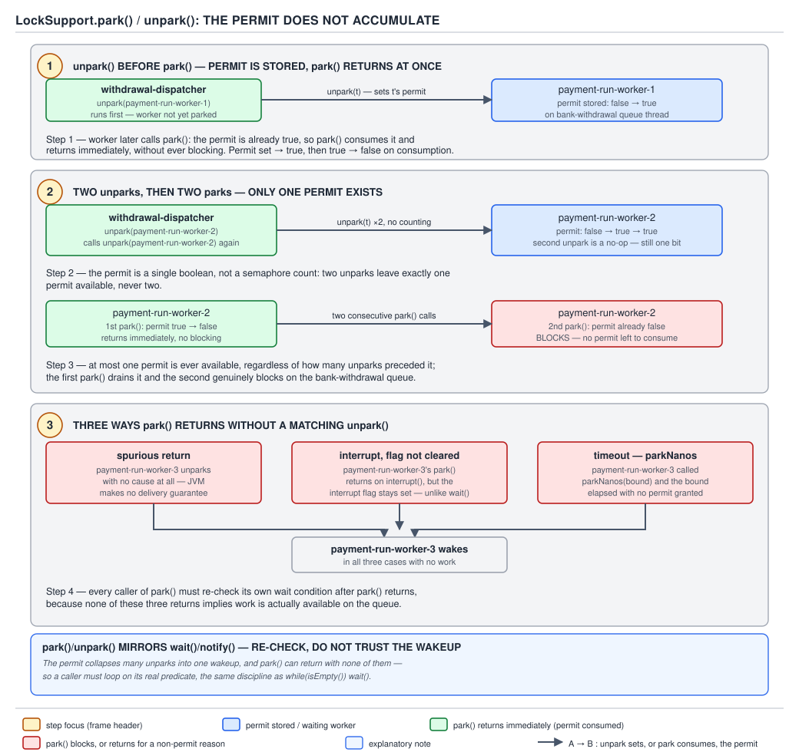

# 05 Multithreading and Concurrency — Explicit locks — BASICS (§1.14, leaves 1.14.19–1.14.29)

**Target version: Java 21 LTS.** | **Part 1 of 5** | [Index](../00-index.md)
Previous: [ReentrantLock and read-write locks](01a-basics-reentrantlock-and-rwlock.md) · Next: [Synchronizers](../synchronizers/01-basics.md)

## `StampedLock`: a third mode with no ownership

### Mental model

Forget "lock held by a thread." A `StampedLock` hands out a `long` **receipt**
(the stamp) for one of three modes — write, read, or **optimistic read** — and
the only thing it remembers is a version counter plus a mode bit-field packed
into that `long`. There is no per-thread owner field anywhere in the object.
That single design choice is what makes optimistic reads possible: an
optimistic "read" never actually blocks anyone, never even sets a bit that a
writer must check while it is running — it just remembers the version number
at the moment you asked, and lets you check afterwards whether a write slipped
in underneath you.

### Why it exists

`ReentrantReadWriteLock` (01a) still makes every reader take out a real lock:
an atomic increment on entry, an atomic decrement on exit, and — under
`StampedLock`'s cheaper mode — none of that. For a field that is read
constantly and written rarely, `ReentrantReadWriteLock`'s CAS traffic on the
shared reader count becomes the bottleneck even though no writer is
contending. `StampedLock`, added in Java 8 alongside the `java.time` API,
gives readers a mode that costs a volatile read and a comparison — no CAS, no
memory contention between readers — provided the reader is willing to retry
on the rare occasion a write actually happened.

### When to reach for it, and when not

Reach for `StampedLock`'s optimistic mode when: reads vastly outnumber writes,
the guarded state is a handful of plain fields (not a data structure with
internal pointers a torn read could corrupt), and the read body is cheap
enough to redo occasionally. QuizStakes's cached `LimitSet` snapshot — read on
every stake reservation, written only when compliance changes a client's
limits — is exactly this shape: 1,200 reservations/sec reading, updates
measured in per-client-per-day, not per-second.

Do not reach for it when: the read body must be reentrant (a nested call back
into the same lock self-deadlocks, leaf 1.14.22), when you need `Condition`
support (`newCondition()` throws off `StampedLock`'s read/write views, leaf
1.14.26), or when the guarded object graph has internal invariants that a
half-written intermediate state could crash on before you reach `validate`
(leaf 1.14.24) — `ReentrantReadWriteLock` wins there because its read lock is
a real, non-racing lock.

### How it works

The stamp is a `long` that encodes a version number in the high bits and a
mode indicator in the low bits. `tryOptimisticRead()` returns a non-zero
stamp if no thread currently holds the write lock — it does **not** register
the caller anywhere; it is a read of the current state word, nothing more.
The caller then reads whatever fields it needs into locals and calls
`validate(stamp)`, which re-reads the state word and checks that the version
has not moved and that no write lock was taken in between. If a write
happened — even one that already released — validation fails, and the caller
must fall back to a real `readLock()` (blocking, real accounting) to get a
guaranteed-consistent view.



**D-060** — The `StampedLock` optimistic-read protocol.

**Insight:** the reason this is race-free without any registration step is
that `validate` re-derives the answer from the same version counter a writer
must bump — there is nothing for the reader to "miss" telling the writer,
because the reader never tells the writer anything. The cost of the whole
scheme lands entirely on the rare writer, which still takes a real exclusive
lock, and on the rare *invalidated* reader, which pays for a retry.

`[BUILD]` The cached `LimitSet` read, with the JDK javadoc's canonical
`distanceFromOrigin` shape carried over field-for-field:

```java
final class CachedLimitSet {
    private final StampedLock lock = new StampedLock();

    private Money dailyDeposit;
    private Money maxStake;
    private Money monthlyLoss;

    Money maxStakeSnapshot() {
        long stamp = lock.tryOptimisticRead();
        Money currMaxStake = maxStake;
        Money currDailyDeposit = dailyDeposit;
        if (!lock.validate(stamp)) {
            stamp = lock.readLock();
            try {
                currMaxStake = maxStake;
                currDailyDeposit = dailyDeposit;
            } finally {
                lock.unlockRead(stamp);
            }
        }
        // currDailyDeposit read only to demonstrate a multi-field
        // optimistic read; a real caller would use it for a joint check.
        return currMaxStake;
    }

    void applyLimitChange(LimitSet updated) {
        long stamp = lock.writeLock();
        try {
            this.dailyDeposit = updated.dailyDeposit();
            this.maxStake = updated.maxStake();
            this.monthlyLoss = updated.monthlyLoss();
        } finally {
            lock.unlockWrite(stamp);
        }
    }
}
```

`tryOptimisticRead()` never blocks `applyLimitChange`, and `applyLimitChange`
never blocks `maxStakeSnapshot` from starting — it can only make the
in-progress optimistic read's eventual `validate` call fail, sending that one
caller through the slow, correct path.

**Pitfall (leaf 1.14.24):** the two locals `currMaxStake` and
`currDailyDeposit` above may be read from *different* versions of the object
if a write lands between the two field reads and before `validate` — the
optimistic body has no atomicity across the reads it performs, only a
promise that `validate` will notice afterwards. If the body had instead
computed `currDailyDeposit.amount().divide(currMaxStake.amount())` before
calling `validate`, that division runs against a torn, cross-version pair
that was never consistent at any real point in time — a stale `maxStake` of
zero divides by a live `dailyDeposit`, or vice versa, and the exception (or
worse, a silently wrong ratio) happens *before* the code ever finds out the
read was invalid. The rule is absolute: never dereference, index, or divide
by anything read inside the optimistic body until after `validate` returns
true.

> **Definition:** `StampedLock` is a capability-based lock that issues a
> `long` stamp per acquisition instead of tracking ownership, and adds a
> third, non-blocking optimistic-read mode that trades a mandatory
> post-hoc validation step for eliminating per-read lock contention.

## `StampedLock`'s three traps

Three behaviours break the mental model carried over from
`ReentrantReadWriteLock`, and all three are easy to miss until they fire in
production.

**D-061** — `StampedLock`'s three traps in one picture.

| What `ReentrantReadWriteLock` trained you to assume | What `StampedLock` actually does | Symptom |
|---|---|---|
| A thread that already holds the lock can re-acquire it (reentrancy) | Not reentrant at all — a stamp carries no thread identity to check against | A recursive or re-entrant call to `writeLock()`/`readLock()` from the same thread blocks forever on itself |
| Only the thread that acquired the lock can release it (ownership) | No ownership check — any thread holding *any* valid stamp value can call `unlockWrite`/`unlockRead` with it, and a deserialized `StampedLock` always comes back unlocked regardless of its state when serialized | A stamp passed to the wrong thread, or leaked into a shared field, lets an unrelated thread release a lock it never took; serialization silently drops lock state |
| `readLock().newCondition()` works like it does on `ReentrantReadWriteLock` | `asReadLock()` and `asWriteLock()` return `Lock` views whose `newCondition()` throws | `UnsupportedOperationException` at the first `await()` call, discovered only when that code path finally runs |

**Pitfall (leaf 1.14.22):** the reentrancy trap is the most common of the
three because it looks identical to correct code in review — a `PaymentRun`
worker that calls `maxStakeSnapshot()` from inside a method that already
holds the write lock (say, while applying a batched limit change that also
needs to read the current limits) deadlocks the very thread that is supposed
to release the lock. `ReentrantLock` and `synchronized` would silently permit
this by design; `StampedLock` has no such allowance, and the fix is
structural — never call back into the same `StampedLock` from a section that
already holds one of its stamps, read the fields you need before taking the
outer lock instead.

**Pitfall (leaf 1.14.23):** because there is no ownership check, a stamp is
just a number — treat it exactly as carefully as a raw file descriptor. Never
store a stamp in a field visible to more than the one call frame that must
release it, and never assume that a `StampedLock` field on a serialized
`Account` snapshot preserves lock state across the wire; it always
deserializes unlocked, so code that depends on "still locked after
deserialization" is depending on a guarantee `StampedLock` never made.

`[NUM]` (leaf 1.14.25) The javadoc states stamps "may recycle after (no
sooner than) one year of continuous operation" — the version counter is
finite-width and wraps, and a stamp held unused or unvalidated across that
wrap can pass `validate` incorrectly. This is not a practical concern for a
stamp used and released within a single method call (the overwhelming
majority of uses, including both examples above); it matters only for a
stamp deliberately cached and reused across a very long-lived operation,
which is itself an anti-pattern for this lock.

## `LockSupport.park`/`unpark`: the permit is not a counter

### Mental model

Every thread carries exactly one **permit**, a boolean that starts unset.
`LockSupport.park()` consumes the permit and returns immediately if one is
available; otherwise it blocks. `LockSupport.unpark(Thread t)` sets `t`'s
permit, waking a blocked `park()` if one is in progress. This single-bit
design — not a counting semaphore, not a queue — is deliberate: it is the
primitive `AbstractQueuedSynchronizer` itself is built on, one layer below
`ReentrantLock`, `CountDownLatch`, and every other `java.util.concurrent`
synchronizer (foreshadowing 05's synchronizers guide, next in this series).

### Why it exists

Before `park`/`unpark` (Java 5, alongside the rest of `java.util.concurrent`),
building a blocking primitive meant using `Object.wait()`/`notify()`, which
requires holding the object's monitor to call either — awkward when you want
to unpark a thread from code that has no reason to hold any lock on that
thread's behalf. `park`/`unpark` need no monitor, no `synchronized` block,
and target a specific `Thread` object directly, which is exactly the shape a
lock or synchronizer needs when parking one specific queued waiter.

### When to reach for it, and when not

`LockSupport` is a **building block**, not an application-level API — you
reach for it when you are writing a synchronizer (a custom AQS-based lock, a
bespoke bounded queue), not when you want to block a worker in ordinary
application code. QuizStakes's own `PaymentRun` worker illustrates both ends
of that line: application code writing a bank-withdrawal batch would use
`BlockingQueue.take()` (a synchronizer already built on this), and it is
*that* `take()` which, at its lowest level, calls `LockSupport.park(this)` on
the queue when it finds no `WithdrawalTransaction` waiting.

### How it works

`[PROVE]` (leaf 1.14.27) The permit does not accumulate, and working through
why that must be true is the point:

1. **`unpark` before `park`.** Thread A calls `unpark(B)` while B has not yet
   called `park()`. B's permit is now set. When B later calls `park()`, it
   sees the permit already available, consumes it, and returns immediately —
   it never blocks at all. This is what makes the API race-free: if `unpark`
   only worked on an already-parked thread, the ordinary race where the
   unparker runs first would lose the wakeup forever.
2. **Two `unpark`s, then two `park`s.** A calls `unpark(B)` twice in a row.
   The permit is a single boolean — the second `unpark` call sets a bit that
   is already set, a no-op. B then calls `park()` twice: the first call
   consumes the one available permit and returns immediately; the second
   call finds no permit and blocks for real, waiting for a third `unpark`.
   If the permit were a counter instead, both `park` calls would return
   immediately — this is precisely the distinction the javadoc calls out,
   and it is why `LockSupport` cannot be used as a general-purpose counting
   semaphore without a queue and counter layered on top (which is exactly
   what `Semaphore` does).



**D-062** — The park permit does not accumulate.

**Pitfall:** `park()` can return for reasons that have nothing to do with a
matching `unpark` — spuriously, with no cause at all; on interrupt, *without*
clearing the thread's interrupt status (`park` does not throw
`InterruptedException`, unlike `Object.wait()`); and on timeout, for
`parkNanos`/`parkUntil`. Every correct caller re-checks its actual wait
condition in a loop after `park()` returns rather than treating the return as
proof the condition changed — this is the same discipline `wait()` requires
and for the same reason.

`[DUMP]` (leaf 1.14.28) `LockSupport.park(Object blocker)` records the
blocker object so a thread dump can name what a parked thread is waiting on.
A `PaymentRun` worker blocked inside `BlockingQueue.take()` shows up in
`jstack` as:

```
"payment-run-worker-3" #47 prio=5 os_prio=0 tid=0x... nid=0x... waiting on condition [0x...]
   java.lang.Thread.State: WAITING (parking)
        at jdk.internal.misc.Unsafe.park(Native Method)
        - parking to wait for  <0x00000007b0012340> (a java.util.concurrent.locks.AbstractQueuedSynchronizer$ConditionObject)
        at java.util.concurrent.locks.LockSupport.park(LockSupport.java:221)
        at java.util.concurrent.locks.AbstractQueuedSynchronizer$ConditionObject.await(AbstractQueuedSynchronizer.java:1583)
        at java.util.concurrent.LinkedBlockingQueue.take(LinkedBlockingQueue.java:435)
```

Plain `park()` with no blocker argument produces the same stack but without
the `<0x...>` object identity — the overload that takes a blocker exists so
tooling has something to name.

`[X-REF]` The `ConditionObject` frame above is `AbstractQueuedSynchronizer`'s
condition-wait machinery, covered in full in the synchronizers guide (next
in this series) — the mechanism paragraph here is: `await()` parks the
calling thread with the `Condition` itself as the blocker object, which is
why the dump names a `ConditionObject`, not a raw lock.

**Insight:** `park`/`unpark` and a raw OS-level context switch are
order-of-magnitude cheaper than a full thread creation but order-of-magnitude
more expensive than a volatile field read or an uncontended CAS — there is no
authoritative per-instruction cost table for either, and any number quoted
to more precision than "an order of magnitude slower than a memory fence" is
not backed by a public benchmark.

> **Definition:** `LockSupport.park`/`unpark` is a per-thread, single-permit
> wake mechanism — not a counted semaphore — that lets one thread request
> another thread's suspension or resumption by direct reference, without
> either thread holding a monitor.

## `synchronized` versus `ReentrantLock`: the decision table

`[VERSION-TRAP]` (leaf 1.14.29) This is a comparison of more than three
axes and belongs in a table, including the Java 21 virtual-thread pinning
row and its Java 24 reversal:

| Axis | `synchronized` | `ReentrantLock` |
|---|---|---|
| Acquisition | Implicit, block/method scoped | Explicit `lock()`/`unlock()`, must be in `try`/`finally` |
| Interruptible acquire | No | Yes — `lockInterruptibly()` |
| Timed / non-blocking acquire | No | Yes — `tryLock()`, `tryLock(time, unit)` |
| Fairness option | No | Yes — `new ReentrantLock(true)` |
| Multiple wait conditions per lock | No — one implicit monitor per object | Yes — `newCondition()` any number of times |
| Reentrant | Yes | Yes |
| Diagnosability | JVM understands it natively — appears as `monitor` in dumps, deadlock detection built in | Appears as ordinary object state unless the JVM specifically instruments AQS; `jstack` still resolves it, but historically with less native tooling support |
| Uncontended-path cost | Cheap: JIT-optimized fast path via the object header (compact object headers reshape this further in Java 24+/25) | Cheap: CAS on an AQS `state` field — comparable in practice |
| **Virtual-thread pinning (Java 21 baseline)** | **Pins the carrier thread for the duration of the `synchronized` block** — a blocking operation inside it cannot unmount the virtual thread, starving the carrier pool under load | Does not pin — parking inside a `ReentrantLock`-guarded section unmounts the virtual thread normally |
| **Same row in Java 24+** | JEP 491 removes `synchronized`'s pinning behavior entirely; `-Djdk.tracePinnedThreads` is removed with it, since there is nothing left to trace | Unchanged — `ReentrantLock` was never the source of this problem |

**Pitfall:** "always use `ReentrantLock` instead of `synchronized` for virtual
threads" is a Java 21-scoped answer, not a permanent rule. On Java 24+, the
pinning hazard that motivated it is gone, and `synchronized`'s simplicity,
native deadlock detection, and lower boilerplate make it the default again
in ordinary code; `ReentrantLock` still earns its place wherever the
mechanism table above shows a checkmark it needs — timed acquisition,
interruptibility, fairness, or multiple conditions — none of which the
pinning fix changed.

**Interview:** "when would you pick `ReentrantLock` over `synchronized`?" —
answer with the mechanism, not the version trivia first: whenever you need
`tryLock`, `lockInterruptibly`, fairness, or more than one `Condition` on the
same lock; only mention virtual-thread pinning as a Java 21-specific
additional reason, and say explicitly that JEP 491 removes it in Java 24.

## Pitfalls

### Assuming `StampedLock`'s read lock behaves like `ReentrantReadWriteLock`'s

**Wrong**

```java
long stamp = lock.readLock();
try {
    long inner = lock.readLock(); // second read lock, same thread
    // ... work ...
    lock.unlockRead(inner);
} finally {
    lock.unlockRead(stamp);
}
```

Running this from a thread that already holds `stamp` blocks forever on the
inner `readLock()` call — `StampedLock` has no reentrancy check at all, read
or write.

**Right**

```java
long stamp = lock.readLock();
try {
    // do all the work needed under this one stamp; never re-enter the lock
} finally {
    lock.unlockRead(stamp);
}
```

Structure the code so a single stamp covers the whole critical section
instead of expecting nested acquisition to "just work" the way it does on
`ReentrantReadWriteLock`.

**Why people believe it:** `ReentrantLock`, `synchronized`, and
`ReentrantReadWriteLock` are all reentrant, and `StampedLock` sits in the
same package doing what looks like the same job — nothing in its API
signature warns you that this one behaves differently until it deadlocks.

### Treating an optimistic-read failure as an error instead of a signal

**Wrong**

```java
long stamp = lock.tryOptimisticRead();
Money snapshot = maxStake;
if (!lock.validate(stamp)) {
    throw new IllegalStateException("limit set changed mid-read");
}
return snapshot;
```

A `validate` failure is the **expected, common** outcome whenever a write
happens to land during the read window — throwing turns a routine retry path
into a production incident under any real write load.

**Right**

```java
long stamp = lock.tryOptimisticRead();
Money snapshot = maxStake;
if (!lock.validate(stamp)) {
    stamp = lock.readLock();
    try {
        snapshot = maxStake;
    } finally {
        lock.unlockRead(stamp);
    }
}
return snapshot;
```

Always fall back to the blocking `readLock()` path; never surface a failed
`validate` as an exception.

**Why people believe it:** `validate` returning `false` reads like an
assertion failure in isolation, and the fallback path is easy to omit when
the lock is new to the codebase and writes are rare in testing.

## Cheat sheet

| Item | Fact |
|---|---|
| `StampedLock` modes | write, read, optimistic read — all via `long` stamps |
| Optimistic protocol | `tryOptimisticRead()` → read fields → `validate(stamp)` → fallback `readLock()` if invalid |
| Reentrancy | None — recursive acquire self-deadlocks |
| Ownership | None — any thread can unlock any stamp; deserializes unlocked |
| `newCondition()` | Throws `UnsupportedOperationException` on `asReadLock()`/`asWriteLock()` views |
| Stamp lifetime | May recycle after ≥1 year of continuous operation (javadoc) |
| Optimistic-body rule | Never dereference/index/divide by unvalidated reads |
| `LockSupport` permit | One bit per thread, not a counter |
| `unpark` before `park` | Remembered — `park` returns immediately |
| Two `unpark`s, two `park`s | First `park` returns immediately, second blocks |
| `park` can return | Spuriously, on interrupt (flag not cleared), on timeout — always re-check |
| `park(Object blocker)` | Lets `jstack` name what's being waited on |
| `park`/`unpark` cost | Order of magnitude above a memory fence, below full thread creation — no authoritative table exists |
| `synchronized` vs `ReentrantLock`, Java 21 | `synchronized` pins virtual threads; `ReentrantLock` does not |
| Same, Java 24+ | JEP 491 removes the pinning; both are fine again |

## Self-test

**Q1.** Why can `tryOptimisticRead()` avoid taking a real lock at all, unlike `readLock()`?

<details><summary>Answer</summary>

It only records the current version/state word and returns it as a stamp —
it never registers the caller anywhere the way a real read lock does, so a
concurrent writer never has to know or care that an optimistic read is in
flight. All the correctness work happens afterward, in `validate`, which
re-checks whether the version moved.

</details>

**Q2.** A `maxStakeSnapshot()` method reads two related `Money` fields inside an optimistic-read block and immediately divides one by the other, before calling `validate`. What can go wrong?

<details><summary>Answer</summary>

The two fields can be read from different, inconsistent versions of the
object if a write lands between the two reads — one field is pre-update, the
other post-update. Dividing them before `validate` runs means the division
executes against a state that never existed at any single point in time,
which can throw (e.g. divide by a transiently-zero field) or silently
produce a wrong ratio. The fix is to defer any use of the read values until
after `validate` returns true.

</details>

**Q3.** Why does a `StampedLock`-guarded method that calls back into the same lock from within its own write-locked section deadlock, when the equivalent `ReentrantLock` code would not?

<details><summary>Answer</summary>

`StampedLock` carries no per-thread ownership information in its stamp or
internal state, so it has nothing to compare against to recognize "the
caller already holds this." It simply blocks the second acquisition attempt
as if it came from an unrelated thread. `ReentrantLock` explicitly tracks
the owning thread and a hold count, which is what makes its reentrant
acquisition a no-op increment instead of a block.

</details>

**Q4.** What guarantee does `StampedLock` lose across Java serialization that `ReentrantReadWriteLock` also loses, and what does `StampedLock` do instead of throwing?

<details><summary>Answer</summary>

Lock state is not preserved across serialization — a `StampedLock` field
always deserializes back into the unlocked state regardless of what it held
when serialized, rather than throwing or attempting to reconstruct the
prior state.

</details>

**Q5.** Two `unpark(t)` calls are made against a thread `t` that has not yet called `park()`. `t` then calls `park()` twice in a row. What happens on each call, and why?

<details><summary>Answer</summary>

The first `park()` call finds the permit set (from either of the two
`unpark` calls — the second was a no-op since the permit is a single bit,
not a count) and returns immediately, consuming the permit. The second
`park()` call finds no permit available and blocks, because nothing set the
permit again after the first call consumed it.

</details>

**Q6.** Why must every caller of `LockSupport.park()` re-check its actual wait condition in a loop after `park()` returns, rather than trusting the return as proof the condition is satisfied?

<details><summary>Answer</summary>

`park()` can return for reasons unrelated to a matching `unpark`: spuriously,
with no cause at all; because the thread was interrupted, which `park()`
reports only by leaving the interrupt status set rather than throwing; or,
for the timed variants, because the timeout elapsed. None of these guarantee
the condition the caller was actually waiting on has changed, so the caller
must re-test it.

</details>

**Q7.** What does passing a `blocker` object to `LockSupport.park(Object blocker)` change about a `jstack` dump of the parked thread?

<details><summary>Answer</summary>

The dump's "parking to wait for &lt;0x...&gt;" line names the blocker
object's identity hash and type — e.g. a `ConditionObject` — giving an
operator a concrete object to correlate against, instead of an anonymous
`WAITING (parking)` state with no target named.

</details>

**Q8.** On Java 21, why does a `PaymentRun` worker that uses `synchronized` around a blocking bank-transfer call risk starving the virtual-thread carrier pool, and does the same risk exist on Java 24?

<details><summary>Answer</summary>

On Java 21, a blocking call made inside a `synchronized` block cannot
unmount its virtual thread from its carrier — the virtual thread pins the
carrier for the block's whole duration, so a burst of workers blocking
inside `synchronized` sections can exhaust the limited carrier pool. JEP 491
removes this pinning behavior in Java 24, so the same code no longer pins on
24+; `-Djdk.tracePinnedThreads`, the diagnostic used to find these spots, is
removed in the same release since it has nothing left to report.

</details>

---

**Leaves covered:** 1.14.19–1.14.29 (11 leaves)
**Leaves deferred:** none
**Diagrams included:** D-060, D-061, D-062
**Target version:** Java 21 LTS
**Lines:** 531
