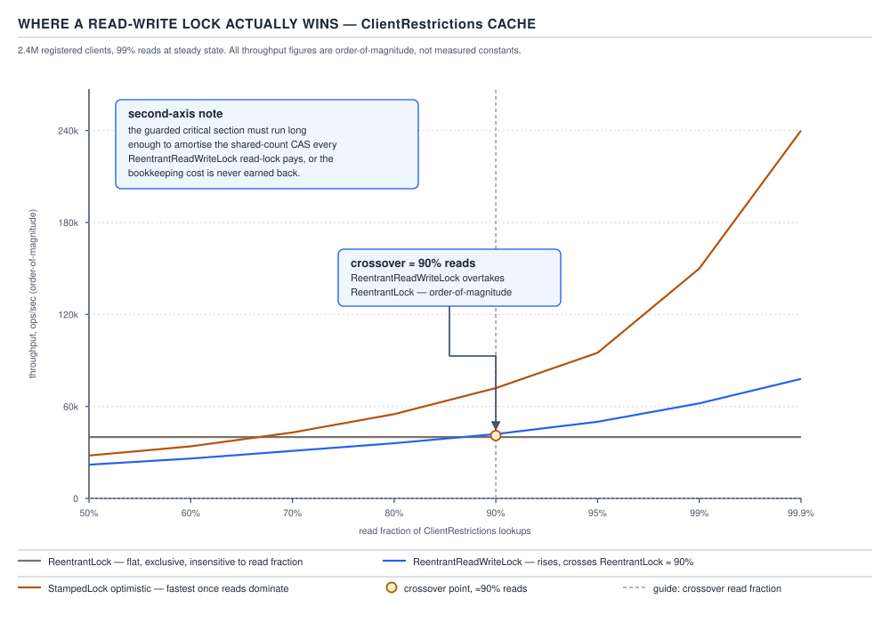

# 05 Multithreading and Concurrency — Choosing a synchronization primitive — INTERMEDIATE (§2.3)

**Target version: Java 21 LTS.** | **Part 2 of 5** | [Index](../00-index.md)
Previous: [Contention economics](03-contention-economics.md) · Next: [Pool sizing and executor configuration](../executors/04-pool-sizing.md)

`FundsLedger.reserveStake` runs 3,400 times a second at burst, each call touching one wallet for
microseconds. `ClientRestrictions` serves a read cache over 2.4M registered clients at 99% reads,
writing only when compliance lifts or adds a restriction. Both need a primitive; they do not need
the same one. This file is the decision procedure.

### `synchronized` versus `ReentrantLock`

**Mental model.** `synchronized` is a monitor bolted onto every object's header — you already own
the lock the moment you own the object, no separate lock object to allocate, no `try/finally` to
get wrong. `ReentrantLock` is a lock as a first-class object: you request it, you can time the
request out, you can be told to stop waiting, and you can wire up more than one wait-queue against
it. The monitor is baked into the language; the lock is a library object with a richer API surface.

**Why it exists.** `synchronized` predates `java.util.concurrent` — a Java 1.0 primitive with no
timeout, no interruptibility, and one implicit condition (`wait`/`notify`). `ReentrantLock` arrived
in `java.util.concurrent.locks` (Java 5, built on AQS) to give programmers the knobs `synchronized`
never exposed: `tryLock`, `lockInterruptibly`, multiple `Condition`s, and a fairness switch.

**When to reach for which.** Default to `synchronized` for anything that fits "acquire, do a short
thing, release" inside one method — `FundsLedger.reserveStake` is exactly that shape. Reach for
`ReentrantLock` when you need one of: a deadline on acquisition (`tryLock(timeout, unit)`),
cancellable acquisition (`lockInterruptibly`), hand-over-hand locking across method boundaries
(impossible with `synchronized`'s block-scoped discipline), or more than one condition predicate
(a bounded withdrawal queue needs "not full" for producers and "not empty" for consumers).

**How it works.** `synchronized` compiles to `monitorenter`/`monitorexit` bytecodes, and the JVM
owns the fast path: an uncontended acquire is a handful of instructions the JIT can often elide
entirely if it proves the lock never escapes the thread (lock elision), or coarsen across adjacent
blocks. `ReentrantLock` is ordinary Java code sitting on AQS: `lock()` CASes a `state` field, and on
failure parks the thread on an intrusive queue node — no bytecode support, no JIT-level elision;
the JIT can inline the CAS loop but cannot reason about the lock the way it reasons about a monitor.

**D-116** — `synchronized` versus `ReentrantLock`, decision table.

| Dimension | `synchronized` (Java 21) | `synchronized` (Java 24+) | `ReentrantLock` |
|---|---|---|---|
| Simplicity | Implicit, no object to leak, `try/finally` unnecessary | Same | Explicit `lock()`/`unlock()`; a missed `finally` leaks the lock forever |
| Exception safety | Automatic — JVM releases on any exit path | Same | Manual — must wrap the critical section in `try { … } finally { lock.unlock(); }` |
| Timed acquire | Not available | Not available | `tryLock(long, TimeUnit)` |
| Interruptible acquire | Not available (blocks until acquired) | Not available | `lockInterruptibly()` |
| Fairness option | None — JVM's internal ordering, not FIFO-guaranteed | None | `new ReentrantLock(true)` for strict FIFO |
| Multiple conditions | One implicit condition (`wait`/`notify`/`notifyAll` on the object) | Same | `newCondition()` any number of times |
| Instrumentation | Visible in `jstack`/JFR as a monitor owner directly | Same | Visible via `Lock` support methods (`hasQueuedThreads`, `getOwner` if subclassed) but not a native monitor |
| Virtual-thread pinning `[VERSION-TRAP]` | **Pins the carrier**: a virtual thread blocked inside a `synchronized` block cannot unmount, so it occupies a platform-thread carrier for the duration | **Fixed** — JEP 491 (targeted JDK 24) removes monitor-caused pinning; `synchronized` no longer pins on blocking operations inside the monitor | Never pinned — `Lock.lock()` parks the virtual thread and unmounts it from the carrier on any Java version |

**Insight:** the pinning row is the whole reason this table exists. On Java 21, "virtual threads
are cheap" holds only if every `synchronized` block on a hot path is audited — one blocking call
inside a monitor quietly pins a platform thread underneath a virtual one, defeating the scalability
argument entirely. JEP 491 fixes this by making the monitor itself unmountable-safe. The diagnostic
flag built to catch this, `-Djdk.tracePinnedThreads`, is removed alongside the fix, since that class
of pinning no longer occurs from `synchronized`. `[RESEARCH]`: verify the exact JDK version JEP 491
ships in against current release notes before quoting "Java 24" as shipped rather than targeted.

**Pitfall:** believing `ReentrantLock` is "the modern replacement for `synchronized`" and reaching
for it everywhere. Pre-JEP-491 that dodges the pinning trap, but it throws away exception safety by
hand, and for `FundsLedger.reserveStake`'s short critical section it buys nothing: no timeout, no
cross-method hand-over, one condition is enough. The fix is "use `synchronized` unless a virtual
thread will block inside it, or you need a feature the monitor doesn't have" — not "always
`ReentrantLock`."

```java
final class FundsLedger {
    private final Object reservationLock = new Object();
    private final Map<ClientId, Position> positions;

    Reservation reserveStake(ClientId clientId, Money stake) {
        synchronized (reservationLock) {
            Position position = positions.get(clientId);
            Money stakeable = position.cashAvailable().plus(position.bonusAvailable());
            if (stakeable.isLessThan(stake)) {
                throw new InsufficientFundsException(clientId, stake, stakeable);
            }
            StakeSplit split = StakeSplit.of(stake, position.bonusAvailable());
            position.reserve(split);
            return new Reservation(clientId, split, RoundId.newId());
        }
    }
}
```

No `try/finally`, no lock field to leak, and the JVM releases `reservationLock` even if
`InsufficientFundsException` propagates mid-body. That is `synchronized`'s exception-safety row,
in code.

**Interview:** "when would you pick `ReentrantLock` over `synchronized`?" — one line: "when I need
a timeout, interruptibility, more than one condition, or a lock that outlives a single method's
scope; otherwise `synchronized` is exception-safe by construction and cheaper to reason about."

> `synchronized` is the JVM-native monitor with automatic release and JIT support; `ReentrantLock`
> is a library lock that trades that automatic safety for timeouts, interruptibility, fairness,
> and multiple conditions.

### `ReadWriteLock` and `StampedLock`

**Mental model.** A `ReadWriteLock` splits one critical section into two gates: any number of
readers may hold the read gate simultaneously, but a writer needs the whole room empty. A
`StampedLock` goes further — its optimistic mode does not take a lock at all for a read; it takes a
timestamp, reads without blocking anyone, and then checks whether a writer sneaked in behind it. If
one did, it retries with a real read lock.

**Why they exist.** A plain `ReentrantLock` (or `synchronized`) serializes every reader against
every other reader, even though two readers never conflict. `ClientRestrictions`'s read cache at
99% reads is exactly the workload where that serialization is pure waste: 2.4M clients' lookups
queuing behind each other for no reason. `ReentrantReadWriteLock` (Java 5) fixes the reader-reader
case; `StampedLock` (Java 8) goes further, removing the reader-side CAS entirely in the common
case at the cost of reentrancy and condition support.

**When to reach for which, quantified.** `[NUM]` A read-write lock only wins once the read fraction
is roughly **90% or higher** *and* the critical section is long enough to amortise the extra
bookkeeping (a shared-reader-count CAS on entry and exit) that a plain lock does not pay. Below
that threshold, or for very short critical sections, the read-write lock's overhead exceeds what it
saves, and a plain `ReentrantLock` — or an `AtomicReference` swap for the whole cache entry — wins
outright. `StampedLock`'s optimistic-read mode earns its keep specifically for small,
read-dominated, non-reentrant state where you never need a `Condition`: a cached coordinate pair, a
compliance snapshot, `ClientRestrictions`'s read cache of active restriction keys per client. `[TRAP]`



**D-117** — Where a read-write lock actually wins. Throughput against read fraction from 50% to
99.9% for three primitives: `ReentrantLock`, `ReentrantReadWriteLock`, and `StampedLock`
optimistic-read. `ReentrantLock` is flat regardless of read fraction because every acquisition
serializes. `ReentrantReadWriteLock` climbs with read fraction and crosses above plain-lock
throughput at roughly the 90% mark — order-of-magnitude, not a measured constant. `StampedLock`
optimistic sits highest throughout because a successful optimistic read touches no shared counter,
only a stamp comparison, paying a real-lock cost only on the rare validation failure. All curves
assume a critical section long enough to amortise the CAS — for a two-field read, a plain volatile
read wins over all three.

**How it works.** `ReentrantReadWriteLock` packs read-count and write-hold state into one `int` via
AQS's `state` field (high 16 bits readers, low 16 bits writer hold count), so acquiring the read
lock CASes the read-count segment up, releasing CASes it down — cheap, but a CAS every reader pays,
contending with every other reader. `StampedLock` sidesteps that: `tryOptimisticRead()` returns a
`long` stamp with no CAS, just a volatile read of the write-stamp field; the caller reads the
guarded fields, then calls `validate(stamp)` to check whether a writer committed in between. On
failure it falls back to `readLock()`, a real reader-count lock. This is why `StampedLock` is not
reentrant and has no `Condition` support — its fast path avoids the bookkeeping those would need.

```java
final class ClientRestrictionsCache {
    private final StampedLock stampedLock = new StampedLock();
    private Map<ClientId, Set<RestrictionKey>> byClient = Map.of();

    Set<RestrictionKey> activeRestrictions(ClientId clientId) {
        long stamp = stampedLock.tryOptimisticRead();
        Set<RestrictionKey> snapshot = byClient.getOrDefault(clientId, Set.of());
        if (!stampedLock.validate(stamp)) {
            stamp = stampedLock.readLock();
            try {
                snapshot = byClient.getOrDefault(clientId, Set.of());
            } finally {
                stampedLock.unlockRead(stamp);
            }
        }
        return snapshot;
    }

    void replaceSnapshot(Map<ClientId, Set<RestrictionKey>> next) {
        long stamp = stampedLock.writeLock();
        try {
            byClient = Map.copyOf(next);
        } finally {
            stampedLock.unlockWrite(stamp);
        }
    }
}
```

The optimistic path never blocks a writer and never blocks another reader; `replaceSnapshot` runs
only when compliance lifts or adds a restriction, which is rare next to 2.4M clients' worth of
lookups.

**Pitfall:** calling `readLock()` (or worse, `tryOptimisticRead()`) from inside code that also
tries to acquire the write lock on the same thread. `ReentrantReadWriteLock` explicitly forbids
upgrading a held read lock to a write lock — doing so deadlocks the thread against itself, because
the write lock waits for all readers (including this thread) to release first. `StampedLock` has no
reentrancy at all, so re-entering `readLock()` on a thread that already holds the write lock also
deadlocks. The fix: release the read lock, then acquire the write lock as a fresh, non-nested
acquisition, and re-validate any assumptions made under the read lock.

**Interview:** "when does a read-write lock help?" — one line: "once reads dominate heavily
(roughly 90%+) and the critical section is long enough to amortise the reader-count CAS; below
that, or for tiny sections, a plain lock or a volatile snapshot wins."

> A `ReadWriteLock` lets readers run concurrently at the cost of a shared-count CAS every reader
> pays; a `StampedLock`'s optimistic mode removes that CAS from the common case by validating
> after the fact instead of locking before it, at the cost of reentrancy and conditions.

### The escalation ladder

**Mental model.** Treat synchronization as a ladder you climb only as far as the problem forces
you, not a menu you pick your favourite rung from. Picking a higher rung than needed buys
complexity for nothing; picking a lower rung than needed buys a race condition.

**Why it exists as a ladder, not a table.** Every primitive here is correct for *some* shape of
problem and wrong for every other shape. The ladder forces "what shape is my problem?" before
"which API do I call?" — reversing that order is how a `CopyOnWriteArrayList` ends up backing a
2.8M-append hot path (see 03-contention-economics.md) instead of a `ConcurrentHashMap`.

**When to reach for each rung, in climbing order:**

1. **Immutability first.** `[X-REF 03]` If the value never changes after construction, `final`
   fields plus safe publication give every reader a consistent view for free — a `Money` or
   `StatusCode` value object needs no lock, ever.
2. **Confinement.** A piece of mutable state owned by exactly one thread — an actor-per-client-id
   design, a single-threaded executor draining `WithdrawalTransaction`s — has no sharing to
   protect, only a queue hand-off to get right.
3. **A single atomic.** One variable with no cross-field invariant — a running count of in-flight
   stake reservations — gets lock-free correctness from `AtomicLong`/`AtomicReference`.
4. **A concurrent collection.** If the whole invariant lives inside one collection's own
   guarantees — `ConcurrentHashMap<ClientId, Position>` with each entry independently protected —
   the collection has already solved it; do not additionally wrap it in a lock.
5. **A lock (`synchronized` or `ReentrantLock`).** Once an invariant spans more than one field or
   collection — `reserveStake` checking stakeable funds *and* updating the reservation *and* the
   ledger, atomically as one unit — a lock is the honest answer.
6. **`Semaphore` or `ReadWriteLock`/`StampedLock`.** Once the shape is "bound a resource pool" or
   "reads vastly outnumber writes," reach for the specialised primitive over a generic lock.
7. **Hand-rolled lock-free.** `[RESEARCH]` Only once every rung above is measured and found
   insufficient, and only after verification with a tool built for exactly this — `jcstress` —
   since single-threaded testing cannot surface the interleavings that break it.

**Insight:** the ladder decreases monotonically in "how much the JVM/library does for you" and
increases in "how much you must prove yourself." Climbing past rung 5 without a measured reason is
the single most common over-engineering mistake in concurrent code review.

**Pitfall:** treating `synchronized`/`ReentrantLock` as rung 1 because "locking is how you make
things thread-safe." A lock is rung 5, chosen only after immutability, confinement, a single
atomic, and a concurrent collection are ruled out for the invariant at hand. `reserveStake` lands
on rung 5 honestly — the invariant spans cash, bonus, and the ledger — but `ClientRestrictions`'s
read cache should never reach past rung 6 (`StampedLock`), since its invariant is "one map,
replaced wholesale on write."

**Interview:** "how do you decide what to synchronize with?" — one line: "climb the ladder from
immutability up, and stop at the first rung that actually satisfies the invariant — never start
from 'I need a lock.'"

> The escalation ladder orders primitives by how much correctness the JVM guarantees for you,
> from immutable values needing nothing, through confinement, atomics, and concurrent collections,
> up to locks, resource-bounding semaphores, and — only when measured and jcstress-verified —
> hand-rolled lock-free code.

### Fairness, and its price

**Mental model.** An unfair (default) `ReentrantLock` lets whichever thread grabs it first win,
even one that just arrived — a barge-in. A fair lock enforces strict FIFO: the longest-waiting
thread always goes next. Fairness buys predictability at the cost of throughput, because it
forbids the exact optimization (letting an already-running thread just take the lock) that makes
unfair locking fast.

**Why it exists.** Without a fairness option, a thread unlucky enough to always lose the scramble
for a hot lock can starve indefinitely under adversarial scheduling — rare in practice, but not
impossible on a lock held by many threads with very short hold times. Fairness makes that
starvation provably impossible, at a stated cost.

**When you actually want it.** `[NUM]` Reach for `new ReentrantLock(true)` when critical sections
are long enough that a barge-in genuinely matters, when a latency SLA cares about the tail rather
than the mean (a rare writer to `ClientRestrictions` must not wait behind an unbounded stream of
readers), or when starvation of a specific caller is a correctness concern, not just a performance
one. Do not reach for it on `reserveStake`'s hot path: at 3,400 acquisitions/second with a short
critical section, fairness's cost dominates and nothing calls for FIFO ordering.

**The price.** `[PROVE]` Fairness forces every acquisition through the wait queue in order, even
when the lock is momentarily free and a barging thread could take it instantly. Work it through: an
unfair lock lets an already-on-CPU thread acquire immediately if the lock is free, the common case
under moderate contention. A fair lock checks the queue first and, if any thread is waiting, forces
the newly-arriving thread to park even though the lock was free the instant it asked — turning a
same-thread continuation into a mandatory context switch and wake-up for the head-of-queue thread.
Each forced hand-off costs a park and an unpark, order-of-magnitude microseconds, versus the
nanosecond-scale cost of a barging CAS succeeding immediately. Multiply that gap by every
acquisition under contention and aggregate throughput of a fair lock lands **an order of magnitude
lower — commonly cited as 10–100× fewer acquisitions per second** than the same lock unfair, under
high contention with short critical sections. `[RESEARCH]`: this factor is stated in the JDK's own
`ReentrantLock` javadoc discussion and widely reproduced in benchmarks; treat it as
workload-dependent and order-of-magnitude, never a guaranteed constant.


**D-118** — Fairness costs an order of magnitude. Panel one plots acquisitions per second against
thread count for fair and unfair `ReentrantLock`, unfair sitting 10–100× above fair as contention
rises — labelled explicitly as order-of-magnitude, not a measured constant. Panel two plots
tail-latency (p99/p999) for the same two: unfair has a lower mean but an unbounded tail (a barged
thread can wait arbitrarily long); fair has a higher mean but a bounded, tight tail — the property
that makes fairness worth its cost when an SLA governs the tail, not the average.

```java
final class ClientRestrictionsWriteGate {
    // Fair: the rare compliance write must not starve behind a continuous
    // stream of barging reads under heavy read load.
    private final ReentrantLock writeLock = new ReentrantLock(true);

    void applyRestriction(ClientId clientId, RestrictionKey key) {
        writeLock.lock();
        try {
            // ... mutate and republish the snapshot under replaceSnapshot() ...
        } finally {
            writeLock.unlock();
        }
    }
}
```

**Pitfall:** defaulting every `ReentrantLock` in a codebase to `new ReentrantLock(true)` "to be
safe." Fairness is not a correctness property — an unfair lock is exactly as free of data races as
a fair one. It is a scheduling-policy choice with a measured throughput cost, and paying it on
every lock without a starvation or tail-latency requirement is pure waste. `reserveStake` should
stay unfair; only the writer gate that must not starve behind readers pays for fairness.

**Interview:** "does fairness matter for `ReentrantLock`?" — one line: "yes for tail latency and
starvation avoidance on long or rare-writer critical sections, but it costs an order of magnitude
in throughput under contention, so it is an explicit opt-in, never a default."

> A fair lock guarantees strict FIFO acquisition order at the cost of forbidding barge-in, which
> under contention typically costs an order of magnitude in throughput compared to the unfair
> default — a price worth paying only when starvation or tail latency is the actual concern.

### Supporting facts

**When an atomic is the answer (2.3.6).** A single variable with no invariant spanning another
field — a hit counter, an in-flight-reservation gauge — is `AtomicLong`/`AtomicReference`
territory: lock-free, CAS-based, no wait queue. Gotcha: the moment a second field must move in
lockstep (reserve funds *and* update a position), an atomic can no longer express the invariant
and you must climb to a lock — it has no way to say "increment only if under a limit and also
update this other map" as one operation.

> An atomic gives lock-free correctness for exactly one variable with no cross-field invariant.

**When a concurrent collection is the answer (2.3.7).** If every invariant lives entirely inside
one collection's own guarantees — `ConcurrentHashMap<ClientId, Position>` with each `Position`
independently swapped via `compute`/`merge` — the collection has already solved it; wrapping it in
an outer lock only adds contention. Gotcha: a compound operation across two entries (transferring
between two clients) is *not* covered by the map's own atomicity — that reintroduces the need for
an external lock scoped to the pair.

> A concurrent collection needs no external lock when the entire invariant is expressible as one
> operation on one entry.

**When immutability is the answer (2.3.8).** `[X-REF 03]` `final` fields set once in the
constructor and safely published need no synchronization on read — the JMM guarantees every reader
that observes the reference also observes fully-constructed `final` fields. `Money`, `StatusCode`,
`StakeSplit` are candidates. Gotcha: this covers `final` fields only; a `final` reference to a
mutable object (a `final List<X>` still appended to) gives no such protection. See
03-contention-economics.md for the deeper cost argument for immutable values.

> Immutable, safely-published values need no lock because the JMM's `final`-field guarantee does
> the work at construction time, once, instead of on every read.

**When confinement is the answer (2.3.9).** An actor/single-writer design — one thread owns a
`Position` exclusively and all mutations arrive as messages on a queue — removes sharing rather
than protecting it. Gotcha: confinement only holds as long as *no other code path* reads the
confined state directly; a "just this once" direct read from another thread silently reintroduces
a race the design assumed away.

> Confinement eliminates synchronization by ensuring the state is never actually shared.

**When a `Semaphore` is the answer (2.3.10).** A `Semaphore` bounds how many threads may proceed
past a point concurrently — it protects a *resource count* (40 operator review slots, a cap of
600 identity-vendor calls/minute), not a piece of *state*. Gotcha: it enforces the count but does
nothing about what permitted threads then do to shared state — routinely paired with, not a
substitute for, a lock or concurrent collection guarding the actual data.

> A semaphore bounds concurrent access to a resource; it does not protect the state that access
> touches.

**When "do not share it" is the answer (2.3.11).** A per-request object, a `ThreadLocal`, or a
`ScopedValue` sidesteps synchronization by never letting the value cross a thread boundary — a
per-request `IdempotencyKey` context, or a `ScopedValue<ClientId>` bound for one `reserveStake`
call. Gotcha: `ThreadLocal` on a virtual-thread-per-task model can pin more memory than intended if
not cleared, since each virtual thread gets its own copy; `ScopedValue` (finalized under JEP 506 in
Java 25) fixes this by binding for a scope, not a thread's lifetime.

> "Do not share it" removes the need for a primitive entirely by keeping the value out of any
> other thread's reach.

**Reentrancy as a design smell (2.3.14).** Needing a lock to be reentrant — a public method calling
another public method on the same object without deadlocking itself — usually signals too much
internal coupling in the API. Gotcha: the fix is the private-worker-method pattern — the public
method acquires the lock once and delegates to a private, unsynchronized worker that other public
methods also call, so the lock is only ever taken at the public boundary.

> Reentrancy exists as a safety net for locks; needing it routinely is a signal to restructure the
> API around a single lock-acquisition point, not a feature to lean on.

## Pitfalls

### Assuming `ReentrantLock` is a strict upgrade over `synchronized`

**Wrong**

```java
final class FundsLedger {
    private final ReentrantLock lock = new ReentrantLock();

    Reservation reserveStake(ClientId clientId, Money stake) {
        lock.lock();
        Position position = positions.get(clientId);
        if (position.stakeable().isLessThan(stake)) {
            throw new InsufficientFundsException(clientId, stake, position.stakeable());
            // lock.unlock() never runs — the lock leaks forever.
        }
        Reservation reservation = position.reserve(stake);
        lock.unlock();
        return reservation;
    }
}
```

Every subsequent call to `reserveStake` for this ledger blocks forever, because nothing ever
released the lock.

**Right**

```java
final class FundsLedger {
    private final Object reservationLock = new Object();

    Reservation reserveStake(ClientId clientId, Money stake) {
        synchronized (reservationLock) {
            Position position = positions.get(clientId);
            if (position.stakeable().isLessThan(stake)) {
                throw new InsufficientFundsException(clientId, stake, position.stakeable());
            }
            return position.reserve(stake);
        }
    }
}
```

`synchronized` releases on any exit path, including the exception, with no `finally` to remember.

**Why people believe it:** `ReentrantLock` is newer, has a richer API, and "newer with more
features" reads as "strictly better" — but every one of those features is opt-in complexity that
`synchronized` deliberately does not expose, and exception safety is not one of the features
`ReentrantLock` adds; it is a property `synchronized` has that `ReentrantLock` requires discipline
to replicate.

### Believing a read-write lock always beats a plain lock for read-heavy code

**Wrong**

```java
final class HotCounterCache {
    private final ReadWriteLock rwLock = new ReentrantReadWriteLock();
    private volatile int cachedCount;

    int read() {
        rwLock.readLock().lock();
        try {
            return cachedCount; // a single volatile read
        } finally {
            rwLock.readLock().unlock();
        }
    }
}
```

At near-100% reads but a critical section of "read one `int`," the reader-count CAS on entry and
exit costs more than the read itself — this is slower than no lock at all for a value that is
already `volatile`.

**Right**

```java
final class HotCounterCache {
    private volatile int cachedCount;

    int read() {
        return cachedCount;
    }
}
```

For a single already-volatile field with no compound invariant, no lock — read-write or otherwise —
is needed at all.

**Why people believe it:** "read-write lock helps reads" is true in aggregate, but it is a
statement about amortising a fixed per-acquisition cost over a long-enough critical section, not a
blanket rule that applies below the crossover point this file quantifies at roughly 90% reads with
a non-trivial critical section.

## Cheat sheet

| Situation | Primitive | Why |
|---|---|---|
| Short critical section, single method | `synchronized` | Exception-safe by construction, JIT-optimisable |
| Need timeout / interruptible / hand-over-hand / multiple conditions | `ReentrantLock` | Only `ReentrantLock` exposes these |
| Virtual thread may block inside the section, on Java 21 | `ReentrantLock` (or restructure to avoid blocking under `synchronized`) | `synchronized` pins the carrier pre-JEP 491 |
| Reads ≥ ~90%, non-trivial critical section, need conditions or reentrancy | `ReentrantReadWriteLock` | Concurrent readers, amortised CAS |
| Reads ≥ ~90%, small/non-reentrant, no conditions | `StampedLock` optimistic | No CAS on the fast path |
| One variable, no cross-field invariant | `AtomicLong`/`AtomicReference` | Lock-free |
| Invariant entirely inside one collection | `ConcurrentHashMap` etc. | Collection already solves it |
| Value never changes after construction | Immutability (`final`) | No synchronization needed at all |
| One thread owns the state exclusively | Confinement | No sharing to protect |
| Bounding a resource count, not state | `Semaphore` | Purpose-built for pool caps |
| Value never crosses a thread | `ThreadLocal` / `ScopedValue` | Nothing to share |
| Rare writer must not starve behind readers, tail-latency SLA | Fair `ReentrantLock(true)` | Bounded tail at 10–100× throughput cost |
| Public method calling another public method needs reentrancy | Private-worker-method refactor | Reentrancy is a smell, not a feature to lean on |

## Self-test

**Q1.** `FundsLedger.reserveStake` runs a short critical section at 3,400/sec burst. Which
primitive, and why not `ReentrantLock`?

<details><summary>Answer</summary>

`synchronized`. The critical section is short and confined to one method, there is no need for a
timeout, interruptibility, multiple conditions, or hand-over-hand locking, so `ReentrantLock`'s
extra API surface buys nothing while `synchronized` gives exception safety for free and stays
JIT-optimisable.

</details>

**Q2.** `ClientRestrictions` serves 99% reads over 2.4M clients. Name two primitives that could
work and the tradeoff between them.

<details><summary>Answer</summary>

`ReentrantReadWriteLock` (concurrent readers via a shared-count CAS, supports conditions and
reentrancy) versus `StampedLock` optimistic mode (no CAS on the successful read path, faster, but
non-reentrant and no `Condition` support). At this read fraction and with a snapshot-replace write
pattern, `StampedLock` is the better fit because there is no need for conditions or reentrancy.

</details>

**Q3.** Why does a read-write lock lose to a plain lock below roughly 90% reads?

<details><summary>Answer</summary>

Because acquiring and releasing the read lock costs a CAS on a shared reader-count field that every
reader contends over. Below the crossover, that per-acquisition overhead outweighs the benefit of
letting readers run concurrently, so a plain lock — which pays no such per-reader bookkeeping —
wins on raw throughput.

</details>

**Q4.** What changes about `synchronized` and virtual threads between Java 21 and JEP 491, and
what diagnostic disappears alongside the fix?

<details><summary>Answer</summary>

On Java 21, a virtual thread blocked inside a `synchronized` block pins its carrier. JEP 491
removes that pinning cause so a virtual thread can unmount even while inside a monitor.
`-Djdk.tracePinnedThreads`, used to surface this exact case, is removed in the same release since
the pinning it detected from `synchronized` no longer occurs.

</details>

**Q5.** What is the throughput cost of a fair `ReentrantLock` versus unfair, and why is the cost
structural rather than an implementation quirk?

<details><summary>Answer</summary>

Roughly 10–100× fewer acquisitions per second under contention. Fairness forbids a newly-arriving,
already-running thread from barging past a queued waiter even when the lock is momentarily free,
forcing a park/unpark handoff instead of an immediate CAS success — every enforced handoff costs a
context switch an unfair lock would have skipped.

</details>

**Q6.** Why is reentrancy considered a design smell rather than a feature?

<details><summary>Answer</summary>

Needing a lock to be reentrant usually means a public method calls another public method on the
same object, both acquiring the same lock — evidence of coupling in the class's own API. The
private-worker-method pattern fixes it: acquire the lock once at the public boundary and delegate
to an unsynchronized private worker.

</details>

**Q7.** A `Semaphore` limits concurrent operator review slots to 40. Does that protect the
`ReviewCase` state each operator mutates?

<details><summary>Answer</summary>

No. The semaphore only bounds how many threads may proceed past the acquire point; it says nothing
about the safety of what those threads do once past it — `ReviewCase` mutations still need their
own primitive alongside the semaphore.

</details>

## Open questions

- **Unverified:** the exact JDK version in which JEP 491 ships as final (versus targeted/preview)
  was not re-verified against current release notes; treat "Java 24" as the targeted version until
  confirmed against `github.com/openjdk/jdk`.
- **Unverified:** the "10–100×" fairness throughput factor and the ~90% read-fraction crossover are
  order-of-magnitude figures drawn from the `ReentrantLock` javadoc discussion and widely
  reproduced benchmarks, not a benchmark run in this pass; treat both as workload-dependent.

---

**Leaves covered:** 2.3.1–2.3.14 (14 leaves)
**Leaves deferred:** none
**Diagrams included:** D-116, D-117, D-118
**Target version:** Java 21 LTS
**Lines:** 600
