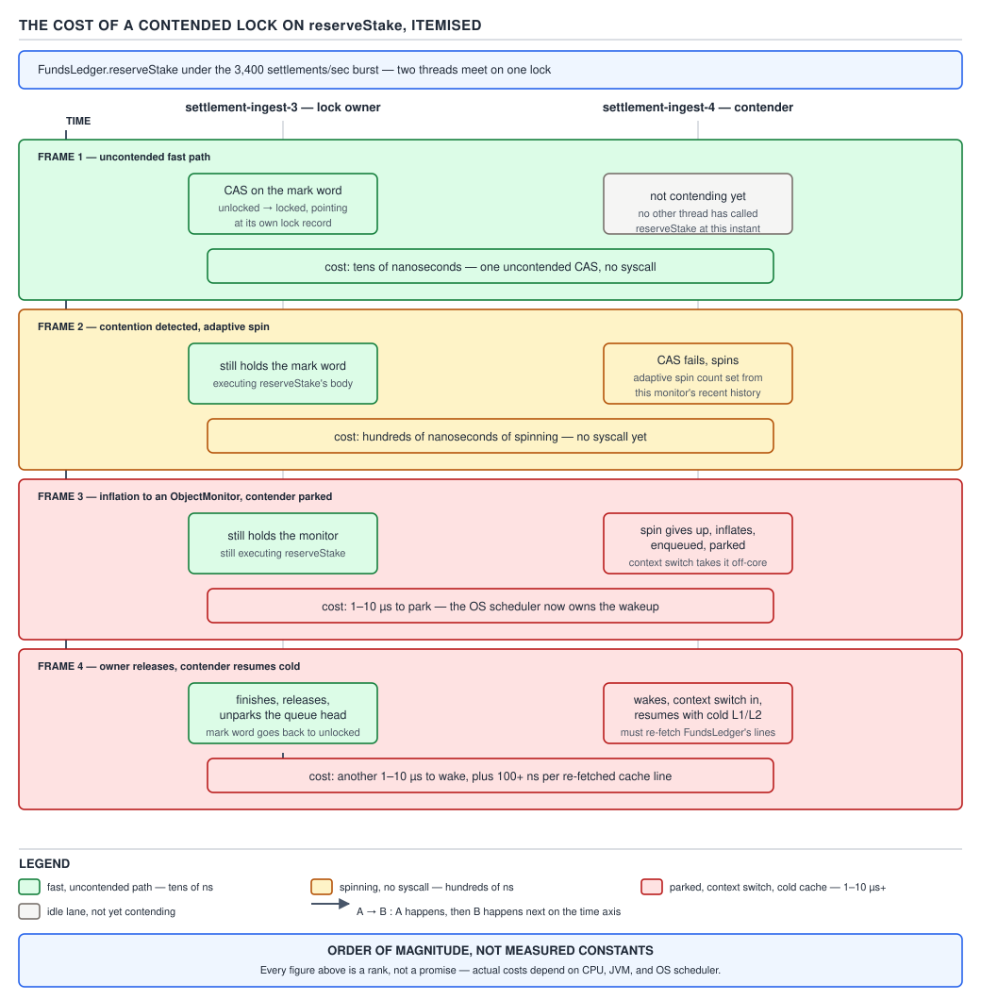
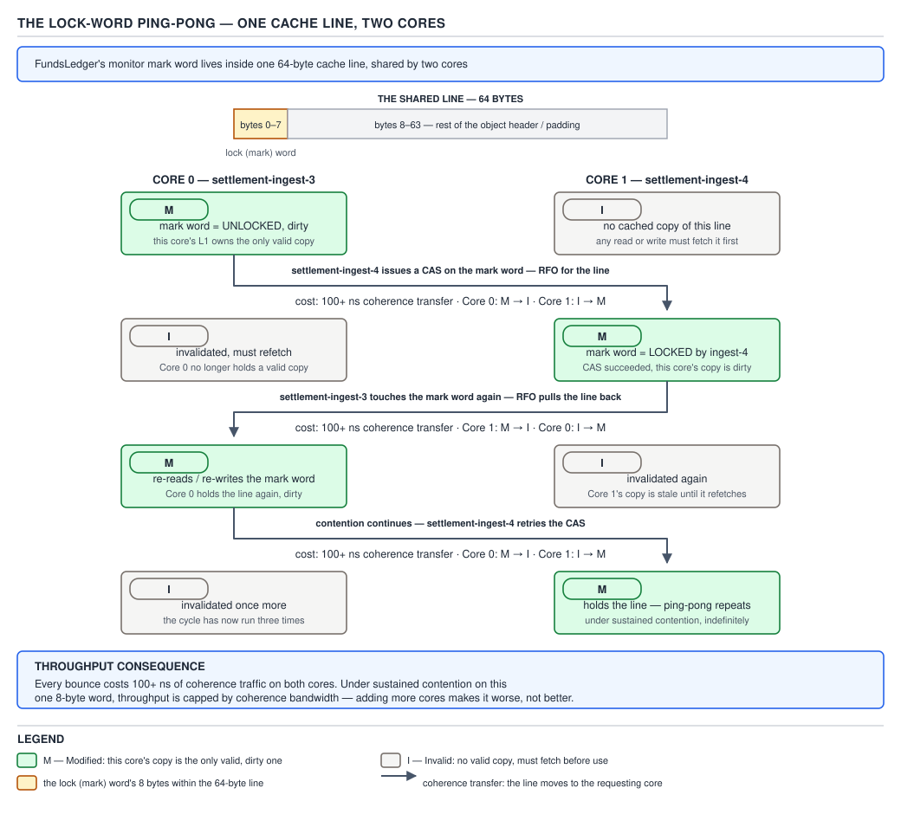
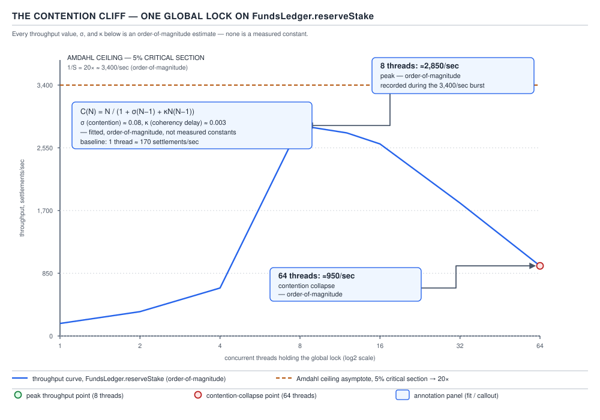

# 05 Multithreading and Concurrency — Contention economics — INTERMEDIATE (§2.2)

**Target version: Java 21 LTS.** | **Part 2 of 5** | [Index](../00-index.md)
Previous: [The master tables](../master-tables/01-the-master-tables.md) · Next: [Choosing a synchronization primitive](02-choosing-a-primitive.md)

A lock's price tag has two completely different numbers on it. The textbook number — "a
`synchronized` block costs tens of nanoseconds" — is true and almost useless, because it
describes the case nobody gets paged for. The number that pages people is paid *only when two
threads want the same lock at the same instant*, and it is a hundred to a thousand times larger:
context switches and cold caches, not CPU cycles inside the critical section.

## The contention cost model

A critical section's true cost is **acquisition + body + release + the coherence traffic the
acquisition and release generate on every other core holding the lock word**. Only the body does
useful work; everything else is tax. `FundsLedger.reserveStake` is a good place to see this
split, because its body — decrement `CLIENT_CASH_AVAILABLE`/`CLIENT_BONUS_AVAILABLE`, increment
the matching `RESERVED` bucket, append a `LedgerEntry` — is a handful of field writes, microseconds
at most. The acquisition and release around it are where the variance lives.

**Why it exists as a distinct thing to model.** Engineers price a lock by timing the body in a
microbenchmark and stop there, because the body is the part with business logic in it. But
acquisition and release are invisible to a flame graph that samples on-CPU time only, because a
blocked thread is off-CPU, parked — a CPU-sampled cost model silently deletes the exact cost this
file is about.

**When the model matters and when it doesn't.** It matters the moment two threads can plausibly
want the same lock inside the same tens-of-microseconds window — a shared counter, a shared
collection, one lock guarding an aggregate under load. It does not matter for a lock that is
*structurally* uncontended: local to one request, never shared across threads, guarding a rare
administrative path. Modelling contention cost on a lock that never contends is effort on the
wrong axis.

**The mechanism, one acquisition at a time.** `[PROVE]` Take `reserveStake` under load with the
lock uncontended first:

1. CAS the object header's mark word from unlocked to locked-by-me. One atomic instruction, no
   cache line owned by anyone else — tens of nanoseconds, order of magnitude.
2. Run the body — the ledger writes. This is the part a profiler shows you.
3. CAS the mark word back to unlocked. Another tens of nanoseconds.

Total tax: two atomic instructions, order tens of nanoseconds. This is the number every
benchmark quotes, and it is honest — for this case.

Now the same acquisition with a second thread already holding the lock:

1. The CAS in step 1 fails — the mark word says "held by thread B". The JVM's adaptive spinning
   (a handful of `Thread.onSpinWait()` iterations, itself order tens of nanoseconds) retries a
   few times on the chance B releases quickly.
2. If B is still not done, the monitor **inflates**: the thin lock in the mark word becomes a
   full `ObjectMonitor` with a wait queue, and the current thread parks (`LockSupport.park` under
   the hood) and is **context-switched off the core**.
3. The OS scheduler now owns when this thread runs again. Order of magnitude, a context switch
   plus the wait is **microseconds to low tens of microseconds** on an otherwise-idle box, and
   can be orders of magnitude worse under scheduler pressure — no authoritative per-instruction
   table exists for this, it depends on scheduler, core count and load, and must be quoted as
   order-of-magnitude, never a measured constant.
4. B releases and unparks the waiter. The waiter is rescheduled onto *some* core — not
   necessarily the one it left — with **every line it needs back in L1 already evicted**. The
   first few memory accesses in its resumed body are cache misses: tens of nanoseconds each,
   but several of them, back to back, right where the "cheap" body used to be free.

That fourth step is the one every "locks are slow" folk story skips: the cost isn't only the
park, it's arriving back with a cold cache and re-paying for data that was free five microseconds
ago.



**D-112** — The cost of a contended lock, itemised: the uncontended CAS, adaptive spin,
inflation and park, and the cold-cache resume, each with its order-of-magnitude cost.

```java
public final class FundsLedger {

    private final Object stateLock = new Object();
    private final Map<AccountId, Position> positions;

    public void reserveStake(AccountId accountId, Money amount) {
        synchronized (stateLock) {
            Position position = positions.get(accountId);
            StakeSplit split = position.splitForStake(amount); // bonus-first, cash remainder
            position.debit(split);
            position.reserve(amount);
        }
        // ledger append happens outside the lock — see "splitting" below for why that matters
    }
}
```

Under `reserveStake`'s own workload — 2.8M reservations/day, 1,200/sec peak — every call fights
for `stateLock` if it also guards unrelated state such as restriction flags. The lock itself
isn't the expensive part of this code; the *sharing* is.

**The gotcha.** A single-threaded microbenchmark reports the uncontended number and tells you
nothing about production, where dozens of threads hit `reserveStake` concurrently. Load-test the
lock, not the method.

> **The cost of a critical section is acquisition + body + release + coherence traffic on the
> lock word — and under contention, the first and third terms dominate the second by one to
> three orders of magnitude.**

## The lock word ping-pong

**Mental model.** The lock word lives in the object header, and the object header lives in a
64-byte cache line like any other data. Two cores contending for the same lock are, from the
cache's point of view, indistinguishable from two cores fighting over any other hot cache line —
except every single acquisition and release *writes* to it, so the line cannot simply be shared
read-only. It has to move.

**Why it exists as a distinct cost.** The contention cost model already counts the CAS as tens of
nanoseconds when the line is local. But under real contention the line is almost never local — it
was last written by whichever core last held the lock, and under MESI that write invalidated
every other cached copy. "Tens of nanoseconds" in isolation becomes "tens of nanoseconds plus a
cross-core cache-line fetch" the moment two cores alternate ownership.

**When it matters.** Any lock, `Atomic*` field or `volatile` touched from multiple cores in a
tight loop, regardless of whether an `ObjectMonitor` ever inflates. A spin lock that never parks
anyone can still be dominated entirely by this cost, since spinning without acquiring still means
repeatedly reading a line another core keeps invalidating.

**Mechanism.** `[PROVE]` MESI gives each cache line one of Modified, Exclusive, Shared, Invalid
per core. A CAS is a write, so it needs the line in Modified (exclusive-and-dirty) state on the
writing core, which forces every other core's copy to Invalid. When core B then tries its own
CAS on the same line, it must first fetch the line back from core A over the inter-core
interconnect — a coherence transfer, not a cache miss to DRAM, but still **on the order of a
hundred nanoseconds or more per transfer**, again order-of-magnitude, not a fixed constant, since
it depends on topology (same socket vs. cross-socket) and traffic.

Two cores that alternate acquiring the same lock therefore alternate the line: M on A, Invalid on
B, then A releases and B acquires, flipping to M on B, Invalid on A. Every single handoff pays a
coherence transfer — the "ping-pong" — on top of whatever park/unpark cost the acquisition itself
incurs.



**D-113** — The lock word ping-pong: two cores' L1 lines holding the same lock word cycling
M → I → M under MESI, each transfer costing on the order of 100+ ns.

**The gotcha.** This cost exists even for locks that never inflate to an `ObjectMonitor` and never
park anyone — a busy-spin CAS loop between two cores pays the coherence transfer on every
iteration, which is why naive spin locks scale worse than blocking locks past a couple of
genuinely contending cores, not better.

> **Contention is expensive before any thread ever parks, because the lock word's cache line
> must physically travel between cores on every acquisition, and that transfer — not the CAS
> instruction itself — is the floor under the contended cost.**

### Three contention reducers, in order (2.2.3)

Given a hot lock, apply these in order — each is cheaper to reach for than the next:
**reduce lock duration** (shrink the critical section — move ledger serialization, logging or I/O
outside it); **reduce lock frequency** (splitting or striping, next section); **replace exclusion
entirely** (atomics, immutable snapshots, thread confinement, `ReadWriteLock`, copy-on-write).
Reaching for atomics before shrinking the critical section is solving the wrong-ordered problem —
a smaller lock is often enough and costs nothing to reason about.

> **When a lock is hot, shrink it before you split it, and split it before you replace it.**

## Splitting versus striping

**Mental model.** A `state` lock over an entire `Account` — restrictions, balances, everything —
is one padlock on a building with independent rooms; two threads that want different rooms still
queue at the same door. Splitting gives each room its own door; striping gives one room N doors,
one per hash bucket, so unrelated visitors rarely collide.

**Why they exist.** Both attack lock *frequency*, the second reducer above, by shrinking the set
of operations that must serialize against each other — without changing what each operation does.

**When to reach for each, and their sibling.** Splitting wins when the invariants are genuinely
independent — nothing ever needs restrictions and balances atomically together. Striping wins
when there is one logical structure but the operations on it partition naturally by key. Neither
wins when every operation *must* see the whole structure atomically — exclusion is then the
honest answer, and the third reducer (replace exclusion) is the sibling worth checking instead.

**Mechanism — splitting.** `Account` guards two independent invariants: a client's restriction
set (`DEPOSIT_BLOCKED`, `STAKE_BLOCKED`, …) and the wallet's four ledger buckets. Nothing in
`ClientRestrictions` ever needs to observe a balance mutation atomically with a restriction
change, so one `stateLock` serializing both is pure waste:

```java
public final class Account {

    // before: one lock for two unrelated invariants
    // private final Object stateLock = new Object();

    // after: split by invariant
    private final Object restrictionsLock = new Object();
    private final Object balancesLock = new Object();

    private final Set<RestrictionKey> activeRestrictions;
    private Position position;

    public boolean isBlocked(RestrictionType type) {
        synchronized (restrictionsLock) {
            return activeRestrictions.stream()
                .anyMatch(key -> key.type() == type);
        }
    }

    public void reserve(Money amount) {
        synchronized (balancesLock) {
            position = position.withReserved(amount);
        }
    }
}
```

A stake reservation now only ever contends against other stake reservations on the *same*
account, and a compliance restriction update no longer queues behind it. Splitting is free in
correctness terms exactly because the invariants were independent to begin with — if
`reserve` needed to check `isBlocked` atomically with the debit, splitting would reintroduce a
race the single lock had been preventing, and the right move is to keep them together.

**Mechanism — striping.** `[X-REF 02]` Where splitting divides by *invariant*, striping divides
one invariant across N locks keyed by `hash(key) % N`. Java 7's `ConcurrentHashMap` used exactly
this: 16 `Segment`s, each its own lock, an entry striped to `segment[hash & 15]` — two puts
landing in different segments never contend. Java 8 replaced segment locking with per-bin locking
(`synchronized` on the bin's first node, plus CAS for the empty-bin case) because 16 fixed
segments is a coarse stripe count chosen at construction, while per-bin locking stripes at the
finest grain the table already has — one lock per occupied bucket, growing with the table. Guide
02 works the bin-locking mechanism in full; the point here is narrower: striping trades a fixed
number of narrower critical sections for a fixed number of locks to reason about, and the
"number of stripes" knob itself has a cost curve.

**The cost of striping.** `[PROVE]` Any operation that spans stripes — `size()`, `clear()`, a
global rehash — must take *every* stripe's lock, in a fixed global order to avoid deadlock. A
striped structure has two cost profiles: single-key operations are as cheap as the finest stripe,
but whole-structure operations cost N uncontended acquisitions plus whatever contended waits are
in flight on each stripe — exactly why `ConcurrentHashMap.size()` is intentionally approximate
rather than exactly locked.

| Structure | Stripe unit | Cross-stripe op cost |
|---|---|---|
| `Account` split (restrictions / balances) | one lock per invariant | none — invariants never combine |
| Java 7 `ConcurrentHashMap` | 16 fixed `Segment`s | `size()` takes all 16 |
| Java 8 `ConcurrentHashMap` | one lock per occupied bin | `size()` sums per-bin counters, no locks |
| Striped counter pool (e.g. `LongAdder` cells) | one cell per contending thread, resized | sum reads all cells, no locks |

**The gotcha.** Striping doesn't remove the coherence cost — it reduces how often two *specific*
threads land on the same stripe, a probabilistic win, not a structural guarantee. Under enough
concurrent writers, stripe collisions still happen, just less often: striping buys headroom, not
immunity.

> **Splitting shrinks a lock's scope along the invariants it protects; striping shrinks it along
> the keys it serves — both reduce contention frequency without changing what each critical
> section does, and both add a cross-cutting operation that must pay for all of it at once.**

### Hot fields, and the fix that isn't a faster CAS (2.2.7)

A single `AtomicLong` incremented by every request — a naive settlement counter inside
`FundsLedger` handling the 3,400 settlements/sec burst — is one cache line touched by every core
on every settlement. `[NUM]` At 3,400/sec spread across, say, 8 cores each firing roughly
425 increments/sec, every increment still contends the *same* line, so cost is dominated by the
ping-pong, not the CAS instruction. A "faster atomic" doesn't help — the bottleneck is the shared
line. The fix is `LongAdder`: N internal cells, one CAS per cell under low contention, summed
only when a reader needs the total — the striping reducer applied to a single counter.

> **A hot `AtomicLong` is a striping problem wearing an atomics costume; `LongAdder` is the
> striped fix, not a faster compare-and-swap.**

### Measuring contention instead of guessing (2.2.8)

`[DUMP]` `[RESEARCH]` Do not eyeball which lock is hot. JFR's `jdk.JavaMonitorEnter` records every
monitor acquisition that actually blocked; `jdk.JavaMonitorWait` records `Object.wait()` time
separately; `jdk.ThreadPark` covers `LockSupport.park` — including parking inside
`ReentrantLock`, which is not itself a monitor and so never shows as `JavaMonitorEnter`. A
jstack-adjacent check is `-XX:+PrintConcurrentLocks` in a thread dump, listing the
`java.util.concurrent` locks each thread owns or waits for. `async-profiler -e lock` samples
blocked-on-lock time directly onto a flame graph — the fastest way to see contention a CPU-time
profile hides entirely, since parked threads are invisible to on-CPU sampling. `perf c2c`
(cache-to-cache) is the tool for the ping-pong itself, reporting which cache lines bounce between
cores — how "this `AtomicLong` is the hot field" gets confirmed, not guessed. Verify flag and
event names against the running JDK's release notes first — `-XX:+PrintConcurrentLocks` has
moved and been renamed across versions.

> **JFR tells you which lock is hot; `perf c2c` tells you which cache line is bouncing. A flame
> graph without lock events tells you neither.**

## Uncontended locks are not slow

**Mental model.** Picture two doors: an unlocked one someone glances at while walking through,
and a locked one with a queue behind it. The "locks are slow" folk belief photographs the queue
and files it under "doors."

**Why the belief persists.** Early JVMs really did make every `synchronized` call expensive (a
real OS mutex, every time), and biased locking — the JDK's attempt to make the uncontended case
near-free by remembering the last owning thread — was itself removed in Java 15 (JEP 374). The
folk memory isn't wrong historically; it just treats *any* number about locks as timeless instead
of asking which lock, under what load, on which JVM.

**When "locks are slow" is simply false.** `[TRAP]` Every uncontended acquisition on a modern
JVM — biased locking removed, thin locking still present — is a CAS on the mark word: tens of
nanoseconds, the same order of magnitude as an uncontended `ReentrantLock`'s CAS through AQS.
Where the section has no observable effect outside one thread (escape analysis proves the
locked object never leaves the method, or is provably thread-confined) the JIT can elide the
lock entirely — zero cost, not "small cost." The belief is a claim about *contention*
masquerading as a claim about locks.

**Mechanism — why elision is legal.** Escape analysis at JIT compile time proves an object never
escapes the compiling method or thread. If nothing else can ever observe the lock, its
happens-before guarantee is unobservable too, so removing the `MONITORENTER`/`MONITOREXIT` pair
changes nothing a correct program can detect — a real, common optimization on hot, small,
locally-scoped `synchronized` blocks, not a theoretical curiosity.

| Path | Cost (order of magnitude) | What dominates it | JIT can remove it | What to say instead of "locks are slow" |
|---|---|---|---|---|
| Uncontended `synchronized` (thin lock) | tens of ns | one CAS on the mark word | yes, via escape analysis | "this lock costs nothing until something else wants it" |
| Uncontended `ReentrantLock` | tens of ns | one CAS through AQS's `state` field | no (real object, escapes by construction) | "same order of magnitude as `synchronized`, uncontended" |
| Elided lock (escape-analysed) | ~0 | nothing — the bytecode is gone | is the removal itself | "the JIT proved no one else could see this" |
| Contended `synchronized` (inflated) | µs–tens of µs+ | park/unpark, context switch, cold cache | no — contention is a runtime fact, not a static one | "the cost is the wait and the cache miss, not the lock" |
| Contended `ReentrantLock` | µs–tens of µs+ | AQS queue node, park/unpark, cold cache | no | same as above |
| Bare CAS (e.g. `AtomicLong.compareAndSet`) | tens of ns uncontended, ping-pong under contention | coherence traffic under contention | n/a — already lock-free | "still pays the cache-line cost the lock word pays" |
| `LongAdder` | tens of ns per increment, ~flat under contention | per-cell CAS, no shared line | n/a | "striping, not a magically cheaper atomic" |

**D-115** — Uncontended locks are not slow: seven paths, what dominates each, and the sentence to
say instead of "locks are slow."

**The gotcha.** Escape analysis is a JIT heuristic, not a guarantee — it can deoptimize if the
method is later called in a context where the object does escape (e.g. after inlining changes),
silently reintroducing the lock. Do not depend on elision for correctness *or* for a performance
budget; treat it as a bonus the JIT sometimes gives you.

> **An uncontended lock costs tens of nanoseconds or nothing at all; it is contention — not the
> lock — that costs microseconds, and the fix for a slow system is never "remove the lock",
> it is "find out who else wants it and why."**

## The contention cliff

**Mental model.** A lock that scales cleanly from 1 to 8 threads is not the same lock at 64
threads — it is the same code, but the *queue* has become the dominant cost, and a queue's cost
per arrival grows with how many are already waiting in it, not just with how many arrivals there
are per second.

**Why it exists.** Amdahl's law already says a fixed serial fraction caps speedup; it does not
say throughput can go *down* as threads increase. The drop-off is a second effect: more waiters
means more coherence traffic on the lock word (the ping-pong, now with more participants), more
context-switch churn as the scheduler juggles a longer wait queue, and in `synchronized`'s case,
a bigger `ObjectMonitor` wait-set to walk on every unpark. Past some thread count, added threads
spend more time fighting for the lock than the lock spends doing useful work, and throughput
falls in absolute terms, not just in per-thread terms.

**When to worry about it, and when not.** It only shows up under genuine contention on one lock at
high concurrency — an oversized connection pool, a single global counter under a traffic spike. A
lock sharded or split per the previous section, or one rarely contended, never reaches the cliff
because it never queues deeply enough to trigger the second-order effect.

**Mechanism — the Universal Scalability Law.** `[PROVE]` `[NUM]` `[RESEARCH]` Amdahl's law models
one cost (the serial fraction, σ in USL's vocabulary — time that cannot run in parallel at all).
Gunther's Universal Scalability Law adds a second cost, κ, for coherence — the cost of keeping
concurrent workers consistent with each other, which *grows with the number of workers*, not just
with the presence of concurrency:

```
C(N) = N / (1 + σ(N − 1) + κN(N − 1))
```

`C(N)` is the speedup at N threads relative to one thread. When κ = 0 this reduces exactly to
Amdahl's law. The κN(N−1) term is quadratic in N, which is why a system that looks merely
"flattening" under Amdahl's model can instead be *falling* under USL once real coherence cost is
present — the ping-pong from earlier in this file is precisely what κ is measuring.

Worked illustration for one global lock guarding `reserveStake`, with illustrative σ = 0.02 and
κ = 0.0006 (a real fit needs measured C(N) at several N — this shape is illustration, not a
claimed production figure):

- N = 8: `C(8) = 8 / (1 + 0.02·7 + 0.0006·8·7) = 8 / 1.1736 ≈ 6.8` — still climbing, 85% efficient.
- N = 64: `C(64) = 64 / (1 + 0.02·63 + 0.0006·64·63) = 64 / 4.68 ≈ 13.7` — tops out around here;
  the κ term (2.42) has already grown past the σ term (1.26) and is now the dominant tax.
- The peak — past which adding threads makes throughput *worse*, not merely flatter — sits near
  `N ≈ √((1 − σ)/κ) = √(0.98/0.0006) ≈ 40`. Past ~40 threads the model predicts falling
  throughput: the cliff.



**D-114** — The contention cliff.

**Amdahl applied to the same critical section.** `[PROVE]` `[NUM]` If 5% of `reserveStake`'s
request time is spent inside the split `balancesLock` no matter how the rest is parallelized,
Amdahl's law caps the achievable speedup regardless of core count:

```
speedup(N) = 1 / (s + (1 − s)/N),   s = 0.05

speedup(∞) = 1 / s = 1 / 0.05 = 20
```

No number of cores pushes this system past **20× the single-thread throughput**, because the 5%
that must run serially eventually dominates as `(1 − s)/N → 0`. This is the ceiling *before*
USL's κ term is even considered — USL's prediction is strictly worse (throughput falls, not just
plateaus) once coherence cost is added on top of Amdahl's floor.

**The gotcha.** Amdahl's ceiling and USL's cliff answer different questions: Amdahl tells you the
best you could ever do with infinite cores and zero coherence cost; USL tells you the thread
count at which you are actively making things worse *today*. A team that only knows Amdahl often
concludes "we just need more cores" right up to the point their throughput graph turns downward
at 64 threads — which is USL's cliff, not Amdahl's plateau.

> **A lock's throughput curve rises, flattens, and then falls, because the cost per acquisition
> grows with the number of waiters — not just with the rate of acquisitions — and Amdahl's law
> only describes the flattening, not the fall.**

### When more contention is the correct answer (2.2.12)

`[RESEARCH]` Sometimes the coordination needed to *avoid* sharing costs more than sharing does.
The LMAX Disruptor's single-writer design for the settlement pipeline processing the 3,400/sec
burst is the canonical case: rather than striping a queue across writers and paying coordination
on every enqueue, one thread owns the ring buffer's write cursor exclusively, and every other
thread only ever reads. There is no lock to contend for because there is exactly one writer —
serializing is free when only one party was ever going to do the writing anyway. This is the
"replace exclusion" reducer taken to its limit: not a cheaper lock, no lock.

> **A single-writer design isn't reduced contention — it's contention made structurally
> impossible, which is cheaper than any lock that tries to manage it.**

### The single-writer principle and message-passing over sharing (2.2.14)

The general form of the Disruptor idea: give one thread sole ownership of a piece of mutable
state and have every other thread send it messages instead of taking a lock on it.
`FundsLedger`'s append path suits this shape — a single ledger-writer thread draining a queue of
pending `LedgerEntry` appends removes lock contention on the ledger, at the cost of a queue hop
and the latency of waiting for the writer to get to your message. The gotcha: message-passing
doesn't remove contention, it moves it to the queue — a bounded, correctly-sized queue (Little's
law territory, elsewhere in this topic) is still required, or an unbounded mailbox just relocates
the overload from "threads waiting on a lock" to "memory growing behind a queue."

> **Single-writer with message-passing trades lock contention for queue depth — cheaper when the
> queue is bounded and sized correctly, a memory leak dressed as a performance fix when it isn't.**

---

## Pitfalls

### Assuming "locks are slow" so every lock needs replacing with an atomic

**Wrong**

```java
// "synchronized is slow, atomics are fast" — replacing a rarely-contended lock
// with a hand-rolled CAS loop, adding complexity for a lock that was never hot
public void reserve(Money amount) {
    Position current;
    Position updated;
    do {
        current = positionRef.get();
        updated = current.withReserved(amount);
    } while (!positionRef.compareAndSet(current, updated));
}
```

This is harder to read, harder to extend (adding a second field to update atomically means
redesigning the whole CAS loop), and buys nothing if `reserve` was never actually contended.

**Right**

```java
public void reserve(Money amount) {
    synchronized (balancesLock) {
        position = position.withReserved(amount);
    }
}
```

Measure with JFR or `async-profiler -e lock` first. If `balancesLock` shows real
`jdk.JavaMonitorEnter` wait time under load, *then* reach for the reducers in order — shrink,
split or stripe, then replace exclusion — rather than jumping straight to the last one.

**Why people believe it:** the uncontended-cost number ("tens of nanoseconds") gets memorized as
a JVM fact, and the contended-cost number ("microseconds, park, cold cache") gets memorized
separately as "locks are slow," with nothing connecting the two numbers to the one variable —
contention — that actually decides which applies.

---

## Cheat sheet

| Concept | One-line takeaway |
|---|---|
| Contention cost model | acquisition + body + release + coherence traffic; only the body is useful work |
| Uncontended cost | tens of ns, or zero if JIT-elided via escape analysis |
| Contended cost | µs–tens of µs+, dominated by park/unpark and cold-cache resume — order of magnitude only |
| Lock word ping-pong | every acquisition/release is a write to a shared line; MESI forces M→I→M on every handoff |
| Reducer order | shrink duration → split/stripe frequency → replace exclusion |
| Splitting | one lock per independent invariant — free when invariants really are independent |
| Striping | N locks over one structure by `hash % N` (16 fixed segments in Java 7, per-bin in Java 8); whole-structure ops take all N in fixed order |
| Hot `AtomicLong` | striping problem in disguise — fix with `LongAdder`, not a "faster" CAS |
| USL | `C(N) = N / (1 + σ(N−1) + κN(N−1))`; κ's quadratic term is what turns Amdahl's plateau into a cliff |
| Amdahl, 5% serial | ceiling = 1/0.05 = 20×, regardless of core count |
| Contention cliff | throughput rises, flattens, then falls as waiter count grows |
| Single-writer | make contention structurally impossible instead of managing it |
| Measurement | JFR `JavaMonitorEnter`/`ThreadPark`, `async-profiler -e lock`, `perf c2c` for line bouncing |

## Self-test

**Q1.** Why does a benchmark that reports "synchronized costs 20 ns" not contradict a production
incident where the same lock costs 200 microseconds under load?

<details><summary>Answer</summary>

The benchmark measured the uncontended path — a single CAS on the mark word. The production
incident is the contended path, where the CAS fails, the thread parks, a context switch happens,
and the resumed thread hits a cold cache. Both numbers are true; they describe different runtime
conditions, and only contention explains the gap between them.

</details>

**Q2.** Two cores alternate acquiring the same uncontended-looking `synchronized` block in a
tight loop. Why is this slower than the same block run single-threaded, even though the CAS never
fails?

<details><summary>Answer</summary>

The CAS may never fail (no waiting), but the lock word's cache line is written on every
acquisition and release. Under MESI, each write forces the other core's cached copy to Invalid,
so the next acquisition on that core must fetch the line back — a cross-core coherence transfer,
on the order of 100+ ns per handoff. This cost exists independent of any parking.

</details>

**Q3.** `Account` has one `stateLock` guarding both restrictions and balances. Under what
condition is splitting it into `restrictionsLock` and `balancesLock` safe, and under what
condition would it introduce a bug?

<details><summary>Answer</summary>

Safe when no operation needs to observe a restriction and a balance atomically together — a
restriction check and a reservation can each lock only what they touch. Unsafe if some invariant
spans both (e.g. "block the stake only if simultaneously restricted and over the reserved
threshold" checked as one atomic step) — splitting the lock would let another thread mutate one
side between the two reads, reintroducing the race the single lock prevented.

</details>

**Q4.** Why does `ConcurrentHashMap.size()` cost more, proportionally, than `get()`, and why is
that unavoidable under striping?

<details><summary>Answer</summary>

`get()` only needs the stripe (bin) holding the key it wants. `size()` needs a view of every
stripe, because the true count is spread across all of them; under the Java 7 segment design that
meant taking all 16 segment locks in order. Any striped structure has this shape: single-key ops
are cheap, whole-structure ops must touch every stripe.

</details>

**Q5.** A single `AtomicLong` counter is hit by every thread in an 8-core fleet at 3,400
increments/sec. Someone proposes switching to a hand-tuned CAS with fewer retries. Why won't that
help, and what will?

<details><summary>Answer</summary>

The bottleneck is the shared cache line bouncing between 8 cores on every increment (the
ping-pong), not the CAS instruction's own cost. A "faster CAS" still has to fetch the same
contended line first. `LongAdder` fixes it by striping the counter into N cells, one per
contending thread under load, summed only on read — removing the shared line, not speeding up the
instruction touching it.

</details>

**Q6.** Using the USL formula, explain in one sentence why a system can show *falling* throughput
past a thread count, when Amdahl's law alone predicts only a flattening plateau.

<details><summary>Answer</summary>

USL adds a κN(N−1) coherence term that grows quadratically with thread count, so past the point
where that term dominates the fixed serial fraction σ, adding threads increases coordination cost
faster than it increases parallel work, driving C(N) down rather than merely toward a plateau.

</details>

**Q7.** A critical section takes 5% of every request's time and cannot be shrunk further. What is
the maximum possible speedup from adding cores, and why does adding a 65th core to a 64-core box
already at that ceiling not help?

<details><summary>Answer</summary>

`1/0.05 = 20×`, the Amdahl ceiling. Once throughput is already near 20× single-thread, the
serial 5% dominates end-to-end time regardless of how much of the remaining 95% is parallelized;
a 65th core has nothing to speed up because the bottleneck is no longer parallel work at all.

</details>

**Q8.** Why is a single-writer design (one thread owns the ring buffer, everyone else reads) not
simply "very aggressive striping"?

<details><summary>Answer</summary>

Striping still coordinates — multiple writers, each taking a different lock. Single-writer
removes the write-write conflict altogether, because there is only ever one writer; there is no
lock to acquire because there is no contention to arbitrate. It replaces exclusion rather than
shrinking it.

</details>

---

**Leaves covered:** 2.2.1–2.2.14 (14 leaves)
**Leaves deferred:** none
**Diagrams included:** D-112, D-113, D-114, D-115
**Target version:** Java 21 LTS
**Lines:** 600
