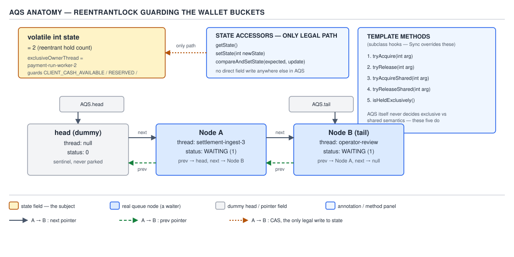
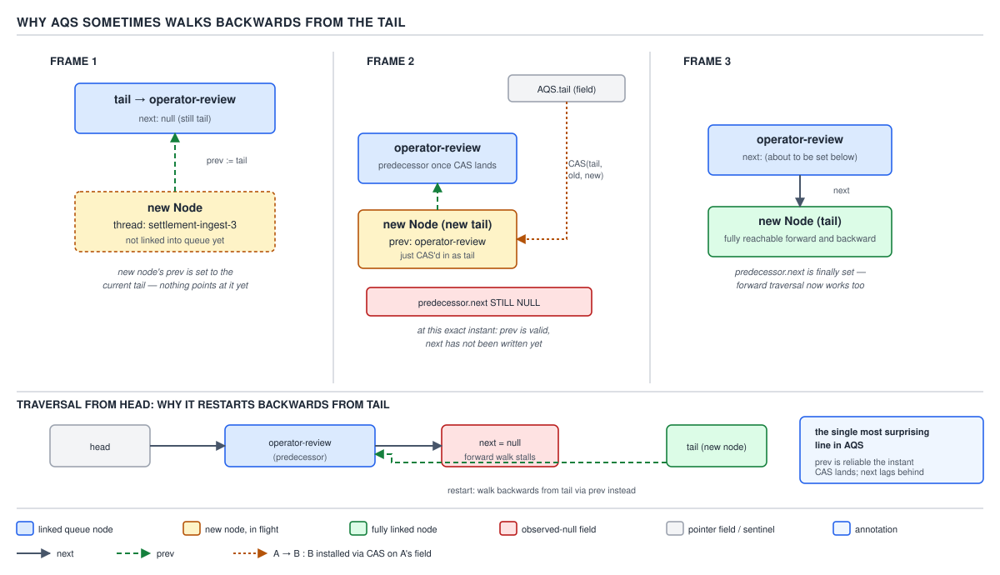
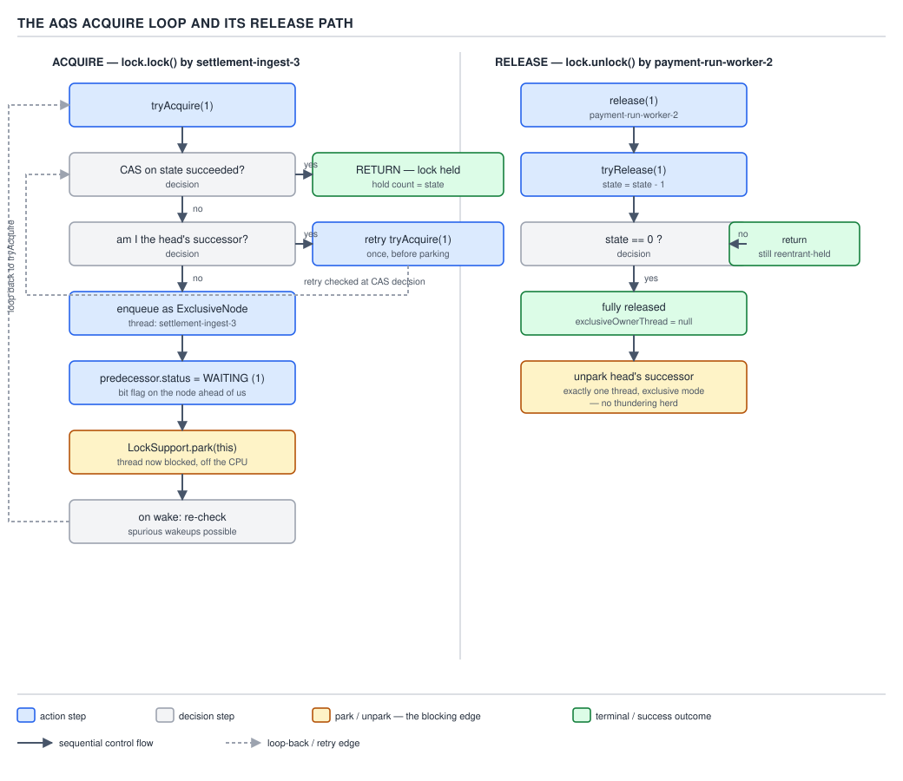
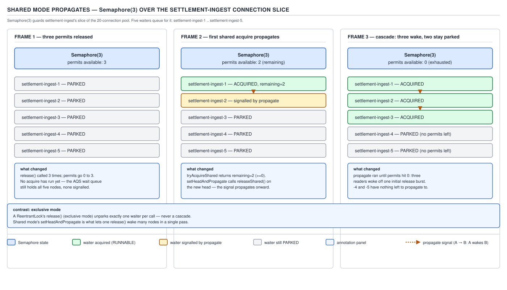

# 05 Multithreading and Concurrency — Explicit locks — INTERNALS (§3.5, leaves 3.5.1–3.5.13)

**Target version: Java 21 LTS.** | **Part 3 of 5** | [Index](../00-index.md)
Previous: [Safepoints as they touch concurrency](../volatile-and-jmm/05-internals-safepoints.md) · Next: [AQS conditions and the synchronizer mappings](04b-internals-aqs-conditions-and-mappings.md)

Every explicit lock, semaphore, latch and read-write lock in `java.util.concurrent.locks` and
`java.util.concurrent` is the same twenty-line idea wearing a different `state`. That idea is
`AbstractQueuedSynchronizer` (AQS), Doug Lea's 2004 synchronizer framework, and this file walks
its queue and its acquire path from the actual Java 21 source (git tag `jdk-21+35`,
`src/java.base/share/classes/java/util/concurrent/locks/AbstractQueuedSynchronizer.java`).

**[VERSION-TRAP], stated once up front so nothing below is read against the wrong code:** JDK 14
replaced AQS's original `waitStatus` int encoding with a bit-flag encoding and three concrete
`Node` subclasses. Almost every blog post, and most interview answers memorised from them,
describe the pre-14 encoding. Leaf 3.5.8/3.5.9 below gives both, side by side, and says which one
Java 21 actually runs.

---

### AQS's contract and the five template methods

A synchronizer is one `volatile int state`, a CAS protocol over it, and a FIFO queue of blocked
threads. AQS supplies all three. A subclass's entire job is to say what `state` *means* and how to
move it — everything else (queueing, parking, unparking, cancellation, propagation) is inherited
and never touched again. Picture AQS as the chassis of a car and each synchronizer as a different
dashboard bolted onto identical brakes and identical wheels: `ReentrantLock`'s dashboard shows a
hold count, `Semaphore`'s shows a permit count, `CountDownLatch`'s shows a countdown — the chassis
underneath does not know or care which dashboard it is driving.

**Why it exists.** Before AQS (JSR-166, 2004), every JDK synchronizer — the monitor bytecode
aside — hand-rolled its own wait queue: its own `compareAndSet` retry loop, its own park/unpark
bookkeeping, its own cancellation and timeout handling. That code was subtly different in each
class and subtly wrong in some of them. AQS is the observation that the queueing machinery is
*always the same twenty lines* and only the "can I go now?" predicate changes.

**When to reach for it, and when not.** Reach for AQS when building a new blocking synchronizer
whose acquire/release semantics can be expressed as a single `int` (leaf 3.5.22 in the next file
builds one). Do not reach for it to guard a single critical section in application code —
`ReentrantLock` or plain `synchronized` already are that, and subclassing AQS to protect one
method is building a chassis to drive to the corner shop. `StampedLock`, `Phaser` and `Exchanger`
deliberately do **not** use AQS (leaf 3.5.21, next file) because their acquire semantics do not
reduce to one CAS-able `int` — proof that AQS is a good fit for a narrower shape of problem than
"all locks".

**How it works — the five methods a subclass overrides, and nothing else:**

| Method | Called by | Contract |
|---|---|---|
| `tryAcquire(int)` | `acquire` | Exclusive: return `true` if `state` now reflects "acquired", `false` to queue |
| `tryRelease(int)` | `release` | Exclusive: return `true` only when the lock is now fully free |
| `tryAcquireShared(int)` | `acquireShared` | Shared: return negative on failure, zero on success with no propagation, positive to propagate to the next waiter |
| `tryReleaseShared(int)` | `releaseShared` | Shared: return `true` if the release may unblock other shared acquirers |
| `isHeldExclusively()` | `ConditionObject` | Whether the current thread holds exclusively — needed to size a condition-object contract |

All five are protected, unimplemented by default (`throw new UnsupportedOperationException`
unless a mode genuinely does not apply), and none of them may touch `state` directly except
through three accessors:

```java
protected final int getState()                                { return state; }
protected final void setState(int newState)                   { state = newState; }
protected final boolean compareAndSetState(int expect, int u)  { return U.compareAndSetInt(this, STATE, expect, u); }
```

`state` is `volatile`, so plain reads are already visibility-safe, but the *read-modify-write*
step — "if it's still 0, make it 1" — needs the CAS. Skipping the accessor and doing
`state = state + 1` directly is the single most common way to break a hand-rolled synchronizer:
two threads can both read the pre-increment value between the read and the write.

`ReentrantLock.Sync.nonfairTryAcquire` is the cleanest real `tryAcquire` to read, because it shows
both branches — the un-held case and the reentrant case — against the accessors above:

```java
final boolean nonfairTryAcquire(int acquires) {
    final Thread current = Thread.currentThread();
    int c = getState();
    if (c == 0) {
        if (compareAndSetState(0, acquires)) {
            setExclusiveOwnerThread(current);
            return true;
        }
    } else if (current == getExclusiveOwnerThread()) {
        int nextc = c + acquires;
        if (nextc < 0) // overflow
            throw new Error("Maximum lock count exceeded");
        setState(nextc);
        return true;
    }
    return false;
}
```

Line by line: `c == 0` means unheld, so the CAS from 0 to 1 is the only contended step — if it
loses the race, `tryAcquire` simply returns `false` and the caller queues. `current ==
getExclusiveOwnerThread()` is the reentrancy check: the owner never contends with itself, so this
branch needs no CAS, just a plain `setState` — safe because only the owning thread can be here.
The overflow guard is why `ReentrantLock`'s hold count has a real ceiling (`Integer.MAX_VALUE`),
not an academic one.



**D-158** — AQS anatomy: `state`, the accessors, the five template methods, and the CLH queue they
sit on top of.

**The gotcha.** `isHeldExclusively()` looks optional because plain locks never call it directly —
but `ConditionObject.await()` (next file, leaf 3.5.14) calls it to decide how much of `state` to
save before parking. Forget to override it correctly on a reentrant synchronizer and `await()`
silently saves the wrong hold count.

> **AQS is a `volatile int`, a CAS protocol, and a FIFO queue, packaged so that writing a new
> blocking synchronizer means defining five small predicates over that one `int` and nothing else.**

---

### What `state` means, per synchronizer

**[NUM] [PROVE]** Every row below reduces the same 32 bits to a different story. The read-write
lock row is the one worth proving rather than stating: 32 bits split into an upper half and a
lower half, `16 + 16`, giving each half a maximum of `2^16 - 1 = 65535`. Shared (reader) count
lives in the upper 16 bits so a reader acquire is `state + (1 << 16)`; exclusive (writer) hold
count lives in the low 16 bits, extracted as `state & 0xFFFF`. That is also why the 65 536th
reader throws `Error("Maximum lock count exceeded")` — the same overflow shape as
`nonfairTryAcquire` above, just against a 16-bit ceiling instead of a 32-bit one.

**D-162 (table).** What `state` means, per synchronizer.

| Synchronizer | AQS-based | What the 32 bits of `state` mean | Mode |
|---|---|---|---|
| `ReentrantLock` | Yes | Hold count (0 = unheld, N = held N times by the owner) | Exclusive |
| `Semaphore` | Yes | Permits remaining (can go negative transiently under `acquireUninterruptibly` races — never in practice, since `tryAcquireShared` blocks first) | Shared |
| `CountDownLatch` | Yes | Count remaining; released (permanently, to all) once it hits 0 | Shared |
| `ReentrantReadWriteLock` | Yes | Upper 16 bits = reader count, lower 16 bits = writer hold count; each capped at 65 535 | Both — exclusive writer sync, shared reader sync, one `state` |
| `ThreadPoolExecutor.Worker` | Yes | `0` = worker is created but hasn't started running a task and won't allow interrupt; `1` = running (interruptible) | Exclusive, used only for interrupt-safety, not mutual exclusion |
| `FutureTask` | No | Its own private state machine (`NEW`, `COMPLETING`, `NORMAL`, `EXCEPTIONAL`, `CANCELLED`, `INTERRUPTING`, `INTERRUPTED`) over a plain `volatile int`, no AQS queue | n/a |
| `StampedLock` | No | Its own 64-bit stamp: low bits = reader count / write-locked flag, high bits = sequence number | n/a — leaf 3.5.21 |
| `Phaser` | No | Its own packed `long` state: phase, parties, unarrived parties | n/a |
| `Exchanger` | No | No shared mutable state object at all — a lock-free slot array with per-slot CAS | n/a |
| `CompletableFuture` | No | Its own Treiber stack of `Completion` nodes over an `Object result` field | n/a |

The QuizStakes fit: a `ReentrantLock` guarding an in-memory wallet-cache projection's four
buckets (`CLIENT_CASH_AVAILABLE`, `CLIENT_CASH_RESERVED`, `CLIENT_BONUS_AVAILABLE`,
`CLIENT_BONUS_RESERVED` — never the ledger of record itself, which is a database transaction, not
a JVM lock) has `state` as a hold count of at most a handful, because the update path is short and
non-reentrant beyond one accidental re-lock. A `Semaphore(3)` fronting the connection pool used by
`FundsLedger`'s settlement worker has `state` running from 3 down to 0 as connections are checked
out, and the interesting behaviour — what happens to the other four waiters when one permit comes
back — is exactly the shared-mode propagation covered later in this file.

**Pitfall context, not a full pitfall block here:** treating `ReentrantReadWriteLock`'s `state` as
"32 bits, one lock" and writing `if (state > 0)` to mean "someone holds it" silently conflates
readers and writers. `state != 0` is true whenever there are readers **or** a writer; only
`state & 0xFFFF != 0` means a writer specifically holds it.

---

### The CLH queue variant

**Mental model.** Picture a single-file line at a bank counter where each customer holds a ticket
naming the person directly ahead of them, not a ticket with a number. `prev` is that "who's ahead
of me" pointer; `next` is the counter helpfully also writing "who's behind you" on the back of
each ticket once it gets around to it. The counter (the JVM) is authoritative on `prev`;
`next` is a courtesy shortcut that can lag.

**Why it exists.** The original Craig, Landin and Hagersten (CLH) design (1993) is a **spinlock**
queue: threads spin on their own predecessor's flag rather than on shared state, which avoids the
cache-line contention of naively spinning on one shared boolean. AQS adapts it for a general lock
that must be able to *block* rather than spin forever — so AQS's variant adds explicit successor
(`next`) links and swaps the spin for `LockSupport.park`/`unpark` signalling.

**When to reach for it, and when not.** This is infrastructure inside AQS, not a choice an
application makes directly — but the shape matters when reading a thread dump: every AQS-based
lock's blocked threads sit in exactly this doubly-linked structure, so "why is thread T blocked"
always bottoms out in "walk this queue".

**How it works.** The actual `Node` fields, from JDK 21 source:

```java
abstract static class Node {
    volatile Node prev;   // initially attached via casTail
    volatile Node next;   // visibly nonnull when signallable
    Thread waiter;        // visibly nonnull when enqueued
    volatile int status;  // written by owner, atomic bit ops by others
    ...
}
```

`head` is always a dummy node whose `waiter` is `null` — it represents "the thread that currently
holds the lock", not a queued waiter. Enqueue is a CAS of a new node onto `tail`:
`compareAndSetTail(oldTail, newNode)`. Dequeue on a successful acquire promotes the acquiring
node to be the new `head` and nulls its `waiter` field — the thread doesn't leave the data
structure, it just stops being "a waiter" and becomes "the dummy".

(See D-158 above — it also carries this section's queue shape; 3.5.1–3.5.6 share one diagram
because the anatomy and the queue are one picture, not two.)

**The gotcha.** The dummy head means `head.next` is the *first real waiter*, not the current
owner — a common off-by-one when reading `getFirstQueuedThread()` logic by eye.

> **AQS's queue is CLH's spin-only design plus explicit `next` links and park/unpark, so a lock
> that cannot get the CPU still costs nothing but one parked thread, not a spinning core.**

---

### Why AQS sometimes walks backwards from the tail

**[PROVE] [TRAP]** This is the single most surprising line in AQS, and it falls straight out of
the two field comments quoted above if you take them seriously instead of skimming past them:

- `prev` — *"initially attached via casTail"*
- `next` — *"visibly nonnull when signallable"*

Follow what a new node's enqueue actually does, in order:

1. The new node's `prev` field is set to point at the current tail. This happens **before** any
   publication — it's just a plain field write on a not-yet-shared object.
2. The node CASes itself into the `tail` slot: `compareAndSetTail(oldTail, newNode)`. The instant
   this CAS succeeds, the node is reachable from `tail`, and its `prev` pointer is already
   correct and durable — nothing more needs to happen to `prev` for it to be trustworthy.
3. Only **after** that CAS succeeds does the *old* tail's `next` field get set to point at the new
   node — a separate, later write, done by whichever thread is enqueuing (or, in edge cases, cleaned
   up lazily by someone else entirely).

Between steps 2 and 3, there is a window — one CAS wide, but a window nonetheless — where the new
node is the real tail, its `prev` correctly points at its predecessor, and the predecessor's
`next` is **still null**. Any thread that tries to find "the successor of node X" by reading
`X.next` during that window gets `null` and must not conclude "X has no successor" — it must
instead walk from `tail` backwards via `prev` (which is never stale) until it reaches X, and
whatever it passed through last is the real successor.

That is the derivation, not an assertion: **`prev` is written before the publishing CAS, so it is
always safe to trust; `next` is written after, so it is a hint that can lag and a forward walk
must be prepared to fall back to a backward one.**



**D-159** — the enqueue window in which `prev` is valid but the predecessor's `next` is still
null, and the backward walk that recovers from it.

**[VERSION-TRAP] — the node status encoding changed at the same JDK 14 rewrite.** Almost every
blog explaining AQS describes the pre-14 `waitStatus` int; Java 21 runs the bit-flag replacement.
Confirmed directly against JDK 21 source (tag `jdk-21+35`):

```java
static final int WAITING   = 1;          // must be 1
static final int CANCELLED = 0x80000000; // must be negative
static final int COND      = 2;          // in a condition wait
```

**D-161 (table).** The AQS node status encoding changed.

| | JDK 8–14 (`waitStatus`, the version almost every blog describes) | JDK 14+ / Java 21 (bit flags, confirmed via `jdk-21+35` source) |
|---|---|---|
| Cancelled | `CANCELLED = 1` | `CANCELLED = 0x80000000` (top bit, so any negative check still works but the value itself moved) |
| Needs signal | `SIGNAL = -1` | `WAITING = 1` (meaning inverted: bit *set* now means "needs a wake", not a magic negative sentinel) |
| On a condition queue | `CONDITION = -2` | `COND = 2` |
| Shared-mode propagate | `PROPAGATE = -3` | folded into the return value of `tryAcquireShared`/`releaseShared` — no longer a status bit at all |
| Default / just-enqueued | `0` | `0` |
| Node representation | One `Node` class, an `int nextWaiter` field doubling as a shared/exclusive marker | `ExclusiveNode`, `SharedNode`, `ConditionNode` — three concrete subclasses of an abstract `Node` |

```java
static final class ExclusiveNode extends Node { }
static final class SharedNode extends Node { }
static final class ConditionNode extends Node implements ForkJoinPool.ManagedBlocker { }
```

The type now carries what a magic int used to encode: whether a node is a shared or exclusive
waiter is a `instanceof` check, not a field comparison. `ConditionNode` additionally implementing
`ForkJoinPool.ManagedBlocker` is what lets a virtual thread parked on a condition still let its
carrier thread be reclaimed by the `ForkJoinPool` scheduler underneath it.

**Interview:** "Walk me through AQS's wait status" is almost always graded against the JDK 8
answer. State which encoding you're describing before answering — on Java 21 the honest answer is
bit flags (`WAITING`, `CANCELLED`, `COND`) plus typed node subclasses, not `SIGNAL`/`CONDITION`/
`PROPAGATE`.

---

### The acquire loop

**Mental model.** Acquiring is "try, and if you fail, get in line and sleep until someone taps
your shoulder" — repeated, because a shoulder-tap only means "try again", never "you're in".

**Why it exists.** A naive blocking acquire — `while (!tryAcquire()) park()` — has a lost-wakeup
race: the lock can free up and `unpark` a thread in the gap between that thread's failed
`tryAcquire` and its call to `park`, and the park then blocks forever with no one left to wake it.
The loop's actual shape exists entirely to close that window.

**When it runs, and when it's skipped entirely:** every call to `lock()` that finds the lock
already free never touches the queue at all — `tryAcquire` succeeds on the fast path and `acquire`
returns immediately. The queue and this loop exist purely for the contended case.

**How it works**, from JDK 21 source (`final int acquire(Node node, int arg, boolean shared,
boolean interruptible, boolean timed, long time)`; the historical `addWaiter` +
`acquireQueued` pair from pre-14 JDKs is now one method):

1. **Try acquiring first**, before touching the queue at all — the fast path above.
2. If that fails, check whether this node is already **first in line** (its predecessor is
   `head`, the dummy). If so, retry `tryAcquire` — the head slot just freed up, so there is a
   real chance of winning without ever parking.
3. If still not first, or the node isn't enqueued yet, **enqueue it** (CAS onto `tail`, exactly
   as walked through above).
4. Before parking, **mark the predecessor's status `WAITING`** — this is the "shoulder-tap
   subscription": it tells the thread ahead that someone needs to be woken when it releases,
   closing the lost-wakeup window the loop exists to avoid.
5. **`LockSupport.park()`** (or the timed/interruptible variant).
6. **On wake, go back to step 1** — a wake-up is never trusted as "you now hold the lock", only
   as "conditions may have changed, try again". Spurious wakeups from `park` are handled for
   free, because the loop re-verifies instead of assuming.

The release side that step 4 is subscribing to, `release`, is short because the queue does all
the bookkeeping:

```java
public final boolean release(int arg) {
    if (tryRelease(arg)) {
        signalNext(head);
        return true;
    }
    return false;
}
```

`signalNext(head)` looks at `head.next`; if that successor has a non-zero status (i.e. it is
actually waiting on something), it clears the `WAITING` bit and calls
`LockSupport.unpark(successor.waiter)`. **Only one thread is unparked per exclusive release** —
the one right behind the head — which is exactly why the acquire loop's step 2 exists: a woken
thread still has to win its own `tryAcquire` race against anyone barging in from outside the
queue (leaf 3.5.16, next file).



**D-160** — the acquire loop: try, check first-in-line, enqueue, mark predecessor `WAITING`,
park, and always re-verify on wake rather than trusting the wake-up itself.

**The gotcha.** Cancellation (a timed-out or interrupted waiter) rides on the same status field:
`cancelAcquire` sets `node.status = CANCELLED` and nulls `node.waiter`, then unlinks the node from
the queue via `cleanQueue()` if it had a live `prev`. A cancelled node between two live nodes is
why any queue walk — forward or the backward one from leaf 3.5.7 — has to be prepared to skip
over nodes whose status reads `CANCELLED`, not just nodes that no longer exist. This is also why
Doug Lea's own comments call cancellation "the source of most of AQS's complexity": every walk,
every signal, every enqueue has an extra branch purely to tolerate a node that gave up mid-queue.

> **The acquire loop never trusts a wake-up as permission — it trusts only a fresh `tryAcquire`,
> which is what turns a park/unpark pair that could race into one that provably cannot.**

---

### Shared mode and propagation

**Mental model.** Exclusive release taps exactly one shoulder, because only one thread can hold
an exclusive lock next. Shared release is a bucket brigade: waking one reader can free up a
permit count large enough that the *next* waiter behind it should also be woken immediately,
without waiting for its own turn to ask.

**Why it exists.** Without propagation, releasing 3 permits back to a `Semaphore` with 5 threads
queued would wake exactly one thread per `release()` call — three separate release calls to wake
three waiters, one signal at a time, even though all three permits were available simultaneously.
Propagation lets a single releasing thread's success cascade forward through as many waiters as
the newly available count actually supports.

**When it applies, and when not:** only to the shared-mode methods — `acquireShared`,
`releaseShared`, and their `tryAcquireShared`/`tryReleaseShared` overrides. Exclusive-mode
`acquire`/`release` never propagate, by contract: only one thread can hold an exclusive lock, so
"wake the next one too" would be wrong, not just wasteful.

**How it works.** `tryAcquireShared(int)` returns an `int`, not a boolean, and the sign carries
meaning: negative means "failed, queue", zero means "succeeded, but do not propagate — no more
capacity", and positive means "succeeded, **and propagate the signal to the next node too**". A
successful shared acquire (or release) that returns a positive/success value doesn't just unblock
its own thread — the AQS shared-acquire path re-checks the next node in the queue and, if that
node is also a shared waiter, signals it in turn. That is the mechanism, per the JDK's own
documentation of the shared path: *"an acquire signals the next waiter to try to acquire if it is
also Shared"* — one successful release can ripple through every contiguous shared waiter behind
it in a single call, rather than needing one `release()` per waiter.



**D-164** — a `Semaphore(3)` releasing permits back to five queued waiters: the first release
cascades through as many contiguous shared waiters as the returned permit count supports, rather
than waking exactly one thread per `release()` call.

**QuizStakes example.** The connection pool in front of `FundsLedger`'s settlement worker is
guarded by `new Semaphore(3)`. Five settlement tasks queue for a connection during a burst; when
one task finishes and calls `release()`, `tryReleaseShared` bumps the permit count and returns
`true`, and the shared-release path doesn't stop at waking one waiter — it wakes the next queued
task, whose own `tryAcquireShared` now succeeds against the freed permit, and if a second permit
was *also* just returned (say, two tasks finished back to back), that success propagates again to
a third. The cascade length in any one call is bounded only by how many permits are actually
available at that moment, not by a fixed "one wake per release" rule.

```java
private static final Semaphore CONNECTION_PERMITS = new Semaphore(3);

Connection borrowForSettlement() throws InterruptedException {
    CONNECTION_PERMITS.acquire();      // tryAcquireShared(1) < 0 ⇒ queue as a SharedNode
    try {
        return pool.take();
    } catch (RuntimeException e) {
        CONNECTION_PERMITS.release();  // tryReleaseShared bumps state; may propagate
        throw e;
    }
}

void returnAfterSettlement(Connection c) {
    pool.put(c);
    CONNECTION_PERMITS.release();      // may cascade-wake several queued SharedNodes
}
```

**The gotcha.** Propagation is why `Semaphore.release()` can look "too fast" under load in a
thread dump — several waiters transition out of the queue in the time it takes to read one stack
trace, because one `release()` call woke more than one thread. Reading that as "the semaphore is
broken, it's letting through more than one permit's worth of threads" is the wrong conclusion:
each woken thread still has to win its own `tryAcquireShared` — propagation wakes candidates, it
does not hand out permits for free.

> **Shared-mode release doesn't stop at the first waiter it can satisfy — a successful shared
> acquire propagates the wake-up signal forward, so one release can cascade through every
> contiguous shared waiter the freed capacity actually covers.**

---

## Pitfalls

### Assuming AQS's node status still matches the JDK 8 blog post you learned it from

**Wrong**

```java
// "SIGNAL means someone needs waking, right?"
if (node.status == -1) { // SIGNAL, per the JDK 8 encoding
    unparkSuccessor(node);
}
```

On Java 21 `status` never holds `-1` for this purpose — it holds the bit flag `WAITING = 1`.
Checking for `-1` silently never fires, and the "why isn't my successor being woken" investigation
goes looking in the wrong place entirely.

**Right**

```java
if ((node.status & WAITING) != 0) {
    // this node is owed a wake-up
}
```

**Why people believe it:** the JDK 8 `waitStatus` encoding shipped for a decade, is what most
still-indexed blog posts and diagrams describe, and the field is still called `status` in both
versions — nothing in the name change warns a reader that the values underneath moved.

### Assuming a woken thread now holds the lock

**Wrong**

```java
LockSupport.park();
// "I was unparked, so I must have the lock now"
doWork(); // may run while another thread still holds it
```

**Right**

```java
while (!tryAcquire(1)) {
    LockSupport.park();
    // loop back and re-check — a wake-up is only "try again", never "you're in"
}
doWork();
```

**Why people believe it:** `unpark`/`park` reads like a hand-off in isolation, and in the
uncontended case it behaves like one — the bug only shows up when a thread from outside the queue
barges in and wins the race first (leaf 3.5.16, next file), which is rare enough to pass most
manual testing.

---

## Cheat sheet

| Fact | Value / behaviour |
|---|---|
| `state` type | single `volatile int` (or `long` for `AbstractQueuedLongSynchronizer`) |
| Five template methods | `tryAcquire`, `tryRelease`, `tryAcquireShared`, `tryReleaseShared`, `isHeldExclusively` |
| State accessors | `getState`, `setState`, `compareAndSetState` — never mutate `state` directly |
| Queue shape | CLH variant: doubly linked (`prev`/`next`), dummy `head`, CAS-appended `tail` |
| Java 21 status flags | `WAITING = 1`, `COND = 2`, `CANCELLED = 0x80000000` |
| Pre-14 status (obsolete, do not use) | `SIGNAL = -1`, `CONDITION = -2`, `PROPAGATE = -3`, `CANCELLED = 1` |
| Node subclasses (21) | `ExclusiveNode`, `SharedNode`, `ConditionNode` |
| Why walk backwards from tail | `prev` set before the tail CAS (always valid); `next` set after (can be transiently null) |
| Release fan-out, exclusive | Exactly one successor unparked per `release()` |
| Release fan-out, shared | Cascades through every contiguous shared waiter the returned count covers |
| `ReentrantReadWriteLock` state split | Upper 16 bits reader count, lower 16 bits writer hold count, 65 535 max each |

## Self-test

**Q1.** Why must all reads *and writes* of `state` inside a `tryAcquire` override go through
`getState`/`setState`/`compareAndSetState` rather than touching the field directly?

<details><summary>Answer</summary>

`state` is `volatile`, so a plain read is already visibility-safe — but a read-modify-write
("increment if still zero") is not atomic just because the field is `volatile`. Two threads can
both read the same pre-update value between the read and the write and both proceed as if they
won. The accessors route every read-modify-write through `compareAndSetState`, which is the only
one of the three that is atomic end to end.

</details>

**Q2.** A thread calls `X.next` while walking the AQS queue and gets `null`, even though `X` is
not actually the tail. What must the thread do, and why is it safe?

<details><summary>Answer</summary>

It must walk backwards from `tail` via `prev` until it reaches `X`; whatever it passed through
last is `X`'s real successor. It's safe because `prev` is written *before* the publishing CAS
onto `tail`, so it is never stale, while `next` is written *after* that CAS by a separate step and
can lag behind it — a null `next` means "not yet linked", not "no successor exists".

</details>

**Q3.** On Java 21, what does a node status of `1` mean, and why is this a trap for anyone who
learned AQS before JDK 14?

<details><summary>Answer</summary>

On Java 21 it is the `WAITING` bit flag — "this node is owed a wake-up on the next release". On
JDK 8–14 the value `1` meant `CANCELLED`. The same integer means opposite things across the
rewrite, so quoting a pre-14 status table against Java 21 code gives exactly backwards answers.

</details>

**Q4.** Why does the acquire loop re-check `tryAcquire` after waking from `park`, instead of
simply proceeding once woken?

<details><summary>Answer</summary>

A wake-up only means "conditions may have changed, try again" — it is not a hand-off. A thread
outside the queue can barge in via an unfair `tryAcquire` and win between the `unpark` call and
the woken thread actually resuming (leaf 3.5.16). Re-checking closes that race and also absorbs
spurious wakeups from `park` for free, since both cases loop back to the same retry.

</details>

**Q5.** A `Semaphore(3)` has five threads queued and one thread calls `release()` twice in quick
succession. How many of the five queued threads can wake as a result of those two calls, and why
might it be more than two?

<details><summary>Answer</summary>

Potentially more than two, because each successful shared release propagates: if a woken waiter's
own `tryAcquireShared` succeeds and still returns a positive value, it signals the *next* waiter
in turn, cascading through as many contiguous shared waiters as the available permit count
actually supports — not capped at "one wake per `release()` call".

</details>

**Q6.** What does `head` point to in the AQS queue, and why does `getFirstQueuedThread()` look at
`head.next` rather than `head` itself?

<details><summary>Answer</summary>

`head` is always a dummy node representing "whoever currently holds the synchronizer" — its
`waiter` field is `null`. The first *actual* waiting thread is the node right after it, so any
code that wants "the next thread in line" reads `head.next`, not `head`.

</details>

**Q7.** Why is cancellation described as "the source of most of AQS's complexity" rather than a
minor edge case?

<details><summary>Answer</summary>

Because every other piece of the queue — the forward walk, the backward walk, signalling the
successor, enqueueing — has to tolerate a node whose thread gave up mid-queue (timed out or
interrupted) without breaking the links for everyone still waiting. `cancelAcquire` marks the
node `CANCELLED` and unlinks it via `cleanQueue()`, but every reader of the queue elsewhere still
has to be written as if a `CANCELLED` node could appear between any two live ones at any time.

</details>

## Open questions

- **Unverified:** the exact statement-by-statement body of `acquire(Node, int, boolean, boolean,
  boolean, long)`. The `jdk-21+35` source confirms the signature, the field comments behind leaf
  3.5.7, `release()`, `signalNext`, and `cancelAcquire`'s status/unlink behaviour verbatim, but
  the acquire loop's full body came back from the fetch paraphrased, not quoted. Treat the
  6-step order above as reliable, the exact statement text as unconfirmed.

---

**Leaves covered:** 3.5.1–3.5.13 (13 leaves)
**Leaves deferred:** none
**Diagrams included:** D-158, D-159, D-160, D-161, D-162, D-164
**Target version:** Java 21 LTS
**Lines:** 596
