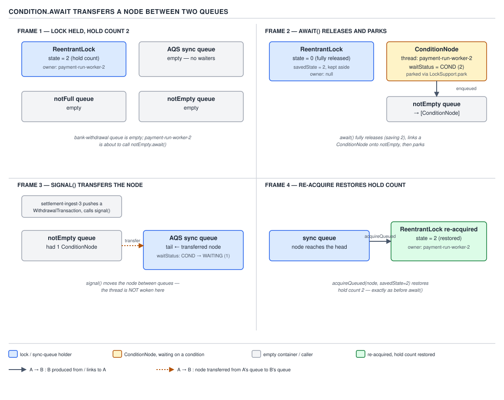

# 05 Multithreading and Concurrency — Explicit locks — INTERNALS (§3.5, leaves 3.5.14–3.5.22)

**Target version: Java 21 LTS.** | **Part 3 of 5** | [Index](../00-index.md)
Previous: [AQS — the queue and the acquire loop](04a-internals-aqs-queue-and-acquire.md) · Next: [LockSupport, park/unpark and the OS layer](05-internals-locksupport-and-os.md)

The previous file walked the queue every AQS-based lock waits in. This file covers the second
queue — the one `Condition.await()` uses — plus the small print that separates fair locks from
unfair ones, and which of the JDK's synchronizers are actually AQS underneath at all. Confirmed
against JDK 21 source (git tag `jdk-21+35`,
`src/java.base/share/classes/java/util/concurrent/locks/AbstractQueuedSynchronizer.java`) unless
marked otherwise.

---

### `ConditionObject.await` transfers a node between two queues

**Mental model.** A `Condition` is not a second lock — it is a **second queue** hanging off the
same synchronizer, plus two operations that move a node between the two queues. Picture a
restaurant's main line (the sync queue from the previous file) and a separate "call me when a
table opens" list (the condition queue) standing next to the host stand. Getting on the call-me
list means giving up your spot in the main line entirely — you are not holding a place in both at
once. Being called back off that list does not seat you; it moves you to the *back of the main
line*, where you wait like everyone else.

**Why it exists.** A lock alone answers "is the resource free". A condition answers "is the
resource in the *state* I need" — a bank teller thread needs not just the wallet lock but the
wallet's cash bucket to actually hold enough to pay out. Before `Condition`, this was `Object.wait
`/`notify` bolted onto `synchronized`, with exactly one wait set per monitor. `ConditionObject`
generalises this: one `Lock` can have as many independent condition queues as the application
needs, each waiting on a different predicate.

**When to reach for it, and when not.** Reach for a `Condition` when a thread must block until a
predicate over shared state becomes true while holding a `Lock` — the classic case is a bounded
structure with both a "not full" and a "not empty" side, which need to wake *different* sets of
waiters. Do not reach for it as a substitute for `CountDownLatch` or `CompletableFuture` when the
signal is a one-shot, no-lock-required event; a condition only exists paired to the lock that
guards the state it's about.

**How it works — the second queue.** `ConditionObject` maintains its own **singly-linked** list
(unlike the sync queue's doubly-linked one), tracked with `firstWaiter`/`lastWaiter` and built
from `ConditionNode`s (leaf 3.5.9, previous file — `ConditionNode extends Node implements
ForkJoinPool.ManagedBlocker`). `await()`:

1. Creates a `ConditionNode` and enqueues it onto **this condition's** list — not the sync queue.
2. **Fully releases** the lock (the next leaf works through exactly how much "fully" means).
3. Parks.
4. On wake, re-joins the **sync queue** (not the condition queue) and blocks there like any other
   contended acquirer until it reaches the head and wins `tryAcquire` again.

`signal()` does not wake the thread directly. It **transfers** the node — unlinks it from the
condition queue and splices it onto the sync queue's tail, exactly as if it had just called
`acquire` and been queued the ordinary way — and only *then*, if needed, unparks it. This is the
detail worth holding onto: a signalled thread does not resume running, it resumes **queueing**.



**D-163** — `Condition.await` transfers a node between two queues, across four frames: hold
count 2 before `await`; `await` fully releasing the state (saving 2) and parking on the condition
queue; `signal` splicing the node onto the sync queue's tail instead of waking the thread
directly; the thread reaching the sync queue's head, re-acquiring, and hold count 2 restored.

**A minimal concrete example**, the bank-withdrawal queue's `notFull`/`notEmpty` conditions on a
bounded queue of pending `WithdrawalTransaction`s awaiting a `PaymentRun`:

```java
final class PendingWithdrawalQueue {
    private final ReentrantLock lock = new ReentrantLock();
    private final Condition notEmpty = lock.newCondition();
    private final Condition notFull = lock.newCondition();
    private final WithdrawalTransaction[] buffer;
    private int head, tail, size;

    PendingWithdrawalQueue(int capacity) {
        this.buffer = new WithdrawalTransaction[capacity];
    }

    void enqueue(WithdrawalTransaction txn) throws InterruptedException {
        lock.lock();
        try {
            while (size == buffer.length) {
                notFull.await();               // fully releases lock, parks on notFull's queue
            }
            buffer[tail] = txn;
            tail = (tail + 1) % buffer.length;
            size++;
            notEmpty.signal();                 // transfers one waiter to the sync queue
        } finally {
            lock.unlock();
        }
    }

    WithdrawalTransaction dequeueForPaymentRun() throws InterruptedException {
        lock.lock();
        try {
            while (size == 0) {
                notEmpty.await();
            }
            WithdrawalTransaction txn = buffer[head];
            head = (head + 1) % buffer.length;
            size--;
            notFull.signal();
            return txn;
        } finally {
            lock.unlock();
        }
    }
}
```

`while`, not `if`, guards both `await()` calls — a signalled thread only gets a *chance* to
re-check the predicate once it re-acquires the lock, and by then another thread may have already
consumed the slot it was signalled about (leaf 3.5.15 below explains exactly why re-checking is
mandatory, not defensive).

**The gotcha.** `signal()` picks the **oldest** waiter on that condition's queue (FIFO within the
condition, same as the sync queue), but it does nothing at all to guarantee that waiter runs next
— it only guarantees it is now *queued* for the lock, on equal footing with any other thread
already waiting there or barging in unfair.

> **A `Condition` is a second FIFO queue bolted onto one synchronizer; `await` moves a node onto
> it and parks, `signal` moves that node back onto the sync queue — waking is never direct, it is
> always "you may now queue for the lock like everyone else".**

---

### Full release on `await`, and its consequence

**[PROVE]** `await()` does not release one level of a reentrant hold — it releases **all of it**,
in one call, and remembers how much there was. Trace why this must be true rather than assert it:
a `ReentrantLock` held twice by the same thread has `state == 2`. If `await()` only decremented
`state` to `1`, the lock would still read as held — by this very thread, which is now parked and
cannot ever call `unlock()` again to bring it to `0`. Every other thread's `tryAcquire` would see
`state != 0` and queue forever behind a lock whose owning thread is asleep on a condition and
will never wake anyone, because it can't reach `signal()` without a lock it can't get. That is a
permanent deadlock, self-inflicted by the very thread meant to be waiting cooperatively.

So `await()` must instead: read the full current hold count via `getState()`, call `release(full
count)` — which brings `state` to `0` and genuinely frees the lock for every other thread — and
save that count on the `ConditionNode` for later. When `signal()` eventually moves the node back
onto the sync queue and it wins `tryAcquire` again, it does **not** re-acquire once; it
re-acquires by exactly the saved count, restoring `state` to what it was before `await()` was
ever called.

**Concretely, in the QuizStakes bank-withdrawal example:** a teller thread that has entered
`enqueue()` re-entrantly — once from the public method, once more from a retry helper that also
takes the lock — holds `state == 2` when it calls `notFull.await()`. `await()` releases both
levels at once (not one), parking with `2` saved on its `ConditionNode`. When `notEmpty.signal()`
eventually moves it back and it wins the sync queue, it reacquires with `state` set straight back
to `2` — not `1`, and not by calling `tryAcquire` twice from `0`. The thread never observes a
window where it holds the lock at the wrong depth.

**The gotcha, and it is the same `[TRAP]` as the pitfall in the previous file:** because a
re-check happens only *after* full re-acquisition, and because other threads had the lock freely
in between, the predicate that was true when `signal()` fired can be false again by the time this
thread actually gets to look — which is exactly why `enqueue`/`dequeueForPaymentRun` above loop
on `while`, never `if`.

> **`await()` releases every level of a reentrant hold in one call and remembers the count,
> so that re-acquisition after `signal()` restores the exact hold depth the thread had — not a
> single level, and not a fresh acquisition from zero.**

---

### Fair versus unfair `tryAcquire`

**[PROVE]** `ReentrantLock` ships two `Sync` subclasses, `FairSync` and `NonfairSync`, and the
entire behavioural difference between `new ReentrantLock()` and `new ReentrantLock(true)` is one
method call. Compare `nonfairTryAcquire` (quoted in full in the previous file) against
`FairSync.tryAcquire`:

```java
protected final boolean tryAcquire(int acquires) {
    if (getState() == 0 && !hasQueuedPredecessors()
            && compareAndSetState(0, acquires)) {
        setExclusiveOwnerThread(Thread.currentThread());
        return true;
    }
    // ... reentrant branch identical to the nonfair version
    return false;
}
```

The only change from the nonfair version is the extra `!hasQueuedPredecessors()` guard before the
CAS. That single call is a real, correctness-relevant check — it walks the sync queue (from the
head, falling back to the tail-ward walk of leaf 3.5.7 if it finds a `null` in a stale spot) and
returns `true` if any thread other than the current one is already queued ahead. A fair lock
refuses to let a freshly-arriving thread jump the CAS ahead of threads that have been waiting
longer, at the cost of that queue walk on every single acquire attempt, contended or not.

**When to reach for fairness, and when not.** Fair locks trade throughput for FIFO ordering
guarantees; the JDK's own javadoc is blunt that fair locks are markedly slower under contention
because every acquire pays for the predecessor check, win or lose. Reach for fairness only when
starvation of a specific caller is an observed or provably possible problem — an operator-facing
override path that must never be starved out by a high-volume automated caller is a legitimate
case; a generic wallet-cache lock guarding four buckets almost never is.

**Barging, the pre-14 detail that changed nothing here.** `NonfairSync.lock()` historically
performed an immediate `compareAndSetState(0, 1)` **before even calling `tryAcquire`**, letting a
freshly-arriving thread "barge" ahead of everyone already parked in the queue if it got lucky on
timing. That barge-on-`lock()` behaviour is unrelated to the JDK 14 `Node`/status rewrite (leaf
3.5.9) — it is a separate optimisation in `lock()` itself, still present in the nonfair path,
and it is the mechanistic reason an unfair lock can let a thread that just arrived win against
five threads that have been parked for seconds: the newcomer never joins the queue at all if its
opportunistic CAS lands first.

**The gotcha.** "Fair" does not mean "fair in wall-clock time" — it means strict submission-order
FIFO through the AQS queue. A fair lock can still let a thread wait far longer in absolute terms
than an unfair one would typically impose, because fairness is about *order*, not *latency*.

> **The entire fair/unfair distinction in `ReentrantLock` is `hasQueuedPredecessors()` gating one
> CAS — fair pays a queue-walk on every acquire to guarantee FIFO order; unfair skips the check
> and lets a newcomer occasionally win the race outright.**

---

The remaining leaves in this file are supporting facts — each gets mechanism, gotcha where one
exists, and a boxed definition, not the full eight-beat treatment above.

**`AbstractQueuedLongSynchronizer`** is AQS's 64-bit-state twin — same template methods, same
queue, `state` is a `long` instead of an `int`. It exists for synchronizers whose count could
plausibly overflow 32 bits (`Phaser`-style unbounded generation counters are the usual reason
reached for, though `Phaser` itself is not AQS-based, per the mapping table below). Nothing else
about the acquire/release mechanics changes.

> **`AbstractQueuedLongSynchronizer` is AQS with a `volatile long state` in place of `volatile int
> state`, for the rare synchronizer whose count needs more than 32 bits.**

**`AbstractOwnableSynchronizer`** is the tiny superclass, above even AQS, that supplies exactly
one field: `exclusiveOwnerThread`, set via `setExclusiveOwnerThread` and read via
`getExclusiveOwnerThread`. It is what makes `ReentrantLock.isHeldByCurrentThread()` possible — it
is a plain field comparison against this. **[DUMP]** It is also what a thread dump's "Locked
ownable synchronizers" section is reading: `jstack`'s per-thread block lists every
`AbstractOwnableSynchronizer` whose `exclusiveOwnerThread` currently points at that thread,
formatted as:

```
Locked ownable synchronizers:
        - <0x00000007a1234560> (a java.util.concurrent.locks.ReentrantLock$NonfairSync)
```

The gotcha: this section only ever lists **exclusive** owners — a thread holding permits on a
`Semaphore` (shared mode) never appears here, because `Semaphore.Sync` never calls
`setExclusiveOwnerThread` at all.

> **`AbstractOwnableSynchronizer` is one field, `exclusiveOwnerThread`, and it alone is what
> `isHeldByCurrentThread()` and a thread dump's "locked ownable synchronizers" section read.**

---

### Why `StampedLock` is not AQS-based

**[PROVE]** `StampedLock` deliberately does not extend AQS, and the reason falls out of what a
"stamp" has to encode that a plain `state` int cannot. A stamp must let the caller later ask "has
anyone written since I read this stamp?" without holding any lock at all — that is the entire
point of its optimistic-read mode. Encoding that needs two independent pieces of information in
one 64-bit value simultaneously: a **write sequence number** that increments on every successful
exclusive acquire (so a caller can detect "something changed"), and the **current reader
count**, packed into the low bits alongside a bit for "currently write-locked". AQS's single
`state` int is built around CAS-based compare-and-set acquire/release with reentrancy and
ownership tracking baked in via `AbstractOwnableSynchronizer` — none of which optimistic reading
needs or wants. `StampedLock` trades away both reentrancy and ownership tracking entirely (calling
`unlockWrite` from a thread that never called `writeLock` is undefined, not detected) in exchange
for a stamp cheap enough to hand out and validate without ever touching a queue.

> **`StampedLock` is not AQS because its optimistic-read mode needs a sequence number and a
> reader count packed into one 64-bit stamp with no ownership tracking at all — a shape AQS's
> single reentrancy-and-CAS-oriented `state` int was never designed to express.**

---

### How each JDK synchronizer maps onto AQS

**D-162 in the previous file already gave what `state` means where AQS applies; this table
answers the narrower question of which classes are AQS subclasses at all**, since several names
that "feel like" they should be are not.

| Synchronizer | AQS-based | Notes |
|---|---|---|
| `ReentrantLock.Sync` (`FairSync`/`NonfairSync`) | **Yes** | The canonical case; both subclasses covered above |
| `ReentrantReadWriteLock.Sync` | **Yes** | Plus `HoldCounter`/`ThreadLocalHoldCounter`, tracking each *reader* thread's individual hold count separately from the packed `state`, since multiple readers share one `state` value but must each know their own reentrancy depth |
| `Semaphore.Sync` (`FairSync`/`NonfairSync`) | **Yes** | Shared mode; `state` is the permit count |
| `CountDownLatch.Sync` | **Yes** | Shared mode; one-shot, `state` never goes back up |
| `ThreadPoolExecutor.Worker` | **Yes** | Exclusive mode, used only to make a running worker's thread interrupt-safe, not for mutual exclusion between workers |
| `CompletableFuture` | **No** | Its own lock-free Treiber stack of `Completion` nodes over an `Object result` field — no queue, no `state` int |
| `StampedLock` | **No** | Its own sequence-and-reader-count stamp design, covered above |
| `Phaser` | **No** | Its own packed `long` of phase/parties/unarrived, with its own tree-structured registration for scalability |
| `Exchanger` | **No** | No shared mutable synchronizer state at all — a lock-free slot array, CAS per slot |

**The gotcha.** All four "No" rows still *feel* AQS-shaped from the outside — they block, they
queue conceptually, they have fairness-adjacent behaviour — which is precisely why this table
earns its place: "uses `java.util.concurrent.locks`" and "is AQS-based" are not the same claim.

> **Most of `java.util.concurrent`'s blocking classes are thin `Sync` subclasses over AQS; the
> four that are not — `CompletableFuture`, `StampedLock`, `Phaser`, `Exchanger` — each needed a
> shape of state (a lock-free stack, a sequence stamp, a tree of parties, a slot array) that a
> single CAS-able `state` int could not express.**

---

### A non-reentrant mutex, on a whiteboard

**[BUILD]** The AQS-based synchronizer a candidate should be able to produce from memory —
non-reentrant on purpose, to keep it to the five template methods and nothing else:

```java
import java.util.concurrent.locks.AbstractQueuedSynchronizer;

final class NonReentrantMutex extends AbstractQueuedSynchronizer {

    @Override
    protected boolean tryAcquire(int arg) {
        return compareAndSetState(0, 1);
    }

    @Override
    protected boolean tryRelease(int arg) {
        if (getState() == 0) {
            throw new IllegalMonitorStateException("Mutex is not held");
        }
        setState(0);
        return true;
    }

    @Override
    protected boolean isHeldExclusively() {
        return getState() == 1;
    }

    void lock() {
        acquire(1);
    }

    void unlock() {
        release(1);
    }

    java.util.concurrent.locks.Condition newCondition() {
        return new ConditionObject();
    }
}
```

Every line does exactly one job: `tryAcquire` is the only place a CAS appears, because acquiring
is the only contended write; `tryRelease` fails loudly rather than silently on a double-unlock,
which is what `IllegalMonitorStateException` is for across the whole `Lock` family; `isHeldExclusively`
exists purely so `newCondition()`'s `ConditionObject` can ask "does the caller of `await()`
actually hold this" without a bespoke check. Deliberately absent: no reentrancy branch (a second
`lock()` call from the same thread simply blocks forever against its own held `state == 1`, which
is the honest cost of leaving reentrancy out), and no `tryAcquireShared`/`tryReleaseShared`
overrides at all, because a mutex has no shared mode to support.

---

## Pitfalls

### Assuming `await()` releases one level of a reentrant lock

**Wrong**

```java
lock.lock();
lock.lock();               // held twice, state == 2
try {
    condition.await();     // "surely this releases one level, like a nested unlock would?"
} finally {
    lock.lock();            // now holding 3 levels' worth of unlock() calls owed — a leak
    lock.unlock();
    lock.unlock();
}
```

If `await()` released only one level, `state` would still read `1` while this thread is parked,
and every other thread's `tryAcquire`/`tryAcquireShared` would see the lock as held and queue
forever — a self-inflicted deadlock, since the parked thread is the only one who could ever call
`unlock()` again.

**Right**

```java
lock.lock();
lock.lock();               // state == 2
try {
    condition.await();     // fully releases (state -> 0), saves 2, re-acquires back to state == 2 on wake
} finally {
    lock.unlock();
    lock.unlock();          // exactly the two levels held before await(), no more, no less
}
```

**Why people believe it:** nested `lock()`/`unlock()` calls elsewhere in the same method body
behave symmetrically one level at a time, so it is a natural (and wrong) extrapolation that
`await()` — which sits between a pair of those calls — would follow the same one-level rule.

### Treating a fair lock as low-latency because "fair" sounds friendly

**Wrong**

```java
// "Fair sounds safer, so I'll use it everywhere for predictability."
private final ReentrantLock lock = new ReentrantLock(true);
```

Every single acquire — contended or not — now pays for a `hasQueuedPredecessors()` walk of the
sync queue, including the walk-backwards-from-tail fallback from the previous file when a `next`
pointer is transiently null. Under high contention this measurably lowers throughput compared to
the unfair default, for a guarantee (strict FIFO order) that most call sites never actually need.

**Right**

```java
private final ReentrantLock lock = new ReentrantLock(); // unfair default
// reach for `new ReentrantLock(true)` only where starvation of a specific caller
// is an observed or provably possible problem
```

**Why people believe it:** the word "fair" reads as an unqualified good in everyday English, and
the JDK's own naming does nothing to signal that fairness here is a specific throughput/ordering
trade-off rather than a strictly-better mode.

---

## Cheat sheet

| Fact | Value / behaviour |
|---|---|
| Condition queue shape | Singly-linked, `firstWaiter`/`lastWaiter`, built from `ConditionNode`s |
| `await()` releases | **All** levels of a reentrant hold, in one call, saving the count |
| `signal()` action | **Transfers** the oldest waiting node to the sync queue's tail; does not wake directly |
| Why `while`, not `if`, around `await()` | Predicate can become false again between `signal()` and this thread's re-acquisition |
| Fair vs. unfair, the entire diff | `FairSync.tryAcquire` adds `!hasQueuedPredecessors()` before the CAS |
| Unfair barging | `NonfairSync.lock()` may CAS `0→1` before ever calling `tryAcquire`, letting a newcomer skip the queue |
| `AbstractQueuedLongSynchronizer` | AQS with `state` as `long` instead of `int` |
| `AbstractOwnableSynchronizer` | One field, `exclusiveOwnerThread`; powers `isHeldByCurrentThread()` and jstack's "locked ownable synchronizers" |
| AQS-based | `ReentrantLock`, `ReentrantReadWriteLock`, `Semaphore`, `CountDownLatch`, `ThreadPoolExecutor.Worker` |
| Not AQS-based | `StampedLock`, `Phaser`, `Exchanger`, `CompletableFuture` |
| `StampedLock`'s reason for not extending AQS | Needs a sequence number **and** a reader count packed into one 64-bit stamp, no ownership tracking |

## Self-test

**Q1.** Why must `await()` release *all* levels of a reentrant hold rather than just one?

<details><summary>Answer</summary>

If it released only one level, `state` would still read as held by this thread while it is
parked. Every other thread's `tryAcquire` would see a nonzero `state` and queue forever, and the
only thread that could ever bring `state` to zero is the one now asleep — a permanent,
self-inflicted deadlock. Releasing fully and saving the count is the only way `await()` can hand
the lock to someone else while still being able to restore the exact hold depth later.

</details>

**Q2.** What does `signal()` actually do to the waiting thread — does it wake it up?

<details><summary>Answer</summary>

Not directly. `signal()` unlinks the oldest node from the condition queue and splices it onto the
tail of the *sync* queue, as if it had just called `acquire` and queued normally. Only then, if
needed, does it unpark the thread — and even that unpark only lets the thread resume trying to
acquire; it does not hand the lock over.

</details>

**Q3.** Why does `enqueue()`/`dequeueForPaymentRun()` loop on `while (size == …)` instead of
`if (size == …)` around `await()`?

<details><summary>Answer</summary>

A signalled thread only gets a chance to re-check the predicate after it wins its own
`tryAcquire` back on the sync queue — and between the `signal()` call and that re-acquisition,
any other thread could have run and changed the state again (e.g. another producer filled the
slot this thread was signalled about). `while` re-verifies the actual condition instead of
trusting that being signalled means the condition still holds.

</details>

**Q4.** What is the entire behavioural difference between `new ReentrantLock()` and
`new ReentrantLock(true)`, at the source level?

<details><summary>Answer</summary>

One extra call in `tryAcquire`: the fair version adds `!hasQueuedPredecessors()` as a condition
before the CAS from 0 to 1. Everything else — the reentrant branch, `tryRelease`,
`isHeldExclusively` — is identical between `FairSync` and `NonfairSync`.

</details>

**Q5.** Why is `StampedLock` not built on AQS?

<details><summary>Answer</summary>

Its optimistic-read mode needs a stamp that packs a write-sequence number (to detect "did anyone
write since I read this stamp") together with a reader count, with no ownership or reentrancy
tracking. AQS's `state` int is built around CAS acquire/release plus `AbstractOwnableSynchronizer`
ownership tracking — a shape suited to locks with an owner, not to a value meant to be validated
without ever acquiring anything.

</details>

**Q6.** Name the four JDK concurrency classes in this file's mapping table that are *not*
AQS-based, and in one phrase each, what each uses instead.

<details><summary>Answer</summary>

`CompletableFuture` — a lock-free Treiber stack of `Completion` nodes. `StampedLock` — a packed
64-bit sequence-and-reader-count stamp. `Phaser` — a packed `long` of phase/parties/unarrived with
tree-structured registration. `Exchanger` — a lock-free slot array with per-slot CAS.

</details>

**Q7.** In the whiteboard `NonReentrantMutex`, why does `tryRelease` throw
`IllegalMonitorStateException` on `getState() == 0` instead of just returning `false`?

<details><summary>Answer</summary>

A double-`unlock()` (or an `unlock()` from a thread that never held the mutex) is a programmer
error, not a contention outcome that `tryAcquire`'s `false` return is meant to represent. Failing
loudly with `IllegalMonitorStateException` matches the convention every `Lock` implementation in
the JDK uses for exactly this misuse, rather than silently swallowing it.

</details>

---

**Leaves covered:** 3.5.14–3.5.22 (9 leaves)
**Leaves deferred:** none
**Diagrams included:** D-163
**Target version:** Java 21 LTS
**Lines:** 528
