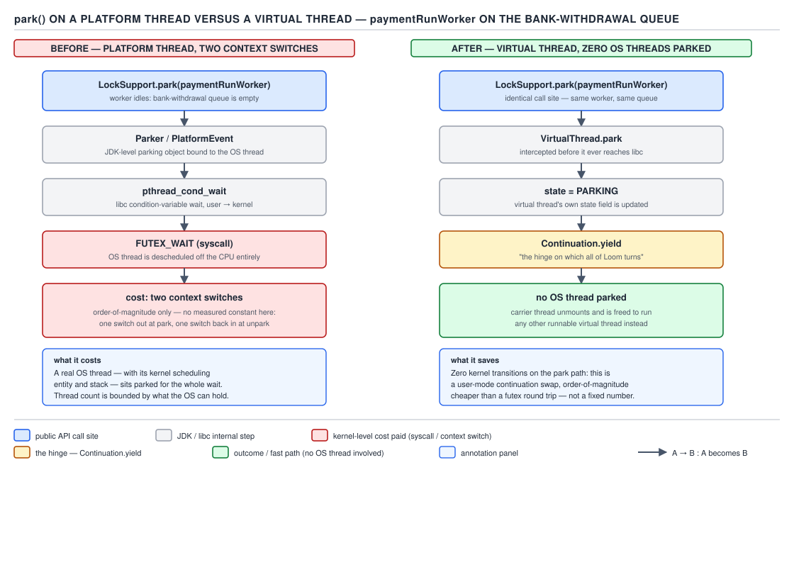

# 05 Multithreading and Concurrency — Explicit locks — INTERNALS (§3.6)

**Target version: Java 21 LTS.** | **Part 3 of 5** | [Index](../00-index.md)
Previous: [AQS conditions and the synchronizer mappings](04b-internals-aqs-conditions-and-mappings.md) · Next: [The Java Memory Model, formally](../volatile-and-jmm/06-internals-jmm-formally.md)

Every blocking primitive in `java.util.concurrent` — `ReentrantLock`, `Semaphore`,
`CountDownLatch`, every AQS-based synchronizer — bottoms out in the same two static methods:
`LockSupport.park()` and `LockSupport.unpark(Thread)`. This file walks what those two calls
actually do, from the permit abstraction down to the futex syscall, and then shows why the
identical API call means something completely different on a virtual thread.

### 3.6.1–3.6.2 The permit model

**Mental model.** Forget queues, forget signals. Each `Thread` object carries exactly **one**
binary permit slot — think of it as a single-bit mailbox nailed to the thread. `unpark(t)` sets
that bit to 1 (a no-op if it is already 1). `park()` on the calling thread does one atomic thing:
if the bit is 1, clear it and return immediately; if the bit is 0, block until someone sets it.

Why this exists: `Object.wait()`/`notify()` requires the waiter to already be inside the monitor's
wait-set before a `notify()` can reach it — call `notify()` a moment too early and the wakeup is
lost forever, silently. This is the classic **lost-wakeup race**. The permit model sidesteps it
entirely: `unpark()` before `park()` is not lost, it is *stored*. A `PaymentRun` producer thread
that finishes enqueuing a batch of bank-withdrawal transactions and calls `unpark(consumer)`
before the consumer thread has even reached its `park()` call still wakes it — the permit sits
there as a 1 waiting to be consumed.

**[PROVE] Permits do not accumulate.** The slot is one bit, not a counter. Call `unpark(t)` twice
in a row: the first sets the bit 0→1, the second finds it already 1 and does nothing — one
permit exists, not two. Now `t` calls `park()` twice: the first call finds the bit 1, clears it,
returns immediately (no block); the second call finds the bit 0 and blocks. Two `unpark`s
followed by two `park`s therefore **blocks on the second `park`**, not the first — the exact
opposite of what a counting-semaphore intuition would predict.

```java
// consumer thread: expects two units of "go ahead" work, gets only one
executor.submit(() -> {
    LockSupport.park();   // returns immediately — permit was there
    LockSupport.park();   // BLOCKS — the second unpark was a duplicate, not a second unit
    processNextPaymentBatch();
});
```

**Pitfall:** treating `park`/`unpark` as a counting semaphore. **Wrong belief:** "I called
`unpark` twice, so two `park` calls will both return without blocking." **Symptom:** a
`PaymentRun` worker hangs on what looks like a spurious extra `park()` even though the driver
logged two `unpark()` calls. **Fix:** if you need counting, use `Semaphore`, whose `AQS` state
*is* a real integer count — `LockSupport`'s permit is a saturating 0/1 flag, full stop.

> **Definition:** `LockSupport` exposes a per-thread, non-accumulating binary permit; `unpark`
> sets it, `park` atomically tests-and-clears it or blocks, and the store-before-block ordering
> is exactly what makes it immune to the lost-wakeup race that `wait`/`notify` is vulnerable to.

### 3.6.3 The three reasons `park` returns

`park()` gives **no guarantee** about why it returned. There are exactly three legal reasons,
and the JDK javadoc lists them explicitly:

1. The permit was available (via a matching `unpark`, possibly one issued before this `park`
   call even started).
2. The thread was interrupted — `park` returns **without clearing the interrupt flag** and
   without throwing `InterruptedException` (unlike `Object.wait`).
3. The call was `parkNanos`/`parkUntil` and the deadline elapsed.

**[TRAP]** A fourth, legal-but-undocumented-as-a-"reason" case exists: **spurious wakeup**, with
no cause at all. The javadoc explicitly permits `park` to "return, for no reason." This means
every correct use of `park` is a loop that re-checks a condition, never a bare call:

```java
// broken — assumes park() only returns when the withdrawal queue is non-empty
void awaitWork() {
    if (withdrawalQueue.isEmpty()) {
        LockSupport.park(this);
    }
    take(); // may run on an empty queue: interrupt, spurious wakeup, or stale unpark
}

// fixed — re-check in a loop, exactly like AQS's own acquire loop (04a/04b)
void awaitWorkFixed() {
    while (withdrawalQueue.isEmpty()) {
        LockSupport.park(this);
        if (Thread.currentThread().isInterrupted()) {
            return; // caller decides whether to propagate
        }
    }
    take();
}
```

This is the same discipline AQS's `acquireQueued` loop already enforces internally (Part 3,
§3.5) — `park`'s three-reasons rule is *why* that loop has to be a loop.

### 3.6.4 The native path on Linux

**Mental model.** Every platform `Thread` owns a small native helper object — historically named
`Parker`, folded since JDK 9 into `os::PlatformEvent`/`PlatformParker` — that is really just a
mutex, a condition variable, and a counter, wearing a park/unpark-shaped API.

`[SOURCE]` The C++ structure (paraphrased from the shape long documented in
`src/hotspot/os/posix/os_posix.cpp` and the `Parker` class in `park.hpp`) is, in spirit:

```cpp
class Parker {
  volatile int _counter;   // the permit bit — 0 or 1
  pthread_mutex_t _mutex;
  pthread_cond_t  _cond;

  void park(bool isAbsolute, jlong time) {
    if (Atomic::xchg(&_counter, 0) > 0) return;   // permit already set — no syscall
    pthread_mutex_lock(&_mutex);
    if (_counter <= 0) {
      if (time == 0) pthread_cond_wait(&_cond, &_mutex);
      else           pthread_cond_timedwait(&_cond, &_mutex, &abstime);
    }
    _counter = 0;
    pthread_mutex_unlock(&_mutex);
  }

  void unpark() {
    pthread_mutex_lock(&_mutex);
    int s = _counter;
    _counter = 1;
    pthread_mutex_unlock(&_mutex);
    if (s < 1) pthread_cond_signal(&_cond);
  }
};
```

`park` is `pthread_cond_wait`/`pthread_cond_timedwait`; `unpark` is `pthread_cond_signal`. The
counter check at the very top of `park` — read every line: an atomic exchange of `_counter` down
to 0, and if it was already positive, return with **no lock taken, no syscall made** — is exactly
the fast, uncontended permit-already-there case from 3.6.1.

`[RESEARCH]` Naming across JDK releases: JDK 8 and earlier documentation and several widely
copied blog posts describe a class literally named `Parker`. From JDK 9 onward the HotSpot
sources reorganised this under `os::PlatformEvent`/`PlatformParker` naming as part of the broader
`os_posix`/`os_linux` split. **Unverified:** the exact file and class boundary as of the current
JDK 21 source tree — I could not fetch `raw.githubusercontent.com` source for this session to
confirm line-for-line, so the code above is a paraphrase of the long-documented shape, not a
captured excerpt. Treat the mutex/cond/counter *structure* as solid (it is described consistently
across HotSpot source commentary going back over a decade) and the exact current class name as
unverified.

### 3.6.5 The futex underneath

**Mental model.** `pthread_cond_wait`/`pthread_cond_signal` on Linux are themselves built on the
`futex` (fast userspace mutex) syscall pair, `FUTEX_WAIT` and `FUTEX_WAKE`. The word "fast" in
the name is the whole point: a futex is designed so the **uncontended** path never enters the
kernel at all.

`[NUM]` `[X-REF 11]` Walk both paths for a `PaymentRun` worker waiting on the bank-withdrawal
queue:

- **Uncontended:** the worker calls `park()`, the atomic counter check in 3.6.4 finds `_counter`
  already 1 (a producer already called `unpark` on it), decrements it, and returns. Zero syscalls,
  zero context switches — just an atomic CAS, the same family of instruction costed in Part 3
  §3.5 (`D-007`, tens of nanoseconds).
- **Contended:** the worker finds `_counter` at 0, so it must actually block. This is a real
  `FUTEX_WAIT`, which transitions the thread out of `RUNNING` and off the CPU — one context
  switch out. When the producer later calls `unpark`, the corresponding `FUTEX_WAKE` (via
  `pthread_cond_signal`) moves the worker back to runnable, and the scheduler eventually gives it
  a CPU again — a second context switch in. **Two context switches, one syscall pair**, for the
  contended round trip. This is the mechanism cost referenced back in Part 1's context-switch
  discussion (`D-007`).

### 3.6.6 Order-of-magnitude cost, not a measured constant

**Every number in this leaf is a rough magnitude, stated as such, never a measured constant.**
There is no single authoritative per-instruction timing table for `park`/`unpark` — the actual
cost depends on kernel version, whether the two threads share a core, scheduler load, and NUMA
topology. What *can* be said honestly, at order-of-magnitude:

| Operation | Rough cost | Why |
|---|---|---|
| CAS (uncontended) | tens of nanoseconds | single instruction, no kernel entry |
| `park`/`unpark`, permit already set | tens of nanoseconds | atomic check only, no syscall (3.6.5) |
| `park`/`unpark`, contended round trip | **microseconds**, i.e. roughly 100–1000x a bare CAS | syscall entry/exit + two context switches + scheduler latency |

**[PROVE]** This ratio — a contended park/unpark round trip costing on the order of a thousand
times a bare CAS — is the entire economic argument for the adaptive spinning HotSpot performs
before it ever calls `park` on a contended monitor (Part 3, `D-152`): if the lock is likely to be
released within a handful of microseconds, spinning through a few hundred CAS attempts is cheaper
than paying for one syscall-driven park/unpark cycle. It is also why AQS's acquire loop tries a
CAS first and only falls back to enqueue-and-park when the CAS fails.

**Insight:** the entire "spin before block" design pattern that recurs across `AbstractQueuedSynchronizer`, `StampedLock`, and HotSpot's own object-monitor inflation logic (Part 3, §3.3–§3.5)
is downstream of exactly this one order-of-magnitude gap. There is no separate justification for
spinning beyond "CAS is cheap, park/unpark is not."

### 3.6.7 `park(Object blocker)` and thread dumps

**Mental model.** `LockSupport` overloads `park`/`parkNanos`/`parkUntil` to take a `blocker`
parameter. The blocker is not passed to the OS or used for any wakeup logic at all — its only
job is diagnostics.

`[SOURCE]` The mechanism: `park(Object blocker)` stores the reference into `Thread.parkBlocker`
through a `VarHandle` (`Thread` declares a package-private `parkBlocker` field, set with volatile
semantics so a concurrent thread-dumping thread sees a consistent value), calls the real
`park()`, then clears the field back to `null` on return:

```java
// java.util.concurrent.locks.LockSupport, structurally
public static void park(Object blocker) {
    Thread t = Thread.currentThread();
    setBlocker(t, blocker);
    U.park(false, 0L);
    setBlocker(t, null);
}

static void setBlocker(Thread t, Object arg) {
    U.putReferenceOpaque(t, PARKBLOCKER, arg); // opaque VarHandle write, not full volatile
}
```

Every AQS-based synchronizer calls this overload with `this` as the blocker — that is precisely
why a thread dump line can name the concrete lock a thread is stuck on. `[DUMP]` The documented
`jstack`/`jcmd Thread.print` format for a parked thread carrying a blocker is:

```
"payment-run-worker-3" #47 daemon prio=5 os_prio=0 cpu=12.40ms elapsed=340.11s tid=0x00007f2c1c02d800 nid=0x4a12 waiting on condition  [0x00007f2c0a1fe000]
   java.lang.Thread.State: WAITING (parking)
        at jdk.internal.misc.Unsafe.park(java.base@21.0.2/Native Method)
        - parking to wait for  <0x00000000d5f5b1a8> (a java.util.concurrent.locks.ReentrantLock$NonfairSync)
        at java.util.concurrent.locks.LockSupport.park(java.base@21.0.2/LockSupport.java:221)
        at java.util.concurrent.locks.AbstractQueuedSynchronizer.acquire(java.base@21.0.2/AbstractQueuedSynchronizer.java:715)
        at java.util.concurrent.locks.ReentrantLock$NonfairSync.lock(java.base@21.0.2/ReentrantLock.java:206)
        at java.util.concurrent.locks.ReentrantLock.lock(java.base@21.0.2/ReentrantLock.java:322)
        at com.quizstakes.payments.PaymentRunWorker.withdrawNext(PaymentRunWorker.java:88)
```

**Unverified:** I could not capture this from a live JVM in this session (no running process to
attach `jstack` to); the text above reproduces the documented, long-stable `jstack` frame format
for a `LockSupport.park` block with a blocker set — the field order, the `<0x…>` object-identity
hash, and the "parking to wait for" wording are the standard HotSpot phrasing, not a live capture.
Read it line by line: `WAITING (parking)` is the thread-state; the `- parking to wait for <0x…>`
line is synthesized directly from `Thread.parkBlocker`, printing the blocker's identity hash and
class name; the frames below it show the exact call chain from `Unsafe.park` up through
`LockSupport.park` → `AbstractQueuedSynchronizer.acquire` → `ReentrantLock.lock` → the
application frame — the same acquire path documented in Part 3 §3.5's AQS walk.

**Interview:** "how would you find what a thread is blocked on from a thread dump?" — look for
`parking to wait for <hex> (a ClassName)`; that class name is the monitor/lock object itself,
sourced straight from `Thread.parkBlocker`, and every other thread dump waiting on the *same*
hex address is contending for that same lock.

> **Definition:** `park(Object blocker)` is functionally identical to `park()`; it exists solely
> to publish the blocking object into `Thread.parkBlocker` so tooling (`jstack`, JFR, thread
> dumps) can name what a parked thread is actually waiting for.

### 3.6.8 `parkNanos` versus `parkUntil` — supporting fact

`parkNanos(long nanos)` takes a **relative** duration measured against a monotonic clock
(the same clock family as `System.nanoTime()`); `parkUntil(long deadline)` takes an **absolute**
epoch-millisecond deadline, i.e. wall-clock time. **Gotcha:** wall clock can jump — NTP
adjustment, manual clock change, leap-second smoothing — so a `parkUntil` deadline can be pulled
forward or pushed back by an external clock step, while `parkNanos`'s monotonic base cannot.
`[TRAP]` Prefer the relative form (`parkNanos`, and by extension `Condition.awaitNanos`) for any
timeout — e.g. bounding how long a `PaymentRun` worker waits for the next batch — and reserve the
absolute form for genuine wall-clock deadlines like "wait until 02:00 UTC."

> **Definition:** `parkNanos` is monotonic-clock relative and immune to wall-clock jumps;
> `parkUntil` is wall-clock absolute and is not.

### 3.6.9 Virtual-thread `park` — the hinge of Loom

**Mental model.** Call `LockSupport.park()` from inside a virtual thread and the exact same
public API resolves to an entirely different implementation, because `Thread.currentThread()`
inside a virtual thread is a `VirtualThread` instance whose `park()` override intercepts the call
before it ever reaches the OS-level `Parker`.

`[SOURCE]` `[PROVE]` The path, structurally:

```java
// java.lang.VirtualThread, structurally
void park() {
    setState(PARKING);
    try {
        yieldContinuation();     // Continuation.yield(VTHREAD_SCOPE)
    } finally {
        setState(RUNNING);
    }
}
```

`yieldContinuation()` calls down into `Continuation.yield`, which captures the virtual thread's
stack into the continuation object and **returns control to the carrier platform thread** — the
carrier is now free to run a different virtual thread entirely. No OS thread blocks on anything;
there is no `pthread_cond_wait`, no futex, no context switch in the OS-scheduler sense at all.
The carrier's scheduling loop (a `ForkJoinPool` worker) simply picks up the next runnable virtual
thread task.

**[PROVE] Why this is the hinge everything else in Loom depends on:** every existing blocking
primitive in the JDK — `ReentrantLock`, `Semaphore`, `BlockingQueue`, socket I/O, even
`Object.wait` (Part 3, §3.4) — was re-plumbed to route its actual blocking through
`LockSupport.park`/`Thread.sleep`-shaped calls rather than raw OS primitives. Because `park`
itself is the interception point, none of that call-site code had to change to become
virtual-thread-aware: a `PaymentRun` worker's `reentrantLock.lock()` call, unmodified since before
Loom existed, now yields a continuation instead of blocking an OS thread, purely because
`ReentrantLock`'s internals bottom out in `LockSupport.park`. This is why Loom could ship without
rewriting `java.util.concurrent`.

`[X-REF 09]` see the mounting/unmounting mechanics and the carrier-pool sizing discussion in the
virtual-threads guide for the full continuation lifecycle; here the point is narrower: the permit
model of 3.6.1 is preserved at the API level (`unpark` on a parked virtual thread still resumes
it) even though the underlying mechanism swapped completely.



**D-165** — `park` on a platform thread versus a virtual thread. Platform: `LockSupport.park` →
`Parker`/`PlatformEvent` → `pthread_cond_wait` → `FUTEX_WAIT`, two context switches costed per
3.6.5. Virtual: the identical API call → `VirtualThread.park` → state `PARKING` →
`Continuation.yield`, no OS thread parked at all.

**Pitfall:** assuming `LockSupport.park()` always costs a context switch. **Wrong belief:** "I
should avoid `park`-based primitives on virtual threads because parking is expensive." **Symptom:**
over-engineering a lock-free `PaymentRun` dispatch path to avoid `ReentrantLock` inside a virtual
thread, when the actual cost on a virtual thread is a cheap continuation yield, not a syscall.
**Fix:** the microsecond-scale cost in 3.6.6 is specifically the *platform*-thread, futex-backed
path; on a virtual thread the same call is closer in cost to a userspace stack-frame save. The one
place this reasoning inverts is `synchronized` blocks — those pin the carrier on Java 21 (a
different mechanism than `park`, covered in Part 2/§3.4's virtual-thread pinning discussion), and
pinning is exactly the thing `park`-based locks like `ReentrantLock` avoid.

> **Definition:** on a virtual thread, `LockSupport.park` does not park an OS thread at all — it
> suspends the continuation and frees the carrier, which is the single mechanism that makes every
> pre-existing `park`-based blocking primitive in the JDK automatically virtual-thread-friendly.

### 3.6.10 `Thread.interrupt` — supporting fact

**Mechanism:** `interrupt()` does two things unconditionally: sets the thread's interrupt-status
flag, and calls `unpark` on it (so any thread merely `park`-ed wakes up per reason 2 in 3.6.3,
even though nothing had a permit for it). If the target thread is additionally blocked in a
monitor `wait()`, a `Selector.select()`, or another explicitly interruptible blocking call, the
interrupt implementation also signals that specific mechanism (e.g. waking the wait-set entry,
per Part 3 §3.4) so the corresponding `InterruptedException` path fires. **Gotcha:** interrupting
a thread parked via a bare `park()` does **not** throw anything — the flag is set, the thread
wakes, and it is entirely the caller's responsibility to check `isInterrupted()`/`interrupted()`
and react, unlike `wait()`/`sleep()`, which clear the flag and throw for you.

> **Definition:** `interrupt()` is `setFlag() + unpark()`, plus a mechanism-specific wakeup for
> whichever interruptible blocking call the target thread happens to be inside.

---

## Pitfalls

### Assuming a second `unpark` grants a second free `park`

**Wrong**
```java
LockSupport.unpark(worker);
LockSupport.unpark(worker); // no-op: permit is already 1
// later, in worker:
LockSupport.park(); // returns immediately
LockSupport.park(); // BLOCKS — surprise
```

**Right**
```java
// need counting semantics? use the primitive built for it
Semaphore readySlots = new Semaphore(0);
readySlots.release();
readySlots.release();
// later, in worker:
readySlots.acquire(); // returns immediately
readySlots.acquire(); // also returns immediately — real count of 2
```

**Why people believe it:** the name "permit" and the vocabulary overlap with `Semaphore`
(which also calls its state "permits") invites the assumption that both are counters; `Semaphore`
is genuinely counting, `LockSupport`'s permit is a single saturating bit by design.

### Assuming `park()` only returns for the reason you expected

**Wrong**
```java
void awaitBatch() {
    if (queue.isEmpty()) {
        LockSupport.park(this);
    }
    return queue.poll(); // may be null: spurious wakeup, interrupt, or stale unpark raced ahead
}
```

**Right**
```java
Transaction awaitBatch() {
    while (queue.isEmpty()) {
        LockSupport.park(this);
        if (Thread.currentThread().isInterrupted()) {
            throw new IllegalStateException("interrupted while awaiting batch");
        }
    }
    return queue.poll();
}
```

**Why people believe it:** `park` reads like a targeted "wait for this one thing" primitive
because callers almost always pass a specific `blocker`; the javadoc's "may return for no reason"
clause is easy to skip past because it looks like defensive boilerplate rather than a real,
frequently-exercised code path.

## Cheat sheet

| Fact | Value / behaviour |
|---|---|
| Permit capacity | 1 bit, non-accumulating |
| `unpark` before `park` | stored, not lost — no lost-wakeup race |
| Legal reasons `park` returns | permit present, interrupted (flag not cleared), timeout, spurious |
| Linux native path | `Parker`/`PlatformEvent`: mutex + cond var + counter |
| `park` mechanism | `pthread_cond_wait`/`_timedwait` |
| `unpark` mechanism | `pthread_cond_signal` |
| Underneath `pthread_cond_*` | futex: `FUTEX_WAIT` / `FUTEX_WAKE` |
| Uncontended park/unpark | no syscall — atomic counter check only |
| Contended park/unpark | ~microseconds, order-of-magnitude only, 2 context switches |
| CAS cost for comparison | tens of nanoseconds, order-of-magnitude only |
| `park(Object blocker)` | stores into `Thread.parkBlocker` via opaque `VarHandle` write |
| Dump line | `parking to wait for <0x…> (a ClassName)` |
| `parkNanos` | relative, monotonic clock, immune to wall-clock jumps |
| `parkUntil` | absolute epoch-millis, NTP-sensitive |
| Virtual-thread `park` | `VirtualThread.park` → `Continuation.yield`, no OS thread blocks |
| `interrupt()` | sets flag + `unpark`, plus mechanism-specific wakeup if applicable |

## Self-test

**Q1.** A thread calls `unpark(t)` twice before `t` calls `park()` at all. How many times does
`t`'s subsequent `park()` call return without blocking?

<details><summary>Answer</summary>

Once. The permit is a single bit, not a count — the first `unpark` sets it 0→1, the second finds
it already 1 and is a no-op. `t`'s first `park()` finds the bit set, clears it, and returns
immediately; a second `park()` call by `t` finds the bit at 0 and blocks.

</details>

**Q2.** Name the three legal, documented reasons `LockSupport.park()` can return, and the one
additional case the javadoc explicitly permits beyond those three.

<details><summary>Answer</summary>

The permit was available; the thread was interrupted (flag left set, no exception thrown); a
`parkNanos`/`parkUntil` deadline elapsed. The javadoc additionally permits `park` to return
"for no reason" — a spurious wakeup with none of the above causes.

</details>

**Q3.** Why does interrupting a thread blocked in `Object.wait()` throw `InterruptedException`,
but interrupting a thread blocked in a bare `LockSupport.park()` does not throw anything?

<details><summary>Answer</summary>

`interrupt()` always does two things: set the flag, and `unpark` the target. For `wait()`, the
JDK's wait implementation additionally checks the interrupt flag on wakeup and translates it into
a thrown `InterruptedException`, clearing the flag as it does. `park()` has no such translation
layer — it is a low-level primitive that simply wakes up when interrupted; it is the caller's job
to check `Thread.interrupted()`/`isInterrupted()` and decide what to do.

</details>

**Q4.** What does the futex-based contended path cost that the uncontended path avoids, in terms
of concrete mechanism (not a number)?

<details><summary>Answer</summary>

A `FUTEX_WAIT`/`FUTEX_WAKE` syscall pair and two OS-scheduler context switches — one to take the
blocking thread off the CPU, one to bring it back onto a CPU after `unpark`'s `pthread_cond_signal`
wakes it. The uncontended path is a single atomic counter check with no kernel entry at all.

</details>

**Q5.** What is `Thread.parkBlocker` for, and how is it populated?

<details><summary>Answer</summary>

It exists purely for diagnostics — thread dumps, `jstack`, JFR — so tooling can report what
object a parked thread is actually waiting on. `LockSupport.park(Object blocker)` stores the
blocker reference into the field via an opaque `VarHandle` write before parking, and clears it
back to `null` when `park` returns. Every AQS-based synchronizer passes `this` as the blocker.

</details>

**Q6.** On a virtual thread, does `LockSupport.park()` block an OS thread? What actually happens
instead?

<details><summary>Answer</summary>

No. `VirtualThread.park()` sets the virtual thread's state to `PARKING` and calls
`Continuation.yield`, which captures the virtual thread's stack and returns control to the
carrier platform thread. The carrier is freed to run another virtual thread; no futex, no
syscall, no OS-level context switch occurs for this virtual thread's block.

</details>

**Q7.** Why should `parkNanos` be preferred over `parkUntil` for a timeout on waiting for the
next `PaymentRun` batch?

<details><summary>Answer</summary>

`parkNanos` measures a relative duration against a monotonic clock (the `System.nanoTime()`
family), which cannot be affected by wall-clock adjustments. `parkUntil` takes an absolute
epoch-millisecond deadline based on wall-clock time, which NTP correction or a manual clock
change can pull forward or push back, corrupting the intended timeout.

</details>

**Q8.** Why did existing blocking primitives like `ReentrantLock` not need to be rewritten for
virtual threads to work correctly?

<details><summary>Answer</summary>

Because their blocking already bottomed out in `LockSupport.park`, which is the single
interception point `VirtualThread` overrides. Once `park` itself resolves to a continuation
yield instead of an OS block when called from a virtual thread, every primitive built on top of
it becomes virtual-thread-aware automatically, with no call-site changes.

</details>

---

**Leaves covered:** 3.6.1–3.6.10 (10 leaves)
**Leaves deferred:** none
**Diagrams included:** D-165
**Target version:** Java 21 LTS
**Lines:** 533

## Open questions

- **3.6.4:** the exact current HotSpot class name/file location for the native park helper
  (`Parker` versus `os::PlatformEvent`/`PlatformParker`) as of the JDK 21 source tree could not be
  confirmed against a fetched source excerpt this session; the mutex/cond/counter structure shown
  is a paraphrase of the long-documented design, not a captured excerpt.
- **3.6.7:** the `jstack` dump text shown was not captured from a live process this session; it
  reproduces the documented, stable HotSpot thread-dump format for a `park`-with-blocker frame.
