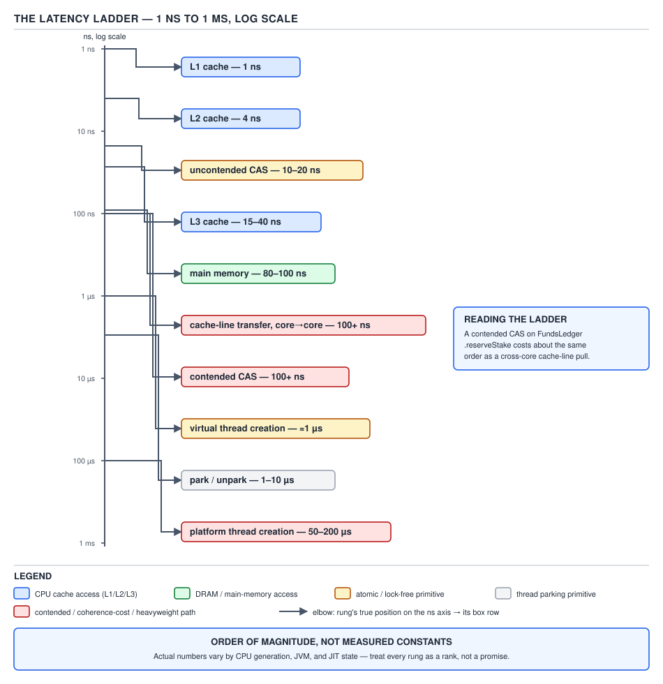
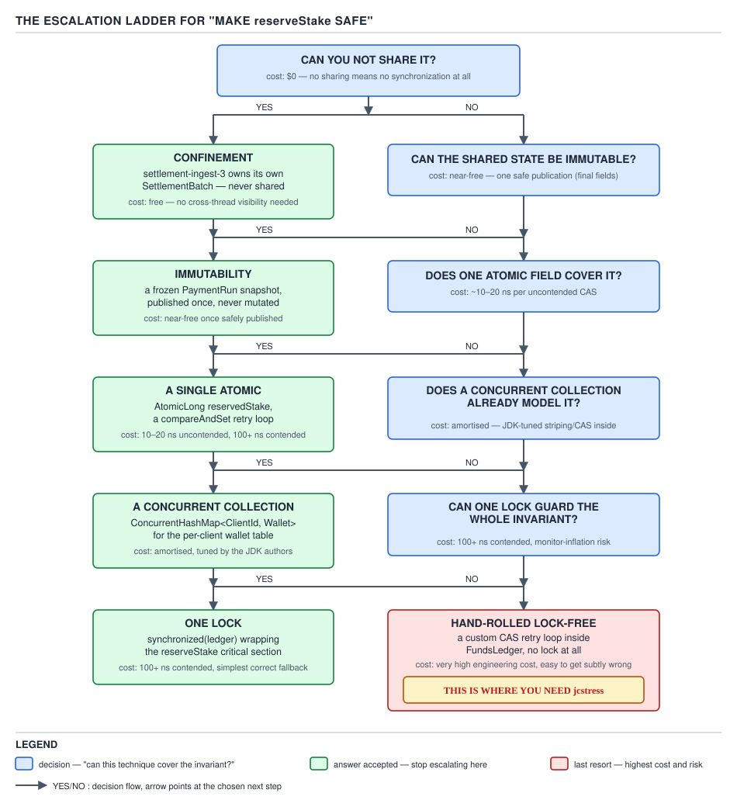

# 05 Multithreading and Concurrency — The master tables — INTERMEDIATE (§2.1)

**Target version: Java 21 LTS.** | **Part 2 of 5** | [Index](../00-index.md)
Previous: [Part 1 interview wrap-up](../90-interview-basics.md) · Next: [Contention economics](../locks/03-contention-economics.md)

This file is a lookup page, not an essay. Every number below is **order of magnitude, not a
measured constant** — hardware generation, JIT state, NUMA topology and JVM build all move these
figures by 2–5×. Two numbers have no authoritative per-instruction source at all: `park`/`unpark`
round-trip cost and platform-thread context-switch cost. Treat both as orders of magnitude only,
never quote them to a colleague as if they were benchmarked. Every table is costed against
QuizStakes' real load: 1,200 stake reservations/sec peak, 3,400 settlement/sec burst, 2.8M
reservations/day, 55k peak concurrent sessions, ~19.8M `LedgerEntry` rows/day.

---

## 2.1.1 — The master cost table

**Read this table against the latency ladder in 2.1.2, not in isolation** — "cheap" and
"expensive" below are shorthand for a specific rung on that ladder. Every one of the 21 primitive
operations named in the syllabus leaf appears once.

| Operation | Uncontended | Contended | Worst case | Blocks | Allocates | Context-switches |
|---|---|---|---|---|---|---|
| Plain field read/write | ~1 ns | ~1 ns (no coordination) | reordered/stale value, never blocks | no | no | no |
| Volatile read | ~1–4 ns (L1/L2 hit + load barrier) | same | main-memory miss ≈ 80–100 ns | no | no | no |
| Volatile write | ~1–20 ns (store + StoreLoad barrier) | same, barrier still drains store buffer | cache-line bounce ≈ 100+ ns | no | no | no |
| `synchronized` enter (thin, uncontended) | ~10–20 ns (CAS on mark word) | n/a — thin lock only exists uncontended | inflates to monitor on contention | no | no | no |
| `synchronized` enter (inflated, contended) | n/a | ~1–10 µs (park) | unbounded — priority inversion if holder is descheduled | **yes** | monitor object off-heap | **yes** |
| CAS success | ~10–20 ns | ~10–20 ns | none — succeeds first try by definition | no | no | no |
| CAS failure + retry | n/a | 100+ ns per retry (cache-line bounce), unbounded retries under heavy contention | livelock under pathological contention | no | no | no |
| `ReentrantLock.lock` uncontended | ~10–20 ns (CAS on state) | n/a | — | no | no | no |
| `ReentrantLock.lock` contended | n/a | ~1–10 µs (park via AQS queue) | unbounded wait, but FIFO-fair variant avoids starvation | **yes** | AQS `Node` per waiter | **yes** |
| `ReadWriteLock` read/write | read: ~10–20 ns if no writer held; write: same cost class as `ReentrantLock` | reads bounded by writer count, writer waits for all readers to drain | writer starvation under a constant stream of readers (non-fair mode) | **yes** (write, or read behind a held write) | AQS `Node` per waiter | **yes** (same conditions) |
| `StampedLock` optimistic read | ~1–4 ns (plain read + stamp check, no CAS at all) | same — optimistic path never blocks writers | must retry with full read-lock if writer intervened; unbounded retries under a write-heavy load | no | no | no |
| `LongAdder.increment` | ~10–20 ns (single CAS, one cell) | ~10–20 ns per thread (JVM stripes threads across `Cell[]`, so contention is diluted, not eliminated) | falls back to base-field CAS retry loop before cells expand | no | `Cell[]` grows lazily under contention | no |
| `ConcurrentHashMap.get`/`put` | get: ~10–40 ns (volatile read, no lock); put: ~20–40 ns (per-bin CAS or synchronized bin) | put on a hot bin: bin-level `synchronized`, so contention cost ≈ inflated monitor cost for that bin only | treeified bin (>8 entries) degrades to O(log n) per op | put on a hot bin can | per-bin `Node` on insert | put on a hot bin can |
| `CopyOnWriteArrayList.add` | O(n) copy of the backing array, single global lock | every writer serializes on one lock regardless of array size | O(n) copy at 2.8M appends/day is a full-array clone per append — see the Pitfall below | **yes** (write side; reads never block) | **yes** — new backing array every write | no (short critical section, not park-based at typical sizes) |
| `ArrayBlockingQueue.put`/`take` | ~10–20 ns (single lock, CAS-free ring buffer index) | ~1–10 µs when full/empty (park on `Condition`) | producer/consumer blocks until space/element exists — no allocation on the hot path | **yes**, when full/empty | no — fixed backing array, allocated once at construction | **yes**, when blocking |
| `LinkedBlockingQueue.put`/`take` | ~10–20 ns (two-lock algorithm, separate put/take locks) | lower head-of-line contention than `ArrayBlockingQueue` because put and take use different locks | blocks like `ArrayBlockingQueue` when the (optional) capacity bound is hit | **yes**, when full/empty | **yes** — one `Node` allocated per element, every `put` | **yes**, when blocking |
| `SynchronousQueue` handoff | ~1–10 µs — there is no buffer, so a `put` cannot complete until a `take` is waiting (or vice versa) | same — every operation is a rendezvous, "contention" is the normal case | producer parks until a consumer arrives; direct thread handoff, no queueing | **yes**, always, unless the other side is already waiting | no (in the common fair-mode transfer path) | **yes**, typically |
| `Executor.execute` | ~10–50 ns to enqueue onto the pool's work queue | queue insertion contends the same way the underlying queue does | rejected-execution path if the queue is bounded and full | no (submission itself) | task wrapper object | no (submission itself) |
| `CompletableFuture` stage hop | ~10–50 ns if the prior stage is already complete (runs inline on the completing thread) | async variants pay a full `Executor.execute` enqueue | `.get()` with no executor available to help can block indefinitely | `.get()`/`.join()` do | one internal completion node per stage | only if `.get()`/`.join()` block |
| Virtual-thread park/unpark | ~1 µs order of magnitude — no OS thread is blocked, only the `Continuation` is unmounted | same order — cost is dominated by carrier-thread scheduling, not a syscall | pinning (holding a monitor across `park`) forces a platform-thread-style block — see Day cross-reference below | **yes**, logically (virtual thread is BLOCKED) | `StackChunk` may grow | no OS context-switch — this is the entire point |
| Platform-thread park/unpark | ~1–10 µs order of magnitude — real syscall round trip (`futex`/`park` on the OS thread) | same order, plus scheduler queuing under load | thread migrates cores, cold caches on wake — cost can spike well past the ladder's stated range | **yes** | no | **yes**, always |

**Interview:** "Why is `LongAdder` faster than `AtomicLong` under contention?" — because `AtomicLong`
serializes 3,400 settlements/sec through one cache line's CAS, while `LongAdder` stripes threads
across an array of padded cells, turning one hot cache line into N cooler ones; `longValue()`
still has to sum every cell, so `LongAdder` trades read cost for write throughput.

---

## 2.1.2 — The latency ladder



**D-108** — The latency ladder.

Every "cheap"/"expensive" claim in this note set resolves to a rung on this ladder. Read it as
powers of ten, not as a stopwatch: L1 ≈ 1 ns, L2 ≈ 4 ns, L3 ≈ 15–40 ns, main memory ≈ 80–100 ns,
a cache-line transfer across sockets ≈ 100+ ns, uncontended CAS ≈ 10–20 ns (it is just an L1/L2-hit
CAS instruction when nobody else touches the line), contended CAS ≈ 100+ ns (the line has bounced
to another core and back), `park`/`unpark` round trip ≈ 1–10 µs, platform-thread creation ≈
50–200 µs, virtual-thread creation ≈ 1 µs. **The last four figures are the ones with no
authoritative per-instruction source** — they come from documented order-of-magnitude ranges in
JEP text and JDK engineering talks, not from a cited benchmark table, so present them exactly that
way in an interview: "on the order of a microsecond," never "1.3 µs."

**Insight:** the three-decade gap between a CAS (tens of ns) and a park/unpark (µs) is the entire
justification for spin-then-park hybrids like `StampedLock`'s optimistic read and `AbstractQueuedSynchronizer`'s
short spin before parking — spinning for a few hundred nanoseconds is cheaper than one park/unpark
round trip if the lock is about to free up anyway.

---

## 2.1.3 — The memory-footprint table

All figures assume a 64-bit JVM with compressed oops (the default under 32 GB heap) and are
**shown with the arithmetic, not asserted** — treat the totals as estimates that move with JVM
build and flags, not as ABI guarantees.

| Structure | Heap bytes | Off-heap / native bytes | Arithmetic | Where it bites QuizStakes |
|---|---|---|---|---|
| Platform thread | ~1 KB (`Thread` object: header + fields) | ~1 MB reserved stack (`-Xss` default) + JVM `JavaThread` native struct (~a few KB) + OS `task_struct` | 1 MB × N threads is address space, mostly uncommitted pages, but the JVM struct and kernel struct are real resident memory per thread | one platform thread per session at 55k peak concurrent sessions reserves ~55 GB of stack address space alone — this is *the* reason a thread-per-session model doesn't scale, independent of CPU |
| Virtual thread | a few hundred bytes at rest (`Thread` object + `Continuation` + a small `StackChunk`) | none reserved up front — the stack grows on the Java heap as `StackChunk` objects, not as a native OS stack | 55k virtual threads × ~500 B baseline ≈ 27 MB, growing only as deep call stacks demand more chunks | the same 55k peak sessions cost tens of MB instead of tens of GB — this is the number to quote when justifying a virtual-thread-per-request migration |
| `ReentrantLock` | ~48 B | none | 16 B object header (8 B mark word + 4 B compressed klass pointer, padded to the 8-byte alignment boundary) + inner `Sync` object's own 16 B header + 4 B `state` int + 4 B compressed `exclusiveOwnerThread` reference + 8 B padding to keep the object 8-byte aligned ≈ 48 B | negligible per-lock, but QuizStakes' wallet-per-client locking model means one live `ReentrantLock` per hot wallet — 380k monthly-active clients × 48 B ≈ 18 MB if every wallet held its own lock live simultaneously, which is why lock striping (a fixed pool of locks hashed by `ClientId`) is preferred over one lock per wallet |
| `AtomicLong` | ~24 B total (16 B compressed-oops header, already 8-byte aligned, + 8 B `long` value; the commonly quoted "16 B" is the pure object-header overhead paid on top of a bare `long` field) | none | 16 B overhead + 8 B payload = 24 B instance | one `AtomicLong` per `RestrictionType` counter across the platform is trivial; the number matters only when a `LongAdder` alternative is chosen instead — see next row |
| `LongAdder` with N cells | base counter ≈ 24 B (same shape as `AtomicLong`) + `Cell[]` array header (16 B) + N × 128 B padded cells | none | each `Cell` holds one 8-byte `long` but is padded out to 128 B (two cache lines wide) via `@Contended` specifically to stop false sharing between adjacent cells; N auto-tunes toward the core count under contention | on an 8-core box backing the 3,400 settlements/sec counter, the JVM grows toward ~8 cells: 8 × 128 B ≈ 1 KB total — a rounding error next to the throughput it buys versus one contended `AtomicLong` |
| `ConcurrentHashMap.Node` | ~32 B | none | 16 B header + 4 B `hash` int + 4 B compressed `key` ref + 4 B compressed `value` ref + 4 B compressed `next` ref = 32 B | a `ConcurrentHashMap<ClientId, Wallet>` cache sized for all 2.4M registered clients costs ~2.4M × 32 B ≈ 77 MB in `Node` overhead alone, before the `Wallet` payloads themselves |
| `ArrayBlockingQueue` | one backing `Object[]` sized to capacity, allocated once | none | 16 B array header + capacity × 4 B (compressed reference) — no further allocation on `put`/`take` | a 3,400-capacity bounded queue absorbing a settlement burst costs ~16 B + 3,400 × 4 B ≈ 13.6 KB, fixed for the queue's lifetime |
| `LinkedBlockingQueue` per element | one `Node` per queued element | none | 16 B header + 4 B compressed `item` ref + 4 B compressed `next` ref, padded to 24 B — allocated on every `put`, collected on every `take` | the same 3,400-deep burst churns ~3,400 × 24 B ≈ 82 KB of short-lived `Node` garbage per burst window, which `ArrayBlockingQueue` never allocates — the reason a fixed-throughput queue prefers the array-backed variant |

**Pitfall:** assuming `AtomicLong` and `LongAdder` cost the same because "they're both just a
counter." `LongAdder` is *larger* at rest (base field plus an array of padded cells) and slower to
*read* (`sum()` walks every cell), but under real contention — QuizStakes' 3,400 settlements/sec
through one shared counter — the padded-cell layout is what keeps the CAS retry rate from
collapsing throughput. Choose `AtomicLong` when reads dominate or contention is low; `LongAdder`
when writes dominate and reads are rare (a settlement counter flushed once a minute, not read on
every request).

---

## 2.1.4 — The guarantee table

This is the table that kills "`volatile` is atomic" for good: atomicity, visibility, ordering,
mutual exclusion and progress are five independent guarantees, and no single access mode grants
all five except `synchronized`.

| Mode | Atomicity | Visibility | Ordering | Mutual exclusion | Progress |
|---|---|---|---|---|---|
| Plain | no (compound ops like `i++` race; even a bare write can be torn for `long`/`double` on some JVMs, though 64-bit HotSpot writes them atomically in practice) | no — another thread may never observe the write | no — compiler and CPU may reorder freely | no | non-blocking (always makes progress, but with no guarantee anyone else sees it) |
| Opaque (`VarHandle.getOpaque`/`setOpaque`) | yes, for that single variable | eventual — no happens-before edge to other variables | none beyond program order for *this* variable; no fence relative to other memory | no | wait-free |
| Release (`VarHandle.setRelease`) | yes | prior writes by this thread become visible to a thread that later does a matching *acquire* read of the same variable | prevents this thread's preceding writes from being reordered *after* the release store | no | wait-free |
| Acquire (`VarHandle.getAcquire`) | yes | guarantees this thread sees every write that happened-before the matching release | prevents this thread's following reads/writes from being reordered *before* the acquire load | no | wait-free |
| Volatile | yes, for the single field (`i++` on a volatile `int` is still two ops and still races) | yes — full happens-before between a volatile write and every subsequent volatile read of the same field | yes — every volatile access acts as a release+acquire pair, blocking StoreLoad reordering across it | no | wait-free |
| `synchronized` | yes, for the entire critical section, not just one field | yes, at both monitor entry and exit | yes — monitor enter/exit are full bidirectional barriers | **yes** | blocking |
| `final` | n/a (immutable once construction completes) | yes, *if the reference does not escape during construction* — the JMM's final-field freeze guarantees any thread that later obtains the reference sees the correctly initialized value | yes — the freeze prevents reordering the final field's write past the constructor's return | no | n/a |

**Pitfall:** writing `volatile boolean settled;` and then doing `settled = true;` in one thread and
`if (!settled) settlementCount.incrementAndGet();` in another and believing the check-then-act is
safe because the field is volatile. Volatile buys visibility and ordering of that one read/write —
it buys nothing for the compound "check, then act" sequence, which still needs a lock, a CAS, or a
different algorithm entirely.

---

## 2.1.5 — The five progress guarantees

| Guarantee | Precise statement | JDK example | Counter-example | Effect of descheduling one thread mid-operation |
|---|---|---|---|---|
| Blocking | some thread may prevent all others from progressing indefinitely if it is descheduled while holding the resource | `synchronized`, `ReentrantLock.lock()` | — (this is the baseline) | every other thread waiting on that lock stalls until the OS reschedules the holder — the classic convoy/priority-inversion failure mode |
| Obstruction-free | a thread completes in a bounded number of steps *if it runs in isolation with no other thread taking steps*; makes no promise once a second thread is active | an optimistic retry pattern such as `StampedLock`'s optimistic-read-then-validate loop, retried with no backoff | two threads CAS-looping against each other with no backoff can livelock forever — each keeps invalidating the other's attempt, which is exactly the failure obstruction-freedom permits | if the sole active thread is descheduled, nothing else was running anyway, so no harm; but the moment a second thread becomes live, this guarantee alone provides nothing — that gap is precisely why lock-free is the next, stronger rung |
| Lock-free | at least one thread in the system always completes its operation in a bounded number of steps, *regardless* of how the OS schedules the others, even though any individual thread might be delayed indefinitely | `ConcurrentLinkedQueue.offer`/`poll` (Michael–Scott CAS-based queue); the CAS retry loop inside `AtomicInteger.incrementAndGet` | a spinlock implemented as `while (!casTryLock()) {}` is *not* lock-free — if the holder is descheduled mid-critical-section, every spinner burns CPU making zero system-wide progress | pausing one thread mid-CAS-retry never stalls the others — some other thread's CAS keeps succeeding, so total system throughput is unaffected even though the paused thread personally stalls |
| Wait-free (bounded) | *every* thread completes its operation in a bounded number of steps regardless of any other thread's scheduling — no thread ever starves | a hardware-backed single instruction such as x86 `LOCK XADD` under `AtomicLong.getAndAdd` — one instruction, no retry loop, no dependency on any other thread's progress | `AtomicInteger.accumulateAndUpdate`'s CAS-retry-until-success pattern is only lock-free — its retry count is unbounded under contention, so it fails the wait-free bar even though it never blocks | irrelevant by definition — every thread's step count is bounded independently of what happens to any other thread, descheduled or not |
| Wait-free (population-oblivious) | wait-free, *and* the step bound is a single constant independent of the number of contending threads N (an ordinary "bounded" wait-free structure may let its bound grow with N) | the same hardware `LOCK XADD` example qualifies here too — the instruction's cost does not scale with how many other cores are also issuing it | a wait-free queue built from an N-sized per-thread "helping" array (a textbook universal construction) is wait-free but its bound is a function of N, so it is wait-free-bounded without being population-oblivious | same as wait-free-bounded, with the added property that even the *number* of other live threads never changes this thread's step bound |

**[PROVE]** the strength ordering, briefly: wait-free (population-oblivious) implies wait-free
(bounded) implies lock-free implies obstruction-free implies blocking-safe-but-not-more, and each
implication is strict. Lock-free does not imply wait-free because "some thread progresses" permits
one specific thread to be perpetually the loser of every CAS race — that thread obstruction-free's
weaker promise already allowed, and lock-free adds nothing about *which* thread wins, only that
someone does. Obstruction-free does not imply lock-free for the symmetric reason: nothing in its
definition rules out two live threads perpetually invalidating each other, which is a
non-progressing system that lock-free explicitly forbids.

---

## 2.1.6 — The iterator-semantics table

**Supporting fact.** Fail-fast throws `ConcurrentModificationException` by detecting a `modCount`
mismatch on the next call to `next()`; weakly consistent walks the live structure via safely
published links and tolerates concurrent structural change without throwing; snapshot iterates a
private array reference frozen at iterator-creation time and is immune to every subsequent
mutation.

| Collection | Semantics | Exception on concurrent modification | Staleness window |
|---|---|---|---|
| `ArrayList`, `HashMap` (non-concurrent) | fail-fast | `ConcurrentModificationException`, thrown as soon as detected — not necessarily immediately | none — it throws rather than serving stale data |
| `CopyOnWriteArrayList`, `CopyOnWriteArraySet` | snapshot | never thrown | the *entire* iteration, from `iterator()` to exhaustion, sees the array exactly as it was at creation — writes during iteration are invisible to it |
| `ConcurrentHashMap` | weakly consistent | never thrown | reflects some but not necessarily all updates made during iteration; never re-reads a bucket it already passed, never throws, may or may not see a concurrently added entry |
| `ConcurrentSkipListMap`, `ConcurrentSkipListSet` | weakly consistent | never thrown | same as `ConcurrentHashMap` — traversal follows the live skip-list links |
| `ArrayBlockingQueue`, `LinkedBlockingQueue` iterators | weakly consistent | never thrown | reflects the queue's state at some point during the iteration, not necessarily the state at any single instant |

**Pitfall:** assuming `ConcurrentHashMap`'s iterator throws `ConcurrentModificationException` the
way `HashMap`'s does under concurrent structural change. It never does — the fix for "I need a
stable view" is not to catch an exception that will never come, it is to decide up front whether a
snapshot copy or tolerating weak consistency is acceptable for that read.

> **Definition:** an iterator is fail-fast if it detects concurrent structural change and throws,
> weakly consistent if it tolerates concurrent change by design and reflects some but not all of
> it, and snapshot if it is immune to concurrent change entirely because it owns a private, frozen
> copy of the structure.

---

## 2.1.7 — The escalation ladder for "make this safe"



**D-111** — The escalation ladder for "make this safe."

The root question is always "can you avoid sharing this at all?" — every rung below exists only
because the answer was no. Cost rises and applicability narrows as you descend; the right answer
is almost always the *first* rung that actually works, not the one you're most comfortable with.

| Rung | What it means | Cost | When it's the right answer for QuizStakes |
|---|---|---|---|
| 1. Confinement | never share the mutable state across threads — give each thread (or each virtual thread per request) its own copy | ~free — no synchronization at all | a per-request `StakeSplit` calculation scratch object during one `ReserveStake` call — it never needs to leave the handling thread |
| 2. Immutability | make the shared object incapable of mutation after construction, so concurrent readers need no coordination | ~free at read time; pays a copy cost every time a "change" is really a brand-new object | `Money`, `ClientId`, `StatusCode` — every value type in the domain is immutable and freely shared without a lock |
| 3. A single atomic | one `AtomicLong`/`AtomicReference`/`VarHandle` CAS protects exactly one variable | tens of ns uncontended, degrades under contention exactly as the master cost table shows | a single running counter, e.g. total stake reservations processed this minute |
| 4. A concurrent collection | `ConcurrentHashMap`, `ConcurrentLinkedQueue`, etc. — someone else has already solved the hard part for a whole structure | one CHM `get`/`put` at 10–40 ns, but no cross-key atomicity — see 2.1.4's tradeoff discipline | an in-memory `ConcurrentHashMap<ClientId, Wallet>` cache in front of the ledger, where per-key operations are all that's needed |
| 5. One lock | `ReentrantLock` or `synchronized` around an invariant that spans multiple fields or multiple map entries | µs-scale under contention, and now every other holder of that lock queues behind you | moving money between a client's cash and bonus buckets — the four-bucket wallet invariant spans fields a `ConcurrentHashMap` cannot protect atomically |
| 6. Hand-rolled lock-free | a custom CAS-retry algorithm built because nothing in the JDK fits the shape of the problem | highest engineering and review cost; easy to get subtly wrong (ABA, missed memory barrier) | reserved only for a proven, measured hot path — nothing in the QuizStakes examples used elsewhere in this note set justifies rung 6 |

**Interview:** "How do you decide between a lock and a concurrent collection?" — name the ladder:
reach for confinement or immutability first because they cost nothing, an atomic or a concurrent
collection next because the JDK has already solved and tuned them, a lock only when the invariant
spans more state than any single concurrent structure protects atomically, and hand-rolled
lock-free only when a lock is measured — not assumed — to be the bottleneck.

---

## 2.1.8 — The "which thread runs it" table

**Supporting fact.** Every asynchronous API in the JDK and Spring picks its executing thread by a
different rule, and assuming "the pool I configured" runs your code is one of the most common
mistakes in concurrent Spring services. `[X-REF]` — see this note set's executor-and-async-model
guide for the full mechanism behind `ForkJoinPool.commonPool()` sizing and work-stealing; the
one-line mechanism below is self-contained but that guide is where the "why" lives.

| API | Thread that actually runs it |
|---|---|
| `Executor.execute(task)` | a worker thread owned by that executor's pool — never the calling thread, except under a `CallerRunsPolicy` rejection handler |
| `ExecutorService.submit(task)` | the same worker-thread rule as `execute`, wrapped in a `Future` |
| `CompletableFuture` non-async stage (`thenApply`, `thenAccept`, …) | whichever thread completes the *previous* stage — if the prior stage is already done when you chain, it runs inline on the calling thread; otherwise it runs on whatever thread triggers that completion |
| `CompletableFuture` `...Async` (no executor argument) | `ForkJoinPool.commonPool()` |
| `CompletableFuture` `...Async(executor)` | exactly the executor you passed, and nothing else |
| Parallel stream (`.parallelStream()`) | `ForkJoinPool.commonPool()`, splitting work across its workers; the initiating thread also participates as one of the workers |
| `ConcurrentHashMap` bulk op (`forEach`, `search`, `reduce` with a `parallelismThreshold`) | the *calling* thread alone if the map is smaller than the threshold; `ForkJoinPool.commonPool()` workers above it |
| `ScheduledExecutorService` | one of that scheduler's own worker threads, at or after the scheduled delay — never the thread that called `schedule` |
| `StructuredTaskScope.fork(task)` | a new virtual thread per forked task by default |
| Spring `@Async` | the configured `TaskExecutor` — `SimpleAsyncTaskExecutor` (a new thread per call, no pooling) unless the application explicitly wires a pooled `TaskExecutor` bean |

**Pitfall:** assuming `CompletableFuture.supplyAsync(supplier).thenApply(fn)` runs `fn` on the same
custom executor passed to `supplyAsync`. It does not — the non-async `thenApply` runs wherever the
prior stage happened to complete, which is `ForkJoinPool.commonPool()` if no executor was given to
`supplyAsync`, or the calling thread if the future was already done. Pin every stage's thread
explicitly with `thenApplyAsync(fn, executor)` when it matters which pool runs it — for example,
when a stage does blocking I/O against the identity-vendor call and must not starve the shared
`ForkJoinPool.commonPool()` that every parallel stream in the process also depends on.

---

## Pitfalls

### Assuming `AtomicLong` and `volatile long` give the same guarantees

**Wrong**
```java
private volatile long settlementCount = 0;

void onSettlement() {
    settlementCount++; // read-modify-write: volatile does not make this atomic
}
```
Under QuizStakes' 3,400 settlements/sec burst, this races: two threads can both read the same
value, both increment locally, and both write back the same result, silently losing a count.

**Right**
```java
private final LongAdder settlementCount = new LongAdder();

void onSettlement() {
    settlementCount.increment(); // internally CAS-based, no lost updates
}
```
`volatile` guarantees every thread sees the latest *published* value of the field — it says
nothing about a compound read-modify-write sequence performed against that value.

**Why people believe it:** `volatile` is taught alongside "thread safety" so often that the word
"atomic" gets attached to it by association, even though the JLS guarantee it actually grants is
visibility and ordering, not atomicity of anything beyond a single read or a single write.

### Assuming `ConcurrentHashMap` iteration throws like `HashMap`'s does

**Wrong**
```java
for (Wallet w : walletCache.values()) {
    if (shouldEvict(w)) {
        walletCache.remove(w.clientId()); // "this will throw CME, right?"
    }
}
```
It never throws — the loop silently runs to completion with a weakly consistent view, which is
easy to mistake for correctness when it is actually just the absence of a guard rail.

**Right**
```java
walletCache.values().removeIf(ClientMasterTables::shouldEvict);
```
`removeIf` is designed for exactly this and avoids the reader ever having to reason about what a
concurrent structural change mid-iteration does to a hand-rolled loop.

**Why people believe it:** every other iterator most Java engineers touch daily (`ArrayList`,
`HashMap`) is fail-fast, so the absence of an exception reads as "it must be safe" rather than as
"this iterator was designed never to throw one."

---

## Cheat sheet

| Ask yourself | Table to open |
|---|---|
| "Is this operation cheap or expensive?" | 2.1.1 master cost table, cross-checked against 2.1.2's ladder |
| "How many bytes does adding one more of these cost me?" | 2.1.3 memory-footprint table |
| "Does `volatile`/`synchronized`/`final` actually give me atomicity here?" | 2.1.4 guarantee table |
| "Can this data structure starve a thread?" | 2.1.5 progress-guarantee table |
| "Will this iterator throw, or just quietly go stale?" | 2.1.6 iterator-semantics table |
| "What's the cheapest fix that actually works?" | 2.1.7 escalation ladder |
| "Which thread pool actually runs my callback?" | 2.1.8 which-thread-runs-it table |
| Any number quoted above without "order of magnitude" attached | it's wrong — say so and restate it as a range |

---

## Self-test

**Q1.** Why is `LongAdder.increment()` uncontended cost roughly the same as `AtomicLong.incrementAndGet()`, but the two diverge sharply under contention?

<details><summary>Answer</summary>

Uncontended, both do a single CAS on one cache line, so the cost is the same order of magnitude
(~10–20 ns). Under contention, `AtomicLong` still serializes every thread onto that one line, so
each CAS attempt bounces the line between cores at ~100+ ns and retries pile up. `LongAdder`
stripes threads across a `Cell[]` array once contention is detected, so each thread mostly CASes
its own cell — contention drops from "everyone against one line" to "everyone against roughly
core-count lines," which is why it scales better at 3,400 settlements/sec.

</details>

**Q2.** A `ReentrantLock` instance costs ~48 B. Why is that number not "the cost of thread safety" for a wallet, and what's the actual capacity risk?

<details><summary>Answer</summary>

48 B is the cost of one *idle* lock object — it says nothing about contention cost, which is the
real driver of throughput. The capacity risk is holding one live `ReentrantLock` per wallet: at
380k monthly-active clients that's only ~18 MB, which sounds fine, but the real cost is
operational — one lock per wallet means no way to bound the number of distinct locks live at once,
which is why a fixed-size striped lock pool (hash `ClientId` into a small fixed array of locks) is
preferred over "new lock per wallet."

</details>

**Q3.** Name a JDK operation that is lock-free but not wait-free, and explain the gap using the progress table.

<details><summary>Answer</summary>

`AtomicInteger.accumulateAndUpdate` (and any of the CAS-retry-loop update methods). It is
lock-free because the system as a whole always makes progress — some thread's CAS succeeds on
every round — but it is not wait-free because a single unlucky thread can have its CAS invalidated
by others indefinitely, so its own personal step count has no fixed bound. Wait-free requires that
bound to exist for *every* thread, not just for the system in aggregate.

</details>

**Q4.** Why does the memory-footprint table say `ArrayBlockingQueue` allocates nothing on `put`/`take` while `LinkedBlockingQueue` allocates a `Node` on every `put`?

<details><summary>Answer</summary>

`ArrayBlockingQueue` is backed by one fixed-size `Object[]` allocated once at construction; `put`
and `take` just move ring-buffer indices and store/load references into existing array slots.
`LinkedBlockingQueue` is a linked list under the hood, so every `put` allocates a fresh `Node` to
hold the new element and every `take` lets one become garbage — at a 3,400-deep settlement burst
that's tens of kilobytes of short-lived allocation the array-backed queue simply never produces.

</details>

**Q5.** Why can't `volatile` alone protect the four-bucket wallet invariant (cash available, cash reserved, bonus available, bonus reserved) during a stake reservation?

<details><summary>Answer</summary>

`volatile` guarantees visibility and ordering for each *individual* field access, but reserving a
stake has to move money across two of the four buckets (draw from bonus first, then cash) as one
atomic unit — a reader could observe the intermediate state where bonus has been debited but cash
has not yet been touched. That is a multi-field invariant, which per the escalation ladder (2.1.7)
needs at minimum rung 5, a lock, because no single-field mechanism can make a two-field update
atomic.

</details>

**Q6.** A `StampedLock` optimistic read never blocks and never allocates. What guarantee level does it sit at, and what closes the gap between that guarantee and correctness?

<details><summary>Answer</summary>

The optimistic-read-then-validate pattern sits at obstruction-free, not lock-free or higher — it
makes no progress promise once a writer is concurrently active, and repeated invalidation without
backoff can in principle stall it. What closes the gap to correctness (not to a *stronger*
progress guarantee) is the mandatory `validate()` call after reading: if validation fails, the
caller must fall back to a full pessimistic read lock, which is where the actual safety guarantee
comes from.

</details>

**Q7.** Why is platform-thread creation cost (50–200 µs) presented as a range rather than a number, unlike, say, an uncontended CAS?

<details><summary>Answer</summary>

Thread creation cost is dominated by OS-level work — allocating and mapping a ~1 MB stack,
registering the thread with the kernel scheduler, initializing the JVM's native `JavaThread`
structure — all of which vary with OS, JVM flags, and system load in ways a CAS instruction's cost
does not. The CAS cost is close to a hardware constant (one cache-line-local atomic instruction);
thread creation is a multi-step OS interaction with no single dominant, stable cost, so it is
quoted and must be discussed as an order-of-magnitude range.

</details>

**Q8.** Using the escalation ladder, justify why a `ConcurrentHashMap<ClientId, Wallet>` cache is the right rung for a read-heavy wallet lookup cache, but the wrong rung for the reservation invariant itself.

<details><summary>Answer</summary>

The cache is a single-key-at-a-time lookup/replace operation — exactly what rung 4 (a concurrent
collection) is built for, and it gets `ConcurrentHashMap`'s per-bucket concurrency for free. The
reservation invariant spans multiple fields of one wallet atomically (see Q5) — no per-key
operation on a `ConcurrentHashMap` can make a multi-field mutation atomic, so the invariant itself
has to escalate to rung 5, a lock, even though the surrounding lookup structure stays at rung 4.

</details>

---

**Leaves covered:** 2.1.1–2.1.8 (8 leaves)
**Leaves deferred:** none
**Diagrams included:** D-107, D-108, D-109, D-110, D-111
**Target version:** Java 21 LTS
**Lines:** 414
