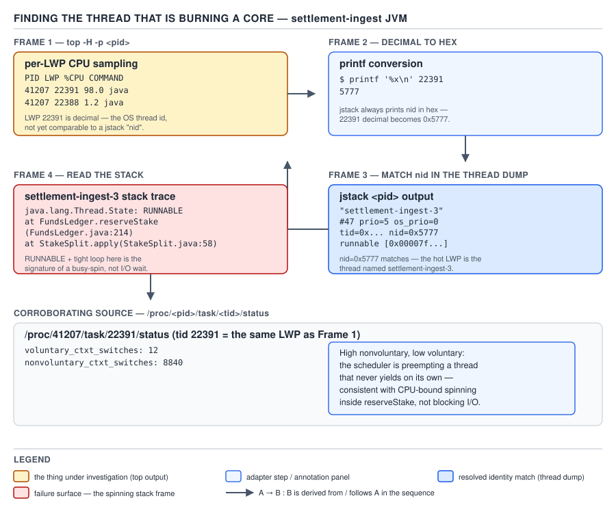

# 05 Multithreading and Concurrency — Runtime observability: profiling, metrics and limits — INTERNALS (§3.13, leaves 3.13.8–3.13.12)

**Target version: Java 21 LTS.** | **Part 3 of 5** | [Index](../00-index.md)
Previous: [Dumps and JFR](02-internals-runtime-observability.md) · Next: [Part 3 interview wrap-up](../92-interview-internals.md)

The prior file caught the `FundsLedger` monitor contention with a dump and confirmed it in JFR.
This file continues the same incident down two more paths — profiling the *shape* of blocking time
across the whole settlement pool, and exporting metrics so nobody has to catch the next episode by
hand — then builds a small diagnostic yourself before ending on the hard limit every tool in both
files shares: none of them can see a data race.

### async-profiler for lock and off-CPU analysis

**Mental model.** A CPU-time profiler (`-e cpu` or `-e itimer`) samples where threads are
*executing*; it has nothing to say about a thread that is `BLOCKED` or parked, because a blocked
thread is, by definition, not consuming CPU to be sampled. async-profiler's `-e lock` and `-e wall`
modes exist specifically to sample the *other* dimension: time spent waiting, not time spent
running.

**Why it exists.** The `FundsLedger` incident is a textbook case where a CPU profiler is the wrong
tool: eleven of the twelve involved threads are `BLOCKED`, spending zero CPU, and would be
completely invisible to a CPU flamegraph. Only the twelfth thread, actually inside
`CardPspClient.authorise`, would show up — making the problem look like a slow PSP call in
isolation, hiding the fact that eleven other threads are queued behind it.

**When to reach for `-e lock` versus `-e wall`, `[RESEARCH]` verified against async-profiler's
current documented event names.** `-e lock` (backed by JFR's own monitor-enter instrumentation
path) samples contended lock acquisitions specifically — closest to directly answering "which lock,
held by whom, for how long." `-e wall` samples *all* threads at wall-clock intervals regardless of
their state — running, blocked, parked, or in native code — giving a true off-CPU-inclusive picture
at the cost of being less lock-specific than `-e lock`.

**How it works, applied to the incident.**

```
$ ./profiler.sh -d 30 -e lock -f settlement-lock.html 84213
```

A 30-second `-e lock` capture during the contention window produces a flamegraph whose widest frame
under `FundsLedger.reserveStake` is time spent waiting to enter the monitor, attributed to the
`settlement-ingest-N` call stacks — visually surfacing exactly the pattern the dump's repeated
address already proved, but aggregated over the whole window instead of one instant.

**The gotcha.** Running a default CPU profile (`-e cpu`) against this same incident and concluding
"the PSP call is the only hot spot, everything else looks idle" is a correct reading of a CPU
profiler applied to a blocking problem — and a wrong diagnosis, because "idle" here means "blocked,"
not "fine."

> **Definition:** a CPU profiler samples running threads; `-e lock`/`-e wall` sample blocked or
> off-CPU time specifically — for any hang, contention, or pool-idleness symptom, a CPU profiler
> showing "nothing" is not evidence of nothing happening, it is evidence of looking at the wrong
> axis.

### Micrometer and JMX metrics worth exporting

**Mental model.** Dumps and JFR are pull-based, point-in-time or session-scoped tools an operator
reaches for during an incident. Metrics are the always-on baseline that tells you *when* to reach
for them — a dashboard panel crossing a threshold is what pages someone, long before anyone thinks
to run `jstack`.

**Why these specific metrics, `[RESEARCH]` verified against Micrometer's reference documentation
for the `ExecutorServiceMetrics` and JVM thread binders.** `ExecutorServiceMetrics` instruments a
`ThreadPoolExecutor` (the settlement pool) directly, and the JVM thread metrics come from
`ThreadMXBean` underneath a thin Micrometer binder — the same source the next section's hand-rolled
reporter reads from directly.

**When to export which.** Pool-scoped metrics (`executor.*`) answer "is this specific pool healthy";
JVM-wide thread metrics (`jvm.threads.*`) answer "is the JVM's thread population as a whole
behaving," which matters when multiple pools or a leak of ungoverned threads could be involved.

**The metric set, `[X-REF 20]`.**

| Metric | Source | What it tells you at a glance |
|---|---|---|
| `jvm.threads.live` | `ThreadMXBean.getThreadCount()` | Current total platform thread count across the whole JVM |
| `jvm.threads.daemon` | `ThreadMXBean.getDaemonThreadCount()` | How many of those are daemon threads |
| `jvm.threads.peak` | `ThreadMXBean.getPeakThreadCount()` | High-water mark since JVM start or last reset — catches transient spikes a point-in-time gauge misses |
| `jvm.threads.states` (tagged by state) | `ThreadMXBean.getThreadInfo()` per-thread state, aggregated | A time series of the BLOCKED count specifically — this is the metric that would have shown the `FundsLedger` incident rising *before* anyone ran a manual dump |
| `executor.queued` | `ExecutorServiceMetrics` wrapping the settlement `ThreadPoolExecutor`'s queue | How many `PaymentRun` tasks are waiting for a free worker — the direct signal for pool saturation (prior file, §3.13.2) |
| `executor.active` | Same, `getActiveCount()` | How many workers are currently executing a task |
| `executor.completed` | Same, `getCompletedTaskCount()`, exported as a counter | Throughput over time — a flat line while `executor.queued` climbs is the saturation signature in metric form |
| `executor.queue.remaining` | Same, `getQueue().remainingCapacity()` | Headroom before the bounded queue (`queues/01`) starts rejecting |
| `executor.seconds` | Same, task execution time as a `Timer` | Per-task latency distribution — a rising p99 here, correlated with a flat `executor.active`, points back at contention rather than raw overload |

**The gotcha.** `jvm.threads.states` tagged `blocked` climbing on its own, without
`executor.queued` also climbing, is the metric-level fingerprint of monitor contention specifically
— saturation would show both climbing together, since saturation means workers are busy *and* the
queue backs up, while contention means workers are stuck *and* the queue backs up because nothing
is draining it, which look similar on `executor.queued` alone but diverge on the blocked-thread
count.

> **Definition:** `executor.*` metrics describe one pool's health from the outside;
> `jvm.threads.states` describes the whole JVM's thread population by state — together they are the
> continuously-sampled version of what a manual dump captures once, on demand.

### `ThreadMXBean` contention monitoring, built

**Mental model.** Everything a dump shows about *why* a thread is blocked is also available
programmatically, live, without spawning a subprocess or parsing dump text — `ThreadMXBean` is the
management API the dump tools themselves are built on.

**Why it exists.** Not every environment can shell out to `jstack`/`jcmd` — a sandboxed container,
a restricted-permission runtime, or a case where the diagnostic needs to run *inside* the same JVM
process and export structured data rather than text. `ThreadMXBean` gives programmatic access to
the same information.

**When to reach for it, and when not.** Reach for it to build an always-on, in-process top-N-blocked
reporter — exactly what follows — or for a health-check endpoint. Do not reach for it as a
replacement for `jstack`/JFR during an actual incident; a one-shot manual dump remains faster to
produce and read for a human under pressure.

**`[BUILD]` A complete, compiling top-N-blocked reporter.**

```java
package com.quizstakes.diagnostics;

import java.lang.management.ManagementFactory;
import java.lang.management.ThreadInfo;
import java.lang.management.ThreadMXBean;
import java.util.Comparator;
import java.util.List;
import java.util.stream.Collectors;

/**
 * Reports the top-N threads currently spending the most cumulative time
 * BLOCKED on a monitor, ranked by ThreadMXBean's own contention counters.
 * Used to catch the FundsLedger settlement pool contention pattern (prior
 * file, §3.13.1) without shelling out to jstack.
 */
public final class TopBlockedThreadsReporter {

    private final ThreadMXBean threadMxBean = ManagementFactory.getThreadMXBean();

    public TopBlockedThreadsReporter() {
        if (!threadMxBean.isThreadContentionMonitoringSupported()) {
            throw new IllegalStateException("Thread contention monitoring not supported on this JVM");
        }
        // Off by default: enabling this adds overhead to every monitor
        // enter/exit for the lifetime of the JVM, not just during this report.
        threadMxBean.setThreadContentionMonitoringEnabled(true);
    }

    public record BlockedThreadSummary(String threadName, long blockedCount, long blockedTimeMillis,
                                        String lockName, String lockOwnerThreadName,
                                        List<String> topFrames) {
    }

    public List<BlockedThreadSummary> topNBlocked(int n) {
        long[] allThreadIds = threadMxBean.getAllThreadIds();
        ThreadInfo[] infos = threadMxBean.getThreadInfo(allThreadIds, 8);

        return java.util.Arrays.stream(infos)
                .filter(info -> info != null && info.getBlockedTime() >= 0)
                .sorted(Comparator.comparingLong(ThreadInfo::getBlockedTime).reversed())
                .limit(n)
                .map(this::toSummary)
                .collect(Collectors.toList());
    }

    private BlockedThreadSummary toSummary(ThreadInfo info) {
        List<String> frames = java.util.Arrays.stream(info.getStackTrace())
                .limit(4)
                .map(StackTraceElement::toString)
                .collect(Collectors.toList());
        return new BlockedThreadSummary(
                info.getThreadName(),
                info.getBlockedCount(),
                info.getBlockedTime(),
                info.getLockName(),
                info.getLockOwnerName(),
                frames);
    }
}
```

Applied to the `FundsLedger` incident, `topNBlocked(3)` returns `settlement-ingest-7` (and its ten
siblings) with `lockName` reporting the `FundsLedger` monitor's identity string and
`lockOwnerThreadName` reporting `"settlement-ingest-3"` directly — the same fact the dump's
`- waiting to lock` / `- locked` pair proved, but as structured data a monitoring system can alert
on.

**The overhead, honestly.** `setThreadContentionMonitoringEnabled(true)` instruments every monitor
enter and exit JVM-wide for as long as it stays enabled, not just during a single report call — an
always-on cost, order-of-magnitude comparable to running with `-e lock` profiling permanently
attached. It is appropriate to enable briefly, on demand, or in an environment that has already
budgeted for it; enabling it as an unconditional startup default on a latency-sensitive path like
`FundsLedger.reserveStake` is the kind of choice that needs its own sizing test, not an assumption.

**Diff vs the real one.**

| Aspect | This `ThreadMXBean` reporter | A production APM (contention view) |
|---|---|---|
| Data source | `ThreadMXBean` polled on demand | Continuous JFR/bytecode-instrumentation stream, same or lower overhead |
| Historical trend | None — one snapshot per call | Full time series, retained and queryable |
| Cross-service correlation | None — this JVM only | Distributed trace correlation across `FundsLedger`, the PSP client, and upstream callers |
| Symbolication | Raw `StackTraceElement` list | Deduplicated, aggregated flamegraphs across many samples |
| Alerting | None — the caller must wire it up | Built-in thresholds, anomaly detection, paging integration |
| Overhead model | All-or-nothing JVM-wide flag | Often adaptive sampling, tunable per-instrumentation-point |
| Safe to leave always-on | Only after measuring the specific workload's tolerance | Designed for always-on production use |

**The gotcha.** This reporter answers "who is blocked right now" correctly, but says nothing about
whether the blocking is *new* — a thread with a high cumulative `blockedTime` from an hour ago that
recovered five minutes ago still ranks near the top unless the counters are reset
(`threadMxBean.resetPeakThreadCount()` resets a different counter; there is no built-in reset for
per-thread blocked time short of restarting monitoring).

> **Definition:** `ThreadMXBean`'s contention counters give the same lock-identity and
> blocked-duration facts a dump shows, accessible programmatically at the cost of an always-on
> JVM-wide instrumentation flag while enabled — a real building block, not a drop-in APM
> replacement.

### `/proc/<pid>/task/<tid>/status` and per-thread context switches

**Mental model.** Everything covered so far is the JVM's own view of a thread. The kernel keeps a
separate, independent ledger for the same OS thread — how many times it was scheduled off the CPU
voluntarily (it blocked or yielded) versus involuntarily (its time slice ran out or a higher-
priority thread preempted it) — and that ledger is the deciding evidence between "this thread keeps
losing the CPU because it keeps blocking" and "this thread keeps losing the CPU because the machine
is oversubscribed."

**Why it exists as a separate source.** The JVM does not track OS-level scheduling statistics
itself; the kernel does, and exposes them per-task under `/proc`. `[X-REF 11]`

**When to reach for it.** After `nid`-to-`top -H` (prior file, §3.13.5) has already identified which
OS thread is hot or thrashing, to distinguish CPU-bound work from scheduling contention as the root
cause of a thread's slowness.

**How it works.** Using the decimal `tid` from the same `top -H` row the prior file used (`20014`):

```
$ cat /proc/84213/task/20014/status | grep -E 'ctxt_switches|State'
State:	R (running)
voluntary_ctxt_switches:	142
nonvoluntary_ctxt_switches:	38914
```

A `nonvoluntary_ctxt_switches` count that dwarfs `voluntary_ctxt_switches` this much, for a thread
also showing 97% CPU in `top -H` and `RUNNABLE` in the dump, points at CPU oversubscription on the
host — the thread is being preempted by time-slice exhaustion, not choosing to yield — rather than
at application-level blocking, which would instead show a high *voluntary* count from repeated
`park`/`wait` calls. Cross-reference: this is the same `settlement-ingest-3` from the prior file's
§3.13.5, and this reading rules out "it is slow because it keeps blocking on something" for this
specific thread.



**D-197 (re-embedded)** — the same loop as the prior file, now read for its final frame: `top -H`
gives a decimal LWP, convert to hex, match `nid=0x…` in the dump, read that thread's stack, then
take the *original decimal* LWP id back to `/proc/<pid>/task/<tid>/status` for the voluntary and
involuntary context-switch counts shown above.

**The gotcha.** The join key is the **decimal** `tid` (matching `top -H`'s decimal LWP column), not
the dump's hex `nid` — the same decimal-versus-hex trap as the prior file's §3.13.5, in the opposite
direction this time: forgetting to convert *back* from hex when going from the dump to `/proc`.

> **Definition:** `/proc/<pid>/task/<tid>/status`'s voluntary/involuntary context-switch counters
> are the kernel's independent record of why a thread lost the CPU, joined to the Java-level thread
> by the same `nid`/`tid` identity used to reach `top -H` in the first place.

### What none of these tools can show you: a data race

**Mental model.** Every tool in this file and the prior one — dumps, JFR, profilers, metrics,
`ThreadMXBean`, `/proc` — observes *scheduling and blocking*: who is waiting, for how long, on
what. A data race is not a scheduling event at all; it is two threads accessing the same
unsynchronized memory location, at least one a write, with no happens-before edge between them.
Nothing about that requires either thread to ever block, wait, or even overlap in wall-clock time
in a way any dump would capture.

**Why none of the above tools help, `[TRAP]`.** A dump shows stacks and lock state — a racing
thread holds no relevant lock (that is the definition of the bug) and may be `RUNNABLE` the entire
time, indistinguishable from correct code. JFR's monitor events require a monitor to be involved;
an unsynchronized field read/write triggers none of them. A CPU or wall-clock profiler shows time
spent, not correctness — a race can execute in nanoseconds and never appear anomalous in timing at
all. Metrics aggregate counts and durations, not memory-visibility facts. The bug can even be
non-reproducing under the exact conditions being observed, because adding *any* instrumentation
(a debugger, a profiler agent, sometimes even `-verbose:gc`) can shift timing enough to hide it —
the classic "heisenbug" property of races.

**What does find them.** `jcstress` (the JCStress harness) is purpose-built: it runs many short
concurrent scenarios under deliberately adversarial thread interleavings and statistically forces
races to manifest, then checks observed results against the JMM's allowed outcomes. A dedicated
race detector (ThreadSanitizer-style tooling exists for native code; the JVM ecosystem leans more on
`jcstress` and static analysis) instruments memory accesses directly rather than observing
scheduling. Absent either, the remaining tool is **reasoning about the code** — proving every shared
mutable field has a happens-before edge on every access, the discipline the rest of Part 1 and
Part 2 of this topic set (`synchronized/`, `volatile-and-jmm/`) exist to teach.

**Interview:** asked "how would you find a race in production," the answer that scores is naming
the *category* of tool (a stress harness applying deliberate interleaving pressure, or careful JMM
reasoning) and explicitly stating that dumps/profilers/metrics are the wrong category — not
proposing "run `jstack` a few more times."

**The gotcha, tied back to the running incident.** A `FundsLedger` implementation that *replaced*
its `synchronized` block with an unsynchronized field write "because the dump showed contention and
we wanted it gone" would make every tool in both files report a healthier-looking system — no
`BLOCKED` threads, no `jdk.JavaMonitorEnter` events, lower `executor.seconds` — while silently
introducing a data race on the ledger balance. Every signal these two files have taught how to read
would say "fixed"; only correctness reasoning or `jcstress` would say otherwise.

> **Definition:** a data race is a correctness property about memory visibility, not a scheduling
> event — every tool in these two files observes scheduling, blocking, or timing, so none of them
> can detect one; only a stress harness like `jcstress` or direct reasoning about happens-before
> edges can.

## Pitfalls

### Diagnosing a blocking problem with a CPU profiler

**Wrong**
```
$ ./profiler.sh -d 30 -e cpu -f check.html 84213
```
Concluding, from a flamegraph where eleven `settlement-ingest-N` threads barely appear, that "those
threads are idle and not part of the problem."

**Right**
```
$ ./profiler.sh -d 30 -e lock -f check-lock.html 84213
```
or `-e wall` for a fully off-CPU-inclusive view — a `BLOCKED` thread spends zero CPU by definition,
so it is invisible to `-e cpu`/`-e itimer` sampling regardless of how central it is to the incident.

**Why people believe it:** CPU profiling is the default, most familiar profiling mode, and its
output looks complete — a flamegraph with real frames and real percentages — giving no visual cue
that an entire class of threads was excluded from consideration by construction.

### "Fixing" contention by removing synchronization and trusting the tools to confirm it

**Wrong**
```java
// Before: contended, but correct.
synchronized void reserveStake(ClientId clientId, Money amount) {
    balance = balance.minus(amount);
}
// After "fixing the contention we saw in jstack":
void reserveStake(ClientId clientId, Money amount) {
    balance = balance.minus(amount); // no lock at all now
}
```
Declaring victory because a follow-up dump shows zero `BLOCKED` threads and JFR shows zero
`jdk.JavaMonitorEnter` events for `FundsLedger`.

**Right**
Shrink or shard the critical section (move the PSP call outside the lock, or partition the ledger
by wallet) so the lock is still held, just for less time or less often — then re-verify correctness
with `jcstress` or explicit happens-before reasoning, not merely with the absence of blocking
symptoms.

**Why people believe it:** every tool this pair of files teaches reports "healthier" after removing
synchronization, because all of them measure blocking and scheduling, not memory-visibility
correctness — there is no dump line or JFR event that says "this is now a data race."

## Cheat sheet

| Fact | Value / detail |
|---|---|
| async-profiler for blocking | `-e lock` (contended monitors) or `-e wall` (all off-CPU time); `-e cpu` shows nothing useful |
| Key Micrometer pool metrics | `executor.queued`, `executor.active`, `executor.completed`, `executor.queue.remaining`, `executor.seconds` |
| Key Micrometer JVM metrics | `jvm.threads.live/daemon/peak/states` |
| Contention fingerprint in metrics | `jvm.threads.states{blocked}` rising without `executor.queued` also rising the same way |
| `ThreadMXBean` contention monitoring | Must call `setThreadContentionMonitoringEnabled(true)`; instruments every monitor enter/exit JVM-wide while on |
| `ThreadMXBean` vs a production APM | No history, no cross-service correlation, no built-in alerting — a building block, not a replacement |
| `/proc/<pid>/task/<tid>/status` join key | Decimal `tid`, matching `top -H`'s decimal LWP, not the dump's hex `nid` |
| Voluntary vs involuntary context switches | Voluntary = the thread blocked/yielded itself; involuntary = preempted by the scheduler (oversubscription signal) |
| What finds a data race | `jcstress`, a dedicated race detector, or happens-before reasoning — never a dump, JFR, or a profiler |
| Why races evade all of these tools | They observe scheduling/blocking/timing; a race is a memory-visibility fact with no scheduling signature |

## Self-test

**Q1.** Why does a CPU profiler (`-e cpu`) show nothing useful for the `FundsLedger` contention
incident, and which async-profiler modes should be used instead?

<details><summary>Answer</summary>

Eleven of the twelve involved threads are `BLOCKED`, consuming zero CPU while queued for the
monitor — a CPU-time sampling profiler only samples threads that are actually running, so it never
samples them at all. `-e lock` samples contended lock acquisitions specifically and would show the
wait time attributed to `FundsLedger.reserveStake`; `-e wall` samples all threads regardless of
state (running, blocked, or parked) and would show the same threads' off-CPU time as part of a
complete wall-clock picture.

</details>

**Q2.** A dashboard shows `jvm.threads.states{blocked}` climbing while `executor.queued` stays flat
near zero. What does that combination indicate, and how would it look different under pool
saturation instead?

<details><summary>Answer</summary>

It indicates monitor contention rather than saturation: workers are stuck waiting to enter a lock
(raising the blocked-thread count) but new tasks are still being pulled off the queue about as fast
as they arrive, so the queue itself does not grow. Under saturation, workers are busy but not
blocked, so `jvm.threads.states{blocked}` would stay low while `executor.queued` climbs because
tasks are arriving faster than the (fully occupied) workers can drain them — the two metrics
diverge in opposite ways for the two failure modes even though both look like "the pool isn't
keeping up" from throughput alone.

</details>

**Q3.** Why does `ThreadMXBean.setThreadContentionMonitoringEnabled(true)` need to be treated as a
deliberate, measured decision rather than a default to leave on?

<details><summary>Answer</summary>

It instruments every monitor enter and exit JVM-wide for as long as it is enabled, not just during
the moment a report is generated — it is an always-on cost, comparable in kind to running a lock
profiler continuously. For a latency-sensitive hot path like `FundsLedger.reserveStake` at burst
load, that overhead needs to be measured and budgeted for deliberately rather than assumed
acceptable, which is why it defaults to off and requires an explicit opt-in call.

</details>

**Q4.** A thread shows very high `nonvoluntary_ctxt_switches` and very low `voluntary_ctxt_switches`
in `/proc/<pid>/task/<tid>/status`, alongside high CPU usage in `top -H`. What does that combination
suggest, and what would the opposite pattern suggest?

<details><summary>Answer</summary>

High involuntary, low voluntary switches alongside high CPU usage suggests the thread is being
preempted by time-slice exhaustion or contention for CPU from other threads/processes on an
oversubscribed host — it wants to keep running but keeps getting kicked off the core, not because
it chose to block. The opposite pattern — high voluntary, low involuntary — would suggest the
thread is repeatedly blocking or yielding itself (frequent `park`/`wait`/lock-acquisition waits),
pointing at application-level contention rather than host-level CPU oversubscription.

</details>

**Q5.** A `FundsLedger`-guarded critical section is rewritten to remove its `synchronized` block
because dumps and JFR "showed contention that we wanted gone," replacing it with an unsynchronized
field write. Every tool in this pair of files now reports a healthier system. Is the system
actually fixed?

<details><summary>Answer</summary>

Not necessarily, and quite possibly the opposite. Removing synchronization removes the mutual
exclusion and happens-before edges that made concurrent writes to the ledger balance safe; it also
removes every symptom these tools can see — no `BLOCKED` threads, no `jdk.JavaMonitorEnter` events,
better-looking latency metrics — because all of them observe scheduling and blocking, not
memory-visibility correctness. The change may have introduced a data race, which none of dumps,
JFR, profilers, or metrics can detect; only `jcstress` or direct happens-before reasoning about the
new code can confirm whether it is actually correct.

</details>

**Q6.** What is the one-line answer an interviewer is listening for when they ask "how would you
find a data race in production"?

<details><summary>Answer</summary>

Naming the right category of tool — a deliberate-interleaving stress harness like `jcstress`, or
careful reasoning about happens-before edges over the shared mutable state — while explicitly
stating that dumps, JFR, profilers, and metrics are the wrong category, because all of them observe
scheduling and blocking rather than memory-visibility correctness. Proposing to "run `jstack` more"
or "check the metrics" signals a misunderstanding of what a data race actually is.

</details>

---

**Leaves covered:** 3.13.8–3.13.12 (5 leaves)
**Leaves deferred:** none
**Diagrams included:** D-197
**Target version:** Java 21 LTS
**Lines:** 380
