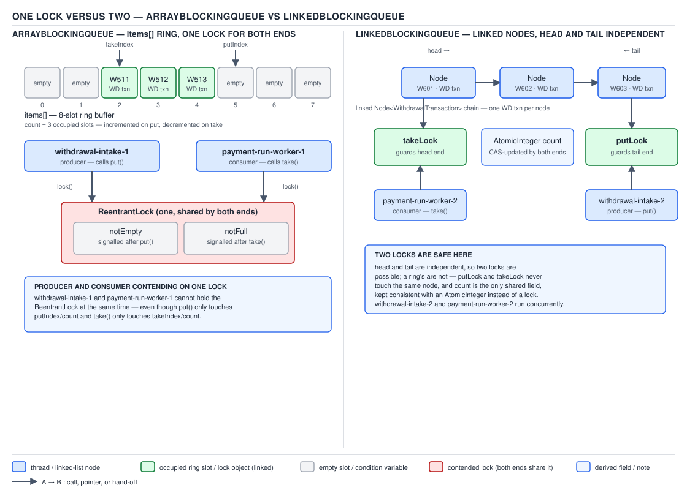
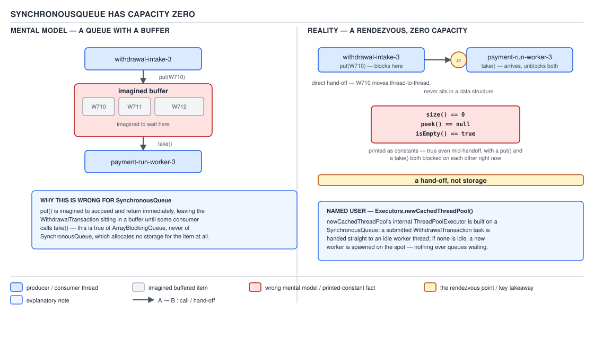
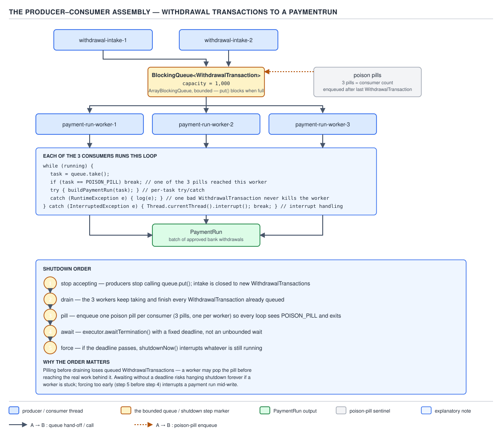

# 05 Multithreading and Concurrency — BlockingQueue and producer–consumer — BASICS (§1.17)

**Target version: Java 21 LTS.** | **Part 1 of 5** | [Index](../00-index.md)
Previous: [Sorted maps, copy-on-write and the concurrent queues](../concurrent-collections/01b-basics-sorted-cow-and-queues.md) · Next: [The Executor framework](../executors/01-basics-executor-framework.md)

## The shape of the family

`BlockingQueue<E>` extends `java.util.Queue<E>` and adds one idea: a full queue blocks the producer,
an empty one blocks the consumer. Every implementation is thread-safe on its own and **forbids
`null`** — `poll()` uses `null` as its "empty" sentinel, so a `null` `WithdrawalTransaction` from
`PaymentService` would be indistinguishable from an empty queue; `add(null)` throws immediately.

| Implementation | Bound | Locking | Ordering | Notes |
|---|---|---|---|---|
| `ArrayBlockingQueue` | fixed at construction | 1 lock | FIFO | ring buffer, no per-element allocation |
| `LinkedBlockingQueue` | optional (default `Integer.MAX_VALUE`) | 2 locks | FIFO | one node allocated per element |
| `LinkedBlockingDeque` | optional | 1 lock | FIFO (deque) | work-stealing, both ends |
| `SynchronousQueue` | zero | handoff, no buffer | n/a | rendezvous, not storage |
| `PriorityBlockingQueue` | unbounded | 1 lock | heap order (iterator unordered) | no backpressure |
| `DelayQueue` | unbounded | 1 lock | delay order | scheduler primitive |
| `LinkedTransferQueue` | unbounded | lock-free (Dual Queue) | FIFO | superset of `SynchronousQueue` |

### The four method families

Every operation on a `BlockingQueue` is one of insert / remove / examine, crossed with one of four
failure behaviours when the queue can't immediately satisfy the call. This is the grid interviewers
draw on a whiteboard and expect memorised cold.

**Mental model first.** A `BlockingQueue` method is a coordinate on a 4-by-3 grid: pick a *what*
(insert, remove, examine) and a *how it fails* (throw, return a sentinel, block forever, block with
a deadline). There is no fifth combination and no missing cell except where "block" and "time out"
are meaningless for examine.

**Why it exists.** Before `java.util.concurrent` (Java 5, 2004), a producer–consumer queue meant
hand-rolling `wait()`/`notify()` around a `LinkedList` and getting lost-wakeup or spurious-wakeup
edge cases wrong at least once. `BlockingQueue` packages that correctly, once, behind method names
that state exactly what happens at the boundary instead of an ad-hoc catch block per caller.

**When to reach for it, and when not.** *Throws* (`add`, `remove`, `element`) when a full/empty
queue is a bug — e.g. re-enqueuing an already-batched `WithdrawalTransaction`. *Special value*
(`offer`, `poll`, `peek`) when "no room" is expected and checkable, e.g. a dashboard snapshot poll
that must not block a request thread. *Blocks* (`put`, `take`) inside a dedicated worker whose only
job is to wait — the producer–consumer default. *Times out* (`offer(e,t,u)`, `poll(t,u)`) when a
thread must eventually give up, such as a `BankWithdrawal` submitter falling back to retry-later
after 500 ms instead of blocking the payment-run thread indefinitely.

**How it works.** `[SOURCE]` The `BlockingQueue` javadoc states the grid directly:

```
                Throws            Special value       Blocks           Times out
Insert          add(e)            offer(e)            put(e)           offer(e, time, unit)
Remove          remove()          poll()               take()           poll(time, unit)
Examine         element()         peek()               n/a               n/a
```

`element()` and `peek()` have no blocking or timed-out variant because "examine" never changes
queue state — there is nothing to wait to *complete*, only something to wait to *exist*, and `peek`
already reports that by returning `null` immediately rather than blocking.


**D-072** — The four `BlockingQueue` method families, exact signatures.

| | **Throws** | **Special value** | **Blocks** | **Times out** |
|---|---|---|---|---|
| **Insert** | `boolean add(E e)` | `boolean offer(E e)` | `void put(E e) throws InterruptedException` | `boolean offer(E e, long timeout, TimeUnit unit) throws InterruptedException` |
| **Remove** | `E remove()` | `E poll()` | `E take() throws InterruptedException` | `E poll(long timeout, TimeUnit unit) throws InterruptedException` |
| **Examine** | `E element()` | `E peek()` | n/a | n/a |

```java
BlockingQueue<WithdrawalTransaction> intake = new ArrayBlockingQueue<>(1_000);

// throws family — a full queue here is a bug: the batching window overran capacity
intake.add(txn);                              // IllegalStateException if full

// special value — a dashboard poll should never block a request thread
WithdrawalTransaction peekedNext = intake.peek();   // null if empty, no wait

// blocks — the worker thread's entire job is to wait for work
WithdrawalTransaction next = intake.take();         // InterruptedException-able

// times out — give up after one payout window's worth of patience
boolean accepted = intake.offer(txn, 500, TimeUnit.MILLISECONDS);
```

**The gotcha.** `add()` and `remove()` on most bounded queues throw `IllegalStateException`, not
`IllegalArgumentException` or a custom exception — easy to guess wrong under interview pressure.
`element()` throws `NoSuchElementException` on an empty queue, borrowed straight from `Queue`.

> `BlockingQueue` methods are a 3×4 grid — insert/remove/examine crossed with throw/special-value/
> block/timeout — and every method name encodes its own cell.

**`drainTo` and batch consumption.** `drainTo(Collection<? super E> c)` and
`drainTo(Collection<? super E> c, int maxElements)` atomically remove a run of elements into a
target collection in one lock acquisition, instead of one `take()` per element. `[NUM]` Batching
7,000 bank withdrawals into `PaymentRun`s across 4 windows/day, at 1,750/window drained in chunks of
200: roughly 9 lock acquisitions instead of 1,750 — each `take()` pays a lock/unlock pair plus a
`notFull.signal()`, so batching removes ~1,741 round trips per window. Gotcha: `drainTo` does not
block — an empty queue returns 0 immediately, so it complements `take()` in a hot loop rather than
replacing it. Definition: **`drainTo` bulk-transfers available elements under a single lock, trading
per-element blocking overhead for throughput.**

**`remainingCapacity()`.** Reports how many more elements fit without blocking — a *point-in-time
snapshot*, stale the instant another thread mutates the queue. For an unbounded queue it is
`Integer.MAX_VALUE`, a useful tell that the queue has no real bound. Definition:
**`remainingCapacity()` is a racy hint, not a reservation.**

### One lock versus two

**Mental model first.** `ArrayBlockingQueue` is one bank teller window with one queue rope: every
customer, whether depositing or withdrawing, funnels through the same rope. `LinkedBlockingQueue`
is two separate windows facing opposite directions on the same counter — deposits go in the front
door, withdrawals go out the back door — and they only argue over the shared running total on the
counter between them.

**Why it exists.** `ArrayBlockingQueue`'s backing array is one contiguous structure: `takeIndex` and
`putIndex` both index into the *same* `items[]`, so a `put` advancing `putIndex` and a `take`
advancing `takeIndex` must be serialized against each other to avoid overwriting each other's slot.
`LinkedBlockingQueue` was designed later to remove exactly this contention.

**When to reach for it, and when not.** `ArrayBlockingQueue` when capacity is small and fixed and
you want zero per-element allocation. `LinkedBlockingQueue` when throughput matters more than
allocation cost — a `PaymentService` intake at 1,200 stake-reservations/sec peak benefits far more
from lock-splitting than from avoiding one node allocation per element. Never assume the no-arg
`LinkedBlockingQueue()` constructor is bounded — it defaults to `Integer.MAX_VALUE`.

**How it works.** `[PROVE]` The two-lock split is possible *because* a linked list's head and tail
are structurally independent nodes: inserting at the tail only touches the last node's `next`
pointer and the `last` reference; removing from the head only touches the first node's `next`
pointer and the `head` reference. `put` and `take` therefore touch disjoint memory once the queue
holds at least two elements, so they can hold separate locks (`putLock`, `takeLock`) without racing.
The only state shared between both ends is the element count, kept as one CAS-based
`AtomicInteger count` rather than a lock-protected `int`, cheap enough to touch from both sides
without reintroducing the contention the split exists to remove.

An array-backed ring buffer cannot do this: `items[]` is one array, and both `takeIndex` and
`putIndex` walk the same backing storage, so a `put` and a `take` can alias into the same slot near
empty/full — there is no way to statically separate "producer memory" from "consumer memory" the
way a linked structure allows. That is the entire reason one class splits its lock and the other
doesn't.



**D-073** — One lock versus two.

```java
// ArrayBlockingQueue: fixed backing array, one ReentrantLock, two conditions
BlockingQueue<WithdrawalTransaction> arrayIntake =
        new ArrayBlockingQueue<>(1_000, /* fair = */ false);
// internally: final Object[] items; int takeIndex, putIndex, count;
// final ReentrantLock lock; final Condition notEmpty = lock.newCondition();
//                            final Condition notFull  = lock.newCondition();

// LinkedBlockingQueue: linked Node<E>, putLock/takeLock, AtomicInteger count
BlockingQueue<WithdrawalTransaction> linkedIntake =
        new LinkedBlockingQueue<>(1_000);
// internally: final ReentrantLock putLock, takeLock;
//             private final AtomicInteger count = new AtomicInteger();
```

**The gotcha.** The lock split buys throughput, not a smaller worst case: `size()` on
`LinkedBlockingQueue` still reads one shared `AtomicInteger`, so a hot loop calling `size()`
repeatedly from both producers and consumers reintroduces contention the split was built to avoid.
Prefer `remainingCapacity()` checks or `offer`/`poll` return values over polling `size()`.

> `ArrayBlockingQueue` serializes put and take through one lock because they share one backing
> array; `LinkedBlockingQueue` splits them across `putLock`/`takeLock` because head and tail are
> independent nodes, unifying only a single `AtomicInteger count`.

**`LinkedBlockingDeque`.** A bounded (optionally) double-ended blocking queue — `putFirst`/
`putLast`/`takeFirst`/`takeLast` and friends — backed by a doubly-linked list under **one** lock,
not two, because both ends can now mutate either side of the same list. Its niche is work-stealing:
a worker pushes its own new tasks onto its own deque's head (cheap, own-thread order) while idle
workers steal from the *tail* of someone else's deque (least contention with the owner). Gotcha:
because it reverts to one lock, it does not get `LinkedBlockingQueue`'s producer/consumer
parallelism — the deque shape is a different tradeoff, not a strict upgrade. Definition:
**`LinkedBlockingDeque` trades the two-lock split for double-ended access.**

### `SynchronousQueue` has capacity zero

**Mental model first.** Every other `BlockingQueue` is a buffer with slots. `SynchronousQueue` is
not a buffer at all — it is a doorway. A `put()` doesn't leave an item sitting on a shelf; it
physically hands the item to a `take()` that is standing there ready to receive it, and neither side
completes until the handoff happens. There is no shelf to check, so there is nothing to report as
"how full is it."

**Why it exists.** Sometimes you want zero buffering — the producer should know, synchronously, that
a consumer actually picked up the work, a stronger guarantee than "I enqueued it somewhere."
`Executors.newCachedThreadPool()` is built on exactly this: its `SynchronousQueue` work queue means
submitting a task either finds an idle thread immediately or forces the pool to spin up a new one —
there is no buffer to hide behind, which is what lets a cached pool grow on demand.

**When to reach for it, and when not.** Direct handoff with no intermediate storage — a designed
rendezvous point, or the backing queue for an unbounded-thread-creation pool. Never expect buffering
headroom: if no consumer is blocked in `take()`, a `put()` blocks, full stop.

**How it works.** `[TRAP]` `[SOURCE]` The javadoc is explicit: *"A `SynchronousQueue` has no
internal capacity, not even a capacity of one. You cannot `peek` at a synchronous queue because an
element is only present when you try to remove it."* `size()` always returns `0`, `peek()` always
returns `null`, `isEmpty()` always returns `true`, and iterating it yields nothing — not because it
is empty in the ordinary sense, but because "empty" and "has an item nobody has claimed yet" are the
same state for a queue with no storage.



**D-074** — `SynchronousQueue` has capacity zero: a hand-off, not storage.

```java
// Direct hand-off between a bank-transfer submitter and a settlement worker,
// with no intermediate buffering: the submitter blocks until a worker is ready.
BlockingQueue<WithdrawalTransaction> handoff = new SynchronousQueue<>(/* fair = */ true);

// producer — blocks until a consumer's take() rendezvous with this exact call
handoff.put(withdrawalTxn);

// consumer — blocks until a producer's put() rendezvous with this exact call
WithdrawalTransaction received = handoff.take();

System.out.println(handoff.size());     // always 0 — even mid-handoff
System.out.println(handoff.peek());     // always null
System.out.println(handoff.isEmpty());  // always true
```

**Pitfall:** `SynchronousQueue` "looks like" the world's smallest buffer (capacity 1), and people
size-check it (`if (queue.size() < 1)`) expecting that to mean something. It never does — `size()`
is always `0` regardless of how many threads are mid-handoff, so any capacity-based logic against it
is dead code. The fix: never call `size()`/`peek()` on a `SynchronousQueue` for a decision; treat
`put`/`take`/`offer`/`poll` return and block behaviour as the only observable signal.

> `SynchronousQueue` has zero internal capacity — every `put` waits for a matching `take` — making
> it a rendezvous point, not a storage container; `newCachedThreadPool` relies on exactly that to
> decide when to spin up a new thread.

**`PriorityBlockingQueue`.** Unbounded, heap-ordered by `Comparable` or a supplied `Comparator`, one
lock. `[TRAP]` `[X-REF 02]` `put()` **never blocks** — unbounded means no "full" state to wait on,
so it gives zero backpressure by construction. **Pitfall:** `iterator()` gives no ordering guarantee
at all — only `poll()`/`take()` return priority order, because the backing array is a binary heap,
not a sorted array (heap internals: guide 02 of this topic). Definition: **`PriorityBlockingQueue`
orders removal by priority but is unbounded, so it cannot backpressure a producer.**

**`DelayQueue<E extends Delayed>`.** Unbounded; an element becomes takeable only once
`getDelay(TimeUnit.NANOSECONDS) <= 0`. `[TRAP]` The scheduler primitive underneath retry-backoff
queues — e.g. a `BankWithdrawal` retry that re-enters with an increasing delay. **Pitfall:**
`Delayed.compareTo` must be consistent with `getDelay`, or `take()` returns elements out of the
order intended. Definition: **`DelayQueue` releases each element only once its own delay expires,
ordered by that delay.**

**`LinkedTransferQueue`** (Java 7). `[RESEARCH]` Unbounded, lock-free (dual-queue design), a strict
superset of `SynchronousQueue` and `ConcurrentLinkedQueue`: adds `transfer(e)` (blocks for a direct
receiver, like `SynchronousQueue.put`, but falls back to buffering if none is waiting), two
`tryTransfer` overloads, `hasWaitingConsumer()`, `getWaitingConsumerCount()`. Gotcha: ordinary
`put()` never blocks here (unbounded) — only `transfer()` gets handoff semantics; mixing the two on
one instance causes "why didn't this block" confusion. Definition: **`LinkedTransferQueue` offers
both buffered enqueue and direct-handoff `transfer()` on the same unbounded structure.**

**`BlockingDeque` and the twelve-method grid.** Doubles the method grid across both ends: every
insert/remove/examine × throws/special-value/blocks/timeout cell gets `xxxFirst`/`xxxLast` variants
(`putFirst`, `takeLast`, `offerFirst(e,t,u)`, …). Gotcha: unsuffixed `add`/`offer`/`put`/`take` still
work, defaulting to tail-insert/head-remove — mixing suffixed and unsuffixed calls on one instance is
legal but easy to misread. Definition: **`BlockingDeque` duplicates the `BlockingQueue` method grid
for both ends of a double-ended structure.**

### Every queue must have a bound

**Mental model first.** An unbounded queue is a promise with no backing: it tells every producer
"sure, I'll take it" forever, right up until the JVM heap runs out and the promise is revealed as a
lie, all at once, usually during the worst possible traffic spike rather than gracefully as load
climbs.

**Why it exists (the principle, not a class).** `[TRAP]` **Pitfall:** every queue in a running
system must have both a bound and a defined behaviour at that bound — block, reject, or drop —
because an unbounded queue doesn't remove overload, it converts it into memory exhaustion, deferred
to the worst moment.
Backpressure is the fix: **the consumer's rate propagating upstream to throttle the producer**, and
a bounded queue is the simplest implementation of it — a `PaymentService` intake capped at 1,000
`WithdrawalTransaction`s forces a decision (block, reject, or shed load) at the moment the system is
actually overloaded, instead of silently accepting infinite backlog.

**When to reach for it, and when not.** Every production queue should be bounded — no exceptions;
`LinkedBlockingQueue`'s no-arg constructor (`Integer.MAX_VALUE`) exists for API completeness and
prototypes, not as a recommendation. The judgment call is *which* behaviour the bound enforces:
block (backpressure the producer, safe internally), reject (fail fast, correct for user-facing
requests), or drop (only when the newest/oldest item is genuinely disposable, e.g. a live price
tick).

**How it works.** A `ThreadPoolExecutor` backed by an unbounded `LinkedBlockingQueue` is the
textbook mistake: `RejectedExecutionHandler` never fires because the queue never reports full,
`maximumPoolSize` never matters because the pool never grows past `corePoolSize`, and the failure
mode is a slow heap climb ending in `OutOfMemoryError` — typically discovered in production during
the exact traffic spike the system was meant to survive. `[NUM]` Each queued `WithdrawalTransaction`
node is on the order of a few hundred bytes; an unbounded queue falling behind by one hour at 1,200
stake-reservations/sec peak (1,200 × 3,600s ≈ 4.3M entries) is tens of gigabytes of backlog the heap
was never sized for.

**The diagram for this concept is the producer–consumer assembly below** — the bound is only
meaningful in the context of the whole pipeline it protects, so beat 5 is deferred to that section
rather than duplicated here.

```java
// Wrong: unbounded — every burst is accepted, none of it is ever rejected,
// and the JVM finds out about the overload only when it runs out of heap.
BlockingQueue<WithdrawalTransaction> unbounded = new LinkedBlockingQueue<>();

// Right: bounded, with an explicit decision at the bound.
BlockingQueue<WithdrawalTransaction> bounded = new ArrayBlockingQueue<>(1_000);
boolean accepted = bounded.offer(txn, 200, TimeUnit.MILLISECONDS);
if (!accepted) {
    // explicit behaviour at the bound: reject, don't silently grow forever
    throw new RejectedExecutionException("payment intake at capacity");
}
```

**The gotcha.** "Bounded" is not automatically "safe" either — a bound set too small just moves the
failure earlier and makes it more frequent (constant rejection under normal load), while a bound set
absurdly large is unbounded in every practical sense. The bound has to be sized against the actual
downstream throughput, e.g. `remainingCapacity()` sized around the 4 payout windows/day and the
7k/day withdrawal volume this queue actually needs to smooth, not a round number picked without
that arithmetic.

> Every queue in a system needs a bound and a defined behaviour at that bound — an unbounded queue
> doesn't solve overload, it postpones it into an `OutOfMemoryError`.

### The producer–consumer assembly

**Mental model first.** A payment intake pipeline is an assembly line with a buffer conveyor between
stations: `PaymentService` producers drop `WithdrawalTransaction`s onto a bounded belt (capacity
1,000); a fixed crew of consumers pulls from the belt into a `PaymentRun` batch; and shutting the
line down means telling every crew member "no more work is coming," guaranteed, exactly once each.

**Why it exists.** Naive shutdown — `Thread.interrupt()` on every worker, or flipping a shared flag —
races against threads blocked inside `take()`, potentially leaving one worker parked forever if the
signal is missed, or in-flight items half-processed. The **poison pill** — a sentinel meaning "no
more real work follows" — fixes this by making shutdown itself a message that flows through the same
queue as normal work, with the same ordering and reliability guarantees.

**When to reach for it, and when not.** A hand-rolled assembly when you need queue-level control an
`ExecutorService` doesn't expose — a custom bound, `drainTo`-based batching, or a shutdown protocol
tied to a `PaymentRun` window boundary. For plain "run N tasks across M threads," prefer
`ExecutorService` (Part 2 of this topic) — it already implements a correct version of this pattern.

**How it works.** `[BUILD]` Two shutdown strategies. One: enqueue exactly one poison pill **per
consumer thread** — each consumer stops on seeing its pill, which only works if the pill count
exactly matches the consumer count. Two: a shared `volatile boolean shuttingDown` flag combined with
`poll(timeout, unit)` instead of `take()`, so each consumer periodically wakes and checks the flag —
no pill counting, at the cost of up to one poll-timeout of shutdown latency per consumer.



**D-075** — The producer–consumer assembly: producers, bounded queue, N consumers with poison-pill
shutdown, numbered.

```java
public final class WithdrawalIntakePipeline {

    private static final WithdrawalTransaction POISON_PILL =
            new WithdrawalTransaction(null, null, null, null);

    private final BlockingQueue<WithdrawalTransaction> queue;
    private final int consumerCount;
    private final ExecutorService consumers;
    private final PaymentRunAssembler assembler;

    public WithdrawalIntakePipeline(int consumerCount, PaymentRunAssembler assembler) {
        this.queue = new ArrayBlockingQueue<>(1_000);
        this.consumerCount = consumerCount;
        this.consumers = Executors.newFixedThreadPool(consumerCount);
        this.assembler = assembler;
    }

    // Producer side — PaymentService threads call this as withdrawals are approved.
    public void submit(WithdrawalTransaction txn) throws InterruptedException {
        queue.put(txn);   // blocks the producer when the belt is full — backpressure
    }

    public void start() {
        for (int i = 0; i < consumerCount; i++) {
            consumers.submit(this::consumeLoop);
        }
    }

    private void consumeLoop() {
        try {
            while (true) {
                WithdrawalTransaction txn = queue.take();      // (1) blocks for work
                if (txn == POISON_PILL) {
                    return;                                     // (2) this consumer exits
                }
                try {
                    assembler.addToCurrentRun(txn);              // (3) per-task try/catch:
                } catch (RuntimeException e) {                   //     one bad withdrawal
                    NotificationService.reportFailedIntake(txn, e); // never kills the worker
                }
            }
        } catch (InterruptedException e) {
            Thread.currentThread().interrupt();                  // (4) restore the flag,
        }                                                          //     then let the thread end
    }

    // (5) Shutdown, numbered: stop producers first, drain what's queued,
    //     then hand each consumer exactly one pill, then join.
    public void shutdown() throws InterruptedException {
        // (5a) By this point callers must already have stopped calling submit().
        for (int i = 0; i < consumerCount; i++) {
            queue.put(POISON_PILL);          // (5b) one pill per consumer, no more, no fewer
        }
        consumers.shutdown();
        consumers.awaitTermination(30, TimeUnit.SECONDS);  // (5c) wait for every worker to exit
    }
}
```

`[BUILD]` The alternative shutdown, using a flag instead of counted pills:

```java
public final class FlagShutdownConsumer implements Runnable {
    private final BlockingQueue<WithdrawalTransaction> queue;
    private final PaymentRunAssembler assembler;
    private volatile boolean shuttingDown = false;

    public FlagShutdownConsumer(BlockingQueue<WithdrawalTransaction> queue,
                                 PaymentRunAssembler assembler) {
        this.queue = queue;
        this.assembler = assembler;
    }

    public void requestShutdown() {
        shuttingDown = true;   // no pill counting — every consumer reads the same flag
    }

    @Override
    public void run() {
        while (!shuttingDown || !queue.isEmpty()) {
            try {
                WithdrawalTransaction txn = queue.poll(200, TimeUnit.MILLISECONDS);
                if (txn == null) continue;    // wakes every 200ms to re-check shuttingDown
                try {
                    assembler.addToCurrentRun(txn);
                } catch (RuntimeException e) {
                    NotificationService.reportFailedIntake(txn, e);
                }
            } catch (InterruptedException e) {
                Thread.currentThread().interrupt();
                return;
            }
        }
    }
}
```

**The gotcha.** With counted pills, if a consumer dies from an uncaught `Error` (the per-task
`try/catch` only wraps `RuntimeException`) before consuming its pill, that pill is stuck forever and
shutdown hangs — exactly why the per-task `try/catch` also protects the pill accounting, not just
bad data. The flag-based approach has no such failure mode, at the cost of bounded shutdown latency.

**Interview:** "How do you shut down consumer threads reading a `BlockingQueue` cleanly?" — one
poison pill per consumer (exact, immediate) or a shared flag with `poll(timeout)` (no accounting,
bounded latency); name both and the tradeoff.

> A producer–consumer assembly is a bounded queue plus N consumers, each isolating its own task
> failures and shutting down either on a counted poison pill or a polled shutdown flag.

**Queue choice, side by side.**

| Queue | Bounded? | Locks | Alloc/element | Fairness option | Ordering | Blocking behaviour |
|---|---|---|---|---|---|---|
| `ArrayBlockingQueue` | yes (fixed) | 1 | none | yes | FIFO | put/take block at bound |
| `LinkedBlockingQueue` | optional | 2 | 1 node | no | FIFO | put/take block at bound |
| `LinkedBlockingDeque` | optional | 1 | 1 node | no | FIFO (deque) | put/take block at bound |
| `SynchronousQueue` | zero, always | none (CAS handoff) | none | yes | n/a | every put/take blocks for a match |
| `PriorityBlockingQueue` | no | 1 | 1 node | no | heap (iterator unordered) | put never blocks |
| `DelayQueue` | no | 1 | 1 node | no | by delay | put never blocks, take blocks until delay expires |
| `LinkedTransferQueue` | no | lock-free | 1 node | no | FIFO | put never blocks; transfer blocks for a match |

## Pitfalls

### Assuming `SynchronousQueue.size()` reflects in-flight handoffs

**Wrong**
```java
BlockingQueue<WithdrawalTransaction> q = new SynchronousQueue<>();
new Thread(() -> {
    try { q.put(txn); } catch (InterruptedException ignored) {}
}).start();
Thread.sleep(50);
System.out.println(q.size());       // prints 0, even with a put() actively blocked
```
**Right**
```java
// Never branch on size()/peek() for a SynchronousQueue. Use offer/poll return values
// or track in-flight counts with your own counter if you need visibility.
boolean handedOff = q.offer(txn, 100, TimeUnit.MILLISECONDS);
```
**Why people believe it:** every other `BlockingQueue` reports a meaningful `size()`.

### Treating an unbounded `LinkedBlockingQueue` as "safer, no rejection surprises"

**Wrong**
```java
ExecutorService pool = new ThreadPoolExecutor(
        4, 4, 0L, TimeUnit.MILLISECONDS, new LinkedBlockingQueue<>());
// under sustained overload this queue grows without limit — no rejection ever fires
```
**Right**
```java
ExecutorService pool = new ThreadPoolExecutor(
        4, 8, 60L, TimeUnit.SECONDS,
        new ArrayBlockingQueue<>(1_000),
        new ThreadPoolExecutor.CallerRunsPolicy());  // explicit behaviour at the bound
```
**Why people believe it:** no `RejectedExecutionException` in testing looks like correctness.

## Cheat sheet

| Fact | Value |
|---|---|
| Method grid | throws / special-value / blocks / times-out × insert / remove / examine |
| `null` elements | forbidden everywhere — sentinel for `poll` |
| `ArrayBlockingQueue` | 1 lock, ring buffer, no per-element alloc |
| `LinkedBlockingQueue` | 2 locks (`putLock`/`takeLock`), `AtomicInteger count`, 1 node/element |
| `LinkedBlockingDeque` | 1 lock, both ends, work-stealing |
| `SynchronousQueue` | capacity 0, `size()`/`isEmpty()`/`peek()` fixed at 0/true/null |
| `PriorityBlockingQueue` | unbounded, `put` never blocks, iterator unordered |
| `DelayQueue` | unbounded, takeable only once `getDelay <= 0` |
| `LinkedTransferQueue` | unbounded, lock-free, adds `transfer`/`tryTransfer` |
| Principle | every queue needs a bound + defined behaviour at the bound |
| Poison pill count | exactly one per consumer thread |
| Alt shutdown | shared `volatile boolean` + `poll(timeout)` |
| `newCachedThreadPool` | backed by `SynchronousQueue` |

## Self-test

**Q1.** Why does `element()` throw `NoSuchElementException` while `peek()` returns `null` for the
same empty-queue condition?

<details><summary>Answer</summary>

Same "examine" operation, different families: `element()` is *throws* (empty is a bug) and `peek()`
is *special value* (empty is expected). The grid, not the method, decides the failure behaviour.

</details>

**Q2.** Why can `LinkedBlockingQueue` split into two locks but `ArrayBlockingQueue` cannot?

<details><summary>Answer</summary>

`LinkedBlockingQueue`'s head/tail are separate linked nodes — put touches only the tail's `next`,
take only the head's `next` — disjoint memory except the shared count. `ArrayBlockingQueue`'s
`items[]` is one array both indices walk, so put and take can alias the same slot near full/empty,
forcing one lock.

</details>

**Q3.** What does `SynchronousQueue.size()` return while a `put()` is actively blocked waiting for
a matching `take()`?

<details><summary>Answer</summary>

`0`, always. There is no internal storage — an item is never "in" the queue, only mid-handoff — so
there is no state for `size()` to report other than zero.

</details>

**Q4.** Why does an unbounded `LinkedBlockingQueue` behind a `ThreadPoolExecutor` prevent
`maximumPoolSize` from ever taking effect?

<details><summary>Answer</summary>

A `ThreadPoolExecutor` only grows past `corePoolSize` when the queue rejects an `offer` (is full).
An unbounded queue never reports full, so the pool never grows and the queue absorbs unlimited
backlog instead.

</details>

**Q5.** In the counted-poison-pill shutdown pattern, what happens if you enqueue one fewer pill
than there are consumer threads?

<details><summary>Answer</summary>

One consumer never receives a pill and stays blocked in `take()` forever, so `awaitTermination`
times out waiting for it — the pill count must exactly equal the consumer count.

</details>

**Q6.** Why does `PriorityBlockingQueue.put()` never block, and what does that cost you?

<details><summary>Answer</summary>

Unbounded means no "full" condition to wait on — `put` always succeeds immediately. The cost is
zero backpressure: a producer that outpaces consumers grows the heap without limit, exactly the
failure mode the bound principle warns against.

</details>

---

**Leaves covered:** 1.17.1–1.17.18 (18 leaves)
**Leaves deferred:** none
**Diagrams included:** D-072, D-073, D-074, D-075
**Target version:** Java 21 LTS
**Lines:** 600
