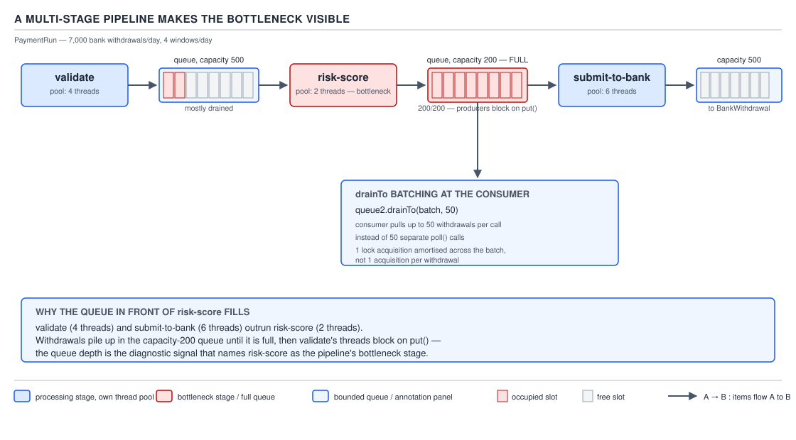
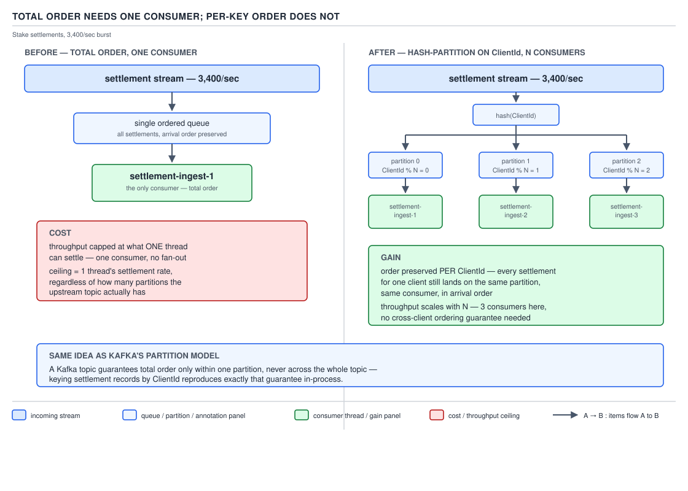

# 05 Multithreading and Concurrency — Producer–consumer and backpressure design — INTERMEDIATE (§2.7)

**Target version: Java 21 LTS.** | **Part 2 of 5** | [Index](../00-index.md)
Previous: [The concurrent collection decision](../concurrent-collections/02-the-collection-decision.md) · Next: [CompletableFuture in anger](../completable-future/02-in-anger.md)

## The four backpressure mechanisms

### Mental model

A bounded queue is a pressure valve, not a buffer. Every queue eventually fills, and the only
question that matters is what happens at the moment it does — that decision *is* backpressure.
Everything else is plumbing.

Picture the withdrawal pipeline: clients request bank withdrawals, `PaymentService` hands each
`WithdrawalTransaction` to a bounded queue in front of the batching stage that builds a
`PaymentRun`. 7k bank withdrawals/day arrive across 4 payout windows, which is bursty, not
uniform — a burst near a window close can outrun the consumer for seconds at a time. The queue
absorbs the burst up to its capacity. What happens past that capacity is the whole design.

### Why it exists

Without a bound, an unbounded `LinkedBlockingQueue` or `ExecutorService` submission queue just
grows. Growth under load looks like success until the heap runs out or GC pause times make
everything downstream time out anyway — the failure is deferred, not avoided, and it lands in a
worse place (OOM) than the one you were trying to prevent (a slow queue). A bounded queue forces
the failure to happen early, visibly, and at a point where you can choose the shape of it.

### When to reach for each, and when not

There is no universally correct choice among the four — each converts overload into a different
observable failure, and the right one depends on who is upstream and what they can tolerate.

**D-127** — The four backpressure mechanisms.

| Mechanism | Converts overload into | Works when | Fails when | Metric that proves it is happening |
|---|---|---|---|---|
| Block the producer (bounded queue, `put()`) | Producer latency | The producer *is* the ultimate source of the work and can afford to slow down — a batch job, an internal worker, a scheduled sweep | The producer is an HTTP request thread or an RPC handler — blocking it does not slow the client down, it just parks a thread holding a connection | Rising `queue.put.wait.time`; thread pool threads stuck in `BLOCKED`/`WAITING` on `offer`/`put` |
| Run on the producer (`ThreadPoolExecutor.CallerRunsPolicy`) | Producer throughput | A bursty caller that can tolerate doing the work itself occasionally, self-limiting the submission rate as a side effect | The caller is single-threaded or latency-critical — it now pays the full task cost inline, which can cascade into its own upstream timeout | `RejectedExecutionHandler` invocation count; caller-thread task-execution time |
| Shed (reject, drop, `AbortPolicy` + typed rejection) | A fast, explicit failure | The caller can retry, has a fallback, or the item is genuinely discardable (a stale price tick, a best-effort notification) | The item is a financial instruction (a withdrawal request) that cannot simply vanish — shedding must be paired with a durable retry path upstream | `429`/`503` rate; queue-full rejection counter |
| Spill to disk (or a broker) | A durability and latency trade | The consumer is reliably faster than the producer *in aggregate*, just not every instant, and you can afford to persist and replay | Persistence itself becomes the bottleneck, or ordering across the spill boundary is not preserved | Spill queue depth; age of oldest spilled item |

**Insight:** none of these four make the work disappear. Each one relocates where the overload
becomes visible — in the producer's latency, in the producer's CPU, in the caller's error rate,
or on disk. Choosing among them is choosing *who pays* and *how visibly*, never choosing to avoid
paying.

### How it works

A `ThreadPoolExecutor` backed by an `ArrayBlockingQueue` picks between the first two natively via
its `RejectedExecutionHandler`: `AbortPolicy` (shed, throws `RejectedExecutionException`),
`CallerRunsPolicy` (run on the producer), `DiscardPolicy` / `DiscardOldestPolicy` (shed silently
or shed the oldest). Blocking the producer is not one of the four built-in handlers — it requires
calling `queue.put(task)` yourself ahead of `execute()`, or using `SynchronousQueue` with a
custom submission wrapper, because `ThreadPoolExecutor.execute()` itself never blocks on a full
queue; it consults the handler immediately.

### Blocking the producer only works if the producer is the source

**Pitfall:** the belief is "the queue is full, so I will just block the producer thread until
there is room — that's backpressure, problem solved." The symptom: if the producer is an HTTP
request thread inside `ApplicationGateway` or `PaymentService`, blocking it does not slow the
client down at all. The client already sent the request; the socket already accepted it. Blocking
the request thread on `queue.put()` just holds that thread — and its connection, and whatever
memory the request context carries — while the real queue relocates one layer down, into the TCP
accept/socket backlog and the connection pool, where you have no visibility, no metric, and no
ability to shed selectively. The pool of request threads exhausts, health checks start timing
out, and the load balancer marks the instance unhealthy — a self-inflicted outage that never
shows up as "queue full" anywhere you're looking.

The fix: block the producer only when the producer *is* the origin of the demand and can absorb
the delay without externalizing it to someone else waiting on a socket. A background reconciliation
job pulling `WithdrawalTransaction` rows and pushing them into stage 1 of the pipeline can block —
nothing is waiting on it synchronously. An `ApplicationGateway` handler accepting a withdrawal
request cannot; it must shed (429 with `Retry-After`) or hand off asynchronously and return
immediately.

> **Definition:** backpressure is genuine only when the entity you slow down is the entity capable
> of slowing down — block a thread that isn't the source and you have hidden the queue, not
> managed it.

## Load shedding done properly

Shedding correctly is itself a design, not a fallback of last resort. Shed the *cheapest* work
first — a `BalanceView` preview refresh is far cheaper to lose than a submitted
`WithdrawalTransaction` — return `429 Too Many Requests` (client should back off) or
`503 Service Unavailable` (server temporarily can't) with a `Retry-After` header carrying a
concrete number of seconds, and export the shed rate as its own metric (`requests.shed.count`),
never merged into the generic error counter. A shed rate hidden inside "5xx errors" looks
identical to a real bug during an incident review; a shed rate as its own signal tells you the
system did exactly what it was designed to do under load. **Gotcha:** shedding without a
`Retry-After` header just moves the decision "when do I retry" onto every caller independently,
which produces a synchronized retry storm the moment the pressure clears.

## Batching at the consumer with `drainTo`

### Mental model

A consumer that calls `queue.take()` once per item pays the lock-acquisition and context-switch
cost of the queue once per item. A consumer that calls
`queue.drainTo(buffer, maxBatchSize)` pays that cost once per *batch* and gets a `List` back to
process in one downstream round trip.

### Why it exists

`BlockingQueue.take()` acquires an internal lock (or CAS loop) per call. At the pipeline's
settlement-adjacent stage, batch-submitting a `PaymentRun` file to `BankWithdrawal` costs a
`p50` of 2 s and a `p99` of 45 s per file (Appendix A figures) — clearly a round trip you want to
amortize across many transactions, not pay once per transaction.

### When to reach for it, and when not

`drainTo` earns its keep whenever the per-item downstream cost (a lock, an RPC, a file write)
dominates the per-item processing cost. It is the wrong tool when latency-sensitivity dominates —
a single high-value withdrawal awaiting fraud sign-off should not sit in a batch queue behind
6,999 others; that path uses direct dispatch instead, sized by risk tier, not by throughput.

### How it works, worked with a number `[NUM]`

Stage 3 of the withdrawal pipeline holds a bounded `ArrayBlockingQueue<WithdrawalTransaction>` of
capacity 500. A consumer thread calls `queue.drainTo(batch, 200)` to pull up to 200 transactions
per file-submission call. If each unbatched submission costs a fixed 50 ms downstream (queueing +
network to `BankWithdrawal`) plus 2 ms of real work, unbatched throughput per consumer thread is
`1000 / (50 + 2) ≈ 19.2 tx/sec`. Batching 200 items into one submission amortizes the 50 ms
fixed cost across the batch: total time per batch is `50 + 200 × 2 = 450 ms` for 200 transactions,
i.e. `200 / 0.45 ≈ 444 tx/sec` per consumer thread — a 23x improvement, purely from moving the
fixed cost outside the per-item loop. The trade is latency: an item that arrives just after a
`drainTo` call now waits up to one full batch-fill period before it is even picked up, so batch
size is chosen against the SLA for the slowest tolerable withdrawal, not against raw throughput
alone.

```java
void runBatchStage(BlockingQueue<WithdrawalTransaction> queue, int maxBatch) throws InterruptedException {
    List<WithdrawalTransaction> batch = new ArrayList<>(maxBatch);
    while (!Thread.currentThread().isInterrupted()) {
        WithdrawalTransaction first = queue.take();          // block for at least one item
        batch.add(first);
        queue.drainTo(batch, maxBatch - 1);                  // top up without blocking further
        submitPaymentRunSlice(batch);
        batch.clear();
    }
}
```

**Gotcha:** `drainTo` never blocks — it returns immediately with whatever is present, even zero
items past the first. The leading `queue.take()` is what supplies the blocking wait; without it
the loop busy-spins on an empty queue.

## The multi-stage pipeline makes the bottleneck visible

The withdrawal flow is naturally three stages: validate against `ClientRestrictions` and the
closed-loop rule, batch into a `PaymentRun`, then submit the file to the banking partner. Give
each stage its own bounded queue and its own thread pool, sized independently, and the slowest
stage's queue is the one that fills — visibly, measurably, at a named boundary — instead of the
whole pipeline degrading as one undifferentiated mass.



**D-128** — A multi-stage pipeline makes the bottleneck visible.

With the banking partner's payout file at `p50` 2 s / `p99` 45 s across only 4 windows/day, stage
3 (submission) is structurally the slowest and its queue is the one drawn full in D-128 — stage
1 (validate) and stage 2 (batch) run far ahead of it and sit mostly empty. That asymmetry is the
entire value of per-stage queues: a single shared queue across all three stages would show one
aggregate depth number and hide which stage is actually starved.

## Fan-out/fan-in and completion order

Submitting N independent lookups (say, closed-loop instrument checks across N withdrawal
candidates) and waiting for all of them in submission order stalls the whole batch on the single
slowest lookup. `ExecutorService.invokeAll()` and a naive loop over `Future.get()` in submission
order both have this property. A `CompletionService` (or a `StructuredTaskScope` joining on first
completion) instead returns whichever task finishes first, regardless of submission order.

**Prove it:** with N=10 tasks whose durations are drawn independently and one outlier takes 10x
the others, submission-order waiting makes every result downstream of the outlier wait for it
even though 9 of 10 answers were ready. Completion-order processing lets those 9 flow downstream
immediately, and only the one slot behind the outlier stalls. Tail latency for "time until result
i is available" strictly dominates (is never worse, and is usually much better) under completion
order for every `i` except whichever task happens to be the outlier itself — the aggregate p99
across all N results improves because only one result pays the outlier's cost instead of all
of them being serialized behind submission order artificially.

## Total order versus per-key order

### Mental model

Ordering is a spectrum, not a binary. **Total order** means every settlement across every client
must be processed in exactly the sequence they arrived, system-wide. **Per-key order** means only
settlements for the *same* `ClientId` must stay in sequence relative to each other — settlements
for two different clients may be processed in any relative order, including simultaneously.

### Why it exists

Total order is what a naive single-queue, single-consumer design gives you for free — and it is
usually far stricter than the business actually needs. Stake settlements arrive in a 3,400/sec
burst; nothing in the ledger's correctness requires client A's settlement to be ordered relative
to client B's settlement, only that client A's own sequence of stake reservations, settlements,
and withdrawals lands in the order they actually happened.

### When to reach for each, and when not

Total order is required only when correctness genuinely spans keys — a global sequence number
generator, a single append-only audit log. Per-key order is the right default whenever the
correctness invariant is scoped to one entity, which is the common case for settlements, stake
lifecycles, and per-client ledger movements.



**D-129** — Total order needs one consumer; per-key order does not.

### How it works

A single `BlockingQueue` with exactly one consumer thread trivially gives total order: FIFO in,
FIFO out, one thread processing means no two items are ever in flight together, so throughput is
capped at whatever one thread can do — against a 3,400/sec settlement burst, one consumer doing
even 1 ms of work per settlement caps out at 1,000/sec, already short of the burst. Partitioning
by `hash(clientId) % N` into N queues, each with its own consumer, preserves order *within* each
partition (every settlement for a given `ClientId` always hashes to the same queue, so FIFO
within that queue gives per-client order) while letting N consumers run genuinely in parallel,
scaling aggregate throughput close to linearly with N.

**Insight:** this is exactly Kafka's partition model. A Kafka topic partition is a total-ordered
log; a topic with N partitions gives per-key order across the topic as a whole only if the
producer's partitioner hashes the same key to the same partition every time — precisely the
`hash(clientId) % N` scheme above, just running inside a broker instead of inside one JVM's
in-memory queues. `[X-REF 14]` covers the broker-durability side of that same idea — this file
stops at the in-JVM mechanism.

```java
record SettlementPartitioner(int partitionCount) {
    int partitionFor(ClientId clientId) {
        return Math.floorMod(clientId.value().hashCode(), partitionCount);
    }
}

final class PartitionedSettlementDispatcher {
    private final List<BlockingQueue<SettlementEvent>> partitions;
    private final SettlementPartitioner partitioner;

    PartitionedSettlementDispatcher(int partitionCount, int queueCapacity) {
        this.partitioner = new SettlementPartitioner(partitionCount);
        this.partitions = new ArrayList<>(partitionCount);
        for (int i = 0; i < partitionCount; i++) {
            partitions.add(new ArrayBlockingQueue<>(queueCapacity));
        }
    }

    void dispatch(SettlementEvent event) throws InterruptedException {
        int partition = partitioner.partitionFor(event.clientId());
        partitions.get(partition).put(event);   // blocking is fine: dispatch is internal, not an HTTP thread
    }
}
```

**Gotcha:** re-sizing the partition count changes which partition every `ClientId` hashes to,
which silently breaks per-key ordering across the resize boundary unless in-flight settlements
for affected clients are drained first — the same rebalancing problem Kafka solves with consumer
group rebalancing protocols, and one an in-JVM scheme must solve by hand.

## `[BUILD]` The complete three-stage withdrawal pipeline

Ships all three stages, their bounded queues and pools, `drainTo` batching at the consumer, and
`ClientId` partitioning on the settlement-adjacent path, wired together and graceful-shutdown
capable: stop accepting new work, drain each stage in order (never shut down stage 1 after stage
3 — that would strand in-flight items), interrupt any consumer that does not drain within its
deadline, then force shutdown.

```java
final class WithdrawalPipeline implements AutoCloseable {
    private final BlockingQueue<WithdrawalTransaction> validateQueue = new ArrayBlockingQueue<>(1000);
    private final BlockingQueue<WithdrawalTransaction> batchQueue = new ArrayBlockingQueue<>(500);
    private final ExecutorService validatePool = Executors.newFixedThreadPool(4);
    private final ExecutorService batchPool = Executors.newFixedThreadPool(2);
    private final ExecutorService submitPool = Executors.newFixedThreadPool(2);
    private final List<ExecutorService> stagesInOrder = List.of(validatePool, batchPool, submitPool);
    private volatile boolean acceptingWork = true;

    void submit(WithdrawalTransaction tx) {
        if (!acceptingWork) {
            throw new RejectedExecutionException("pipeline draining, retry after shutdown completes");
        }
        validatePool.execute(() -> validateAndForward(tx));
    }

    private void validateAndForward(WithdrawalTransaction tx) {
        if (!passesClosedLoopAndRestrictions(tx)) {
            return; // shed: rejected transactions never enter the batch stage
        }
        try {
            batchQueue.put(tx); // internal hop: blocking here is fine, batchPool is the source of its own pace
        } catch (InterruptedException e) {
            Thread.currentThread().interrupt();
        }
    }

    void startBatching(int maxBatch) {
        batchPool.execute(() -> {
            List<WithdrawalTransaction> batch = new ArrayList<>(maxBatch);
            try {
                while (!Thread.currentThread().isInterrupted()) {
                    batch.add(batchQueue.take());
                    batchQueue.drainTo(batch, maxBatch - 1);
                    submitPool.execute(() -> submitPaymentRunSlice(List.copyOf(batch)));
                    batch.clear();
                }
            } catch (InterruptedException e) {
                Thread.currentThread().interrupt();
            }
        });
    }

    @Override
    public void close() {
        acceptingWork = false; // stop accepting
        for (ExecutorService pool : stagesInOrder) { // drain in stage order
            pool.shutdown();
        }
        for (ExecutorService pool : stagesInOrder) {
            try {
                if (!pool.awaitTermination(30, TimeUnit.SECONDS)) {
                    pool.shutdownNow(); // interrupt after deadline
                    if (!pool.awaitTermination(10, TimeUnit.SECONDS)) {
                        throw new IllegalStateException("pipeline stage failed to terminate: " + pool);
                    }
                }
            } catch (InterruptedException e) {
                pool.shutdownNow(); // force
                Thread.currentThread().interrupt();
            }
        }
    }

    private boolean passesClosedLoopAndRestrictions(WithdrawalTransaction tx) { return true; }
    private void submitPaymentRunSlice(List<WithdrawalTransaction> slice) { /* files to BankWithdrawal */ }
}
```

## Delivery semantics at the queue boundary

At-most-once means the item is dequeued (and the ack sent) before processing completes — a crash
mid-process loses it silently, which is unacceptable for a `WithdrawalTransaction`. At-least-once
means the ack fires only after processing succeeds — a crash after processing but before the ack
causes redelivery, which is safe only if the consumer is idempotent (an `IdempotencyKey` on the
transaction, exactly as `FundsLedger` already requires elsewhere in this domain). The withdrawal
pipeline is at-least-once end to end for that reason. `[X-REF 14]` covers where the ack actually
lives once a broker sits behind the queue instead of an in-JVM `BlockingQueue`.

## In-JVM queues versus a broker

A `BlockingQueue` gives you FIFO ordering and backpressure for free, in-process, with no
network hop — and loses everything the instant the JVM dies: no durability, no cross-process
visibility, nothing to inspect from outside. The moment a second process needs to see the queue,
or the queue must survive a restart, it stops being a data structure and becomes a distributed
system with its own failure modes: partial delivery, duplicate delivery, network partitions
between producer and broker. `[X-REF 14]` develops "your queue is a distributed system now" in
full; the one line that matters here is that swapping `ArrayBlockingQueue` for a broker is not a
drop-in change of implementation, it is a change of correctness model.

## Rate limiting inside the JVM `[RESEARCH]`

A `Semaphore` sized to the number of permitted concurrent operations caps *concurrency*, not
*rate* — it says nothing about operations per second, only about how many may be in flight
simultaneously. A token bucket built over `ScheduledExecutorService` (refill N tokens every
period, `acquire()` blocks or rejects when the bucket is empty) caps rate directly and permits
short bursts up to the bucket size. Verified against Resilience4j's current documentation:
`resilience4j-ratelimiter`'s `RateLimiterConfig` implements exactly this token-bucket shape —
`limitForPeriod` (permits per refresh window), `limitRefreshPeriod`, and `timeoutDuration` (how
long a caller waits for a permit before giving up) — with `AtomicRateLimiter` as the default
lock-free implementation and `SemaphoreBasedRateLimiter` as an alternative. `resilience4j-bulkhead`
caps concurrency the way a `Semaphore` does: `BulkheadConfig.maxConcurrentCalls` (default 25) plus
`maxWaitDuration` for the semaphore-based bulkhead, or a full `ThreadPoolBulkheadConfig`
(`coreThreadPoolSize`, `maxThreadPoolSize`, `queueCapacity`) for the thread-pool-based one. `[X-REF
12]` covers `CallerRunsPolicy` and shedding as the same family of concern viewed from the executor
side rather than the resilience-library side.

## The bulkhead, circuit breaker, and timeout triad `[RESEARCH]`

Three primitives, three different failure modes, and each maps to one of the mechanisms already
covered in this file.

| Primitive | Maps onto | What it prevents |
|---|---|---|
| Bulkhead | `Semaphore` / bounded thread pool — a concurrency cap | One slow dependency (say, a struggling banking-partner endpoint) exhausting every thread and starving unrelated work |
| Circuit breaker | A stateful gate that shifts a call site from "attempt" to "fail fast" | Repeatedly retrying a dependency that is already down, which only adds load to a system trying to recover |
| Timeout | A bound on how long any single call is allowed to hold a resource | A hung call holding a bulkhead slot indefinitely, defeating the bulkhead's own cap |

They are layered, not alternatives: a timeout bounds each call, the circuit breaker decides
whether to attempt the call at all based on recent timeout/failure rates, and the bulkhead bounds
how many calls (successful or not) may be outstanding at once. `[X-REF 20]` covers the circuit
breaker's own state machine in depth — this file only places it in the triad.

## Pitfalls

### Assuming blocking the producer is always safe backpressure

**Wrong**
```java
// Inside an HTTP request handler for POST /withdrawals
void handleWithdrawalRequest(WithdrawalTransaction tx) throws InterruptedException {
    validateQueue.put(tx); // blocks the request thread when the queue is full
}
```
Under load this appears to work — requests just get slower. In reality the request-thread pool
drains, the load balancer's health check (itself a request competing for the same pool) starts
timing out, and the instance is marked unhealthy and pulled from rotation while it is, from the
JVM's perspective, doing nothing wrong at all.

**Right**
```java
void handleWithdrawalRequest(WithdrawalTransaction tx) {
    if (!validateQueue.offer(tx)) {
        throw new QueueSaturatedException(RETRY_AFTER_SECONDS); // mapped to 429 + Retry-After upstream
    }
}
```

**Why people believe it:** a bounded queue and `put()` together look exactly like the textbook
producer–consumer pattern, and in every textbook example the "producer" is a background thread
with nothing else depending on it — the pattern is correct, the context it gets pasted into is
not.

### Assuming a shared single queue shows where the pipeline is slow

**Wrong**
```java
BlockingQueue<WithdrawalTransaction> onePipelineQueue = new ArrayBlockingQueue<>(2000);
// validate, batch, and submit all read from and write to the same queue
```
The queue depth metric conflates all three stages. It rises when submission to the banking
partner is slow, when validation is slow, or when both are — and the on-call engineer cannot
tell which without adding ad-hoc timing around each stage after the fact, mid-incident.

**Right**
Give each stage its own bounded queue (as in D-128 and the `[BUILD]` pipeline above). Now
`batchQueue.size()` sitting near capacity while `validateQueue.size()` sits near zero says,
unambiguously, that batching or submission is the bottleneck, not validation.

**Why people believe it:** one queue is simpler to build and reason about locally; the cost of
that simplicity only becomes visible once something is actually slow and needs diagnosing.

## Cheat sheet

| Concept | One line |
|---|---|
| Block the producer | Only backpressure if the producer is the source; check who is upstream first |
| `CallerRunsPolicy` | Runs the task on the caller's thread — throttles the caller, but risks cascading into the caller's own SLA |
| Shed | Fast, explicit failure — 429/503 + `Retry-After`, export the shed rate as its own metric |
| Spill to disk / broker | Trades latency and complexity for durability when the consumer is faster only on average |
| `drainTo` | Pulls up to N items without blocking; pair with a leading `take()` for the wait |
| Multi-stage pipeline | One bounded queue + one pool per stage — the full queue is the bottleneck, visibly |
| Total order | One consumer, one queue, throughput capped at one thread |
| Per-key order | `hash(key) % N` partitions, N consumers, order preserved only within a key |
| At-least-once | Ack after success; requires an idempotent consumer (`IdempotencyKey`) |
| Bulkhead | Concurrency cap (`Semaphore` / thread pool) |
| Circuit breaker | Fail-fast gate based on recent failure rate |
| Timeout | Bounds how long any one call may hold a bulkhead slot |

## Self-test

**Q1.** Why does blocking an HTTP request thread on a full queue not actually provide
backpressure?

<details><summary>Answer</summary>

Because the client has already sent the request and the socket has already accepted it — the
"queue" the client experiences has moved to the TCP/socket backlog and the connection pool,
neither of which is visible or controllable the way the application-level queue is. Blocking the
request thread only holds a thread and a connection hostage; it does not slow the actual source of
demand (the client population), and it eventually exhausts the request-thread pool, causing health
checks to fail.

</details>

**Q2.** Give one situation where blocking the producer genuinely is correct backpressure.

<details><summary>Answer</summary>

A background reconciliation or batch job pulling rows from a table and pushing them into a
pipeline stage. Nothing synchronous is waiting on that producer thread, so blocking it simply
slows the rate at which it pulls more rows — exactly the intended effect.

</details>

**Q3.** What does `drainTo` do if the queue is currently empty?

<details><summary>Answer</summary>

It returns immediately with zero items transferred — `drainTo` never blocks. A consumer loop must
pair it with a blocking call like `take()` first to get the wait, then call `drainTo` to top up
the batch without further blocking.

</details>

**Q4.** Why does per-key partitioning by `hash(clientId) % N` preserve ordering for a single
client while allowing N-way parallelism overall?

<details><summary>Answer</summary>

Every settlement for the same `ClientId` hashes to the same partition every time, so within that
partition's single-consumer queue, FIFO delivery preserves that client's order. Settlements for
different clients may land in different partitions and are processed by different consumer
threads concurrently, with no ordering guarantee — and none required — between them.

</details>

**Q5.** Why is total order for stake settlements at 3,400/sec a poor default design choice for
this domain?

<details><summary>Answer</summary>

Because the correctness invariant (a client's own settlements must be in order) is scoped per
client, not global. Enforcing total order forces a single consumer, capping throughput at
whatever one thread can process per second — well under the 3,400/sec burst for any nontrivial
per-item cost — for an ordering guarantee the business does not actually need across clients.

</details>

**Q6.** In the bulkhead/circuit-breaker/timeout triad, why does a timeout still matter even when
a bulkhead already caps concurrency?

<details><summary>Answer</summary>

The bulkhead caps how many calls may be outstanding, but without a timeout a single hung call can
occupy its bulkhead slot indefinitely. Over time, hung calls accumulate and consume every slot,
defeating the bulkhead's purpose even though the cap itself was never exceeded at any single
instant.

</details>

**Q7.** What is the one metric that proves load shedding is working as designed rather than
indicating an unnoticed bug?

<details><summary>Answer</summary>

A dedicated shed-rate counter (e.g. `requests.shed.count`), tracked separately from generic error
or 5xx counters. If shedding is folded into the general error rate, an on-call engineer cannot
distinguish "the system shed load exactly as designed" from "something is broken," which is
precisely the distinction that matters during an incident.

</details>

**Q8.** Why must a multi-stage pipeline drain stage 1 before stage 3 during shutdown, not the
reverse?

<details><summary>Answer</summary>

If stage 3 (submission) is shut down first while stage 1 (validation) is still accepting and
forwarding work, items pushed into stage 2's queue after stage 3 stops have nowhere to go and are
stranded. Draining in stage order — stop accepting, then let each stage in turn finish and stop
forwarding to the next — ensures no stage is shut down while an earlier stage can still hand it
work.

</details>

---

**Leaves covered:** 2.7.1–2.7.12 (12 leaves)
**Leaves deferred:** none
**Diagrams included:** D-127, D-128, D-129
**Target version:** Java 21 LTS
**Lines:** 561
