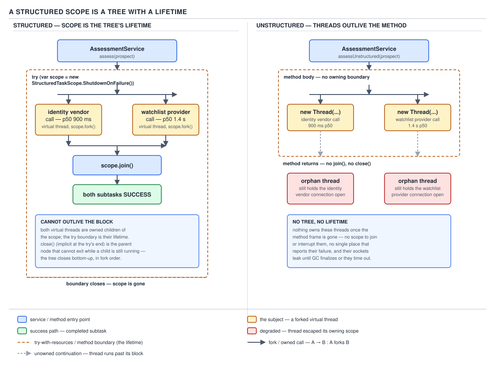
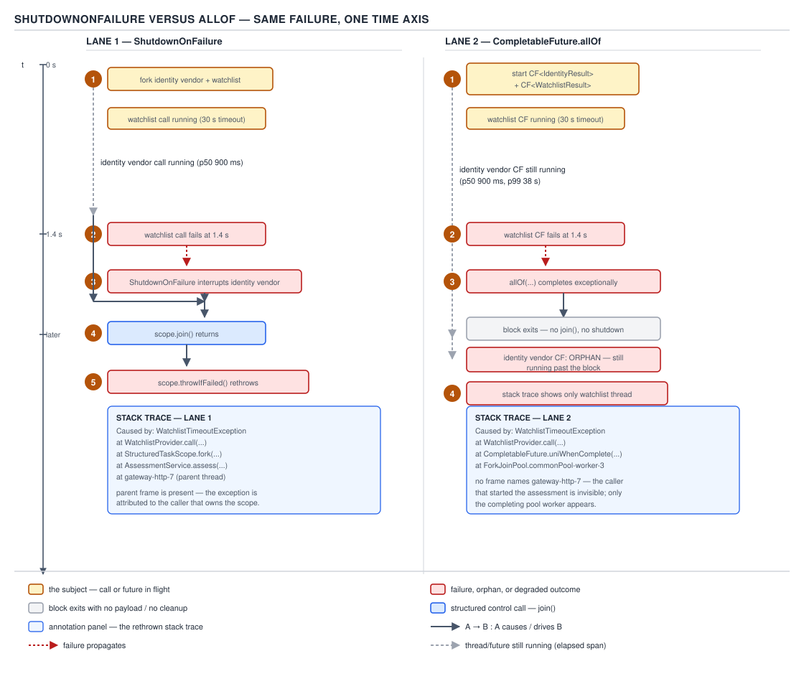
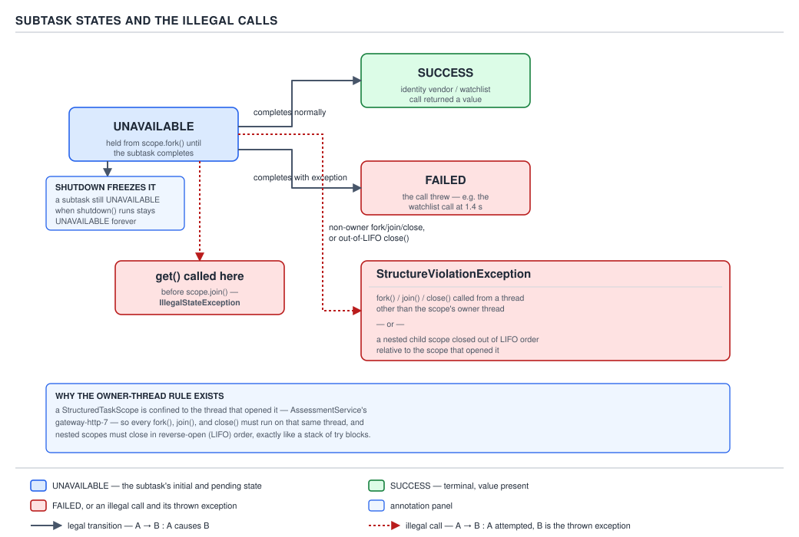

# 05 Multithreading and Concurrency — Structured concurrency and scoped values — BASICS (§1.25)

**Target version: Java 21 LTS.** | **Part 1 of 5** | [Index](../00-index.md)
Previous: [Virtual threads — the model](../virtual-threads/01-basics-the-model.md) · Next: [Liveness failures](../liveness/01-basics-failures.md)

## The problem structured concurrency exists to fix

`AccountActivation` needs two independent verdicts before it can move an application to
`AA-801 ACTIVATED`: a screening check against `ScreeningService`'s watchlist provider (p50
1.4 s, p99 25 s, 30 s timeout) and an identity re-check against `DocumentVerification`'s
vendor (p50 900 ms, p99 38 s). Written the unstructured way, `ExecutorService.submit` hands
back two `Future`s and the calling method moves on:

```java
ExecutorService pool = Executors.newVirtualThreadPerTaskExecutor();
Future<ScreeningVerdict> screeningFuture = pool.submit(() -> screeningService.check(clientId));
Future<DocumentVerdict> identityFuture = pool.submit(() -> documentVerification.recheck(clientId));
ScreeningVerdict screening = screeningFuture.get();
DocumentVerdict identity = identityFuture.get();
```

Three things go wrong with this shape, none of them hypothetical. **1.25.1** If
`screeningFuture.get()` throws, the code never reaches `identityFuture.get()` — the identity
task keeps running, holding a vendor connection, on a thread nobody is waiting on. **2.** A
`jstack` dump of a hung `AccountActivation` instance shows a virtual thread parked inside the
watchlist client with no frame anywhere naming the request that started it — the parent-child
relationship that would explain *why* this thread exists is gone, because the pool's thread
and the calling method's thread are unrelated from the JVM's point of view. **3.** Cancelling
the caller — a deployment rolling the pod, a client abandoning the request — does nothing to
the submitted tasks; they run to completion regardless, burning vendor rate-limit budget
(600/min estate-wide on the identity vendor) for an answer nobody will read.

`Future` treats a task as a value you can request later. It never treats it as a *child* of
the code that created it. Unstructured concurrency is the `goto` of threading: any thread can
outlive the block that spawned it, jump to any part of the program's lifetime, and leave no
trace of where it came from. **1.25.2** Structured concurrency's principle is one sentence:
**if a task splits into concurrent subtasks, they all return to the same place, in the same
block, with the same lifetime.** A subtask cannot outlive the block that forked it, in the
same way a local variable cannot outlive the method that declared it.

## A structured scope is a tree with a lifetime

**1.25.3** Java 21 previews this as `StructuredTaskScope<T>` under JEP 453. The shape you
build in 21 is the *constructor* shape — later previews replace it (see the version note
below), but 21's shape is what compiles against `--enable-preview`, and it is what this file
teaches:

```java
try (var scope = new StructuredTaskScope<VerificationResult>()) {
    // fork: create a subtask, start it, hand back a handle
    StructuredTaskScope.Subtask<ScreeningVerdict> screeningTask =
        scope.fork(() -> screeningService.check(clientId));
    StructuredTaskScope.Subtask<DocumentVerdict> identityTask =
        scope.fork(() -> documentVerification.recheck(clientId));

    scope.join();              // wait for both, or for shutdown() to fire
    // scope closes here — try-with-resources — and cannot exit until every
    // subtask has finished, been cancelled, or thrown
}
```

`fork` does three things atomically: it creates a virtual thread, starts it, and registers it
as a child of `scope`. `join()` blocks the owner until every forked subtask reaches a terminal
state (or a shutdown policy fires — the next concept). `close()`, called automatically by
try-with-resources, refuses to return while any subtask is still running — it interrupts
stragglers and waits for them. The `try` block's braces are now also a **concurrency
boundary**: nothing declared inside can be observed to still be running once execution passes
them.

**Why it exists.** Nothing in the JDK before this enforced parent-child thread relationships;
every prior primitive (`Thread`, `ExecutorService`, `CompletableFuture`) let a task's lifetime
exceed its creator's. Structured concurrency does not add a new way to run code concurrently —
it constrains the ways that already exist so that concurrency composes the way single-threaded
call/return already does.

**When to reach for it, and when not.** Reach for a `StructuredTaskScope` whenever a request
forks into two or more calls whose results all feed the same decision and whose failure should
cancel the others — exactly the `AssessmentService`/`AccountActivation` shape above. Do not
reach for it for fire-and-forget work with no result the caller waits on (a `NotificationService`
delivery attempt after a deposit clears) — that is a plain executor submission, because there
is no parent lifetime to bind the child to. Do not reach for it either for a single sequential
call chain; a scope with one `fork` is a `Callable` wearing a costume.

**The mechanism, restated as ownership.** The thread that calls `new StructuredTaskScope()` is
the **owner**. Every `fork` call creates a subtask whose lifetime is bounded by the owner's
`try` block. The JVM does not enforce parenthood by magic — it is enforced by the API refusing
`join`, `fork`, or `close` from any thread other than the owner (§ next concept), and by `close`
blocking until the tree under it is empty.



**D-100** — A structured scope is a tree with a lifetime.

**The gotcha.** A `fork` call inside a scope that has already begun shutting down (because a
sibling failed, under `ShutdownOnFailure`) still returns a `Subtask` handle — but the subtask
may never actually run, and its state stays `UNAVAILABLE`. Checking only "did `fork` throw"
is not enough; the state has to be read after `join()`.

> **A `StructuredTaskScope` is a `try`-with-resources block that will not let any thread it
> started outlive it.**

## `ShutdownOnFailure` versus `CompletableFuture.allOf`

**1.25.4** Java 21 ships two built-in shutdown policies as subclasses:
`StructuredTaskScope.ShutdownOnFailure` cancels every sibling the instant one subtask fails,
and exposes `throwIfFailed()` to rethrow that failure (wrapped) after `join()` returns.
`StructuredTaskScope.ShutdownOnSuccess<T>` is its mirror for a race: it shuts down on the
first *success* and exposes `result()`.

**Why it exists.** `CompletableFuture.allOf(a, b)` waits for both futures but propagates
neither's exception directly — `allOf` itself completes exceptionally, but `a` and `b` keep
running to completion even after one has failed, because nothing about `CompletableFuture`
knows they are siblings that should die together. Before `StructuredTaskScope`, cancelling a
sibling on a sibling's failure meant manually wiring `whenComplete` callbacks that called
`cancel(true)` on the others — cancellation as a bolt-on, not a guarantee.

**When to reach for it, and when not.** Use `ShutdownOnFailure` whenever every subtask's
result is required and any one failing makes the whole operation meaningless — exactly
`AccountActivation` waiting on screening *and* identity. Use `allOf` (or `anyOf`) only when the
tasks are genuinely independent and a failure in one must not touch the others — for example,
firing a `NotificationService` email and SMS where either may fail without affecting the other.

**The mechanism.** With `ShutdownOnFailure`, watchlist and identity fork under one scope. The
watchlist call fails at 1.4 s (the vendor rejects a match). `ShutdownOnFailure` records the
exception, calls `shutdown()`, which interrupts the identity subtask's virtual thread and
causes `join()` on the owner to return immediately rather than waiting the full 38 s p99. The
owner then calls `throwIfFailed()`, which rethrows the original exception wrapped so its stack
trace names the `AccountActivation` call site — the parent-child relationship `Future` could
never give you. Under `allOf`, the same watchlist failure is visible on the composed future,
but the identity call — mid-flight, past the block that "owns" it — keeps running: an orphan
holding a vendor connection with nothing left to observe its result.

| | `ShutdownOnFailure` | `CompletableFuture.allOf` |
|---|---|---|
| Error propagation | `throwIfFailed()` rethrows with parent stack frame | Composed future fails; original exceptions must be dug out per-future |
| Sibling cancellation on failure | Automatic — `shutdown()` interrupts every other subtask | None — siblings run to completion regardless |
| Readable stack trace | Yes — exception carries the owner's call site | No — each future's exception stands alone, no parent context |
| Thread lifetime | Bounded by the `try` block | Unbounded — a future can be abandoned mid-flight |



**D-101** — `ShutdownOnFailure` versus `allOf` under the same watchlist failure.

```java
// --enable-preview required on Java 21 (JEP 453)
try (var scope = new StructuredTaskScope.ShutdownOnFailure()) {
    StructuredTaskScope.Subtask<ScreeningVerdict> screening =
        scope.fork(() -> screeningService.check(clientId));
    StructuredTaskScope.Subtask<DocumentVerdict> identity =
        scope.fork(() -> documentVerification.recheck(clientId));

    scope.join();
    scope.throwIfFailed(cause -> new ActivationGateException("activation gate check failed", cause));

    return new VerificationResult(screening.get(), identity.get());
}
```

**Insight:** `throwIfFailed` only rethrows if a subtask actually failed — after it returns
normally, every `Subtask.get()` in the block is safe to call, because `join()` already forced
every subtask to a terminal state.

**The hedging and deadline patterns**, both variants of the same shape: hedging forks the
identity vendor call twice (primary and a fallback vendor) under `ShutdownOnSuccess`, taking
whichever answers first and cancelling the loser; a deadline pattern calls `joinUntil(Instant)`
instead of `join()` so the 30 s watchlist timeout becomes the scope's own deadline rather than
a per-call `Future.get(timeout)` that leaves the other subtask unbounded.

**Pitfall:** assuming `join()` alone propagates failure. `join()` returns normally even when a
subtask failed — it only waits for a terminal state, successful or not. Forgetting
`throwIfFailed()` (or checking `Subtask.state()`) silently swallows the watchlist failure and
lets `AccountActivation` read a `null`-shaped verdict from a subtask that never produced one.

> **`ShutdownOnFailure` makes "any sibling fails, all siblings die, and the caller finds out
> with a real stack trace" a property of the scope, not a chore for the caller to remember.**

## `Subtask` states and the illegal calls

**1.25.5** Every `Subtask<T>` returned by `fork` sits in exactly one of three states, given by
`subtask.state()`: `UNAVAILABLE` (still running, or never actually started because the scope
had already begun shutting down), `SUCCESS` (completed normally — `get()` is safe), `FAILED`
(threw — `exception()` is safe, `get()` throws `IllegalStateException`). These states only
settle *after* `join()` returns; reading `state()` or calling `get()` beforehand observes
`UNAVAILABLE` and, for `get()`, an exception.

**1.25.6** The scope enforces strict ownership, and this is where the API stops being merely
a convenience and starts being a correctness guarantee. **Only the thread that created the
scope may call `fork`, `join`, or `close` on it.** The scope must be closed by that same
thread, and if a method opens more than one scope, they must close in strict LIFO order —
innermost first. `AssessmentService` cannot hand its `StructuredTaskScope` to a subtask and
have that subtask call `fork` on it to spawn a grandchild; that call throws
`StructureViolationException` at the point of the violation, not later and not silently.

**Pitfall:** treating a `StructuredTaskScope` like a thread-safe collection you can pass
around. The natural instinct — pass the scope into a helper method so the helper can fork more
work — throws `StructureViolationException` the moment that helper runs on a different thread
than the owner, or closes scopes out of order. The fix is to fork *from* the owner thread only,
and let a forked subtask open its *own* nested scope if it needs to fan out further — nesting
is fine, sharing across threads is not.



**D-102** — `Subtask` states and the illegal transitions.

```java
// --enable-preview required on Java 21 (JEP 453)
// BROKEN: reads get() before join() has run
try (var scope = new StructuredTaskScope.ShutdownOnFailure()) {
    StructuredTaskScope.Subtask<DocumentVerdict> identity =
        scope.fork(() -> documentVerification.recheck(clientId));
    DocumentVerdict verdict = identity.get(); // IllegalStateException: still UNAVAILABLE
}
```

```java
// FIXED: join() first, forces every subtask to a terminal state
try (var scope = new StructuredTaskScope.ShutdownOnFailure()) {
    StructuredTaskScope.Subtask<DocumentVerdict> identity =
        scope.fork(() -> documentVerification.recheck(clientId));
    scope.join();
    scope.throwIfFailed(RuntimeException::new);
    DocumentVerdict verdict = identity.get(); // safe: state() is SUCCESS
}
```

> **`Subtask.get()` is only ever safe to call after `join()` has returned and
> `throwIfFailed()` (or an equivalent state check) has not thrown — calling it earlier, or
> calling `fork`/`join`/`close` from a non-owner thread, are exactly the two illegal moves the
> API is designed to catch immediately.**

### The API is still preview, and its shape keeps changing `[VERSION-TRAP]`

**1.25.7** Everything above — the public `new StructuredTaskScope<T>()` constructor,
`ShutdownOnFailure`, `ShutdownOnSuccess` — is the **Java 21 shape**, previewed under **JEP
453**. It is not the only shape this API has ever had, and it will not be the shape it settles
into. The JEP history: JEP 428 (incubator, Java 19), JEP 437 (second incubator, Java 20), JEP
453 (first preview, Java 21 — the shape this file teaches), JEP 462 (second preview, Java 22),
JEP 480 (third preview, Java 23), JEP 499 (fourth preview, Java 24), **JEP 505 (fifth preview,
Java 25)**, JEP 525 (sixth preview, Java 26), JEP 533 (seventh preview). As of Java 25 the
feature has still not finalized.

**1.25.8** JEP 505's rework, verified against the JEP text on `openjdk.org/jeps/505` (the JEP
page itself, exceptionally reachable — `bugs.openjdk.org` and `github.com/openjdk/jdk` corroborate),
replaces the constructor-and-subclass shape with static factories: `StructuredTaskScope.open()`
for the default all-succeed-or-fail-together policy, and richer `open(Joiner)` overloads for
everything else. `ShutdownOnFailure`/`ShutdownOnSuccess` are gone as public subclasses; the
policy is now supplied as a `Joiner` — `Joiner.allSuccessfulOrThrow()`,
`Joiner.anySuccessfulResultOrThrow()`, `awaitAll()`, `awaitAllSuccessfulOrThrow()` — passed
into `open`, plus a `StructuredTaskScope.Configuration` for naming a scope, giving it a timeout,
and supplying a thread factory, and a `Joiner.onTimeout` hook. None of this compiles against
Java 21; it is the shape you will meet if this topic is revisited for Java 25+, named here so a
reader who sees `StructuredTaskScope.open(...)` in a blog post knows it is a different preview,
not a mistake in this file.

**Interview:** "Is structured concurrency final in Java 21?" — no, and it still is not final as
of the Java 25 preview cycle (fifth preview, JEP 505); only **scoped values** finalized, in
Java 25 under JEP 506. The two features are easy to conflate because they were designed
together and previewed together for several releases — do not swap them.

## `ScopedValue` versus `ThreadLocal`

**1.25.11** `ThreadLocal` has three problems `ScopedValue` is built to remove.
**Unconstrained mutability** — any code with a reference to the `ThreadLocal` can call `set`
at any time, from anywhere, so a value read at the top of a request handler is not guaranteed
to be the value a helper three calls deep still sees. **Unbounded lifetime** — a value set on
a pooled thread survives past the logical end of the request unless something remembers to
call `remove()`; forget it, and the next request pulled from the pool inherits the previous
request's data. In `AssessmentService`, a `ThreadLocal<ClientId>` set for one wealth-scoring
request and never cleared would leak that `ClientId` into whichever request the pool hands the
same platform thread next. **Expensive inheritance** — `InheritableThreadLocal` copies the
parent's value into every child thread at creation time, which means forking a thousand
virtual-thread subtasks under a scope copies the value a thousand times even though none of
them will ever mutate it.

**1.25.12** `ScopedValue<T>` is the replacement: `ScopedValue.newInstance()` creates an unbound
key; `ScopedValue.where(key, value)` returns a `Carrier`; `.run(Runnable)` or `.call(Callable)`
on that carrier binds the value for exactly the dynamic extent of the call and unbinds it the
instant the call returns, exception or not. Inside that extent, `key.get()` returns the bound
value, `key.isBound()` reports whether a binding is active, `key.orElse(fallback)` and
`key.orElseThrow(supplier)` handle the unbound case without a `try`/`catch`, and
`key.getWhere(otherCarrier)` (Java 21 only — see the version note below) reads a value out of a
carrier that has not yet been `run`. Nesting `where` calls rebinds: an inner
`ScopedValue.where(key, other).run(...)` shadows the outer binding for its extent only, and the
outer binding reappears the moment the inner call returns.

**1.25.13** The guarantee that makes this safe is **lexical scope, not thread**. A binding
exists only for the dynamic extent of the `run`/`call` that created it — it cannot be set
before that call and cannot be read after it returns, on any thread. Work the argument through:
suppose `ScopedValue.where(CURRENT_CLIENT, clientId).run(() -> { /* A */ })` is executing body
`A`. Any code reachable from `A` — including subtasks `A` forks under a `StructuredTaskScope`
— can call `CURRENT_CLIENT.get()` and see `clientId`, because those subtasks are children
created *inside* the dynamic extent of `run`. Code that runs *before* `where(...).run(...)` is
called, or *after* it returns, is outside that extent and `CURRENT_CLIENT.get()` there throws
`NoSuchElementException` (or returns the *previous* outer binding, if one is active) — there is
no window in which a stale value can leak forward, because there is no `set` that persists past
a caller returning. Inheritance to a structured subtask is automatic and requires no copy: the
child virtual thread reads the same immutable binding record the parent installed, rather than
having a value copied into thread-local storage at fork time.

**1.25.14** **`[VERSION-TRAP]`** Scoped values previewed first in Java 20 (JEP 429, incubator)
and Java 21 (**JEP 446**, first preview) — the version this file targets — with both the
fluent `where(...).run(...)` form and static `ScopedValue.runWhere(key, value, runnable)` /
`callWhere` convenience methods available. **JEP 487 (fourth preview, Java 24)** removed the
static `runWhere`/`callWhere` methods, leaving only the fluent `Carrier` form as the sole way
to bind — a Java-21 snippet using `ScopedValue.runWhere(...)` will not compile unchanged
against Java 24+. Scoped values reached **JEP 506, final in Java 25** — no longer a preview
feature, no `--enable-preview` flag needed from Java 25 onward. One further behavioural change
landed with finalization: `orElse` no longer accepts `null` as its fallback argument.

| | `ThreadLocal` | `InheritableThreadLocal` | `ScopedValue` |
|---|---|---|---|
| Mutability | Freely mutable via `set()` from anywhere holding a reference | Same as `ThreadLocal` | Immutable for its bound extent — no `set` exists |
| Lifetime | Until `remove()` is called, or the thread dies | Same, plus copied at child creation | Exactly the dynamic extent of one `run`/`call` |
| How a child thread gets it | Does not — each thread has its own map | Copied into the child at thread-creation time | Inherited automatically by structured subtasks, no copy |
| Cost of inheritance | N/A | O(n) copy per child thread created | O(1) — child reads the same immutable binding |
| Cleanup required | Yes — `remove()`, easy to forget | Yes — same risk, worse blast radius | None — unbinds automatically when `run`/`call` returns |
| Can a callee set it for its caller | Yes — `set()` is visible to the caller afterward | Yes | **No** — no mechanism exists (1.25.16) |
| Works across a pool boundary | No — leaks stale values into the next pooled task unless cleared | No — same risk | Yes — nothing to leak; binding dies with the call |
| Final in which release | Always final (since Java 1.2) | Always final (since Java 1.4) | **Java 25 (JEP 506)**; `runWhere`/`callWhere` removed **Java 24 (JEP 487)** |

**D-103** — `ScopedValue` versus `ThreadLocal` versus `InheritableThreadLocal`.

```java
// --enable-preview required on Java 21 (JEP 446)
final class ScreeningContext {
    static final ScopedValue<ClientId> CURRENT_CLIENT = ScopedValue.newInstance();
}

ScopedValue.where(ScreeningContext.CURRENT_CLIENT, application.clientId())
           .run(() -> {
               try (var scope = new StructuredTaskScope.ShutdownOnFailure()) {
                   scope.fork(() -> screeningService.check(ScreeningContext.CURRENT_CLIENT.get()));
                   scope.fork(() -> documentVerification.recheck(ScreeningContext.CURRENT_CLIENT.get()));
                   scope.join();
                   scope.throwIfFailed(RuntimeException::new);
               }
           });
// outside the run(...) call: CURRENT_CLIENT.get() throws — no binding exists here
```

**1.25.15** Migration is close to mechanical: `ThreadLocal.set(v)` becomes
`ScopedValue.where(key, v).run(...)` — the assignment and its scope are now one expression
instead of two statements. `ThreadLocal.get()` becomes `ScopedValue.get()` unchanged in shape.
`InheritableThreadLocal` becomes nothing — a value bound before `scope.fork(...)` is
automatically visible inside the forked subtask. `ThreadLocal.remove()` becomes nothing — there
is no leak to clean up because there is no binding once `run`/`call` returns.

**1.25.16** **What `ScopedValue` cannot do**, and this is the one gap worth naming before a
reader assumes it is a drop-in replacement for every `ThreadLocal` use: it is not a mutable
per-thread cache — there is no `set()` to memoize a lazily-computed value into later, the way
teams sometimes (ab)use `ThreadLocal` for connection-per-thread caching. And there is **no way
for a callee to set a value for its caller's scope** — binding only ever flows outward from a
`where(...).run(...)` call down into what it invokes, never back up. A `DocumentVerification`
subtask cannot call some method that rebinds `CURRENT_CLIENT` for `AssessmentService`'s frame;
it can only rebind for its *own* nested extent.

**Pitfall:** reaching for `ScopedValue` to replace a `ThreadLocal` that was being used as a
connection-per-thread cache (`ThreadLocal<Connection>` with lazy `if (get() == null) set(...)`).
`ScopedValue` has no mutation API at all — the fix is not a mechanical swap but a redesign:
either bind the connection once at the top of the request via `where(...).run(...)`, or accept
that this particular `ThreadLocal` usage is a cache, not context propagation, and leave it as a
`ThreadLocal`.

> **`ScopedValue` trades `ThreadLocal`'s "mutable, anywhere, until someone remembers to clean
> up" for "immutable, only inside one dynamic extent, cleaned up by the call stack itself" —
> the price is that nothing can set a value for its own caller.**

## Pitfalls

### Assuming `join()` propagates a subtask's failure

**Wrong**

```java
try (var scope = new StructuredTaskScope.ShutdownOnFailure()) {
    var identity = scope.fork(() -> documentVerification.recheck(clientId));
    scope.join();
    DocumentVerdict verdict = identity.get(); // may throw IllegalStateException if identity failed
}
```

**Right**

```java
try (var scope = new StructuredTaskScope.ShutdownOnFailure()) {
    var identity = scope.fork(() -> documentVerification.recheck(clientId));
    scope.join();
    scope.throwIfFailed(RuntimeException::new); // surfaces the failure with a parent stack frame
    DocumentVerdict verdict = identity.get();   // now guaranteed SUCCESS
}
```

**Why people believe it:** `join()` reads like "wait for completion, propagating whatever
happened," by analogy with `Thread.join()`, which does re-raise `InterruptedException` on the
*caller's* interruption. `StructuredTaskScope.join()` only guarantees every subtask has reached
a terminal state — success or failure is a separate question, answered by `throwIfFailed()` or
by reading each `Subtask.state()`.

### Passing a scope to a helper method to fork more work

**Wrong**

```java
void forkAssessment(StructuredTaskScope.ShutdownOnFailure scope) {
    scope.fork(() -> assessmentService.score(clientId)); // called from a subtask's thread
}
// elsewhere, inside a forked subtask's body:
forkAssessment(outerScope); // StructureViolationException: not the owner thread
```

**Right**

```java
try (var outer = new StructuredTaskScope.ShutdownOnFailure()) {
    outer.fork(() -> {
        try (var inner = new StructuredTaskScope.ShutdownOnFailure()) {
            inner.fork(() -> assessmentService.score(clientId));
            inner.join();
            inner.throwIfFailed(RuntimeException::new);
            return null;
        }
    });
    outer.join();
    outer.throwIfFailed(RuntimeException::new);
}
```

**Why people believe it:** passing an object into a helper method is normal Java, and a
`StructuredTaskScope` looks like any other object reference. The ownership rule — fork/join/
close only from the creating thread — is an invariant enforced at runtime, not something the
type system stops at compile time.

## Cheat sheet

| Concept | One-line fact |
|---|---|
| `StructuredTaskScope` (Java 21, JEP 453) | `try`-with-resources; `close()` will not return while any forked subtask is still running |
| `fork(Callable)` | Creates + starts a virtual thread, returns a `Subtask<T>` handle; owner-thread only |
| `join()` | Blocks until every subtask reaches a terminal state, or a shutdown policy fires it early |
| `Subtask.State` | `UNAVAILABLE` → `SUCCESS` or `FAILED`, settled only after `join()` returns |
| `get()` before `join()` | `IllegalStateException` |
| fork/join/close off-owner or out-of-LIFO `close` | `StructureViolationException` |
| `ShutdownOnFailure` | One failure cancels all siblings; `throwIfFailed()` rethrows with parent stack frame |
| `ShutdownOnSuccess<T>` | One success cancels the rest; `result()` returns it — the hedging pattern |
| vs `CompletableFuture.allOf` | No automatic sibling cancellation, no parent-scoped stack trace |
| Still preview through | Java 25 (fifth preview, JEP 505); JEP 505 replaces constructors with `open()` + `Joiner` |
| `ScopedValue.newInstance()` | Creates an unbound, immutable key |
| `where(key, v).run(...)` / `.call(...)` | Binds `v` for exactly that call's dynamic extent, auto-unbinds after |
| `runWhere`/`callWhere` (static) | Present in Java 21–23; removed Java 24 (JEP 487) |
| `ScopedValue` final | Java 25 (JEP 506); `orElse(null)` no longer legal from 25 |
| Callee sets a value for its caller | Not possible — binding only flows down the call stack |
| `ScopedValue` as a mutable cache | Not possible — no `set()` exists at all |

## Self-test

**Q1.** Why does calling `identity.get()` immediately after `scope.fork(...)`, without calling
`join()` first, throw `IllegalStateException`?

<details><summary>Answer</summary>

Because the `Subtask`'s state is `UNAVAILABLE` until `join()` forces every forked subtask to a
terminal state (`SUCCESS` or `FAILED`). `get()` is only defined for `SUCCESS`; calling it while
still `UNAVAILABLE` — which is guaranteed to be the case immediately after `fork` returns,
since the subtask has barely started — throws `IllegalStateException` rather than blocking or
returning a stale value.

</details>

**Q2.** `AccountActivation` forks the screening check and the identity re-check under
`ShutdownOnFailure`. The watchlist call fails at 1.4 s. What happens to the identity subtask,
and how is that different from the same scenario under `CompletableFuture.allOf`?

<details><summary>Answer</summary>

Under `ShutdownOnFailure`, the failure triggers `shutdown()`, which interrupts the identity
subtask's virtual thread; `join()` on the owner returns promptly rather than waiting up to the
38 s p99, and `throwIfFailed()` rethrows the screening failure with the `AccountActivation`
call site in its stack trace. Under `allOf`, nothing cancels the identity call — it keeps
running past the point where the composed future already reports failure, an orphan holding a
vendor connection with no code left waiting on its result.

</details>

**Q3.** Why can a `DocumentVerification` subtask not rebind `CURRENT_CLIENT` so that
`AssessmentService`, its caller, sees the new value?

<details><summary>Answer</summary>

`ScopedValue` bindings only flow outward from a `where(...).run(...)` call into what it
invokes — down the call stack, never back up. A subtask nesting its own
`ScopedValue.where(CURRENT_CLIENT, other).run(...)` rebinds the value only for that nested call's
own dynamic extent; the instant that nested call returns, the caller's original binding (or lack
of one) is exactly as it was before the subtask ran. There is no API to set a value for a frame
that is still executing further up the stack.

</details>

**Q4.** A team migrates a `ThreadLocal<Connection>` used as a lazily-initialized
connection-per-thread cache directly to `ScopedValue<Connection>`. What breaks?

<details><summary>Answer</summary>

`ScopedValue` has no `set()` — there is no way to lazily populate it on first use inside a
method, only `where(key, value).run(...)`, which requires the value up front, before the call
begins. A caching pattern that mutates a `ThreadLocal` the first time it is touched has no
equivalent; the fix is either to bind the connection once at the top of the request via
`where(...).run(...)`, or to recognize this particular usage as a cache rather than context
propagation and leave it on `ThreadLocal`.

</details>

**Q5.** What is the practical difference between `StructuredTaskScope`'s preview status and
`ScopedValue`'s, as of Java 25?

<details><summary>Answer</summary>

`ScopedValue` is final in Java 25 under JEP 506 — no `--enable-preview` flag, no further API
changes expected as part of that finalization (beyond `orElse` rejecting `null`).
`StructuredTaskScope` is still previewing in Java 25 under JEP 505 (its fifth preview), and
that preview reworks the API's shape — constructors and `ShutdownOnFailure`/`ShutdownOnSuccess`
subclasses give way to static `open()` factories and a `Joiner` abstraction. Code written
against the Java 21 shape taught in this file will not compile unchanged against the JEP
505+ shape.

</details>

**Q6.** Why does `InheritableThreadLocal` cost more than `ScopedValue` when a scope forks a
thousand subtasks?

<details><summary>Answer</summary>

`InheritableThreadLocal` copies the value into each child thread's own thread-local storage at
thread-creation time — an O(n) copy across n forked subtasks, none of which will ever mutate
it. A `ScopedValue` binding is an immutable record the parent installs once; every child simply
reads the same record rather than receiving a private copy, so inheritance is O(1) regardless
of how many subtasks are forked.

</details>

**Q7.** What exception does calling `scope.fork(...)` from inside a subtask's own body — rather
than from the owner thread — produce, and why is that the correct failure mode rather than a
silent no-op?

<details><summary>Answer</summary>

`StructureViolationException`. A silent no-op would let a subtask believe it had spawned a
grandchild that never actually ran, corrupting the tree invisibly; a silent success (allowing
cross-thread fork) would let a subtask outlive or escape the scope that is supposed to own its
lifetime, defeating the entire guarantee. Throwing immediately, at the point of the violation,
keeps the tree's ownership invariant enforceable rather than merely advisory.

</details>

## Deferred

- 1.25.9 (structured concurrency vs `allOf` as a table) is folded into the `ShutdownOnFailure`
  section's comparison table rather than given a separate treatment — the two concepts share
  one table and one worked example rather than duplicating it.
- 1.25.10 (hedging/deadline pattern, "written both ways") is covered as a supporting-fact
  paragraph naming the two patterns and their mechanism, rather than with full dual code
  listings — a full worked "both ways" comparison is deferred to the INTERMEDIATE file in this
  subtopic, which has room for the complete `ShutdownOnSuccess` hedging example against a real
  fallback vendor.

## Open questions

- **Unverified:** the exact wording of JEP 505's `Joiner` static factory names
  (`allSuccessfulOrThrow`, `anySuccessfulResultOrThrow`, `awaitAll`,
  `awaitAllSuccessfulOrThrow`) is taken from JEP 505's own text and corroborated by secondary
  sources, but the API had not shipped as a stable release at the time of writing and the final
  method set for JEP 525/533 previews may still change before any eventual finalization.

---

**Leaves covered:** 1.25.1–1.25.16 (16 leaves)
**Leaves deferred:** none
**Diagrams included:** D-100, D-101, D-102, D-103
**Target version:** Java 21 LTS
**Lines:** 579
