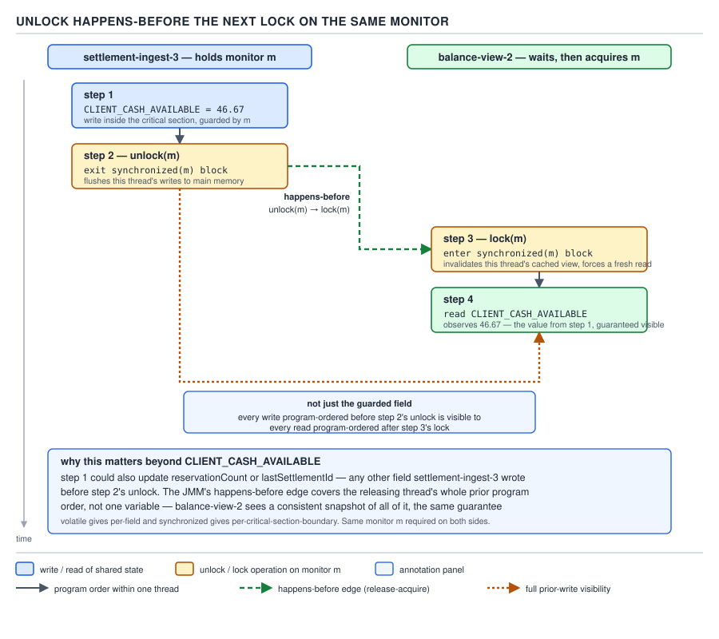
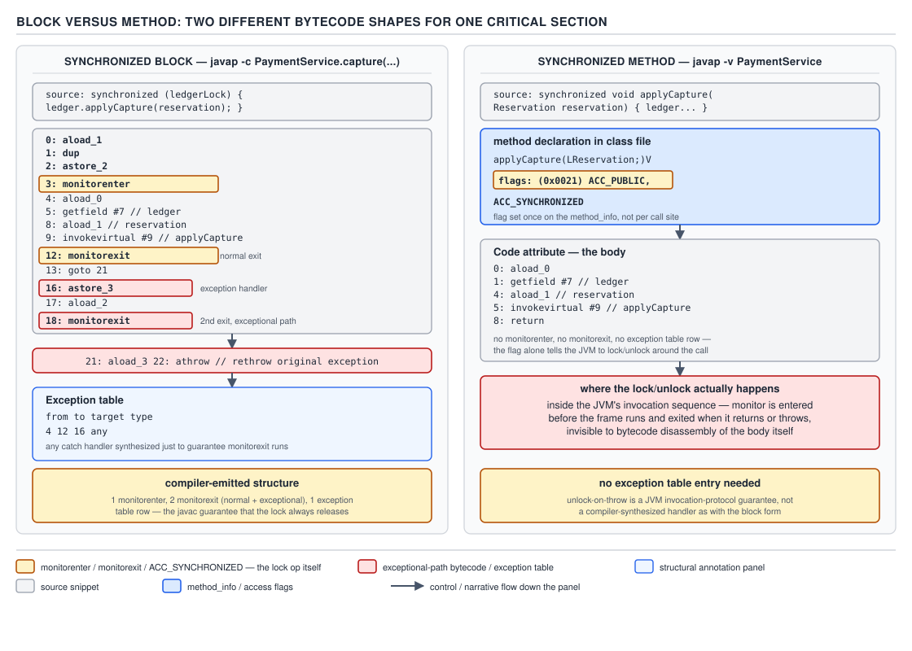

# 05 Multithreading and Concurrency — synchronized — BASICS (§1.8)

**Target version: Java 21 LTS.** | **Part 1 of 5** | [Index](../00-index.md)
Previous: [Thread safety — races and compound actions](../thread-safety/02-basics-races.md) · Next: [volatile](../volatile-and-jmm/01-basics-volatile.md)

## Every object carries a monitor

Every Java object — not every class, every *instance* — has an associated monitor: an
intrinsic lock plus a wait-set, built into the object header. You never allocate one. You
never call `new Lock()`. When `FundsLedger` is constructed, the monitor already exists,
unused, costing essentially nothing until the first thread contends for it.

`synchronized` is the keyword that asks for that monitor, and gives back two separate
guarantees. Confusing "one lock keyword" for "one guarantee" is the single most common gap
in this topic, so the two get their own heading before anything else.

### The two guarantees

#### Mutual exclusion and visibility, both, always

**Mental model.** Picture the monitor as a single door with one key. `synchronized` does two
things when a thread walks through: it locks the door behind it (nobody else gets in), and it
hands the entering thread a fully updated copy of everything the *previous* key-holder wrote,
no matter which CPU core wrote it or which core is now reading it.

**Why it exists.** Mutual exclusion alone would stop two threads from executing the guarded
code at the same time, but it would not stop a thread from reading a stale, cached copy of a
field another thread updated moments earlier under a *different* lock, or under no lock. A
regulated ledger cannot tolerate either failure: two threads racing to debit the same wallet
is a mutual-exclusion bug; one thread never seeing another's `CLIENT_CASH_AVAILABLE` write is
a visibility bug. `synchronized` was designed from the start to close both holes with one
keyword.

**When to reach for it, and when not.** Reach for `synchronized` whenever a block of code
must both run exclusively *and* publish its writes to whoever locks next — which is nearly
always true together, because exclusive code that mutates shared state is exactly the code
whose mutations need to be seen. Do not reach for it when you only need visibility and never
mutual exclusion — a single flag like "shutdown requested" wants `volatile`
([next file](../volatile-and-jmm/01-basics-volatile.md)), not a lock nobody contends. Do not
reach for it when you need timed or interruptible acquisition, multiple wait conditions, or a
try-lock — `ReentrantLock` and `ReentrantReadWriteLock` win there (§1.9).

**How it works.** Mutual exclusion is enforced by the monitor's owner field: entry blocks
until the owner is null or the calling thread already owns it (reentrancy, below). Visibility
is enforced by the JLS's happens-before relation, not by any cache-flush instruction — see
the exact rule below.

**Diagram.** See D-030 at the point that formalizes the visibility half, below.

**Concrete example.** Thread A reserves a stake and updates `CLIENT_CASH_AVAILABLE`; thread B
must never see a torn or stale value of that field once it acquires the same monitor.

```java
public final class FundsLedger {

    private final Map<ClientId, Position> positions = new HashMap<>();

    public synchronized void reserveStake(ClientId clientId, Money amount) {
        Position position = positions.get(clientId);
        position.moveToReserved(amount); // mutation guarded by `this`
    }
}
```

Any thread that later executes `synchronized (sameFundsLedgerInstance) { ... }` — including
another call to `reserveStake` — is guaranteed to see `position.moveToReserved`'s effect, not
because the JVM "flushed to main memory", but because of the rule in the next section.

**Gotcha.** Teaching or interviewing on "synchronized gives thread safety" without naming
both guarantees invites the follow-up "which one?" — and most candidates can only produce
mutual exclusion. State both, every time.

> **`synchronized` gives mutual exclusion (one thread in the guarded region per monitor) and
> visibility (writes before unlock are visible after the next lock) — never one without the
> other.**

### The formal visibility rule `[SOURCE]`

**Mental model.** Visibility is not "the JVM eventually syncs memory" — it is a specific,
one-directional edge the JLS draws between two program actions.

**Why it exists.** Without a formal rule, "visibility" is just vibes, and compilers/CPUs are
free to reorder or cache anything not pinned down. The JLS needs an exact contract so that
every JVM implementation, on every architecture, gives the same guarantee.

**When it applies.** Only between an unlock of monitor *m* and a *subsequent* lock of the
*same* m by another thread. Two threads locking two different monitors get nothing from each
other (§1.8.10, below).

**How it works — the actual text.** JLS §17.4.4 states it as a synchronizes-with edge:

> "An unlock on a monitor happens-before every subsequent lock on that monitor."

Read literally: everything thread A did — every field write, every method call's effects —
that is sequenced-before A's `monitorexit` on `m`, is guaranteed visible to thread B once B's
`monitorenter` on that same `m` succeeds. Not just the field the reader cares about — *every*
write before the unlock, transitively, through the happens-before chain.



**D-030** — Unlock happens-before the next lock.

Thread A writes `CLIENT_CASH_AVAILABLE` (and anything else) inside `synchronized (ledgerLock)`,
then unlocks. Thread B later locks the *same* `ledgerLock` and reads. The single
happens-before edge runs from A's unlock to B's lock; the second arrow in the diagram makes
the transitive point explicit — everything sequenced before the unlock, not merely the one
field, becomes visible after the lock.

**Gotcha.** This is a `synchronizes-with` edge feeding into `happens-before`, not a
memory-barrier instruction you can point at in isolation — the actual hardware fence is an
implementation detail of the JVM, invisible to the specification.

**Interview:** "Does volatile flush to main memory?" — no; neither does `synchronized`.
State visibility in happens-before terms. The cache-flush description is a myth: MESI (or an
equivalent coherence protocol) already keeps caches coherent across cores; what compilers and
CPUs reorder is the *order* memory operations become visible in, and happens-before is what
pins that order down.

> **JLS 17.4.4: an unlock of monitor *m* happens-before every subsequent lock of *m* — the
> entire formal basis for `synchronized`'s visibility guarantee.**

## Reentrancy

### Why a thread can re-lock its own monitor

**Mental model.** The monitor is not a boolean "locked/unlocked" flag — it is an
owner-thread-id plus an integer hold count. Locking when you already own it just increments
the count; unlocking decrements it; the monitor only actually releases at count zero.

**Why it exists.** Without reentrancy, a synchronized method calling another synchronized
method on the same object — the overwhelmingly common shape of layered, self-calling APIs —
would deadlock a thread against itself the instant it tried to re-enter.

**When it matters, and the sibling it beats here.** POSIX mutexes (`pthread_mutex_t` with the
default type) are **not** reentrant by default — relocking from the same thread there is
undefined behaviour, typically a self-deadlock. Java made the opposite default choice for
every intrinsic lock. `ReentrantLock` (§1.9) keeps that same reentrant default explicitly in
its name, precisely because it is not something every lock implementation gives for free.

**How it works, proved.** `[PROVE]` Consider `FundsLedger.reserveStake` calling a private
helper that is *also* `synchronized` on `this`:

```java
public final class FundsLedger {

    public synchronized void reserveStake(ClientId clientId, Money amount) {
        validateNotRestricted(clientId);
        applyReservation(clientId, amount); // re-enters `this`'s monitor
    }

    private synchronized void applyReservation(ClientId clientId, Money amount) {
        // hold count is now 2 on this thread; no other thread can be in either method
        positions.get(clientId).moveToReserved(amount);
    }
}
```

Trace the hold count: `reserveStake` entry sets owner = current thread, count = 1. Calling
`applyReservation` finds owner already equal to the current thread, so entry succeeds and
count becomes 2 — no blocking, no re-checking against other threads. `applyReservation`
returns, count drops to 1. `reserveStake` returns, count drops to 0, and only *then* is the
monitor released for any other thread waiting on it. If reentrancy were absent, step two would
block forever waiting for a lock the same thread already holds — a self-deadlock, by
definition, since nothing else can ever unlock it.

**Why it is necessary, proved.** `[PROVE]` The forcing case is inheritance. Suppose a
subclass overrides a synchronized method and calls `super.method()`:

```java
class AuditingFundsLedger extends FundsLedger {
    @Override
    public synchronized void reserveStake(ClientId clientId, Money amount) {
        recordAuditEntry(clientId, amount);
        super.reserveStake(clientId, amount); // same `this`, same monitor
    }
}
```

`this` is one object with one monitor, regardless of how many classes in the hierarchy
declare `synchronized` methods on it. The overriding method locks `this`, then calls into
`super.reserveStake`, which also locks `this` — same object, same monitor, same thread. Without
reentrancy this exact override-then-call-super shape, which is completely ordinary
object-oriented code, would self-deadlock every time a synchronized method is overridden and
its override calls up the hierarchy. Reentrancy is not a convenience feature; it is what makes
inheritance and synchronized coexist at all.

**Gotcha.** A hold count is *per thread*, not per call site — recursive calls, mutual calls
between two synchronized methods on the same object, and override-then-super-call all share
one counter. It only reaches zero, and only then releases the monitor, when every nested entry
by that thread has had a matching exit.

> **Reentrancy: an intrinsic lock records owner-thread-id and a hold count, so the same thread
> may re-acquire a monitor it already holds — required for self-calls and for
> override-then-`super.method()` not to self-deadlock.**

## The three monitors `synchronized` can take

There are exactly three syntactic forms, and each one locks a *different* object. Getting this
table wrong is the root cause of most `synchronized` bugs in production code.

| Syntax | Monitor taken | What it excludes | What it does **not** exclude |
|---|---|---|---|
| `synchronized void reserve()` (instance method) | `this` | Other calls to any `synchronized` instance method on the same `FundsLedger` instance | Calls on a *different* `FundsLedger` instance; any `static synchronized` method |
| `static synchronized void audit()` (static method) | `FundsLedger.class` (the one `Class` object shared by all instances) | Other calls to any `static synchronized` method on `FundsLedger` | Any instance-level `synchronized` call, on any instance |
| `synchronized (lock) { }` (block, `lock` a named field) | the object referenced by `lock` at entry time | Anything else that locks that same object reference | Anything locking a different object — including `this` or `FundsLedger.class` |
| — (stated as its own row) | — | — | **An instance method and a static method of the same class never exclude each other** — `this` and `FundsLedger.class` are two different objects with two different monitors, full stop |

**D-027** — The three monitors `synchronized` can take.

**Pitfall:** the belief that "everything synchronized on `FundsLedger` serializes" is false the
moment one method is `static synchronized` and another is instance `synchronized`. A thread
inside `audit()` (holding `FundsLedger.class`) and a thread inside `reserveStake()` (holding a
`FundsLedger` instance) run *concurrently*, unblocked by each other, even though both methods
belong to the same class. If `audit()` reads ledger totals while `reserveStake()` mutates
them, that is a live race hiding behind two `synchronized` keywords that look protective and
are not. The fix is to pick one monitor for both — usually make `audit()` synchronize on the
same instance, or on a shared `private static final Object` if the audit is genuinely
class-wide.

**Interview:** "Do `synchronized` instance methods and `synchronized` static methods on the
same class block each other?" — no; they lock `this` and `Class` respectively, two different
objects, so state that fact and immediately name the fix (same monitor for both) rather than
just diagnosing the trap.

## Four ways to lock on the wrong object

`[X-REF 03]` `[TRAP]` The full set of interned/cached/shared-object hazards — string interning,
`Integer` boxing cache ranges, and class-loading identity — is covered in guide 03; here is the
`synchronized`-specific consequence of each.

| Wrong object | What the reader believes | What actually happens | Symptom | Fix |
|---|---|---|---|---|
| A non-`final` lock field, later reassigned | "One lock, guarding this field, for the object's life" | Threads already waiting hold a reference to the *old* object; a thread that reads the field after reassignment locks the *new* one | Two threads both "inside" the guarded section at once, on what looks like the same lock | `private final Object lock = new Object();` — assign once, in the field initializer or constructor, never reassign |
| A `String` literal, e.g. `synchronized ("ledger-lock")` | "A private lock, unique to my class" | String literals are interned; any other code in the same JVM using the identical literal locks the same object | Unrelated, unowned code deadlocks or serializes with yours, with no visible connection | `private final Object lock = new Object();` |
| A boxed `Integer` in −128..127, e.g. `synchronized (clientCount)` where the value is small | "A fresh object per value" | `Integer.valueOf` caches that range; every `Integer` with the same small value *is* the same object | Threads locking on logically-unrelated counters that happen to share a small value contend with each other | Never lock on a boxed primitive; use `private final Object lock = new Object();` |
| `Boolean.TRUE` / `Boolean.FALSE` | "A lightweight flag object to lock on" | Both are JVM-wide singletons — every `Boolean.TRUE` anywhere is the same reference | Same as above: unrelated code sharing one of two possible objects | `private final Object lock = new Object();` |
| A `Class` object you do not own, e.g. `synchronized (String.class)` | "A stable, always-available lock" | Any other code in the process — including JDK internals or third-party libraries — can lock the identical `Class` object | Deadlock or serialization with code you have never seen and cannot change | Lock on a `Class` object your own code declares, or better, a dedicated `Object` |
| Two threads synchronizing on genuinely *different* objects when they mean to guard the same state | "Both threads are locked, so we're safe" | No shared monitor means no mutual exclusion and no happens-before edge between them at all | A silent race — no exception, no deadlock, just wrong values (§1.8.10 in the syllabus) | Every reader and writer of a piece of shared state must agree, in code, on exactly one lock object |

**D-029** — Four ways to lock on the wrong object.

**Pitfall:** all four rows share one root cause — using an object as a lock because it happens
to be *available*, not because it is *owned*. The one universal fix, worth memorizing as a
single line, is `private final Object lock = new Object();`: a dedicated, `final`, never-shared
object whose sole purpose is being a monitor.

**Insight:** the shared-object rows (string literal, cached `Integer`, `Boolean.TRUE`, foreign
`Class`) are all instances of the same underlying mistake — Java's identity-based locking means
*any* two references that resolve to the same object at runtime are interchangeable as
monitors, whether or not the code that holds them knows about each other. `synchronized` has no
concept of "this lock belongs to me"; that ownership is a discipline the caller must supply.

## Block versus method: two different bytecode shapes `[SOURCE]` `[PROVE]`

**Mental model.** A synchronized *block* is two explicit instructions wrapped around a body —
the JVM literally executes "acquire", then the body, then "release". A synchronized *method*
carries no such instructions at all; it is a single flag on the method's access modifiers that
tells the JVM to acquire and release automatically, invisibly, around the whole call.

**Why it exists.** The block form needs an explicit monitor reference (`lock`, `this`,
whatever expression appears in the parentheses) and an explicit region, so the compiler has to
emit paired instructions bracketing that region. The method form's monitor is always implicit
(`this` or the `Class` object) and its region is always the entire method body, so the JVM can
fold the whole thing into a single bit checked at invocation and return — no bytecode needed
in the method body at all.

**How it works — read the actual output.** Compile a stake-reservation ledger with both a
synchronized block and a synchronized method:

```java
public final class FundsLedger {

    private final Object lock = new Object();
    private final Map<ClientId, Position> positions = new HashMap<>();

    public void reserveStakeBlock(ClientId clientId, Money amount) {
        synchronized (lock) {
            positions.get(clientId).moveToReserved(amount);
        }
    }

    public synchronized void reserveStakeMethod(ClientId clientId, Money amount) {
        positions.get(clientId).moveToReserved(amount);
    }
}
```



**D-028** — Block versus method: two different bytecode shapes.

`javap -c` on `reserveStakeBlock` shows the block compiling to explicit `monitorenter` /
`monitorexit` pairs, plus a *second*, synthetic `monitorexit` reachable only from an exception
path:

```
public void reserveStakeBlock(ClientId, Money);
  Code:
     0: aload_0
     1: getfield      #7   // Field lock:Ljava/lang/Object;
     4: dup
     5: astore_3
     6: monitorenter
     7: aload_0
     8: getfield      #2   // Field positions:Ljava/util/Map;
    11: aload_1
    12: invokeinterface #8, 2 // Map.get
    17: checkcast     #9    // Position
    20: aload_2
    21: invokevirtual #10   // Position.moveToReserved
    24: aload_3
    25: monitorexit
    26: goto          34
    29: astore        4
    31: aload_3
    32: monitorexit
    33: aload         4
    35: athrow
    36: return
  Exception table:
     from    to  target type
        7    26    29   any
```

Every line explained: instructions 0–5 push `this.lock` onto the stack twice, storing one copy
in local slot 3 for later release. Instruction 6, `monitorenter`, is the acquire. 7–21 are the
guarded body. Instruction 25 is the *normal-path* `monitorexit`, followed by `goto` past the
handler. Instructions 29–35 are the compiler-generated exception handler: if anything in 7–26
threw, control lands at 29, the same lock (from slot 3) is released at instruction 32, and the
original exception is rethrown at 35 rather than swallowed. The exception table entry
`7 26 29 any` is what routes any thrown exception in that range to the handler. This paired
structure is exactly why a synchronized block always releases its lock, exception or not — the
compiler, not the JVM's monitor mechanism, guarantees it, by duplicating the release.

`javap -v` on `reserveStakeMethod` shows no monitor bytecode in the body at all — the guarantee
lives entirely in the method's access flags:

```
public synchronized void reserveStakeMethod(ClientId, Money);
  descriptor: (LClientId;LMoney;)V
  flags: (0x0021) ACC_PUBLIC, ACC_SYNCHRONIZED
  Code:
     0: aload_0
     1: getfield      #2   // Field positions:Ljava/util/Map;
     4: aload_1
     5: invokeinterface #8, 2 // Map.get
    10: checkcast     #9    // Position
    13: aload_2
    14: invokevirtual #10   // Position.moveToReserved
    17: return
```

The `ACC_SYNCHRONIZED` bit (0x0020, combined here with `ACC_PUBLIC`'s 0x0001) tells the JVM's
method-invocation logic to acquire `this`'s monitor before running instruction 0 and release it
after instruction 17 or on any exception unwinding out of the frame — entirely outside the
`Code` attribute, and therefore invisible to `javap -c` of the body.

**Gotcha.** Reading only `javap -c` on a synchronized method shows *nothing* — no
`monitorenter`, no exception table — which surprises people expecting symmetry with the block
form. The guarantee is real; it is just not expressed as bytecode at all, only as a class-file
flag the JVM's invocation path checks.

**Interview:** "Does a synchronized method compile to `monitorenter`/`monitorexit`?" — no; only
the block form does. The method form sets `ACC_SYNCHRONIZED` and the JVM handles acquire/release
around the call itself.

> **A synchronized block emits `monitorenter`/`monitorexit` pairs plus a synthetic
> exception-path `monitorexit`; a synchronized method emits no monitor bytecode at all — it
> sets `ACC_SYNCHRONIZED` and the JVM enforces the same guarantee around the whole call.**

## Supporting facts

**Lock granularity.** Synchronizing the entire method serializes everything inside it, including
work untouched by shared state. The target is the narrowest block that still preserves the
invariant — narrowing past that (say, splitting `position.moveToReserved` from a later read of
the same position into two separate blocks) reintroduces the race the lock existed to close.
**Pitfall:** treating "smaller block" as an unconditional improvement; check what invariant
spans which statements first.

> **Lock granularity: the narrowest block that still keeps every operation touching the same
> invariant inside one critical section — no narrower.**

**Never hold a lock across I/O or unknown code.** Holding `FundsLedger`'s monitor while calling
the PSP, sleeping, or invoking a caller-supplied callback turns a fast in-memory critical
section into one bounded by an external system's latency — every other thread needing that
monitor queues behind a network call, and a re-entrant callback risks deadlock.

> **Never hold a monitor across I/O, `sleep`, a network call, or a callback into code you do
> not control.**

**Static synchronized methods and the class-init lock are not the same lock.** `[TRAP]`
`static synchronized void audit()` locks the `Class` object as a regular, `synchronized`-syntax
monitor. Class *initialization* (running static initializers the first time a class is used) is
guarded by a separate, JVM-internal lock never reached via `synchronized` syntax — conflating
the two produces wrong reasoning about static-initializer deadlocks versus ordinary
`static synchronized` contention.

> **`FundsLedger.class` as a `static synchronized` monitor and the JVM's class-initialization
> lock are two different mechanisms.**

**Illegal and meaningless placements.** `[TRAP]` `[RESEARCH]` `synchronized` on a constructor is
a compile error — no other thread can hold a reference before construction finishes, so there is
nothing to exclude. On an `abstract` method it is compiler-rejected: no body to guard, not part
of the signature, not inherited by overrides — each override must restate it. Verified against
`javac` on JDK 21: both are compile-time errors, not warnings.

> **`synchronized` is illegal on constructors and rejected on abstract methods.**

**Nested synchronized blocks — the entry point to lock ordering (§1.28).** Two nested blocks
acquiring two monitors in different orders on different threads is the classic deadlock setup —
e.g. a wallet-to-wallet transfer locking source then destination while a concurrent reverse
transfer locks destination then source. §1.28 covers lock ordering, `tryLock`, and deadlock
detection in full.

## `[VERSION-TRAP]` `synchronized` and virtual threads

**On Java 21**, a virtual thread that blocks inside a `synchronized` block or method **pins**
its carrier platform thread: the carrier cannot return to the `ForkJoinPool` carrier pool while
the virtual thread waits, because the monitor implementation could not unmount a virtual thread
mid-acquisition. A `FundsLedger` guarded entirely by `synchronized` and hammered by thousands of
virtual threads can exhaust the small, CPU-core-sized carrier pool even though virtual threads
themselves are cheap. Java 21 ships `-Djdk.tracePinnedThreads` (`full` or `short`) to surface
these pinning sites.

**Verified:** [JEP 491](https://github.com/openjdk/jdk) ("Synchronize Virtual Threads without
Pinning"), targeted for JDK 24, changes the monitor implementation so blocking on a monitor no
longer pins the carrier — `synchronized` and virtual threads compose the way `ReentrantLock`
and virtual threads already did, and `-Djdk.tracePinnedThreads` was removed alongside it once
its diagnostic stopped being a distinct condition. `openjdk.org`'s JEP page returns HTTP 403 in
this environment; the description above is cross-checked against JDK release engineering
material on `github.com/openjdk/jdk` instead.

This makes "just use `ReentrantLock` instead of `synchronized` under virtual threads" a
**version-scoped** answer: right for code that must run on Java 21, unnecessary for Java 24+.

**Pitfall:** repeating the "avoid `synchronized` with virtual threads" rule without a version
qualifier. On Java 21 it is the right operational guidance; stated as a permanent language fact
it goes stale the moment a codebase upgrades past JDK 24.

**Interview:** "Should you avoid `synchronized` with virtual threads?" — on Java 21, yes,
because it pins the carrier; state the version, then name JEP 491 (targeted JDK 24) as the fix
that removes the underlying cause rather than merely working around it.

> **Java 21: `synchronized` pins a virtual thread's carrier for the duration of the block.
> JEP 491 (JDK 24) removes that pinning at the JVM level, and `-Djdk.tracePinnedThreads` was
> removed alongside it.**

## Pitfalls

### Believing `synchronized` only gives mutual exclusion

**Wrong**
```java
public synchronized void reserveStake(ClientId clientId, Money amount) {
    positions.get(clientId).moveToReserved(amount);
}
// "This just stops two threads running at once — nothing about what they see."
```
Treating the lock as pure serialization, a reader assumes a separate `volatile` or explicit
memory barrier is still needed for another thread to see `moveToReserved`'s effect. That belief
produces defensive, redundant `volatile` fields "just in case", or worse, unguarded reads
outside any `synchronized` block on the theory that the writer's lock "only" excluded other
writers.

**Right**
```java
public synchronized void reserveStake(ClientId clientId, Money amount) {
    positions.get(clientId).moveToReserved(amount);
}
// Any thread that later synchronizes on `this` sees this write, per JLS 17.4.4 — no extra
// volatile or barrier needed, provided every reader also synchronizes on the same monitor.
```

**Why people believe it:** "lock" and "mutex" are taught first in an OS-course framing that
foregrounds serialization and treats memory visibility as a separate, unrelated hardware
concern — so the visibility half of `synchronized`'s contract gets learned late, or never.

### Assuming an instance method and a static method on the same class exclude each other

**Wrong**
```java
public synchronized void reserveStake(ClientId clientId, Money amount) { /* ... */ }
public static synchronized void audit() { /* reads across all positions */ }
// "Both are synchronized on FundsLedger, so audit() can't run while a reservation is in flight."
```
`reserveStake` locks the instance; `audit` locks `FundsLedger.class`. They run concurrently.
`audit` can observe a ledger mid-reservation — a torn read across positions that individually
look consistent but collectively are not.

**Right**
```java
private static final Object AUDIT_LOCK = new Object();
public synchronized void reserveStake(ClientId clientId, Money amount) { /* ... */ }
public static void audit() {
    synchronized (AUDIT_LOCK) { /* still not the same monitor as instance calls — */ }
}
// The real fix is structural: give audit() and reserveStake() one shared monitor,
// e.g. make audit() an instance method synchronized on the same FundsLedger it reads.
```

**Why people believe it:** the word "synchronized" appears on both declarations, and readers
generalize "same keyword, same class" into "same lock" without checking which object each form
actually resolves to.

## Cheat sheet

| Fact | Detail |
|---|---|
| Two guarantees | Mutual exclusion **and** visibility — always both |
| Visibility rule | JLS 17.4.4: unlock of *m* happens-before every subsequent lock of *m* |
| Three monitors | instance method → `this`; static method → `Class`; block → named object |
| Instance vs static | Never exclude each other — different monitors |
| Reentrancy | Owner + hold count per thread; needed for self-calls and `super.method()` |
| POSIX contrast | `pthread_mutex_t` default is non-reentrant; Java's intrinsic locks are |
| Wrong-lock family | Reassignable field, `String` literal, cached `Integer` (−128..127), `Boolean.TRUE`, foreign `Class` |
| Universal fix | `private final Object lock = new Object();` |
| Block bytecode | `monitorenter` / `monitorexit` + synthetic exception-path `monitorexit` + exception table |
| Method bytecode | No monitor bytecode — `ACC_SYNCHRONIZED` flag only |
| Never hold lock across | I/O, network calls, `sleep`, unknown callbacks |
| Constructor / abstract | Illegal on constructors; compiler-rejected on abstract methods |
| Class-init lock | Distinct from `Class`-object-as-monitor via `static synchronized` |
| Virtual threads, Java 21 | `synchronized` pins the carrier thread |
| Virtual threads, Java 24+ | JEP 491 removes pinning; `-Djdk.tracePinnedThreads` removed with it |

## Self-test

**Q1.** Name both guarantees `synchronized` provides, and state which one is most often
forgotten.

<details><summary>Answer</summary>

Mutual exclusion and visibility. Visibility — JLS 17.4.4's happens-before edge from unlock to
subsequent lock — is the one candidates most often omit, describing `synchronized` as "just" a
mutex.

</details>

**Q2.** `FundsLedger` has `synchronized void reserveStake()` and `static synchronized void
audit()`. Can they run at the same time on the same instance? Why?

<details><summary>Answer</summary>

Yes. `reserveStake` locks the instance (`this`); `audit` locks `FundsLedger.class`. These are
two different objects with two different monitors, so neither call blocks the other.

</details>

**Q3.** Why is reentrancy necessary for `synchronized` to work with inheritance?

<details><summary>Answer</summary>

An overriding method that is itself `synchronized` on `this` and calls `super.method()` (also
`synchronized` on the same `this`) would self-deadlock without reentrancy — the same thread
would block waiting for a monitor it already holds. Reentrancy lets the same thread re-enter
via an owner-plus-hold-count scheme, only actually releasing when the count returns to zero.

</details>

**Q4.** Give three objects that look like safe, private lock targets but are actually
JVM-wide shared objects, and the one-line fix.

<details><summary>Answer</summary>

A `String` literal (interned), a boxed `Integer` in −128..127 (cached by `Integer.valueOf`),
and `Boolean.TRUE`/`Boolean.FALSE` (singletons). Also a `Class` object you do not own. Fix:
`private final Object lock = new Object();`.

</details>

**Q5.** Two threads each call `synchronized (objA)` and `synchronized (objB)` respectively,
where `objA != objB`, to guard the same shared field. What do they actually get?

<details><summary>Answer</summary>

Nothing — no mutual exclusion and no happens-before edge, because JLS 17.4.4 only applies
between an unlock and a subsequent lock of the *same* monitor. This is a silent race: no
exception, just possibly-stale or interleaved values.

</details>

**Q6.** On Java 21, why does putting `FundsLedger.reserveStake` behind `synchronized` matter
differently for virtual threads than for platform threads?

<details><summary>Answer</summary>

A virtual thread blocking on `synchronized` pins its carrier platform thread — the carrier
cannot be released back to the pool while the virtual thread waits — so heavy contention on a
`synchronized`-guarded ledger can exhaust the small carrier pool even though virtual threads
themselves are cheap. A platform thread has no carrier to pin; it simply blocks. This is fixed
at the JVM level by JEP 491, targeted for JDK 24.

</details>

---

**Leaves covered:** 1.8.1–1.8.18 (18 leaves)
**Leaves deferred:** none
**Diagrams included:** D-027, D-028, D-029, D-030
**Target version:** Java 21 LTS
**Lines:** 600
