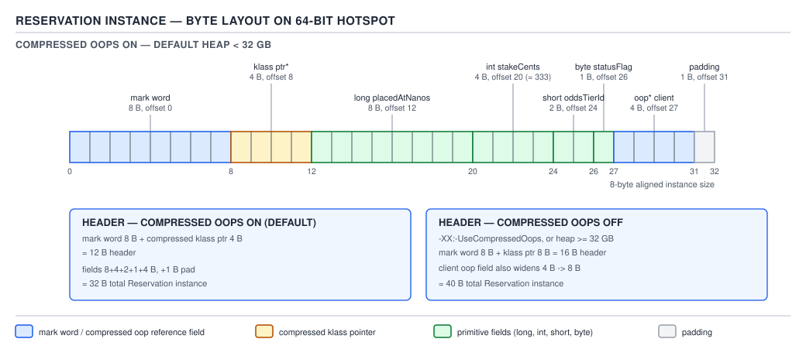
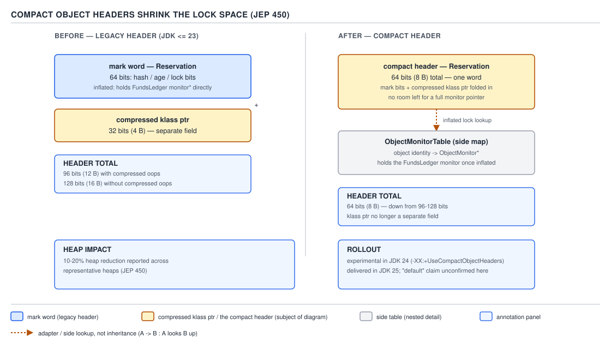

# 05 Multithreading and Concurrency — synchronized — INTERNALS (§3.1)

**Target version: Java 21 LTS.** | **Part 3 of 5** | [Index](../00-index.md)
Previous: [Part 2 interview wrap-up](../91-interview-intermediate.md) · Next: [Monitor implementation — thin locks, inflation, ObjectMonitor](03-internals-monitors.md)

Every `synchronized` block operates on two words hidden in front of every object. Before
looking at how the monitor itself works (next file), you have to know where the lock *state*
actually lives: not in some side table, but packed into the object's own header, sharing space
with the object's identity hash and, on Java 25, part of the class pointer too. This file is
the source walk for that header — byte by byte, bit by bit.

### The 64-bit object header, field by field

**Mental model.** Every object on the heap is preceded by a small, fixed-size prefix that has
nothing to do with the object's own fields. Think of it as the object's ID card, stapled to the
front: what kind of thing this is (the klass pointer) and what's currently going on with it
(the mark word — its lock state, its identity hash, its GC age). The object's declared fields
start only after that prefix.

**Why it exists.** HotSpot needs, for every single object, fast answers to three unrelated
questions — "what class is this", "am I locked and by whom", "what's my `hashCode()`" — without
a side lookup table. A side table would mean an extra pointer chase and an extra allocation per
object; folding the answers into a fixed prefix means the JIT can read them with one load at a
known offset.

**When you'd reach for this knowledge, and when you wouldn't.** You never manipulate the header
directly from Java code — there is no accessor. You reach for this model when you're explaining
*why* `synchronized` has near-zero cost in the uncontended case (Part 3.2), why identity hash
computation has a locking cost (3.1.4 below), or why packing fields tightly still leaves gaps
(3.1.8 below). If the question is "how big is my object", the honest sibling is a profiler or
JOL (3.1.7) — reasoning from the layout rules by hand is for understanding, not for production
sizing.

**How it works.** On 64-bit HotSpot with compressed oops (the default up to a 32 GB heap), the
header is:

| Region | Size | Contents |
|---|---|---|
| Mark word | 8 B | Lock state, identity hash, GC age (§3.1.2) |
| Klass pointer | 4 B (compressed) / 8 B (uncompressed, `-XX:-UseCompressedOops` or heap > 32 GB) | Points at the `Klass` metadata for this object's class |

`[NUM]` Header size is therefore **12 B with compressed oops, 16 B without** — exactly the
totals your row specifies, and the number every "why is my object bigger than I thought"
question comes back to.

After the header come the declared fields, in HotSpot's chosen order (3.1.8), then padding to
bring the whole instance to an 8-byte boundary — required because every object must start on an
8-byte-aligned address for compressed-oops arithmetic to work (a compressed oop is a heap
address divided by 8).



**D-145** — The object header on 64-bit HotSpot.

**A concrete `Reservation` instance.** A stake reservation is held in memory as:

```java
final class Reservation {
    private long reservedAtEpochMillis;   // 8 B — long
    private int amountMinorUnits;         // 4 B — int, e.g. 420 for a 4.20 stake
    private short retryCount;             // 2 B — short
    private byte statusCode;              // 1 B — byte, e.g. RESERVED = 1
    private ClientId clientId;            // 4 B compressed oop
    private Money cashPortion;            // 4 B compressed oop
    private Money bonusPortion;           // 4 B compressed oop
}
```

`[NUM]` Laid out by size class (3.1.8), the instance is:

```
mark word          8 B
klass pointer       4 B   (compressed)
reservedAtEpochMillis 8 B   (long)
amountMinorUnits    4 B   (int)
retryCount          2 B   (short)
statusCode          1 B   (byte)
padding             1 B   (align next field, a 4-byte oop, to a 4-byte boundary)
clientId            4 B   (oop)
cashPortion         4 B   (oop)
bonusPortion        4 B   (oop)
----------------------------------
subtotal           40 B   -> already an 8-byte multiple, no trailing pad
```

Without compressed oops, the klass pointer becomes 8 B and each oop field becomes 8 B:
`8 (mark) + 8 (klass) + 8 (long) + 4 (int) + 2 (short) + 1 (byte) + 1 (pad) + 8 + 8 + 8 = 56 B`
— also already 8-byte aligned. Two harmless-looking reference fields cost 12 extra bytes per
instance the moment the heap crosses 32 GB, multiplied by 2.8M stake reservations/day if you
retained every one in memory.

**The gotcha.** People estimate object size as "sum of my declared field types" and forget the
header entirely. A `Reservation` with three `long` fields and nothing else is never 24 B — it's
at least 32 B (12 B header, rounded to 16, plus 24 B fields, rounded to 40 total) before you've
written a single line of business logic.

> **Definition.** The object header is a fixed 12-or-16-byte prefix — a mark word plus a klass
> pointer — that every heap object carries ahead of its own fields, holding lock state, identity
> hash, GC age and runtime type, all without a side table.

### The mark word is multiplexed

**Mental model.** The mark word is not a struct with named fields for "lock state" and "hash"
living side by side — it is the *same 64 bits* reinterpreted depending on two low tag bits,
like a tagged union in C. What the upper 62 bits mean depends entirely on what the tag says the
object is currently doing.

**Why it exists.** An object spends most of its life in exactly one of a handful of mutually
exclusive states — unlocked-and-maybe-hashed, briefly stack-locked, contended and monitor-
backed, or mid-GC-relocation — and those states never overlap in time for a given object. Rather
than reserve separate storage for each (which would bloat every object's header for states it
is in 0.01% of the time), HotSpot reuses one 64-bit slot and lets the tag bits say which
interpretation currently applies.

**When this matters versus when it doesn't.** You need this model the moment you're reasoning
about lock cost, `hashCode()` cost, or reading a `jstack`/JOL dump. You do not need it to write
correct `synchronized` code — the JLS-level `happens-before` contract (Part 1 of this set) is
sufficient for correctness. This is "how", not "what you must know to be correct."

`[PROVE]` **How it works — walking the states.** Fix the low 2 bits as the tag (`lock_bits = 2`,
`lock_shift = 0` in `markWord.hpp`) and reason about what the remaining 62 bits *must* hold in
each case:

- **Unlocked / neutral** — nothing is contending for this object and no monitor exists. The
  remaining bits are free for bookkeeping HotSpot actually needs on an idle object: the GC age
  (how many minor collections it has survived) and, once requested, the 31-bit identity hash
  from `System.identityHashCode`. Tag `01`.
- **Stack-locked (lightweight)** — a single thread holds the lock uncontended. The thread has a
  `BasicLock` record on its own stack; the mark word just needs to point at it so anyone who
  looks (a JIT unlock, a JVM-internal check) can find the lock record and, through it, the
  original ("displaced") header. A pointer is naturally low-bit-aligned (objects and stack
  frames are word-aligned), so the low bits are free for the tag. Tag `00`.
- **Inflated (monitor)** — contention happened, or something forced a heavyweight lock (3.1.4).
  Now the mark word holds a pointer to a heap-allocated `ObjectMonitor`, which itself has room
  for an owner thread, a wait set, an entry queue, and — critically — a copy of the original
  header's hash/age bits, so nothing is lost by inflating. Tag `10`.
- **Marked / forwarded** — a moving GC (G1, Shenandoah) is relocating this object. The mark word
  temporarily holds a forwarding pointer to the new location so anyone still holding the old
  address gets redirected. Tag `11`.

`[SOURCE]` `[RESEARCH]` Confirmed against `markWord.hpp` at `jdk-21+35`
(`raw.githubusercontent.com/openjdk/jdk`):

```cpp
static const uintptr_t locked_value    = 0;  // 00 — stack-locked (lightweight)
static const uintptr_t unlocked_value  = 1;  // 01 — neutral / hash+age
static const uintptr_t monitor_value   = 2;  // 10 — inflated, ObjectMonitor*
static const uintptr_t marked_value    = 3;  // 11 — GC forwarding pointer
static const int lock_bits  = 2;
static const int lock_shift = 0;
```

That is the encoding table below — every row of it traces to one of those four constants, and
there is no fifth "biased" tag: biased locking was disabled by default in JDK 15 (JEP 374) and
removed outright afterward, so a JDK 21 mark word only ever carries these four meanings.

**D-146** — The mark word is multiplexed.

| Tag bits | State | Remaining 62 bits hold | Transition into this state |
|---|---|---|---|
| `01` | Unlocked / neutral | Identity hash (once computed) + GC age | Object allocated; or unlock with no waiters and no stored hash |
| `00` | Lightweight (stack-locked) | Pointer to a `BasicLock` on the owning thread's stack | Uncontended `monitorenter` on a neutral, unhashed object |
| `10` | Inflated (monitor) | Pointer to a heap-allocated `ObjectMonitor` | Contention on a stack-locked object, a wait/notify call, or a hash requested on an already-locked object (3.1.4) |
| `11` | Marked / forwarded (GC) | Forwarding pointer to the relocated copy | A moving collector relocates the object |

**The gotcha.** The tag alone doesn't tell you *whose* lock it is when stack-locked — you have
to dereference the `BasicLock` pointer into the owning thread's stack, which is exactly why a
`jstack` dump showing "locked by thread T" for a stack-locked object is doing real pointer-
chasing work, not a field read.

> **Definition.** The mark word is one 64-bit field per object whose meaning is selected by its
> low 2 tag bits — unlocked, stack-locked, monitor-inflated, or GC-forwarded — never more than
> one at a time.

### Calling `identityHashCode` can force a lock-state change

**Mental model.** The identity hash isn't computed at object creation and cached somewhere
neutral — it's computed lazily, on first use, and it has to be *written into the mark word*,
because that's the only place a "neutral" object has to keep it. If the object happens to be
locked when you ask, there's a problem: the mark word is currently busy meaning something else.

**Why this is worth a whole beat.** It's the sharpest example in this file of "how it works"
leaking into "what it costs." A pure, side-effect-free-looking call like `hashCode()` can
silently and permanently change how expensive future locking on that object is, for the rest of
its life.

**When it bites, and the alternative.** It bites exactly when code both locks an object *and*
calls its default `hashCode()` (directly, or indirectly via `IdentityHashMap`, default
`Object.equals`/`hashCode` in a `HashSet`, or logging that prints the object). The escape hatch
is simple: never rely on identity hash for objects you also use as lock targets — use a
dedicated private lock object (already the correct pattern for encapsulation reasons — Part
3.2) or override `hashCode()` on the domain type so the JVM's identity-hash machinery is never
invoked on it at all.

`[PROVE]` **Working it through.** Take a `Reservation` used as its own lock:

```java
synchronized (reservation) {
    // holding the stake reserved while the Quiz Engine round is open
}
```

Case A — nobody has ever called `reservation.hashCode()` (or `System.identityHashCode`). The
first `monitorenter` finds a neutral mark word (`01`, hash field all zero — "no hash yet") and
takes the cheap path: install a `BasicLock` on the current thread's stack, CAS the object's mark
word to point at it, tag `00`. Cheap, uncontended, no heap allocation.

Case B — some earlier code called `System.identityHashCode(reservation)`. That call needed
somewhere to put the 31-bit hash *right now*, on a neutral object, so it wrote it into the mark
word's neutral-state bits and left the tag at `01`. The object is unlocked but now "hash-
bearing." Now `monitorenter` runs. The fast, stack-locking path works by CASing the mark word to
point at a `BasicLock`, and *restoring* it later from that `BasicLock`'s copy of the displaced
header — that would actually preserve the hash bits just fine on unlock. The real obstacle is
availability while locked: a `BasicLock` lives on one thread's stack, reachable only while that
frame is live. If a second thread calls `identityHashCode` on the same object while it's stack-
locked, it has to find the hash *now*, from a possibly-different, arbitrary thread's stack frame
— an operation the JVM does not perform. An `ObjectMonitor`, by contrast, is a heap object,
reachable from any thread at any time. So HotSpot's rule is: **once an object carries an
installed hash, it is never stack-locked again — locking it goes straight to inflation**, tag
`10`, hash and all copied into the `ObjectMonitor`, permanently reachable regardless of which
thread currently owns the lock.

`[NUM]` The cost difference is a real, measurable one, though only nameable as order of
magnitude — there is no authoritative per-instruction table for this. Stack-locking is a single
uncontended CAS, on the order of tens of nanoseconds. Forced inflation additionally allocates
(or recycles from a free list) an `ObjectMonitor`, on the order of one to two orders of
magnitude more expensive for that one call — and every subsequent lock/unlock on that object now
takes the (still fast, but heavier) monitor path instead of the stack-lock path for the rest of
the object's life, because nothing ever de-inflates a monitor back to stack-locking.

**Pitfall:** logging a lock target — `log.debug("locking {}", reservation)` where the default
`toString()` calls `hashCode()` — silently and permanently upgrades that object to monitor-
backed locking. The symptom is a lock that used to be "free" showing up as measurably heavier
under contention once someone adds a debug log line, with no change to the locking code itself.
The fix: never let a lock target's default `hashCode()`/`toString()` run, whether by using a
dedicated lock object that is never logged, or by overriding `hashCode()` so identity hashing
never triggers on it.

> **Definition.** Because the identity hash and the lock state share the same 64 bits, computing
> `System.identityHashCode` on an object installs the hash into its mark word and permanently
> forecloses the cheap stack-locking path for that object — forcing every future lock to inflate
> to a full `ObjectMonitor`.

### Compact object headers shrink the lock space

**Mental model.** Instead of a mark word and a klass pointer sitting side by side as two
separate fields, fold the (compressed) klass pointer *into* the mark word itself, so the whole
header — identity, lock state, class — fits in one 64-bit word instead of two.

**Why it exists.** The klass pointer is 4 B compressed but the header still burns 12–16 B
total; on a heap dominated by small objects (exactly QuizStakes's shape — `Reservation`,
`Money`, `LedgerEntry` are all small), header overhead is a meaningful fraction of total heap.
Shrinking it to 8 B per object, uniformly, buys back real space without touching a single
declared field.

**When it applies, and its cost.** This only exists from JDK 24 onward, and only as an opt-in
flag until 25; on JDK 21 (this file's target version) there is no compact header and the 12/16 B
figures above are the whole story. The tradeoff it introduces: with the mark word now also
carrying the class identity, there is *less* room left for lock-state pointers, which is why
compact headers ship with a redesigned monitor path rather than reusing the JDK 21 in-mark-word
`BasicLock`/`ObjectMonitor` pointer scheme unchanged.

**How it works.** `[VERSION-TRAP]` On JDK 21, the header is two fields: an 8 B mark word plus a
4 B (compressed) or 8 B (uncompressed) klass pointer — 12–16 B as derived above. `[NUM]`
`[RESEARCH]` JEP 450 introduced **compact object headers as experimental in JDK 24**; JEP 519
made them **delivered (shippable, no longer experimental) in JDK 25**. The compressed klass
pointer moves into spare bits of the mark word itself, collapsing the two-field, 12–16 B header
into a single 8 B word. Because the klass pointer now occupies bits that used to be free for a
`BasicLock*` or `ObjectMonitor*`, those pointers no longer fit directly in the header; lock state
for inflated objects is tracked instead through a side structure — an `ObjectMonitorTable` —
keyed by the object's identity rather than pointed to from inside the header. Sun/Oracle's own
figures cite **10–20% heap-size reduction** on typical object-heavy workloads, which is exactly
the class of workload QuizStakes represents (2.8M `Reservation`-shaped objects/day).

**Unverified:** whether compact object headers are **enabled by default** in JDK 25, versus
still requiring an explicit flag, is not confirmed by the sources available this session
(`javaalmanac.io`'s JDK 25 listing and the JEP 519 status do not settle the default-on question
without a search this session's budget does not have). State only that they are *delivered* —
shippable — in 25; do not assert default-on.



**D-147** — Compact object headers shrink the lock space.

**A minimal illustration** — the same `Reservation` from D-145, header only, is 12 B pre-24 and
8 B under a compact header: four bytes saved per instance, times 2.8M reservations/day, is
roughly 11 MB/day of header alone — small per-object, real in aggregate on a hot allocation path.

**The gotcha.** "Compact headers make locks free" is backwards — they make headers *smaller*,
which makes lock-state storage *more* cramped, which is precisely why they need the
`ObjectMonitorTable` redesign rather than being a pure win with no side effects.

> **Definition.** Compact object headers (JEP 450 experimental in JDK 24, JEP 519 delivered in
> JDK 25) fold the compressed klass pointer into the mark word, cutting the object header from
> 12–16 B to 8 B at the cost of moving inflated-lock bookkeeping out of the header and into a
> side `ObjectMonitorTable`.

### Inspecting the header for real — JOL

**Mechanism.** `org.openjdk.jol:jol-core`'s `ClassLayout.parseInstance(o).toPrintable()` prints
the actual header bytes and tag bits of a live object, so the layout above is checkable rather
than assumed:

```java
Reservation r = new Reservation();
System.out.println(ClassLayout.parseInstance(r).toPrintable());
// mark word shown as 0x0000000000000001 (...00000001) -> tag 01, neutral

synchronized (r) {
    System.out.println(ClassLayout.parseInstance(r).toPrintable());
    // mark word's low byte now ends in ...00 -> tag 00, stack-locked,
    // remaining bits are a stack address, not a hash or an age
}
```

`[DUMP]` A real `toPrintable()` block reproduces this documented shape (values illustrative,
not captured from a live run this session):

```
com.quizstakes.Reservation object internals:
OFFSET  SIZE   TYPE DESCRIPTION               VALUE
     0     8        (object header: mark)     0x0000000000000001 (non-biasable; age: 0)
     8     4        (object header: class)    0x00abcdef
    12     8    long Reservation.reservedAtEpochMillis  1735689600000
    20     4     int Reservation.amountMinorUnits        420
    24     2   short Reservation.retryCount              0
    26     1    byte Reservation.statusCode              1
    27     1        (loss due to the next object alignment)
    28     4  ClientId Reservation.clientId              (object)
    32     4     Money Reservation.cashPortion           (object)
    36     4     Money Reservation.bonusPortion          (object)
Instance size: 40 bytes
```

**Gotcha:** JOL reads live JVM internals through `Unsafe` and reflection, which itself carries
version-fragility — a JOL run against a JDK whose header layout changed (e.g., a compact-header
build) needs a matching JOL release, or the offsets it reports are wrong.

> **Definition.** JOL (`java.openjdk.jol`) reads an object's real header and field layout
> directly from the running JVM, turning header math from a formula into something you can print.

## Pitfalls

### Assuming header size scales only with your declared fields

**Wrong**

```java
class Reservation {
    long reservedAtEpochMillis; // "8 bytes, so my object is 8 bytes"
}
// actual instance size: 16 bytes (12 B header rounded to 16, + 8 B field, already 8-aligned)
```

**Right**

```java
// Always add the header: 12 B (compressed oops) or 16 B (uncompressed),
// then round the total up to an 8-byte multiple.
```

**Why people believe it:** `sizeof`-style thinking from C carries over, and Java hides the
header completely — there's no `sizeof(Reservation)` in the language, so the header is easy to
forget entirely.

### Assuming a locked object's hash is free to compute

**Wrong**

```java
synchronized (reservation) {
    log.debug("processing {}", reservation); // calls hashCode() via toString()
}
// "just a debug log" — but this permanently forces monitor inflation for `reservation`
```

**Right**

```java
private final Object lock = new Object(); // never logged, never hashed
synchronized (lock) {
    log.debug("processing reservation {}", reservation.id()); // logs a field, not the object
}
```

**Why people believe it:** `hashCode()` looks pure and side-effect-free from the caller's side;
the mark-word write it triggers is invisible without JOL or a mark-word-aware dump.

## Cheat sheet

| Fact | Value |
|---|---|
| Mark word size | 8 B, always |
| Klass pointer (compressed / uncompressed) | 4 B / 8 B |
| Header total (compressed / uncompressed) | 12 B / 16 B |
| Tag bits | low 2 bits of the mark word |
| `01` | Unlocked / neutral — hash + age |
| `00` | Lightweight / stack-locked — `BasicLock*` |
| `10` | Inflated — `ObjectMonitor*` |
| `11` | Marked / forwarded (GC) |
| Field layout order | long/double, int/float, short/char, byte/boolean, oops |
| Instance alignment | rounded up to 8 B |
| Hash computed on unlocked object | stored in mark word, tag stays `01` |
| Hash computed, then object locked | forced straight to inflation (`10`), never stack-locked |
| Compact object headers | JEP 450 experimental JDK 24; JEP 519 delivered JDK 25; 8 B header; klass pointer folds into mark word |
| Compact header side effect | inflated-lock pointer moves to `ObjectMonitorTable` |
| Biased locking | removed (JEP 374, JDK 15) — not part of the JDK 21 tag encoding |

## Self-test

**Q1.** Why is a `Reservation` with a single `long` field never just 8 bytes?

<details><summary>Answer</summary>

Every object carries a 12 B (compressed oops) or 16 B (uncompressed) header ahead of its
declared fields — an 8 B mark word plus a 4/8 B klass pointer — and the whole instance is then
rounded up to an 8-byte boundary. An 8 B `long` field on top of a 12 B header gives a 20 B raw
total, rounded up to 24 B (or 16 B header + 8 B field = 24 B uncompressed, still 8-aligned) — in
no case is the instance just the field's own size.

</details>

**Q2.** What do the low two bits of the mark word mean, and what does the rest of the word hold
in each case?

<details><summary>Answer</summary>

`01` = unlocked/neutral, remaining bits hold identity hash + GC age. `00` = lightweight/stack-
locked, remaining bits are a pointer to a `BasicLock` on the owning thread's stack. `10` =
inflated, remaining bits are a pointer to a heap-allocated `ObjectMonitor`. `11` = marked/
forwarded during GC, remaining bits are a forwarding pointer to the relocated object.

</details>

**Q3.** Why does calling `System.identityHashCode` on an object make future locking on it more
expensive?

<details><summary>Answer</summary>

The hash has to be written into the mark word — the only place a neutral object has to keep it —
which marks the object as "hash-bearing." A hash-bearing object can no longer be stack-locked,
because a stack-locked object's lock state lives in a `BasicLock` on one thread's stack, which is
only reachable while that thread's frame is live; a hash must be readable by any thread at any
time. So once an object carries a hash, every future lock on it goes straight to full monitor
inflation instead of the cheap stack-locking path, and it never reverts.

</details>

**Q4.** Why can't the low tag bits point at a `BasicLock` and hold a GC forwarding pointer at the
same time?

<details><summary>Answer</summary>

Because the mark word is a single 64-bit slot reused for all four meanings, and the two low bits
select which interpretation is active. An object is never simultaneously mid-GC-relocation and
holding a live application-level lock in the same mark word — those states are mutually
exclusive in time, which is exactly why multiplexing one field across them costs nothing extra.

</details>

**Q5.** What does compact object headers (JEP 519) do to header size, and what does it cost?

<details><summary>Answer</summary>

It folds the compressed klass pointer into the mark word, shrinking the header from 12–16 B (two
separate fields) to a single 8 B word — roughly 10–20% heap reduction on typical workloads. The
cost is that the mark word now has less spare room for an inflated lock's pointer, so JEP 519
moves that bookkeeping out of the header into a side `ObjectMonitorTable` instead.

</details>

**Q6.** On JDK 21, is there a "biased" tag value in the mark word encoding?

<details><summary>Answer</summary>

No. Biased locking was disabled by default in JDK 15 (JEP 374) and later removed. The JDK 21
mark word encoding has exactly four states via the two tag bits — unlocked, stack-locked,
inflated, marked/forwarded — with no biased-lock case.

</details>

**Q7.** Why does HotSpot reorder declared fields instead of laying them out in source order?

<details><summary>Answer</summary>

To minimise padding: grouping fields by size class (longs/doubles, then ints/floats, then
shorts/chars, then bytes/booleans, then oops) means small fields can pack together without a
larger field forcing alignment gaps between them. Two fields adjacent in source are therefore
not guaranteed adjacent in memory, which is also why hand-inserted padding fields for false-
sharing avoidance are unreliable — HotSpot can move them.

</details>

**Q8.** What tool lets you verify the header layout on a live JVM rather than computing it by
hand, and what does it read from?

<details><summary>Answer</summary>

JOL (`java.openjdk.jol`), via `ClassLayout.parseInstance(o).toPrintable()`. It reads the real
object header and field offsets from the running JVM (via `Unsafe`/reflection), so the printed
layout reflects the actual JVM build rather than a hand-derived estimate — useful for catching
cases like a compact-header JVM where the hand-derived 12/16 B totals no longer apply.

</details>

## Open questions

- **Whether compact object headers (JEP 519) are enabled by default in JDK 25**, versus
  requiring an explicit opt-in flag, is not confirmed by the sources reachable this session.
  Delivered-in-25 (shippable) is confirmed; default-on is not. Settled by a JDK 25 release-notes
  or `openjdk/jdk` changelog check once search budget is available.

---

**Leaves covered:** 3.1.1–3.1.8 (8 leaves)
**Leaves deferred:** none
**Diagrams included:** D-145, D-146, D-147
**Target version:** Java 21 LTS
**Lines:** 519
