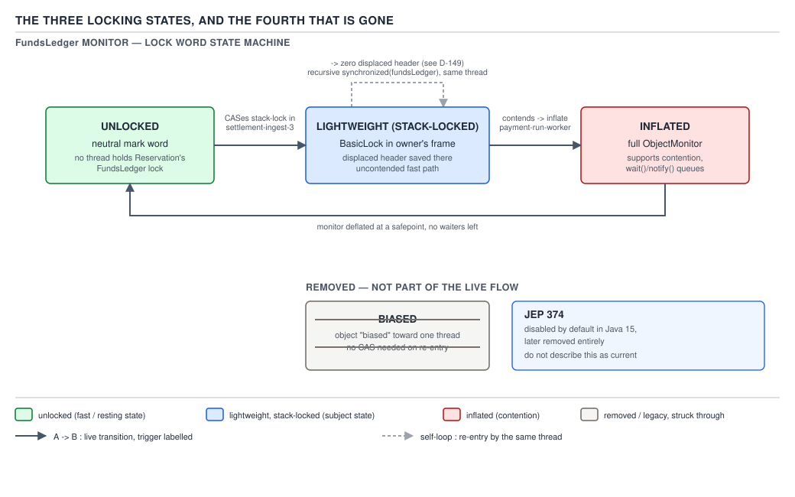
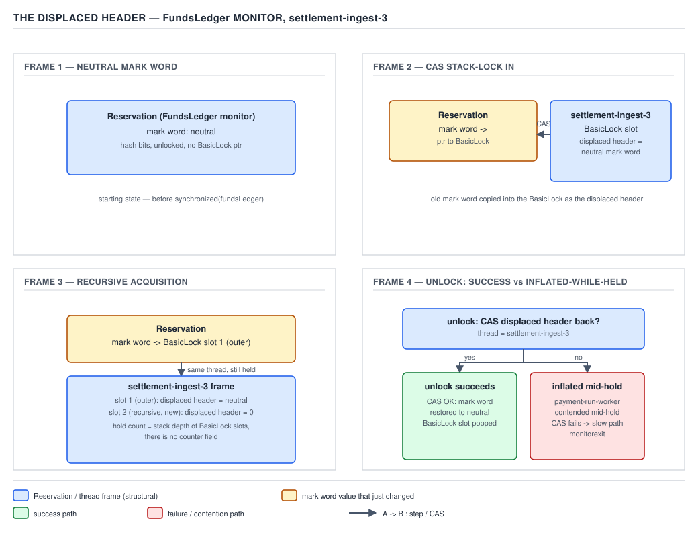
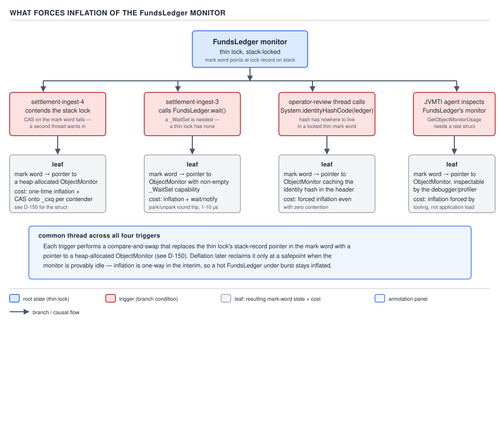
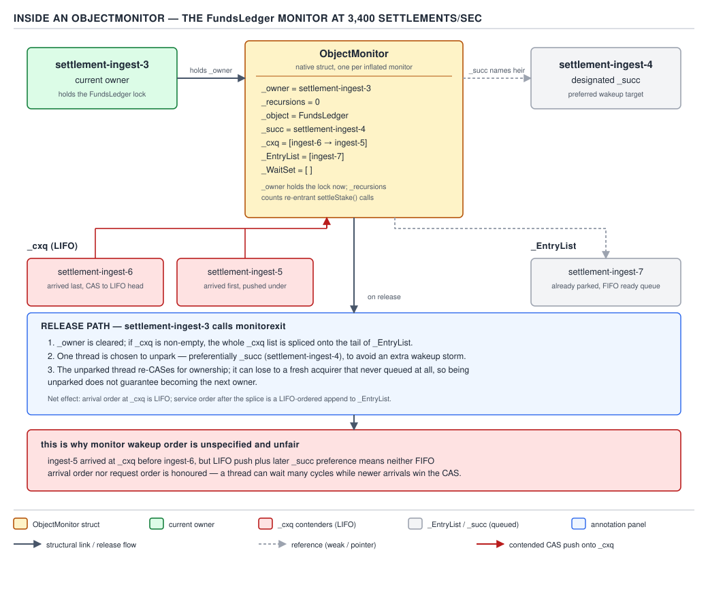
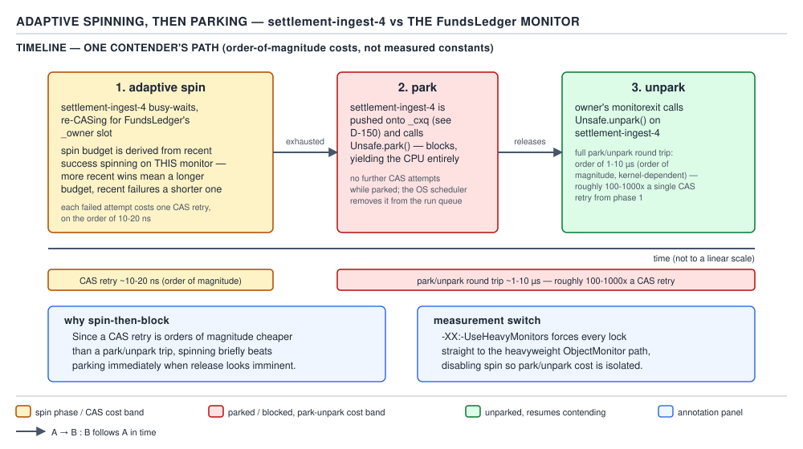

# 05 Multithreading and Concurrency — synchronized — INTERNALS (§3.2)

**Target version: Java 21 LTS.** | **Part 3 of 5** | [Index](../00-index.md)
Previous: [The object header and the mark word](02-internals-header-and-mark-word.md) · Next: [JIT optimisations that touch locks and memory](../volatile-and-jmm/04-internals-jit-and-barriers.md)

## Three states, and a fourth that used to exist

The mark word from Part 2 carries a two-bit lock tag. On current HotSpot (Java 21) that tag only
ever means one of three things:

- **`01`, unlocked** — the mark word holds a real identity hash and age bits, no lock is held.
- **`00`, lightweight / stack-locked** — a `BasicLock` in some thread's own stack frame owns this
  object; the mark word points at that frame.
- **`10`, inflated / monitor** — the mark word points at a native `ObjectMonitor` structure.

A fourth tag, `101`, meant **biased** — one thread's id stamped directly into the header so
re-entry cost a compare instead of a CAS. It is gone: JEP 374 disabled it by default in Java 15,
and later releases stripped the code entirely. Every "biased → thin → fat" article online
describes a JVM you are not running. §3.2.14 unpacks why it died and how to answer the interview
question that keeps citing it.



**D-148** — The three locking states, and the fourth that is gone.

Every `synchronized` block in the QuizStakes engine — a stake reservation touching `FundsLedger`,
a `PaymentRun` assembly, a `Restriction` application — starts unlocked, escalates to stack-locked
the instant one thread enters, and only pays for a real monitor when something forces it to. That
escalation path is the rest of this file.

---

## Lightweight locking and the displaced header

**Mental model.** A stack-locked object is not "owned" by a heavyweight structure — it is owned by
*a specific stack frame*. The header temporarily migrates into that frame, leaving a forwarding
pointer behind. Locking becomes "swap two words," not "allocate a lock."

**Why it exists.** Most locks in a running JVM are never actually contended — one thread enters a
`synchronized(fundsLedger)` block, writes, and leaves before anyone else asks. Allocating a native
monitor for every one of those is wasteful; HotSpot's stack-locking scheme makes the uncontended
case cost a handful of instructions and zero allocation.

**When to reach for it, and when not.** Never invoked directly — `synchronized` tries it first,
unconditionally, on every entry. It gives up the moment a second thread contends, or the object
needs a real wait-set, handing off to the monitor path below. No tunable keeps a contended lock
lightweight; contention is the one case this scheme cannot do cheaply, by design.

**How it works (source walk).** Acquisition, on the fast path emitted by C1/C2 and mirrored in the
interpreter's `fast_lock` stub: the thread pushes a `BasicObjectLock` (holding a `BasicLock`) onto
its own frame; if the mark word is neutral/unlocked (`01`, hash/age bits, no lock), it copies that
mark word into the `BasicLock` — the **displaced header** — then CASes the object's header to
point at the `BasicLock`, tag bits `00`. CAS success means the thread owns the lock for one CAS.

**Recursive acquisition** is the elegant part: if the *same* thread re-enters the same block,
HotSpot recognizes the mark word already points into *this thread's own stack* (a range check, no
CAS needed) and pushes another `BasicObjectLock` storing a **displaced header of zero** — the
sentinel for "recursive frame, not the original." `[PROVE]`: unlock walks frames outward-in, and a
zero header means "pop this frame, the lock is still held below" — depth falls out of stack shape.

**Unlock** is the CAS in reverse, and the failure path is what matters: the thread CASes the
*displaced header* back from the `BasicLock` into the mark word. Success unlocks cheaply. **Failure**
means the mark word no longer matches what this thread expects — another thread forced inflation
while this thread held the lock (see below) — and the slow path goes through the real
`ObjectMonitor`'s exit protocol instead, because a fat lock is now the truth about ownership.



**D-149** — The displaced header, across four frames: first acquisition (real displaced header
copied out), recursive acquisition (displaced header stored as zero — the hold count with no
counter), unlock success (CAS restores the header), and unlock failure (the lock inflated while
held, so the CAS target no longer exists and the slow, monitor-aware unlock path takes over).

```java
final class FundsLedger {
    // ReserveStake: debits CASH_AVAILABLE/BONUS_AVAILABLE, credits the RESERVED buckets.
    // Re-entrant: settling a prior stake can recursively reserve() a new one, same thread.
    void reserve(ClientId clientId, Money stakeAmount) {
        synchronized (this) {
            StakeSplit split = computeSplit(clientId, stakeAmount);
            debitAvailable(clientId, split);
            creditReserved(clientId, split);
            if (shouldTopUpFloat(clientId)) {
                reserve(clientId, Money.of("0.01", stakeAmount.currency())); // recursive re-entry
            }
        }
    }
}
```

The outer call stack-locks `this` with a real displaced header. The recursive call re-enters the
*same* monitor, *same* thread: no CAS, just a zero displaced header pushed on top.

**The gotcha.** Stack-locking only exists while uncontended *and* nobody has called `wait()`,
asked for `hashCode()`, or inspected it via JVMTI. The instant any of those happens, the mark word
is rewritten to point at a monitor — exactly why unlock must re-check the CAS, never trust the
stack blindly.

> **Lightweight locking, one sentence:** a stack-locked object's header is temporarily replaced
> with a pointer into the locking thread's own stack frame, which holds the original header as the
> displaced header — zero for a recursive re-entry — and unlock is just CASing that header back.

---

## What forces inflation

**Mental model.** Inflation is the JVM admitting a two-word swap is no longer enough bookkeeping
for this object, and paying once for a real, native, queue-carrying structure instead.

**Why it exists.** Contention, `wait()`, identity hashing, and tooling inspection all need state a
`BasicLock` in one stack frame cannot hold — a queue of blocked threads, a wait-set, a stable hash
independent of any owner. HotSpot defers that cost until one of those needs actually appears.

**When to reach for it, and when not.** Not user-invoked, but the design implication is real:
**calling `hashCode()` on a `synchronized`-protected object forces its lock permanently fatter**,
even with zero further contention, until deflation (below) reclaims the idle monitor.

**How it works — the four triggers, `[SOURCE]` `[RESEARCH]`:**

1. **Contention on the stack lock.** A second thread's fast-path CAS finds the mark word already
   pointing at another thread's `BasicLock`. With no queue to join, `ObjectSynchronizer::enter`
   allocates an `ObjectMonitor` and inflates.
2. **`wait()` is called.** `Object.wait` needs a wait-set a `BasicLock` has nowhere to hold, so
   `wait()` on a stack-locked object inflates it as a precondition.
3. **`hashCode()` must be stored.** The identity hash is cached in the mark word's hash field —
   but a stack-locked mark word is busy holding a `BasicLock` pointer, so HotSpot inflates to give
   the hash a stable home inside the `ObjectMonitor`.
4. **JVMTI / monitor-inspection tooling.** A debugger asking "who owns this lock" needs the same
   real queues item 1 needed, forcing inflation with zero application contention.



**D-151** — the four triggers, each with the resulting mark-word state (tag `10`, pointer to a
freshly allocated `ObjectMonitor`) and its cost: triggers 1 and 4 pay for the allocation *and* a
subsequent monitor-only lifetime; trigger 2 is usually intentional (you asked for a wait-set);
trigger 3 is the one that surprises people, because it is silent and permanent.

**A minimal concrete example.** A `PendingActions` cache keys entries by identity for a `Client`:

```java
Map<Client, PendingActions> byClientIdentity = new IdentityHashMap<>();

void enqueue(Client client, PendingAction action) {
    synchronized (client) {                  // stack-locked while uncontended...
        byClientIdentity.computeIfAbsent(client, c -> new PendingActions()).add(action);
    }
    int h = System.identityHashCode(client); // ...but this call inflates it, forever
}
```

The very first call to `System.identityHashCode(client)` — inside or outside the block — forces
`client`'s lock into the monitor state for the rest of the object's life, because the hash now
lives in the `ObjectMonitor`, not the mark word.

**The gotcha.** Inflation is invisible when it happens: nothing throws, nothing logs, the only
symptom is that this lock is now permanently a few CAS operations more expensive uncontended,
until deflation (§3.2.12) reclaims the idle monitor and the next stack-lock starts lightweight.

> **Inflation, one sentence:** the JVM upgrades a stack-lock to a native `ObjectMonitor` exactly
> when contention, `wait()`, a stored identity hash, or inspection tooling need state a
> `BasicLock` cannot hold, and never a moment sooner.

---

## Inside an `ObjectMonitor`: the two-queue design

**Mental model.** Picture a nightclub with one door and one bouncer. `_owner` is whoever is
currently inside holding the lock. Everyone who shows up while the door is shut piles onto one
stack right at the door (`_cxq`) — last to arrive, first the bouncer sees. When the person inside
leaves, the bouncer doesn't process the whole pile; they walk the pile onto an actual queue
(`_EntryList`) and personally tap one specific person (`_succ`) to come in next.

**Why it exists.** Once an object needs real contention management — more than one thread wants a
lock and someone has to wait — you need a structure that lives in native memory, survives across
many acquisitions, and supports genuinely blocking (parking) rather than busy-waiting forever. That
structure is `ObjectMonitor`: a C++ object, not a Java object, allocated once per inflated lock and
addressed from the object's mark word.

**When to reach for it, and when not.** You get one automatically the moment inflation happens; you
never allocate one yourself. The question that matters in practice is *when to avoid inflation at
all* — a hot, briefly-held lock (a `FundsLedger` reservation path at 1,200 stakes/sec) is exactly
the case lightweight locking was built for, and any `hashCode()` call or `wait()` on that object
is a design smell for forfeiting that cheap path for its whole lifetime.

**How it works — confirmed field layout `[SOURCE]`.** Verified against `objectMonitor.hpp` on the
`jdk-21+35` tag (`raw.githubusercontent.com`; `openjdk.org` returns HTTP 403 this session):

| Field | Type | Role |
|---|---|---|
| `_owner` | `void* volatile` | thread (or `BasicLock`) currently holding the monitor |
| `_recursions` | `volatile intx` | reentrant hold count, now that a real counter exists |
| `_cxq` | `ObjectWaiter* volatile` | lock-free LIFO stack of newly-arrived contenders |
| `_EntryList` | `ObjectWaiter* volatile` | threads formally queued for entry, drained from `_cxq` |
| `_WaitSet` | `ObjectWaiter* volatile` | threads parked inside `Object.wait()` |
| `_succ` | `JavaThread* volatile` | heir-presumptive — the one thread the owner unparks |
| `_object` | `WeakHandle` | back-pointer to the Java object this monitor inflated for |

Two more fields matter: `_Responsible` (a conservative fallback "who to wake" designation bounding
worst-case wake latency) and `_previous_owner_tid` (last owner's thread id, feeding the
adaptive-spin heuristic below).

**The two-queue design, `[PROVE]`.** Contenders never queue directly onto `_EntryList` — they push
onto `_cxq` with a single lock-free CAS, LIFO, because a shared push-only stack needs no lock to
append to under contention. `_EntryList` is touched only by the *current owner*, single-threaded,
at `exit()`: the owner unlinks the whole `_cxq` chain, splices it onto `_EntryList`, then
designates one thread to unpark. Two structures exist because a multi-writer stack (`_cxq`, must
be lock-free) and a single-writer queue (`_EntryList`, exclusive to the exiting thread, so ordering
policy applies) have different concurrency needs; merging them would tax the hot append path with
ordering nobody needs yet.

**Derive the fairness answer from the structure, don't assert it:** because `_cxq` is LIFO, the
most recent arrival sits on top and is first moved to `_EntryList` on the next handoff, while an
earlier arrival may still be buried underneath. Add barging (§3.2.9) — a brand-new thread can
acquire the lock directly without touching either queue — and the honest answer is: **monitor
wakeup order is unspecified and can starve a long-waiting thread**, not from carelessness but
because a lock-free LIFO admission stack was the cheap structure to build the fast path on.



**D-150** — `_owner`, `_recursions`, `_cxq`, `_EntryList`, `_WaitSet`, `_succ`, `_object`;
contenders pushed LIFO onto `_cxq`; the owner, on release, draining `_cxq` onto `_EntryList` and
unparking `_succ`.

```java
// Three threads racing FundsLedger.reserve() while a fourth already holds the monitor:
// each of the three pushes itself onto _cxq with one CAS and parks. On exit(), the owner
// walks _cxq (LIFO — last pusher is first off), splices the chain onto _EntryList, and
// unparks exactly one JavaThread: whichever one it designated _succ.
synchronized (fundsLedger) {
    fundsLedger.reserve(clientId, stakeAmount);
} // exit(): drain _cxq -> _EntryList, unpark(_succ)
```

**The gotcha.** `_recursions` looks like it makes the displaced-header trick from lightweight
locking obsolete, and once a lock is inflated it does — a real counter replaces the zero-header
convention. But that counter only exists *after* inflation; a stack-locked, never-contended
`synchronized` block never allocates one, which is the entire performance argument for keeping
locks lightweight as long as possible.

> **`ObjectMonitor`, one sentence:** a native structure with one owner, one recursion counter, a
> lock-free LIFO stack for new arrivals, a single-writer entry queue the owner drains that stack
> into, a separate wait-set for `wait()`ers, and one designated successor to unpark.

### `_succ` and barging (3.2.9)

**Mechanism.** Naively unparking every thread on `_EntryList` when the lock frees up would cause a
thundering herd — all of them wake, all but one immediately re-block. HotSpot instead designates
exactly one thread as `_succ`, the "heir presumptive," and only that thread is unparked; everyone
else stays parked until it becomes `_succ` in a later handoff.

**Gotcha.** This buys efficiency at the cost of fairness: a brand-new thread that never touched
either queue can still win the lock out from under `_succ` by CASing `_owner` directly the instant
it becomes free — "barging." A thread that has been waiting for milliseconds can lose to a thread
that has been running for microseconds.

> `_succ` names one thread to wake so releasing a monitor never triggers a stampede, at the cost of
> letting a fresh, non-queued thread barge past everyone already waiting.

### `Object.wait()` mechanics (3.2.10)

**Mechanism, `[PROVE]` `[SOURCE]`.** Calling `wait()` on the `FundsLedger`'s bank-withdrawal queue
monitor saves `_recursions` (a thread that entered twice must return holding it twice), moves the
caller from owner onto `_WaitSet`, and releases `_owner`. A later `notify()` does not hand the
lock over — it moves the thread from `_WaitSet` onto `_EntryList`, where it must re-acquire the
monitor like any contender, restoring `_recursions` only once it wins.

**Gotcha.** This is exactly why a notified thread's state is `BLOCKED`, never `RUNNABLE`, in the
interval between `notify()` and actually re-acquiring the lock: moving off `_WaitSet` onto
`_EntryList` does not grant ownership, it only re-enters the contest.

```java
final class BankWithdrawalQueue {
    private final Deque<WithdrawalTransaction> pending = new ArrayDeque<>();

    synchronized WithdrawalTransaction takeNext() throws InterruptedException {
        while (pending.isEmpty()) {
            wait();                       // -> _WaitSet, _recursions saved, _owner released
        }
        return pending.removeFirst();     // returned after re-acquiring: notify() -> _EntryList -> owner
    }

    synchronized void offer(WithdrawalTransaction tx) {
        pending.addLast(tx);
        notify();                          // moves one waiter _WaitSet -> _EntryList, does not hand off the lock
    }
}
```

> `wait()`/`notify()` move a thread between `_WaitSet` and `_EntryList`; ownership is only granted
> by winning the entry contest again, which is why a notified thread is `BLOCKED`, not `RUNNABLE`.

---

## Adaptive spinning, then parking

**Mental model.** Before a contender gives up and asks the OS to park it, HotSpot has it spin in a
tight loop for a short while, betting the owner is about to finish — waiting at a door you expect
to open in a second, rather than going to sit down across the room.

**Why it exists.** Parking and unparking a thread costs a system call and a context switch each
way — order of magnitude 1–10 µs, a rough band, not a measured constant, since no authoritative
per-instruction table exists across kernels and hardware. A CAS retry costs order of magnitude
10–20 ns. If the lock is about to free up, spinning briefly and re-CASing beats parking outright.

**When to reach for it, and when not.** Entirely automatic, no API surface. Spinning wastes a core
if the owner is *not* about to release (e.g. it just blocked on a slow PSP call), so HotSpot makes
the decision adaptive per monitor rather than spinning blindly.

**How it works, `[RESEARCH]` `[NUM]`.** Spin duration for a given `ObjectMonitor` is derived from
whether spinning recently *succeeded* on that same monitor: if the last few contenders spun and
won without parking, `_SpinDuration` biases upward, betting the pattern continues (a `FundsLedger`
reservation path is exactly this — brief holds, 1,200 stakes/sec peak); if recent spins ended in
parking anyway, the JVM backs off and parks sooner, since spinning on a lock held a long time (a
`PaymentRun` sign-off step) is pure loss. `-XX:-UseHeavyMonitors` (diagnostic) disables the
fast/spin paths so the cost can be measured in isolation; `-XX:+UseSpinWait`-family flags tune the
spin instruction itself.



**D-152** — spin duration derived from recent success on this monitor, then park if the spin does
not win the lock; the CAS retry cost (order-of-magnitude 10–20 ns) and the park/unpark round trip
(order-of-magnitude 1–10 µs) marked on the timeline as bands, not measured constants.

**The gotcha.** Spinning is not free even when it "wins" — it burns a core's cycles the whole time,
which is invisible in latency numbers but shows up as CPU utilization under high contention. A
`FundsLedger` under 3,400 settlements/sec burst can look CPU-bound purely from spin-then-park
churn on one hot monitor, with no single thread's profile showing it as "the" bottleneck.

> **Adaptive spinning, one sentence:** a contender spins for a duration set by whether spinning
> recently paid off on this exact monitor, and only parks — paying the microsecond-scale round
> trip — once that bet stops looking good.

---

## Biased locking is gone

**Mental model.** Biased locking tried to make "the same one thread keeps re-locking this object"
cost a plain compare instead of a CAS, by literally writing that thread's id into the header and
trusting it until proven otherwise.

**Why it existed, and why it died, `[PROVE]` `[RESEARCH]`.** In the early 2000s CAS was measurably
more expensive than a plain load-and-compare, and "one thread repeatedly re-enters an uncontended
lock" was common. Biasing the header to that thread turned re-entry into a compare. The cost was
structural: revoking a bias — the moment a *second* thread wanted the object — required a
**safepoint**, stopping every thread in the JVM; bulk per-class revocation piled heuristics on top
to amortize that; and the mechanism touched header layout, GC, deopt, and JVMTI, making unrelated
HotSpot changes riskier. By JDK 15, CAS had gotten cheap enough, and stack-locking already handled
the "briefly held, low contention" case well, that the win had shrunk to noise against a fixed
maintenance cost. **JEP 374 disabled it by default in Java 15**; later releases removed the code
outright. `[VERSION-TRAP]`: on Java 21 there is no bias state — the `101` tag from older material simply
does not occur. **When it would have mattered:** the one case it helped — one thread, uncontended,
repeated re-entry — is exactly what stack-locking already handles at similar cost, minus the
safepoint-revocation liability; no scenario on Java 21 misses it.

**Pitfall:** treating "biased → thin → fat lock escalation" as the current model. This describes a
JVM you are not running. The correct model on Java 21 is two states before contention forces a
third: **unlocked → lightweight (stack-locked) → inflated (monitor)**. `[TRAP]`

**The gotcha, restated as the interview signal.** "Walk me through biased locking" is answered by
naming that it was removed and why (safepoint-cost-vs-benefit, not "it was buggy") — that is
usually exactly what the question tests: whether your mental model is current.

```java
// The exact pattern biased locking used to optimise: one thread, same object, repeated
// re-entry, zero contention. On Java 21: one CAS on first entry, then a zero displaced
// header per re-entry — no safepoint involved anywhere.
for (WithdrawalTransaction tx : batch) {
    synchronized (fundsLedger) {
        fundsLedger.applyClosedLoopRefund(tx);
    }
}
```

> **Biased locking, one sentence:** an id-stamping optimisation for uncontended repeated re-entry
> that made revocation require a safepoint, made obsolete once CAS got cheap and stack-locking
> already covered the same case — disabled in Java 15, later removed, and not part of the model on
> Java 21.

---

## Supporting facts

**Deflation (3.2.12), `[RESEARCH]` `[NUM]` `[VERSION-TRAP]`.** An inflated `ObjectMonitor` is not
freed the instant it goes idle. Since JDK 15, a dedicated deflation thread walks idle monitors
asynchronously and reclaims them (`-XX:MonitorDeflationMax`, `-XX:GuaranteedAsyncDeflationInterval`,
`AsyncDeflationInterval`, `MonitorUsedDeflationThreshold`); before that, only safepoints deflated.
**Gotcha:** a lock can go inflated → idle → deflated → lightweight again — not permanent, only for
as long as the monitor stays live. `[VERSION-TRAP]`: pre-15 the idle window closed only at the
next safepoint; post-15 it closes on the deflation thread's own schedule.

> Idle monitors are reclaimed by a dedicated deflation thread (JDK 15+, previously safepoint-only),
> so a lock can return to lightweight locking after inflation, just not immediately.

**The `ObjectMonitorTable` side table (3.2.13), `[RESEARCH]` `[VERSION-TRAP]`.** Compact object
headers (JEP 519, experimental Java 24, delivered Java 25) shrink the mark word so far a full
native pointer no longer fits, so an `ObjectMonitorTable` side table maps object identity to
monitor instead. **Gotcha:** inflation is one hash-table lookup heavier; the two-queue internals
here are unchanged, only how you *find* the monitor changes.

> Compact headers can't hold a monitor pointer, so JDK 25 looks the monitor up in a side table
> (`ObjectMonitorTable`) instead of storing the pointer in the mark word.

**`monitorenter`/`monitorexit` at the machine level (3.2.16), `[ASM]`.** C1/C2 emit the fast path
inline at the call site rather than calling `ObjectSynchronizer::enter`: a CAS instruction (`lock
cmpxchg` on x86) attempts the mark-word swap from lightweight locking, jumping to a runtime call
only on failure. Quoted from documented HotSpot codegen, not a captured disassembly: `mov` the
mark word into a register, compare against the unlocked pattern, `lock cmpxchg` the `BasicLock`
pointer in, branch-if-not-equal to the slow-path stub.

> `synchronized` compiles to an inline CAS fast path with a runtime-call slow path on failure —
> there is no method call at all on the uncontended, fast-path case.

**Safepoints and deadlock (3.2.17), `[PROVE]` `[X-REF 06]`.** A thread `BLOCKED` waiting for a
monitor (parked on `_cxq`/`_EntryList`) is already safepoint-safe — it isn't executing bytecode
that could observe a moving object, so GC can freely stop-the-world while it sits blocked. This is
why two threads deadlocked on `FundsLedger` and a `PaymentIntent` monitor hang only those two
threads — GC and every other request thread keep running. Full mechanics are in guide 06.

> A monitor-blocked thread is already safepoint-safe, so a deadlock freezes only the deadlocked
> threads, never GC or the rest of the JVM.

**JEP 491 in these terms (3.2.18), `[RESEARCH]` `[VERSION-TRAP]`.** On Java 21, a virtual thread
blocking inside `synchronized` cannot unmount from its carrier — `_owner`/`_cxq`/`_EntryList`
bookkeeping is built around carrier (`JavaThread`) identity. **JEP 491, "Synchronize Virtual
Threads without Pinning," is final in JDK 24**: it rebuilds ownership around the virtual thread's
own identity, turning blocked-on-monitor into a legitimate unmount point instead of a pin.
`-Djdk.tracePinnedThreads`, the Java 21 tool for this pinning cause, was removed alongside it.

> On 21, `synchronized` pins a blocked virtual thread to its carrier because the monitor tracks
> carrier identity; JEP 491 (final, JDK 24) rebuilds that tracking around the virtual thread
> itself, removing the pin and the trace flag that used to find it.

---

## Pitfalls

### Assuming inflation is permanent once it happens

**Wrong**

```java
Object lock = new Object();
synchronized (lock) { lock.hashCode(); }   // inflates lock, forever... or so it seems
// "this object's lock will always be a fat monitor from now on"
```

**Right**

Inflation lasts only as long as the `ObjectMonitor` stays allocated. Once idle, the deflation
thread (JDK 15+) reclaims it, and the next acquisition on `lock` starts lightweight again.

**Why people believe it:** inflation feels like a one-way ratchet because the downgrade happens
quietly and asynchronously, never as a visible event while the lock is still referenced.

### Assuming a notified thread is immediately runnable

**Wrong**

```java
synchronized (bankWithdrawalQueue) {
    bankWithdrawalQueue.notify();
    // "the waiting thread is running again now"
}
```

**Right**

`notify()` moves the target thread from `_WaitSet` to `_EntryList` — it must still win entry,
which cannot happen until the notifying thread exits the block. State is `BLOCKED` until then.

**Why people believe it:** "notify" sounds like "wake up and go," true of the OS-level unpark
underneath, but the Java-level state correctly reflects re-acquisition as a contested step.

### Assuming monitor wakeup is FIFO because a queue is involved

**Wrong**

```java
// "threads block in the order they arrived, so they're served in that order"
```

**Right**

Arrivals push onto `_cxq`, a LIFO stack; the most recent arrival is typically first moved to
`_EntryList` — and a fresh, never-queued thread can barge past everyone via the `_owner` CAS.
Wakeup order is unspecified.

**Why people believe it:** "queue" implies FIFO by convention, but `_cxq`'s ordering is a LIFO
admission stack chosen for lock-free append performance, not fairness.

## Cheat sheet

| Fact | Value / behaviour |
|---|---|
| Lock states on Java 21 | unlocked (`01`) → lightweight/stack-locked (`00`) → inflated (`10`); biased (`101`) gone since JEP 374 (Java 15) |
| Lightweight acquire | CAS mark word to point at a `BasicLock` in the thread's own frame; displaced header saved there |
| Recursive lightweight acquire | zero displaced header pushed; no counter — depth is stack structure |
| Lightweight unlock | CAS displaced header back; CAS failure ⇒ lock was inflated while held |
| Inflation triggers | contention, `wait()`, `hashCode()` storage, JVMTI/monitor inspection |
| `ObjectMonitor` fields (confirmed, `jdk-21+35`) | `_owner`, `_recursions`, `_cxq`, `_EntryList`, `_WaitSet`, `_succ`, `_object` (+ `_Responsible`, `_previous_owner_tid`) |
| `_cxq` | lock-free LIFO push-only stack of new contenders |
| `_EntryList` | single-writer queue the owner drains `_cxq` into on exit |
| `_succ` | one designated thread unparked on release; barging still possible |
| Wakeup order | unspecified, unfair — LIFO admission + barging |
| `wait()`/`notify()` | owner → `_WaitSet` (recursions saved) → `_EntryList` on notify; still `BLOCKED` until re-owned |
| Adaptive spin cost | order-of-magnitude 10–20 ns per CAS retry |
| Park/unpark cost | order-of-magnitude 1–10 µs round trip |
| Deflation | async thread since JDK 15 (`-XX:MonitorDeflationMax` etc.); safepoint-only before |
| Compact headers | monitor pointer moves to `ObjectMonitorTable` side table (experimental 24, delivered 25) |
| Biased locking | gone: disabled JEP 374 (15), later removed; revocation needed a safepoint |
| JEP 491 | final in JDK 24; monitor tracks virtual-thread identity, not carrier; `-Djdk.tracePinnedThreads` removed with it |

## Self-test

**Q1.** Why does a recursive `synchronized` re-entry on the same thread store a displaced header of
zero instead of incrementing a counter?

<details><summary>Answer</summary>

Lightweight locking has no counter — hold count is represented by how many stack frames carry a
zero displaced header underneath the one frame holding the real, original header. Zero is a
sentinel for "recursive re-entry, not the lock's origin."

</details>

**Q2.** A thread's unlock CAS (restoring the displaced header) fails. What happened, and what runs
next?

<details><summary>Answer</summary>

The object's mark word no longer matches what this thread expects, which can only mean another
thread forced inflation while this thread held the lock. The slow, monitor-aware exit path runs
instead, going through the real `ObjectMonitor`'s release protocol rather than a raw CAS.

</details>

**Q3.** Name all four triggers that force inflation.

<details><summary>Answer</summary>

Contention on the stack lock, a call to `wait()`, the need to store an object's identity hash
(because the mark word is occupied by a `BasicLock` pointer while stack-locked), and JVMTI or
monitor-inspection tooling.

</details>

**Q4.** Why does `_cxq` being a LIFO stack, rather than a FIFO queue, make monitor wakeup order
unspecified?

<details><summary>Answer</summary>

New contenders push onto `_cxq` with a lock-free CAS; on release, the owner drains the whole chain
onto `_EntryList`, and the most recent arrival sits at the top, so it can be designated `_succ`
before threads that arrived earlier. Combined with barging (a fresh thread can CAS `_owner`
directly, bypassing both queues), the JVM makes no fairness guarantee.

</details>

**Q5.** Why is a thread's state `BLOCKED`, not `RUNNABLE`, immediately after another thread calls
`notify()` on the monitor it is waiting on?

<details><summary>Answer</summary>

`notify()` only moves the thread from `_WaitSet` to `_EntryList` — it re-enters the ordinary
contest for the monitor, it is not handed ownership. It cannot become `RUNNABLE` until it actually
wins that contest and re-acquires `_owner`, restoring its saved `_recursions`.

</details>

**Q6.** On Java 21, why does blocking inside a `synchronized` block pin a virtual thread to its
carrier, and what changes in JDK 24?

<details><summary>Answer</summary>

The monitor's `_owner`/`_cxq`/`_EntryList` bookkeeping is built around carrier (`JavaThread`)
identity, so the JVM cannot let the carrier run other virtual threads while this one waits. JEP
491, final in JDK 24, rebuilds tracking around the virtual thread's own identity, turning
blocked-on-monitor into a legitimate unmount point; `-Djdk.tracePinnedThreads` was removed with it.

</details>

**Q7.** Why doesn't HotSpot spin forever, or never spin at all, before parking a contended thread?

<details><summary>Answer</summary>

Spinning costs cycles whether or not it succeeds, while parking costs a much larger
microsecond-scale round trip through the OS. HotSpot adapts spin duration per monitor, biasing
upward after recent successes and backing off after recent failures, rather than a fixed policy
that wastes cycles on long-held locks or wastes latency parking on locks about to free up.

</details>

---

**Leaves covered:** 3.2.1–3.2.18 (18 leaves)
**Leaves deferred:** none
**Diagrams included:** D-148, D-149, D-150, D-151, D-152
**Target version:** Java 21 LTS
**Lines:** 599
