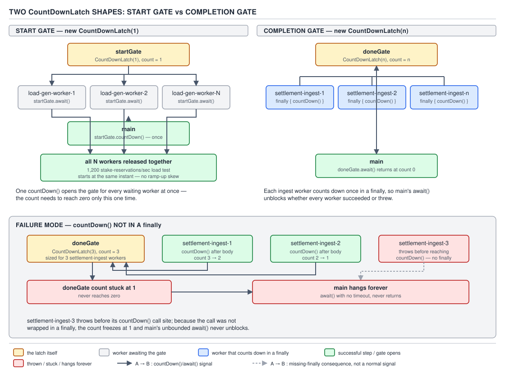
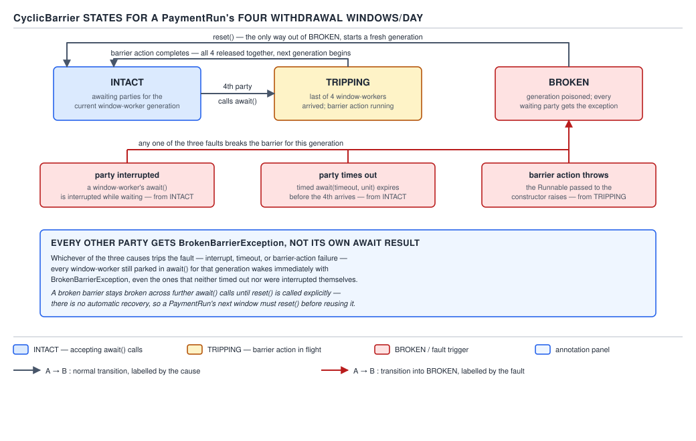

# 05 Multithreading and Concurrency — Synchronizers — BASICS (§1.15)

**Target version: Java 21 LTS.** | **Part 1 of 5** | [Index](../00-index.md)
Previous: [StampedLock and LockSupport](../locks/01b-basics-stampedlock-and-locksupport.md) · Next: [The concurrent collections — maps and iterators](../concurrent-collections/01a-basics-maps-and-iterators.md)

`java.util.concurrent` ships five coordination primitives that are not locks: `CountDownLatch`,
`CyclicBarrier`, `Semaphore`, `Phaser`, `Exchanger`. A lock protects a critical section from
concurrent entry. A synchronizer makes threads wait for a **condition on other threads** —
"N workers finished", "20 connections are checked out", "everyone reached this line". Picking the
wrong one shows up as a hang, not a race, which is why the decision table matters as much as the
API.

## CountDownLatch — the two latch shapes

`CountDownLatch(int count)` has four methods: `await()`, `await(long, TimeUnit)`, `countDown()`,
`getCount()`. No `reset()` — the count only falls, and once it hits zero every `await()` returns
immediately, forever.

**Why it exists.** Before `j.u.c`, "wait until N things happened" meant a lock plus a condition
variable plus hand-rolled spurious-wakeup handling. The latch packages that into two calls and
removes the missed-signal race, because `countDown()`/`await()` share one AQS state word instead of
a signal that could fire before anyone listens.

**When to reach for it.** A condition that fires **once, in one direction**. If the same threads
must repeat the wait next phase, the latch is wrong — use `CyclicBarrier`, which resets; a latch
never does.

**Mechanism — the two shapes**, same class, opposite direction of who calls `await`:

- **Start gate**: `new CountDownLatch(1)`. Workers `await()` first and block. Main finishes setup,
  calls `countDown()` once, and every worker becomes runnable in the same release — contention
  starts at one instant instead of drifting in.
- **Completion gate**: `new CountDownLatch(n)`. Main `await()`s. Each of `n` workers calls
  `countDown()` when done — **from a `finally`**, never the last line of the try body, because a
  skipped countdown leaves `await()` blocked forever with no timeout and no explanation.



**D-064** — The two latch shapes: a start gate releasing N workers from one `countDown()`, a
completion gate where main waits on N independent `countDown()` calls each in a `finally`, and the
failure mode when the `finally` is missing — main hangs forever.

**QuizStakes example — start gate for a load test.** Staggered startup of 1,200 stake-reservation
threads understates burst behaviour; a start gate crosses them together.

```java
public final class StakeReservationLoadTest {

    public void run(int concurrentClients, StakeReservationClient client) throws InterruptedException {
        CountDownLatch startGate = new CountDownLatch(1);
        CountDownLatch doneGate = new CountDownLatch(concurrentClients);
        ExecutorService pool = Executors.newFixedThreadPool(concurrentClients);

        for (int i = 0; i < concurrentClients; i++) {
            pool.submit(() -> {
                try {
                    startGate.await();                                            // parks here first
                    client.reserveStake(RoundId.random(), Money.of("4.20", "GBP"));
                } catch (InterruptedException e) {
                    Thread.currentThread().interrupt();
                } finally {
                    doneGate.countDown();                                    // always runs
                }
            });
        }
        startGate.countDown();                                                // release all 1,200 at once
        doneGate.await(30, TimeUnit.SECONDS);
        pool.shutdown();
    }
}
```

**Pitfall:** believing a `CountDownLatch` can be reused for the next load-test batch. It cannot —
`getCount()` only decreases, and `countDown()` past zero is a silent no-op. Build a fresh latch per
phase, or use `CyclicBarrier`/`Phaser` if the same threads repeat.

**Pitfall:** counting down outside a `finally`. If `reserveStake(...)` throws first, the exception
propagates out of the task, the executor swallows or wraps it, and `doneGate.await()` blocks past
any expected timeout for a count that never reaches zero — a hang that looks like a slow load test
when one worker actually died.

> **Definition:** `CountDownLatch` is a one-shot gate that releases every waiting thread once an
> external count of completions reaches zero.

## CyclicBarrier mechanics

`CyclicBarrier(int parties)` / `CyclicBarrier(int parties, Runnable barrierAction)` expose
`await()`, `await(long, TimeUnit)`, `getParties()`, `getNumberWaiting()`, `isBroken()`, `reset()`.
Unlike a latch it is **reusable** — once all parties arrive it flips back to waiting for the next
round automatically.

`await()` returns the **arrival index**: `parties - 1` for the first arriver, down to `0` for the
last — the standard way to elect a per-phase leader without a separate election
(`if (barrier.await() == 0) { /* I was last, run cleanup */ }`). If a `barrierAction` is supplied
it runs on the last-arriving thread, and its writes happen-before every party's `await()` returns
for that phase — a safe place to publish phase results the others then read.

> **Definition:** `CyclicBarrier` makes a fixed number of parties wait for each other, releases
> them together, and resets for the next phase.

## The broken barrier

**Mental model.** A `CyclicBarrier` toggles between two states forever — **intact** while filling,
**broken** the instant anything goes wrong — with no automatic recovery.

**Why it exists.** A latch cannot express "wait for each other, then do this again" — it has no
reset. Hand-rolling a repeated rendezvous with raw locks re-derives the exact bug this class exists
to avoid: a thread arriving before a reset is visible to it sees stale "already satisfied" state
and skips the wait.

**When to reach for it, and when not.** Reach for it when the same fixed group of threads must
repeatedly rendezvous at a point. Not when the party count is unknown or varies — `Phaser` (below)
handles that. Not for a single rendezvous — a latch is simpler and cannot get stuck broken.

**Mechanism.** Every arriving thread blocks in `await()`. The barrier breaks — permanently, until
`reset()` — if a waiting participant is interrupted, times out, or the barrier action throws. The
instant any one of these happens, **every other waiting thread**, not just the one that caused it,
wakes with `BrokenBarrierException`. Deliberate: letting the rest proceed with fewer arrivals than
expected would silently corrupt whatever invariant the barrier protects.



**D-065** — A broken barrier stays broken: intact while parties arrive, tripping when the last one
arrives and the barrier action runs, broken on interruption, timeout, or a throwing barrier action
— every other waiting participant gets `BrokenBarrierException` — and only `reset()` returns it to
intact.

**QuizStakes example — a phase barrier across a `PaymentRun`'s four windows/day.** Bank-withdrawal
payout files run in four fixed windows per day; every shard-builder must finish window N before any
starts window N+1.

```java
public final class PaymentRunPhaser {

    private final CyclicBarrier windowBarrier;
    private final AtomicReference<PaymentRun> currentRun = new AtomicReference<>();

    public PaymentRunPhaser(int workerCount, PayoutFileWriter writer) {
        this.windowBarrier = new CyclicBarrier(workerCount, () -> {   // runs on last arriver only
            writer.closeAndSubmit(currentRun.get());
            currentRun.set(PaymentRun.nextWindow());
        });
    }

    public void prepareWindow(WithdrawalShard shard) throws InterruptedException, BrokenBarrierException {
        buildShardFile(shard, currentRun.get());
        windowBarrier.await();          // waits for the other shard-builders, then rolls the window
    }
}
```

If `closeAndSubmit(...)` throws — the banking partner's endpoint is down — the barrier breaks and
every other worker's `await()` throws `BrokenBarrierException` instead of silently starting the
next window against an unclosed file. Recovery is explicit: catch at an outer retry loop and call
`reset()` only once an operator has confirmed the failed window was handled.

**Pitfall:** assuming the barrier "just continues" once the failing thread is handled. It does not
— `isBroken()` stays `true` and every `await()` throws immediately until `reset()` is called.
Treat a broken barrier as a fault needing an explicit decision, not a self-healing hiccup.

> **Definition:** A `CyclicBarrier` is broken by any participant's interruption, timeout, or
> throwing barrier action, and stays broken — rejecting every party — until `reset()`.

## Semaphore permits are unowned

`Semaphore(int permits)` / `Semaphore(int permits, boolean fair)` expose `acquire()`,
`acquireUninterruptibly()`, four `tryAcquire` overloads, `release()`, `acquire(int)`/`release(int)`
for bulk permits, `drainPermits()`, `availablePermits()`, protected `reducePermits(int)`, and
`hasQueuedThreads()`/`getQueueLength()`. Fairness works as for `ReentrantLock`: unfair (default)
favors throughput, letting a fresh arrival barge ahead of a queued waiter.

**Mental model.** A semaphore is a counter with two blocking operations, not a key held by a
thread — no concept of "the thread that acquired permit #3", only "how many permits are out".

**Why it exists.** A mutex answers "is the section occupied". A semaphore answers "how many
concurrent occupants are allowed", generalizing a mutex to `n > 1`. Before it, bounding a resource
pool meant a hand-rolled counter and condition variable reproducing the same acquire/release pair
this class already gives atomically.

**When to reach for it, and when not.** Cap concurrency against a hard numeric limit — a
connection pool, a rate-limited downstream call, free slots in a bounded queue. Not as a mutex
substitute: if the invariant is "only the acquiring thread may release, and it may re-enter" —
`ReentrantLock` or `synchronized`, not `Semaphore(1)`.

**Mechanism.** `acquire()`/`release()` operate on a shared count with no thread identity attached —
two consequences that surprise lock-API users:

- **Any thread may `release()`**, including one that never `acquire()`d. A feature for
  producer/consumer handoff — a completion callback can release a permit a worker will later
  acquire — but a stray extra `release()` silently raises the effective limit by one, forever, with
  nothing to detect it.
- **A binary `Semaphore(1)` is not a mutex.** No owner, so no reentrancy — a thread already holding
  the permit that calls `acquire()` again blocks on itself, where `ReentrantLock` would simply
  re-enter. It also cannot throw `IllegalMonitorStateException` the way an unheld `unlock()` does.

**QuizStakes example — `Semaphore(20)` in front of a connection pool.** Twenty is the downstream
driver's hard cap; every caller acquires before checkout and releases in a `finally` regardless of
outcome.

```java
public final class BoundedConnectionPool {

    private final Semaphore slots = new Semaphore(20, true);   // fair: FIFO under sustained load
    private final ConnectionFactory factory;

    public <T> T withConnection(Function<Connection, T> work) throws InterruptedException {
        slots.acquire();
        try (Connection conn = factory.open()) {
            return work.apply(conn);
        } finally {
            slots.release();      // any thread may call this — need not be "the acquiring thread"
        }
    }
}
```

**Pitfall:** calling `release()` from a retry handler that never called `acquire()`, to "free up a
slot" for a stuck caller — this manufactures a 21st permit that persists until restart, exceeding
the driver's documented limit. **Pitfall:** protecting a non-reentrant section with `Semaphore(1)`
and recursing on the same thread — `ReentrantLock` re-enters safely; `Semaphore` has no notion of
"the same thread already holds this" and deadlocks against itself.

> **Definition:** A `Semaphore` permit is a unit in a shared counter with no owning thread — any
> thread may release one, including one it never acquired, so a binary semaphore is not a
> reentrant mutex.

Semaphores are also the primary backpressure tool once virtual threads remove the bounded thread
pool that used to double as a concurrency cap — an explicit `Semaphore` at the call site takes
over "at most 20 concurrent calls downstream". See §04 for virtual-thread pinning and pooling.

## Phaser versus the other two

`Phaser` (Java 7) generalizes `CyclicBarrier` with **dynamic party registration**: `register()` /
`bulkRegister(int)` add parties at runtime, `arriveAndAwaitAdvance()` is the rendezvous,
`arriveAndDeregister()` lets a party leave permanently, `arrive()`/`awaitAdvance(int)` split
arrival from waiting, `getPhase()` reports the phase, `onAdvance(int, int)` runs once per advance
(returning `true` terminates it), and `forceTermination()`/`isTerminated()` manage shutdown. It
also supports **hierarchical tiering** — child phasers under a parent — to cut contention at large
party counts, something `CyclicBarrier` has no answer for.

**Mental model.** `Phaser` is what you get if `CyclicBarrier` could add and remove parties while
running and `CountDownLatch` could be reused — it subsumes both, at the cost of a wider API.

**Why it exists.** `CyclicBarrier` fixes its party count at construction; `CountDownLatch` never
resets. Neither fits a session-oriented workload where participant count rises and falls mid-run —
operators signing on and off a shift, rather than a fixed pool of worker threads.

**When to reach for it, and when not.** Only when parties genuinely come and go across phases —
the one thing the others cannot do. For a fixed count, `CyclicBarrier` says the same thing with a
far smaller API; `Phaser` is rarely worth its complexity — teams reach for it, discover the count
was fixed all along, and downgrade.

**Mechanism.** `register()` increments unarrived parties for the *current* phase before it
advances. `arriveAndAwaitAdvance()` marks the caller arrived and blocks until every registered
party has arrived — like a barrier — then rolls to phase `n + 1`, ready to be registered against
again with no `reset()` needed. `arriveAndDeregister()` exits for good: it arrives at the current
phase **and** reduces the party count for every future phase — exactly what `CyclicBarrier` cannot
express, since its count is `final`.

|  | one-shot or reusable | who counts down | fixed or dynamic parties | barrier action | arrival index returned | what breaks it | recovery | QuizStakes use |
|---|---|---|---|---|---|---|---|---|
| `CountDownLatch` | one-shot | any thread calling `countDown()`, external to waiters | fixed | none | none — `void` | nothing "breaks" it; never reaches zero | none — construct a new latch | start gate for the 1,200/sec stake-reservation load test |
| `CyclicBarrier` | reusable | the parties, by arriving | fixed | optional `Runnable`, runs on last arriver | yes — `parties - 1` down to `0` | interruption, timeout, throwing barrier action | `reset()` only | phase barrier across a `PaymentRun`'s four payout windows/day |
| `Phaser` | reusable | the parties, by arriving | dynamic — register/bulkRegister/arriveAndDeregister | optional `onAdvance`, once per phase | no — returns the phase number | `forceTermination()`, or `onAdvance` returning `true` | none — advances automatically | dynamic registration for operator sessions signing on/off mid-shift |

**D-063** — Latch versus barrier versus Phaser: one-shot vs reusable, who drives the countdown,
fixed vs dynamic parties, the barrier-action hook, what `await` returns, what breaks each one, and
its recovery path.

## Exchanger

`Exchanger<V>` is a rendezvous for exactly **two** threads to swap an object: `exchange(V)` blocks
until the other thread also calls `exchange`, then each returns with the other's value;
`exchange(V, long, TimeUnit)` adds a timeout. No notion of more than two parties — that is what a
barrier or `Phaser` is for.

**Gotcha:** if only one thread ever calls `exchange()`, it blocks forever — no default timeout, no
way to detect a missing partner short of the timed overload.

The canonical use is a **double-buffer handoff**: a producer fills one buffer while a consumer
drains the other, swapping references at `exchange()` rather than copying — the classic
genetic-algorithm generation-swap, or here, a settlement worker handing a filled batch of
`SettleStake` results to a ledger-writer thread while it starts filling the next batch.

> **Definition:** `Exchanger<V>` blocks two threads until both arrive, then hands each the object
> the other supplied.

## The happens-before edges each synchronizer provides

**Mental model.** Every synchronizer here is, from the JMM's view, a publish/subscribe pair: one
side's actions **happen-before** the other side observes the signal — the same guarantee
`volatile` gives one field, generalized to "a batch of writes, a coordination point, a batch of
reads".

**Why it exists.** Without a documented edge, "the workers finished, so their writes are visible to
main" is a hope, not a guarantee — a compiler or CPU may reorder or cache a write with no
synchronization forcing it into view. The `java.util.concurrent` package doc states these edges
explicitly, so using the synchronizer for control flow also gives visibility for free.

**When it matters.** Whenever a thread's *result*, not just its completion, must be read
afterward — a worker computing a value that main reads once `await()` returns needs this; a worker
nobody reads does not.

**Mechanism — the four edges, quoted from the `java.util.concurrent` package documentation:**

> "Actions in a thread prior to calling `countDown()`... happen-before actions following a
> successful return from a corresponding `await()`."

`CountDownLatch`: every write before a worker's `countDown()` is visible to main after `await()`.

> "Actions prior to `await()` in each thread happen-before actions that are part of the barrier
> action ... which in turn happen-before actions following a successful `await()` return."

`CyclicBarrier`: a two-hop chain — pre-`await` writes are visible to the barrier action, and the
barrier action's writes are then visible to every thread's post-`await` code, which is exactly why
`PaymentRunPhaser` above may publish the phase result from inside the barrier action with no lock.

> "Actions prior to calling `release()` happen-before actions following a successful `acquire()` of
> that permit in another thread."

`Semaphore`: the same producer/consumer edge a `BlockingQueue` gives — a completion handler's
writes are safely visible to whichever worker next acquires the freed permit.

> "For each pair of threads that successfully `exchange` objects via an `Exchanger`, actions prior
> to the `exchange()` in each thread happen-before those subsequent to the corresponding
> `exchange()` in the other thread."

`Exchanger`: both directions at once, since the handoff is symmetric.

**Concrete example.** No extra sync needed beyond the latch itself:

```java
AtomicReference<ReservationResult> result = new AtomicReference<>();
new Thread(() -> {
    result.set(client.reserveStake(RoundId.random(), Money.of("4.20", "GBP")));
    doneGate.countDown();   // this write happens-before countDown, which happens-before await()
}).start();
doneGate.await();
ReservationResult r = result.get();   // guaranteed visible
```

`AtomicReference` is needed only because a plain field cannot be reassigned inside a lambda; the
happens-before guarantee itself comes entirely from the latch.

**Gotcha:** the edge covers only a **successful** return. A timed `await` that times out, or an
`acquire()` that is interrupted, gives no such guarantee for the thread that didn't succeed.

> **Definition:** Each `j.u.c` synchronizer defines its own happens-before edge —
> countDown→await, pre-await→barrier action→post-await, release→acquire, and each
> exchange→its partner's continuation — so coordinating through it also guarantees visibility of
> the writes that preceded it.

## Choosing a synchronizer

| Question | Answer points to |
|---|---|
| One-shot, or does the same group repeat? | one-shot → `CountDownLatch`; repeats → `CyclicBarrier`/`Phaser` |
| Fixed party count, or does it change at runtime? | fixed → `CyclicBarrier`; dynamic → `Phaser` |
| Counting completions, or gating access to a resource? | completions → latch/barrier/phaser; resource limit → `Semaphore` |
| Exactly two threads swapping data at a rendezvous? | yes → `Exchanger`; otherwise the others |

## AQS foundation

`CountDownLatch`, `CyclicBarrier`, and `Semaphore` are all built on `AbstractQueuedSynchronizer`
(AQS) — the same shared-mode queuing machinery `ReentrantReadWriteLock`'s read side uses.
`Exchanger` and `Phaser` are the two exceptions: each uses its own lock-free algorithm, since a
two-party swap and a dynamically resizing, tiered party count do not map onto AQS's single-integer
state word. AQS internals — state encoding, wait-queue node types, shared vs exclusive acquire —
are covered in §3.5, not here.

## Pitfalls

### Assuming a `CountDownLatch` can be reset for the next iteration

**Wrong**
```java
CountDownLatch latch = new CountDownLatch(5);
runBatch(latch);
latch.await();
runBatch(latch);   // count is already 0 — await() below returns instantly, workers never ran
latch.await();
```

**Right**
```java
for (int batch = 0; batch < batchCount; batch++) {
    CountDownLatch latch = new CountDownLatch(5);   // fresh latch every batch
    runBatch(latch);
    latch.await();
}
```

**Why people believe it:** `CyclicBarrier` resets automatically, so it is easy to assume the whole
family does; `CountDownLatch` is the one that deliberately never does.

### Counting down outside a `finally`

**Wrong**
```java
pool.submit(() -> {
    doWork();                 // throws — countDown() below never runs
    doneGate.countDown();
});
```

**Right**
```java
pool.submit(() -> {
    try {
        doWork();
    } finally {
        doneGate.countDown();  // runs whether doWork() succeeded, threw, or was interrupted
    }
});
```

**Why people believe it:** the happy path looks identical either way in testing; the bug only
surfaces under real load, where one worker in a thousand hits a transient failure.

### Assuming a broken `CyclicBarrier` recovers once the failing thread is handled

**Wrong**
```java
try {
    barrier.await();
} catch (BrokenBarrierException e) {
    log.warn("one party failed, continuing");
    barrier.await();   // still broken — throws again immediately
}
```

**Right**
```java
try {
    barrier.await();
} catch (BrokenBarrierException | TimeoutException e) {
    escalateToOperator(e);
    barrier.reset();   // explicit recovery, only once the failure is actually handled
    barrier.await();
}
```

**Why people believe it:** most exceptions are transient and retrying "just works"; `CyclicBarrier`
is deliberately stateful about failure so a caller cannot paper over a broken phase by retrying.

### Releasing a semaphore permit the current thread never acquired

**Wrong**
```java
if (isStuck(worker)) {
    slots.release();   // "frees a slot" — actually manufactures a 21st permit, forever
}
```

**Right**
```java
if (isStuck(worker)) {
    worker.interrupt();          // let the real holder release its own permit via its finally
    escalateToOperator(worker);
}
```

**Why people believe it:** `release()` compiles and runs regardless of caller, because permits
have no owner — no `IllegalMonitorStateException` equivalent catches the mistake at runtime.

### Using `Semaphore(1)` as a drop-in mutex

**Wrong**
```java
Semaphore mutex = new Semaphore(1);
void update() throws InterruptedException {
    mutex.acquire();
    try {
        update();   // same thread re-entering — deadlocks against its own held permit
    } finally {
        mutex.release();
    }
}
```

**Right**
```java
ReentrantLock lock = new ReentrantLock();
void update() {
    lock.lock();
    try {
        update();   // reentrant — same thread re-acquires its own hold count, no deadlock
    } finally {
        lock.unlock();
    }
}
```

**Why people believe it:** a binary semaphore behaves like a mutex on the non-reentrant,
single-releaser happy path; the difference only appears once a call graph recurses.

## Cheat sheet

| Synchronizer | Reusable | Party count | Special guarantee | Not-a-mutex trap |
|---|---|---|---|---|
| `CountDownLatch` | no | fixed | countDown→await happens-before | reused across batches silently no-ops |
| `CyclicBarrier` | yes | fixed | barrier action happens-before all releases | broken state persists until `reset()` |
| `Phaser` | yes | dynamic | `onAdvance` per phase; hierarchical tiering | rarely worth the extra API surface |
| `Semaphore` | n/a (counter) | n/a | release→acquire happens-before | `Semaphore(1)` has no owner, no reentrancy |
| `Exchanger` | yes | exactly 2 | exchange↔exchange happens-before both ways | no partner arriving hangs forever without a timeout |
| AQS-backed? | latch, barrier, semaphore | phaser, exchanger use their own lock-free algorithms | — | — |

## Self-test

**Q1.** Why can a `CountDownLatch` not be used for a repeating "wait for all workers, then start
the next round" loop, the way a `CyclicBarrier` can?

<details><summary>Answer</summary>

Its count only ever decreases and never resets; once at zero, every `await()` — including on a
later "round" — returns immediately with the workers for that round never having run.
`CyclicBarrier` resets itself automatically once all parties arrive, which is what makes it safe
to reuse.

</details>

**Q2.** A worker's `countDown()` is on the last line of its try block, not in a `finally`. What
symptom does this produce, and under what condition?

<details><summary>Answer</summary>

If the code above `countDown()` throws, that worker never counts down, and any thread blocked in
`await()` hangs forever with no timeout and no visible exception — the exception was thrown and
handled or swallowed inside the worker's own task, not on the awaiting thread.

</details>

**Q3.** Two threads are blocked in `CyclicBarrier.await()` out of three parties. The third times
out. What happens to the two still waiting?

<details><summary>Answer</summary>

Both immediately receive `BrokenBarrierException`, even though neither timed out or was
interrupted itself — one party's failure breaks the barrier for everyone waiting on it. It stays
broken, rejecting all future `await()` calls, until `reset()`.

</details>

**Q4.** Why is `Semaphore(1)` not a safe substitute for `ReentrantLock` in code that might
recursively call itself?

<details><summary>Answer</summary>

A permit has no owning thread, so it grants no reentrancy: a thread already holding the single
permit that calls `acquire()` again just blocks waiting for a permit only it could release,
deadlocking against itself. `ReentrantLock` tracks the owner and a hold count, so the same thread
re-entering increments the count instead of blocking.

</details>

**Q5.** What is one legitimate reason a thread other than the acquirer might call `release()` on
the same semaphore, and how does that differ from a bug?

<details><summary>Answer</summary>

Producer/consumer handoff — a completion callback on a different thread can legitimately
`release()` a permit a worker will later `acquire()`, since permits carry no ownership. It is a
bug only when the release corresponds to no real acquire at all, which silently and permanently
raises the effective permit count by one with nothing to detect it.

</details>

**Q6.** What does `Phaser` provide that neither `CountDownLatch` nor `CyclicBarrier` can, and why
is it "rarely worth" the extra API?

<details><summary>Answer</summary>

Dynamic party registration — `register()`/`bulkRegister()` add parties and
`arriveAndDeregister()` removes one permanently, all while the phaser keeps running across phases;
the other two fix their count at construction. It is rarely worth it because most barrier problems
have a fixed, known party count, where `CyclicBarrier`'s smaller contract is easier to debug from a
thread dump.

</details>

**Q7.** A worker writes a result to a plain field, then calls `doneGate.countDown()`. Main calls
`doneGate.await()` then reads the field. Is this safe without `volatile`?

<details><summary>Answer</summary>

Yes. The `j.u.c` package documentation guarantees actions before `countDown()` happen-before
actions after a successful `await()` for that latch — the same category of guarantee `volatile`
gives one field, generalized to an entire batch of prior writes.

</details>

---

**Leaves covered:** 1.15.1–1.15.18 (18 leaves)
**Leaves deferred:** none
**Diagrams included:** D-063, D-064, D-065
**Target version:** Java 21 LTS
**Lines:** 598
