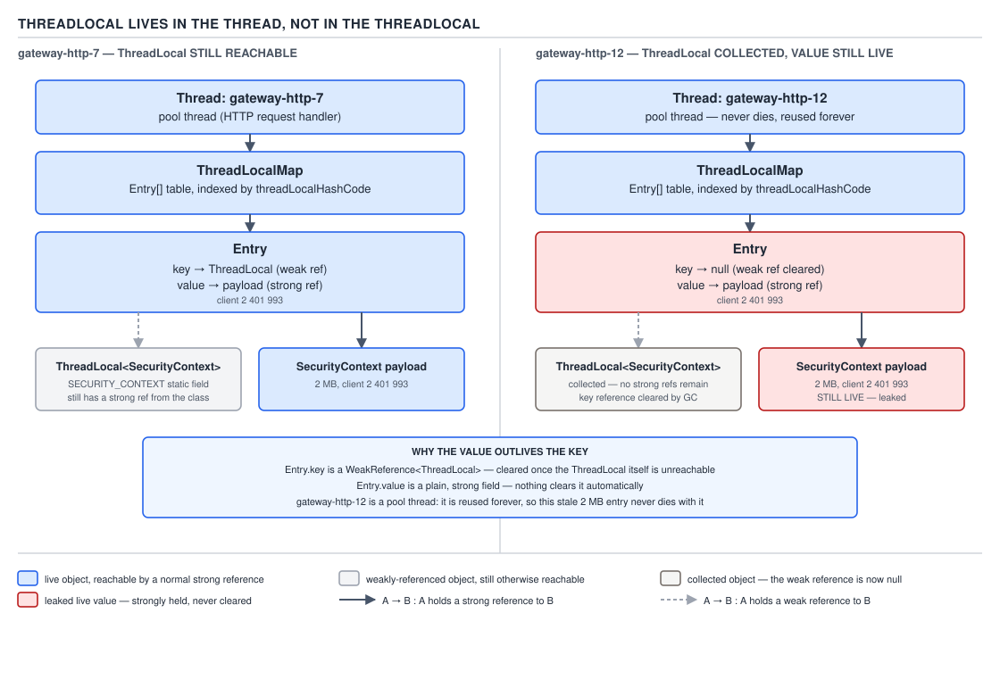
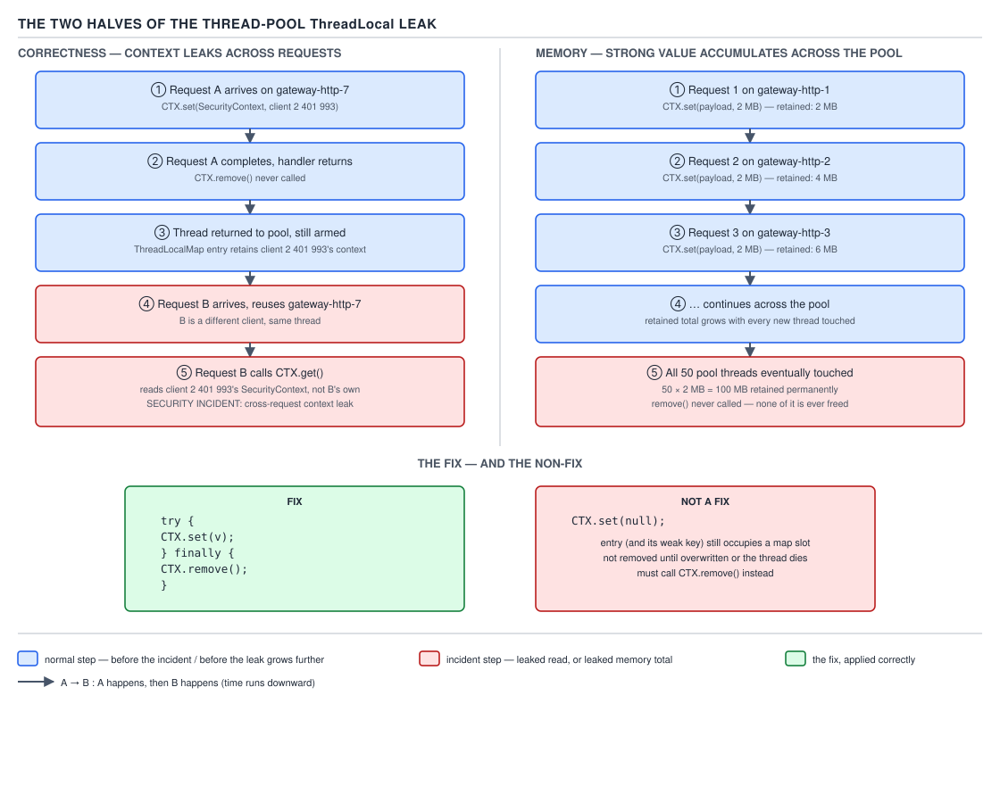

# 05 Multithreading and Concurrency — ThreadLocal — BASICS (§1.23)

**Target version: Java 21 LTS.** | **Part 1 of 5** | [Index](../00-index.md)
Previous: [Fork/join](../fork-join/01-basics.md) · Next: [Virtual threads — the model](../virtual-threads/01-basics-the-model.md)

## Where the map actually lives

### Mental model

Picture two filing cabinets, one bolted to each `Thread` object, not one shared cabinet with a drawer per thread. Every `Thread` instance carries a private field, `threadLocals`, of type `ThreadLocal.ThreadLocalMap`. A `ThreadLocal<T>` object is not a container at all — it is a **key**. Calling `CTX.get()` on thread T means: "walk to T's own cabinet, find the drawer labelled `CTX`, read what's in it." The `ThreadLocal` object itself holds no per-thread state; it is shared by every thread that touches it, and each thread's map has its own independent entry keyed by that same shared object.

This is the opposite of the naive picture most engineers carry — a map inside the `ThreadLocal` from thread to value. If that were true, garbage-collecting a `Thread` would be the only way to lose a value, and a `ThreadLocal` would need to track every thread that ever called `set` on it, which would itself be a synchronization nightmare across thread creation and destruction. Instead the JDK inverted the relationship: the value lives with the thread, so it dies when the thread dies — except thread-pool threads famously never die, which is exactly D-093 below.

### Why it exists

Before `ThreadLocal` (introduced in Java 1.2), giving each thread its own private copy of a value meant either passing that value through every method signature on the call stack, or using a `synchronized` shared field and accepting the throughput hit. Neither works for cross-cutting, per-request state — a security context set at the request's edge and read three call frames later inside a service that has no business knowing about HTTP. `ThreadLocal` gives that state a thread-scoped home without threading it through every method parameter.

### When to reach for it, and when not

Reach for `ThreadLocal` for two legitimate shapes only: per-request context propagation (an MDC trace id, a `SecurityContext`, a tenant id, a transaction handle) that many unrelated call frames need without a parameter; and per-thread caching of an object that is expensive to construct and not thread-safe, so each thread gets its own private, reusable instance instead of synchronizing on a shared one.

Do not reach for it as a substitute for passing a parameter down two or three call frames — that is simpler and does not risk leaking state across reuse. Do not reach for it on virtual threads to cache an expensive object (leaf 1.23.10, below) — a virtual thread is never pooled, so the "one construction amortised across many tasks" argument that justifies the pattern on platform threads does not hold. And do not reach for it at all where `ScopedValue` (final since Java 25, `[VERSION-TRAP]` below) already covers the use case: an immutable, write-once-per-scope value shared with callees and structured-concurrency children.

### How it works

`Thread` declares:

```java
ThreadLocal.ThreadLocalMap threadLocals = null;
```

`ThreadLocalMap` is a custom open-addressing hash map, private to `ThreadLocal`, whose `Entry` extends `WeakReference<ThreadLocal<?>>`. Each `Entry` therefore holds a **weak** reference to the `ThreadLocal` key and a plain **strong** reference to the value object. `ThreadLocal.get()` reads `Thread.currentThread().threadLocals`, looks up the entry keyed by `this`, and returns its value (or runs `initialValue()`/the `withInitial` supplier and stores that on a miss). `set(v)` writes the same lookup slot. `remove()` deletes the entry outright.



**D-093** — `ThreadLocal` lives in the Thread, not the ThreadLocal.

Follow the weak key to its conclusion. If every strong reference to a `ThreadLocal` object goes away — the field holding it falls out of scope, its declaring class is unloaded — the GC can collect it because the map's own reference is weak. What's left behind is a stale `Entry` whose key slot reads `null` but whose value slot still strongly references, say, a 2 MB buffer. That entry is only ever cleaned up lazily, when a future `get`/`set`/`remove` call on that *same map* happens to sweep past it and notices the null key. On a pool thread that mostly calls `CTX.get()` on a small, stable set of live `ThreadLocal`s, that sweep may never touch the dead entry, and the value sits there, reachable through `Thread → threadLocals → Entry.value`, for as long as the thread lives — which for a pool thread is indefinitely.

**Insight:** the weak key does not save you from the leak that matters in practice. It protects against the `ThreadLocal` object itself outliving its usefulness; it does nothing for a *live* `ThreadLocal` whose value was never removed. That is the leak every pool application actually hits.

### A minimal concrete example

`AccountMaintenance` runs behind a fixed thread pool. Every inbound call carries a `SecurityContext` for the authenticated client that downstream code — audit logging, restriction checks, ledger writes — reads without a parameter:

```java
public final class SecurityContextHolder {

    private static final ThreadLocal<SecurityContext> CTX = new ThreadLocal<>();

    private SecurityContextHolder() {}

    public static void bind(SecurityContext context) {
        CTX.set(context);
    }

    public static SecurityContext current() {
        SecurityContext context = CTX.get();
        if (context == null) {
            throw new IllegalStateException("no SecurityContext bound on this thread");
        }
        return context;
    }

    public static void clear() {
        CTX.remove();
    }
}

public record SecurityContext(ClientId clientId, Jurisdiction jurisdiction, boolean stepUpVerified) {}
```

A restriction check three frames deep, with no `SecurityContext` parameter in sight:

```java
public void assertNotBlocked(RestrictionType type) {
    ClientId clientId = SecurityContextHolder.current().clientId();
    if (restrictions.isActive(clientId, type)) {
        throw new RestrictedActionException(clientId, type);
    }
}
```

### The gotcha — the pool leak, both halves

The pool's fixed worker threads are reused across unrelated requests. If `bind` is called and `clear` is not, the next task scheduled onto that same worker sees the previous request's context — not `null`, not a fresh default, but genuinely stale data from someone else's session.



**D-094** — The two halves of the thread-pool `ThreadLocal` leak.

**Correctness half.** Client `2 401 993`'s request A calls `SecurityContextHolder.bind(new SecurityContext(clientId2401993, ...))`. The pool worker finishes A and is returned to the pool without a `clear()`. Request B, for a different client, is scheduled onto that exact worker. B never calls `bind` — perhaps its auth filter short-circuits, perhaps it's a background maintenance task on the same executor — and `SecurityContextHolder.current()` silently returns client `2 401 993`'s context. B's audit log now attributes to the wrong client, or worse, B's restriction check passes because client `2 401 993` happened not to be blocked. This is not a theoretical bug class; it is a genuine security-incident category — cross-tenant data exposure through thread-pool reuse — and it is invisible in single-request testing because a fresh JVM, or a pool with exactly one live request at a time, never reuses a dirty thread.

**Memory half.** Independently of correctness, every `bind` without a matching `clear` leaves the `Entry`'s value slot holding the previous `SecurityContext` (and anything it references) strongly, until the next `set` overwrites that same slot. In a fixed pool this bounds memory to (pool size × one context) rather than growing unboundedly, but it is still a live, wrong, unaccounted-for reference sitting on a thread that will never die to reclaim it.

**Pitfall:** believing `CTX.set(null)` is a fix for either half. `set(null)` calls the map's normal put path: it finds or creates the `Entry` for `CTX` and stores `null` as the value. The entry still exists, keyed live by `CTX`, holding `null` — which does fix a value-retention memory leak of the *previous* object, but it does nothing for the correctness half, and it does not free the `Entry` and its `WeakReference` bookkeeping the way an actual `remove()` does. `remove()` deletes the entry from the map outright, so both halves are addressed only by the `try/finally` shape:

```java
public void handle(Client2401993Request request) {
    SecurityContextHolder.bind(loadSecurityContext(request.clientId()));
    try {
        process(request);
    } finally {
        SecurityContextHolder.clear();
    }
}
```

Every `bind`-shaped call must be paired with a `finally { clear(); }` in the same method, never in a caller three frames up, and never guarded by a condition that can be skipped on an exception path.

> **Definition:** a `ThreadLocal` gives each thread its own independent value for a shared key, stored inside the `Thread` object itself — not a memory leak by design, but one by omission the moment a thread outlives the value's intended scope, which on a pool is every request.

## Supporting facts

**API surface (leaf 1.23.2).** `get()`, `set(T)`, `remove()`, protected `initialValue()` (override to supply a per-thread default lazily, on first `get()`), and `static <S> ThreadLocal<S> withInitial(Supplier<? extends S> supplier)` (Java 8), the functional-style alternative to subclassing for `initialValue()`. **Gotcha:** `initialValue()`/`withInitial` runs once per thread, on that thread's first `get()` with no prior `set()` — not once globally, and not eagerly at construction.

> A `ThreadLocal<T>` is a key object whose `get`/`set`/`remove` operate on a map stored in the calling thread, giving each thread an independently readable and writable slot for that key.

**`SimpleDateFormat` and the modern answer (leaf 1.23.4).** `SimpleDateFormat` is the textbook thread-unsafe JDK class — its internal `Calendar` field is mutated during both `format` and `parse`, so a shared instance under concurrent calls corrupts output or throws. The historical fix was exactly the per-thread caching pattern: `ThreadLocal<SimpleDateFormat> FMT = ThreadLocal.withInitial(() -> new SimpleDateFormat("yyyy-MM-dd"))`. The modern answer is to not need the pattern at all: `java.time.format.DateTimeFormatter` is immutable and thread-safe by construction, so a single `static final DateTimeFormatter` shared across every thread is correct with zero `ThreadLocal` machinery. See the date/time internals guide (topic 03) for the immutability argument in full. **Pitfall:** porting old `SimpleDateFormat`-in-`ThreadLocal` code forward without noticing `DateTimeFormatter` removes the need for the wrapper entirely — the `ThreadLocal` becomes unnecessary ceremony, not a bug, but it is dead weight and one more place `remove()` can be forgotten.

**The classloader-leak consequence (leaf 1.23.7).** In an application server, a `ThreadLocal` value whose class was loaded by a web application's own classloader (rather than the container's shared classloader) keeps that entire classloader reachable for as long as the entry survives — via `Thread → threadLocals → Entry.value → value's Class → its ClassLoader`. On redeploy, the container replaces the app's classloader, but if a container thread pool still holds the stale entry, the old classloader and every class it loaded stay in metaspace, unable to be collected. Repeated redeploys without a JVM restart accumulate one leaked classloader generation per redeploy — a well-documented Tomcat/WebLogic failure mode. **Unverified:** the exact current-generation mitigation behaviour (Tomcat's `ThreadLocal` leak detector at webapp stop) varies by container version and was not re-verified against a specific container release for this file; treat the mechanism as confirmed and the detector specifics as container-version-dependent.

**`InheritableThreadLocal` (leaf 1.23.9).** A child `Thread` copies its parent's `InheritableThreadLocal` values via `Thread.init()`'s call to `ThreadLocalMap.createInheritedMap`, at the moment the child `Thread` object is **constructed** — not when a task is submitted to it. `[TRAP]` **Pitfall:** assuming `InheritableThreadLocal` propagates request context through an `ExecutorService`. A pool's worker threads are constructed once, at pool startup or first growth, long before any specific request exists. The "inheritance" snapshot happened then, against whatever the constructing thread's context was — typically nothing, or the context of whichever thread first triggered pool growth — and it is never retaken for each task handed to that worker afterward. The fix is not a different `ThreadLocal` subclass; it is explicit propagation at the executor boundary (leaf 1.23.12, below).

> `InheritableThreadLocal` copies parent-to-child exactly once, at child-thread construction — a fact about thread creation, not about task scheduling, which is why it silently does nothing useful on a pool.

**`ThreadLocal` and virtual threads (leaf 1.23.10).** `[VERSION-TRAP]` Every virtual thread is its own `Thread` object with its own `threadLocals` map, and — this is the point — a virtual thread is never pooled or reused across unrelated tasks; the platform-thread mount/unmount machinery underneath it is invisible to `ThreadLocal`, which only ever sees the virtual thread it was set on. That makes the correctness-leak class from D-094 structurally impossible with virtual threads: a value set on virtual thread V for task A can never be read by task B, because B runs on its own, brand-new virtual thread. But it also destroys the caching legitimate-use case (leaf 1.23.3): caching an expensive, non-thread-safe object in a `ThreadLocal` assumed the cost amortises across many tasks reusing the same physical thread. With one virtual thread per task, that cache is constructed once and discarded once, per task — the allocation happens on every single request instead of being shared. Oracle's own virtual-threads guidance calls this out explicitly: identify any `ThreadLocal.withInitial()` used purely for caching before adopting virtual threads at scale, because the pattern silently degrades from "amortised construction" to "construct-and-discard every request," which shows up only as diffuse allocation pressure, not as an error.

> On virtual threads, `ThreadLocal` correctness improves (no pool-reuse leak) but `ThreadLocal`-as-cache regresses (one construction per task, not per thread) — the two legitimate uses of `ThreadLocal` move in opposite directions under the same change.

**Context propagation across an executor boundary (leaf 1.23.12).** `[BUILD]` Since neither plain nor inheritable `ThreadLocal` survives a hop through an `Executor` correctly, the task itself must carry the context. A decorating `Runnable` captures the context on the submitting thread and rebinds it on the worker thread, restoring the worker's prior state afterward so the pool thread is clean for the next task regardless of outcome:

```java
public final class ContextPropagatingExecutor implements Executor {

    private final Executor delegate;

    public ContextPropagatingExecutor(Executor delegate) {
        this.delegate = delegate;
    }

    @Override
    public void execute(Runnable task) {
        SecurityContext captured = SecurityContextHolder.current();
        delegate.execute(() -> {
            SecurityContextHolder.bind(captured);
            try {
                task.run();
            } finally {
                SecurityContextHolder.clear();
            }
        });
    }
}
```

Spring's `TaskDecorator` (implemented against `ThreadPoolTaskExecutor`) and Micrometer's `ContextSnapshot` generalise exactly this shape — capture on submit, rebind on run, clear in `finally` — across multiple simultaneous `ThreadLocal`-backed contexts (security, MDC, tracing) instead of one at a time.

**MDC and distributed tracing (leaf 1.23.13).** The highest-value real-world use of this whole mechanism: SLF4J's MDC (Mapped Diagnostic Context) is `ThreadLocal`-backed, and a trace id bound via MDC at the start of handling a request for `client 2 401 993` appears in every log line on that thread for free — until the request hops an async boundary (an `@Async` method, a `CompletableFuture.supplyAsync` on a shared pool, a message-listener thread). At that hop, the new thread's MDC is empty, and every subsequent log line loses the trace id, breaking the ability to correlate a distributed trace across the async gap. The fix is the same decorating pattern as leaf 1.23.12 — capture `MDC.getCopyOfContextMap()` on submit, `MDC.setContextMap(...)` on the worker, `MDC.clear()` in `finally`.

**`Thread.Builder.inheritInheritableThreadLocals(false)` (leaf 1.23.11).** `[RESEARCH]` `Thread.ofVirtual()` and `Thread.ofPlatform()` both expose `Thread.Builder.inheritInheritableThreadLocals(boolean)`, defaulting to `true`; setting it `false` opts a newly built thread out of the one-time inheritance copy described above, useful when spawning a virtual thread per task is itself the propagation boundary and inheriting a stale parent snapshot would be wrong. **Unverified:** the precise interaction between this builder flag and the (JDK 21 preview) virtual-thread scheduler's own carrier-thread lifecycle — whether a re-mount after unmounting a virtual thread can re-trigger inheritance — was not confirmed against a primary source for this file and is recorded below rather than asserted.

## Pitfalls

### Assuming `set(null)` is equivalent to `remove()`

**Wrong**

```java
public void handle(Client2401993Request request) {
    SecurityContextHolder.bind(loadSecurityContext(request.clientId()));
    process(request);
    SecurityContextHolder.bind(null); // "cleared" it, right?
}
```

If `process` throws, `bind(null)` never runs and the real context leaks to the next task on this worker. Even on the success path, `bind(null)` only overwrites the value slot of the still-live `Entry` — it does not delete the entry, so the map keeps carrying dead weight for this `ThreadLocal` on this thread.

**Right**

```java
public void handle(Client2401993Request request) {
    SecurityContextHolder.bind(loadSecurityContext(request.clientId()));
    try {
        process(request);
    } finally {
        SecurityContextHolder.clear();
    }
}
```

`clear()` calls `remove()`, deleting the `Entry` outright, and the `finally` guarantees it runs on every exit path, including exceptions.

**Why people believe it:** `set(null)` reads as "unset the value," and for a plain local variable it would be. `ThreadLocal.set` doesn't unset anything — it stores, and `null` is just another value to store in an entry that still exists.

### Assuming `InheritableThreadLocal` fixes pool context propagation

**Wrong**

```java
private static final InheritableThreadLocal<SecurityContext> CTX = new InheritableThreadLocal<>();
// expecting each submitted task's context to appear inside the pool worker
executor.submit(() -> {
    SecurityContext ctx = CTX.get(); // null, or the wrong request's context
    process(ctx);
});
```

**Right**

Capture and rebind explicitly at the submission boundary (leaf 1.23.12's `ContextPropagatingExecutor`), regardless of whether the underlying `ThreadLocal` is inheritable or plain — inheritance timing cannot help once threads are created before requests exist.

**Why people believe it:** the name "inheritable" strongly suggests "propagates to whatever runs next on this thread," when it actually means "copies once, at the moment a specific child `Thread` object is built."

## Cheat sheet

| Fact | Detail |
|---|---|
| Storage location | `Thread.threadLocals` (a `ThreadLocalMap`), not inside the `ThreadLocal` |
| `Entry` key | `WeakReference<ThreadLocal<?>>` |
| `Entry` value | strong reference — the actual leak risk |
| `set(null)` vs `remove()` | `set(null)` keeps a live entry with a null value; `remove()` deletes the entry |
| Pool leak, correctness half | stale value from request A read during request B on a reused worker |
| Pool leak, memory half | strong value reachable from a thread that never dies |
| Fix | `try { CTX.set(v); ... } finally { CTX.remove(); }` |
| `InheritableThreadLocal` copies | at child `Thread` construction, not at task submission — wrong timing for a pool |
| Virtual threads + correctness | leak class disappears — one virtual thread per task, never reused |
| Virtual threads + caching | legitimate use degrades — one construction per task, not per thread |
| `ScopedValue` (Java 25, JEP 506 final) | immutable, scope-bound alternative; not a drop-in for mutable per-request state that must be reassigned |
| Executor boundary propagation | must be explicit: decorating `Runnable`, Spring `TaskDecorator`, Micrometer `ContextSnapshot` |
| `SimpleDateFormat` modern answer | `DateTimeFormatter` — immutable, no `ThreadLocal` needed at all |

## Self-test

**Q1.** Where does the value returned by `CTX.get()` physically live — inside the `ThreadLocal` object or inside the calling thread?

<details><summary>Answer</summary>

Inside the calling thread. Every `Thread` has a `threadLocals` field holding a `ThreadLocalMap`; `CTX.get()` looks up the entry keyed by the `CTX` object in *that thread's own* map. The `ThreadLocal` object is a shared key, not a container — it holds no per-thread state itself.

</details>

**Q2.** Why are `ThreadLocalMap` keys `WeakReference`s but values are ordinary strong references, and why does that asymmetry not prevent the pool leak?

<details><summary>Answer</summary>

The weak key lets a `ThreadLocal` object be garbage-collected once nothing else references it, even though a thread's map still has a stale entry pointing at it — this avoids `ThreadLocal`s themselves leaking forever. But the value is strong precisely so `get()` keeps working correctly while the `ThreadLocal` is legitimately still alive. The pool leak isn't about a collected `ThreadLocal` at all — `CTX` is a `static final` field that lives for the JVM's whole life. It's about a *live* `ThreadLocal` whose value from a finished request was never removed, so the strong value reference sits there, fully reachable, until an explicit `remove()`.

</details>

**Q3.** A fixed thread pool serves client `2 401 993`'s request, which binds a `SecurityContext` via `ThreadLocal` and never calls `remove()`. What is the concrete failure the next request on that same worker can experience?

<details><summary>Answer</summary>

The next request, for a different client, calls `SecurityContextHolder.current()` and gets client `2 401 993`'s `SecurityContext` back instead of its own — because the pool worker was reused and the `ThreadLocal` entry was never cleared. Depending on what the code does with that context, this can mean logging or auditing under the wrong client's identity, or a restriction check that passes because client `2 401 993` happened to have no active restrictions, even though the actual requesting client does.

</details>

**Q4.** Why doesn't `InheritableThreadLocal` solve context propagation for an `ExecutorService`?

<details><summary>Answer</summary>

It copies the parent thread's value to the child at the moment the child `Thread` object is constructed. A pool's worker threads are constructed once, up front (or on growth), long before any individual task or request exists. There is no re-copy when a task is later submitted to that worker, so whatever was captured at construction time — typically nothing meaningful — is all the worker ever has.

</details>

**Q5.** What changes about the `ThreadLocal`-as-cache pattern (e.g. caching a `Random` or a scratch buffer per thread) when the code runs on virtual threads instead of platform threads?

<details><summary>Answer</summary>

On platform threads, the cache is constructed once per physical thread and reused across every task that thread ever runs, amortising the construction cost. On virtual threads, each task typically gets its own virtual thread that is never reused for an unrelated task, so the "cache" is constructed once and discarded once per task — every request pays the full construction cost, silently turning an amortised cost into a per-request cost.

</details>

**Q6.** Why is `CTX.set(null)` not a fix for the thread-pool leak?

<details><summary>Answer</summary>

`set(null)` still performs a normal write into the `ThreadLocalMap`: it locates (or creates) the `Entry` for `CTX` and stores `null` as its value. The `Entry` itself is not removed. This does stop a stale *object* from being retained, but it does nothing for the correctness half of the leak (a subsequent `set` before the next `get` reintroduces real state, and any code path that skips the `set(null)` on an exception leaves the previous value in place) and it leaves entry-management overhead behind that `remove()` avoids.

</details>

**Q7.** What is the practical difference between the correctness half and the memory half of the pool leak, and can you have one without the other?

<details><summary>Answer</summary>

The correctness half is about a *stale but wrong* value being read by unrelated work — a functional bug, potentially a security incident. The memory half is about a value being *retained* longer than necessary, purely a resource-accounting problem. You can have the memory half without the correctness half if nothing ever reads the stale entry (e.g., a huge scratch buffer that's set once and never read again is a pure memory leak). You can have the correctness half without meaningfully being called a "memory leak" if the retained value is small — the security exposure is real even though the byte count is trivial.

</details>

**Q8.** Under what circumstance does the classloader-leak consequence (leaf 1.23.7) arise, and why does it survive a redeploy?

<details><summary>Answer</summary>

It arises when a `ThreadLocal` value's class was loaded by an application's own classloader inside a container (e.g. a servlet container), and that entry is never removed on a container thread-pool worker before the application is redeployed. The chain `Thread → threadLocals → Entry.value → Class → ClassLoader` keeps the old classloader — and every class it loaded — reachable even after the container swaps in a new classloader for the redeployed app, because the pool thread that holds the stale entry survives the redeploy.

</details>

**Q9.** Name the two legitimate uses of `ThreadLocal` and the modern alternative that has partly displaced one of them.

<details><summary>Answer</summary>

Per-request context propagation (security context, MDC/trace id, tenant id) and per-thread caching of a non-thread-safe, expensive-to-construct object (classically `SimpleDateFormat`, also `Random` or a `ByteBuffer`). `DateTimeFormatter` displaces the `SimpleDateFormat` caching case specifically, because it's immutable and thread-safe by construction, so no per-thread copy is needed at all.

</details>

**Q10.** What must happen at the boundary of a call like `executor.submit(task)` for a security context to be visible inside `task`, and which JDK mechanism does not achieve this on its own?

<details><summary>Answer</summary>

The context must be explicitly captured on the submitting thread and rebound on the worker thread before `task` runs, then cleared in a `finally` after it completes — via a decorating `Runnable`, Spring's `TaskDecorator`, or Micrometer's `ContextSnapshot`. Neither plain `ThreadLocal` nor `InheritableThreadLocal` achieves this on its own: plain `ThreadLocal` has no propagation at all across threads, and `InheritableThreadLocal` only copies at thread construction, which predates the task.

</details>

## Open questions

- **Unverified:** the exact current-generation container-level `ThreadLocal` leak detection behaviour on redeploy (leaf 1.23.7) varies by application-server version and was not checked against a specific release for this file.
- **Unverified:** the interaction between `Thread.Builder.inheritInheritableThreadLocals(false)` and virtual-thread carrier re-mounting during a task's lifetime (leaf 1.23.11) was not confirmed against a primary JDK source.

---

**Leaves covered:** 1.23.1–1.23.13 (13 leaves)
**Leaves deferred:** none
**Diagrams included:** D-093, D-094
**Target version:** Java 21 LTS
**Lines:** 326
