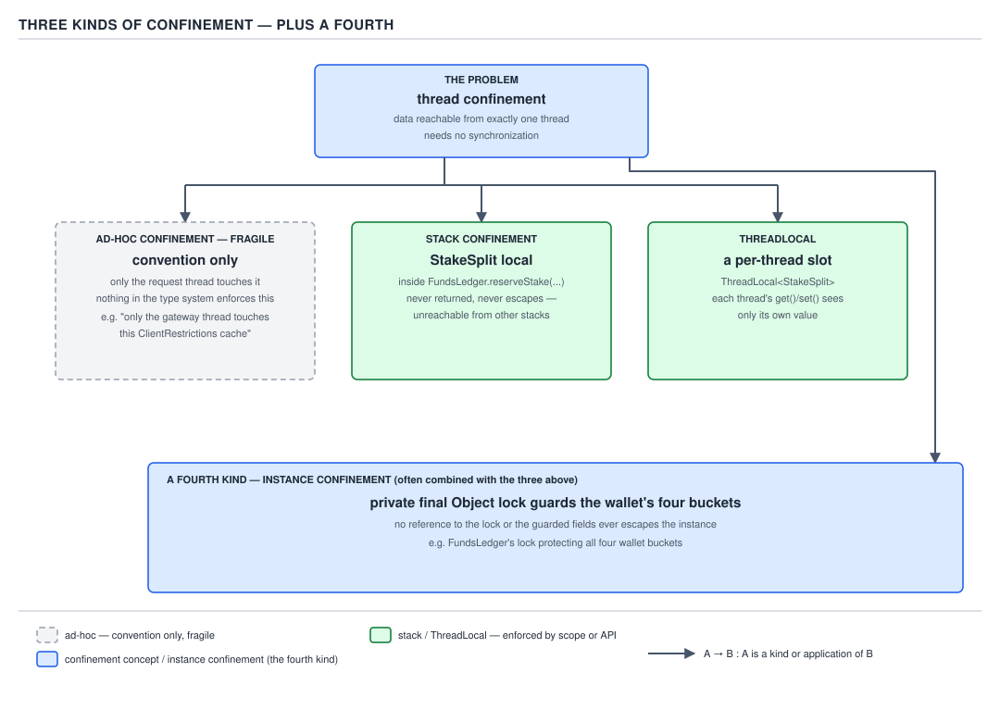
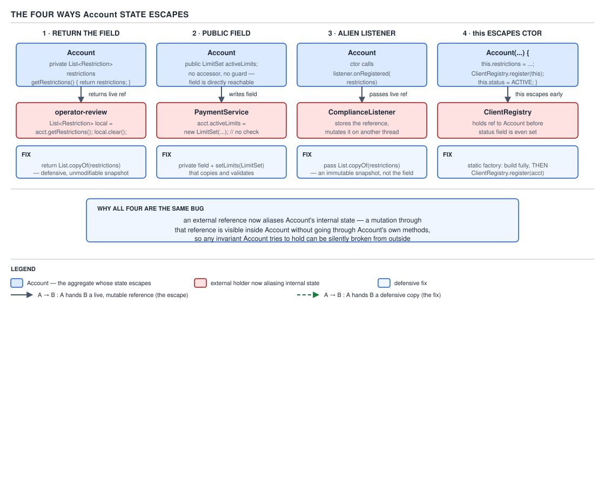

# 05 Multithreading and Concurrency — Thread safety — BASICS (§1.6)

**Target version: Java 21 LTS.** | **Part 1 of 5** | [Index](../00-index.md)
Previous: [Threads — interruption and cancellation](../threads/03-basics-interruption.md) · Next: [Thread safety — races and compound actions](02-basics-races.md)

Thread safety is not a property of a class in isolation — it is a claim about how that class
behaves when its state is touched from more than one thread at once, with no cooperation from the
caller. The words `immutable`, `confined`, `atomic`, `visible`, `ordered`, and `escaped` recur in
every subsequent file; getting sloppy about any one of them now produces exactly the "it works on
my machine" bugs the rest of the topic exists to explain.

## 1. The definition, and why it needs a stated invariant (1.6.1, 1.6.2)

A class is **thread-safe** when it behaves correctly under any interleaving of accesses by
multiple threads, in any order, with no additional synchronization on the caller's part.

`[SOURCE]` Brian Goetz's *Java Concurrency in Practice* states it this way:

> "A class is thread-safe if it behaves correctly when accessed from multiple threads, regardless
> of the scheduling or interleaving of the execution of those threads by the runtime environment,
> and with no additional synchronization or other coordination on the part of the calling code."

Notice what it does not say: not "does not throw", not "does not corrupt memory" — it says
**behaves correctly**, and correctness is undefined until you state what the class promises.
"Thread-safe" without a stated invariant is a sentence with no content.

`[PROVE]` Take `FundsLedger.reserveStake(ClientId id, Money stake)`. Its invariant: `CASH_RESERVED
+ BONUS_RESERVED` increases by exactly `stake` while `CASH_AVAILABLE + BONUS_AVAILABLE` decreases
by exactly `stake`. Two threads call `reserveStake` concurrently, each reserving 2.00 from a
stakeable balance of 3.00. If the implementation reads `CASH_AVAILABLE`, checks it covers the
stake, then writes the new value — a read-check-write — both pass the check against the same
starting balance, both write, and the ledger ends at `CASH_AVAILABLE` = -1.00. No exception, no
stack trace — the invariant broke silently, so the class was **not** thread-safe, even though every
line executed without error. Every claim of thread safety in this file names the invariant.

## 2. The five-level thread-safety taxonomy (1.6.3)

`[RESEARCH]` **Mental model.** Picture a spectrum from "throw this at any number of threads and
never think about it again" down to "using this from more than one thread is a bug report waiting
to happen", with three graded stops between. JCiP fixes the spectrum at five named levels so a
caller knows, before writing a line of code, exactly which discipline they are on the hook for.

**Why it exists.** Before this vocabulary, teams described safety with adjectives like "mostly
safe", which carry zero information about what the caller must do. The five levels replace vague
adjectives with a specific caller obligation per level.

**When to reach for which level, and when not.** You do not design a class then classify it —
classification is a *consequence* of a design decision made for other reasons (immutability for
sharing, internal locking for convenience). The taxonomy lets the javadoc state that consequence
precisely instead of leaving the caller to discover it by a `for` loop throwing
`ConcurrentModificationException`.

**How it works — the five levels, in decreasing order of caller burden:** immutable (zero burden —
nothing changes) → thread-safe (zero burden — internally synchronized against any sequence) →
conditionally thread-safe (lock externally around specific multi-call *sequences* only) →
thread-compatible (lock externally around **every** access, including reads) → thread-hostile
(no discipline helps; typically mutates shared static state unrelated callers cannot lock against).
D-019 lays these out against a JDK example, a QuizStakes example, and what the javadoc should say.

| Level | Caller must do | JDK example | QuizStakes example | Javadoc should say |
|---|---|---|---|---|
| Immutable | Nothing | `String`, `Instant` | `Money(BigDecimal, Currency)` | `@Immutable` — safe to share without synchronization. |
| Thread-safe | Nothing | `ConcurrentHashMap`, `AtomicLong` | `FundsLedger` — enforces its own invariant | `@ThreadSafe` — no external locking required. |
| Conditionally thread-safe | Lock around specific *sequences* (iteration, check-then-act) | `Hashtable`, `Vector` (iteration) | `Collections.synchronizedList` wrapping a `List<Restriction>` — each call safe, iteration needs `synchronized(list)` | State exactly which sequences need external locking, on which object. |
| Thread-compatible | Lock around **every** access | `ArrayList`, `HashMap`, `SimpleDateFormat` | A plain `ArrayList<Restriction>` DTO field, unwrapped | `@NotThreadSafe` — requires external synchronization. |
| Thread-hostile | Nothing helps | Static caches mutated unsynchronized (rare, usually a bug) | A `RestrictionCache` memoizing into a static, unsynchronized `HashMap` shared across clients | State plainly it must not be used concurrently; fix the design. |

**D-019** — The five-level thread-safety taxonomy.

**A minimal concrete example.**

```java
// Level 2 — thread-safe: FundsLedger enforces its invariant internally.
public final class FundsLedger {
    private final ReentrantLock lock = new ReentrantLock();
    private final Map<ClientId, Position> positions = new HashMap<>();

    public void reserveStake(ClientId id, Money stake) {
        lock.lock();
        try {
            Position p = positions.get(id);
            Money stakeable = p.cashAvailable().plus(p.bonusAvailable());
            if (stakeable.isLessThan(stake)) throw new InsufficientFundsException(id, stake);
            positions.put(id, p.withReservation(stake));
        } finally {
            lock.unlock();
        }
    }
}
```

**Gotcha.** `Collections.synchronizedList` (level 3) fools people into thinking they bought level-2
safety — every call is locked, but the lock releases between calls, so `size()` then
`get(size() - 1)` racing a concurrent `remove` can throw — see Pitfalls below for the fix.

> A thread-safety level names how much synchronization discipline the **caller** must supply — from
> none (immutable, thread-safe) to constant vigilance (thread-compatible) to "do not attempt".

## 3. State ownership (1.6.4)

**Mechanism.** A class owns the state it encapsulates only if nothing outside can reach it except
through its own methods. An `Account` returning its `List<Restriction>` field directly creates
**shared ownership**: `Account` believes it controls the list, but so does every caller holding
the reference. **Split ownership** is deliberate: a container owns the *structure* while the caller
owns the *elements* — an `ExecutorService` owns its queue but not each submitted `Runnable`'s state.

**Gotcha.** Shared ownership is not a bug at creation — `Account` returning `this.restrictions`
compiles and passes any test that only reads the list. It becomes a bug the day someone calls
`.add()` on it from outside.

> State ownership means a class is the only path to its own mutable state; the moment a second path
> exists — a returned reference, a public field — ownership has silently become shared.

## 4. Thread confinement: three kinds, plus instance confinement (1.6.5, 1.6.6)

**Mental model.** The cheapest way to make code thread-safe is to ensure only one thread ever
touches the state — no concurrent access, nothing to synchronize. Confinement keeps mutable state
inside a boundary only one thread can cross; the four boxes below range from "a convention nobody
enforces" to "the compiler enforces it for you." Locking has a cost — contention, context-switch
risk — so if a `StakeSplit` never leaves the stack frame that created it, no lock is needed at all:
confinement is thread safety for free.

**When to reach for which kind, and when not.** Prefer stack confinement whenever state's lifetime
matches one method call. Reach for `ThreadLocal` when a per-thread value must outlive one call
across a chain you don't control (a request-scoped `IdempotencyKey`). Reach for instance
confinement when state must outlive a single thread's work but still be touched by multiple
threads over time — the Java monitor pattern. Never rely on ad-hoc confinement in new code.

**How it works.**

- **Ad-hoc confinement** — rests entirely on convention ("only the request thread touches this
  field"). Nothing in the compiler prevents a second caller from breaking the rule.
- **Stack confinement** — a local variable that never escapes the method that created it. A
  `StakeSplit` computed inside `FundsLedger.reserveStake` and never stored elsewhere is stack
  confined: each thread has its own stack, so no other thread can ever reference it.
- **`ThreadLocal`** — an explicit, JDK-enforced per-thread slot. Each thread's `get()` sees its own
  independently initialized value — confinement made visible in the type system.
- **Instance confinement (the Java monitor pattern)** — guard the state with a `private final` lock
  object that never escapes the instance, and never publish the guarded state itself. This applies
  confinement to state *shared* over time — the boundary is the object's own monitor.

D-020 draws the four boxes side by side.



**D-020** — Three kinds of confinement, plus instance confinement as the fourth box: a private `final Object lock` guarding the state, with no reference ever escaping.

**A minimal concrete example.**

```java
public final class FundsLedger {
    private final Object lock = new Object(); // instance confinement: never exposed
    private final Map<ClientId, Position> positions = new HashMap<>();

    public StakeSplit reserveStake(ClientId id, Money stake) {
        Position p;
        synchronized (lock) { p = positions.get(id); }
        // Stack confinement: 'split' never leaves this method or escapes to another thread.
        Money bonusPortion = p.bonusAvailable().min(stake.percentage(10));
        StakeSplit split = new StakeSplit(bonusPortion, stake.minus(bonusPortion));
        synchronized (lock) { positions.put(id, p.withReservation(split)); }
        return split; // the VALUE is fine to return; Money and StakeSplit are immutable.
    }
}
```

**Pitfall:** assuming `private` alone gives confinement. It blocks *compile-time* access from other
classes but not the class's own methods handing out the guarded object (leaf 1.6.10) — confinement
is about runtime reference reachability, and one careless getter breaks it for the whole class.

> Thread confinement eliminates the need for synchronization by guaranteeing that only one thread —
> or, for instance confinement, only code holding the guarding lock — can ever reach the state.

## 5. Documenting the policy: `@GuardedBy` and the `@ThreadSafe` family (1.6.7, 1.6.8)

`[RESEARCH]` **Mechanism.** `@GuardedBy("lock")` is executable documentation: it states which lock
must be held to touch the annotated member. It originates in JCiP's `net.jcip.annotations`,
re-published in JSR-305; Error Prone ships its own copy with an active `GuardedByChecker` that
performs real static analysis, flagging any access without the named lock provably held, for both
`synchronized` monitors and explicit `Lock` objects. `@ThreadSafe`, `@NotThreadSafe`, and
`@Immutable` carry no compiler enforcement — a tool *could* check them, but by default none does.

```java
public final class FundsLedger {
    private final Object lock = new Object();
    @GuardedBy("lock")
    private final Map<ClientId, Position> positions = new HashMap<>();
}
```

**Gotcha.** None of these annotations change runtime behaviour by themselves. `@ThreadSafe` on a
class that isn't actually thread-safe compiles and runs identically to one that is — it's a claim,
checked only if `GuardedByChecker` is wired into the build; unwired, it's a comment nobody reads.

> `@GuardedBy` names a lock and can be statically enforced (Error Prone's `GuardedByChecker`);
> `@ThreadSafe`/`@NotThreadSafe`/`@Immutable` state policy but carry no enforcement of their own.

## 6. Atomicity, visibility, ordering — three independent properties (1.6.9)

`[TRAP]` **Mental model.** Three separate guarantees get bundled into one mental blob called
"thread safety", and almost every subtle concurrency bug is someone getting one while believing
they had all three. Picture three independent dials: a construct can max one and leave the other
two at zero. **Atomicity** — does an operation happen as one indivisible step, or can another
thread observe it half-done? **Visibility** — is a write guaranteed observable by a later read?
**Ordering** — do a thread's own operations become visible to others in program order, or can they
be reordered by the compiler, JIT, or hardware? Without separating these, "just make it `volatile`"
and "just make it `synchronized`" get used interchangeably, and they are not: `volatile` buys
visibility and ordering for one field but **no atomicity** for compound operations on it.

**When each dial matters, and when it doesn't.** A counter with one writer and many readers needs
only visibility — `volatile` suffices. The same counter with many writers (3,400 settlements/sec
through one counter, per Appendix A) needs atomicity on the increment's read-modify-write —
`volatile` alone is provably insufficient; `AtomicLong` or `synchronized` is required. A field
written once at construction needs none of the three beyond safe publication (§1.6.13).

**How it works, and the proof that `volatile` alone is not enough.** `[PROVE]` A plain
`volatile long stakeCount` incremented by many threads via `stakeCount++` compiles to three steps:
read, add one, write back. `volatile` guarantees each step sees a fresh value — but does not fuse
the three into one atomic unit. Between read and write another thread's own read-modify-write can
interleave: A reads 100, B reads 100, A writes 101, B writes 101 — one increment lost, even though
every read and write was perfectly visible and ordered. `AtomicLong.incrementAndGet()` fixes this
with a CAS loop that performs the read-modify-write as one atomic step (walked in
`92-interview-internals.md`) — visibility was never the problem.

D-022 tabulates all seven constructs against the five properties — the table for the night before
an interview.

| Construct | Atomicity | Visibility | Ordering | Mutual exclusion | Progress |
|---|---|---|---|---|---|
| Plain field | No | No — no happens-before edge at all | No | No | Wait-free (no blocking possible, but also no guarantee) |
| `volatile` | Partial — single read or single write of that field only, not read-modify-write | Yes — every read sees the latest write | Yes — establishes happens-before between writer and reader | No | Wait-free |
| `AtomicLong` (and family) | Yes — for the whole compound op (`incrementAndGet`, `compareAndSet`) on that one variable | Yes — piggybacks on an internal `volatile` field | Yes | No | Lock-free (a CAS loop may retry, but some thread always makes progress) |
| `synchronized` | Yes — for everything inside the block, across any number of variables | Yes — on both entry and exit of the monitor | Yes | Yes | Blocking — a thread can be starved or pinned (JEP 491 note below) |
| `final` | N/A — not a mutation mechanism | Yes — for correctly constructed objects, once the reference is safely published | Yes — the JMM forbids reordering a `final` field's write past the constructor's exit | No | Wait-free |
| Opaque (`VarHandle` `.getOpaque`/`.setOpaque`) | Partial — single read/write only, like `volatile` | No cross-thread visibility ordering guaranteed beyond eventual visibility | No — no happens-before edge, only guarantees against out-of-thin-air values | No | Wait-free |
| Release/acquire (`VarHandle` `.setRelease`/`.getAcquire`) | Partial — single read/write only | Yes — one-directional happens-before from the release to a matching acquire | Yes — one-directional, weaker than full `volatile` (no total order across all releases) | No | Wait-free |

**D-022** — Atomicity, visibility, and ordering are independent: every cell states yes, no, or partial, with the reason.

`[VERSION-TRAP]` The "mutual exclusion" column's `synchronized` caveat matters more on Java 21 than
later: `synchronized` **pins** a virtual thread to its carrier for the block's duration on Java 21
(a limitation of JEP 444's virtual threads). JEP 491 removes that pinning cause in Java 24, and
`-Djdk.tracePinnedThreads` — the diagnostic used to find pinning sites on 21 — was removed with it.
On 21, holding a `synchronized` block on a virtual thread across a blocking call (a PSP round-trip)
starves the carrier pool; standard 21-era advice is `ReentrantLock` on hot, virtual-thread paths.

**Pitfall:** believing `volatile` "flushes to main memory". Caches are already kept coherent
continuously by a protocol such as MESI — there is no per-write round trip to shared memory.
`volatile` inserts JMM-level happens-before edges (a store barrier, and a reload discipline
ensuring the next read isn't served from a stale store buffer) — it changes ordering and
visibility guarantees in the memory model, not where data is physically fetched from. This gets the
practical answer right for the wrong reason, one that breaks down the moment `Opaque` reads come up.

> Atomicity, visibility, and ordering are three separate guarantees a construct may provide
> independently; naming a construct "thread-safe" without saying which of the three it is not a complete claim.

## 7. Escaping: publishing a reference to internal mutable state (1.6.10)

`[TRAP]` **Mental model.** An object "escapes" the moment a reference to its internal mutable
state becomes reachable from outside the code that is supposed to own it — after that moment, every
invariant the owning class thought it enforced is only as good as every other holder of that
reference behaving well, forever. These bugs are among the hardest to spot in review: the leaking
code is syntactically correct, passes every single-threaded test, and looks like ordinary Java — a
getter, a constructor parameter, a listener registration.

**The four ways it happens**, all illustrated on one `Account` aggregate that is supposed to own
its `List<Restriction>` exclusively.

1. **Returning the internal reference directly.**
2. **Storing it in a public field**, bypassing encapsulation entirely.
3. **Passing it to an "alien" method** — code the class does not control, that can stash the
   reference somewhere it outlives the call.
4. **Letting `this` escape from the constructor** — registering the object being constructed with
   another component before construction has finished, so that component can call back into a
   half-initialized instance.

D-021 draws all four against the same aggregate, each with the defensive fix beneath it.



**D-021** — The four ways state escapes, drawn on one `Account` aggregate, with the defensive fix beneath each.

**A minimal concrete example — all four, broken then fixed.**

```java
// BROKEN — way 2: public field, no encapsulation.
public final class Account {
    public final List<Restriction> restrictions = new ArrayList<>();

    // BROKEN — way 1: returning the internal reference directly.
    public List<Restriction> getRestrictions() {
        return restrictions; // any caller can add()/remove() behind Account's back
    }

    // BROKEN — way 3: an alien method (listener callback) could stash this reference forever.
    public void notifyRestrictionsChanged(RestrictionListener alienListener) {
        alienListener.onChanged(restrictions);
    }
}

// FIXED — private field; defensive unmodifiable copies everywhere a reference would leave.
public final class Account {
    private final List<Restriction> restrictions = new ArrayList<>();

    public List<Restriction> getRestrictions() {
        return List.copyOf(restrictions);
    }

    public void notifyRestrictionsChanged(RestrictionListener alienListener) {
        alienListener.onChanged(List.copyOf(restrictions));
    }
}
```

```java
// BROKEN — way 4: 'this' escapes the constructor via a registration call
// before construction finishes.
public Account(ClientId clientId, AccountRegistry registry) {
    this.clientId = clientId;
    registry.register(this); // 'this' published before 'activated' is set below!
    this.activated = false;
}

// FIXED — static factory: construct fully, THEN publish.
private Account(ClientId clientId) {
    this.clientId = clientId;
    this.activated = false;
}

public static Account register(ClientId clientId, AccountRegistry registry) {
    Account account = new Account(clientId);
    registry.register(account); // safe: fully constructed before publication
    return account;
}
```

**Pitfall:** the constructor-escape case (way 4) is the one people miss even in review — nothing
about `registry.register(this)` looks wrong; it reads like ordinary dependency wiring. The tell is
any constructor call handing `this` to outside code before the last line executes.

> An object's internal mutable state has escaped the moment any reference to it is reachable from
> outside the code responsible for maintaining its invariants — after that, thread safety is no longer a property that class alone can guarantee.

## 8. The alien-method rule (1.6.11)

**Mechanism.** Never call a method you do not control while holding a lock — one you cannot be
certain won't block, call back into your own code, or acquire another lock. Any of the three turns
a local choice into a system-wide liveness risk: a blocking call starves every waiter; a callback
re-entering your code can deadlock against the lock it tries to reacquire; a second lock acquired
while holding the first is the precondition for a lock-ordering deadlock (Part 3's deadlock file).

```java
// BROKEN: alien call (a listener) invoked while lock is held.
synchronized (lock) {
    positions.put(id, compute(id));
    restrictionListener.onPositionChanged(id); // alien — could call back into FundsLedger
}

// FIXED: alien call happens after the lock is released.
Position updated;
synchronized (lock) { positions.put(id, updated = compute(id)); }
restrictionListener.onPositionChanged(id); // safe — lock already released
```

**Gotcha.** "I wrote this listener too" is not "I control what it does forever" — the rule is about
*coupling*, not authorship. A colleague later extending it to call back into `FundsLedger`
reproduces the exact hazard.

> Never invoke code outside your own trust boundary — anything that might block, call back, or take
> another lock — while holding a lock, because it turns your critical section into a liveness hazard.

## 9. Multi-variable invariants need a single lock (1.6.12)

`[TRAP]` `[PROVE]` **Mechanism.** An invariant spanning more than one variable is only enforced if
every access to *either* variable happens under the same lock. Two independently atomic fields do
not compose into one atomic pair — atomicity is a property of an *operation*, and "update A, then
update B" is two operations unless something forces them to be observed as one. Take a naive
`Position` rewrite using two `AtomicLong`-backed fields, `cashAvailable` and `cashReserved`, with
the invariant "the two never simultaneously double-count funds":

```java
cashAvailable.addAndGet(-stakeAmountCents); // atomic on its own
cashReserved.addAndGet(stakeAmountCents);   // atomic on its own
```

Each line is individually atomic. But between them, any other thread reading both fields (a
`BalanceView` computing `Stakeable`, say) can observe the moment *after* the decrement and *before*
the increment — the stake amount exists in neither bucket, understating total funds. Two atomics
gave two atomic writes; the invariant relating them was never atomic.

**The fix** is exactly instance confinement from §4: one lock guards both fields, and every access
to either one — read or write — happens with that lock held.

```java
private final Object lock = new Object();
private long cashAvailableCents, cashReservedCents; // plain — the lock IS the sync now

public void reserve(long stakeAmountCents) {
    synchronized (lock) {
        cashAvailableCents -= stakeAmountCents;
        cashReservedCents += stakeAmountCents;
    }
}
```

**Pitfall:** reaching for `AtomicLong` on each field and stopping there. It protects one variable's
own read-modify-write; it says nothing about a second variable that must move in lockstep. The fix
is never "make both atomic", it is "put both under one lock" — and once true, the fields no longer
need to be atomic at all, since the lock is now the sole mechanism.

> An invariant spanning two or more variables requires that every access to any of them be guarded
> by the same single lock — making each variable individually atomic does not make the relationship atomic.

## 10. Effectively immutable and safely published objects (1.6.13)

**Mechanism.** An object can be technically mutable — fields not `final` — and still be
**effectively immutable** if, by convention, nothing mutates it after publication. Paired with
**safe publication** — a reference visible only through a mechanism establishing a happens-before
edge (a `final`/`volatile`/properly locked field, or a `java.util.concurrent` collection) — this
gives every thread a fully-initialized view with none of the ceremony of a lock on every read.

```java
// A Verdict computed once, then published through a volatile field —
// safe publication of an effectively immutable object.
public final class DocumentVerification {
    private volatile Verdict latestVerdict; // volatile IS the safe-publication mechanism

    public void recordVerdict(Verdict verdict) {
        this.latestVerdict = verdict; // 'verdict' itself is never mutated after this point
    }

    public Verdict currentVerdict() {
        return latestVerdict; // any thread sees a fully-formed Verdict, never a partial one
    }
}
```

**Gotcha.** "Effectively immutable" is a discipline, not a compiler-enforced guarantee — nothing
stops a future setter on `Verdict` reintroducing every race this pattern avoids.

> An object never mutated after safe publication behaves, for every thread, exactly like a truly
> immutable one — the difference is enforcement: the compiler guarantees the latter, convention the former.

---

## Pitfalls

### Assuming `Collections.synchronizedList` gives full thread safety

**Wrong**

```java
List<Restriction> restrictions = Collections.synchronizedList(new ArrayList<>());
// Thread A and Thread B both run this "safely", they think:
if (!restrictions.isEmpty()) {
    Restriction last = restrictions.get(restrictions.size() - 1);
}
```

A checks `isEmpty()` (false), B removes the last element, A calls `get(size() - 1)` against the
now-shorter list and throws `IndexOutOfBoundsException` — every call was safe in isolation.

**Right**

```java
synchronized (restrictions) {
    if (!restrictions.isEmpty()) {
        Restriction last = restrictions.get(restrictions.size() - 1);
    }
}
```

Wrapping the sequence in a `synchronized` block on the list's own monitor — the lock
`Collections.synchronizedList` uses internally — makes it atomic, not just each call.

**Why people believe it:** the name says "synchronized" and every call individually behaves as
promised.

### Assuming `volatile` makes a counter thread-safe

**Wrong**

```java
private volatile long stakeReservationCount = 0;

public void recordReservation() {
    stakeReservationCount++; // read-modify-write, NOT atomic even though the field is volatile
}
```

Under load (1,200 stake reservations/sec peak), increments are silently lost — the counter drifts
below the true count, with no exception anywhere.

**Right**

```java
private final AtomicLong stakeReservationCount = new AtomicLong();

public void recordReservation() {
    stakeReservationCount.incrementAndGet(); // atomic read-modify-write
}
```

`incrementAndGet()` performs the read-modify-write as one atomic step; `volatile` only ever
promised visibility and ordering for single reads and writes.

**Why people believe it:** `volatile` genuinely fixes a *different* common bug (a stale flag read),
so it gets generalized to "the fix for concurrency" beyond its real property.

---

## Cheat sheet

| Concept | One-line recall |
|---|---|
| Thread-safe (definition) | Correct under any interleaving, **no** extra caller sync — "correct" means a stated invariant holds |
| Five levels | Immutable → thread-safe → conditionally thread-safe → thread-compatible → thread-hostile |
| Confinement, 3 kinds + instance | Ad-hoc (convention, fragile) / stack (free, compiler-backed) / `ThreadLocal` (JDK per-thread slot) / instance (private final lock, monitor pattern) |
| Atomicity / Visibility / Ordering | Indivisible step / write observable by a later read / program order preserved across threads — independent dials |
| `volatile` / `AtomicLong` / `synchronized` gives | Visibility+ordering only / +atomicity for one variable / +atomicity+mutual exclusion for any number of variables |
| Four ways state escapes | Return internal ref, public field, alien method call, `this` escaping the constructor |
| Alien-method rule | Never call uncontrolled code while holding a lock — it may block, call back, or lock |
| Multi-variable invariant | Needs **one** lock guarding all participating variables — two atomics ≠ one atomic pair |
| Effectively immutable | Mutable by type, never mutated after safe publication in practice |
| `volatile` myth | Does **not** "flush to main memory" — MESI keeps caches coherent; `volatile` sets JMM happens-before edges |

---

## Self-test

**Q1.** A class's javadoc says `@ThreadSafe`. What exactly has been promised, and what has not?

<details><summary>Answer</summary>

Promised: every method preserves the invariant under any interleaving, no external sync needed.
Not promised: that *sequences* of calls compose safely, or that the annotation is tool-checked.

</details>

**Q2.** Where does `Collections.synchronizedList` sit in the five-level taxonomy, and what is the caller still responsible for?

<details><summary>Answer</summary>

Conditionally thread-safe. Every call is internally locked and safe alone; the caller must wrap
any *sequence* that must appear atomic — iteration, or `isEmpty()` then `get(size() - 1)` — in a
`synchronized` block on the list's own monitor.

</details>

**Q3.** A counter is incremented by exactly one writer thread and read by many reader threads. Is
`volatile` sufficient, or is `AtomicLong` required?

<details><summary>Answer</summary>

`volatile` is sufficient. The lost-update hazard `AtomicLong` prevents only arises with more than
one writer; a single writer's `stakeCount++` never races itself, and `volatile` supplies the
visibility readers need.

</details>

**Q4.** Name all four ways an object's internal mutable state can escape.

<details><summary>Answer</summary>

Returning the internal reference directly; storing it in a public field; passing it to an alien
method (code the class doesn't control); and letting `this` escape the constructor by publishing
it before construction finishes.

</details>

**Q5.** Two fields, `cashAvailable` and `cashReserved`, are each implemented as `AtomicLong`. Is
the invariant "the two always sum to the client's total funds" guaranteed to hold under
concurrent access? Why or why not?

<details><summary>Answer</summary>

No. Each read-modify-write is atomic alone, but nothing forces both updates to be observed as one
step — a concurrent reader can see the gap between the writes, a total momentarily short by the
transferred amount. The invariant needs one lock guarding both.

</details>

**Q6.** Why must state ownership be established before a class can honestly claim any level of
thread safety above thread-hostile?

<details><summary>Answer</summary>

Every level from thread-compatible up is a claim about how the class's mechanisms interact with
concurrent access to *its own* state — meaningless if that state isn't exclusively owned, since an
escaped reference lets external code mutate it through a path the class's synchronization never sees.

</details>

---

**Leaves covered:** 1.6.1–1.6.13 (13 leaves)
**Leaves deferred:** none
**Diagrams included:** D-019, D-020, D-021, D-022
**Target version:** Java 21 LTS
**Lines:** 600
