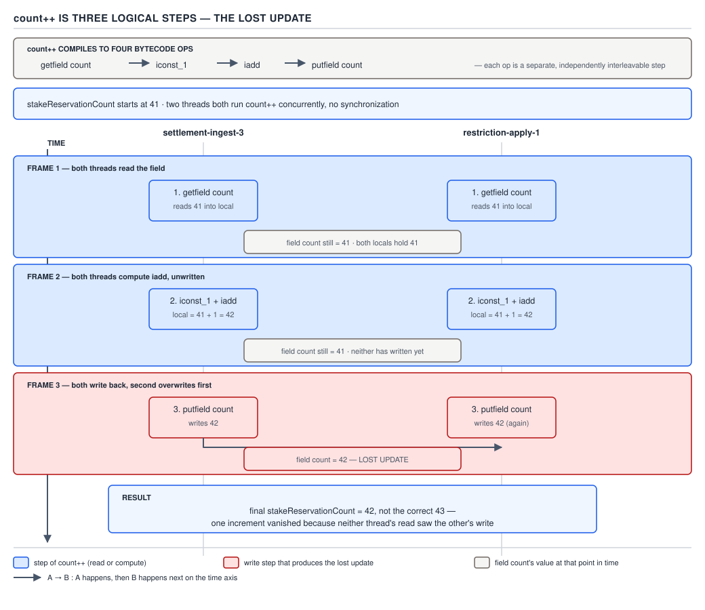
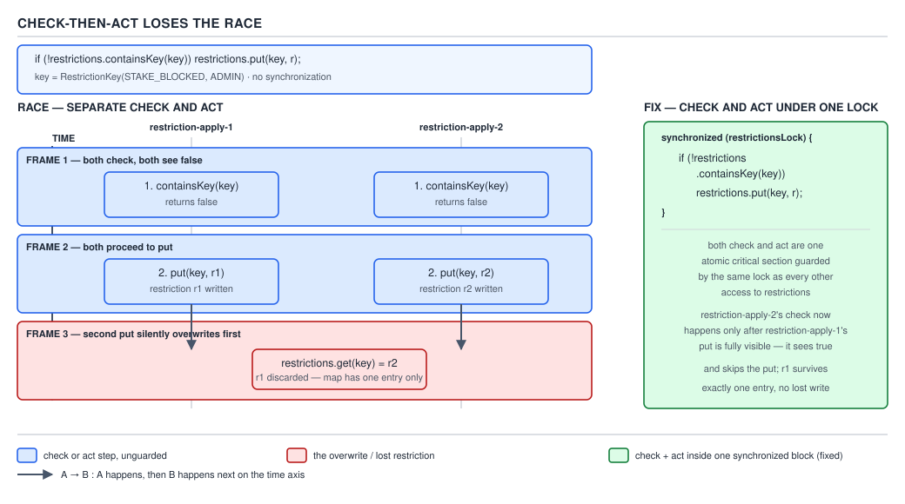
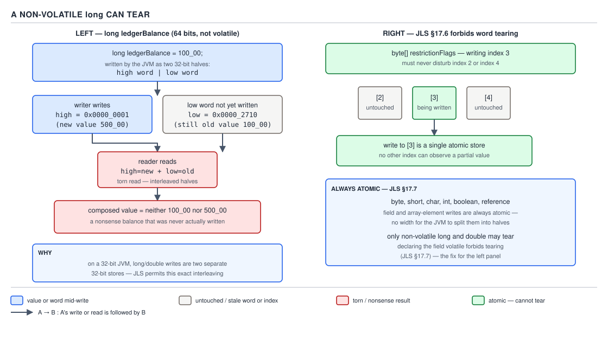
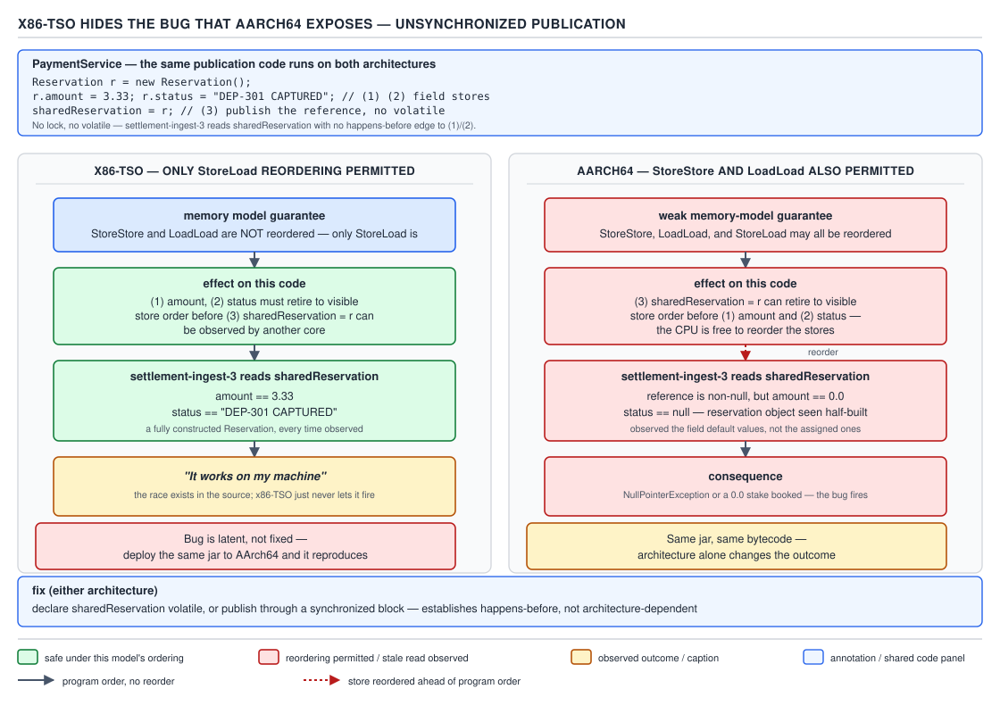

# 05 Multithreading and Concurrency — Thread safety — BASICS (§1.7)

**Target version: Java 21 LTS.** | **Part 1 of 5** | [Index](../00-index.md)
Previous: [Thread safety — the vocabulary](01-basics-vocabulary.md) · Next: [synchronized](../synchronized/01-basics.md)

## Race condition versus data race

Picture two clerks at the QuizStakes cashier window sharing one ledger sheet. A **race
condition** is what happens to the *business outcome* when their timing overlaps badly — a
customer gets paid twice, or a bet gets accepted after the account was frozen. A **data race** is
a narrower, lower-level fact about the *memory*: two threads touched the same variable, at least
one wrote it, and nothing ordered those touches relative to each other. The two ideas live at
different altitudes — outcome correctness versus the absence of an ordering guarantee in the Java
Memory Model (JMM) — and conflating them is the single most common vocabulary error in concurrency
interviews.

Before the JMM was formalized (JSR-133, Java 5), "thread safety" was discussed purely in terms of
outcomes — did the program compute the right answer. That cannot be checked by a tool, because
"right answer" requires a specification of intent. The JMM introduced **happens-before** as a
purely structural, checkable relation between two accesses. A **data race** is defined formally by
JLS §17.4.5: two accesses to the same variable, from different threads, at least one a write, with
**no happens-before edge** between them — mechanically checkable, no notion of "correct" required.
A **race condition** requires a human notion of correctness that no tool can infer.

**A program can have a data race with no race condition:** two threads incrementing independent
counters never read together, both unsynchronized — racing by the JMM definition, yet the business
never cares about their relative order. **A program can have a race condition with no data race:**
two threads each correctly acquire the *same* lock before touching shared state — every individual
access is properly happens-before ordered — but the *sequence across two separate locked sections*
is wrong: thread A checks a restriction is absent under lock L1, releases it, thread B checks and
inserts under L1, then A inserts under L1 again. Every access is race-free at the JMM level; the
compound *operation* still races. §1.7.7 below works this exact case.

`[SOURCE]` JLS §17.4.5: a program is *correctly synchronized* if every sequentially consistent
execution is free of data races, and the JMM's central guarantee — correctly-synchronized programs
behave as if sequentially consistent — only holds under that condition. Once a data race exists,
the JMM makes almost no promises: not just "stale" values, but values that never existed in program
order (a reordered store, a torn read). "It happened to print the right number" is not evidence of
safety — a racy program has no defined semantics to appeal to.

```java
// Data race, no race condition: two independent per-region counters, never compared.
final class RegionStakeCounters {
    private long euStakes;   // written only by the EU settlement thread
    private long usStakes;   // written only by the US settlement thread
    // A diagnostics thread reading euStakes without synchronization IS a data
    // race (JLS 17.4.5) but no requirement needs an exact value, so there is
    // no race condition.
}
```

**Pitfall:** treating "no race condition observed" as proof of "no data race". A data race can sit
dormant for months because reordering choices happened to align on the test machine, then reappear
when the JIT recompiles at a different tier or the code runs on AArch64 (§1.7.10). Absence of a
symptom is not absence of the race.

**Interview:** "Difference between a race condition and a data race?" — a data race is a JMM-level
fact (unordered conflicting accesses, JLS 17.4.5); a race condition is a correctness bug caused by
timing; a correctly-synchronized program can still have race conditions in compound operations.

> A **data race** is two conflicting accesses with no happens-before edge between them; a **race
> condition** is a correctness failure caused by the relative timing of operations. Neither
> implies the other.

## `count++` is three logical steps

`count++` reads like one atomic verb in Java syntax. It compiles to three separate operations that
the JVM is free to interleave with another thread's three operations at any point, because nothing
in the bytecode says "do not interrupt this."

A stake-reservation counter tracking concurrent open stakes is exactly the shape of shared mutable
state incremented from many request-handling threads at QuizStakes' peak of 1,200 reservations/sec.
Naively written as `private int reservedCount; void reserve() { reservedCount++; }`, it silently
drops updates under concurrent load — the classic **lost update** — whenever the field is read and
written by more than one thread with no ordering between the steps. The fix — a lock, `AtomicLong`,
or a concurrent collection's atomic method — is chosen in §2.5 of this topic; this file only proves
the bug exists.

`[PROVE]` Compile `reservedCount++` where `reservedCount` is an instance field and read the
bytecode:

```
getfield  #7   // Field reservedCount:I   -> push current value onto operand stack
iconst_1        // push constant 1
iadd            // pop both, push sum
putfield  #7   // Field reservedCount:I   -> pop sum, store back
```

Four bytecodes, but only **three logical steps**: **read**, **compute**, **write**. Nothing pins
these steps together as one unit — the scheduler is free to interleave them across threads, because
no synchronization action appears anywhere in the sequence.



**D-023** — `count++` is three logical steps.

Walk the lost-update interleaving as a table, starting from `reservedCount = 41`:

| Time | Thread A (reserve stake #42) | Thread B (reserve stake #43) | `reservedCount` |
|---|---|---|---|
| t0 | reads 41 | — | 41 |
| t1 | — | reads 41 | 41 |
| t2 | computes 41 + 1 = 42 | — | 41 |
| t3 | — | computes 41 + 1 = 42 | 41 |
| t4 | writes 42 | — | 42 |
| t5 | — | writes 42 | 42 |

Two reservations were made; `reservedCount` should read **43**. It reads **42** — Thread B's write
silently clobbered Thread A's. No exception, no log line, no stack trace: the ledger just quietly
under-counts open stakes.

```java
final class StakeReservationCounter {
    private int reservedCount; // BROKEN: no synchronization

    void reserve() {
        reservedCount++; // read-modify-write across three unguarded steps
    }

    int reservedCount() {
        return reservedCount;
    }
}
```

**Pitfall:** assuming `++` on a primitive field is atomic because it is one token in the source.
It is `getfield`/`iconst_1`/`iadd`/`putfield` — a read-modify-write with two independent points
where another thread's write can be lost. `volatile int reservedCount` does not fix this either:
`volatile` guarantees visibility of each individual read and write, not atomicity of the
three-step sequence — a volatile counter can still lose updates under concurrent `++`.

> A read-modify-write operation like `count++` is not one atomic action; it is a **read**, a
> **compute**, and a **write**, each independently interruptible by another thread.

## Check-then-act

"Check, then act on what you saw" is the shape of almost every compound bug in concurrent code:
`if (absent) put`, `if (file exists) open`, `if (balance sufficient) debit`. The check and the act
are two separate operations; between them is a window, however small, in which another thread can
invalidate what was just checked.

It generalizes the read-modify-write shape of `count++` into **query/decide/mutate** across a data
structure. `ConcurrentHashMap.putIfAbsent`, `AtomicReference.compareAndSet`, and `Files.notExists`
then `Files.createFile` all answer the same problem — check and act as one indivisible operation.
It bites any time the check and act are two separate calls with a gap between them, however small:
lazy initialization (`if (instance == null) instance = new ...()`), idempotent-insert logic, and
permission checks before a privileged action are the three most commonly tested shapes.

`[X-REF 13]` The security literature calls the identical bug **TOCTOU** — time-of-check to
time-of-use — most famously in filesystem race exploits where a program checks a file's
permissions, then a symlink is swapped in before it opens it. Guide 13 (security) develops that
variant; the mechanism is the same compound-action race covered here.

```java
// BROKEN: check-then-act with no shared lock. Two threads both call
// addIfAbsent(new RestrictionKey(STAKE_BLOCKED, ADMIN), adminBlock) at
// almost the same moment — an operator double-clicking a "block" button.
final class ClientRestrictions {
    private final Map<RestrictionKey, Restriction> restrictions = new HashMap<>();

    void addIfAbsent(RestrictionKey key, Restriction restriction) {
        if (!restrictions.containsKey(key)) {  // CHECK
            restrictions.put(key, restriction); // ACT
        }
    }
}
```



**D-024** — check-then-act loses the race: A checks `containsKey(RestrictionKey(STAKE_BLOCKED,
ADMIN))` → `false`; B checks the same key → `false` (A has not written yet); A puts
`restrictionA`; B puts `restrictionB`, silently overwriting it. Both checks observed "absent" and
both were correct *at the instant they ran* — the fact they checked became stale before the act
ran. `HashMap` gives no atomicity guarantee across two separate calls; the caller's assumption was
wrong, not the class's contract.

`[TRAP]` The fix is **not** two `synchronized` methods:

```java
// STILL BROKEN: each method is individually synchronized; the pair is not.
final class ClientRestrictions {
    private final Map<RestrictionKey, Restriction> restrictions = new HashMap<>();

    synchronized boolean isBlocked(RestrictionKey key) { return restrictions.containsKey(key); }
    synchronized void block(RestrictionKey key, Restriction restriction) { restrictions.put(key, restriction); }

    void addIfAbsent(RestrictionKey key, Restriction restriction) {
        if (!isBlocked(key)) block(key, restriction); // lock released, then re-acquired — gap here
    }
}
```

This is the compound-operation race condition with **no data race** promised earlier: every
individual access to `restrictions` is properly synchronized on the same monitor — no JLS-17.4.5
data race anywhere in this class. The race condition survives anyway, because the *atomicity
boundary* the caller needs spans both calls, and the lock is released and re-acquired in between.

The correct fix holds **one lock across both the check and the act** — or, idiomatically, pushes
the atomicity into the collection itself:

```java
// Fix 1: one lock spanning both the check and the act.
final class ClientRestrictions {
    private final Object lock = new Object();
    private final Map<RestrictionKey, Restriction> restrictions = new HashMap<>();

    void addIfAbsent(RestrictionKey key, Restriction restriction) {
        synchronized (lock) {
            if (!restrictions.containsKey(key)) restrictions.put(key, restriction); // CHECK+ACT
        }
    }
}

// Fix 2: a single atomic call, no explicit lock at all.
final class ClientRestrictionsAtomic {
    private final Map<RestrictionKey, Restriction> restrictions = new ConcurrentHashMap<>();

    void addIfAbsent(RestrictionKey key, Restriction restriction) {
        restrictions.putIfAbsent(key, restriction);
    }
}
```

**Insight:** the three compound-action shapes that recur everywhere are put-if-absent (this
example), read-modify-write (`count++`), and compare-and-swap. Every lock-free algorithm and every
`java.util.concurrent.atomic` class makes exactly one of these atomic without a blocking lock —
which fix to reach for is decided in §2.5.

**Interview:** "Why doesn't making both methods `synchronized` fix check-then-act?" — synchronizing
each method individually only makes each *access* atomic, not the *sequence*; the check and the act
must share one critical section.

> **Check-then-act** is a compound operation — a check and a dependent act — that must be executed
> as a single atomic unit under the same lock (or a single atomic API call); synchronizing the
> check and the act separately does not compose into atomicity.

## 64-bit tearing and word tearing

A `long` or `double` is 64 bits wide. On a 32-bit-word architecture, the JVM specification permits
writing it as **two separate 32-bit stores**. If a reader is unlucky enough to observe the memory
between those two stores, it assembles a value that was never written by anyone — half of one
update glued to half of another.

`[SOURCE]` `[NUM]` JLS §17.7, "Non-Atomic Treatment of `double` and `long`": writes to
non-`volatile` `long`/`double` fields "may be treated ... as two separate writes ... on some
implementations" — a deliberate concession to hardware that predates true 64-bit atomic stores.
`[TRAP]` `volatile` removes the exception entirely, by explicit carve-out in the same section. It
bites any non-volatile `long`/`double` read and written by more than one thread. A ledger balance
is the textbook case:

```java
// BROKEN: non-volatile long balance, read/written by multiple threads
final class WalletBalanceView {
    private long cashAvailableMinorUnits; // e.g. cents, non-volatile
}
```



**D-025** — a non-volatile `long` can tear.

Suppose `cashAvailableMinorUnits` holds `0x00000000_00002A00` (10,752 minor units) and a
settlement thread updates it to `0x00000001_00000000` (an extreme value chosen only to make the
halves visually distinct). If the JVM implements this as two 32-bit stores — high word then low
word, or vice versa — a reader scheduled between the two stores can observe old-high + new-low =
`0x00000000_00000000` (zero — funds vanish) or new-high + old-low = `0x00000001_00002A00` (funds
appear from nowhere). `[NUM]` Neither torn value is the old balance nor the new balance — it is a
third, nonsensical number, the defining signature of tearing, distinguishable from ordinary
staleness because a stale read would at least be *some* value someone actually wrote.

**Pitfall:** believing this requires a genuinely 32-bit JVM. Modern 64-bit HotSpot implementations
happen to perform atomic 64-bit stores in practice, but the JLS does not guarantee this for
non-volatile fields — relying on "my JVM doesn't do this" relies on an implementation detail with
no contract behind it. The portable fix is `volatile long` (or `AtomicLong`, which also gives
read-modify-write atomicity that plain `volatile` lacks).

### Word tearing is forbidden

`[SOURCE]` JLS §17.6, "Word Tearing," draws the opposite line for anything *narrower* than a
machine word: "some processors do not provide the ability to write to a single byte... it would
be illegal to implement `byte` array updates \[by\] writing a new value... into that word" if doing
so could disturb neighboring bytes. Writing `bytes[3]` in a `byte[]` **must never** touch
`bytes[2]` or `bytes[4]`, even on hardware whose native store granularity is wider than one byte —
the JVM must guarantee or emulate per-element atomicity.

This is the mirror image of §1.7.8: the JMM **permits** tearing a 64-bit primitive into two
word-sized writes, but **forbids** tearing a write finer than the target element. References
(object and array) are **always atomic** regardless of platform word size — a torn reference could
point into the middle of an object and violate memory safety, not just correctness. The D-025
diagram embedded above carries this contrast too.

**Interview:** "Can a `long` field tear?" — yes, if non-volatile, per JLS 17.7, as two 32-bit
writes; mark it `volatile` and the JLS guarantees atomicity. "Can a `byte[]` element tear?" — no,
never, per JLS 17.6; the JVM must guarantee per-element atomicity even on hardware without
byte-level stores.

> A non-volatile 64-bit primitive **may** be split into two word-sized writes and observed torn
> (JLS 17.7); a narrower element like a `byte[]` slot **must never** be torn by a write to a
> different element, and object references are always atomic regardless of platform (JLS 17.6).

## x86-TSO versus AArch64: why "works on my machine" lies

Every hardware memory model sits on a spectrum from "strict" (loads and stores appear in program
order to every observer) to "relaxed" (the processor may reorder operations for performance, as
long as a single thread cannot detect its own reordering). x86 sits near the strict end; AArch64
sits much further toward relaxed. Code relying on x86's extra strictness passes every test on a
developer's laptop and fails intermittently on an AArch64 server (AWS Graviton) or Apple silicon.

`[PROVE]` `[RESEARCH]` x86 implements a model informally called **TSO** (total store order): it
permits only **StoreLoad** reordering — a store followed by a later load to a different address may
be observed out of order — and forbids StoreStore, LoadLoad, and LoadStore reordering in hardware.
AArch64 is a weakly-ordered model that additionally permits **StoreStore** and **LoadLoad**
reordering absent an explicit barrier. A publication idiom relying on "the object reference becomes
visible only after its fields are fully initialized" is exactly a StoreStore ordering requirement —
x86-TSO provides it for free; AArch64 does not.

```java
// BROKEN: unsafe publication, no happens-before edge for the reader
final class BonusPublisher {
    static BonusView bonusView; // no volatile, plain field

    static void publish(int percent, int capMinorUnits) {
        bonusView = new BonusView(percent, capMinorUnits); // two field stores, then the reference store
    }
}

record BonusView(int percent, int capMinorUnits) {}
```

A settlement thread calls `publish(10, 10_000)` (10%, capped at 100 major units) while a reader
polls `bonusView` without synchronization:



**D-026** — x86-TSO hides the bug that AArch64 exposes.

- On **x86-TSO**: hardware forbids StoreStore reordering, so the reader either sees `bonusView ==
  null` or a fully-initialized `BonusView` — the bug is effectively invisible in practice (still a
  data race by the JMM; reordering just rarely surfaces).
- On **AArch64**: StoreStore reordering is permitted. The reader can observe the new, non-null
  `bonusView` reference **before** the constructor's writes to `percent`/`capMinorUnits` land —
  reading through a valid reference while its fields still hold Java's default values, `0`/`0`.

`[VERSION-TRAP]` This is a hardware memory-model fact, not a JDK-version fact, and does not change
across Java 21–25. JIT/GC internals change release to release and may incidentally add or remove
barriers, but that is never a substitute for an explicit happens-before edge.

`[TRAP]` The fix is the same one that always fixes unsafe publication — a real happens-before edge:

```java
final class BonusPublisher {
    static volatile BonusView bonusView; // volatile write is a release; volatile read is an acquire

    static void publish(int percent, int capMinorUnits) {
        bonusView = new BonusView(percent, capMinorUnits);
    }
}
```

With `bonusView` volatile, the write happens-before every subsequent volatile read, which
happens-before every access through that reference — the reader always sees `null` or a
fully-constructed `BonusView`, on every architecture, unconditionally.

**Pitfall:** "it works on my machine" as evidence of correctness for unsynchronized publication —
the developer's machine is very likely x86-TSO; the fleet increasingly is not (AWS Graviton,
Apple-silicon CI). A data race that x86-TSO happens to mask is still a data race.

**Interview:** "Why might a race bug appear only on ARM servers, never locally on x86?" — x86-TSO
permits only StoreLoad reordering, hiding most unsafe publication bugs; AArch64 also permits
StoreStore/LoadLoad, exposing them. The fix is always an explicit happens-before edge.

> **x86-TSO** forbids StoreStore, LoadLoad, and LoadStore reordering and permits only StoreLoad;
> **AArch64** additionally permits StoreStore and LoadLoad. Code correct only because of x86's
> extra guarantees is not JMM-correct, and will fail on weaker-ordered hardware.

## Non-atomic composite state

A hand-rolled collection often keeps an invariant across *two or more fields* — a `size` counter
and a backing `elements` array must always agree, or an iterator built from mismatched snapshots
of the two sees a length mismatch. This is check-then-act's sibling problem: not one field torn,
but an invariant *between* fields broken, even if each field is individually volatile.

Making every field `volatile` does **not** fix a cross-field invariant — `volatile` guarantees
each field's own visibility, not that two fields are read or written as one atomic unit.

```java
// BROKEN even with both fields volatile: size and elements can be observed
// in a mutually inconsistent state, because they are still two separate
// synchronization actions.
final class ReservationBatch {
    private volatile int size;
    private volatile Reservation[] elements;
}
```

> A **cross-field invariant** — a relationship that must hold between two or more fields at every
> observable instant — requires one lock (or one atomic snapshot object) covering all the
> participating fields; per-field `volatile` only protects each field in isolation.

## The infinite-loop race: concurrent `HashMap` resize

`[X-REF 02]` `[TRAP]` `[RESEARCH]` In Java 7's `HashMap`, a concurrent resize (two threads inserting
past the load factor at once) could interleave the bucket-list transfer into a **cycle** in a
bucket's linked list. A subsequent `get` on that bucket then looped forever chasing `next` pointers
back on themselves, pegging a CPU core at 100% with no exception, no deadlock detector hit, and no
stack trace pointing at the bug. Java 8's redesign (bin-based transfer, red-black tree conversion
for long chains) removed the specific cycle-forming interleaving, but did **not** make `HashMap`
safe for concurrent use: entries can still be silently lost and `size()` can still be observed
inconsistent under concurrent mutation. Guide 02 works the transfer algorithm and treeification
threshold in full; the fact that matters here is narrower — **any unsynchronized `HashMap` under
concurrent mutation is a correctness bug, regardless of which Java version removed the worst
failure mode.**

**Pitfall:** "we're on Java 8+, so concurrent `HashMap` access is fine now." Java 8 removed the
*infinite loop*, not the *unsafety*. The fix, in every version, is `ConcurrentHashMap` (or a lock
around the plain `HashMap`), never "a newer JDK happened to make the worst symptom disappear."

## Pitfalls

### Assuming a data race and a race condition are the same bug

**Wrong**
```java
// "I locked every field access, so there's no data race — my code must be safe."
synchronized boolean isBlocked(RestrictionKey key) { return restrictions.containsKey(key); }
synchronized void block(RestrictionKey key, Restriction r) { restrictions.put(key, r); }
// addIfAbsent() calling both — see the full example above — still double-inserts.
```

**Right**
```java
synchronized (lock) {
    if (!restrictions.containsKey(key)) restrictions.put(key, restriction);
}
```

**Why people believe it:** "no data race" sounds like the JMM's strongest safety statement, so it
is easy to assume it subsumes correctness. It only rules out unordered conflicting memory accesses,
not a stale window across a correctly-ordered *sequence*.

### Assuming a non-volatile `long` is safe on today's 64-bit hardware

**Wrong**
```java
private long cashAvailableMinorUnits; // "modern JVMs do atomic 64-bit stores, so this is fine"
```

**Right**
```java
private volatile long cashAvailableMinorUnits; // JLS 17.7 guarantees atomicity only when volatile
```

**Why people believe it:** production HotSpot builds on 64-bit hardware do perform atomic 64-bit
stores in practice, so the bug never reproduces locally. The JLS grants permission to tear; it does
not require a JVM to avoid it.

## Cheat sheet

| Concept | One-line fact |
|---|---|
| Data race | Conflicting access, no happens-before edge (JLS 17.4.5) — JMM-level, tool-checkable |
| Race condition | Correctness bug from operation timing — spec-level, human judgment |
| `count++` | 4 bytecodes (`getfield`/`iconst_1`/`iadd`/`putfield`), 3 logical steps: read, compute, write |
| Check-then-act | Query + dependent mutate; needs one lock across both, not two separately-locked calls |
| Three compound shapes | Put-if-absent, read-modify-write, compare-and-swap |
| TOCTOU | Security literature's name for the same check-then-act bug |
| Long/double tearing | JLS 17.7 — non-volatile 64-bit write may split into two 32-bit writes; `volatile` fixes it |
| Word tearing | JLS 17.6 — forbidden; writing one array element must never corrupt a neighbor |
| References | Always atomic, regardless of platform word size |
| x86-TSO | Forbids StoreStore/LoadLoad/LoadStore reordering; permits only StoreLoad |
| AArch64 | Additionally permits StoreStore and LoadLoad reordering — exposes unsafe publication |
| Cross-field invariant | Per-field `volatile` does not protect a relationship between two fields |
| `HashMap` concurrent resize | Java 7: could infinite-loop (cycle); Java 8: no cycle, still unsafe (lost entries, bad size) |

## Self-test

**Q1.** Give an example of a data race with no race condition, and a race condition with no data
race.

<details><summary>Answer</summary>

Data race, no race condition: independent per-region counters (`euStakes`, `usStakes`), each
written by one thread and occasionally read by a diagnostics thread with no synchronization — a
data race by JLS 17.4.5, but no requirement depends on exact timing. Race condition, no data race:
`isBlocked`/`block` each individually `synchronized` on the same lock (every access properly
ordered — no data race), but `addIfAbsent` calls them as two separate critical sections, leaving a
window where two threads both see "absent" and both insert.

</details>

**Q2.** Why is `count++` not atomic even though it is one line of source code?

<details><summary>Answer</summary>

It compiles to `getfield`/`iconst_1`/`iadd`/`putfield` — three logical steps (read, compute,
write). Nothing in the bytecode groups them into one indivisible unit, so another thread's own
read/compute/write can interleave between any of these steps and cause a lost update.

</details>

**Q3.** Why doesn't making `isBlocked` and `block` each individually `synchronized` fix the
check-then-act race in `addIfAbsent`?

<details><summary>Answer</summary>

Each method acquires and releases the lock on its own call, so the lock is released between the
check and the act. Two threads can both call `isBlocked` (each sees "absent"), then both call
`block` (the second silently overwrites the first). Synchronizing individual accesses does not
compose into atomicity across a sequence of accesses; the check and the act must share one
critical section on the same lock.

</details>

**Q4.** What does JLS 17.7 permit for a non-volatile `long` field, and what removes that
permission?

<details><summary>Answer</summary>

It permits the JVM to implement a write to a non-volatile `long`/`double` as two separate 32-bit
writes, so a reader can observe a torn value from two different writes. `volatile` removes the
permission — volatile 64-bit writes and reads are guaranteed atomic.

</details>

**Q5.** How does JLS 17.6 (word tearing) differ from JLS 17.7 (long/double tearing)?

<details><summary>Answer</summary>

17.7 *permits* tearing a 64-bit primitive into two word-sized writes unless `volatile`. 17.6
*forbids* any tearing narrower than the target element — writing one `byte[]` slot must never
corrupt a neighbor. References are always atomic.

</details>

**Q6.** Why can an unsafe-publication bug pass every test on an x86 laptop and fail on an AWS
Graviton (AArch64) server?

<details><summary>Answer</summary>

x86-TSO forbids hardware reordering of StoreStore/LoadLoad/LoadStore, permitting only StoreLoad —
so an unsynchronized reference publication still usually appears fully-initialized. AArch64
additionally permits StoreStore/LoadLoad reordering, so the reader can observe the reference
before the constructor's writes land, seeing default field values through a non-null reference.
The code was always a data race; the hardware model just determines how visible the symptom is.

</details>

**Q7.** Why doesn't making every field of a hand-rolled collection `volatile` make the collection
thread-safe?

<details><summary>Answer</summary>

`volatile` guarantees visibility for each field independently, not atomicity of a relationship
*between* fields. If `size` and `elements` must agree, a reader can observe `size` from after one
update and `elements` from before it, because they are two separate synchronization actions. A
cross-field invariant needs one lock (or one atomic snapshot) covering every participating field.

</details>

**Q8.** What did Java 8 actually fix about concurrent `HashMap` mutation, and what did it not fix?

<details><summary>Answer</summary>

It removed the Java 7 failure mode where a concurrent resize could create a cycle in a bucket's
linked list, spinning `get` forever at 100% CPU. It did not make `HashMap` safe for concurrent use
generally — entries can still be lost and `size()` can still be inconsistent. The fix in any
version is `ConcurrentHashMap` or external locking, not "a newer JDK."

</details>

**Q9.** Name the three compound-action shapes that recur across concurrent code, and one JDK
mechanism that makes each atomic.

<details><summary>Answer</summary>

Put-if-absent → `ConcurrentHashMap.putIfAbsent`. Read-modify-write → `AtomicLong.incrementAndGet`.
Compare-and-swap → `AtomicReference.compareAndSet`.

</details>

**Q10.** A stake-reservation counter goes from 41 to 42 instead of 43 after two concurrent
reservations. Walk the exact interleaving that produces this.

<details><summary>Answer</summary>

A reads 41, B reads 41 before A writes. A computes 42, B computes 42. A writes 42, B writes 42
(overwriting A's write with the same value). Two increments happened; the counter advanced by one
— the lost-update pattern from `count++`'s three unguarded steps with no atomicity across them.

</details>

---

**Leaves covered:** 1.7.1–1.7.12 (12 leaves)
**Leaves deferred:** none
**Diagrams included:** D-023, D-024, D-025, D-026
**Target version:** Java 21 LTS
**Lines:** 599
