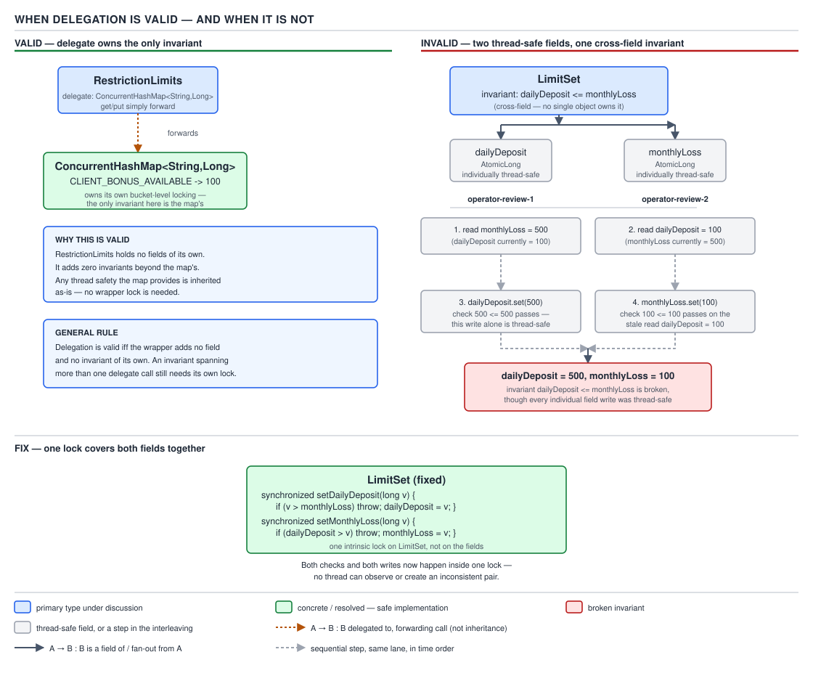

# 05 Multithreading and Concurrency — Thread-safe class design — INTERMEDIATE (§2.10)

**Target version: Java 21 LTS.** | **Part 2 of 5** | [Index](../00-index.md)
Previous: [Virtual threads in production](../virtual-threads/02-in-production.md) · Next: [ThreadLocal and context propagation](../thread-local/02-context-propagation.md)

Thread safety is not a property you bolt onto a finished class. It is a design decision made before the first field is written, and everything in this file is a consequence of that one sentence. The running example is `FundsLedger`'s neighbourhood: wallets, limits, and the small value types that guard them.

### The design sequence

**Mental model.** Building a thread-safe class is not "write the class, then add `synchronized`". It is a fixed sequence; skipping a step is how classes end up "mostly" thread-safe — safe for the operations someone tested, broken for the compound ones nobody did.

**Why it exists.** Retrofitting synchronization onto a class whose invariants were never written down is guesswork — you cannot know which fields must be guarded together without first enumerating what must stay true.

**When to reach for it.** Every mutable class shared across threads goes through this once, at design time. A genuinely immutable class (§2.10.11) skips straight to "document it" — there is no locking policy to choose.

**How it works — the five steps, in order.** (1) **State the invariants** — for `LimitSet(dailyDeposit, maxStake, monthlyLoss)` that includes `dailyDeposit <= monthlyLoss`. (2) **Choose the confinement or locking policy** — confine to one thread (§2.4), make it immutable (§2.10.11), or pick the lock(s) covering every invariant from step 1 *jointly*. (3) **Document it** (§2.10.8). (4) **Enforce it with `@GuardedBy`** — not a runtime check, but a contract static analysis and review can hold you to. (5) **Test it** — a stress test that hammers the compound operations from many threads and asserts the invariant, not just individual field values.

**Example.** A `LimitSet` guarded correctly commits to a single lock for both fields:

```java
public final class LimitSet {
    private final Object lock = new Object();
    private BigDecimal dailyDeposit;
    private BigDecimal monthlyLoss;

    public LimitSet(BigDecimal dailyDeposit, BigDecimal monthlyLoss) {
        if (dailyDeposit.compareTo(monthlyLoss) > 0) {
            throw new IllegalArgumentException("dailyDeposit must not exceed monthlyLoss");
        }
        this.dailyDeposit = dailyDeposit;
        this.monthlyLoss = monthlyLoss;
    }

    public void raiseDailyDeposit(BigDecimal proposed) {
        synchronized (lock) {
            if (proposed.compareTo(monthlyLoss) > 0) {
                throw new IllegalArgumentException("would exceed monthlyLoss");
            }
            dailyDeposit = proposed;
        }
    }

    public void lowerMonthlyLoss(BigDecimal proposed) {
        synchronized (lock) {
            if (dailyDeposit.compareTo(proposed) > 0) {
                throw new IllegalArgumentException("would leave dailyDeposit above monthlyLoss");
            }
            monthlyLoss = proposed;
        }
    }
}
```

Both mutators take the *same* lock and re-check the *other* field inside it — the fix the next section shows you cannot get by delegation.

**The gotcha.** Steps 1 and 5 are the ones people skip under deadline pressure, and they are exactly the two that no compiler or linter can force. `@GuardedBy` only checks that you declared a lock, never that the invariant it guards was ever written down.

> **Definition.** Thread-safe class design is the disciplined sequence of stating
> invariants, choosing a confinement or locking policy that covers all of them jointly,
> documenting and enforcing that policy, and testing the compound operations — not a
> property that emerges from sprinkling `synchronized` after the fact.

---

### When delegation is valid and when it is not

**Mental model.** Delegation is renting someone else's thread safety instead of building your own. A class that forwards every mutating call to a `ConcurrentHashMap` and adds nothing of its own is exactly as thread-safe as the map.

**Why it exists.** Re-implementing locking for a class that is really a thin wrapper around an already-safe collection is wasted effort and a second place for the locking bug to live.

**When to reach for it, and when not.** Reach for it when the class's public contract is *exactly* the delegate's, restated. Stop the moment the class adds one field, one derived value, or one cross-field rule the delegate cannot see — delegation cannot protect an invariant the delegate does not know exists.

**How it works — the exact condition, proved.** [PROVE] Delegation is safe **if and only if the delegate's invariants are the class's only invariants.** Proof by contradiction on the "only if" direction: suppose the class has an invariant `I` spanning two pieces of state, maintained purely by delegating each piece independently to a thread-safe holder. Each mutation preserves the *delegate's own* internal consistency, because the delegate enforces that atomically per call. But `I` is a relationship *between* two delegates, and nothing atomically checks `I` across two separate calls — so a thread reading between them, or a second thread writing the other delegate concurrently, can observe both delegates individually consistent while `I` is violated. Delegation gives atomicity per delegate call, never across delegate calls.

**The invalid case, worked. `[TRAP]`** Take `LimitSet(dailyDeposit, maxStake, monthlyLoss)` built from two individually thread-safe fields instead of one lock:

```java
// BROKEN — delegates to two thread-safe fields, invents no lock of its own
public final class LimitSetBroken {
    private final AtomicReference<BigDecimal> dailyDeposit = new AtomicReference<>();
    private final AtomicReference<BigDecimal> monthlyLoss = new AtomicReference<>();

    public void raiseDailyDeposit(BigDecimal proposed) {
        if (proposed.compareTo(monthlyLoss.get()) > 0) {
            throw new IllegalArgumentException("would exceed monthlyLoss");
        }
        dailyDeposit.set(proposed); // (A)
    }

    public void lowerMonthlyLoss(BigDecimal proposed) {
        if (dailyDeposit.get().compareTo(proposed) > 0) {
            throw new IllegalArgumentException("would leave dailyDeposit above monthlyLoss");
        }
        monthlyLoss.set(proposed); // (B)
    }
}
```

Each method's read-check-write against its *own* `AtomicReference` is internally atomic — that part of the delegate's contract holds. The interleaving needs no atomicity failure inside either field, only interleaving between them. Start at `dailyDeposit=50`, `monthlyLoss=200`. T1 calls `raiseDailyDeposit(180)`, reads `monthlyLoss.get() == 200`, passes. T2 concurrently calls `lowerMonthlyLoss(100)`, reads `dailyDeposit.get() == 50` (T1 hasn't written yet), passes. T1 executes (A): `dailyDeposit = 180`. T2 executes (B): `monthlyLoss = 100`. Both operations succeeded, both delegates stayed internally consistent, and the object now holds `dailyDeposit = 180 > monthlyLoss = 100` — broken with no exception and no corrupted field.



**D-135** — When delegation is valid and when it is not: a class whose only invariant is a `ConcurrentHashMap`'s own consistency delegates safely; `LimitSet`'s cross-field constraint cannot be preserved by delegating to two independently thread-safe fields, and the single-lock fix from the previous section is the only correct answer.

**Pitfall:** believing "every field is thread-safe" implies "the object is thread-safe". It implies only that each field's *own* operations are atomic — nothing about the relationship between fields survives that. The fix is never "make the fields more thread-safe"; it is to remove the field-level delegation and guard the invariant with one lock that both mutators share, as §2.10.1's example does.

**Interview:** "Is a class with only `AtomicLong`/`ConcurrentHashMap` fields automatically thread-safe?" — only if it has no invariant that spans more than one of them; the moment two fields must agree, delegation stops being sufficient and a shared lock is required.

> **Definition.** Delegation is valid exactly when the delegate's own invariants are the
> only invariants the class has; the instant a class adds a relationship between two
> otherwise-safe pieces of state, delegation can no longer protect it.

---

### The private-lock argument

**Mental model.** A lock object is a piece of your policy, not a public API. The Java monitor pattern (`synchronized` on `this`) exposes that lock to every caller, whether or not they should touch it.

**Why it exists.** `synchronized(this)` and `public synchronized void m()` both make the object's own monitor acquirable from outside. Any caller holding a reference can write `synchronized (theObject) { … }` around arbitrary code — including code that blocks forever — and now holds your lock for as long as that block runs.

**When to reach for it, and when not.** Use a private lock for any class whose synchronization is an implementation detail it controls unilaterally — nearly always. Accept `synchronized` on `this` only for a class explicitly designed to be lockable by its clients, documented as such — a rare, deliberate choice, never a default.

**How it works.** `private final Object lock` (or a `ReentrantLock` field) is reachable only through the class's own methods — no reference to it ever escapes. Every method touching guarded state acquires this private object, and the class alone decides acquisition order and hold time.

**The argument, stated plainly.** A public lock object means any caller can participate in — or corrupt — your locking policy. A caller that holds the object's monitor and then blocks (a stuck network call, a `wait()` with no matching `notify()`) has produced a liveness bug that lives in *their* code but manifests as your class hanging — indistinguishable from "my invariant is broken" in a thread dump.

**Example.**

```java
public final class StakeReservationCounter {
    private final Object lock = new Object();
    private long reservedThisSecond;

    public void recordReservation() {
        synchronized (lock) { reservedThisSecond++; }
    }

    public long snapshotAndReset() {
        synchronized (lock) {
            long value = reservedThisSecond;
            reservedThisSecond = 0;
            return value;
        }
    }
}
```

No caller of `StakeReservationCounter` can write `synchronized (counter) { … }`, because `lock` never leaves the class.

**The gotcha.** A private lock does not, by itself, prevent *your own* code from holding it too long — it only removes the caller as a source of that bug. You still have to keep the critical sections in `recordReservation` and `snapshotAndReset` short.

**Interview:** "Why not just `synchronized` the method?" — because that synchronizes on `this`, and `this` is exactly the reference every external caller already holds; a private lock field removes that reference from their reach entirely.

> **Definition.** The private-lock argument is that a lock only your class can name is a
> lock only your class can misuse — a public lock object (including the intrinsic monitor
> exposed by `synchronized` on `this`) hands callers the power to break or block your
> locking policy from outside it.

---

### Extending a thread-safe class

Three techniques exist for adding behaviour to an already thread-safe class, and each trades away something. **Subclassing** inherits the parent's lock but is fragile the moment the parent changes its locking policy in a later release — you are locking on an implementation detail you do not own. **Client-side locking** locks on the *object the delegate itself locks on* from outside the class, covered next; it works only if that object is documented and stable. **Composition** (§2.10.7) wraps the delegate behind a new object with its own lock and forwards every call — the most robust of the three, at the cost of an extra layer of locking on every operation.

> **Definition.** Extending a thread-safe class is a choice among subclassing, client-side
> locking, and composition, ordered from most fragile to most robust and, not
> coincidentally, from cheapest to most expensive.

---

### Client-side locking's failure mode

**Mental model.** Client-side locking asks a caller, from *outside* a class, to acquire the exact same lock object the class's own methods use internally — so a compound operation (check-then-act) the class does not itself offer can still be made atomic.

**Why it exists.** `Collections.synchronizedList(list)` gives a list whose *individual* methods are each atomic, but "if empty, add" needs the check and the act to be atomic as a unit — something no single method call provides. Client-side locking adds that atomicity without touching the collection's source.

**When to reach for it, and when not.** Reach for it only when the delegate documents, explicitly, which object its own methods synchronize on. Never reach for it against a type whose synchronization object is unspecified — that is locking on a guess.

**How it works, and the failure mode. `[TRAP]` `[SOURCE]`** The instinctive mistake is locking on the *raw backing collection* instead of the wrapper, believing either reference guards the same state. The JDK source shows exactly what the wrapper locks on. From `java.util.Collections.SynchronizedCollection`:

```java
final Object mutex;

SynchronizedCollection(Collection<E> c) {
    this.c = Objects.requireNonNull(c);
    mutex = this;
}
```

`mutex = this` — the wrapper synchronizes on **itself**, not on the collection it wraps. `Collections.synchronizedList` returns a `SynchronizedList extends SynchronizedCollection` reusing that same `mutex`. Client-side locking is correct only when the caller locks on the *same object reference the wrapper's own methods lock on* — the wrapper reference obtained directly from the factory call, never the underlying raw list, and never a second wrapper mistakenly created around the same backing list.

The corrected version — locking on the wrapper reference itself around the compound check-then-add — is shown in full under `## Pitfalls` at the foot of this file.

**The gotcha, restated as the failure mode.** The moment two different references — the wrapper and a raw `ArrayList` someone still holds from before wrapping, or two separate calls to `Collections.synchronizedList` around the same backing list — are locked on by different callers, both believe they hold "the" lock while holding two different monitors. Every compound operation from that point runs unguarded, silently, with no exception.

**Pitfall:** assuming any object reference that *points at* a synchronized collection is a valid lock for it. The only valid lock is the specific object the delegate's own methods synchronize on — read the source or the javadoc, do not guess. `Collections.synchronizedMap` follows the identical pattern.

**Interview:** "How do you make a compound operation atomic on a `Collections.synchronizedList`?" — synchronize the compound block on the same wrapper reference the list's own methods use, never on a second reference or the raw backing collection.

> **Definition.** Client-side locking's failure mode is locking on any object other than the
> exact one the delegate's own methods synchronize on — most commonly the raw backing
> collection instead of the wrapper — which produces two independent monitors guarding one
> piece of state and no atomicity at all.

---

### Composition as the robust answer

Wrapping a delegate behind a brand-new object with its own private lock (a `ForwardingCollection`-style wrapper) fixes client-side locking's whole failure mode: there is no longer a "which reference does the delegate lock on" question, because the wrapper never exposes the delegate's own monitor at all — it takes its own lock, then delegates the call. The cost is an extra `synchronized` block on every single operation, layered on top of whatever locking the delegate does internally, which roughly doubles the locking overhead of every call for the sake of removing an entire class of caller mistakes.

> **Definition.** Composition trades one extra layer of locking, on every call, for
> immunity to the "locked on the wrong object" failure that makes client-side locking
> fragile.

---

### Documenting the policy

The class javadoc must state three things or the policy does not exist for the next reader: which fields or invariants are thread-safe, which specific lock object protects them, and what the caller must do for any compound action the class itself does not expose atomically (exactly the case client-side locking exists for). A class with a correct implementation and no javadoc statement of its policy is thread-safe today and a guess for whoever edits it next.

> **Definition.** The thread-safety policy is documented, not implied — the lock object
> named, the guarded state named, and the caller's obligation for compound operations
> spelled out.

---

### Designing for cancellation

Every method that can run for an unbounded time should either respond to interruption (checking `Thread.interrupted()` or calling an interruptible blocking method) or take an explicit deadline (a `Duration timeout` parameter). A method with neither leaves its caller with no way to give up on it — not even from another thread — which turns a slow dependency (the identity vendor's documented p99 of 38 seconds) into an unbounded hang for whatever called it.

> **Definition.** A long-running method is designed for cancellation when it is either
> interruptible or deadline-bound — never both absent.

---

### Designing for shutdown

Any component that owns a thread — a background reconciliation loop over `FundsLedger` entries, say — must own that thread's full lifecycle and expose a `close()` (or implement `AutoCloseable`) that stops it deterministically. If the component was handed an `ExecutorService` from outside rather than creating its own, ownership of that executor's shutdown must be stated explicitly in the constructor's contract — a component that shuts down an executor it does not own breaks every other user of that executor.

> **Definition.** Thread lifecycle ownership is explicit: whoever creates a thread or
> executor is responsible for its shutdown, stated in the contract, never assumed.

---

### The "thread-safe by construction" checklist `[X-REF 03]`

A value type earns thread safety from its shape rather than from locking: **final class** (no subclass can add mutable state or override a method to break an invariant), **final fields** (every field set once, in the constructor, giving safe publication for free once construction completes), **no escaping references** (the constructor never hands `this` or a mutable field to another object before it is fully built), and **defensive copies in** (any mutable argument, such as a `List` or `Date`, is copied on the way in rather than stored by reference). `Money(BigDecimal amount, Currency currency)` satisfies all four automatically because `BigDecimal` and `Currency` are themselves immutable. The full mechanics of safe publication and the final-field guarantee are covered in guide 03.

> **Definition.** A value type is thread-safe by construction when it is final, its fields
> are final, no reference to it or its mutable internals escapes before construction
> completes, and every mutable input is defensively copied on the way in.

---

### Defensive copying on the way out

The same argument that protects a constructor's inputs applies symmetrically to a getter's output: returning a mutable field by reference lets any caller mutate state the class believed was private, from any thread, with no synchronization at all. `List.copyOf(list)` is the modern shortcut for the common case — it returns an unmodifiable, independent snapshot in one call, replacing the older `Collections.unmodifiableList(new ArrayList<>(list))` idiom.

```java
public List<WithdrawalTransaction> pendingSnapshot() {
    synchronized (lock) {
        return List.copyOf(pendingWithdrawals); // independent, unmodifiable snapshot
    }
}
```

> **Definition.** Defensive copying is symmetric — copy mutable state on the way in so
> callers cannot mutate what you store, and copy it on the way out so callers cannot mutate
> what you hold.

---

### Builders and thread safety

A builder is thread-*hostile* by deliberate design: it accumulates mutable state across multiple calls (`.dailyDeposit(x).maxStake(y).monthlyLoss(z)`) with no synchronization at all, because a builder is meant to be confined to the one thread constructing it. The object it finally produces — `new LimitSet(builder.dailyDeposit, builder.maxStake, builder.monthlyLoss)` — is the immutable, thread-safe result; the builder itself never needs to be either, and adding locking to it would only slow down code that was never going to share it.

> **Definition.** A builder is intentionally unsynchronized and single-threaded; thread
> safety is a property of the object it finally builds, not of the builder itself.

---

### The racy-single-check idiom

**Mental model.** The racy single-check idiom computes an expensive, immutable, idempotent value lazily, writes it into a plain (non-volatile) field, and accepts that more than one thread might compute it redundantly — because every thread that does will compute the *same* value, so redundant computation costs cycles, never correctness.

**Why it exists.** Double-checked locking with a `volatile` field is always correct but still pays a volatile read on every subsequent access. `String.hashCode()`'s cached hash is computed billions of times across a JVM's life; shaving that read matters enough that the JDK accepts a plain field and the possibility of redundant computation instead.

**When to reach for it, and when not.** Reach for it only when the computed value is provably immutable once computed and idempotent — recomputing it from the same inputs must always produce the identical value, bit for bit. Do not reach for it for a value with side effects, for a value that depends on mutable state, or for a reference type where "the same value" is not "an identical object" (a `Money` recomputed twice with different `BigDecimal` instances comparing equal is fine only if downstream code uses `.equals()`, never `==`).

**How it works, proved. `[PROVE]` `[TRAP]`** The field starts at its default (`0` for a cached hash — a real hash of `0` is indistinguishable from "not yet computed", a documented tolerated ambiguity). Any thread reading the field checks it against the sentinel; if uncomputed, it computes the value and writes it, without any lock:

```java
private int hash; // plain field, default 0, no volatile

public int hashCode() {
    int h = hash;
    if (h == 0 && length() > 0) {
        h = computeHash(); // pure function of immutable state
        hash = h;
    }
    return h;
}
```

Two threads can race into `computeHash()` simultaneously and both write `hash`. Because `computeHash()` is a pure function of already-final, immutable state (`String`'s backing array), both threads compute the *identical* `int`. The write is a benign data race under the JMM — a data race in the formal sense (unsynchronized concurrent access, one a write), benign specifically because every racing writer stores the same bit pattern, so there is no "torn" or "wrong" value reachable, only "computed once" versus "computed twice". The precondition: if `computeHash()` were not idempotent (it read mutable state, or depended on `HashMap` iteration order), two racing threads could compute *different* values and the second write could silently overwrite the first — no longer benign.

**The gotcha.** This idiom is *not* a general license to drop `volatile` from lazily initialised fields. It works for `String.hashCode()` because an `int` write is atomic on every mainstream JVM and the recomputed value is provably identical; it does **not** extend to a lazily-built object reference unless publication safety for that reference is handled separately (a half-constructed object glimpsed through a racy read is a real bug, not a benign one).

**Pitfall:** copying this pattern to a lazily initialised *reference* type expecting the same benign-race guarantee. A reference write can expose a partially constructed object to another thread if the referenced object is not itself safely published (§2.10.11) — the "benign race" argument only holds for a primitive whose recomputation is guaranteed identical, not for an object whose fields might not yet be visible.

**Interview:** "Why doesn't `String.hashCode()` need `synchronized` or `volatile`?" — because the cached value is a pure, idempotent function of immutable state, so every possible racing write stores the identical bit pattern; that guarantee is what makes the race benign rather than a bug.

> **Definition.** The racy-single-check idiom lazily computes and caches a value in a plain
> field without synchronization, and is correct exactly when the computation is immutable
> and idempotent — every thread that races to compute it converges on the same answer.

---

### Thread-safety of common JDK types

| Type | Thread-safe? | Why / why not | Contention behaviour | Modern replacement |
|---|---|---|---|---|
| `String` | Yes | Fully immutable; the cached hash uses the racy-single-check idiom above | No contention — nothing to contend for | n/a |
| `StringBuilder` | No | Mutable internal `char[]`/`byte[]`, no synchronization at all, by design for the single-thread append-heavy case | n/a — unguarded concurrent use corrupts state | `StringBuffer` if genuinely shared; usually confine `StringBuilder` to one thread instead |
| `StringBuffer` | Yes | Every mutating method is `synchronized` on `this` | Serializes all access; every append blocks every other append | `StringBuilder` (confined) or a `String`-building stream; rarely worth the intrinsic-lock cost today |
| `SimpleDateFormat` | No | Holds a mutable `Calendar` field internally that `format`/`parse` both read and write — the actual culprit, not the date arithmetic itself | Unguarded concurrent `format` calls corrupt the shared `Calendar`, producing wrong dates silently | `DateTimeFormatter` |
| `DateTimeFormatter` | Yes | Immutable and stateless by design (`java.time`) | No contention | n/a — already current |
| `Random` | Yes, but contended | Internal seed update is a CAS loop; correct under concurrent use but the CAS retries under contention | Throughput degrades as thread count rises against one shared instance | `ThreadLocalRandom.current()` |
| `ThreadLocalRandom` | Yes | One instance per thread via `ThreadLocal`; no shared mutable state to contend over | No contention by construction | n/a — already the replacement |
| `SecureRandom` | Yes, contended | Synchronizes internally around the underlying `SecureRandomSpi`, which is often costlier per call than `Random`'s CAS | Serializes callers; can become a throughput bottleneck under heavy concurrent use | Pool instances, or use `SecureRandom.getInstanceStrong()` per-thread where entropy cost allows |
| `BigDecimal` | Yes | Fully immutable value type; every arithmetic method returns a new instance | No contention | n/a |
| `ArrayList` | No | No synchronization; concurrent structural modification can corrupt internal state or throw `ConcurrentModificationException` from an iterator | n/a | `CopyOnWriteArrayList` for read-mostly, or external locking / `Collections.synchronizedList` |
| `HashMap` | No | No synchronization; concurrent resize can corrupt bucket chains | n/a | `ConcurrentHashMap` |
| `LocalDate` | Yes | Fully immutable value type (`java.time`) | No contention | n/a — already current |

**D-136** — Thread safety of common JDK types: whether it holds, the mechanism responsible, what happens under contention, and what current code should reach for instead.

---

### Thread safety of Spring beans

A singleton-scoped Spring bean is one instance shared across every request thread in the JVM, which makes any mutable instance field shared mutable state by construction — the same rules from this whole file apply, and "it's a Spring bean" grants no exemption. Prototype and request scopes sidestep the problem by giving each caller (or each HTTP request) its own instance, at the cost of losing the singleton's shared cache or connection pool. `@Transactional` binds the `EntityManager` to the *calling thread* via a `ThreadLocal`-backed resource holder — which is why an `EntityManager` (or a repository built on one) must never be stored as a shared instance field: doing so hands one request's persistence context to whichever thread happens to read that field next. `[X-REF 07]` `[X-REF 08]`

> **Definition.** A Spring bean's thread safety is governed by its scope, not by the
> framework — a singleton with mutable instance fields is exactly as shared as a
> hand-written singleton, and `@Transactional`'s `EntityManager` binding is thread-local by
> mechanism, never safe to cache across threads.

---

## Pitfalls

### Assuming every field being individually thread-safe makes the class thread-safe

**Wrong**
```java
public final class LimitSetBroken {
    private final AtomicReference<BigDecimal> dailyDeposit = new AtomicReference<>();
    private final AtomicReference<BigDecimal> monthlyLoss = new AtomicReference<>();
    // raiseDailyDeposit / lowerMonthlyLoss as shown earlier — each individually atomic,
    // the pair not atomic together. dailyDeposit can end up > monthlyLoss with no exception.
}
```

**Right**
```java
public final class LimitSet {
    private final Object lock = new Object();
    private BigDecimal dailyDeposit;
    private BigDecimal monthlyLoss;
    // both mutators synchronized on the same `lock`, each re-checking the other field
    // inside the critical section — shown in full under "The design sequence" above.
}
```

**Why people believe it:** `AtomicReference`, `ConcurrentHashMap`, and friends are advertised as "thread-safe", and it feels like composing thread-safe things should produce a thread-safe whole — true for the delegate's own invariants, false the moment a new invariant spans more than one of them.

### Locking on the wrapper reference obtained the wrong way

**Wrong**
```java
List<WithdrawalTransaction> raw = new ArrayList<>();
List<WithdrawalTransaction> pending = Collections.synchronizedList(raw);
synchronized (raw) { pending.add(tx); } // locks the WRONG object — raw is not the mutex
```

**Right**
```java
List<WithdrawalTransaction> pending = Collections.synchronizedList(new ArrayList<>());
synchronized (pending) { pending.add(tx); } // same object the wrapper's own methods lock on
```

**Why people believe it:** `raw` and `pending` reference "the same data" conceptually, so it looks like locking on either should be equivalent — but `SynchronizedCollection` sets `mutex = this` at construction, meaning the mutex is the *wrapper instance*, never the collection it wraps.

## Cheat sheet

| Rule | One line |
|---|---|
| Design sequence | invariants → confinement/locking policy → document → `@GuardedBy` → test |
| Delegation valid | delegate's invariants are the class's *only* invariants |
| Delegation invalid | any invariant spans two or more otherwise-safe fields (`LimitSet`) |
| Private lock | `private final Object lock`, never `this` — callers can't touch, block, or misuse it |
| Extending options | subclass (fragile) → client-side lock (fragile unless documented) → composition (robust, costs a layer) |
| Client-side locking rule | lock on the exact object the delegate's own methods synchronize on |
| `Collections.synchronizedList` mutex | the wrapper instance itself (`mutex = this`), never the raw backing list |
| Defensive copy in/out | copy mutable constructor args in; `List.copyOf(...)` on the way out |
| Builder | intentionally unsynchronized; the built object is the thread-safe result |
| Racy single-check precondition | value must be immutable **and** idempotent to compute |
| `SimpleDateFormat` culprit | mutable `Calendar` field, not the date math |
| Spring singleton beans | shared instance across all threads; mutable fields are shared state |
| `@Transactional` `EntityManager` | thread-local by mechanism — never cache it in a shared field |

## Self-test

**Q1.** Why does delegating to two individually thread-safe fields fail to protect a constraint like `dailyDeposit <= monthlyLoss`?

<details><summary>Answer</summary>

Each field's own read-check-write is atomic against that field alone; nothing makes the pair atomic as a unit, so two threads can each pass their own check against the other field's stale value and both write, leaving the cross-field invariant violated with no exception raised.

</details>

**Q2.** State the exact condition under which delegating thread safety to a component is valid.

<details><summary>Answer</summary>

Delegation is valid if and only if the delegate's own invariants are the class's *entire* set of invariants — the class adds no relationship, derived value, or constraint that spans more than what the delegate already guarantees atomically on its own.

</details>

**Q3.** Why use a private lock object instead of `synchronized` on `this`?

<details><summary>Answer</summary>

`synchronized` on `this` (or a public synchronized method) exposes the object's own intrinsic monitor to every external caller, since they already hold a reference to the object. Any caller can then acquire that same monitor around arbitrary code, including code that blocks forever — turning your class's liveness into something callers control. A private lock field is never reachable outside the class, so no external code can acquire, hold, or misuse it.

</details>

**Q4.** What does `Collections.synchronizedList` actually synchronize its methods on, and why does that make locking on the raw backing list wrong?

<details><summary>Answer</summary>

Its `SynchronizedCollection` superclass sets `mutex = this` in the constructor — the wrapper synchronizes on itself, not on the collection passed in. A caller who locks on the raw backing list instead of the wrapper reference is acquiring a completely different monitor, so their "protected" block runs concurrently with the wrapper's own synchronized methods with no mutual exclusion at all.

</details>

**Q5.** What precondition must hold for the racy-single-check idiom (as used in `String.hashCode()`) to be correct?

<details><summary>Answer</summary>

The computed value must be immutable once computed and idempotent — recomputing it from the same underlying state must always produce the exact same value. That guarantee is what makes the unsynchronized concurrent write benign: every thread that races to compute it writes the identical bit pattern, so there is no way to observe a "wrong" or torn result.

</details>

**Q6.** Why is composition considered more robust than client-side locking, and what does that robustness cost?

<details><summary>Answer</summary>

Composition wraps the delegate behind a brand-new object with its own private lock, so callers never need to know or guess which object the delegate synchronizes on internally — removing the entire "locked on the wrong reference" failure mode. The cost is an extra `synchronized` block on every single call, on top of whatever locking the delegate performs internally.

</details>

**Q7.** Why must a `@Transactional` method's `EntityManager` never be stored in a shared singleton-scoped instance field?

<details><summary>Answer</summary>

Spring binds the `EntityManager` for a transaction to the calling thread via a thread-local-backed resource holder. Caching it in a shared field would let a different request's thread pick up a persistence context that belongs to someone else's transaction, corrupting both.

</details>

**Q8.** Why is a builder allowed to be completely unsynchronized even though it accumulates mutable state across several method calls?

<details><summary>Answer</summary>

A builder is designed to be confined to the single thread constructing an object — it is never meant to be shared across threads while it is being populated. Thread safety is a property the finished, immutable object it produces needs to have, not a property the builder itself needs.

</details>

---

**Leaves covered:** 2.10.1–2.10.16 (16 leaves)
**Leaves deferred:** none
**Diagrams included:** D-135, D-136
**Target version:** Java 21 LTS
**Lines:** 485
