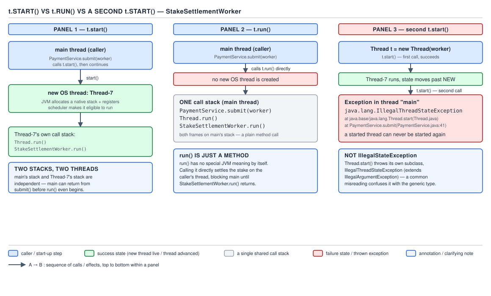

# 05 Multithreading and Concurrency — Threads — BASICS (§1.3, leaves 1.3.1–1.3.9)

**Target version: Java 21 LTS.** | **Part 1 of 5** | [Index](../00-index.md)
Previous: [Foundations — the OS substrate](../foundations/02-basics-os-substrate.md) · Next: [Threads — builder, handlers and removals](01b-basics-thread-api-builder-and-removals.md)

## Construction: `new Thread(Runnable)` and the overloads

`Thread` has constructor overloads taking any combination of a `Runnable`, a `String` name, a
`ThreadGroup`, and a `long stackSize`. `stackSize` is a **hint**, not a guarantee — the Javadoc
says the VM is free to treat it as a suggestion, and may round it up to a platform minimum, round
it down to a maximum, or ignore it outright on a platform that does not expose per-thread stack
control. Passing `0` means "use the platform default," which on most 64-bit JVMs is 512 KB–1 MB
depending on `-Xss` and the OS. `StakeSettlementWorker` code never sizes a stack explicitly — the
default is more than enough for a settlement callback — so in practice this constructor argument
is something you read about in a stack trace, not something you tune.

> A `stackSize` argument to `new Thread(...)` is advisory: the JVM may silently ignore, clamp, or
> round it.

## `start()` versus `run()`, and `start()` twice

### Mental model

Picture two doors into the same room — the `run()` method body. `start()` opens a **new** door: a
fresh native thread walks in from the OS scheduler and begins executing `run()` on its own stack,
concurrently with whoever called `start()`. `run()` called directly is not a door at all — it is
the caller reaching through the wall and executing the method body themselves, on their own stack,
in their own call sequence. No new thread, no concurrency, no scheduling decision. It is exactly as
if the method call had been inlined.

### Why it exists

`Thread` implements `Runnable` for historical reasons — `Thread` predates the JDK's separation of
"a task" from "a unit of concurrency" — so `run()` has to be a public, directly callable method;
the language has no way to mark it "callable only by the VM's thread-start machinery." That leaves
a public method that looks identical whether it starts a thread or doesn't, and nothing in the
type system stops anyone calling the wrong one.

### When to reach for it, and when not

Call `start()` whenever the task should run concurrently with the caller — which is the only
reason to touch `Thread` at all. Call `run()` directly only in a test that deliberately wants
synchronous, single-threaded execution of the task body with no thread creation — for example
asserting `StakeSettlementWorker`'s ledger side effects without paying for a real OS thread. Never
call `run()` "to save the cost of starting a thread" in production code; that silently downgrades a
concurrent design to a sequential one, with no compiler warning and no exception.

### How it works

`start()` is `synchronized` and native: it checks the thread's internal state is `NEW`, transitions
it, registers it with the `ThreadGroup`, and asks the JVM's threading layer to create a native OS
thread (`pthread_create` on POSIX, `CreateThread` on Windows) whose entry point eventually calls
back into `Thread.run()`. That state check is also what rejects a second call: `start()` throws
**`IllegalThreadStateException`** if the thread is not `NEW` — a `Thread` object is a single-use
handle to one native thread, and `NEW → RUNNABLE` is a one-way transition enforced inside `start()`
itself, before `run()` is ever touched a second time. `run()` itself is unremarkable Java —
`public void run() { if (target != null) target.run(); }` when constructed from a `Runnable`, or
the overridden body when subclassing. Calling `t.run()` directly invokes exactly that method, on
the calling thread, with no native call in between.



**D-010** — `start()` versus `run()` versus `start()` twice.

### A minimal concrete example

```java
public final class StakeSettlementWorker implements Runnable {

    private final RoundId roundId;
    private final FundsLedger ledger;

    public StakeSettlementWorker(RoundId roundId, FundsLedger ledger) {
        this.roundId = roundId;
        this.ledger = ledger;
    }

    @Override
    public void run() {
        System.out.println("settling round " + roundId + " on thread "
                + Thread.currentThread().getName());
        ledger.settle(roundId);
    }
}
```

```java
Thread settler = new Thread(new StakeSettlementWorker(roundId, ledger), "settle-demo");

settler.run();     // prints "on thread main" — no concurrency, ledger.settle() runs inline
settler.start();   // prints "on thread settle-demo" — a real OS thread does the settling
settler.start();   // throws IllegalThreadStateException — a Thread is single-use
```

`settler.run()` blocks the caller until `ledger.settle()` returns, on the caller's own stack.
`settler.start()` returns almost immediately; the settlement happens concurrently. The second
`start()` never gets that far — it fails on the state check before touching `run()` at all.

### The gotcha

**Pitfall:** calling `t.run()` "to run it in the background" is the single most common `Thread`
misuse in code review. The symptom is subtle: everything *works*, just sequentially, with no
concurrency and no performance win — nothing throws, so the bug survives until someone profiles
throughput and finds one thread doing all 3,400 settlements/sec of a burst that was supposed to be
spread across a pool. The fix is mechanical: audit every `.run()` call site on a `Thread` (not on a
`Runnable` handed elsewhere) and confirm it is a test.

**Pitfall:** a second call to an already-started `Thread` throws **`IllegalThreadStateException`**,
a `RuntimeException` subclass declared in `java.lang` alongside `Thread` — **not**
`IllegalStateException`, also in `java.lang` but a different, later-added type. The two are easy to
confuse because they mean the same English sentence ("you called this in the wrong state"), but
`catch (IllegalStateException e)` around a `start()` call will not catch it. `Thread`'s API froze
before `IllegalStateException` became the JDK's general convention for this situation, and it was
never retrofitted.

**Interview:** "What happens if you call `start()` twice on the same `Thread`?" — it throws
`IllegalThreadStateException` because a `Thread` object is a single-use handle to one native
thread; `NEW → RUNNABLE` is a one-way transition enforced by the state check inside `start()`
itself.

> `start()` asks the VM for a new native thread and invokes `run()` on it, and rejects a repeat call
> with `IllegalThreadStateException`; `run()` called directly is an ordinary method call with no
> new thread, no scheduler involvement, and no concurrency.

## Subclassing `Thread` versus passing a `Runnable`

### Mental model

A `Thread` object is a handle to a native execution context; a `Runnable` is a bundle of work. The
question "should `StakeSettlementWorker` extend `Thread` or implement `Runnable`?" is really "is a
settlement job *a kind of thread*, or *a kind of work a thread can carry out*?" — and it is
obviously the latter.

### Why it exists

Both compile and both run, because `Thread` itself implements `Runnable` and its own `run()`
delegates to a stored `target` when one was supplied at construction. The choice only matters
because Java gives single inheritance: `class Worker extends Thread` spends the class's one
`extends` slot on a base class the worker does not conceptually need.

### When to reach for it, and when not

Prefer `implements Runnable` (or a plain lambda) passed to `new Thread(...)` or, in modern code, to
`Thread.ofPlatform()`/`Thread.ofVirtual()`. Reach for subclassing `Thread` only in the rare case of
overriding thread-management behaviour itself (not the task), which almost never applies to
application code. Never subclass `Thread` "because it's one line shorter" — the cost shows up
later, not at the call site.

### How it works

Composition wins for two concrete reasons: it models the actual relationship (a task is not a
thread), and it leaves the class free to extend something else later. Virtual threads make the
subclassing style outright impossible: `Thread.ofVirtual()` returns a virtual thread built through
an internal, non-public, non-subclassable code path, so any type declared as `class Worker extends
Thread` has no virtual-thread equivalent to migrate to — it cannot be constructed the
`Thread.ofVirtual()` way at all.

### A minimal concrete example

```java
// composition — the style that survives a later migration to virtual threads
public final class StakeSettlementWorker implements Runnable {
    private final RoundId roundId;
    private final FundsLedger ledger;

    public StakeSettlementWorker(RoundId roundId, FundsLedger ledger) {
        this.roundId = roundId;
        this.ledger = ledger;
    }

    @Override
    public void run() {
        ledger.settle(roundId);
    }
}

new Thread(new StakeSettlementWorker(roundId, ledger)).start();          // platform thread today
Thread.ofVirtual().start(new StakeSettlementWorker(roundId, ledger));    // same task, virtual thread
```

A `class StakeSettlementWorker extends Thread` version has no second line to write — there is no
`Thread.ofVirtual()` equivalent for a subclass, because `Thread.ofVirtual()` returns an instance of
a final, package-private virtual-thread implementation, not something an application subclass can
stand in for.

### The gotcha

**Pitfall:** teams that subclassed `Thread` "because it was one line shorter" hit a wall the day
they try to move that worker onto virtual threads for the 55k-peak-session I/O-bound workload —
there is no `extends Thread` equivalent for `Thread.ofVirtual()`. The fix is to have written it as
`implements Runnable` from the start; there is no retrofit that avoids a rewrite of the class
hierarchy.

**Interview:** "Why prefer implementing `Runnable` over extending `Thread`?" — a task is not a
thread, it is work a thread carries out; composition avoids burning the single-inheritance slot, and
it is the only style that can later move onto `Thread.ofVirtual()`, which cannot be subclassed.

> Passing a `Runnable` composes a task with a thread; subclassing `Thread` conflates the two, wastes
> the class's one `extends` slot, and cannot be migrated onto virtual threads, which are built through
> a non-subclassable internal path.

## `sleep`/`yield` have no synchronization semantics

### Mental model

Think of `Thread.sleep` and `Thread.yield` as pausing the *scheduler's* attention to a thread — they
say nothing to the *memory model*. Sleeping does not tell other threads "my writes are now
visible," and it does not tell the compiler "stop caching this value in a register." A timer, not a
fence.

### Why it exists

Engineers under deadline pressure discover that adding `Thread.sleep(10)` before reading a shared
field "fixes" a visibility bug caused by a data race, and conclude sleep does something to memory.
It doesn't — the bug was masked, not fixed, because sleeping long enough usually gives the writer's
cache line time to become visible through unrelated OS activity (a timer interrupt, another lock
acquisition nearby), not because `sleep` itself established a happens-before edge.

### When to reach for it, and when not

Use `sleep` for pacing (a poll interval, a backoff delay between reservation retries) and `yield` as
a scheduler hint for a busy loop that wants to be polite. Never reach for either as a substitute for
`volatile`, a lock, or `java.util.concurrent.atomic` when one thread's write must become visible to
another — happens-before edges exist precisely for that, and neither `sleep` nor `yield` is on the
list that creates one.

### How it works

**[SOURCE]** JLS §17.3 (`Word Tampering` and the surrounding synchronization-order sections) is
explicit that only a defined set of actions establish happens-before edges: a monitor unlock/lock
pair, a volatile write/read pair, `Thread.start()`/the first action in the started thread, the last
action in a thread paired with any other thread's successful `join()` detecting its termination, and
a handful of others. `Thread.sleep` and `Thread.yield` are conspicuously absent. The synchronization
order is defined purely in terms of those specific action pairs — `sleep()` is a native call that
parks the OS thread for a duration and does not participate in it at all; `yield()` is a scheduling
request that does not touch memory ordering either.

**[PROVE]** Concretely: suppose thread *W* writes a non-volatile `int settledCount = 5;` then calls
`Thread.sleep(1000)`, and thread *R* is spinning on `while (settledCount == 0) {}` before the sleep
call returns. Nothing in the JLS forces `W`'s write to become visible to `R` merely because a second
elapses. `settledCount` is not volatile, so the compiler is licensed to hoist it into a register on
`R`'s first read inside the loop — meaning `R` may never observe `W`'s write even if it spins for
the program's entire lifetime, because `sleep`'s passage of wall-clock time carries zero
memory-visibility guarantee. The loop "usually" terminates in practice only because JIT compilers
rarely hoist a read across a method call that could plausibly have side effects, and because OS
scheduling noise incidentally flushes store buffers along the way — neither of which the JLS
promises, and both of which can fail to happen under different load or a different JIT.

### A minimal concrete example

```java
// broken — relies on sleep for visibility, not a real fix
final class BrokenReservationFlag {
    private boolean reserved = false;          // not volatile

    void reserve() {
        reserved = true;
    }

    void awaitReservation() throws InterruptedException {
        while (!reserved) {
            Thread.sleep(5);   // does NOT guarantee reserved's new value is ever seen
        }
    }
}
```

```java
// fixed — volatile establishes the happens-before edge sleep never provided
final class ReservationFlag {
    private volatile boolean reserved = false;

    void reserve() {
        reserved = true;
    }

    void awaitReservation() throws InterruptedException {
        while (!reserved) {
            Thread.sleep(5);   // now purely a pacing delay; visibility comes from volatile
        }
    }
}
```

### The gotcha

**Pitfall:** "I added a `Thread.sleep(10)` and the bug went away" is a diagnosis, not a fix — it
means there is a data race whose timing window is currently smaller than 10 ms, not that the race is
gone. Under different load, a different JIT compilation, or a different CPU, the identical code can
hang forever. The fix is `volatile`, a lock, or an atomic — never a delay.

**Interview:** "Does `Thread.sleep` release a lock the thread holds?" — no; sleeping while holding a
monitor holds it for the entire sleep duration, itself a classic way to accidentally create a
bottleneck, and JLS 17.3 guarantees no synchronization action happens as a side effect of sleeping.

> `Thread.sleep` and `Thread.yield` are pure scheduling hints — JLS 17.3 defines no happens-before
> edge for either, so neither can be used to establish memory visibility, no matter how long the
> sleep or how often the yield.

## `Thread.yield()` and `Thread.onSpinWait()` as spin-loop hints

`yield()` is a hint to the scheduler that the current thread is willing to give up its current
timeslice; the JLS explicitly declines to guarantee the scheduler acts on it at all, so
`yield()`-based coordination ("call yield in a loop until the other thread finishes") is not a
correctness mechanism, only a possible throughput tweak inside a busy-wait.

`Thread.onSpinWait()` (Java 9, JEP 285) is the *correct* hint for a tight spin loop waiting on a
condition — for example, spinning briefly on a lock-free stake-reservation counter before falling
back to blocking, rather than burning full-speed CPU cycles guessing at another thread's progress.

**[NUM]** The cost it addresses is real and quantifiable in kind, if not in exact cycles: a spin
loop with no hint executes speculative loads at full pipeline speed, which on hardware with
simultaneous multithreading starves the sibling hardware thread of issue slots, and on any x86 core
triggers a memory-order misprediction penalty each time the loop reloads a value that changed
between iterations.

**[ASM] [RESEARCH]** On x86-64, `onSpinWait()` compiles to the `PAUSE` instruction — this is a
documented HotSpot intrinsic, added with JEP 285, that lowers the call directly to `PAUSE` in
C2-compiled code, and it is used internally in `StampedLock`, `Phaser`, and `SynchronousQueue`. On
AArch64, the intrinsic was originally implemented to emit the `YIELD` instruction; later work
(tracked as JDK-8274564) added VM options letting the emitted sequence be chosen among `none`,
`nop`, `isb`, and `yield`, because most known AArch64 hardware implementations treat plain `YIELD`
as a no-op and an `ISB`-based sequence measures better as an actual spin-pause on some
micro-architectures. **Unverified:** which of those AArch64 sequences (`YIELD` alone versus an
`ISB`-based sequence) is the *default* emitted by a stock Java 21 HotSpot build on a given
micro-architecture — the tuning options exist upstream, but the shipped default per JDK 21 build is
not confirmed here; treat any specific opcode claimed for AArch64 Java 21 as needing a check against
that JDK build's `stubGenerator_aarch64.cpp` before quoting it in an interview.

**Interview:** "What does `Thread.onSpinWait()` actually do?" — it is a scheduling/pipeline hint,
not a memory or correctness primitive: on x86 it lowers to `PAUSE`, which reduces power draw and
avoids a memory-order misprediction penalty in the loop; the JIT is free to compile it to a no-op on
any platform with no equivalent instruction, so it must never be relied on for anything beyond
"be a good citizen while spinning."

## `join()`, `join(long)`, `join(Duration)`

### Mental model

`join()` is one thread saying to another, "wake me when you're done" — the calling thread parks
itself on the target thread's own completion signal rather than polling `isAlive()` in a loop.

### Why it exists

A coordinator that dispatches a `PaymentRun` worker and then needs the batch fully settled before
signing off cannot simply proceed after `start()` returns — `start()` only guarantees the worker
began, not that it finished. `join()` is the primitive that blocks until it has.

### When to reach for it, and when not

Reach for `join()` when a caller genuinely must block until a specific thread's work is done before
proceeding — a `PaymentRun` coordinator waiting for its worker before marking the run
`SIGNED_OFF`. Reach for the timed overloads, `join(long)` or `join(Duration)` (the latter since Java
19), when the coordinator needs a bound and a fallback path rather than an unbounded wait — but a
timed `join()` returning does **not** by itself mean the target finished; the caller must check
`isAlive()` afterward to tell "finished" apart from "timed out." Prefer a
`CompletableFuture`/executor-based join (`Future.get()`) over raw `Thread.join()` in pool-based code,
covered in a later file — raw `join()` is for code that directly owns the `Thread` object, which a
pooled worker's caller usually does not.

### How it works

**[SOURCE]** Per `Thread.java`, `join()` is implemented as `synchronized (this) { while (isAlive())
wait(delay); }` on the *target* `Thread` object — `join` synchronizes on, and waits on, the target
thread's own monitor, and `Thread.exit()` performs the `notifyAll()` that wakes waiters when the
target terminates. The no-argument `join()` passes `delay = 0`, which means "wait forever" to
`Object.wait`. This reuses D-010's monitor machinery conceptually but needs no diagram of its own —
it is a plain `wait`/`notify` pair on the target, not a new native primitive.

### A minimal concrete example

```java
public final class PaymentRunCoordinator {

    public void runAndAwait(PaymentRun run, FundsLedger ledger) throws InterruptedException {
        Thread worker = new Thread(new PaymentRunWorker(run, ledger), "payment-run-" + run.id());
        worker.start();

        worker.join(Duration.ofSeconds(30));   // Java 19+ Duration overload

        if (worker.isAlive()) {
            throw new IllegalStateException("payment run " + run.id() + " did not finish in time");
        }
    }
}
```

Checking `isAlive()` after the timed `join()` is not optional — without it, a run that is still
mid-settlement at the 30-second mark is silently treated as if it had finished.

### The gotcha

**Pitfall:** because `join()` synchronizes on the `Thread` object itself, application code that also
does `synchronized (someThread) { ... }` on that same `Thread` instance is contending for the
identical monitor the JDK's own `join`/`exit` machinery uses internally. This produces a spurious,
hard-to-diagnose deadlock or a missed notification, because the application's critical section and
the JDK's `wait`/`notifyAll` pair are now racing for the same lock without either side knowing about
the other. The fix: never synchronize on a `Thread` object from application code; treat it as
reserved for the JDK's internal join/exit protocol.

**Interview:** "How is `join()` actually implemented for a platform thread, and what bug does that
create?" — `synchronized (this) { while (isAlive()) wait(delay); }` on the target `Thread`; any
application `synchronized (someThread)` on that same instance contends for the exact monitor `join`
uses, risking a deadlock or missed wakeup that has nothing to do with the application's own logic.

> `join()` blocks the caller until the target thread terminates by waiting on the target `Thread`
> object's own monitor; synchronizing on a `Thread` from application code contends with that
> internal protocol and must never be done.

## `Thread.State` — the six constants

`Thread.getState()` returns one of six `Thread.State` enum constants, checked directly against JVM
internal status, never inferred from application-level polling:

| State | Meaning |
|---|---|
| `NEW` | Created, `start()` not yet called |
| `RUNNABLE` | Executing or eligible to execute (covers both actually running and waiting for a CPU) |
| `BLOCKED` | Waiting to acquire a monitor lock |
| `WAITING` | Blocked indefinitely by `Object.wait()`, no-argument `Thread.join()`, or `LockSupport.park()` |
| `TIMED_WAITING` | Same as `WAITING` but bounded: `sleep`, timed `wait`/`join`, `parkNanos` |
| `TERMINATED` | `run()` has returned or thrown |

A `PaymentRun` worker sits in `RUNNABLE` while settling, moves to `TIMED_WAITING` for the duration
of a `Thread.sleep` backoff between retries, and its coordinator's `worker.join(Duration...)` call
itself parks the coordinator's own thread in `TIMED_WAITING` until the worker reaches
`TERMINATED` or the timeout elapses. The full transition diagram between these six states — including
why a notified thread visits `BLOCKED` before `RUNNABLE` on its way out of `WAITING` — is the next
file's subject.

## Pitfalls

### Assuming a second `start()` throws `IllegalStateException`

**Wrong**
```java
Thread t = new Thread(() -> {});
t.start();
try {
    t.start();
} catch (IllegalStateException e) {   // never caught — wrong exception type
    log.warn("thread already started");
}
```
Running this lets `IllegalThreadStateException` propagate uncaught, because it does not extend
`IllegalStateException`.

**Right**
```java
try {
    t.start();
} catch (IllegalThreadStateException e) {
    log.warn("thread already started");
}
```

**Why people believe it:** the English description ("you called this in the wrong state") matches
`IllegalStateException` exactly, and most other JDK classes that reject a repeated action do throw
`IllegalStateException` — `Thread` simply predates that convention and never got retrofitted.

### Adding `Thread.sleep` to "fix" a visibility bug

**Wrong**
```java
while (!reserved) {
    Thread.sleep(5);   // "works" in testing, hangs occasionally in production
}
```

**Right**
```java
private volatile boolean reserved;
while (!reserved) {
    Thread.sleep(5);   // now just pacing; volatile provides the actual visibility guarantee
}
```

**Why people believe it:** the sleep really does make the symptom disappear most of the time,
because it gives enough wall-clock time for an unrelated OS event to flush the write — which looks
like causation but is coincidence.

## Cheat sheet

| Item | One-line fact |
|---|---|
| `stackSize` constructor arg | advisory hint; VM may ignore, clamp, or round it |
| `start()` twice | throws `IllegalThreadStateException`, not `IllegalStateException` |
| `run()` called directly | no new thread, runs on the caller, no concurrency |
| `Thread` subclass vs `Runnable` | `Runnable` composes; subclass wastes `extends` and can't become a virtual thread |
| `sleep`/`yield` | JLS 17.3: no synchronization semantics, no happens-before edge |
| `Thread.sleep` + monitor | holds the monitor for the whole sleep — a bottleneck, not a release |
| `onSpinWait()` | correct spin-wait hint; `PAUSE` on x86, `YIELD`/`ISB`-class on AArch64 (default unverified for a specific build) |
| `join()` mechanism | `synchronized(this) { while (isAlive()) wait(delay); }` on the target |
| Timed `join()` | may return before termination — check `isAlive()` afterward |
| `Thread.State` | `NEW, RUNNABLE, BLOCKED, WAITING, TIMED_WAITING, TERMINATED` |

## Self-test

**Q1.** What exception does a second `start()` call on the same `Thread` throw, and why is it not
`IllegalStateException`?

<details><summary>Answer</summary>

`IllegalThreadStateException`, a `RuntimeException` subclass in `java.lang` alongside `Thread`
itself. `Thread`'s API was frozen before `java.lang.IllegalStateException` became the JDK's general
convention for "wrong state," so it kept its own thread-specific exception rather than being
retrofitted.

</details>

**Q2.** A `StakeSettlementWorker` is passed to `settler.run()` instead of `settler.start()`. What
observably happens, and why is the bug easy to miss?

<details><summary>Answer</summary>

`run()` executes on the caller's own thread and blocks it until `ledger.settle()` returns — no new
thread, no concurrency. Nothing throws and no result is wrong, so the bug only surfaces as reduced
throughput once someone measures that settlements are running one at a time instead of in parallel.

</details>

**Q3.** Why can `class StakeSettlementWorker extends Thread` never be migrated to
`Thread.ofVirtual()`?

<details><summary>Answer</summary>

`Thread.ofVirtual()` constructs its virtual thread through an internal, non-public, non-subclassable
path — there is no `extends Thread` equivalent for it. Code that models its work as a `Thread`
subclass has no virtual-thread counterpart to move to without rewriting the class to implement
`Runnable` instead.

</details>

**Q4.** Why does adding `Thread.sleep(10)` before a shared-field read sometimes "fix" a race
condition without actually fixing it?

<details><summary>Answer</summary>

`sleep` establishes no happens-before edge per JLS 17.3; the fix works by luck — enough wall-clock
time passes for an unrelated event (scheduler noise, another lock acquisition) to incidentally
flush the writer's value into visibility. Under different timing, JIT compilation, or hardware, the
same code can still read a stale value forever.

</details>

**Q5.** What does `Thread.onSpinWait()` compile to, and what must you avoid claiming about its
AArch64 lowering without checking a specific JDK build?

<details><summary>Answer</summary>

On x86-64 it lowers to the `PAUSE` instruction via a documented HotSpot intrinsic. On AArch64 it was
originally `YIELD`, with later VM options allowing `none`/`nop`/`isb`/`yield` sequences because plain
`YIELD` is a no-op on much AArch64 hardware — but which sequence a specific Java 21 build emits by
default is not confirmed here, so that exact default should not be asserted without checking the
build's stub generator.

</details>

**Q6.** How is `join()` actually implemented for a platform thread, and what bug does that
implementation create for application code?

<details><summary>Answer</summary>

`synchronized (this) { while (isAlive()) wait(delay); }` on the target `Thread` object itself. Any
application code that also does `synchronized (someThread) { ... }` on that same instance is
contending for the identical monitor `join()` uses internally, which can produce spurious missed
notifications or deadlocks — application code should never synchronize on a `Thread` object.

</details>

**Q7.** Which `Thread.State` does a coordinator's own thread enter while blocked in
`worker.join(Duration.ofSeconds(30))`, and why that one rather than `WAITING`?

<details><summary>Answer</summary>

`TIMED_WAITING` — because the wait has a bound. `WAITING` is reserved for the unbounded cases:
no-argument `wait()`, no-argument `join()`, and `LockSupport.park()` with no deadline.

</details>

---

**Leaves covered:** 1.3.1–1.3.9 (9 leaves)
**Leaves deferred:** none
**Diagrams included:** D-010
**Target version:** Java 21 LTS
**Lines:** 587
