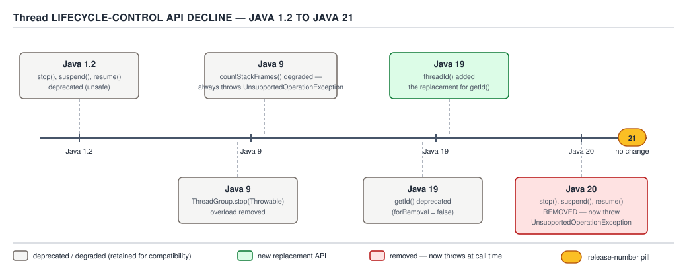

# 05 Multithreading and Concurrency — Threads — BASICS (§1.3, leaves 1.3.10–1.3.18)

**Target version: Java 21 LTS.** | **Part 1 of 5** | [Index](../00-index.md)
Previous: [Threads — the Thread API](01-basics-thread-api.md) · Next: [Threads — lifecycle and states](02-basics-lifecycle-and-states.md)

The previous file covered the `Thread` constructors, instance methods and the platform/virtual
split. This file covers everything around construction: how a thread reports it died, the builder
surface that replaced ad-hoc constructor overloads, the members quietly removed under everyone's
feet, and the one interface every executor should be handed instead of letting it default.

---

## `Thread.UncaughtExceptionHandler`

An uncaught exception does not print to the console because the JVM feels like it. It happens
because a specific, overridable handler chain decided to do that, and the chain has a hole in it
that silently swallows failures if you are not watching for it.

**Mental model.** Every thread, when its `run()` method returns by throwing rather than
returning, hands the `Throwable` to a three-tier lookup: the thread's own handler if one was set,
else its `ThreadGroup`'s `uncaughtException` method, else the JVM's default handler (which prints
a stack trace to `System.err` and does nothing else). Nobody re-throws it, nobody blocks on it,
nobody notifies any other thread. The thread that failed simply terminates — `Thread.State`
becomes `TERMINATED` — and every other thread in the process keeps running as if nothing
happened.

**Why it exists.** `run()` on a bare `Thread` has no `throws` clause and no return value that
anyone inspects (`Thread` does not implement `Future`). Without a hook, a `RuntimeException`
thrown deep inside a worker thread would vanish: no caller is blocked on `join()` waiting to
observe it, and the exception cannot propagate up a call stack that has no caller. The handler is
the only inspection point the platform gives you.

**When to reach for it, and when not.** Reach for a per-thread or per-factory handler on any pool
whose tasks are fire-and-forget — nothing calls `Future.get()` on them, so nothing else will ever
surface the failure. Do not reach for it on threads whose work is submitted through an
`ExecutorService` and retrieved via `Future.get()`: there, the exception is already captured and
re-thrown (wrapped in `ExecutionException`) to the caller of `get()`, and installing a handler on
top just duplicates the reporting path — day 3 covers that capture mechanism.

**How it works.** The lookup order, precisely:

1. `Thread.getUncaughtExceptionHandler()` — sticky, per-instance; if `setUncaughtExceptionHandler`
   was called on this thread, that handler runs and nothing else is consulted.
2. The thread's `ThreadGroup`, which implements `UncaughtExceptionHandler` itself. Its default
   `uncaughtException(t, e)` delegates to the group's parent group if the exception is not an
   instance of `ThreadDeath`, bottoming out at the root group.
3. `Thread.getDefaultUncaughtExceptionHandler()` — a single JVM-wide handler set once via
   `Thread.setDefaultUncaughtExceptionHandler(...)`, consulted only if no per-thread handler and
   no non-default `ThreadGroup` handler exist.
4. If nothing was ever installed, the root `ThreadGroup`'s handler prints the stack trace to
   `System.err` — this is the default behaviour every JVM ships with and the reason "uncaught
   exceptions" look like they are handled when nobody wrote a line of code for it.

**Example — logging a failed settlement reservation.** `FundsLedger` runs a fixed pool that drains
a queue of `SettleStake` callbacks. A worker thread that throws while updating
`CLIENT_CASH_RESERVED` must not vanish silently — the platform default would print to `stderr` and
the failed `Reservation` would never reach an alert.

```java
Thread.UncaughtExceptionHandler settlementFailureHandler = (thread, ex) -> {
    if (ex instanceof LedgerImbalanceException imbalance) {
        log.error("settlement thread {} died mid-reservation reservationId={} clientId={}",
                thread.getName(), imbalance.reservationId(), imbalance.clientId(), ex);
        alerting.pageOnCall("ledger-imbalance", imbalance.reservationId());
    } else {
        log.error("settlement thread {} died unexpectedly", thread.getName(), ex);
    }
};

Thread worker = Thread.ofPlatform()
        .name("settlement-ingest-", 0)
        .uncaughtExceptionHandler(settlementFailureHandler)
        .unstarted(() -> drainSettlementQueue(settlementQueue));
worker.start();
```

**Pitfall:** assuming a handler installed after the thread has already thrown is retroactive.

**Wrong**

```java
Thread t = new Thread(() -> { throw new IllegalStateException("bad stake split"); });
t.start();
t.join();
t.setUncaughtExceptionHandler((thr, ex) -> log.error("caught", ex)); // too late, never runs
```

**Right**

```java
Thread t = new Thread(() -> { throw new IllegalStateException("bad stake split"); });
t.setUncaughtExceptionHandler((thr, ex) -> log.error("caught", ex)); // set BEFORE start()
t.start();
t.join();
```

**Why people believe it:** exception handlers elsewhere in Java (try/catch, `CompletableFuture`
error stages) can be composed after the fact because the underlying computation has not run yet
or is being replayed. `Thread.run()` executes exactly once, synchronously, on that thread; by the
time `join()` returns the handler dispatch already happened or didn't.

**Interview:** "Why doesn't my worker thread's exception show up anywhere?" — because nothing sets
`setUncaughtExceptionHandler`, so it falls through to the `ThreadGroup` default, which prints to
`stderr`, which nobody is reading in a production log pipeline that only ships stdout/structured
logs.

> **`UncaughtExceptionHandler`** is the terminal notification hook for a thread that dies by
> exception rather than by returning — install it before `start()`, because after the throw it is
> too late.

---

## `Thread.Builder`, `Thread.ofPlatform()`, `Thread.ofVirtual()` and `startVirtualThread`

**Mental model.** Before Java 21, configuring a thread meant picking one of eight `Thread`
constructor overloads and hoping the one you wanted existed, then calling `setDaemon`,
`setPriority`, and `setUncaughtExceptionHandler` as separate statements afterward — each of which
can only run before `start()`, a rule enforced by convention, not by the compiler. `Thread.Builder`
collapses that into one fluent, immutable-until-built object, and — because virtual threads exist
now and most of those knobs make no sense on one — the same interface has two implementations
that accept different subsets of calls.

**Why it exists.** Two things converged in Java 21: virtual threads (JEP 444) needed a
construction path that didn't drag in platform-only concepts like `ThreadGroup` and stack size,
and the existing constructor-overload approach to `Thread` configuration didn't scale to two
thread kinds without doubling the overload count again. `Thread.Builder` is the single fluent
front door for both.

**When to reach for it, and when not.** Reach for `Thread.ofVirtual()`/`Thread.ofPlatform()` any
time you are hand-rolling threads outside a pool — a background compactor, a one-off startup
task, a `ThreadFactory` for an executor. Do not reach for it when you already have an
`ExecutorService`: `Executors.newVirtualThreadPerTaskExecutor()` and the fixed-pool factories
build their own threads via a `ThreadFactory` internally, and constructing threads by hand next to
a pool is how leaks and unbounded thread counts happen — day 3 covers pool sizing.

**How it works.** `Thread.Builder` is a **sealed interface**, `permits Thread.Builder.OfPlatform,
Thread.Builder.OfVirtual`. Both sub-interfaces share `name(String)`, `name(String prefix, long
start)`, `inheritInheritableThreadLocals(boolean)`, `uncaughtExceptionHandler(...)`, `unstarted
(Runnable)`, `start(Runnable)`, and `factory()`. `OfPlatform` alone adds `group(ThreadGroup)`,
`daemon(boolean)`, `daemon()`, `priority(int)`, and `stackSize(long)`.

`[RESEARCH]` This is the load-bearing fact for this section, verified against the Java 21 and
Java 25 `java.lang.Thread.Builder`/`Thread.Builder.OfVirtual` javadoc (mirrored at
`docs.oracle.com/en/java/javase/21/docs/api/…` — `openjdk.org` JEP pages return HTTP 403, so the
Oracle javadoc mirror and `bugs.openjdk.org` were used instead): **`Thread.Builder.OfVirtual` does
not declare `daemon`, `priority`, `group`, or `stackSize` at all.** These are not runtime-rejected
calls on a virtual builder — they are compile errors, because `OfVirtual` simply never extends an
interface that declares them. That is a stronger guarantee than "ignored": the mistake is caught
before the program runs, not silently absorbed at runtime.

The runtime rejection lives one level down, on the built `Thread` instance itself. A virtual
thread is always a daemon thread; calling `setDaemon(false)` on an already-built virtual `Thread`
throws `IllegalArgumentException` — confirmed against the same javadoc — while `setDaemon(true)`
is a no-op that succeeds. Priority on a virtual thread is fixed at `Thread.NORM_PRIORITY` and
`setPriority(int)` is silently ignored (no exception, no effect) for any value. There is no
`stackSize` concept for a virtual thread at all — its stack is a growable, heap-allocated
structure, not a fixed-size region reserved at OS-thread creation, so the question does not apply
rather than being rejected.

**D-011** — The `Thread.Builder` surface, rendered as a table since this diagram is table-typed.

| Call | `Thread.ofPlatform()` | `Thread.ofVirtual()` | `Thread.startVirtualThread(Runnable)` | `new Thread(Runnable)` |
|---|---|---|---|---|
| `name(...)` / `name(prefix,start)` | sets it | sets it | no method — not exposed | `"Thread-" + N` auto-name, no override |
| `daemon(boolean)` | sets it | **no such method (compile error)** | not exposed | n/a — inherits creating thread's daemon flag |
| `priority(int)` | sets it | **no such method (compile error)** | not exposed | n/a — inherits creating thread's priority, clamped by group max |
| `stackSize(long)` | sets it | **no such method — no stack-size concept for a virtual thread** | not exposed | n/a — default JVM stack size (0 = platform default) |
| `inheritInheritableThreadLocals(boolean)` | sets it | sets it | not exposed — always `true` | n/a — always inherits (no public toggle on this ctor) |
| `uncaughtExceptionHandler(...)` | sets it | sets it | not exposed — none set | n/a — none set directly; falls to `ThreadGroup`/default |
| `unstarted(Runnable)` | returns unstarted `Thread` | returns unstarted `Thread` | n/a — always starts immediately | this constructor *is* the unstarted form |
| `start(Runnable)` | builds and starts | builds and starts | this **is** `ofVirtual().start(task)` | caller must call `.start()` separately |
| `factory()` | returns a `ThreadFactory` | returns a `ThreadFactory` | n/a — no factory form | n/a — not a builder |

`Thread.startVirtualThread(Runnable)` (leaf 1.3.12) is documented, and verified against the same
javadoc, as exactly the one-liner `Thread.ofVirtual().start(task)` — a convenience static method
with no configuration surface at all, for the case where the default name, default (always-true)
inheritable-thread-local behaviour, and no uncaught handler are acceptable.

**Example — building the settlement pool's threads without a `ThreadFactory` yet** (the factory
form follows below, once the concept has been introduced on its own):

```java
Thread.Builder.OfPlatform settlementBuilder = Thread.ofPlatform()
        .name("settlement-ingest-", 0)   // settlement-ingest-0, settlement-ingest-1, ...
        .daemon(true)
        .uncaughtExceptionHandler(settlementFailureHandler);

Thread first = settlementBuilder.unstarted(() -> drainSettlementQueue(settlementQueue));
first.start();
```

Calling `settlementBuilder.daemon(true)` on this same builder object twice, or reusing it to build
a second unstarted thread, is legal — a `Thread.Builder` is a reusable template, not a one-shot
object consumed by `.start()`.

The full wrong-vs-right form of this mistake — assuming `daemon(false)` compiles on
`Thread.ofVirtual()` and merely gets ignored, when it is in fact absent from the interface — is
worked through in the `## Pitfalls` section at the foot of this file.

> **`Thread.Builder`** is a sealed, reusable, fluent front door onto both platform and virtual
> thread construction; `OfVirtual` physically lacks the methods that make no sense for a thread
> the JVM schedules onto a carrier rather than the OS.

---

## `Thread.getAllStackTraces()`, `dumpStack()`, `getStackTrace()`

**Mechanism.** `Thread.getAllStackTraces()` returns a `Map<Thread, StackTraceElement[]>` snapshot
of every live thread in the JVM at the moment of the call; `getStackTrace()` returns one thread's
frames; `Thread.dumpStack()` is a convenience that prints the *calling* thread's own stack to
`System.err`, useful for "how did I get here" logging without throwing and catching an exception.

**Gotcha.** All three require a **safepoint** — the JVM must bring every thread in scope to a
point where its stack is in a consistent, walkable state before it can be sampled. On a busy
`FundsLedger` instance with tens of thousands of virtual threads, `getAllStackTraces()` is not a
cheap read; it is closer in cost to a short stop-the-world pause, which is exactly why `jstack`
and JFR thread dumps (day 6, `[X-REF 06]`) are the operational tool of choice rather than calling
this API from inside request-serving code on a hot path.

> **`getAllStackTraces()` / `getStackTrace()` / `dumpStack()`** are safepoint-gated stack
> snapshots — correct for diagnostics, too expensive to call from a hot path.

---

## The removal and deprecation timeline, and why `Thread.stop` was unfixable

**Mental model.** `Thread` shipped in Java 1.0 with a control-the-other-thread API modeled on
process signals: `stop()`, `suspend()`, `resume()`. It reads like `kill -9` for a thread. That
model is fundamentally incompatible with monitors, and the JDK spent from Java 1.2 to Java 20 —
eighteen years — walking it back one release at a time before finally removing it outright.

**Why it (used to) exist.** Early Java had no `interrupt()`-based cooperative cancellation
story and no `ExecutorService`. If a thread needed to be stopped from the outside — a runaway
task, a hung request handler — the only lever available was to reach in and kill it, the way an
operating system kills a process.

**When to reach for it, and when not.** Never — this entire family is gone. The living
replacement is cooperative cancellation: check `Thread.interrupted()` / `isInterrupted()`
periodically, or, for structured lifecycles, cancel a `Future` and let the task observe
interruption on its own schedule (day 3).

**How it works — the timeline, and why every step failed to fix the underlying problem.**

`[RESEARCH]` `[VERSION-TRAP]` Every release below was verified against the Java 21 javadoc's
`java/lang/doc-files/threadPrimitiveDeprecation.html`, the JDK 20 release notes, and
`bugs.openjdk.org/browse/JDK-8294320` (`openjdk.org` JEP pages returned HTTP 403; the Oracle
javadoc mirror and the bug tracker were used instead):

| Release | Change |
|---|---|
| Java 1.2 (1998) | `stop()`, `suspend()`, `resume()`, `stop(Throwable)` all **deprecated** — the earliest deprecation in the entire standard library. |
| Java 9 | `ThreadGroup.stop()` removed outright (it had called the per-thread `stop()` on every thread in the group). |
| Java 9 | `Thread.countStackFrames()` **degraded**: it always throws `UnsupportedOperationException`, ahead of the rest of the family. |
| Java 9 | `Thread.checkAccess()` becomes a permanent no-op — the `SecurityManager`-based access-check story it supported was itself heading for removal (fully removed later, in Java 24, via JEP 486; out of scope for Java 21). |
| Java 19 | `Thread.getId()` **deprecated** (not final, overridable, can be made to lie about identity) in favour of the new `Thread.threadId()`. |
| Java 19 | `Thread.threadId()` **added** — a `final` method returning the thread's identifier, closing the loophole `getId()` left open. |
| Java 20 | `stop()`, `suspend()`, `resume()` **removed** for real. All three now unconditionally throw `UnsupportedOperationException`. Calling `Thread.stop(Throwable)` throws the same. |



**D-012** — The `Thread` deprecation and removal timeline, Java 1.2 through Java 21, with the
Java 20 removal boundary marked.

**`[PROVE]` Why `Thread.stop()` was unfixable — work the argument through.** `Thread.stop()` did
not ask the target thread to exit; it asynchronously threw a `ThreadDeath` error **at whatever
bytecode instruction the target thread happened to be executing at that instant**, on a thread the
caller does not control and cannot see the state of. Follow what that implies, step by step:

1. `ThreadDeath` is a `Throwable`, so it unwinds the target thread's stack exactly like any other
   exception — through every `catch` block, every `finally` block, on the way out.
2. Every `synchronized` block the target thread was inside at the moment of the throw releases its
   monitor as part of that unwind, because monitor release is guaranteed by `finally` semantics
   the JVM enforces structurally.
3. But the monitor was protecting an invariant — say, `FundsLedger` mid-way through debiting
   `CLIENT_CASH_AVAILABLE` and about to credit `CLIENT_CASH_RESERVED` for a stake reservation. If
   `ThreadDeath` lands *between* the debit and the credit, the monitor unlocks with the ledger in
   an impossible state: money debited from one bucket, not yet credited to the other.
4. Any other thread that next acquires that same monitor observes the broken invariant as if it
   were valid — there is no flag, no exception, no signal that the previous holder was killed
   mid-update. `LedgerImbalanceException` would be the honest outcome; silent data corruption is
   the actual one, because nothing forced a check.
5. Because the throw point is **arbitrary bytecode**, no `try`/`finally` discipline can guard
   against it — it can land between two ledger writes meant to be atomic as a pair.

The fix could not be "add a safer overload" the way `wait(timeout)` supplements `wait()`: any API
that interrupts a thread at an arbitrary point while it holds a lock protecting an invariant will
corrupt that invariant some fraction of the time. Cooperative cancellation — checking a flag or
interrupt status **between** self-chosen checkpoints — is the only model that composes with
locking, which is why it replaced `stop()` rather than patching it.

A version-pinned test suite that still compiles a call to `worker.stop()` on Java 21 will still
throw `UnsupportedOperationException` at runtime the moment it executes — the wrong-vs-right form
of this mistake is in the `## Pitfalls` section below.

**Interview:** "Why was `Thread.stop()` removed instead of just discouraged harder?" — because it
throws `ThreadDeath` at an arbitrary instruction and releases every monitor the thread holds on
the way out, which corrupts whatever invariant those monitors were protecting; there is no way to
make that safe, only ways to avoid needing it.

> **The `stop`/`suspend`/`resume` family** modeled thread control as an external kill signal
> that ignores monitor state; Java 20 finished an eighteen-year deprecation by making all three
> throw `UnsupportedOperationException` unconditionally.

---

## `Runnable` versus `Callable<V>`

**Mechanism.** `Runnable.run()` returns `void` and its signature declares no checked exceptions —
a `Runnable` that needs to signal failure has exactly two options: an unchecked exception (routed
to the `UncaughtExceptionHandler` above) or writing the result somewhere another thread polls.
`Callable<V>.call()` returns `V` and declares `throws Exception`, so it can hand back both a
computed value and a checked failure through the normal method-return channel.

**Gotcha.** This is why `ExecutorService.submit(Runnable)` returns a `Future<?>` whose `get()`
can only ever surface an exception (wrapped in `ExecutionException`) and never a value, while
`submit(Callable<V>)` returns a `Future<V>` that can surface both — the API shape follows directly
from which functional interface was handed in. Day 3's `Future`/`CompletableFuture` material
(`[X-REF 04]`) builds the exception-wrapping and cancellation story on top of exactly this
distinction; the one fact to carry forward from here is which of the two interfaces makes which
exception path even possible.

> **`Runnable`** signals failure only via an unchecked exception; **`Callable<V>`** returns a
> value and declares `throws Exception`, which is why executors accept both but only one of them
> can produce a meaningful `Future<V>` result.

---

## `ThreadFactory`

**Mental model.** `ThreadFactory` is a one-method functional interface — `Thread
newThread(Runnable r)` — that exists so a pool never has to guess how its threads should be
named, whether they should be daemons, or who handles their uncaught exceptions. Handing an
executor a factory instead of relying on its defaults turns three easy-to-forget cross-cutting
concerns into one object configured exactly once.

**Why it exists.** `Executors.defaultThreadFactory()` names threads `pool-N-thread-M` — useless
in a `jstack` dump when three different pools are all named that way — and installs no
uncaught-exception handler at all, so failures in pooled tasks that bypass `Future.get()` vanish
into `stderr` exactly as described above. `ThreadFactory` is the JDK's answer to "stop
configuring this per-thread and configure it once, per-pool."

**When to reach for it, and when not.** Reach for it on every executor you construct by hand —
there is no cost to naming threads meaningfully, and the alternative is an incident where
`jstack` shows forty threads named `pool-3-thread-17` and nobody can tell which subsystem owns
the pool. Do not reach for it when using `Executors.newVirtualThreadPerTaskExecutor()` for
short-lived, high-cardinality virtual-thread tasks where per-thread naming has little diagnostic
value at that volume — a per-task `Thread.startVirtualThread` name prefix or structured-concurrency
scope name (later in this topic) carries the identifying information instead.

**How it works.** `ThreadFactory` is deliberately minimal — one method, no lifecycle hooks, no
shutdown callback. Everything a factory needs — a shared `AtomicLong` counter for numbering, the
shared `UncaughtExceptionHandler`, the daemon flag — is closed over in the lambda or held as
fields on an implementing class. Internally this is exactly what `Thread.Builder.factory()`
(leaf 1.3.11, above) returns: calling `.factory()` on a configured `Thread.Builder` produces a
`ThreadFactory` that stamps every thread it creates with that builder's settings, incrementing the
counter given to `name(prefix, start)` on each call.

**`[BUILD]` Example — a complete `ThreadFactory` for the stake-settlement pool**, naming threads
`settlement-ingest-0`, `settlement-ingest-1`, `settlement-ingest-2`, ... and installing the
uncaught-exception handler defined earlier so a failed `Reservation` is logged instead of
vanishing:

```java
final class SettlementThreadFactory implements ThreadFactory {

    private final AtomicLong sequence = new AtomicLong(0);
    private final Thread.UncaughtExceptionHandler handler;

    SettlementThreadFactory(Thread.UncaughtExceptionHandler handler) {
        this.handler = handler;
    }

    @Override
    public Thread newThread(Runnable task) {
        Thread t = new Thread(task, "settlement-ingest-" + sequence.getAndIncrement());
        t.setDaemon(true);
        t.setUncaughtExceptionHandler(handler);
        return t;
    }
}

// wiring:
ThreadFactory settlementFactory = new SettlementThreadFactory(settlementFailureHandler);
ExecutorService settlementPool = Executors.newFixedThreadPool(4, settlementFactory);
settlementPool.submit(() -> settleStake(reservationId));
// a worker in this pool is literally named settlement-ingest-3 in a jstack dump
```

Equivalently, `Thread.ofPlatform().name("settlement-ingest-", 0).daemon(true)
.uncaughtExceptionHandler(settlementFailureHandler).factory()` produces the same `ThreadFactory`
in one expression, with nowhere to add pool-specific fields later.

**Pitfall:** assuming a custom `ThreadFactory` is required to also propagate `ThreadLocal`
context (tracing IDs, request-scoped `ClientId`) automatically.

**Wrong**

```java
// assumes the pool's threads will "just know" which client's request this is
ThreadFactory factory = task -> new Thread(task, "settlement-ingest");
```

**Right**

```java
ThreadFactory factory = task -> {
    ClientId capturedClientId = CURRENT_CLIENT.get();   // capture on the submitting thread
    return new Thread(() -> {
        CURRENT_CLIENT.set(capturedClientId);           // re-establish on the pooled thread
        try {
            task.run();
        } finally {
            CURRENT_CLIENT.remove();
        }
    }, "settlement-ingest");
};
```

**Why people believe it:** `InheritableThreadLocal` really does propagate automatically — but
only from the thread that *constructs* a `Thread`, at construction time, not from the thread that
later *submits a task* to an already-running pooled thread. A pool's worker threads are
constructed once, long before any particular task's context exists, so inheritance never fires for
per-task values; day 2's `ThreadLocal` material covers this gap in full.

**Interview:** "Why does every production `ExecutorService` get a custom `ThreadFactory`?" —
because the default factory's thread names are useless in a stack dump and it installs no
uncaught-exception handler, so pooled task failures that bypass `Future.get()` disappear silently;
a one-method factory fixes both in one place instead of on every `Thread` individually.

> **`ThreadFactory`** is the single seam where a pool's thread names, daemon status, and
> uncaught-exception handling are decided once, rather than configured — or forgotten — per
> thread.

---

## `Thread.holdsLock(Object)`

**Mechanism.** `Thread.holdsLock(obj)` is a static method returning `true` if the **currently
executing thread** holds the intrinsic (monitor) lock on `obj` — not a general-purpose lock
inspector for arbitrary threads, only for the caller itself.

**Gotcha.** Its real use is as an `assert`, not as production control flow: `assert
Thread.holdsLock(ledgerLock) : "must hold ledgerLock before mutating reserved balances"` documents
and enforces, at debug time, a locking invariant that a code reviewer would otherwise have to
verify by reading every call site. It says nothing about `ReentrantLock` or any other
`java.util.concurrent.locks` lock — those expose their own `isHeldByCurrentThread()` instead,
which day 3 covers.

> **`Thread.holdsLock(Object)`** answers "does the calling thread hold this object's monitor
> right now" — an assertion tool for documenting locking invariants, not a general lock query.

---

## Pitfalls

### Assuming `Thread.stop()` still works because it still compiles

**Wrong**

```java
Thread runaway = new Thread(this::processReservationBatch);
runaway.start();
runaway.stop();   // compiles on Java 21; throws UnsupportedOperationException at the call site
```

**Right**

```java
Thread runaway = new Thread(this::processReservationBatch);
runaway.start();
runaway.interrupt();
runaway.join(Duration.ofSeconds(2));
```

**Why people believe it:** the method signature is untouched — same name, same erasure, same
bytecode call shape — so nothing at compile time signals that the removal happened; only the
runtime behaviour changed, in Java 20.

### Assuming `Thread.ofVirtual().daemon(true)` compiles because the concept "exists" for virtual threads

**Wrong**

```java
var vt = Thread.ofVirtual().daemon(true).unstarted(this::settleStake);  // no such method on OfVirtual
```

**Right**

```java
var vt = Thread.ofVirtual().unstarted(this::settleStake);  // already, unconditionally, a daemon
```

**Why people believe it:** virtual threads *are* daemon threads, so it is easy to assume the
builder exposes a redundant confirmation of that fact rather than omitting the method entirely.

---

## Cheat sheet

| Item | Fact |
|---|---|
| Uncaught exception lookup order | per-thread handler → `ThreadGroup.uncaughtException` → JVM default handler (prints to `stderr`) |
| Set handler | **before** `start()` — no effect if set after the thread has already thrown |
| `Thread.Builder` | sealed; `permits OfPlatform, OfVirtual` |
| Shared builder methods | `name`, `name(prefix,start)`, `inheritInheritableThreadLocals`, `uncaughtExceptionHandler`, `unstarted`, `start`, `factory` |
| `OfPlatform`-only methods | `group`, `daemon`, `priority`, `stackSize` |
| `OfVirtual` and `daemon`/`priority`/`stackSize`/`group` | **do not exist on the interface** — compile error, not a runtime rejection |
| `Thread.setDaemon(false)` on a live virtual thread | throws `IllegalArgumentException` |
| `Thread.setPriority(int)` on a virtual thread | silently ignored, no exception |
| `Thread.startVirtualThread(Runnable)` | exactly `Thread.ofVirtual().start(task)` |
| `stop`/`suspend`/`resume` deprecated | Java 1.2 |
| `ThreadGroup.stop()` removed | Java 9 |
| `countStackFrames()` degraded to always-throw | Java 9 |
| `getId()` deprecated / `threadId()` added | Java 19 |
| `stop`/`suspend`/`resume` removed (throw `UnsupportedOperationException`) | Java 20 |
| Why `stop()` was unfixable | throws `ThreadDeath` at arbitrary bytecode, releases every held monitor mid-invariant |
| `Runnable.run()` | `void`, no checked exceptions |
| `Callable<V>.call()` | returns `V`, `throws Exception` |
| `ThreadFactory` | one method, `Thread newThread(Runnable)` — the seam for names, daemon flag, handler |
| `Thread.Builder.factory()` | returns a `ThreadFactory` stamping every thread with that builder's config |
| `Thread.holdsLock(Object)` | true iff the *calling* thread holds `obj`'s monitor — assertion tool only |

## Self-test

**Q1.** A worker thread submitted via `executorService.submit(runnableTask)` throws a
`RuntimeException`. Where does that exception go if nobody ever calls `future.get()`?

<details><summary>Answer</summary>

It still reaches the thread's `UncaughtExceptionHandler` chain — per-thread handler, then
`ThreadGroup`, then the JVM default (print to `stderr`) — because the pooled worker thread itself
threw uncaught. `submit()` wraps the task so the pool can capture completion, but if the caller
never calls `get()` on the returned `Future`, the wrapped `ExecutionException` is never observed
either; the only place the failure surfaces on its own is the uncaught-exception path, which is
exactly why production pools install a `ThreadFactory` with a real handler rather than relying on
someone remembering to call `get()`.

</details>

**Q2.** Why does `Thread.Builder.OfVirtual` not have a `stackSize(long)` method, given that
`OfPlatform` does?

<details><summary>Answer</summary>

A platform thread's stack is a fixed-size region reserved from the OS at thread creation, so
`stackSize` configures a real, bounded resource. A virtual thread's "stack" is a growable,
heap-allocated structure managed by the JVM's continuation machinery, with no fixed size to
configure — the method is absent because the concept it would configure does not exist for a
virtual thread, not because the value is ignored.

</details>

**Q3.** What specifically made `Thread.stop()` impossible to fix with a safer overload, unlike
`wait()` gaining a timeout overload?

<details><summary>Answer</summary>

`stop()` throws `ThreadDeath` at an arbitrary bytecode instruction in the target thread — a point
the caller cannot predict or control — and that throw unwinds through every monitor the target
thread currently holds, releasing each one as part of normal `finally` semantics. If the throw
lands between two writes that were meant to be atomic together (for example, debiting
`CLIENT_CASH_AVAILABLE` before crediting `CLIENT_CASH_RESERVED`), the monitor releases with the
protected invariant broken, and the next thread to acquire it has no way to know. No overload can
fix this because the defect is that *any* external, arbitrary-point interruption is incompatible
with lock-protected invariants — only cooperative, checkpointed cancellation composes safely.

</details>

**Q4.** In what Java release did `Thread.stop()` change from deprecated-but-working to actually
throwing `UnsupportedOperationException`?

<details><summary>Answer</summary>

Java 20. It had been deprecated since Java 1.2 (1998) — 22 years of deprecation before removal —
and Java 19 had already deprecated `getId()` and added `threadId()` as its replacement the release
before.

</details>

**Q5.** Why must `Thread.setUncaughtExceptionHandler` be called before `start()` rather than at
any point before the thread would throw?

<details><summary>Answer</summary>

It technically can be called any time before the actual throw occurs and takes effect for that
thread going forward — but in practice a thread can begin executing, and potentially throw,
immediately after `start()` returns, on another CPU core, with no synchronization point forcing
the handler-setting thread's write to be visible in time. Setting it before `start()` uses the
happens-before edge that `start()` itself establishes (day 2), guaranteeing the handler is visible
to the new thread no matter how quickly it runs.

</details>

---

**Leaves covered:** 1.3.10–1.3.18 (9 leaves)
**Leaves deferred:** none
**Diagrams included:** D-011, D-012
**Target version:** Java 21 LTS
**Lines:** 600
