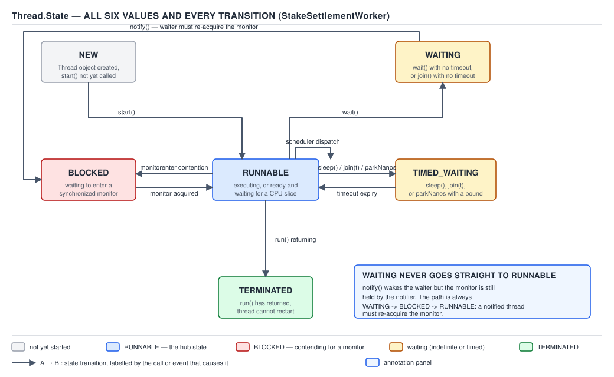
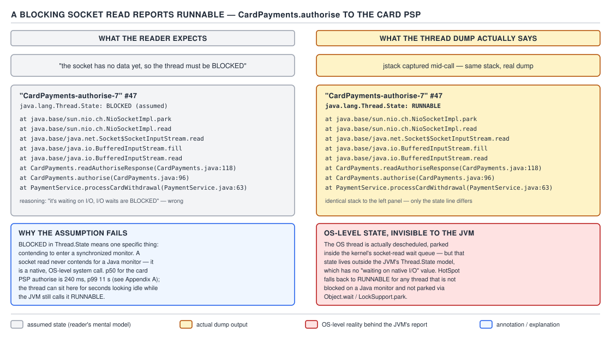
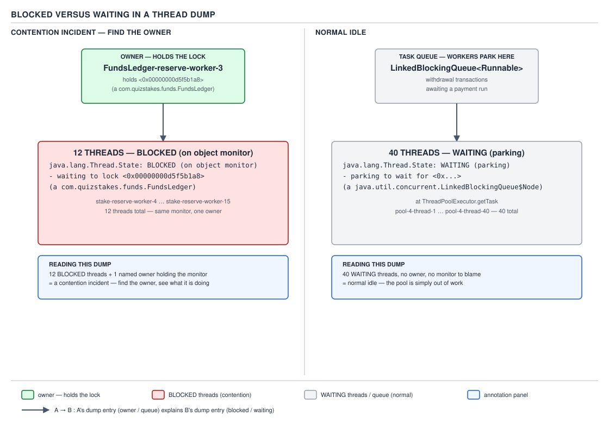

# 05 Multithreading and Concurrency — Threads — BASICS (§1.4)

**Target version: Java 21 LTS.** | **Part 1 of 5** | [Index](../00-index.md)
Previous: [Threads — builder, handlers and removals](01b-basics-thread-api-builder-and-removals.md) · Next: [Threads — interruption and cancellation](03-basics-interruption.md)

## The hierarchy: six states, no more

`Thread.State` is a six-value enum. Every thread that has ever existed is in exactly one of
these six values at every instant an observer samples it:

| State | Meaning | Typical cause |
|---|---|---|
| `NEW` | constructed, `start()` not yet called | object just allocated |
| `RUNNABLE` | executing, or eligible to execute and waiting for a CPU | scheduler dispatch pending, or actually running |
| `BLOCKED` | waiting to *enter* (or re-enter) a `synchronized` monitor | `monitorenter` contention |
| `WAITING` | waiting indefinitely for another thread's action | `Object.wait()`, `Thread.join()`, `LockSupport.park()` |
| `TIMED_WAITING` | waiting, but bounded by a deadline | `sleep`, `wait(t)`, `join(t)`, `parkNanos`, `parkUntil` |
| `TERMINATED` | `run()` returned or threw | thread finished |

There is no seventh value for "actually on a core right now" — that distinction does not exist
in the JVM's model, and it matters enough to earn its own section below.

## The six `Thread.State` values and every transition

Picture a single token moving through a six-room house. The token starts in `NEW`, and every
door out of every other room leads either forward toward `TERMINATED` or into a temporary side
room (`BLOCKED`, `WAITING`, `TIMED_WAITING`) that always leads back to `RUNNABLE`. No room has a
door back to `NEW`, and no room but `RUNNABLE` has a door to `TERMINATED`. That constraint — the
graph is acyclic except through `RUNNABLE` — is the whole shape of thread lifecycle.

Before `Thread.State` existed (`Thread` predates it by nine years — the enum arrived in Java 5
alongside `java.util.concurrent`), the only lifecycle signal was `isAlive()`, a single boolean
that could not distinguish "waiting for a lock", "waiting for a notify", and "actually running".
Debugging a stuck server meant guessing from `isAlive() == true` alone. `Thread.State` exists to
give a thread dump enough resolution to tell those three apart without attaching a debugger.

Reach for `getState()` when you are diagnosing — reading a `jstack` dump, building a monitoring
dashboard, writing a test assertion that a thread reached a particular waiting point. Never reach
for it to *drive* control flow: it is explicitly documented as being for "monitoring purposes
only", not synchronization control, and leaf 1.4.11 below explains exactly why that guarantee
does not hold.

The mechanism: the JVM does not store `Thread.State` as a field that transitions on notify —
it is *computed on demand* from lower-level VM thread status flags (parked, monitor-wait,
condition-wait, blocked-on-monitor) each time `getState()` is called. Every transition below is
triggered by a specific call reaching native code that flips one of those flags.



**D-013** — The six `Thread.State` values and every transition.

Walking the edges in the diagram:

- `NEW` → `RUNNABLE`: `start()`. This is the only door out of `NEW`, and it can only be used
  once — a second call throws `IllegalThreadStateException` (not `IllegalStateException`; that
  mix-up is common enough to be its own pitfall below).
- `RUNNABLE` → `RUNNABLE`: scheduler dispatch and preemption. The OS moves a thread on and off a
  core continuously; none of that motion is visible as a `Thread.State` change, because Java only
  has one bucket for "wants a CPU" and "has one".
- `RUNNABLE` → `BLOCKED`: contention on `monitorenter` — the thread tried to enter a
  `synchronized` block or method and another thread already holds the monitor.
- `BLOCKED` → `RUNNABLE`: the monitor owner releases it (`monitorexit`) and this thread wins the
  race to acquire it.
- `RUNNABLE` → `WAITING`: `Object.wait()` with no timeout, `Thread.join()` with no timeout, or
  `LockSupport.park()`.
- `WAITING` → `BLOCKED` → `RUNNABLE`: this is the edge everyone gets wrong. A thread woken by
  `notify()`/`notifyAll()` does not go straight back to running — `wait()` released the monitor
  on entry, so on wake the thread must **re-acquire** that same monitor before it can return from
  `wait()`. If any other thread holds it at that instant, the woken thread sits in `BLOCKED`,
  contending for the same lock it started in. **A notified thread must re-acquire the monitor.**
- `RUNNABLE` → `TIMED_WAITING`: `sleep(ms)`, `wait(ms)`, `join(ms)`, `parkNanos`, `parkUntil`.
- `TIMED_WAITING` → `RUNNABLE`: either the timeout expires, or (for `wait`/`join`) the same
  notify/re-acquire path as above resolves early.
- `RUNNABLE` → `TERMINATED`: `run()` returns normally or propagates an uncaught exception. This
  is a one-way door — a `TERMINATED` thread can never be started again, `Thread.State` has no
  transition back into any other value from here.

```java
Thread ledgerWriter = new Thread(() -> {
    synchronized (FundsLedger.MONITOR) {
        FundsLedger.appendEntry(reservation);
    }
}, "ledger-writer-07");

System.out.println(ledgerWriter.getState()); // NEW
ledgerWriter.start();
System.out.println(ledgerWriter.getState()); // RUNNABLE (almost certainly)
ledgerWriter.join();
System.out.println(ledgerWriter.getState()); // TERMINATED
```

**Pitfall:** believing a thread pauses in `RUNNABLE` state whenever it "isn't really doing
anything". `RUNNABLE` covers two states real operating systems distinguish — "on a core" and
"in the run queue waiting for one" — and Java deliberately collapses them, because distinguishing
them would require the JVM to track OS scheduler internals it has no portable access to.

**Interview:** "Walk me through what `Thread.State` values exist and how a thread moves between
them." Answer in one breath: six values, a single acyclic graph through `RUNNABLE`, and the
one twist is that waking from `wait()`/`join()` always passes through `BLOCKED` first because the
monitor must be re-acquired.

> **Definition:** `Thread.State` is a computed, six-value classification of what a thread is
> doing right now, transitioning only through `RUNNABLE` and only in the direction of
> `TERMINATED`.

### `NEW` and `TERMINATED` — the two boundary states

`NEW` means the `Thread` object exists but its backing OS thread does not yet — no stack, no
scheduler entry, nothing to interrupt or join. `TERMINATED` means `run()` has returned, whether
normally or via an uncaught exception; the `Thread` object survives (you can still call
`getName()`, `getState()`, `join()` — the last returns immediately), but it can never run again.
**Gotcha:** calling `start()` on a `TERMINATED` thread throws `IllegalThreadStateException`, the
identical exception as calling `start()` twice on the same object — the VM does not distinguish
"never started" from "already finished" when rejecting the second `start()`.

> A `Thread` object outlives its execution: `NEW` and `TERMINATED` bookend a single run, and
> neither door reopens.

### There is no `RUNNING` state

Leaf 1.4.10. There is deliberately no seventh value meaning "on a CPU core at this exact
nanosecond". Java cannot ask this question of the OS scheduler in a portable way, so it doesn't
expose the illusion of an answer. **Gotcha:** code that assumes `RUNNABLE` means "executing right
now" will misdiagnose a busy 8-core box running 40 `RUNNABLE` threads — most of them are sitting
in the OS run queue, not on a core.

> `RUNNABLE` means eligible to run, not running; Java has no API for the narrower question.

### `getState()` is a sampled approximation

Leaf 1.4.11, tagged `[TRAP]` `[SOURCE]`. The javadoc on `Thread.State` states this plainly:

```
This method is designed for use in monitoring of the system state,
not for synchronization control.
```

**Gotcha:** the value returned by `getState()` can be stale before the calling thread even reads
the return — the target thread may have already transitioned twice between the VM computing the
state and the caller branching on it. A pattern like `while (t.getState() != TERMINATED) {}` is a
race, not a synchronization primitive; use `join()` instead, which blocks on the actual VM-level
completion signal rather than polling a snapshot.

> `getState()` reports a best-effort snapshot for humans and dashboards; it is never safe to
> branch program logic on its result.

## A socket read reports `RUNNABLE`

`CardPayments` opens a socket to the PSP (payment service provider) and calls
`SocketInputStream.read()` to wait for the authorisation response. The engineer staring at a
thread dump expects to see that thread `BLOCKED` or `WAITING` — it isn't doing anything, is it?
It reports `RUNNABLE`. Every time. This is the single most common false alarm in production
thread-dump triage, and understanding why it happens is worth more than memorizing the six-state
enum.

Blocking I/O did not exist as a `java.util.concurrent` concept when `Thread.State` was designed —
sockets predate NIO, and a blocking `read()` call descends straight into a native `recv()`
syscall. The JVM's state machine only tracks states it *causes*: monitor contention it arbitrates,
`wait`/`park` queues it manages. A thread stuck inside the kernel waiting on a network packet is
in a state the JVM has zero visibility into — from the JVM's point of view, the thread called a
native method and simply hasn't returned yet. There was never a design decision to hide this; the
JVM genuinely does not have the information to report anything else.

The mechanism: `SocketInputStream.read()` is a native method (a JNI call into platform socket
code). Before entering it, the JVM does not flip any of the low-level status flags that
`getState()` reads — those flags exist only for VM-arbitrated waits (monitors, `Object.wait`,
`LockSupport.park`). A thread parked in a syscall the JVM merely delegated to keeps whatever
status it had on entry, which is `RUNNABLE`, because as far as the JVM's bookkeeping is concerned
the thread is still "in Java code, executing" — it just happens to be blocked one native frame
down, invisible to Java's own scheduler hooks.



**D-014** — A socket read reports RUNNABLE.

```java
public AuthorizationResult authorize(PspAuthRequest request) throws IOException {
    try (Socket pspSocket = new Socket(PSP_HOST, PSP_PORT)) {
        pspSocket.getOutputStream().write(request.encode());
        // This thread can sit here for the PSP's full p99 (11s) with nothing
        // in Java's control. jstack will report it RUNNABLE the entire time.
        byte[] response = pspSocket.getInputStream().readNBytes(RESPONSE_SIZE);
        return AuthorizationResult.decode(response);
    }
}
```

A real dump excerpt for that thread:

```
"card-payments-psp-worker-3" #47 prio=5 os_prio=0 tid=0x00007f... nid=0x2c1a runnable [0x00007f...]
   java.lang.Thread.State: RUNNABLE
        at java.base/sun.nio.ch.SocketDispatcher.read0(Native Method)
        at java.base/sun.nio.ch.SocketDispatcher.read(SocketDispatcher.java:47)
        at java.base/sun.nio.ch.NioSocketImpl.tryRead(NioSocketImpl.java:261)
        at java.base/sun.nio.ch.NioSocketImpl.implRead(NioSocketImpl.java:312)
        at java.base/sun.nio.ch.NioSocketImpl$InputStream.read(NioSocketImpl.java:830)
        at java.base/java.net.Socket$SocketInputStream.read(Socket.java:1099)
        at com.quizstakes.payments.CardPayments.authorize(CardPayments.java:88)
```

`java.lang.Thread.State: RUNNABLE` is what the dump says. What is actually true at the OS level
is the opposite: this thread has been **descheduled by the OS and is invisible to the JVM** —
parked on a kernel wait queue for the PSP's TCP response, consuming no CPU, not even present in
`top -H`'s "running" column at that instant.

**Pitfall:** an engineer sees forty threads `RUNNABLE` and concludes the pool is CPU-bound and
needs more cores. The fix is to cross-reference with OS-level tools — `top -H` per-thread CPU%,
or `jstack` combined with `perf` — before trusting `RUNNABLE` as "consuming CPU". If those forty
threads show near-zero CPU%, they are I/O-blocked, not compute-bound, and the fix is a bigger pool
or a move to virtual threads, not more cores. **Why people believe it:** every other `Thread.State`
value maps intuitively to "what the thread is doing" — `WAITING` really does mean waiting,
`BLOCKED` really does mean blocked — so it's natural to assume `RUNNABLE` means "running", and the
one state that breaks the pattern is exactly the one that bites you at 3 a.m.

**Interview:** "Why does a thread dump show `RUNNABLE` for a thread that's clearly stuck on a slow
network call?" Answer: because blocking socket I/O descends into a native syscall the JVM's state
machine has no visibility into, so it reports the last state it knew about — `RUNNABLE` — rather
than lying about a state it can't observe.

> **Definition:** `RUNNABLE` in a thread dump means "not inside a JVM-arbitrated wait", which
> includes both "actually executing" and "blocked in native I/O the JVM cannot see into" — read
> the stack trace, never the state word alone, to tell them apart.

## `BLOCKED` versus `WAITING` in a dump

Both `BLOCKED` and `WAITING` mean "this thread is not making progress right now", and reading a
dump under pressure it is tempting to treat a wall of either as equally alarming. They are not.
`BLOCKED` means contention — a specific lock, a specific owner, a fix. `WAITING` on a pool queue
means the opposite: the system is healthy and has spare capacity. Mixing them up sends an
on-call engineer chasing a fire that is actually the absence of one, or ignoring a five-alarm
lock convoy because "some threads are just waiting, that's normal".

Before `Thread.State` distinguished them, both cases showed up identically as `isAlive() == true`,
non-responsive. The two-value split exists specifically so a dump can answer "is this contention
or is this idle" without a debugger attached — which is exactly the question an incident responder
needs answered in the first thirty seconds.

`BLOCKED` is emitted only when a thread is stuck at `monitorenter` — trying to acquire a
`synchronized` lock someone else holds — or re-acquiring after `wait()` (the edge from the
lifecycle diagram above). `WAITING` on a thread pool's `getTask()` loop is `LockSupport.park()`
underneath `BlockingQueue.take()`, parked with nothing to dequeue — there is no monitor, no owner,
no contention, just an empty queue and a thread with nothing to do.



**D-015** — BLOCKED versus WAITING in a dump.

Twelve `FundsLedger` writer threads all found the double-entry ledger monitor held by one
misbehaving writer that is itself stuck downstream. A trimmed dump:

```
"ledger-writer-01" #12 prio=5 tid=0x... nid=0x1a01 waiting for monitor entry [0x...]
   java.lang.Thread.State: BLOCKED (on object monitor)
        at com.quizstakes.ledger.FundsLedger.appendEntry(FundsLedger.java:142)
        - waiting to lock <0x00000000d5f5b1a8> (a com.quizstakes.ledger.FundsLedger)
        - locked <0x00000000d5f5b1a8> ... (11 more threads, same lock, same line)

"ledger-writer-00" #11 prio=5 tid=0x... nid=0x1a00 runnable [0x...]
   java.lang.Thread.State: RUNNABLE
        at com.quizstakes.ledger.FundsLedger.appendEntry(FundsLedger.java:150)
        - locked <0x00000000d5f5b1a8> (a com.quizstakes.ledger.FundsLedger)
        at com.quizstakes.ledger.FundsLedger.flushToDisk(FundsLedger.java:203)
```

All twelve `BLOCKED` threads name the same monitor address, `<0x00000000d5f5b1a8>`, and exactly
one thread in the whole dump shows `locked <0x00000000d5f5b1a8>` without a matching "waiting to
lock" line — that is the owner, `ledger-writer-00`, and it is the thread to investigate; it's
stuck in a synchronous disk flush while still holding the lock. Twelve threads `BLOCKED` on one
monitor with a single named owner is a **contention incident — find the owner**.

Contrast with forty pool workers sitting in `getTask()`:

```
"pool-payment-worker-1" #201 prio=5 tid=0x... nid=0x3c9 waiting on condition [0x...]
   java.lang.Thread.State: WAITING (parking)
        at jdk.internal.misc.Unsafe.park(Native Method)
        - parking to wait for <0x00000000e1a2c410> (a java.util.concurrent.SynchronousQueue$TransferStack)
        at java.util.concurrent.locks.LockSupport.park(LockSupport.java:221)
        at java.util.concurrent.SynchronousQueue$TransferStack.awaitFulfill(SynchronousQueue.java:461)
        at java.util.concurrent.SynchronousQueue$TransferStack.transfer(SynchronousQueue.java:362)
        at java.util.concurrent.SynchronousQueue.take(SynchronousQueue.java:913)
        at java.util.concurrent.ThreadPoolExecutor.getTask(ThreadPoolExecutor.java:1062)
        at java.util.concurrent.ThreadPoolExecutor.runWorker(ThreadPoolExecutor.java:1122)
        ... (39 more, identical stack, different park address per queue)
```

Forty threads `WAITING (parking)` in `getTask` with no owner line at all, each parked on its own
queue's internal wait node, no monitor address shared between them — that is **normal idle**, a
pool with more capacity than current load.

The distinguishing signal is mechanical, not judgment: `BLOCKED` dumps carry `waiting to lock
<addr>` paired with a `locked <addr>` line on exactly one other thread; `WAITING` dumps on a pool
carry `parking to wait for <addr>` with no owner line, because there is no lock, only an empty
queue.

**Pitfall:** treating every `WAITING` thread as suspicious because "waiting sounds bad" — a
healthy connection pool, a healthy thread pool, and a healthy producer-consumer queue all spend
most of their life in `WAITING`, and a dump with zero `WAITING` threads on a pool usually means
the pool is saturated, which is the actual problem. **Why people believe it:** `BLOCKED` and
`WAITING` are grammatically close synonyms in English, so it's natural to read them as
severity-equivalent, when in the JVM they encode structurally different situations — one has an
owner to blame, the other doesn't have anyone to blame at all.

**Interview:** "You get paged with a thread dump full of `BLOCKED` threads — what's your first
move?" Answer: grep for `locked <addr>` without a matching `waiting to lock` on that same
thread — that line names the owner, and the owner's own stack trace tells you what it's stuck
doing while holding the lock everyone else needs.

> **Definition:** `BLOCKED` names lock contention with a findable owner; `WAITING` on a pool's
> task queue names idle capacity with no owner to find — the dump tells them apart by whether a
> `locked <addr>` line exists anywhere else in the same dump.

## Virtual-thread states

A virtual thread (Project Loom, finalized in Java 21 by JEP 444) is still a `Thread` object and
still reports one of the same six `Thread.State` values — `getState()` does not gain a seventh
value for virtual threads, because changing that public enum would have broken every dump-parsing
tool in existence. What changes is what each value *costs*. A platform thread `WAITING` on
`LockSupport.park()` occupies a full OS thread — stack, kernel scheduling entry, everything — for
as long as it waits. A virtual thread `WAITING` for the same reason unmounts from its carrier
platform thread entirely: the carrier goes back to the `ForkJoinPool` to run other virtual
threads, and the parked virtual thread's continuation sits on the heap costing nothing but the
few hundred bytes of its stack chunk.

Before virtual threads, "one thread per request" for QuizStakes' 55k peak concurrent sessions was
a non-starter — 55k platform threads at roughly 1 MB of reserved stack each is over 50 GB of
address space before any application logic runs. Virtual threads exist so that "one thread per
request" becomes affordable again: a virtual thread's stack starts at a few hundred bytes and
grows, so 55k of them cost megabytes, not gigabytes, and the six-state model above is what a
developer still debugs them with — no new mental model required, just a cheaper implementation
underneath the same states.

Reach for virtual threads when a task spends most of its time in `WAITING`/`TIMED_WAITING` on I/O
— exactly the `CardPayments` PSP call from the previous section, or a `getTask()` consumer idling
on a queue. Do not reach for them for CPU-bound work: a virtual thread parked mid-computation
still occupies its carrier, because there's no I/O wait to unmount at — a fixed-size platform pool
sized to `cores` is the right tool there, and virtual threads bring no benefit.

The externally visible `Thread.State` is a coarse view. Internally, the JDK's virtual-thread
scheduler tracks a finer state machine — `NEW`, `STARTED`, `RUNNING`, `PARKING`, `PARKED`,
`PINNED`, `YIELDING`, `TERMINATED` — that maps many-to-one onto the six public values (`PARKED`
and `PINNED` both surface as `WAITING` or `TIMED_WAITING` externally, depending on whether a
deadline was given). These internal states are not exposed through `getState()` at all; they are
visible only via `jcmd <pid> Thread.dump_to_file -format=json`, which is JDK internal-diagnostics
territory, not public API — treat the internal state names as informative, not as something to
code against. **Unverified:** the exact JSON field names and full internal-state enumeration in
the current JDK 21 build were not independently re-verified against a live dump for this note;
treat the eight internal-state names above as reported by JEP-era documentation rather than
confirmed against `openjdk/jdk` source for this file.


Reusing D-015's forty-waiter panel: run that same pool on virtual threads instead of platform
threads and the dump looks textually almost identical — forty `WAITING (parking)` frames in
`getTask` — but the resource cost story is completely different underneath: forty parked platform
threads hold forty OS threads hostage; forty parked virtual threads hold zero, because each one
unmounted from its carrier the instant it parked.

```java
ThreadFactory factory = Thread.ofVirtual().name("psp-auth-", 0).factory();
try (ExecutorService pool = Executors.newThreadPerTaskExecutor(factory)) {
    List<Future<AuthorizationResult>> results = pspRequests.stream()
        .map(req -> pool.submit(() -> cardPayments.authorize(req)))
        .toList();
    // Each submitted task gets its own virtual thread. A thread dump mid-flight
    // shows RUNNABLE for the same reason as D-014: readNBytes() is still a
    // native syscall the JVM can't see into, virtual or not.
}
```

**Pitfall:** assuming a virtual thread blocked inside `synchronized` also unmounts cheaply. On
Java 21, entering a `synchronized` block pins the virtual thread to its carrier for the block's
duration — `[VERSION-TRAP]` this is fixed by JEP 491 in Java 24, which removes `synchronized`
pinning entirely, and `-Djdk.tracePinnedThreads` (the Java 21 diagnostic for finding pin sites)
is removed along with the cause. On 21, a `synchronized`-heavy hot path — such as the
`FundsLedger` monitor from the previous section — should move to `ReentrantLock` before adopting
virtual threads at scale, or every contended `synchronized` block becomes a carrier-pinning
bottleneck no different from platform threads.

**Interview:** "Does `Thread.getState()` return something different for a virtual thread?" Answer:
no — same six values, same public contract — what's different is that `WAITING`/`TIMED_WAITING`
for a virtual thread means unmounted from its carrier and parked on the heap, not an OS thread
sitting idle, which is the entire reason virtual threads scale to tens of thousands where platform
threads don't.

> **Definition:** a virtual thread reports the same six `Thread.State` values as a platform
> thread; what changes is that its waiting states are unmounted and free, not an OS thread held
> hostage — with `synchronized` contention on Java 21 as the one gap that still pins.

---

## Pitfalls

### Assuming a second `start()` throws `IllegalStateException`

**Wrong**

```java
Thread settlementWorker = new Thread(() -> QuizEngine.settleStake(reservationId));
settlementWorker.start();
settlementWorker.start(); // engineer expects IllegalStateException
```

Output:

```
Exception in thread "main" java.lang.IllegalThreadStateException
        at java.base/java.lang.Thread.start(Thread.java:1553)
```

**Right**

```java
Thread settlementWorker = new Thread(() -> QuizEngine.settleStake(reservationId));
settlementWorker.start();
if (settlementWorker.getState() == Thread.State.TERMINATED) {
    // build a fresh Thread if you need to run the task again — Thread objects are single-use
}
```

**Why people believe it:** almost every other "called twice, shouldn't be" API in the JDK throws
`IllegalStateException` (e.g. `Iterator.remove()` called twice), so it's a natural pattern-match
that turns out to be wrong for this one historical corner of `Thread`.

### Believing `volatile` "flushes to main memory"

**Wrong**

```java
private volatile boolean depositPosted = false; // "writes go straight to RAM, right?"
```

Reasoning it this way leads to claims like "a `volatile` write is slow because it flushes the
cache to DRAM every time" — which is not how cache-coherent hardware works at all.

**Right:** modern CPUs are already cache-coherent via protocols like MESI; a `volatile` write
does not push data out to DRAM. What it actually does is establish a happens-before edge — the
JIT inserts store/load barriers so that a `volatile` write, plus a subsequent `volatile` read of
the same field by another thread, guarantees the reader observes that write and everything the
writer did before it. The cost is a store-buffer drain and an invalidation of other cores' cached
copies, not a trip to main memory.

**Why people believe it:** "flush to main memory" is the phrasing used in older, pre-JMM-cleanup
explanations and it survives in blog posts because it produces the right intuition (writes become
visible) via the wrong mechanism (a memory-hierarchy flush that doesn't actually happen).

## Cheat sheet

| Question | Answer |
|---|---|
| How many `Thread.State` values exist? | 6: `NEW`, `RUNNABLE`, `BLOCKED`, `WAITING`, `TIMED_WAITING`, `TERMINATED` |
| Only door out of `NEW`? | `start()` — once |
| `RUNNABLE` covers what two real situations? | on a CPU, or in the run queue waiting for one |
| Socket read state in a dump? | `RUNNABLE` — JVM can't see into the native syscall |
| Woken from `wait()`, next state? | `BLOCKED`, to re-acquire the monitor, then `RUNNABLE` |
| `BLOCKED` dump signature | `waiting to lock <addr>` + one thread `locked <addr>` = owner |
| `WAITING` on pool queue signature | `parking to wait for <addr>`, no owner line anywhere |
| Is `getState()` safe to branch on? | No — sampled, documented for monitoring only |
| Virtual thread extra states? | None public; 8 internal states only via `jcmd ... -format=json` |
| Virtual thread `WAITING` cost | unmounted, no OS thread held — except `synchronized` pins on Java 21 |
| `start()` twice throws | `IllegalThreadStateException`, not `IllegalStateException` |

## Self-test

**Q1.** Why does `Thread.State` have no `RUNNING` value?

<details><summary>Answer</summary>

Because Java has no portable way to ask the OS scheduler "is this thread on a core right now" —
`RUNNABLE` deliberately collapses "on a CPU" and "waiting for one" into a single value rather than
pretending to a distinction the JVM cannot observe.

</details>

**Q3.** Why does a notified thread go to `BLOCKED` before `RUNNABLE`?

<details><summary>Answer</summary>

Calling `wait()` releases the monitor on entry. When `notify()`/`notifyAll()` wakes the thread, it
must re-acquire that same monitor before `wait()` can return — if another thread currently holds
it, the woken thread sits in `BLOCKED` contending for it, exactly like any other monitor
contender, before finally reaching `RUNNABLE`.

</details>

**Q4.** A thread dump shows a `CardPayments` worker as `RUNNABLE` with a stack frame in
`SocketInputStream.read`. Is it consuming CPU?

<details><summary>Answer</summary>

Not necessarily, and usually not. `RUNNABLE` here means "not in a JVM-arbitrated wait" — the
thread is blocked inside a native socket-read syscall the JVM cannot see into. Cross-check with
`top -H` per-thread CPU%; a thread stuck on a slow PSP response typically shows near-zero CPU
despite reporting `RUNNABLE`.

</details>

**Q5.** Twelve threads are `BLOCKED` on `<0x00000000d5f5b1a8>` in a `FundsLedger` dump. What's
your next step?

<details><summary>Answer</summary>

Find the one thread in the dump whose stack shows `locked <0x00000000d5f5b1a8>` without a
matching "waiting to lock" line — that thread is the monitor owner. Its own stack trace shows
what it's doing while holding the lock; that is the thing to fix, not the twelve waiters.

</details>

**Q6.** Forty threads are `WAITING` in `getTask()` on a payment worker pool. Is this an incident?

<details><summary>Answer</summary>

No. `WAITING (parking)` with no shared monitor address and no owner line is idle capacity, not
contention — the pool has more threads than current work. Zero `WAITING` threads on that same
pool would be the actual warning sign, indicating saturation.

</details>

**Q7.** Does `getState()` guarantee the returned value is still accurate when the caller uses it?

<details><summary>Answer</summary>

No. The javadoc states the method is for monitoring, not synchronization control, precisely
because the target thread's state can change between the VM computing it and the caller reading
the result. Use `join()`, `CountDownLatch`, or another real synchronizer instead of polling
`getState()` in a loop.

</details>

**Q8.** Does a virtual thread ever show a `Thread.State` value that a platform thread can't?

<details><summary>Answer</summary>

No — both report the same six public `Thread.State` values. The JDK's richer internal
virtual-thread states (`PARKING`, `PARKED`, `PINNED`, `YIELDING`, etc.) exist only in
`jcmd ... Thread.dump_to_file -format=json` output, not through `getState()`.

</details>

**Q9.** On Java 21, does a virtual thread parked in `Object.wait()` inside a `synchronized` block
free its carrier the same way one parked via `ReentrantLock`/`Condition` does?

<details><summary>Answer</summary>

No. On Java 21, `synchronized` pins the virtual thread to its carrier for the duration of the
block, so the wait does not unmount and the carrier is held hostage — the same cost as a platform
thread. `ReentrantLock`-based waiting does unmount cleanly. JEP 491 removes this pinning cause in
Java 24, after which `synchronized` no longer needs the workaround.

</details>

---

**Leaves covered:** 1.4.1–1.4.12 (12 leaves)
**Leaves deferred:** none
**Diagrams included:** D-013, D-014, D-015
**Target version:** Java 21 LTS
**Lines:** 559
