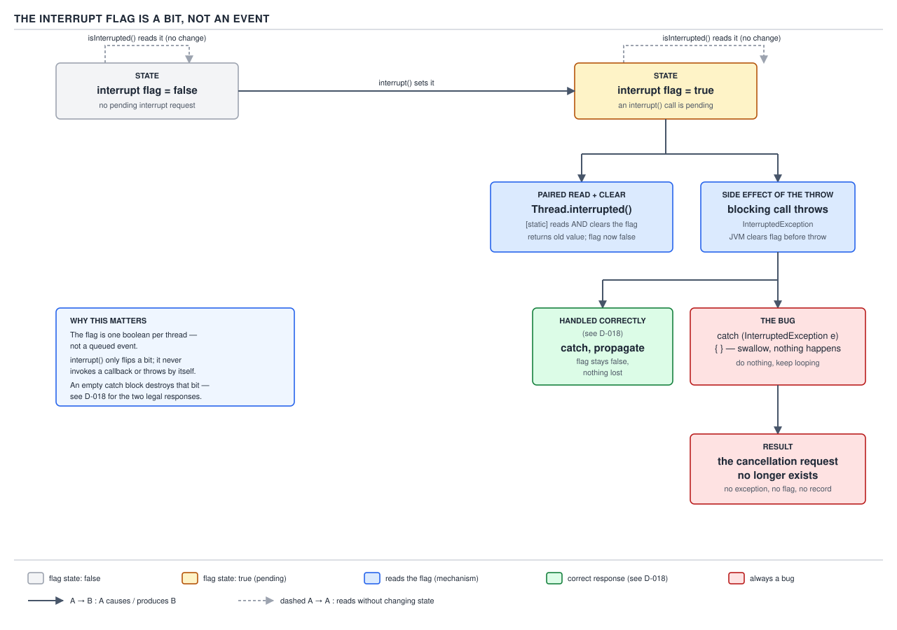
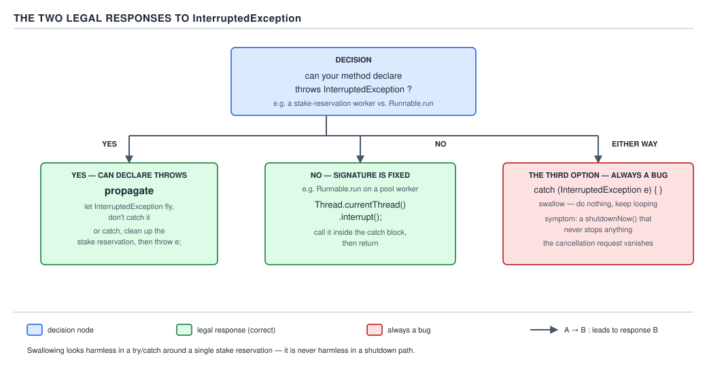

# 05 Multithreading and Concurrency — Threads — BASICS (§1.5)

**Target version: Java 21 LTS.** | **Part 1 of 5** | [Index](../00-index.md)
Previous: [Threads — lifecycle and states](02-basics-lifecycle-and-states.md) · Next: [Thread safety — the vocabulary](../thread-safety/01-basics-vocabulary.md)

Java has no preemptive cancellation. There is no API that reaches into another thread and stops
it — `Thread.stop()` existed once and was **removed** in Java 20, not merely deprecated; calling
it now throws `UnsupportedOperationException`. Everything that looks like cancellation in Java is
built on one primitive: a single boolean per thread, checked cooperatively. This file covers that
primitive, the two legal ways to react to it, the complete map of where the JDK checks it, and the
one blocking call it never checks at all — a socket read — where closing the socket is the only
way out.

### Interruption is a cooperative bit, not an event

A thread cannot be interrupted the way a process can be killed. What actually happens when you
call `t.interrupt()` is almost insultingly small: the JVM sets one bit on `t`'s internal state.
That is the entire mechanism. No stack unwinding happens at that instant, no exception is thrown
at that instant, nothing stops. The bit just becomes `true`, and it is `t`'s own responsibility —
at some point, on its own schedule — to notice.

**Why it exists.** Early threading models (and Java's own `Thread.stop()`) tried the alternative:
force a thread to die immediately, wherever it happened to be. That is unsafe by construction — a
thread forced to stop mid-update can leave a shared object half-mutated, with no chance to release
a lock or restore an invariant. `ReserveStake` on the `QuizEngine` might have debited
`CLIENT_CASH_RESERVED` and not yet credited the reservation record; a forced stop between those two
writes is a permanently unbalanced ledger, and nobody can write a `finally` block to prevent it
because there is no code path to run a `finally` block on. Java's designers deprecated `stop()`,
`suspend()` and `resume()` in 1.2 for exactly this reason, and removed them outright in Java 20.
Interruption replaces "stop it now" with "ask it to notice and stop itself when safe."

**When to reach for it, and when not.** Interruption is the right tool when the target thread is
already blocked inside a JDK method that understands the flag — see the inventory two sections
below — or when it runs a loop that checks the flag between iterations. It is the *wrong* tool
when you need a guaranteed, hard deadline regardless of cooperation: a thread stuck inside a tight
CPU loop with no check, or blocked on a plain socket read, will not respond to `interrupt()` at
all. For those cases you need `Socket.close()` (this file, further down) or you accept that the
thread simply leaks until the JVM exits.

**How it works.** Three methods touch the flag, and they are not interchangeable:

| Method | Effect |
|---|---|
| `t.interrupt()` | Sets `t`'s interrupt flag to `true`. Does nothing else — no exception thrown at the call site or in `t`. |
| `t.isInterrupted()` | Reads the flag on `t`. Does **not** clear it. |
| `Thread.interrupted()` (static) | Reads the flag on **the calling thread** and clears it as a side effect. |

**Pitfall:** confusing the last two. `isInterrupted()` is an instance method you call on some
other `Thread` object to inspect it from outside. `Thread.interrupted()` is a static method that
only ever reports on *whoever is calling it*, and it consumes the flag in the process — call it
twice in a row and the second call returns `false` even though nothing re-interrupted the thread
in between. Code that calls `someThread.interrupted()` compiles (it is a static method invoked
through an instance reference, which Java tolerates) but almost never does what the author meant.

There is a second, sharper way the flag gets cleared, and it is the one that causes real
production bugs: **a blocking method that declares `throws InterruptedException` clears the flag
the instant it throws.** `Thread.sleep`, `Object.wait`, `BlockingQueue.take` — all of them. The
contract is "I turn the pending interrupt into a Java exception for you, and in doing so I consume
the bit that caused it." Work this through on a `ReviewCase` worker:

```java
void processReviewQueue(BlockingQueue<ReviewCase> queue) {
    while (true) {
        ReviewCase reviewCase;
        try {
            reviewCase = queue.take();          // blocks; interrupt() during the block...
        } catch (InterruptedException e) {
            // ...lands here, and the flag is ALREADY false by the time we're in this block.
        }
    }
}
```

At the moment `interrupt()` is called on this thread while it is parked inside `take()`, the JVM
does two things atomically from the caller's point of view: it throws `InterruptedException` out
of `take()`, and it clears the flag. By the time execution reaches the `catch` block,
`Thread.currentThread().isInterrupted()` already reports `false`. If that `catch` block does
nothing further — the classic empty catch — the cancellation request has vanished with no trace:
no exception propagates, no flag survives, no log line fires unless you put one there. The operator
abandoned the `ReviewCase`, `interrupt()` was called exactly once, and the worker thread will loop
straight back into `queue.take()` on the next line as if nothing happened.



**D-016** — The interrupt flag is a bit, not an event.

```java
final class ReviewWorker implements Runnable {

    private final BlockingQueue<ReviewCase> queue;

    ReviewWorker(BlockingQueue<ReviewCase> queue) {
        this.queue = queue;
    }

    @Override
    public void run() {
        while (!Thread.currentThread().isInterrupted()) {
            try {
                ReviewCase reviewCase = queue.take();
                handle(reviewCase);
            } catch (InterruptedException e) {
                Thread.currentThread().interrupt();   // restore what take() consumed
                break;                                 // and actually stop looping
            }
        }
    }

    private void handle(ReviewCase reviewCase) {
        // decide REVIEW_APPROVED / REVIEW_DECLINED for reviewCase
    }
}
```

**Gotcha:** the loop guard `!Thread.currentThread().isInterrupted()` is necessary but not
sufficient. It only protects the *next* iteration. If the interrupt lands while the thread is
already inside `queue.take()`, the guard never gets re-evaluated in time — the `catch` block is
the only place that can react, which is why restoring the flag there, not just breaking, matters:
a caller further up the call stack (an `ExecutorService`, a supervising thread) may also be
checking the flag after this method returns.

> **The interrupt flag is a single boolean per thread. `interrupt()` sets it, `isInterrupted()`
> reads it, `Thread.interrupted()` reads-and-clears it, and any JDK method that throws
> `InterruptedException` clears it as part of throwing — cancellation in Java is a request you can
> silently lose, not an event you can miss.**

### The two legal responses to `InterruptedException`

**Mental model.** Once `InterruptedException` has been thrown at you, you are holding a piece of
information — "someone asked this thread to stop" — that the language has just taken out of the
thread's own flag. You have exactly two honest things you can do with that information: hand it
further up the call stack, or put it back on the flag before you return. Anything else — most
commonly `catch (InterruptedException e) { }` or `catch (InterruptedException e) { log.warn(...); }`
with no rethrow and no flag restore — destroys it.

**Why it exists.** `InterruptedException` is checked, deliberately, so the compiler forces every
caller of `sleep`, `wait`, `take` and friends to make a choice at the point where the information
would otherwise be lost. An unchecked exception could be ignored by omission; a checked one cannot
compile away silently.

**When to reach for which.** Propagate — add `throws InterruptedException` to your own method
signature — whenever your method is free to declare it, which is the common case for anything
called from application code you also control:

```java
Verdict verifyDocuments(ApplicationId id) throws InterruptedException {
    return identityVendorClient.call(id);   // p50 900ms, p99 38s — genuinely worth cancelling
}
```

Restore the flag instead whenever your method signature is fixed by an interface you do not
control — `Runnable.run()`, `Callable`'s loop body when you have already caught it internally,
any framework callback. `Runnable.run()` declares no checked exceptions, so `throws
InterruptedException` will not compile there; `Thread.currentThread().interrupt()` in the `catch`,
followed by returning, is the only honest option.

**How it works — the third branch is always a bug.** A cancellation request that is neither
propagated nor restored simply ceases to exist. This is precisely what makes
`ExecutorService.shutdownNow()` a no-op against badly written tasks: `shutdownNow()` walks its
worker threads and calls `interrupt()` on each one, exactly once per thread, and then returns. If
every task swallows that interrupt in an empty catch, the flag is cleared, the task keeps running,
and the pool never actually shrinks — `shutdownNow()` reports "attempted to stop" and the threads
are still there five minutes later, still burning CPU on identity-vendor calls nobody is waiting
on anymore.



**D-018** — The two legal responses to `InterruptedException`.

**A task you do not own may pass through your code**, and the same rule applies at the boundary:
if a submitted `Callable` calls into a library method of yours that catches `InterruptedException`
internally to do cleanup, that method's `finally` block must restore the flag before returning
control to the executor's worker thread — otherwise the executor's own bookkeeping (which checks
the flag after `run()` returns to decide whether the task was cancelled) sees a clean exit instead
of a cancelled one.

```java
void closeVendorSessionQuietly(Socket vendorSocket) {
    try {
        vendorSocket.getOutputStream().flush();
    } catch (IOException ignored) {
        // fine to ignore — this is best-effort cleanup, not the cancellation signal
    } finally {
        if (Thread.interrupted()) {         // did something already consume our flag upstream?
            Thread.currentThread().interrupt();   // restore it before we hand control back
        }
    }
}
```

**Interview:** "what does `catch (InterruptedException e) {}` actually cost you?" — one sentence:
it silently defeats every cancellation mechanism built on top of the flag, including
`shutdownNow()`, so a pool that "won't shut down" almost always traces back to exactly this line.

**Cancellation policy, one level up.** A task should document *how* it may be cancelled before
anyone calls `interrupt()` on the thread running it, and only the task's owner — the code that
submitted it, or the code that started the raw `Thread` — should ever set that thread's interrupt
status. A `DocumentVerification` worker pool interrupting threads it does not own (say, a shared
HTTP client's internal I/O thread) breaks an invariant the client's authors never agreed to.

**`Future.cancel(boolean mayInterruptIfRunning)`** is where this policy meets the executor API.
`cancel(false)` only prevents a not-yet-started task from starting; it does nothing to a task
already running. `cancel(true)` additionally calls `interrupt()` on the thread running the task —
which accomplishes nothing if that task's body never checks the flag or calls an interruptible
blocking method. A `Future<Verdict>` wrapping `identityVendorClient.call(id)` only actually stops
if the client's I/O path is interruptible; a client built on a plain blocking `Socket.read`
ignores `cancel(true)` completely, which is exactly the case the next section covers.

> **`InterruptedException` gives you two legal moves — rethrow it or restore the flag with
> `Thread.currentThread().interrupt()`. An empty catch block is not a third option; it is a bug
> whose symptom is a `shutdownNow()` that never actually stops anything.**

### The interruptible inventory

**Mental model.** "Interruptible" is not a property of Java in general — it is a property of each
individual blocking method, decided by whoever wrote it. Roughly: anything built on the
JDK's internal `Interruptible` machinery (originally designed for NIO, later reused by
`AbstractQueuedSynchronizer`) checks the flag; anything that ultimately calls down into a
platform-level blocking syscall through old-style blocking I/O does not.

**Why it matters.** Picking a blocking primitive without knowing which bucket it falls in produces
code that looks cancellable and is not. A `ReviewCase` dashboard that calls
`operatorSession.socket().getInputStream().read()` to wait for the next command believes
`interrupt()` will unblock it during a shutdown; it will not.

**When each side wins.** Prefer `Lock.lockInterruptibly()` over plain `lock()` and
`ReentrantLock`/`Condition` over `synchronized`/`Object.wait` specifically because the former stay
interruptible and the latter, once a thread is `BLOCKED` waiting to *acquire* the monitor
(as opposed to already inside a `wait()`), cannot be interrupted out of that acquisition at all —
this is the standing `ReentrantLock`-over-`synchronized` argument for anything that must remain
cancellable under contention.


**D-017** — What is interruptible and what is not.

| Blocking call | On interrupt | Clears flag? | Cancel it instead by |
|---|---|---|---|
| `Object.wait` | throws `InterruptedException` | yes | n/a — already interruptible |
| `Thread.sleep` | throws `InterruptedException` | yes | n/a — already interruptible |
| `Thread.join` | throws `InterruptedException` | yes | n/a — already interruptible |
| `BlockingQueue.put/take` | throws `InterruptedException` | yes | n/a — already interruptible |
| `Lock.lockInterruptibly` | throws `InterruptedException` | yes | n/a — already interruptible |
| `Condition.await` | throws `InterruptedException` | yes | n/a — already interruptible |
| `Semaphore.acquire` | throws `InterruptedException` | yes | n/a — already interruptible |
| `CountDownLatch.await` | throws `InterruptedException` | yes | n/a — already interruptible |
| `CyclicBarrier.await` | throws `InterruptedException`, breaks the barrier for everyone | yes | n/a — already interruptible |
| `Future.get` | throws `InterruptedException` | yes | n/a — already interruptible |
| `LockSupport.park` | returns (no exception) | **no** | re-check condition in a loop after every return |
| `InterruptibleChannel` ops | throws `ClosedByInterruptException`, channel closes itself | yes | n/a — already interruptible |
| `Selector.select` | returns immediately | yes | n/a — already interruptible |
| `synchronized` acquisition (waiting to enter) | ignores | no | avoid contention, or switch to `Lock.lockInterruptibly` |
| `InputStream.read` on a plain socket | ignores | no | `Socket.close()` (next section) |
| `FileChannel` read | ignores on some platforms | no | close the channel; treat as platform-dependent |

**Gotcha, and it is its own leaf because it draws real blood:** `LockSupport.park()` is the odd
row in that table. It is interruptible, but it signals that by *returning normally*, not by
throwing, and it also returns spuriously with no cause at all — the same as `Object.wait`'s
spurious-wakeup contract. A `park()` caller that assumes "I returned, therefore my condition is
true" is wrong twice over: it might be a spurious return, or it might be an interrupt, and `park()`
does not clear the flag on its way out, so the very next line can still observe
`Thread.currentThread().isInterrupted() == true`. The only correct pattern is a loop that re-checks
the actual condition and the flag, never a one-shot `park()` followed by an assumption.

```java
void waitForBonusGrant(AtomicBoolean bonusGranted) {
    while (!bonusGranted.get() && !Thread.currentThread().isInterrupted()) {
        LockSupport.park(this);
    }
}
```

**Interview:** "name three blocking calls interrupt doesn't touch" — `synchronized` block entry,
a plain-socket `InputStream.read`, and (platform-dependent) `FileChannel` reads; the common thread
is that none of them route through `Interruptible`-aware JDK code.

> **A blocking call is interruptible only if its author wired it into the JDK's interrupt
> machinery; `synchronized` acquisition, plain-socket reads, and some `FileChannel` reads never
> were, and no amount of calling `interrupt()` will move them.**

### Cancellation by closing a socket

**Mental model.** When the blocking call itself refuses to notice the flag, stop trying to signal
the thread and instead pull the resource out from under it. A thread parked in
`InputStream.read()` on a `Socket` is not waiting on a Java-level condition at all — it is
parked in a platform `read()` syscall on a file descriptor. Closing that file descriptor from
another thread is not a request; it is the platform itself telling the syscall "this descriptor no
longer refers to anything," and the blocked `read()` returns with an `IOException` (typically
`SocketException: Socket closed`) immediately.

**Why it exists.** There was never going to be a general "cancel this native syscall" API — the
JDK does not control what the OS does with an in-flight blocking read. Closing the descriptor is
the one operation the OS guarantees will unblock it, so it became the idiomatic cancellation path
for classic blocking I/O, long before NIO's `InterruptibleChannel` gave sockets an
interrupt-aware alternative.

**When to reach for it, and when not.** Use `Socket.close()` for any classic (`java.net.Socket`,
not `java.nio.channels.SocketChannel`) blocking read you need to cancel — this is the case for a
hand-rolled connection to the identity vendor opened as a plain socket rather than through
`InterruptibleChannel`-backed NIO. Prefer `SocketChannel` plus `interrupt()` for new code where you
control the transport: `SocketChannel` is itself an `InterruptibleChannel`, so it closes *itself*
automatically when the blocked thread is interrupted and throws `ClosedByInterruptException` — the
same socket-close behaviour, driven by the ordinary flag instead of a second cancellation path.

**How it works.** Picture the `ReviewCase` flow: an operator's dashboard action triggers a call to
`DocumentVerification`, which — for one legacy integration — talks to the identity vendor over a
raw blocking `Socket` rather than an HTTP client, with a p99 of 38 seconds and a 600/min
estate-wide cap that makes leaking connections expensive. If the operator abandons the
`ReviewCase` mid-call, the worker thread is sitting inside `socket.getInputStream().read()`,
which the table above already marks as un-interruptible. The cancelling thread's only lever is the
socket itself:

```java
final class VendorCallHandle {

    private final Socket vendorSocket;

    VendorCallHandle(Socket vendorSocket) {
        this.vendorSocket = vendorSocket;
    }

    /** Called from the thread that owns the ReviewCase lifecycle, not the I/O thread. */
    void cancel() {
        try {
            vendorSocket.close();   // unblocks the read() in the worker thread
        } catch (IOException e) {
            // already closed, or closing failed — either way the worker's read() will surface it
        }
    }
}
```

The worker thread's `read()` call, wherever it is blocked, returns with an `IOException` the
moment `close()` runs on another thread — there is no flag involved, no `InterruptedException`,
and no cooperation required from the loop body at all. This is why "close the socket" is described
as the cancellation mechanism, not merely *a* cancellation mechanism, for un-interruptible socket
reads: it is the only one that works.

**Gotcha:** closing the socket from a second thread while the first thread is mid-`read()` is safe
on every mainstream JVM, but closing it and then immediately reusing the same `Socket` object (or
its file descriptor number, if you are pooling raw descriptors) is not — the pending exception in
the worker thread must be allowed to unwind and clean up state before the connection slot is
considered free again.

> **When a blocking call is not wired into the interrupt machinery, closing the underlying
> resource — not calling `interrupt()` — is the cancellation mechanism; for a plain-socket read,
> that resource is the socket itself.**

### Poison pills, shutdown hooks, and deadlines — the rest of the cancellation toolbox

**Poison pills.** For a producer/consumer `BlockingQueue`, interruption is not the only shutdown
protocol — a producer can enqueue a sentinel value (a poison pill) that means "no more work,
exit," and a consumer that dequeues it stops instead of calling `take()` again. **Gotcha:** every
consumer needs its own pill, or a single pill needs to be re-enqueued by whichever consumer
consumes it, because one pill only ever satisfies one `take()`; a pool of four `ReviewCase`
consumers draining a shared queue needs four pills (or a broadcast mechanism), not one.

> **A poison pill is a shutdown signal carried as ordinary queue data, not as a flag — useful
> exactly when the consumers already speak "take from this queue" and nothing else.**

**Shutdown hooks.** `Runtime.getRuntime().addShutdownHook(new Thread(...))` registers a thread the
JVM starts when it begins an orderly shutdown (normal exit, or `SIGTERM`). All registered hooks
run **concurrently** with each other, in **no guaranteed order**. A `SIGKILL` skips them entirely,
and so does `Runtime.halt()` — `halt()` is documented to bypass hooks specifically so it can be
used *from inside* a hook that has hung, to force the JVM down. See day 06 for the operational
picture of using hooks to drain a `PaymentRun` in flight during a deploy.

> **A shutdown hook is your one chance to react to an orderly JVM exit, with no ordering guarantee
> against other hooks and no chance at all against `SIGKILL` or `Runtime.halt()`.**

**Timeouts as cancellation.** Every blocking call across a service boundary should carry a
deadline — the identity vendor's own p99 is 38 seconds, so a `DocumentVerification` call with no
timeout at all can pin a thread for 38 seconds on a bad day, and worse under estate-wide
degradation. The deadline should be a single absolute point in time computed once at the top of
the request and **propagated** down through every hop (verification, screening, review-queue
lookup), never recomputed as a fresh relative timeout at each hop — a 5-second budget re-applied
at four sequential hops silently becomes a 20-second worst case. See day 10 for deadline
propagation across service boundaries in more depth.

> **A timeout is cancellation without cooperation from anyone downstream — it protects the caller
> even when the callee never checks a flag, provided the same deadline is carried forward rather
> than restarted at each hop.**

## Pitfalls

### Assuming an empty `catch (InterruptedException e) {}` is harmless

**Wrong**

```java
void drainReservationQueue(BlockingQueue<Reservation> queue) {
    while (true) {
        try {
            Reservation r = queue.take();
            settle(r);
        } catch (InterruptedException e) {
            // "it's fine, we'll just try again"
        }
    }
}
```

Calling `interrupt()` on this thread during `shutdownNow()` produces no visible effect at all —
the loop swallows the exception and calls `take()` again on the very next iteration. The pool
never drains.

**Right**

```java
void drainReservationQueue(BlockingQueue<Reservation> queue) {
    while (!Thread.currentThread().isInterrupted()) {
        try {
            Reservation r = queue.take();
            settle(r);
        } catch (InterruptedException e) {
            Thread.currentThread().interrupt();
            return;
        }
    }
}
```

**Why people believe it:** `InterruptedException` reads like any other recoverable checked
exception — the reflex from `IOException` handling is "log it and retry," which is exactly the
wrong instinct for a signal whose entire purpose is "stop."

### Believing `Future.cancel(true)` always stops the task

**Wrong**

```java
Future<Verdict> verdict = executor.submit(() -> {
    while (true) {
        Verdict v = pollLegacyVendorStatus();   // no InterruptedException anywhere in this path
        if (v != null) return v;
    }
});
verdict.cancel(true);   // "that should stop it"
```

`cancel(true)` sets the interrupt flag on the worker thread, but `pollLegacyVendorStatus()` never
checks it and never calls an interruptible method — the loop runs forever regardless.

**Right**

```java
Future<Verdict> verdict = executor.submit(() -> {
    while (!Thread.currentThread().isInterrupted()) {
        Verdict v = pollLegacyVendorStatus();
        if (v != null) return v;
    }
    throw new CancellationException("polling interrupted");
});
verdict.cancel(true);
```

**Why people believe it:** the method name `mayInterruptIfRunning` reads like a guarantee of
effect rather than a description of the mechanism — it describes what `cancel` *attempts*, not
what it *achieves*.

## Cheat sheet

| Fact | Detail |
|---|---|
| `interrupt()` | sets the flag on the target thread; nothing else |
| `isInterrupted()` | instance method, reads, does not clear |
| `Thread.interrupted()` | static, reads **and clears**, always on the caller |
| Throwing `InterruptedException` | clears the flag as part of throwing |
| Two legal responses | propagate (`throws`), or restore (`Thread.currentThread().interrupt()`) |
| Illegal response | swallow with no rethrow and no restore — always a bug |
| Symptom of swallowing | `shutdownNow()` that never actually stops anything |
| Always interruptible | `wait`, `sleep`, `join`, `BlockingQueue.put/take`, `lockInterruptibly`, `Condition.await`, `Semaphore.acquire`, `CountDownLatch.await`, `CyclicBarrier.await`, `Future.get`, `InterruptibleChannel` ops, `Selector.select` |
| Interruptible but returns, doesn't throw | `LockSupport.park` — re-check in a loop, does not clear flag |
| Never interruptible | `synchronized` acquisition, plain-socket `InputStream.read`, some `FileChannel` reads |
| Cancel a socket read | `Socket.close()` from another thread |
| `Future.cancel(false)` | only stops an unstarted task |
| `Future.cancel(true)` | interrupts the running thread; no-op if the task never checks |
| Poison pill | one sentinel per consumer, or a re-enqueuing protocol |
| Shutdown hooks | concurrent, unordered, skipped by `SIGKILL` and `Runtime.halt()` |
| Deadlines | compute once, propagate; never restart the same relative timeout per hop |

## Self-test

**Q1.** Why does an empty `catch (InterruptedException e) {}` block make `shutdownNow()` unable to
stop a worker pool?

<details><summary>Answer</summary>

`shutdownNow()` interrupts each worker thread exactly once. If the task's `catch` block for
`InterruptedException` neither rethrows nor calls `Thread.currentThread().interrupt()`, the flag —
already cleared by the act of throwing — is never set again and no exception propagates. The
thread has no record that a cancellation was ever requested and loops or blocks again as if
nothing happened.

</details>

**Q2.** What is the difference between `t.isInterrupted()` and `Thread.interrupted()`?

<details><summary>Answer</summary>

`t.isInterrupted()` is an instance method that reads (without clearing) the flag on whichever
`Thread` object `t` refers to, and can be called from any thread. `Thread.interrupted()` is
static, always reports on the currently executing thread regardless of what reference it is
called through, and clears the flag as a side effect of reading it.

</details>

**Q3.** A thread is blocked inside `Object.wait()` and another thread calls `interrupt()` on it.
What state is the flag in immediately after the `catch (InterruptedException e)` block is
entered?

<details><summary>Answer</summary>

Already `false`. `wait()` throwing `InterruptedException` clears the flag as part of the throw,
so by the time control reaches the `catch` block there is no trace of the interrupt left unless
the handler explicitly restores it.

</details>

**Q4.** Why can't `interrupt()` unblock a thread waiting to enter a `synchronized` block?

<details><summary>Answer</summary>

A thread in `BLOCKED` state waiting to acquire a monitor is not running interruptible JDK code at
all — it is waiting on the intrinsic lock's own entry set, which was never wired into the
`Interruptible` machinery. `Lock.lockInterruptibly()` on a `ReentrantLock` is the interruptible
substitute for exactly this case.

</details>

**Q5.** A worker thread is blocked in `InputStream.read()` on a plain `Socket` talking to the
identity vendor. How do you cancel it, and why doesn't `interrupt()` work?

<details><summary>Answer</summary>

Call `Socket.close()` from another thread; the platform-level `read()` syscall returns with an
`IOException` as soon as the underlying file descriptor is closed. `interrupt()` doesn't work
because a plain blocking socket read is not interrupt-aware code — it is parked directly in a
native syscall that never checks the Java-level flag.

</details>

**Q6.** What exactly does `Future.cancel(true)` guarantee, and what does it not guarantee?

<details><summary>Answer</summary>

It guarantees that `interrupt()` will be called on the thread currently running the task (and,
separately, that an unstarted task will never start). It does not guarantee the task actually
stops — if the task's body never checks the interrupt flag and never calls an interruptible
blocking method, `cancel(true)` has no observable effect on it at all.

</details>

**Q7.** Why does a producer/consumer pool with four consumers need four poison pills rather than
one?

<details><summary>Answer</summary>

Each pill is ordinary queue data consumed by exactly one `take()` call. A single pill only ever
reaches one consumer, which then exits — the other three consumers block on `take()` forever
because no more work, and no more pills, ever arrive for them.

</details>

**Q8.** Why must a deadline be propagated rather than recomputed as a fresh relative timeout at
each hop in a call chain?

<details><summary>Answer</summary>

A relative timeout re-applied at every hop can add up to far more than the intended budget — a
5-second timeout reapplied across four sequential hops allows up to 20 seconds total even though
the caller only budgeted 5. Propagating a single absolute deadline computed once at the top of the
request bounds the whole chain to the original budget regardless of how many hops it passes
through.

</details>

---

**Leaves covered:** 1.5.1–1.5.14 (14 leaves)
**Leaves deferred:** none
**Diagrams included:** D-016, D-017, D-018
**Target version:** Java 21 LTS
**Lines:** 583
