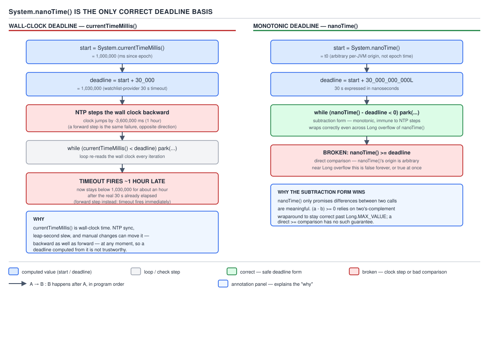

# 05 Multithreading and Concurrency — The concurrency-adjacent utility surface — INTERMEDIATE (§2.13)

**Target version: Java 21 LTS.** | **Part 2 of 5** | [Index](../00-index.md)
Previous: [Testing and verifying concurrent code](../observability/01-testing-and-verifying.md) · Next: [Concurrency beyond one JVM](../beyond-one-jvm/01-distributed-analogues.md)

This file is the odds-and-ends drawer: the APIs that sit next to `java.util.concurrent` rather
than inside its core packages, but that show up constantly in production code and in interviews
— timeouts, thread introspection, the reactive-streams interfaces the JDK ships but almost nobody
calls directly, and the array-level parallel utilities that quietly reach for the common pool.

## `System.nanoTime()` as the only correct deadline basis

**Mental model.** A deadline is not a clock reading, it is a *duration from now*. The moment you
reach for a wall clock to express "30 seconds from now", you have imported every problem a wall
clock has — and a wall clock in a running JVM is not the clock on the wall, it is
`System.currentTimeMillis()`, which the OS is free to step backwards.

**Why it exists.** Every blocking call with a timeout — `Future.get(timeout, unit)`,
`Lock.tryLock(timeout, unit)`, `CountDownLatch.await(timeout, unit)`, a socket read timeout —
needs to answer one question repeatedly: "has the deadline passed yet?" The naive answer is to
capture `System.currentTimeMillis()`, add the timeout, and compare on each iteration.
`ScreeningService`'s call to the watchlist provider (`AA-500 SCREENING_IN_PROGRESS`, 30 s timeout
per the scenario's Appendix A) is exactly this shape: fire the request, and if 30 seconds pass
with no verdict, give up and fail the check into `AA-700 REVIEW_QUEUED` rather than blocking the
activation pipeline forever.

**When to reach for it, and when not.** Always reach for `System.nanoTime()` for elapsed-time and
deadline arithmetic within a single JVM run. Never reach for it to know what time it is — it
carries no relation to wall-clock time and cannot be compared across JVM instances or persisted.
For "what time is it" — logging, audit timestamps, `ApplicationHistory` entries — use
`Instant.now()` or `System.currentTimeMillis()`; those are the right tool for a different job.

**How it works.** `System.nanoTime()` returns a `long` count of nanoseconds from some
arbitrary, JVM-instance-specific origin — not epoch, not boot time, not anything you can look
up. It is documented to be monotonic *within a single JVM invocation* on modern platforms (though
the JLS only promises this "in some" sense across CPU cores under NTP-corrected environments; in
practice on Java 21 / mainstream OSes it is treated as effectively monotonic and this is the
standard basis for timeouts). `System.currentTimeMillis()`, by contrast, reads the system's
wall-clock time, which an NTP daemon can and does step — backwards, if the local clock was
running fast.



**D-140** — `nanoTime` is the only correct deadline basis.

**Pitfall:** a `WatchlistClient` timeout written against `currentTimeMillis()`:

```java
long deadlineMillis = System.currentTimeMillis() + Duration.ofSeconds(30).toMillis();
while (verdict.get() == null) {
    if (System.currentTimeMillis() >= deadlineMillis) {
        throw new ScreeningTimeoutException("watchlist provider exceeded 30s");
    }
    LockSupport.parkNanos(Duration.ofMillis(50).toNanos());
}
```

If NTP steps the clock backwards mid-poll by even a few seconds, `currentTimeMillis() >=
deadlineMillis` stays false far longer than 30 real seconds — the screening check hangs, holding
up the whole `AA-500` → `AA-801` transition, and nothing in the code looks wrong. If the clock
steps *forward* — a laptop resuming from sleep, or a container's clock catching up — the deadline
can appear to have already passed, and the check fails immediately with zero elapsed real time,
declining a legitimate application. Both failures are silent: no exception, no log line
indicating why, because from the code's point of view the arithmetic was correct.

The fix is `System.nanoTime()`, immune to wall-clock adjustment because it never reads the wall
clock:

```java
long deadline = System.nanoTime() + Duration.ofSeconds(30).toNanos();
while (verdict.get() == null) {
    if (System.nanoTime() - deadline >= 0) {
        throw new ScreeningTimeoutException("watchlist provider exceeded 30s");
    }
    LockSupport.parkNanos(Duration.ofMillis(50).toNanos());
}
```

**The overflow argument, worked through.** `nanoTime()`'s origin is arbitrary and its range is a
signed 64-bit `long`, so it can wrap. The naive comparison `System.nanoTime() >= deadline` breaks
exactly at that wraparound: suppose `deadline` was computed near `Long.MAX_VALUE` and the actual
current reading has wrapped around to a small positive value (or a large negative one). As plain
signed longs, `nanoTime()` is now numerically *less* than `deadline`, so `nanoTime() >= deadline`
is `false` — the deadline silently never fires, even though real time has moved well past it.

The subtraction form does not have this problem, because integer subtraction wraps consistently
with two's-complement arithmetic regardless of where the wrap boundary falls. Let `now` and
`deadline` both be `long`s within `2^63` nanoseconds (about 292 years) of each other — a
condition every real timeout satisfies. Then `now - deadline`, computed with wraparound
arithmetic, gives the *true* signed difference between the two instants even if one or both values
have individually wrapped past `Long.MAX_VALUE`/`Long.MIN_VALUE`. Concretely: if `deadline =
Long.MAX_VALUE - 5` and `now = Long.MIN_VALUE + 10` (i.e., real time advanced 16 ns past
`deadline` and wrapped once), then `now - deadline` computed as a 64-bit two's-complement
subtraction yields `16`, correctly positive, so `now - deadline >= 0` correctly reports "deadline
passed". The direct comparison `now >= deadline` instead compares `Long.MIN_VALUE + 10` against
`Long.MAX_VALUE - 5` as ordinary signed values and gets `false` — wrong. This is precisely why
every JDK internal use of `nanoTime()` deadlines (`AbstractQueuedSynchronizer`,
`ScheduledThreadPoolExecutor`) uses the subtraction form, never direct comparison.

**Interview:** "Why not `currentTimeMillis()` for a timeout?" — because it is wall-clock and can
jump; the correct pattern is `System.nanoTime() - deadline >= 0`, monotonic within the JVM and
safe across overflow because subtraction wraps consistently while direct comparison does not.

> `System.nanoTime()` is a JVM-relative, high-resolution elapsed-time source with an arbitrary
> origin; use only its *differences*, and only via subtraction, never via direct comparison,
> when computing a deadline.

## `ThreadMXBean`: the programmatic thread dump

**Mental model.** Everything `jstack` prints, and more, is available as a Java API. `jstack` is
just a client of the same management interface a running application can query about itself.

**Why it exists.** Production incidents need thread state without shelling out to `jstack` —
inside a health-check endpoint, a metrics exporter, or an automated deadlock detector that pages
someone before a human notices `FundsLedger` has stopped processing settlements.

**When to reach for it, and when not.** Reach for it to build programmatic diagnostics: periodic
deadlock scans, CPU-time-per-thread dashboards, an on-demand thread-dump endpoint. Do not reach
for it as a substitute for proper metrics (Micrometer counters, JFR events) on the hot path —
several of its calls carry real per-call cost (below), and polling it every request is the wrong
layer for request-scoped observability.

**How it works.** `ManagementFactory.getThreadMXBean()` returns the singleton bean.
`getThreadInfo(long[] ids, int maxDepth)` returns `ThreadInfo` snapshots with stack traces;
`dumpAllThreads(boolean lockedMonitors, boolean lockedSynchronizers)` is the full-JVM equivalent
of a `jstack` dump. `getThreadCpuTime(long id)` and `getThreadUserTime(long id)` report per-thread
CPU consumption when `isThreadCpuTimeSupported()` is true. Contention accounting —
`getBlockedCount`/`getBlockedTime` and `getWaitedCount`/`getWaitedTime` on a `ThreadInfo` — is
gated behind `setThreadContentionMonitoringEnabled(true)`, off by default.
`findDeadlockedThreads()` walks the lock-owner graph the JVM already tracks and returns thread ids
participating in a cycle — the same graph `jstack` walks to print "Found one Java-level
deadlock".

```java
ThreadMXBean bean = ManagementFactory.getThreadMXBean();
long[] deadlockedIds = bean.findDeadlockedThreads();
if (deadlockedIds != null) {
    ThreadInfo[] infos = bean.getThreadInfo(deadlockedIds, Integer.MAX_VALUE);
    for (ThreadInfo info : infos) {
        log.error("deadlock participant: {} blocked on {}",
                info.getThreadName(), info.getLockName());
    }
}
```

A `FundsLedger` instance running this on a fixed schedule catches the classic two-account
transfer deadlock (two threads locking two client wallets in opposite order) before an operator
has to notice settlements have stalled and go pull a manual `jstack`.

**The gotcha.** `getThreadInfo` without contention monitoring enabled reports `-1` for
blocked/waited counts and times, not zero — a naive dashboard that doesn't check for `-1` reports
"zero contention" on a JVM that never turned monitoring on, which is a different fact entirely.

**Pitfall:** enabling contention monitoring and `getThreadCpuTime` unconditionally in a hot
health-check. Both are gated because they are not free — see the cost breakdown next.

**Interview:** "How do you detect a deadlock without restarting the JVM?" —
`ThreadMXBean.findDeadlockedThreads()`, the same lock-owner cycle detection `jstack` uses,
callable from inside the running process. This connects directly to the deadlock detection
covered in the observability set's [testing and verifying concurrent code](../observability/01-testing-and-verifying.md).

> `ThreadMXBean` is the JMX management interface for the scheduler and lock-owner state the JVM
> already maintains — a programmatic `jstack`, queryable from inside the process it describes.

**The cost of contention monitoring and CPU time — three beats.** Contention monitoring is off
by default because tracking blocked/waited counts and durations requires the JVM to record a
timestamp on every monitor-enter contention event and every `Object.wait`/park return, which adds
measurable overhead under high lock churn — exactly the workloads (a shared `AtomicLong` at 3,400
settlements/sec, or lock-protected wallet buckets under `FundsLedger`) where you would most want
to observe it, and most want to avoid perturbing. `getThreadCpuTime` similarly requires an
OS-level syscall per call (`clock_gettime` with a per-thread clock id on Linux) rather than a
cheap in-JVM counter read, so polling it across hundreds of threads on every request is
measurably more expensive than reading a JFR-derived aggregate. **Pitfall:** flipping
`setThreadContentionMonitoringEnabled(true)` globally in production "just to see" and leaving it
on — the fix is to enable it only for the duration of a targeted diagnostic window, then disable
it.

## Supporting facts

**`TimeUnit`.** The seven enum constants (`NANOSECONDS` through `DAYS`) each carry `sleep`,
`convert`, `toMillis`/`toNanos`/`toSeconds`, `timedWait`, `timedJoin`, plus the Java 9 bridge
`of(ChronoUnit)` / `toChronoUnit()` to interoperate with `java.time`. Gotcha: `convert` and the
`toXxx` methods **saturate** rather than overflow silently — converting a huge `TimeUnit.DAYS`
value to nanoseconds clamps to `Long.MAX_VALUE`/`MIN_VALUE` instead of wrapping, unlike the raw
arithmetic a hand-rolled deadline computation would do.

> `TimeUnit` is a unit-aware wrapper around duration arithmetic and the classic blocking
> primitives, with saturating (not wrapping) overflow behaviour.

**`Duration`-accepting overloads (Java 19).** `Thread.sleep(Duration)`, `Thread.join(Duration)`
and several `Future`-adjacent APIs gained `Duration` overloads in Java 19, preferable to the older
`long millis` / `(long, TimeUnit)` pairs because a `Duration` cannot be mistaken for the wrong
unit at the call site — `Thread.sleep(500)` is ambiguous to a reader without checking the
javadoc, `Thread.sleep(Duration.ofMillis(500))` is not. `[VERSION-TRAP]`: on Java 21 both forms
coexist; code written for Java 8 baselines still uses the `long`/`TimeUnit` forms, and a reader
should not assume `Duration` overloads exist below 19. This mirrors the general shift toward
`java.time` types covered from the arithmetic side in [the deadline-and-timeout leaf above];
see the executor-shutdown handling in guide 03 for `awaitTermination(Duration)` specifically.

> The Java 19 `Duration` overloads are drop-in replacements for the `long`/`TimeUnit` timing APIs
> that remove the unit-mismatch class of bug at the call site.

**`Runtime.availableProcessors`, `addShutdownHook`, `Runtime.halt`.** `availableProcessors()`
returns the JVM's view of usable cores — the number a `ForkJoinPool` or `Executors.newFixedThreadPool`
sizing decision typically starts from, and the number that misleads inside a cgroup-limited
container unless the JVM's container-awareness (default since JDK 10) is confirmed active.
`addShutdownHook(Thread)` registers a thread to run on JVM shutdown (normal exit or signal, not
`kill -9`); `PaymentService` might use one to flush an in-flight `PaymentIntent` audit record.
`Runtime.halt(int)` terminates immediately, skipping shutdown hooks and finalizers — the opposite
of `System.exit`, useful only when a hook is itself hanging and must be bypassed.

> `Runtime` exposes JVM-level knobs — core count, orderly shutdown hooks, and the immediate-halt
> escape hatch that bypasses them.

**`Executors.callable`, `newThreadPerTaskExecutor`, `unconfigurableExecutorService`.**
`Executors.callable(Runnable, T result)` adapts a `Runnable` into a `Callable<T>` for APIs that
only accept the latter. `newThreadPerTaskExecutor(ThreadFactory)` (Java 21) builds an
`ExecutorService` that starts a new thread per submitted task using the given factory — the
standard way to get a virtual-thread-per-task executor when not using
`Executors.newVirtualThreadPerTaskExecutor()` directly, e.g. to supply a custom naming
`ThreadFactory`. `unconfigurableExecutorService` wraps an `ExecutorService` to hide its concrete
type, preventing a caller from downcasting and calling `shutdown()` on a pool it does not own.

> These three are adapter and defensive-wrapping utilities around `ExecutorService` construction,
> not new execution models.

**`CompletableFuture.delayedExecutor`.** `delayedExecutor(long delay, TimeUnit unit)` returns an
`Executor` that runs a submitted task after the given delay, backed by a shared internal
single-thread daemon scheduler (`ForkJoinPool.CompletableFuture$Delayer`) that only ever
schedules the delay itself — actual task execution is handed off to the common pool (or a
caller-supplied executor overload) rather than run on the delayer thread. This makes it a
lightweight "retry the watchlist call in 500ms" primitive without pulling in a full
`ScheduledExecutorService`. Gotcha: it is a shared JVM-wide daemon thread; scheduling a very
large number of delayed tasks contends on the same delay queue.

> `delayedExecutor` gives `CompletableFuture` chains a scheduled-delay stage without requiring a
> dedicated `ScheduledExecutorService`.

**`java.util.concurrent.Flow` (JEP 266, Java 9).** `Flow` defines four nested interfaces —
`Publisher<T>`, `Subscriber<T>`, `Subscription`, and `Processor<T,R>` (a `Subscriber` that is also
a `Publisher`) — implementing the Reactive Streams specification with backpressure via
`Subscription.request(long n)`. `SubmissionPublisher<T>` is the one concrete `Publisher`
implementation the JDK ships. `Flow.defaultBufferSize()` returns **256** — confirmed against the
Java 21 javadoc for `java.util.concurrent.Flow` on `docs.oracle.com`, which documents it as "the
current value returned" for `Publisher`/`Subscriber` buffering in the absence of other
constraints. Almost nobody calls these interfaces directly; Project Reactor, RxJava 3's
interop layer, and Akka Streams all implement or bridge to them so that reactive libraries from
different vendors can be composed without each depending on the others' types.

> `Flow` is the JDK's reactive-streams interface set — a shared contract for backpressured async
> publish/subscribe that library authors implement, not an API application code calls directly.

**`SubmissionPublisher`'s own concurrency.** `SubmissionPublisher<T>` defaults to the
common `ForkJoinPool` for delivering items to subscribers unless a specific `Executor` is
supplied in its constructor, maintains a separate bounded buffer per subscriber (sized by
`Flow.defaultBufferSize()` unless overridden), and offers three submission behaviours depending
on the `offer` overload: `submit` blocks until buffer space is available, while `offer` returns
immediately and either drops the item or invokes a supplied `BiPredicate` drop handler. `[TRAP]`
**Pitfall:** relying on the default common-pool executor inside a request-handling path — if the
common pool is already saturated by other work (parallel streams, `CompletableFuture.supplyAsync`
without an explicit executor), subscriber delivery queues behind unrelated work with no isolation.
The fix is to construct `SubmissionPublisher` with a dedicated executor when delivery latency
matters.

> `SubmissionPublisher` is a ready-made `Flow.Publisher` whose concurrency is common-pool by
> default and per-subscriber-buffered, with three explicit choices for what happens when a
> subscriber falls behind.

**`ReadWriteLock` / `StampedLock.asReadWriteLock()`.** `java.util.concurrent.locks.ReadWriteLock`
is an interface with exactly one JDK implementation, `ReentrantReadWriteLock` — a fact worth
knowing because it means "which `ReadWriteLock`" is rarely a real design question in the JDK
alone. `StampedLock.asReadWriteLock()` (Java 8+) adapts a `StampedLock`'s plain read/write modes
(not its optimistic-read mode) into a second `ReadWriteLock` view, useful only when existing code
already expects the `ReadWriteLock` interface type but the caller wants `StampedLock`'s
non-reentrant, lighter-weight locking underneath.

> Two implementations of one interface exist in the JDK: `ReentrantReadWriteLock` directly, and
> `StampedLock.asReadWriteLock()` as an interface-shaped view over a different lock entirely.

**`Collections.synchronizedXxx`, `newSetFromMap`, `unmodifiableXxx`.** Three wrappers, three
different guarantees, easy to conflate: `synchronizedList`/`synchronizedMap`/etc. wrap every
individual method call in a lock on the wrapper itself but give **no atomicity across calls** — a
check-then-act like `if (!map.containsKey(k)) map.put(k, v)` on a `synchronizedMap` still races.
`newSetFromMap(Map<E,Boolean>)` builds a `Set` backed by a `Map`, inheriting whatever concurrency
guarantees that backing map has — pairing it with a `ConcurrentHashMap` is how
`Collections.newSetFromMap(new ConcurrentHashMap<>())` produces a genuinely concurrent set, the
standard substitute for a "concurrent hash set" the JDK never named directly.
`unmodifiableXxx` adds no concurrency guarantee at all — it only blocks mutation *through the
wrapper*, and a mutation through the original underlying reference still shows through, so it
solves visibility of intent, not thread-safety. This distinction connects to the wrapper-versus-
`java.util.concurrent` collection comparison in guide 02.

> `synchronizedXxx` gives per-call locking without cross-call atomicity; `newSetFromMap` inherits
> its backing map's guarantees; `unmodifiableXxx` blocks writes through itself only — none of the
> three is a substitute for `java.util.concurrent`'s purpose-built concurrent collections.

**`Arrays.parallelSort`, `parallelPrefix`, `setAll`/`parallelSetAll`.** `parallelSort` splits the
array into chunks, sorts each with a fork/join `merge sort` variant, then merges — all on the
**common pool**, the same pool `parallelStream()` and default `CompletableFuture.supplyAsync`
share. `parallelPrefix` computes a running (inclusive) reduction in place, also on the common
pool. `setAll`/`parallelSetAll` fill an array from an index-based generator function, sequentially
or in parallel respectively. `[TRAP]` **Pitfall:** calling `Arrays.parallelSort` on a large batch
— e.g., sorting a day's 2.8M stake-settlement records by timestamp for a reconciliation report —
from inside a request-handling thread pool consumes common-pool worker threads that
`CompletableFuture`-based downstream calls (to `CardPayments`, `BankWithdrawal`) are also relying
on, so a large parallel sort can stall unrelated async completions system-wide. The fix is either
`Arrays.sort` (sequential, no shared-pool contention) for request-scoped work, or routing the
parallel utility's work through a dedicated `ForkJoinPool` via
`ForkJoinPool.submit(() -> Arrays.parallelSort(data))` so it does not compete with default-pool
consumers. This is the same common-pool-starvation hazard covered for parallel streams in guide
04.

> The `Arrays` parallel utilities are convenient fork/join-backed batch operations that silently
> share the JVM-wide common pool — exactly the hazard that makes them a `[TRAP]` next to
> anything else relying on that same pool.

**`Process` / `ProcessHandle.onExit()`.** `ProcessHandle.onExit()` returns a
`CompletableFuture<ProcessHandle>` that completes when the process terminates — `Process.onExit()`
is the analogous method returning `CompletableFuture<Process>`. Both are a clean example of the
async/`CompletableFuture` surface leaking into an API family (process management) that has
nothing else to do with concurrency utilities; a `BankWithdrawal` service shelling out to a
file-transfer utility for a `PaymentRun` file could `.thenAccept` on the exit future rather than
blocking a thread on `Process.waitFor()`.

> `onExit()` returns a `CompletableFuture` completed at process termination — evidence that
> `CompletableFuture` became the JDK's default shape for "notify me when this finishes",
> regardless of what "this" is.

**`Thread.sleep(0)` / `Thread.sleep(1)` and timer-resolution folklore.** `Thread.sleep(0)` is
sometimes invoked purely to force a scheduling yield point, but its actual effect is
platform-dependent and not a documented guarantee — it is not equivalent to `Thread.yield()`.
`[NUM]` On Linux, sleep granularity is bounded below by the scheduler's timer tick — historically
around 1 ms with `CONFIG_HZ=1000`, and coarser (around 4 ms or 10 ms) on older or differently
configured kernels — unless the JVM or application requests high-resolution timers; actual wake
time can overshoot the requested duration by roughly one tick under load. `[TRAP]` **Pitfall:**
treating `Thread.sleep(1)` as "sleep for close to 1ms" in a tight polling loop — on a loaded
system with coarse tick granularity, each call can cost several milliseconds of actual delay,
turning a loop intended to poll frequently into one that silently polls an order of magnitude less
often, exactly the kind of gap that hides a slow-to-appear watchlist verdict for longer than
expected. The fix for genuine short waits is `LockSupport.parkNanos` with an explicit nanosecond
budget and an honest expectation that no OS-level sleep is exact.

> `sleep(0)`/`sleep(1)` are folklore-laden scheduling hints, not precise waits — real granularity
> is bounded by OS timer-tick resolution, order one millisecond on Linux, not a JVM guarantee.

## Pitfalls

### Assuming `currentTimeMillis()` is safe for a 30-second timeout

**Wrong**
```java
long deadlineMillis = System.currentTimeMillis() + 30_000;
while (System.currentTimeMillis() < deadlineMillis) {
    // poll watchlist verdict
}
```
An NTP correction stepping the wall clock backwards mid-poll makes this loop run far longer than
30 real seconds; a forward step makes it exit with zero real elapsed time.

**Right**
```java
long deadline = System.nanoTime() + Duration.ofSeconds(30).toNanos();
while (System.nanoTime() - deadline < 0) {
    // poll watchlist verdict
}
```
`nanoTime()` never reads the wall clock, so it cannot be perturbed by NTP; the subtraction form is
also safe across the rare `long` wraparound the direct comparison is not.

**Why people believe it:** `currentTimeMillis()` is the timestamp everyone already reaches for in
logging and business timestamps, and "add the timeout in millis" reads as obviously correct
arithmetic — the wall-clock hazard only shows up under conditions (NTP correction, clock
virtualization in a container) that most local testing never exercises.

### Assuming `getBlockedTime()` of `0` means no contention

**Wrong**
```java
ThreadInfo info = bean.getThreadInfo(threadId);
boolean contended = info.getBlockedTime() > 0; // looks reasonable
```
Without `setThreadContentionMonitoringEnabled(true)`, `getBlockedTime()` returns `-1`, not `0` —
this check silently reports "no contention" on every JVM that never enabled monitoring.

**Right**
```java
bean.setThreadContentionMonitoringEnabled(true);
ThreadInfo info = bean.getThreadInfo(threadId);
boolean contended = info.getBlockedTime() > 0;
```
Enable monitoring explicitly (accepting its cost) before trusting the value, and treat `-1` as
"unknown", not "zero".

**Why people believe it:** `-1` is an unusual sentinel for a duration field, and most callers
never read the javadoc closely enough to notice it is documented as a distinct return value from
`0`.

## Cheat sheet

| API | One-line fact |
|---|---|
| `System.nanoTime()` | Monotonic, arbitrary origin; deadlines via `nanoTime() - deadline >= 0` only |
| `System.currentTimeMillis()` | Wall clock; can step under NTP; never use for deadlines |
| `TimeUnit` | Unit-aware timing helpers; conversions saturate, don't overflow |
| `Duration` overloads (Java 19) | `Thread.sleep(Duration)` etc.; removes unit-mismatch bugs |
| `ThreadMXBean.findDeadlockedThreads()` | Programmatic `jstack`-style deadlock detection |
| Contention monitoring | Off by default — not free; `-1` means "not measured", not zero |
| `Runtime.availableProcessors()` | Core count; container-aware since JDK 10 |
| `Executors.newThreadPerTaskExecutor` | Java 21; thread-per-task with a custom `ThreadFactory` |
| `CompletableFuture.delayedExecutor` | Lightweight delayed-execution stage; shared daemon delayer |
| `Flow.defaultBufferSize()` | **256** — confirmed, Java 21 javadoc |
| `SubmissionPublisher` | Common-pool by default; per-subscriber buffer; `submit` blocks, `offer` drops |
| `ReadWriteLock` | One JDK impl (`ReentrantReadWriteLock`); `StampedLock.asReadWriteLock()` is a second view |
| `Collections.synchronizedXxx` | Per-call lock only, no cross-call atomicity |
| `Collections.newSetFromMap` | Set backed by a map; inherits the map's concurrency guarantees |
| `Collections.unmodifiableXxx` | Blocks writes through the wrapper only, no thread-safety |
| `Arrays.parallelSort`/`parallelPrefix` | Common-pool fork/join; can starve unrelated async work |
| `ProcessHandle.onExit()` | Returns `CompletableFuture<ProcessHandle>` on process exit |
| `Thread.sleep(0/1)` | Not a yield guarantee; real granularity ~ OS timer tick, ~1ms on Linux |

## Self-test

**Q1.** Why is `System.nanoTime() >= deadline` broken while `System.nanoTime() - deadline >= 0`
is correct, given that `nanoTime()` can wrap around `Long.MAX_VALUE`?

<details><summary>Answer</summary>

Two's-complement subtraction of two `long`s produces the true signed difference between them even
when one has wrapped past `Long.MAX_VALUE`/`Long.MIN_VALUE`, as long as the real difference is
within `2^63` nanoseconds. Direct comparison instead compares the two raw values as ordinary
signed numbers — once one has wrapped and the other has not, the raw ordering no longer reflects
which instant is later, so the comparison silently gives the wrong answer at exactly the wrap
boundary.

</details>

**Q2.** Why should a deadline never be computed from `System.currentTimeMillis()`?

<details><summary>Answer</summary>

`currentTimeMillis()` reads the OS wall clock, which NTP (or a container clock adjustment) can
step backwards or forwards at any time. A deadline computed from it can fire hours late after a
backward step, or immediately after a forward step, with no exception or indication of why.
`nanoTime()` never reads the wall clock, so it is immune to this class of failure.

</details>

**Q3.** What does `ThreadInfo.getBlockedTime()` return when contention monitoring has not been
enabled, and why is that dangerous for a naive check?

<details><summary>Answer</summary>

It returns `-1`, not `0`. A check like `getBlockedTime() > 0` to detect contention will report
"no contention" on any JVM where `setThreadContentionMonitoringEnabled(true)` was never called,
which is the default — silently hiding real contention rather than flagging that it isn't being
measured.

</details>

**Q4.** Why is contention monitoring and `getThreadCpuTime` not enabled by default in the JVM?

<details><summary>Answer</summary>

Both carry real per-call cost: contention monitoring requires timestamping every monitor-contend
and wait/park-return event, adding overhead precisely under the high-lock-churn workloads where
you'd most want to observe it without perturbing it; `getThreadCpuTime` typically requires an
OS-level per-thread clock syscall rather than a cheap in-JVM counter read. Both are opt-in so the
common case pays nothing for diagnostics nobody asked for.

</details>

**Q5.** What is `Flow.defaultBufferSize()` in Java 21, and what is it used for?

<details><summary>Answer</summary>

256. It is the default buffer capacity used by `Publisher`/`Subscriber` implementations (notably
`SubmissionPublisher`) in the absence of a caller-specified buffer size, per the
`java.util.concurrent.Flow` javadoc's documented implementation note.

</details>

**Q6.** What executor does `SubmissionPublisher` use to deliver items to subscribers by default,
and why can that be a problem?

<details><summary>Answer</summary>

The common `ForkJoinPool`, unless a specific `Executor` is passed to its constructor. Because the
common pool is shared with `parallelStream()`, default `CompletableFuture.supplyAsync`, and
`Arrays.parallelSort`, heavy use of any of those can delay subscriber delivery with no isolation
between them — the fix is to construct `SubmissionPublisher` with a dedicated executor when
delivery latency matters.

</details>

**Q7.** Why does `Collections.synchronizedMap` not make `if (!map.containsKey(k)) map.put(k, v)`
atomic?

<details><summary>Answer</summary>

Each individual method call (`containsKey`, then `put`) acquires and releases the wrapper's lock
separately. Between the two calls another thread can acquire the lock and mutate the map, so the
combined check-then-act is not atomic even though each half is individually synchronized. Only
`ConcurrentHashMap`'s atomic compound methods (e.g. `putIfAbsent`) close this gap.

</details>

**Q8.** Why can `Arrays.parallelSort` on a large array cause unrelated `CompletableFuture`
callbacks elsewhere in the same process to stall?

<details><summary>Answer</summary>

`parallelSort` performs its fork/join merge-sort work on the JVM-wide common `ForkJoinPool`, the
same pool `CompletableFuture.supplyAsync` (without an explicit executor) and `parallelStream()`
use by default. A large sort can occupy all common-pool worker threads long enough that unrelated
async completions queued on the same pool are delayed until the sort finishes.

</details>

**Q9.** What is the actual difference in guarantee between `ReentrantReadWriteLock` and
`StampedLock.asReadWriteLock()`, given both implement `ReadWriteLock`?

<details><summary>Answer</summary>

They are different lock implementations exposed through the same interface shape.
`ReentrantReadWriteLock` is reentrant and has its own fairness and upgrade/downgrade rules;
`StampedLock.asReadWriteLock()` is a view over `StampedLock`'s plain (non-optimistic) read/write
modes, which are non-reentrant and lighter-weight. Choosing between them is a choice about the
underlying lock, not about the `ReadWriteLock` interface itself.

</details>

**Q10.** Why is `Thread.sleep(1)` not a reliable way to wait "close to 1 millisecond"?

<details><summary>Answer</summary>

Sleep granularity is bounded below by the OS scheduler's timer tick, which on Linux is on the
order of a millisecond depending on kernel configuration, and actual wake time can overshoot the
requested duration by roughly one tick under load. There is no JVM guarantee of precision at this
scale, so a tight polling loop using `sleep(1)` can end up polling meaningfully less often than
intended.

</details>

---

**Leaves covered:** 2.13.1–2.13.16 (16 leaves)
**Leaves deferred:** none
**Diagrams included:** D-140
**Target version:** Java 21 LTS
**Lines:** 550
