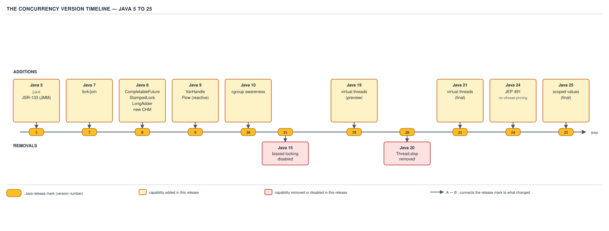

# 05 Multithreading and Concurrency — Version delta, Java 5 to 25 — INTERMEDIATE (§2.15)

**Target version: Java 21 LTS.** | **Part 2 of 5** | [Index](../00-index.md)
Previous: [Concurrency beyond one JVM](../beyond-one-jvm/01-distributed-analogues.md) · Next: [Part 2 interview wrap-up](../91-interview-intermediate.md)

Every other file in this set writes as if Java 21 is the only JDK that exists. That fiction breaks
in an interview the moment someone asks "didn't they change something about virtual threads
recently?" This file is the correction: eighteen years of `java.util.concurrent`, compressed into
one timeline, with the handful of deltas that actually get asked about pulled out for full
treatment.

## The timeline, Java 5 to 14

`java.util.concurrent` did not exist before Java 5. Everything QuizStakes' concurrency code leans
on — `ReentrantLock`, `ConcurrentHashMap`, `AtomicLong`, `ExecutorService` — arrived in one release,
alongside JSR-133, the memory model rewrite that gave `volatile` and `final` their current
happens-before semantics. Doug Lea's `j.u.c` and the JMM rewrite shipped together because the
library needed the memory model to make its lock-free structures legal.



**D-143** — The concurrency version timeline, Java 5 → 25.

The releases from 5 through 14 are supporting facts — no interview asks you to defend a design
choice from 2011 — so they get three beats each, collected in one table rather than nine separate
headings.

| Release | What arrived | Gotcha | One-line definition |
|---|---|---|---|
| **5** (2004) | `j.u.c` (JSR-166): `ExecutorService`, segmented `ConcurrentHashMap`, atomics, `Lock`/`ReentrantLock`, `CountDownLatch`, `CyclicBarrier`, `Semaphore`, `Exchanger`, `BlockingQueue`. JSR-133 rewrote the JMM. | Segmented `ConcurrentHashMap` locks by segment (default 16), not by bin — coarser than the Java 8 rewrite. | The release that made concurrent collections and the JMM as we know them exist. |
| **6** (2006) | `ConcurrentSkipListMap`/`Set`, `Deque`/`BlockingDeque`, `AbstractQueuedLongSynchronizer`, biased locking on by default. | Biased locking was a default optimization most engineers never knew they were relying on — see JEP 374 below. | Incremental collection additions plus a JVM-level locking optimization turned on silently. |
| **7** (2011) | Fork/join (`ForkJoinPool`, `RecursiveTask`), `Phaser`, `LinkedTransferQueue`, `ThreadLocalRandom`, `ConcurrentLinkedDeque`. | `ForkJoinPool.commonPool()` did not exist yet — every fork/join user had to build their own pool. | The divide-and-conquer parallelism model that Java 8's parallel streams sit on top of. |
| **8** (2014) | `CompletableFuture`, `StampedLock`, `LongAdder`/`Striped64`, the rewritten per-bin-locking `ConcurrentHashMap` with treeification, parallel streams, `Arrays.parallelSort`, `ForkJoinPool.commonPool`. | The `ConcurrentHashMap` rewrite is the version almost every blog post describes — the segmented Java 5 map is functionally extinct in production code, but its name still gets quoted in answers. | The release that turned `j.u.c` from "usable" into "the default choice" for high-throughput counters and maps. |
| **9** (2017) | `VarHandle` (JEP 193, replacing most `Unsafe` and `AtomicXxxFieldUpdater` use), `Flow` (JEP 266, the `java.util.concurrent.Flow` reactive-streams interfaces), `Thread.onSpinWait`, `CompletableFuture` timeouts and `copy`/`minimalCompletionStage`, a public `ForkJoinPool` constructor, `ProcessHandle.onExit`. | `Flow` ships only interfaces — `Publisher`, `Subscriber`, `Subscription`, `Processor` — no implementation; you still need Reactor or RxJava to get a working reactive pipeline. | The JDK's answer to "give me a standard vocabulary for reactive streams" without giving you a reactive library. |
| **10–14** (2018–2020) | Cgroup-aware `Runtime.availableProcessors()` (10) — a container capped at 2 CPUs now reports 2, not the host's 32; `ThreadMXBean` refinements; `-XX:+UseBiasedLocking` deprecated (15, listed separately below). | Before 10, a `ForkJoinPool.commonPool()` sized off `availableProcessors()` inside a 2-CPU container would size itself for the host's full core count, then thrash. | The quiet container-awareness era — no new concurrency API, but the number every pool-sizing formula depends on became trustworthy inside a container. |

## Biased locking: deprecated, disabled, gone

**JEP 374** — biased locking deprecated and disabled by default in Java 15.

Picture the JVM's lock word as a hotel room key that, once handed to one guest, stays coded to
that guest even after they walk out and back in — no front-desk trip needed for the *same* guest
to re-enter. That was biased locking: a monitor that observes only one thread ever contends for it
biases its mark word to that thread's ID, so re-entry needs no CAS at all.

It existed because early JVM benchmarks showed the overwhelming majority of locks in real programs
are never actually contended — most `synchronized` blocks in code like `FundsLedger`'s original
Java-6-era reservation path were locked and unlocked by the same request-handling thread over and
over, with no other thread ever touching them. A plain uncontended lock still costs one CAS per
acquire; biasing removed even that.

**When to reach for it:** never — it is a JVM-internal optimization, not something application
code opts into or out of directly. The only decision an engineer made was whether to disable it
early with `-XX:-UseBiasedLocking` on JVMs before 15, which some latency-sensitive shops did once
revocation cost started showing up in profiles.

**How it works, and why it was removed:** biasing costs nothing on the *happy* path, but revoking
a bias — the moment a second thread contends for a lock some other thread biased to itself — is
expensive. Revocation historically required a safepoint: stop every thread in the JVM, walk stacks
to find where the biased lock is held, rewrite the mark word, then resume. As core counts grew and
GC pause targets shrank, a global safepoint triggered by one contended lock in one corner of a
50-thread payment-processing service became an outsized tax. The `ConcurrentHashMap` and
`StampedLock`-based code most of QuizStakes' newer services use is already designed for
contention, so it never gets the biasing win in the first place — the optimization was solving a
problem the modern library had already engineered around.

**A minimal concrete example** — this code compiles and runs identically on every JDK from 6 to
25; the only thing that changed is what's happening under the hood at the `synchronized` line:

```java
public final class SettlementCounter {

    private long settled = 0L;

    public synchronized void recordSettlement() {
        settled++; // one thread, uncontended, biased on 6-14; never biased on 15+
    }

    public synchronized long settled() {
        return settled;
    }
}
```

On Java 6–14 with default flags, the first thread to call `recordSettlement()` biases the monitor
to itself. On Java 15+, every call does a plain CAS-based lock acquire and release — slightly more
work per call, zero safepoint risk from revocation, because there is nothing left to revoke.

**Pitfall:** describing lock escalation as "biased → thin → fat" as if it is still how Java 21+
locks work. It is not: there is no biased state to escalate from. The thin/fat (lightweight monitor
in the lock word / inflated `ObjectMonitor`) distinction survives; biased locking does not.

**Interview:** "walk me through Java's lock escalation" — answer thin-lock-versus-inflated-monitor
for Java 21, then volunteer, unprompted, that biased locking used to sit in front of it and was
removed by JEP 374 in 15. Volunteering the removal is what signals you know the current JVM, not a
decade-old blog post.

> **Definition:** biased locking was a mark-word optimization that let a monitor's sole historical
> owner re-acquire it without a CAS; it was deprecated and disabled by default in JEP 374 (Java 15)
> because safepoint-based revocation cost more, at scale, than the plain CAS it was avoiding.

## Java 16–19: the runway to virtual threads

Three supporting facts bridge Java 15 to the Java 21 LTS everything else in this set targets.

**Java 16–18** hardened `ThreadGroup` toward removal — its bulk-management methods (`enumerate`,
`stop`, `suspend`) started emitting deprecation warnings — and `Thread.suspend`/`resume` were
formally marked deprecated-for-removal, three releases before they actually left. **Gotcha:** a
deprecation-for-removal warning in 17 does not mean the method already throws; `Thread.suspend()`
still worked until 20 (below).

**Java 19 (JEP 425, incubator)** previewed virtual threads for the first time, alongside structured
concurrency (JEP 428, incubator) and small companion APIs: `Future.state()`/`resultNow()`/
`exceptionNow()` for inspecting a completed future without risking a blocking `get()`, and
`ExecutorService extends AutoCloseable` so pools compose with try-with-resources. **Gotcha:**
"incubator" in 19 is a stricter label than "preview" in 21 — incubator modules ship outside
`java.base` behind `--add-modules`, so code written against the 19 incubator API needed source
changes, not just a recompile, to run on the 21 preview.

> **Definition:** Java 19 was the JDK's public first draft of virtual threads — usable enough to
> prototype against, unstable enough that the class names and package shape both changed before
> 21 finalized them.

## Virtual threads: JEP 444, final in Java 21

Picture a scheduler with two layers: a small, fixed pool of OS carrier threads underneath, and an
effectively unbounded pool of cheap, JVM-managed virtual threads on top, each one mounted onto a
carrier only while it has actual CPU work to do, and unmounted the instant it blocks on I/O. A
virtual thread is not a lighter OS thread — it is a `Thread` object whose blocking calls are
intercepted by the JDK and turned into scheduler yields.

**Why it exists:** QuizStakes runs 14k steady, 55k peak concurrent sessions. A thread-per-session
model on platform threads hits a wall around a few thousand threads — each platform thread reserves
roughly a megabyte of stack and costs real kernel scheduling overhead, so 55k of them would exhaust
memory and thrash the OS scheduler long before CPU became the bottleneck. Before virtual threads,
the only way to serve 55k concurrent sessions on a bounded platform-thread pool was to give up the
thread-per-request model entirely and go reactive — non-blocking I/O, callback or `Mono`/`Flux`
chains, and a debugging story where a stack trace no longer shows you the logical request path.

**When to reach for it, and when not:** virtual threads win when the workload is I/O-bound and
currently written as blocking, synchronous code — exactly the shape of a `FundsLedger.reserveStake`
call that waits on a database round trip. They lose when the workload is CPU-bound: pinning 55k
virtual threads onto 8 carrier cores does not create 55k cores' worth of compute, and a
CPU-bound task shows no benefit over a platform-thread pool sized to the core count. They also lose
— on Java 21 specifically — inside a `synchronized` block that blocks, because of the pinning
problem the next section covers; `ReentrantLock` was the Java-21-era workaround.

**How it works:** a virtual thread is scheduled by a `ForkJoinPool` running in FIFO mode, sized by
default to `availableProcessors()` carrier threads. When virtual-thread code calls a blocking
operation the JDK has instrumented — socket I/O, `Files` operations, `BlockingQueue.take()`,
`Object.wait()` — the runtime parks the virtual thread, detaches it from its carrier, and lets the
carrier pick up another virtual thread that is ready to run. The parked virtual thread's stack
lives on the Java heap, not as a fixed OS stack reservation, which is why 55k of them is
affordable where 55k platform threads is not.

**A minimal concrete example:**

```java
try (var executor = Executors.newVirtualThreadPerTaskExecutor()) {
    for (SessionId session : activeSessions()) { // up to 55k at peak
        executor.submit(() -> {
            Reservation reservation = fundsLedger.reserveStake(session.clientId(), stake);
            settlementCounter.recordSettlement(); // 3,400/sec burst across all sessions
            return reservation;
        });
    }
} // executor.close() waits for every submitted task, virtual or not
```

Each `submit()` gets its own virtual thread; the `try`-with-resources block closes the executor,
which blocks until every task completes — the structured-concurrency-lite pattern JEP 444 was
designed to make idiomatic even without the still-preview `StructuredTaskScope`.

**Pitfall:** pooling virtual threads. `Executors.newVirtualThreadPerTaskExecutor()` creates a new
virtual thread per task by design — there is no fixed pool to size, and wrapping virtual threads in
a bounded `ExecutorService` (as if it were a platform-thread pool) throws away the entire point,
which is that creation is cheap enough not to need pooling.

**Interview:** "how would you serve 55k concurrent sessions" — name virtual threads, then
immediately name the one thing they do not fix: CPU-bound work, and thread-local-heavy legacy code
that assumes a small, stable thread count (a `ThreadLocal` per virtual thread at 55k live threads
is 55k `ThreadLocal` instances, not a fixed pool's worth).

> **Definition:** a virtual thread is a `java.lang.Thread` whose blocking operations are
> intercepted by the JVM and turned into non-blocking parks on a small pool of carrier platform
> threads, finalized in Java 21 by JEP 444.

## Java 20 and 22–23: removal and re-preview

**Java 20** removed `Thread.stop()`, `Thread.suspend()`, and `Thread.resume()` outright — they had
been deprecated since Java 1.2 (`stop`) and Java 1.5 (called out for removal), but 20 is the
release where calling any of them stops compiling against the old signatures being merely
"discouraged" and starts throwing `UnsupportedOperationException` at runtime. The same release
re-previewed structured concurrency and scoped values after their Java 19 incubator forms were
withdrawn for redesign. **Gotcha:** code compiled against Java 8 that calls `thread.stop()` still
*compiles* against a 20+ JDK if the class file predates the removal, but the call throws the moment
it executes — this is a runtime break hiding behind a source-compatible signature.

**Java 22–23** re-previewed structured concurrency again (JEP 462, then 480) and scoped values
again (JEP 464, then 481), and deprecated `Unsafe`'s memory-access methods for removal (JEP 471) —
the `getAndAddLong`/`compareAndSwapObject` family that predates `VarHandle` and that some
hand-rolled lock-free counters in older QuizStakes code still called directly instead of going
through `LongAdder`.

> **Definition:** 20 is a removal release (three methods gone for good); 22–23 are preview
> churn — the same two APIs iterating toward the shape they finalize in 24–25.

## JEP 491: synchronized no longer pins, final in Java 24

On Java 21, a virtual thread that blocks *inside a `synchronized` block* does not unmount from its
carrier the way it would blocking on a plain lock or I/O call — it stays pinned, holding the
carrier hostage for the duration of the block. Picture the earlier carrier/virtual-thread picture,
except the trapdoor that lets a blocked virtual thread step off its carrier is nailed shut for as
long as `synchronized` is in scope.

**Why it existed on 21:** the JVM's monitor implementation for `synchronized` predates virtual
threads by two decades and is tied to the OS thread that entered it; unmounting mid-monitor would
have meant either rewriting monitor internals immediately (which JEP 444 chose not to gate final
virtual threads on) or accepting the pin as a known Java-21 limitation, which is exactly the choice
that was made.

**When it bites:** any `synchronized` method or block that also does blocking I/O while holding the
monitor. A `FundsLedger` reservation path written as `synchronized void reserveStake(...)` that
calls out to a database inside the synchronized block pins the carrier for the full round trip —
on Java 21, with 55k virtual threads and only 8 carrier cores, that is enough pinned carriers to
stall the whole pool. The Java-21-era fix was mechanical: replace `synchronized` with
`ReentrantLock`, whose `lock()`/`unlock()` are virtual-thread-aware and do not pin.

**How JEP 491 fixes it in 24:** the JVM's monitor implementation was reworked so entering
`synchronized` no longer requires the virtual thread to stay bound to its carrier while blocked
inside the monitor — the carrier can be released and the virtual thread rescheduled onto another
carrier when it unparks. `-Djdk.tracePinnedThreads`, the Java-21 diagnostic flag for finding
pinning sites, was removed in the same release because there is far less left to trace, and the
`jdk.VirtualThreadPinned` JFR event was broadened to cover the remaining pin causes (native calls,
`Object.wait()` inside `synchronized` in specific patterns).

**A minimal concrete example**, `**[VERSION-TRAP]**` on the fence — true on 21, changed on 24:

```java
// Java 21: this pins the carrier for the whole reservation round trip.
public synchronized Reservation reserveStake(ClientId clientId, Money stake) {
    return ledgerClient.reserve(clientId, stake); // blocking network call, pinned
}

// Java 21 fix: ReentrantLock does not pin.
private final ReentrantLock lock = new ReentrantLock();

public Reservation reserveStakeFixed(ClientId clientId, Money stake) {
    lock.lock();
    try {
        return ledgerClient.reserve(clientId, stake); // unmounts normally
    } finally {
        lock.unlock();
    }
}

// Java 24+: the original synchronized version no longer pins — JEP 491 made
// the fix unnecessary, though ReentrantLock remains correct on every version.
```

**Pitfall:** stating "you should always use `ReentrantLock` over `synchronized` with virtual
threads" as a version-independent rule. It is a Java-21-specific workaround for a problem JEP 491
removed in 24 — `synchronized` is not slower or wrong on 24+, and `ReentrantLock`'s explicit
`unlock()` in a `finally` block is strictly more error-prone than `synchronized`'s automatic
release if you are targeting 24+ only.

**Interview:** "does `synchronized` pin virtual threads?" — the version-scoped answer: yes on 21,
no from 24 onward via JEP 491, and getting that direction backwards (claiming 21 already fixed it,
or that 24 introduced the pinning) is a visible, checkable error.

> **Definition:** JEP 491, delivered as a final feature in JDK 24, removed the carrier-pinning
> behavior of `synchronized` for virtual threads, closing the gap that made `ReentrantLock` a
> mandatory substitute on Java 21.

## Java 25: scoped values final, structured concurrency still preview

Two APIs that are easy to swap in conversation, and swapping them is the mistake this section
exists to prevent.

**JEP 506 — scoped values, final in Java 25.** A scoped value binds an immutable value for the
dynamic extent of a call — every method invoked, directly or transitively, while the binding is
active sees the same value, and the binding is gone the instant the bound block exits. Where a
`ThreadLocal` is a mutable slot a thread owns for its entire lifetime (dangerous with virtual
threads: 55k live `ThreadLocal` slots, easy to leak across pooled reuse), a scoped value is
immutable and scoped to a call tree, which is exactly the shape of "this settlement's
`IdempotencyKey` should be visible to every layer handling this one `reserveStake` call, and to no
other concurrent call."

```java
private static final ScopedValue<IdempotencyKey> CURRENT_KEY = ScopedValue.newInstance();

public Reservation reserveStake(IdempotencyKey key, ClientId clientId, Money stake) {
    return ScopedValue.where(CURRENT_KEY, key)
                       .call(() -> ledgerClient.reserve(clientId, stake));
    // any code called inside .call(...) can read CURRENT_KEY.get();
    // the binding is gone the moment .call(...) returns
}
```

**JEP 505 — structured concurrency, still preview in Java 25 (its fifth preview round, now behind
a `Joiner` API).** Structured concurrency treats a set of subtasks forked from one scope as a
single unit: none of them can outlive the scope that created them, and the scope does not close
until every forked subtask has either completed or been cancelled. **`**Unverified:**` whether the
`Joiner` API's default shutdown-on-failure policy in the fifth preview matches earlier previews'
`ShutdownOnFailure` naming exactly — treat the concept as stable and the exact type names as
subject to change until finalized.**

```java
// --enable-preview required on Java 21 (structured concurrency preview 453)
// and still required on Java 25 (fifth preview, JEP 505).
try (var scope = StructuredTaskScope.open()) {
    var reservation = scope.fork(() -> fundsLedger.reserveStake(clientId, stake));
    var fraudCheck  = scope.fork(() -> screeningService.check(clientId));
    scope.join();
    if (fraudCheck.get().blocked()) {
        throw new RestrictedActionException(clientId);
    }
    return reservation.get();
} // both subtasks are guaranteed finished or cancelled before this line
```

**Pitfall:** treating "scoped values" and "structured concurrency" as a matched pair that shipped
together. They are related — both target the virtual-thread-per-request world, and structured
concurrency scopes are the natural place to bind a scoped value — but they finalized on different
schedules: scoped values final in 25 (JEP 506), structured concurrency still preview in 25 (JEP
505). Calling structured concurrency final because "it's the same JEP family as scoped values" is
the exact error this leaf exists to prevent.

**Interview:** "are scoped values and structured concurrency both stable now?" — no: scoped values,
yes, as of 25; structured concurrency, no, still preview, fifth round. Naming the round number
signals you tracked it rather than guessed.

> **Definition:** a scoped value is an immutable binding visible only within the dynamic scope
> that established it, finalized in Java 25 by JEP 506; structured concurrency treats forked
> subtasks as owned by their creating scope, and remains a preview feature through Java 25 (JEP
> 505).

## Compact object headers: JEP 450 to JEP 519

Every Java object pays a header cost before a single field is stored — historically 12 bytes on a
64-bit JVM with compressed references (8-byte mark word, 4-byte compressed class pointer), rounded
up to a 16-byte object alignment. At 55k peak concurrent sessions, each carrying several small
per-request objects (a `Reservation`, an `IdempotencyKey`, a `Money`), header overhead is not
academic — it is real heap pressure competing with the virtual thread stacks living on that same
heap.

**JEP 450 (Java 24, experimental)** shrank the object header to 8 bytes by compressing the mark
word and class pointer into a single word, behind `-XX:+UnlockExperimentalVMOptions
-XX:+UseCompactObjectHeaders` — off by default, opt-in only. **JEP 519 (Java 25)** delivered the
same mechanism as a production feature; `**Unverified:**` whether it is on by default in 25 or
still requires the flag — the style packet's verified source confirms delivery but not the default
state, so this stays flagged rather than asserted.

**Gotcha:** compact headers force a redesign of how the JVM stores an inflated monitor's
identity — with only 8 bytes and no separate slot for a lock-record pointer once contended, an
inflated `synchronized` monitor's state moves to a side table keyed by object identity instead of
living inline in the header. This is the same monitor subsystem JEP 491 already reworked for
pinning, which is why the two land in the same 24–25 window rather than being unrelated.

> **Definition:** compact object headers shrink the per-object header from 12–16 bytes to 8,
> experimental in Java 24 (JEP 450) and delivered in Java 25 (JEP 519), at the cost of moving
> contended-monitor state out of the header and into a side table.

## The interview rule: state the direction, not just the fact

"Biased locking is gone" is a fact. It tells the interviewer you read a changelog once. "Biased
locking was deprecated and disabled by JEP 374 in Java 15 and is fully removed now, so the
biased-thin-fat lock escalation story you may have read is describing a JVM that no longer exists"
is an answer. It shows you know *when* the change happened, *why* it happened, and — critically —
that you know which older, still-widely-repeated claims it invalidated.

The same pattern applies to every delta in this file: "does `synchronized` pin virtual threads" is
not answered correctly by "no" or "yes" alone — the answer is "yes on 21, no from 24 via JEP 491,"
because a plain yes-or-no gets the direction backwards half the time depending on which release the
interviewer has in mind. **Getting the direction of JEP 491 backwards — claiming Java 21 already
fixed pinning, or that Java 24 introduced it — is a specific, visible error**, not a rounding
error, because it inverts cause and effect in a way that reveals the candidate is pattern-matching
on keywords rather than tracking the actual timeline.

**Interview:** the general-purpose version-delta answer template — "here's the behavior on the LTS
you asked about, here's what changed and in which release, here's why it changed" — works for any
version question this file did not anticipate, because it demonstrates the tracking habit rather
than a memorized fact.

## The deprecation graveyard

**D-144** — The deprecation graveyard.

| API | Deprecated in | Disabled in | Removed in | What happens if you call it today | Replacement |
|---|---|---|---|---|---|
| `Thread.stop()` | 1.2 | — | 20 | `UnsupportedOperationException` | Cooperative cancellation via a flag or `Thread.interrupt()` |
| `Thread.suspend()` | 1.2 | — | 20 | `UnsupportedOperationException` | `ReentrantLock`/`Condition`, or a signaling primitive the target thread checks |
| `Thread.resume()` | 1.2 | — | 20 | `UnsupportedOperationException` | Same as `suspend()` — cooperative signaling |
| `Thread.countStackFrames()` | 1.2 | — | 20 | `UnsupportedOperationException` | `Thread.getStackTrace()` |
| `Thread.destroy()` | 1.5 (never implemented) | — | 20 | `UnsupportedOperationException` (always threw `NoSuchMethodError` before that) | N/A — never had a working replacement need |
| `ThreadGroup` bulk management (`stop`/`suspend`/`resume`/`destroy`) | 16–19, incrementally | — | Not removed; methods degrade to no-ops or throw | Silent no-op or `UnsupportedOperationException` depending on the method | `ExecutorService` for lifecycle management; `Thread.setUncaughtExceptionHandler` for the exception-grouping use case |
| Biased locking (`-XX:+UseBiasedLocking`) | 15 (JEP 374) | 15 (JEP 374, default off) | Not a Java API removal — the flag remains but does nothing meaningful | Flag is accepted but has no effect | None needed — plain CAS-based locking handles it |
| `java.util.Timer` | Not formally deprecated | — | — | Still works, still used | `ScheduledExecutorService` — survives a single task's uncaught exception; `Timer`'s single background thread dies |
| `finalize()`-based executor shutdown | Deprecated 9, for removal 18 | — | Not yet removed (as of 25) | Still works but warns; `finalize()` itself is deprecated for removal JVM-wide | Explicit `shutdown()`/`close()` (`ExecutorService extends AutoCloseable` since 19) |
| `sun.misc.Unsafe` memory-access methods | Warned 23 (JEP 498), for removal since 471 (22) | — | Not yet removed (as of 25) | Runtime warning on first use, still functions | `VarHandle` (JEP 193, since 9) |
| `AtomicXxxFieldUpdater` (`AtomicIntegerFieldUpdater`, etc.) | Soft-deprecated in practice, not formally | — | — | Still works | `VarHandle` field handles — same reflective-offset trick, type-safe API |

## Pitfalls

### Assuming the biased/thin/fat lock story still applies on Java 21+

**Wrong**

```java
// "Java locks escalate biased -> thin -> fat, so an uncontended synchronized
// block on Java 21 starts out biased to the first thread."
public synchronized void recordSettlement() {
    settled++;
}
```

Believing this leads to mis-explaining why a profiler on Java 21 shows a CAS on every acquire of
this method, even single-threaded — there is no bias state left to elide it.

**Right**

State it as two states, not three, for 15+: thin (lock word encodes ownership directly, CAS-based)
and fat (inflated `ObjectMonitor`, used once there's real contention or the thread needs to
`wait()`). No bias step exists in between.

**Why people believe it:** the biased/thin/fat story was accurate and widely taught for a full
decade (6 through 14), and most existing tutorials, StackOverflow answers, and even some textbooks
predate JEP 374 and were never updated.

### Claiming `synchronized` never pins virtual threads

**Wrong**

```java
// "Virtual threads never block a carrier — that's the whole point of them."
public synchronized Reservation reserveStake(ClientId clientId, Money stake) {
    return ledgerClient.reserve(clientId, stake); // network call
}
```

On Java 21 this pins the carrier for the full network round trip — the "virtual threads never
block a carrier" claim is true for ordinary blocking I/O, not for I/O performed while holding a
`synchronized` monitor.

**Right**

On Java 21, replace `synchronized` with `ReentrantLock` for any monitor that wraps blocking work.
On Java 24+, the original `synchronized` version is fine — JEP 491 removed the pin.

**Why people believe it:** virtual-thread marketing material, correctly, emphasizes that blocking
I/O no longer blocks a carrier — but that claim was written with an implicit "except inside
`synchronized`" footnote that gets dropped in casual retellings.

## Cheat sheet

| Release | Headline concurrency change | Status as of 25 |
|---|---|---|
| 5 | `j.u.c` + JSR-133 JMM | Baseline, unchanged since |
| 6 | Biased locking on by default | Removed (disabled by default since 15) |
| 7 | Fork/join | Active, `commonPool` since 8 |
| 8 | `CompletableFuture`, rewritten `ConcurrentHashMap`, `StampedLock`, `LongAdder` | Active, still the modern baseline |
| 9 | `VarHandle`, `Flow` | Active |
| 15 | JEP 374 — biased locking deprecated/disabled | Permanent |
| 19 | Virtual threads + structured concurrency, incubator/preview | Superseded by 21/25 forms |
| 20 | `Thread.stop`/`suspend`/`resume`/`countStackFrames` removed | Permanent |
| 21 | JEP 444 — virtual threads final | Permanent (LTS baseline for this note set) |
| 24 | JEP 491 — `synchronized` no longer pins virtual threads | Permanent |
| 24 | JEP 450 — compact object headers, experimental | Superseded by 25's default form |
| 25 | JEP 506 — scoped values final | Permanent (LTS) |
| 25 | JEP 505 — structured concurrency, 5th preview | Still preview |
| 25 | JEP 519 — compact object headers delivered | Default state unverified |

## Self-test

**Q1.** On Java 21, does a `synchronized` block that performs blocking I/O pin the carrier thread
of a virtual thread executing it?

<details><summary>Answer</summary>

Yes. Java 21's monitor implementation for `synchronized` keeps the virtual thread bound to its
carrier for the duration of the monitor, so any blocking call made while inside it — a network
call to `ledgerClient.reserve(...)`, for example — holds the carrier hostage instead of letting it
serve another virtual thread. JEP 491 removed this pinning behavior in Java 24; on 21, the
workaround is to replace `synchronized` with `ReentrantLock`, whose acquire does not pin.

</details>

**Q2.** What is wrong with saying "Java locks escalate biased → thin → fat" as a description of
Java 21's `synchronized` implementation?

<details><summary>Answer</summary>

Biased locking was deprecated and disabled by default in Java 15 (JEP 374) and there is no biased
state on 15+. Java 21's `synchronized` has two states, not three: thin (lock word directly encodes
ownership via CAS) and fat (an inflated `ObjectMonitor`, used once there's contention or a thread
calls `wait()`). The biased/thin/fat story was accurate for Java 6 through 14 only.

</details>

**Q3.** Are scoped values and structured concurrency both final in Java 25?

<details><summary>Answer</summary>

No. Scoped values are final in Java 25 (JEP 506). Structured concurrency is still in preview in
Java 25 — its fifth preview round (JEP 505), now built around a `Joiner` API. They are related
APIs aimed at the same virtual-thread-per-request world, and structured concurrency scopes are a
natural place to bind scoped values, but they did not finalize on the same schedule.

</details>

**Q4.** What actually happens if code compiled years ago calls `Thread.stop()` on a Java 20+
runtime?

<details><summary>Answer</summary>

It throws `UnsupportedOperationException` at the call site, at runtime. The class file itself
still loads and links fine — the method signature still exists — but Java 20 removed the working
implementation, so the source-compatible call becomes a runtime failure rather than a compile-time
one. The same applies to `suspend()`, `resume()`, and `countStackFrames()`.

</details>

**Q5.** Why did biased locking get removed instead of just left on as a default?

<details><summary>Answer</summary>

Revoking a bias — when a second thread contends for a lock biased to a different thread — required
a global safepoint to stop every JVM thread and rewrite the mark word. As core counts grew and
pause-time budgets shrank, one contended lock anywhere in the process could trigger a full-JVM
pause. Modern high-throughput code (`ConcurrentHashMap`, `StampedLock`-based structures) is also
already designed for contention, so it rarely benefited from biasing to begin with — the
optimization's cost grew while its benefit shrank.

</details>

**Q6.** What's the difference between a `ThreadLocal` and a scoped value (JEP 506), and why does
that difference matter more with virtual threads than it did with platform threads?

<details><summary>Answer</summary>

A `ThreadLocal` is a mutable slot bound for the entire lifetime of the thread that set it and must
be explicitly removed to avoid leaking, especially dangerous when a thread is reused from a pool.
A scoped value is immutable and bound only for the dynamic extent of the block that establishes it
via `ScopedValue.where(...).call(...)` — it is automatically unbound when that block exits. With
platform threads pooled in the hundreds, a leaked `ThreadLocal` is a bounded problem; with 55k live
virtual threads, each potentially short-lived and never pooled the same way, a per-thread mutable
slot pattern scales far worse than a call-scoped immutable binding.

</details>

**Q7.** A candidate says "Java 24 introduced synchronized pinning virtual threads, and it was a
regression." What is wrong with this statement?

<details><summary>Answer</summary>

It inverts the actual direction of the change. Pinning was present starting in Java 21, when
virtual threads first became final — it was a known limitation of the initial monitor
implementation, not something introduced later. JEP 491, delivered in Java 24, removed the
pinning behavior; it is the fix, not the cause. Stating the direction backwards is exactly the
error this file's interview rule (§2.15.15) calls out as a visible, checkable mistake.

</details>

**Q8.** Why does `AtomicIntegerFieldUpdater` count as effectively deprecated even though the
javadoc doesn't carry a formal `@Deprecated` annotation?

<details><summary>Answer</summary>

`VarHandle`, introduced in Java 9 (JEP 193), does everything the field updaters do — reflective,
offset-based atomic access to a volatile field — with a type-safe API and better performance
characteristics, and it is the API the JDK's own internals migrated to. The field updaters remain
technically supported for backward compatibility, but new code has no reason to reach for them,
which is the practical meaning of "soft-deprecated": no compiler warning, but no justification to
use it either.

</details>

## Open questions

- **Unverified:** whether structured concurrency's fifth-preview `Joiner` API in Java 25 (JEP 505)
  exposes a `ShutdownOnFailure`-named policy identical to earlier preview rounds, or whether the
  naming changed along with the `Joiner` redesign. Treat the concept — subtasks owned by a scope
  that does not close until all are done — as stable; treat exact type names as subject to change
  until the feature finalizes.
- **Unverified:** whether JEP 519's compact object headers are on by default in Java 25 or still
  require `-XX:+UseCompactObjectHeaders`. The verified source for this file confirms delivery as a
  production (non-experimental) feature but does not confirm the default flag state.

---

**Leaves covered:** 2.15.1–2.15.16 (16 leaves)
**Leaves deferred:** none
**Diagrams included:** D-143, D-144
**Target version:** Java 21 LTS
**Lines:** 595
