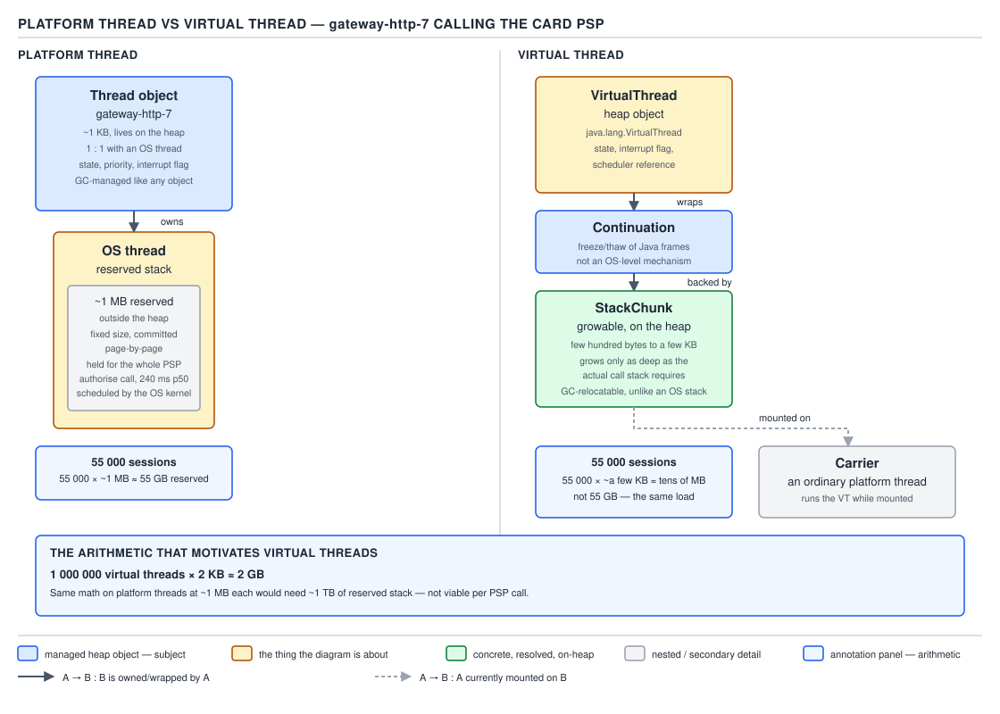
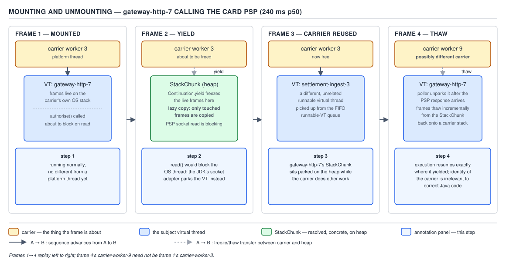
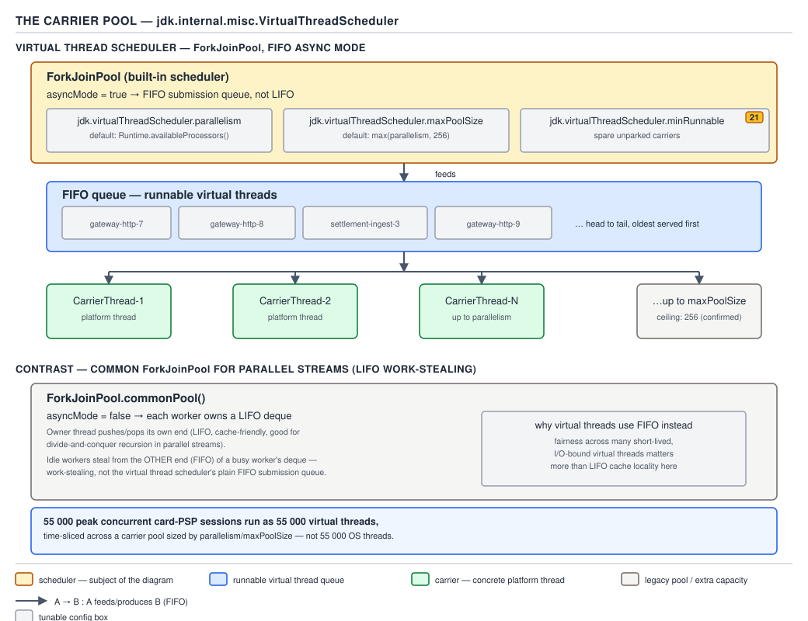
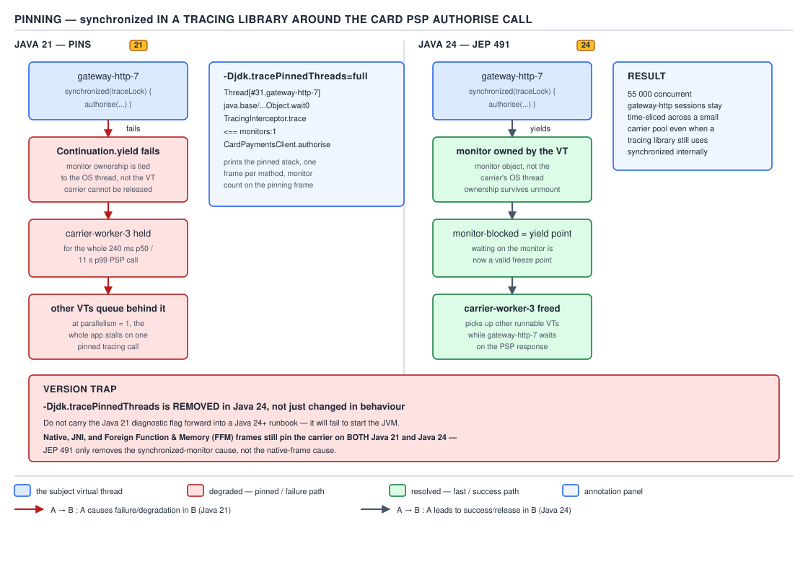
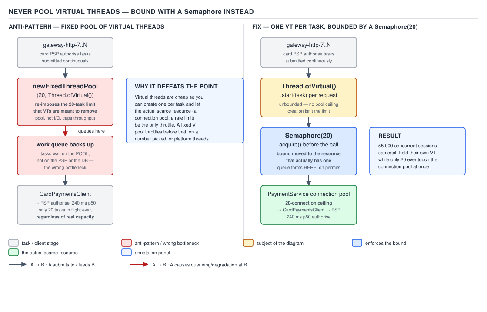

# 05 Multithreading and Concurrency — Virtual threads — BASICS (§1.24)

**Target version: Java 21 LTS.** | **Part 1 of 5** | [Index](../00-index.md)
Previous: [ThreadLocal](../thread-local/01-basics.md) · Next: [Structured concurrency and scoped values](../structured-concurrency/01-basics.md)

A virtual thread (JEP 444, final in Java 21) is a `java.lang.Thread` whose call
stack lives on the heap as a **continuation**, scheduled onto a small pool of
**carrier** platform threads instead of owning an OS thread for its lifetime.
Before any mechanism, the map:

| | Platform thread | Virtual thread |
|---|---|---|
| Backed by | 1 OS thread, always | A continuation, mounted onto a carrier only while running |
| Stack location | Native memory, fixed size (~1 MB reserved) | Heap, starts at a few hundred bytes, grows on demand |
| Created by | `new Thread()`, `Executors.newFixedThreadPool` | `Thread.ofVirtual()`, `Executors.newVirtualThreadPerTaskExecutor()` |
| Scheduled by | The OS | The JVM, onto a `ForkJoinPool` of carriers |
| Sensible count | Hundreds to low thousands | Hundreds of thousands to millions |
| `setPriority`, `setDaemon(false)`, `stackSize` | Honoured | No-ops / throw — see leaf 1.24.15 below |



**D-095** — Platform thread versus virtual thread.

## Scale, not speed

**Mental model.** A platform thread is a lane on a highway: a fixed number
of lanes exist, and every car (task) occupies a whole lane whether moving or
parked waiting for something. A virtual thread is a passenger, not a lane —
the JVM only needs a lane for a passenger while they are actually driving;
the moment they wait on a network call, they get out and free the lane. A
stadium full of waiting passengers can share eight lanes.

**Why it exists.** Thread-per-request — one platform thread per inbound
request, blocking synchronously downstream — is the easiest model to write
and stack-trace, but it stops scaling once downstream latency (a PSP
authorise at p99 11 s) times target concurrency exceeds the platform threads
the OS can schedule cheaply. The pre-Loom fix was async/reactive
(`CompletableFuture`, Reactor, Netty callbacks), which scales but fragments
the call stack across callbacks and breaks `ThreadLocal`-based context.
Virtual threads give the scaling property back to thread-per-task without
that rewrite.

**When to reach for it, and when not.** Reach for it on high-fan-out,
I/O-bound handlers — a request that calls the card PSP, the ledger, and a
screening provider sequentially. Do **not** reach for it on CPU-bound work
(a ninth core does not appear; a settlement-batch recompute saturates the
same `availableProcessors()` carriers either way), on code already built on
non-blocking I/O (the mount/unmount layer adds overhead for no gain), or as
a substitute for capacity planning downstream — see the downstream-pressure
shift below.

**How it works.** `Thread.ofVirtual().start(task)` or
`Executors.newVirtualThreadPerTaskExecutor()` create a `VirtualThread`, an
internal `jdk.internal.vm.Continuation` wrapping the task. It has no OS thread
until scheduled; scheduling and the carrier pool are covered as their own
primary concepts below.

**Concrete example** — issuing 55,000 concurrent card-PSP authorise calls
without a platform-thread-per-session model:

```java
try (var executor = Executors.newVirtualThreadPerTaskExecutor()) {
    List<Future<AuthoriseResult>> pending = pendingSessions.stream()
        .map(session -> executor.submit(() -> cardPayments.authorise(
            session.accountId(), session.stakeAmount())))
        .toList();

    for (Future<AuthoriseResult> future : pending) {
        AuthoriseResult result = future.get(); // blocks this virtual thread only
        ledger.record(result);
    }
}
```

Each `authorise` call blocks on the PSP round trip (240 ms p50, 11 s p99).
With platform threads, 55,000 concurrent sessions need 55,000 platform
threads to avoid queuing — impossible. With virtual threads, all 55,000 run
concurrently while only `availableProcessors()` carriers (say 8) are ever
mounted at once, because a blocked virtual thread unmounts and frees its
carrier.

**The gotcha.** Nothing here made any single PSP call faster — 240 ms stays
240 ms per session. `**Insight:**` the win is entirely in *removing the
thread as the scarce resource that gated concurrency*; throughput improves
only when the previous bottleneck actually was thread count on blocking
work, not the downstream system itself.

**[PROVE] [NUM] The 55k-session arithmetic, both ways.**

Platform-thread model: 55,000 sessions × ~1 MB reserved stack ≈ **54 GB** of
address space for stacks alone, before OS kernel bookkeeping and context
switching between 55,000 threads. No commodity JVM runs 55,000 live platform
threads; the honest design caps concurrent sessions at pool size and queues
or rejects the rest — the 55k peak is simply never served concurrently.

Virtual-thread model (leaf 1.24.16): a generous 1 KB average footprint ×
55,000 ≈ **55 MB** of heap — three orders of magnitude less, competing for
heap (already sized for the JVM) rather than a hard OS-thread ceiling. One
million virtual threads is a routine JEP 444 benchmark; ten thousand
platform threads is already outside normal range on commodity hardware.

Little's law confirms it independently (leaf 1.24.19, `[PROVE]`): concurrency
= throughput × latency. At 1,200 stake reservations/sec and the PSP's 240 ms
p50: 1,200 × 0.240 = **288** concurrent calls. At the 11 s p99, same arrival
rate: 1,200 × 11 = **13,200** concurrent calls — the regime where a
platform-thread pool would need 13,200 live OS threads to avoid queuing
behind the tail, and where virtual threads are the only model that absorbs
it without rejecting load or an unbounded queue.

> **Definition.** A virtual thread is a `Thread` scheduled by the JVM onto a
> small carrier pool rather than by the OS onto a core; it changes how many
> concurrent blocking tasks you can afford, not how fast any one of them runs.

## Mounting and unmounting

**Mental model.** A carrier platform thread is a single desk shared by many
virtual-thread "workers" in a call centre. A worker sits down (mounts) to do
CPU work, and the instant they go on hold with the PSP (a blocking call),
they get up, take their notepad — their stack frames — and free the desk for
the next worker; when the PSP calls back they queue for any free desk and
resume exactly where they left off.

**Why it exists.** Without unmounting, a blocked virtual thread would hold
its carrier idle exactly like a blocked platform thread, collapsing the
scale argument above. Unmounting is what lets thousands of blocked virtual
threads coexist on a handful of carriers.

**When it happens, and when it does not.** Unmounting only happens at
**instrumented** blocking points: `BlockingQueue` operations, `LockSupport.park`,
`ReentrantLock` acquisition, NIO-backed socket and file I/O, `Thread.sleep`,
`Future.get`, and (from Java 24 onward) `Object.wait`. A call that blocks
through a mechanism the JVM has *not* instrumented — a `synchronized` block, a
native/JNI call, or blocking I/O routed through a non-NIO legacy path — does
not unmount; it pins the carrier instead (covered as its own primary concept
below).

**[PROVE] How it works.** At a blocking point the JVM captures the virtual
thread's Java call stack frames into its `Continuation` object on the heap,
detaches it, and returns the carrier to the scheduler's run queue. When the
blocking operation completes (I/O ready, lock acquired, timer elapsed), the
virtual thread is marked runnable and mounted onto *some* free carrier — not
necessarily the same one — restoring its frames before resuming bytecode
exactly where it unmounted. This is why a profiler can see a virtual
thread's carrier identity change across one logical task's lifetime.



**D-096** — Mounting and unmounting, across a card-PSP call at 240 ms p50:
frame 1 mounts and issues the authorise request; frame 2 unmounts at the NIO
socket read and the carrier is freed; frame 3 shows the carrier serving a
different virtual thread during the 240 ms wait; frame 4 remounts the
original virtual thread on a (possibly different) carrier once the PSP
response arrives.

**Concrete example:**

```java
Thread.ofVirtual().name("psp-authorise-").start(() -> {
    log.info("mounted, calling PSP");                    // running
    AuthoriseResult result = cardPayments.authorise(      // NIO call — unmounts
        accountId, stakeAmount);                          // here, carrier freed
    log.info("remounted, PSP responded: {}", result);     // resumed, maybe on
});                                                        // a different carrier
```

**The gotcha.** Mounting and unmounting are not free — each is real work
(stack copy, scheduler bookkeeping) — but it is orders of magnitude cheaper
than an OS context switch between platform threads, because it never crosses
into kernel mode. Treat this as an order-of-magnitude claim, not a measured
constant: no authoritative per-instruction cost table exists.

> **Definition.** Mounting attaches a virtual thread's continuation to a
> carrier platform thread to run bytecode; unmounting detaches it at an
> instrumented blocking point and frees the carrier for other work.

## The carrier pool

**Mental model.** The carrier pool is a small, fixed crew of workers
(platform threads) processing a shared, ordered in-tray of runnable virtual
threads — not a pool you submit tasks to directly.

**Why it exists.** Virtual threads need something to execute bytecode on;
the carrier pool is that substrate, sized to cores, not to logical tasks.

**When to tune it.** Almost never for parallelism — default parallelism
already tracks `availableProcessors()`. Tune `maxPoolSize` upward only if
profiling shows carrier starvation from pinning that cannot be removed
immediately (a stopgap, not a fix — see the pinning section below).

**[RESEARCH] [NUM] How it works.** The default scheduler is a dedicated
`ForkJoinPool` in **FIFO / async mode**, not the default work-stealing LIFO
mode — fairness across many short waits matters more here than locality.
Verified against `VirtualThread.java` in `openjdk/jdk` at `jdk-21-ga`:

```java
parallelism = Runtime.getRuntime().availableProcessors();   // unless overridden
maxPoolSize = Integer.max(parallelism, 256);                // unless overridden
minRunnable = Integer.max(parallelism / 2, 1);              // unless overridden
boolean asyncMode = true; // FIFO
```

Three system properties, read once at scheduler creation:
`jdk.virtualThreadScheduler.parallelism` (default `availableProcessors()`),
`jdk.virtualThreadScheduler.maxPoolSize` (default `max(parallelism, 256)`),
and `jdk.virtualThreadScheduler.minRunnable` (default `max(parallelism/2, 1)`,
the threshold for spinning up extra carriers). `maxPoolSize` is a release
valve for pinning: extra carriers let unrelated virtual threads keep
progressing while some are stuck pinned.



**D-097** — The carrier pool: the `ForkJoinPool` in FIFO async mode, default
parallelism = `availableProcessors()`, and the three `jdk.virtualThreadScheduler.*`
properties that shape it.

**The gotcha.** Because parallelism defaults to core count, a service that
moves from a 200-platform-thread pool to virtual threads does not gain any
CPU-bound throughput — the same 8 cores execute the same instructions per
second. What changes is how many *waiting* tasks can queue behind those 8
cores without each one costing a platform thread.

> **Definition.** The carrier pool is a `ForkJoinPool`, FIFO/async by
> default, sized to `availableProcessors()` (capped growth at 256 unless
> overridden), that mounts runnable virtual-thread continuations onto real
> OS threads.

## Pinning on Java 21, and JEP 491 on Java 24

**Mental model.** Pinning is when the call-centre worker from the mounting
analogy is on hold with the PSP but *not allowed to leave the desk* — a rule
forces them to sit there, holding the desk for no reason but the rule.

**Why it exists (as a problem).** JEP 444 could not make every blocking
mechanism unmount-aware at once. Two categories stayed un-instrumented on
Java 21: **`[SOURCE]`** executing inside a `synchronized` block/method, and
executing inside a native frame (JNI or Foreign Function & Memory call). In
both, the JVM cannot safely relocate execution state off the carrier, so it
stays attached for the block's full duration even if the code inside blocks
on I/O.

**When this bites, and the failure mode.** `[TRAP]` `[PROVE]` One pinned
virtual thread just costs one carrier temporarily. It becomes an incident
when *enough* pin simultaneously to exhaust the pool: with parallelism = 8
and 8 concurrent requests each hitting a `synchronized` block that then
blocks on I/O, all 8 carriers are held and the 9th virtual thread — even one
doing unrelated non-blocking work — cannot be scheduled. If a pinned thread
is itself waiting on progress from another virtual thread, the system
**deadlocks**: nothing can free a carrier because freeing it needs a virtual
thread that cannot run.

**`[RESEARCH]` `[TRAP]` The Netflix incident** — the canonical real-world
case: a Spring Boot 3 service on Tomcat, migrated to virtual threads, hit a
`synchronized` block inside the Brave/Zipkin tracing library on the request
path. Every request pinned its carrier while tracing context was captured;
under load, all carriers pinned simultaneously and instances hung. The fix
was a tracing-library release that replaced the block with a `ReentrantLock`
— `[TRAP]`: the instinct is to blame virtual threads generally, when the
defect is one un-migrated `synchronized` block, possibly in a dependency you
do not control.

**`[NUM]` `[RESEARCH]` Detection on Java 21:** run with
`-Djdk.tracePinnedThreads=full` (full stack trace on every pinning event) or
`=short` (one line), or enable the `jdk.VirtualThreadPinned` JFR event, which
is **on by default** with a 20 ms threshold — a pinning episode shorter than
20 ms does not fire it.



**D-098** — Pinning on Java 21 (both causes hold the carrier), and what JEP
491 changes on Java 24.

**`[VERSION-TRAP]` `[RESEARCH]` JEP 491 (Java 24).** Confirmed: JDK-8338813
implements JEP 491, reworking monitor ownership tracking to key it to the
virtual thread rather than the carrier — `synchronized` and `Object.wait` no
longer pin on Java 24, which is exactly why leaf 1.24.5 gains `Object.wait`
"(Java 24+)". "Replace `synchronized` with `ReentrantLock` to avoid pinning"
is therefore a **Java-21-only fix** (`ReentrantLock` keeps its own unrelated
advantages regardless). Native frames (JNI, FFM) still pin on Java 24 — JEP
491 narrows the cause list, it does not eliminate pinning.

**`[VERSION-TRAP]` A sharper consequence:** `-Djdk.tracePinnedThreads` was
**removed**, not deprecated, alongside JEP 491 — printing stack traces from
inside monitor-critical code was judged unsafe. Setting the flag on Java 24+
is a silent no-op; the surviving path is the `jdk.VirtualThreadPinned` JFR
event (native-frame pinning only).

**The gotcha.** A team migrating to Java 24 that drops `ReentrantLock`
remediation in dependencies, assuming "pinning is fixed," is still exposed
to any dependency blocking inside a native call.

> **Definition.** Pinning is a virtual thread holding its carrier through a
> blocking wait instead of unmounting, because the JVM cannot safely
> relocate execution state out of a `synchronized` monitor (Java 21) or a
> native frame (Java 21 and Java 24); enough simultaneous pinning exhausts
> the carrier pool and can deadlock the application.

**Supporting facts, three beats each.**

**The four JFR events (leaf 1.24.11).** `[RESEARCH]` `[NUM]` `VirtualThreadStart`
and `VirtualThreadEnd` are off by default (too high-volume); `VirtualThreadPinned`
(20 ms threshold) and `VirtualThreadSubmitFailed` are on by default. Gotcha:
seeing no lifecycle events is a JFR configuration fact, not evidence virtual
threads aren't running.
> **Definition.** JFR exposes four virtual-thread events; only pinning and
> submit-failure are recorded out of the box.

**`[DUMP]` `[TRAP]` `[RESEARCH]` Thread dumps (leaf 1.24.12).** Virtual threads
do **not** appear in `jstack` — it only walks platform threads. Use
`jcmd <pid> Thread.dump_to_file -format=json <file>`, which groups them by
the structured-concurrency scope that spawned them but omits per-thread lock
and JNI stats. Gotcha: `jstack` showing "only 8 threads" during an incident
does not mean the service is idle — 50,000 virtual threads are invisible to it.
> **Definition.** Virtual-thread state is inspected with
> `jcmd Thread.dump_to_file -format=json`, not `jstack`.

**`[TRAP]` `[RESEARCH]` Fixed properties (leaf 1.24.15).** Every virtual
thread is always daemon (`setDaemon(false)` throws
`UnsupportedOperationException`), always `NORM_PRIORITY` (`setPriority` is a
no-op), has no thread-group manipulation, and no configurable `stackSize`.
Gotcha: code that raises a worker's priority to jump a queue silently does
nothing once that worker is virtual.
> **Definition.** A virtual thread's daemon status, priority and stack size
> are fixed by the JVM, not caller-configurable.

**`[TRAP]` When virtual threads do not help (leaf 1.24.17).** CPU-bound work
(a settlement-batch recompute) still saturates at `availableProcessors()`
regardless of thread flavour; code already on non-blocking I/O gains nothing
from the mount/unmount layer; and a downstream-connection-pool bottleneck
just relocates the queueing — see the semaphore section next.
> **Definition.** Virtual threads relieve thread-count pressure on blocking
> I/O; they add no CPU capacity and do not help already-non-blocking code.

## Never pool virtual threads; bound with a `Semaphore`

**Mental model.** A platform-thread pool is a fixed number of desks that
*are* the concurrency limit. A virtual thread is nearly free to create, so
pooling one is like reserving a numbered desk for a passenger who rarely
needs it — no benefit, only bookkeeping. The limit has to move to wherever
the real scarcity actually is.

**Why it exists.** `[SOURCE]` Pooling exists to amortise an expensive-to-
create resource across uses. A virtual thread costs a few hundred bytes and
microseconds to create — nothing to amortise — so pooling one just
reintroduces a fixed concurrency ceiling identical to a platform-thread
pool, defeating the point of adopting virtual threads.

**When to reach for a pool anyway, and when not.** Never pool virtual
threads themselves. Reach for `Executors.newVirtualThreadPerTaskExecutor()`
— not a pool despite the package — for every task boundary; represent each
unit of work as its own virtual thread rather than batching several onto
one shared thread.

**How it works.** `[TRAP]` `newVirtualThreadPerTaskExecutor()` creates a new
virtual thread per submitted task and is designed for try-with-resources —
`close()` waits for all submitted tasks to finish, foreshadowing
`StructuredTaskScope` in the next file. The three governing rules (leaf
1.24.13): never pool virtual threads; represent every task as one; bound
concurrency with a `Semaphore` guarding the real scarce resource, not with a
pool size.

**`[TRAP]` `[X-REF 08]` The downstream-pressure shift (leaf 1.24.18) — the
#1 migration surprise.** A 200-thread platform pool did double duty: a
concurrency mechanism *and* an implicit rate limiter — at most 200 concurrent
calls could ever reach the database or the PSP, because at most 200 threads
existed to make them. Switch to `newVirtualThreadPerTaskExecutor()` and that
implicit limit vanishes — every request gets a virtual thread immediately,
and the load that used to queue inside the pool now arrives unthrottled at
whatever sits downstream, usually a JDBC pool sized for the old world.
Connection-pool sizing is covered in full in guide `08`; the point here is
narrower: the limit must be re-created deliberately, on the resource that
actually has one.



**D-099** — Never pool virtual threads: replace the old implicit
platform-thread-pool limit with an explicit `Semaphore` in front of the real
bottleneck.

**Concrete example** — QuizStakes' card-PSP connection pool has 20 pooled
HTTP connections; without a limiter, 55,000 concurrent virtual threads would
all attempt to acquire a connection at once and either overwhelm the pool's
own wait queue or the PSP itself:

```java
public final class PspAuthoriseGateway {

    private static final int MAX_CONCURRENT_PSP_CALLS = 20; // matches the pool size

    private final Semaphore inFlight = new Semaphore(MAX_CONCURRENT_PSP_CALLS);
    private final CardPayments cardPayments;

    public PspAuthoriseGateway(CardPayments cardPayments) {
        this.cardPayments = cardPayments;
    }

    public AuthoriseResult authorise(AccountId accountId, Money stakeAmount)
            throws InterruptedException {
        inFlight.acquire(); // blocks this virtual thread only; unmounts its carrier
        try {
            return cardPayments.authorise(accountId, stakeAmount);
        } finally {
            inFlight.release();
        }
    }
}
```

`Semaphore.acquire()` is one of the instrumented blocking points from the
mounting section above (it is built on `LockSupport.park`), so a virtual
thread waiting on a permit unmounts and frees its carrier exactly like a
virtual thread waiting on I/O — the limiter costs nothing in carrier
occupancy, only in queueing time for the 55,000th caller.

**`**Pitfall:**`** Believing "virtual threads removed my need to think about
concurrency limits" and deleting the old thread pool without replacing its
implicit limit. Symptom: a connection-pool exhaustion storm (or a PSP
rate-limit rejection storm) appears right after migration, at exactly the
load the old pool used to throttle invisibly. Fix: find every downstream
resource with a real, finite capacity and gate it with an explicit
`Semaphore` sized to that capacity, not a guess. Thread pools conflated
"concurrency limiter" and "expensive resource cache" for two decades;
removing the pool removes both roles at once.

> **Definition.** Virtual threads are never pooled; every task gets its own,
> and concurrency is bounded explicitly, with a `Semaphore` (or similar gate)
> sized to whatever downstream resource is actually finite.

## Pitfalls

### Believing a virtual thread makes a blocking call faster

**Wrong**

```java
// "switching to virtual threads will speed up our PSP calls"
Thread.ofVirtual().start(() -> cardPayments.authorise(accountId, stakeAmount));
// the call still takes 240ms p50 / 11s p99 — nothing about the call changed
```

**Right**

```java
// lets 55,000 of these run concurrently on 8 carriers — each call is still
// exactly as slow individually
try (var executor = Executors.newVirtualThreadPerTaskExecutor()) {
    sessions.forEach(s -> executor.submit(() ->
        cardPayments.authorise(s.accountId(), s.stakeAmount())));
}
```

**Why people believe it:** "faster" and "more concurrent" get conflated
whenever a performance-sounding JDK feature ships — JEP 444 is about
throughput under concurrency, not per-call latency.

### Deleting the thread pool without replacing its implicit limit

**Wrong**

```java
// old: a 200-thread pool implicitly capped concurrent PSP calls at 200
// new: newVirtualThreadPerTaskExecutor() — no cap at all
sessions.forEach(s -> executor.submit(() ->
    cardPayments.authorise(s.accountId(), s.stakeAmount())));
```

**Right**

```java
Semaphore pspBudget = new Semaphore(20); // matches the PSP connection pool
sessions.forEach(s -> executor.submit(() -> {
    pspBudget.acquire();
    try {
        return cardPayments.authorise(s.accountId(), s.stakeAmount());
    } finally {
        pspBudget.release();
    }
}));
```

**Why people believe it:** the thread pool's size was never documented as
"our PSP concurrency limit," so nobody notices it was doing double duty
until it is gone.

## Cheat sheet

| Fact | Value |
|---|---|
| Final in | Java 21 (JEP 444) |
| Stack location | Heap (continuation), grows on demand |
| Platform-thread stack cost | ~1 MB reserved, native memory |
| Default scheduler | `ForkJoinPool`, FIFO/async mode |
| Default parallelism | `availableProcessors()` |
| Default `maxPoolSize` | `max(parallelism, 256)` — confirmed in `VirtualThread.java`, jdk-21-ga |
| Default `minRunnable` | `max(parallelism / 2, 1)` |
| Pinning causes on 21 | `synchronized` block/method; native (JNI/FFM) frame |
| Pinning causes on 24+ (JEP 491) | Native (JNI/FFM) frame only |
| `-Djdk.tracePinnedThreads` | Works on 21; **removed** on 24+ (no-op) |
| `jdk.VirtualThreadPinned` JFR | On by default, 20 ms threshold |
| `jdk.VirtualThreadStart`/`End` JFR | Off by default |
| Thread dump tool | `jcmd <pid> Thread.dump_to_file -format=json` (not `jstack`) |
| `setDaemon(false)` | Throws `UnsupportedOperationException` |
| `setPriority` | No-op |
| `stackSize` | Not configurable |
| Pooling virtual threads | Never — represent one task per virtual thread |
| Concurrency limiting | `Semaphore` sized to the real downstream resource |

## Self-test

**Q1.** Why does moving from a platform-thread-per-session model to a
virtual-thread-per-session model make 55,000 concurrent sessions feasible?

<details><summary>Answer</summary>

Platform threads reserve ~1 MB of native stack each, so 55,000 would need
~54 GB of address space plus OS scheduling overhead — outside a JVM's
practical range. Virtual threads start at a few hundred bytes of heap, so
55,000 cost tens of megabytes, and only `availableProcessors()` carriers are
ever mounted at once because blocked virtual threads unmount.

</details>

**Q2.** A service authorises 1,200 stake reservations/sec against a PSP with
240 ms p50 and 11 s p99 latency. Using Little's law, how many concurrent
in-flight calls does the p50 case need, and how many does the p99 tail need?

<details><summary>Answer</summary>

Concurrency = throughput × latency. At p50: 1,200 × 0.240 = 288 concurrent
calls. At p99: 1,200 × 11 = 13,200 concurrent calls. That gap is why a
platform-thread pool sized for the typical case falls over during a latency
spike, while virtual threads absorb it without needing 13,200 live threads.

</details>

**Q3.** What are the two causes of virtual-thread pinning on Java 21, and
which one does JEP 491 remove?

<details><summary>Answer</summary>

Executing inside a `synchronized` block/method, and executing inside a
native frame (JNI or Foreign Function & Memory call). JEP 491 (Java 24)
reworks monitor ownership tracking so `synchronized` no longer pins; native
frames still pin on Java 24.

</details>

**Q4.** Why was `-Djdk.tracePinnedThreads` removed rather than just left in
place after JEP 491, and what replaces it?

<details><summary>Answer</summary>

The flag printed stack traces from inside monitor-critical code, which the
JDK team judged unsafe now that monitor pinning is gone as a mechanism to
diagnose that way; setting it on Java 24+ is a silent no-op. The surviving
diagnostic is the `jdk.VirtualThreadPinned` JFR event, which on Java 24 only
fires for the remaining native-frame pinning cause.

</details>

**Q5.** Why is `Executors.newVirtualThreadPerTaskExecutor()` not a thread
pool despite its package?

<details><summary>Answer</summary>

It creates a brand-new virtual thread for every submitted task rather than
reusing a fixed set of worker threads; there is no queue of tasks waiting
for a free worker in the pooling sense. It is designed for try-with-resources
use, where `close()` waits for all submitted tasks to complete.

</details>

**Q6.** A team migrates a Spring Boot service from a 200-thread platform pool
to virtual threads and immediately sees the database connection pool
exhausted under the same load that was previously fine. What changed?

<details><summary>Answer</summary>

The 200-thread pool was an implicit rate limiter — at most 200 concurrent
requests could reach the database. Virtual threads removed that implicit
limit, so the same load now arrives unthrottled. The fix is an explicit
`Semaphore` sized to the connection pool's real capacity.

</details>

---

**Leaves covered:** 1.24.1–1.24.19 (19 leaves)
**Leaves deferred:** none
**Diagrams included:** D-095, D-096, D-097, D-098, D-099
**Target version:** Java 21 LTS
**Lines:** 591
