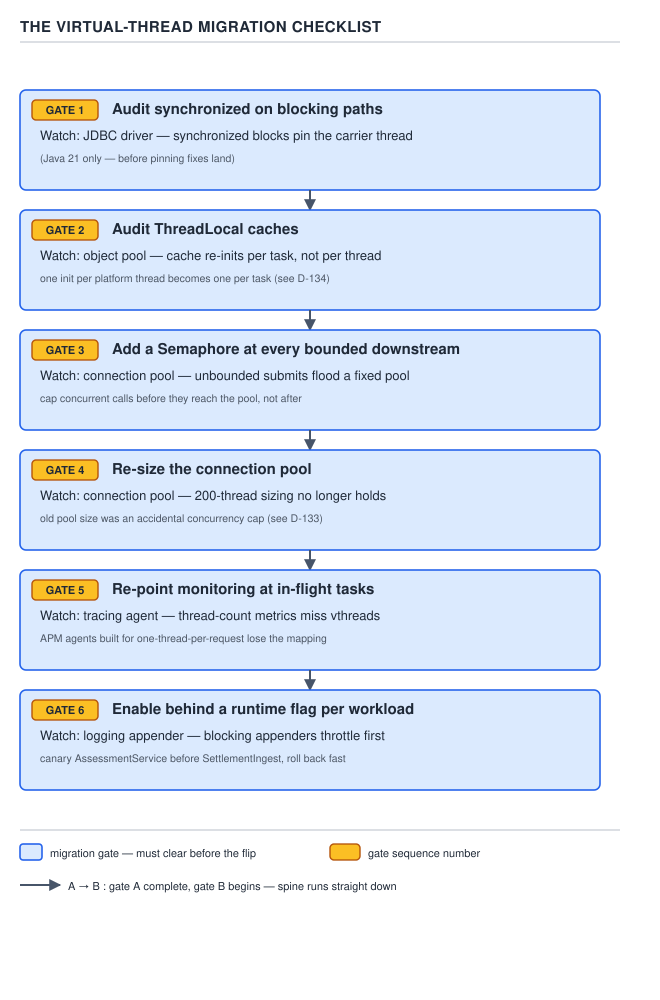
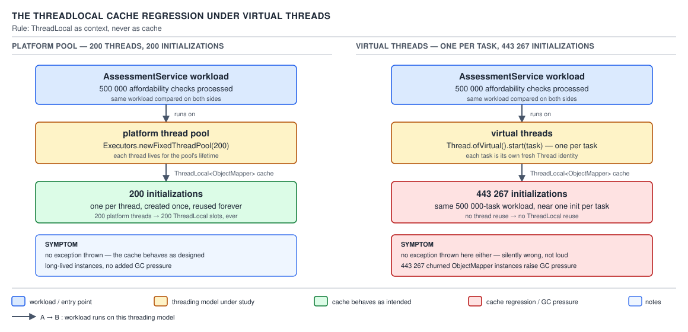
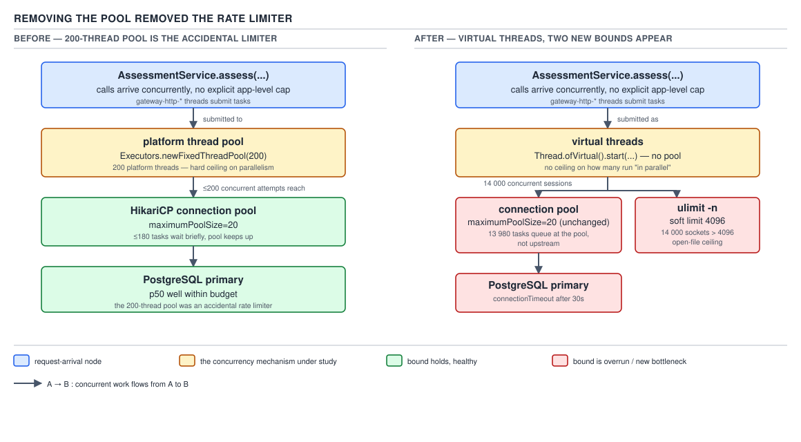

# 05 Multithreading and Concurrency — Virtual threads in production — INTERMEDIATE (§2.9)

**Target version: Java 21 LTS.** | **Part 2 of 5** | [Index](../00-index.md)
Previous: [CompletableFuture in anger](../completable-future/02-in-anger.md) · Next: [Thread-safe class design](../thread-safety/03-class-design.md)

Everything in §2.1–2.8 sold virtual threads on mechanism: cheap continuations, a carrier pool,
unmounting on blocking I/O. This file is what happens the week after `FundsLedger` flips
`spring.threads.virtual.enabled=true` in a canary region — the mechanism was never wrong; the
failures live one layer down, in code that quietly assumed "one thread per request" meant "at
most 200 of these running at once."

## 2.9.1 / 2.9.13 / 2.9.14 — The migration checklist

**Mental model.** A platform-thread pool was never *only* a thread pool. It was also the
implicit admission-control valve for every downstream call that thread made. Deleting the
pool and replacing it with virtual threads deletes the valve, not just the threads. The
checklist exists because that valve's absence shows up in five unrelated-looking places, and
finding them after the fact means five separate incidents instead of one migration review.

**Why it exists.** The naive migration is "swap the executor, ship it." That works in staging
at 40 requests/second and fails in production, where `FundsLedger` sees 14,000 concurrent
sessions reserving stakes at once — staging never had enough load to hit the limits the old
pool was quietly enforcing.

**When a lighter pass is enough.** A service calling only internal endpoints with their own
admission control can often skip to the `ThreadLocal` and `synchronized` audits. A service
like `FundsLedger`, owning a bounded resource directly, cannot skip any gate.

**How it works — the six gates, in order.**



**D-132** — The virtual-thread migration checklist.

1. **Audit `synchronized` on blocking paths (Java 21 only).** Any `synchronized` block that
   then blocks pins the carrier for the full duration. The class most likely to fail this gate
   is a **logging appender**: many still wrap `append()` in `synchronized` — `NotificationService`'s
   delivery-attempt logger is exactly this shape.
2. **Audit `ThreadLocal` caches.** Full detail below (2.9.3) — the gate teams skip most, since
   nothing throws.
3. **Add a `Semaphore` at every bounded downstream.** Full detail below (2.9.4).
4. **Re-size the connection pool.** With the semaphore in place, the pool's max size can be
   set deliberately, not left at whatever the old thread-pool size happened to leave it.
5. **Re-point monitoring at in-flight tasks.** Thread-count dashboards (2.9.11) go flat at a
   number meaning nothing once one thread costs a few hundred bytes.
6. **Enable behind a runtime flag, per workload (2.9.14).** Not a global JVM flag — a flag that
   flips one workload back to platform threads independently, in the time it takes to restart
   a pod.

**A minimal concrete example — the flag as a `Supplier`, not a JVM switch.**

```java
public final class ExecutorProvisioning {

    private final FeatureFlags flags;

    public ExecutorProvisioning(FeatureFlags flags) {
        this.flags = flags;
    }

    public ExecutorService forWorkload(String workloadName) {
        if (flags.isEnabled("virtual-threads." + workloadName)) {
            return Executors.newVirtualThreadPerTaskExecutor();
        }
        return Executors.newFixedThreadPool(200, Thread.ofPlatform()
                .name(workloadName + "-platform-", 0)
                .factory());
    }
}
```

`FundsLedger`'s stake-reservation handler asks for `forWorkload("stake-reservation")`;
`BankWithdrawal`'s payment-run submission asks for `forWorkload("payment-run")`. Each can be
toggled independently, and each rollback is a config change, not a deploy.

**The gotcha.** A flag that is read once at startup and cached in a `final` field is not a
runtime flag — it is a deploy-time flag wearing a runtime flag's name. The whole point of
2.9.14 is that a bad migration is reversible in seconds, which requires the flag check to be
live on every executor acquisition, not baked in at boot.

> **Definition.** The virtual-thread migration checklist is the sequence of six audits —
> `synchronized`, `ThreadLocal`, downstream semaphores, pool sizing, monitoring, and a
> per-workload runtime flag — that turns "swap the executor" from a rewrite into a reversible
> change.

## 2.9.3 — The `ThreadLocal` cache regression

**Mental model.** A `ThreadLocal` cache is a bet: "there are few threads, and they live a
long time, so paying an initialisation cost once per thread is cheap." Virtual threads break
both halves of that bet simultaneously — there are many of them, and each one is
disposable, alive for the length of one task.

**Why it exists.** Platform-thread pools reuse the same 200 `Thread` objects for the JVM's
life, so caching a per-thread `DecimalFormat` or `SimpleDateFormat` is a legitimate
optimisation: initialise once, reuse 10,000 times. A virtual thread is a new object per task,
so the same code initialises once, reuses **zero** times.

**When this bites, and when it doesn't.** It bites any `ThreadLocal.withInitial(...)` cache.
It does not bite state passed explicitly through method arguments or a request-scoped object
— which is why the fix is "stop putting it on the thread," not "make `ThreadLocal` faster."

**How it works — the measured regression.**



**D-134** — The `ThreadLocal` cache regression under virtual threads.

`BalanceView` renders `Stakeable`/`Withdrawable`/`Total` for every screen load, formatting
`Money` amounts with a currency-aware `DecimalFormat` per `Jurisdiction`. Building a
`DecimalFormat` is not free — locale data lookup, pattern compilation — so someone cached one
per thread:

```java
final class MoneyFormatting {

    private static final ThreadLocal<Map<Currency, DecimalFormat>> FORMATTER_CACHE =
            ThreadLocal.withInitial(HashMap::new);

    static String format(Money money) {
        Map<Currency, DecimalFormat> cache = FORMATTER_CACHE.get();
        DecimalFormat formatter = cache.computeIfAbsent(money.currency(), MoneyFormatting::newFormatter);
        return formatter.format(money.amount());
    }

    private static DecimalFormat newFormatter(Currency currency) {
        DecimalFormat formatter = new DecimalFormat();
        formatter.setCurrency(currency);
        formatter.setMinimumFractionDigits(currency.getDefaultFractionDigits());
        return formatter;
    }
}
```

Under the 200-thread platform pool serving `BalanceView`, this initialises at most 200 map
instances and, per currency actually seen, 200 `DecimalFormat` objects — the cache does its
job. Under `Executors.newVirtualThreadPerTaskExecutor()`, every `BalanceView` request runs on
a fresh virtual thread, so every request's first formatting call misses an empty
`ThreadLocal` map and re-runs `newFormatter`. One reported benchmark of this exact shape went
from **200** cache initialisations to **443,267** for the same request volume — no exception
anywhere in the stack, because `ThreadLocal.get()` never fails; it just returns a freshly
initialised, single-use value every time.

**The gotcha.** `[TRAP]` The only symptom is GC pressure — a rising young-gen allocation rate
and more frequent minor GCs — with no stack trace pointing at the cause, because nothing
threw. **Pitfall:** the belief is "a `ThreadLocal` cache is always a safe, free optimisation";
the symptom is unexplained GC pressure after a virtual-thread migration with flat CPU and flat
request latency otherwise; the fix is to replace the `ThreadLocal` with either a genuinely
shared, thread-safe cache (a `ConcurrentHashMap<Currency, DecimalFormat>` at class scope, since
`DecimalFormat` construction is the expensive part, not per-call formatting) or to pass the
formatter explicitly through the request-scoped context instead of hanging it off the thread.

> **Definition.** The `ThreadLocal` cache regression is per-thread caching becoming
> per-task allocation once "thread" stops meaning "long-lived pool worker" — same code,
> opposite cost profile, and no exception to announce the change.

## 2.9.4 / 2.9.5 — Downstream resource exhaustion

**Mental model.** The thread pool you deleted was also your rate limiter. A 200-thread pool
caps concurrent work at 200 not because anyone designed a rate limiter — it is a side effect
of `Runnable`s queueing behind a fixed number of workers. Every downstream call that thread
pool fed was, whether anyone noticed or not, bounded at 200 concurrent in-flight calls.
Virtual threads remove that ceiling entirely: nothing stops 14,000 of them from calling the
same downstream at the same instant.

**Why it exists.** Nobody sized `FundsLedger`'s HikariCP pool, the Identity Vendor's
600/minute cap, or a socket's file-descriptor slot for genuinely unbounded concurrent
demand — they were sized against "at most a few hundred platform threads in flight at once,"
a constraint virtual threads erase without asking permission.

**When to reach for a `Semaphore`, and when the pool itself is enough.** If the downstream
already enforces its own limit and fails cleanly (429s, predictable timeouts), an explicit
semaphore is optional hardening. If the downstream is a fixed resource with no back-pressure
of its own — a JDBC pool, a file descriptor table — the semaphore is not optional.

**How it works.**



**D-133** — Removing the pool removed the rate limiter.

Before the migration, `FundsLedger`'s stake-reservation endpoint ran on a 200-thread platform
pool: at most 200 `ReserveStake` calls could be in flight against the 20-connection HikariCP
pool at once — still more than 20, so requests already queued there, but arrival was capped
at 200 concurrent. After migrating to virtual threads with no executor-level cap, all 14,000
concurrently active sessions can call `FundsLedger.reserveStake(...)` in the same instant. The
queue does not disappear — it relocates from "waiting for a thread pool slot" (bounded at 200,
visible in thread-pool metrics) to "waiting for one of 20 HikariCP connections" (unbounded
arrival, invisible unless pool wait time is specifically watched). Nothing got faster; the
bottleneck moved to a place nobody was instrumenting.

The second, independent new bound is `ulimit -n`. Each of the 14,000 concurrent sessions
holds an open socket to `ApplicationGateway` while its request is in flight, plus whatever
sockets `FundsLedger` opens downstream. One million virtual threads doing socket I/O still
need one million file descriptors — virtual threads shrink the cost of the *thread*, not the
cost of the *socket*. `[NUM]` A JVM process with the default soft limit of 1,024 open file
descriptors hits `Too many open files` (`EMFILE`) at roughly 1,024 concurrent sockets,
regardless of whether those sockets are being served by 200 platform threads or 14,000 virtual
ones — raising `ulimit -n` to a five- or six-figure value is now a first-class capacity
parameter, not a one-time ops footnote.

**A minimal concrete example — the semaphore that puts the rate limiter back.**

```java
public final class BoundedStakeReservation {

    private final Semaphore downstreamPermits;
    private final DataSource ledgerDataSource;

    public BoundedStakeReservation(int maxConcurrentLedgerCalls, DataSource ledgerDataSource) {
        this.downstreamPermits = new Semaphore(maxConcurrentLedgerCalls, true);
        this.ledgerDataSource = ledgerDataSource;
    }

    public Reservation reserveStake(ClientId clientId, Money stakeAmount) throws InterruptedException {
        if (!downstreamPermits.tryAcquire(2, TimeUnit.SECONDS)) {
            throw new LedgerImbalanceException(
                    "stake reservation rejected: ledger connection pool saturated for " + clientId);
        }
        try (Connection connection = ledgerDataSource.getConnection()) {
            return StakeReservationDao.reserve(connection, clientId, stakeAmount);
        } catch (SQLException e) {
            throw new IllegalStateException("ledger write failed for " + clientId, e);
        } finally {
            downstreamPermits.release();
        }
    }
}
```

Sizing `maxConcurrentLedgerCalls` to roughly the pool's connection count (20, or a little
above it to allow brief queueing) turns an unbounded stampede back into a bounded queue with
a visible depth — `downstreamPermits.availablePermits()` is now the metric that replaced
thread-pool utilisation.

**The gotcha.** `[TRAP]` `[X-REF 08]` The failure mode is not a crash; it is HikariCP's own
connection-acquisition timeout firing under load that used to never reach the pool's ceiling,
because the old thread pool silently throttled arrivals below it. See guide 08 for HikariCP's
`connectionTimeout` and leak-detection mechanics in full. **Pitfall:** the belief is "virtual
threads mean unlimited concurrency"; the symptom is a downstream connection pool, rate
limiter, or the process's own file-descriptor table exhausting under load that the old
platform-thread version handled fine; the fix is an explicit `Semaphore` (or equivalent
bulkhead) sized to the downstream's real capacity, placed at every bounded resource the
virtual threads can now reach concurrently.

> **Definition.** Downstream resource exhaustion is a platform-thread pool's incidental
> concurrency cap disappearing along with the pool, exposing every bounded downstream —
> connection pools, rate limits, file descriptors — to demand nobody sized it for.

## 2.9.6 — The CLOSE_WAIT signature

**Mental model.** A pinned or hung Loom application does not crash. It looks alive — the JVM
process is up, health checks may even pass if they do not exercise the stuck path — while
actually serving nothing, with sockets piling up in a state that says "the other side closed
and we never noticed."

**Why it exists.** Pinning (2.9.7) or a deadlocked carrier pool starves virtual threads of
carriers, so the handler that should read, respond, and close an accepted connection never
runs. The client gives up and closes its end; the server socket sits in `CLOSE_WAIT` because
nothing has called `close()` on it.

**When you'd see this, and when you wouldn't.** This is a starvation signature — carriers are
pinned or blocked, so no virtual thread ever finishes its request. It is not a
slow-but-progressing downstream (rising latency, sockets in `ESTABLISHED`), and it is not an
OOM-killed process (gone, not idle).

**How it works — reading the dump.** `[DUMP]` The following is reproduced from the
documented `netstat`/`jstack` output shape for this failure — it is not captured from a live
process in this session.

```
$ netstat -an | grep :8443 | grep CLOSE_WAIT | wc -l
4812

$ jstack <pid> | grep -A3 "pool-1-thread"
"pool-1-thread-1" #47 daemon prio=5 os_prio=0 tid=0x... nid=0x2b1 waiting on condition [0x...]
   java.lang.Thread.State: WAITING (parking)
        at jdk.internal.misc.Unsafe.park(java.base@21.0.3/Native Method)
        at java.util.concurrent.locks.LockSupport.park(java.base@21.0.3/LockSupport.java:221)
```

The signature is the combination, not either line alone: `CLOSE_WAIT` count climbing into the
thousands while request throughput reads zero, and a thread dump showing carrier threads
parked waiting on a condition that a virtual thread should have signalled but cannot, because
that virtual thread is pinned somewhere upstream and never releases its carrier. `jstack`
against a Loom-heavy process by default shows only platform (carrier) threads in this state —
the actual stuck virtual threads require `jcmd <pid> Thread.dump_to_file -format=json` to
enumerate (2.9.7), since there can be far more virtual threads than the dump's default view is
built to show usefully.

**The gotcha.** Reading `jstack`'s carrier-only view as "the JVM has no threads blocked" is
the classic misdiagnosis — the carriers *are* idle, in the sense of not doing CPU work, which
looks like a healthy, quiescent process rather than a JVM in which every carrier is wedged
underneath a pinned virtual thread.

> **Definition.** The CLOSE_WAIT signature is server-side sockets accumulating in
> `CLOSE_WAIT` while the JVM process stays up and idle — the fingerprint of carrier
> starvation, not a crash.

## 2.9.7 / 2.9.8 — Diagnosing pinning, and what still pins after JEP 491

**Mental model.** Pinning is a carrier thread that cannot be released back to the scheduler
because the virtual thread running on it is inside a section the JVM cannot safely unmount
from. `[VERSION-TRAP]` On Java 21 the biggest cause is `synchronized` — entering a
`synchronized` block or method pins the carrier for the block's entire duration, blocking
call included.

**Why it exists as a problem worth a whole diagnostic toolchain.** A single pinned virtual
thread does not matter with 256 spare carriers. It matters when enough pin simultaneously to
exhaust the carrier pool (`jdk.virtualThreadScheduler.maxPoolSize`, default 256 — see 2.9.9),
at which point *every* virtual thread stalls, pinned or not, for want of a carrier to run on.

**When to reach for which tool.** `[DUMP]` JFR's `jdk.VirtualThreadPinned` event (default
threshold 20 ms) is the always-on answer for "is pinning happening in production, and where."
`jcmd <pid> Thread.dump_to_file -format=json` answers "show me every virtual thread's state,"
including ones a default `jstack` run does not enumerate. `[VERSION-TRAP]`
`-Djdk.tracePinnedThreads` is a Java-21-only JVM flag that logs a stack trace at the moment of
pinning, and it is **removed in Java 24** alongside JEP 491 removing `synchronized` pinning
itself — a runbook built around that flag silently stops applying on 24.

**How it works — what still pins after JEP 491.** JEP 491 (final in JDK 24) removes
`synchronized`-caused pinning specifically. It does not make virtual threads immune to
pinning in general. Three causes survive it:

| Residual cause | Why it still pins |
|---|---|
| Native frames (JNI) | The JVM cannot unmount a virtual thread while native code it called is on the stack — the continuation mechanism only understands Java frames. |
| Foreign Function & Memory (FFM) calls | Same constraint as JNI — a call into native code via `MemorySegment`/`Linker` pins for its duration. |
| File I/O on Linux | The JDK has no production `io_uring` integration; blocking file I/O on Linux still parks the carrier rather than unmounting the virtual thread. |

A `DocumentVerification` handler shelling out to a native image-processing library via JNI
still pins its carrier on Java 24, JEP 491 or not — the fix is unrelated to the
synchronized-pinning story and means moving that call onto a dedicated platform-thread pool.

**The gotcha.** `[TRAP]` `[X-REF 08]` Treating JEP 491 as "pinning is solved" leads teams to
stop monitoring `jdk.VirtualThreadPinned` after upgrading to 24, when native-frame and
Linux-file-I/O pinning are both still live and show identical symptoms. See guide 08 for the
connection-pool interaction when a JDBC driver itself makes a blocking native call.

> **Definition.** Pinning is a virtual thread occupying its carrier through a section the JVM
> cannot unmount from; JEP 491 (final, JDK 24) removes `synchronized` as a cause, but native
> frames, FFM calls, and Linux file I/O remain pinning paths on every JDK version through 25.

## Supporting facts

**2.9.2 — `spring.threads.virtual.enabled=true`.** `[X-REF 07]` Spring Boot 3.2+ flips three
specific executors to virtual threads: Tomcat's protocol handler executor (one virtual thread
per HTTP request), `@Async` method execution, and the Spring `TaskScheduler` used for
`@Scheduled` methods. It does **not** touch a manually constructed `ExecutorService` bean, a
`@Bean` HikariCP pool, or any library-managed thread pool — `BankWithdrawal`'s hand-rolled
payment-run batch executor sees no change at all. **Gotcha:** teams flip the flag, see Tomcat
requests on virtual threads, and assume the whole application migrated — the connection pool
and any custom executor still need their own audit per 2.9.1. Full mechanism in guide 07.
> **Definition.** `spring.threads.virtual.enabled=true` retargets Tomcat's request executor,
`@Async`, and the task scheduler to virtual threads — nothing else.

**2.9.9 — Sizing the carrier pool.** `[NUM]` `jdk.virtualThreadScheduler.parallelism`
(default `Runtime.availableProcessors()`) sets the target concurrent carriers;
`jdk.virtualThreadScheduler.maxPoolSize` (default 256) caps carriers covering parked or
pinned threads. Raising parallelism helps mixed CPU-bound work; it does nothing for pure
I/O-blocking workloads, since blocked virtual threads unmount and free their carrier
regardless of carrier count. **Gotcha:** raising `maxPoolSize` to "fix" a pinning incident
just delays exhaustion to a higher pinned-thread count — it treats the symptom, not the
`synchronized` block or native call causing the pin. > **Definition.** The carrier pool is
sized by `parallelism` (target concurrency) and `maxPoolSize` (ceiling), defaulting to core
count and 256.

**2.9.10 — Structured concurrency as the default fan-out shape.** `[X-REF 04]` Once a service
runs on virtual threads, fanning out `ProfileService`'s eight-owner composite read as one
`StructuredTaskScope` per request replaces `invokeAll`/`allOf`: each subtask is a virtual
thread, cancellation propagates to siblings on first failure, and `close()` guarantees no
leaked subtask outlives the request. Full mechanism and the `--enable-preview` requirement on
Java 21 in guide 04. > **Definition.** Structured concurrency treats a fan-out as one unit
with one lifetime, replacing manually joined `invokeAll`/`allOf` calls.

**2.9.11 — Observability changes.** `[X-REF 20]` Thread-count dashboards go meaningless once
"thread" means "as many as there are concurrent tasks." The replacement metrics are in-flight
task count, permits held at each `Semaphore` bulkhead (2.9.4), and queue depth at the
connection pool itself. Full dashboard redesign in guide 20. > **Definition.** Post-migration,
capacity signals move from thread-pool metrics to in-flight-task count and downstream-permit
occupancy.

**2.9.12 — The honest cost table.** `[NUM]`

| Dimension | Cost |
|---|---|
| Heap pressure | Higher — each parked virtual thread's continuation (stack frames) lives on the heap, not in a fixed native stack, so deep call chains under high concurrency add GC-visible allocation |
| Thread-dump familiarity | Lower — a dump with tens of thousands of virtual threads is not read the same way as one with 200 platform threads; tooling built around `jstack`'s default view under-serves it (2.9.6) |
| CPU-bound work | No gain — a virtual thread confers zero benefit on a computation that never blocks; it still occupies a carrier for its full duration exactly as a platform thread would |

**Gotcha:** none beyond the table — its purpose is refusing to let "virtual threads are
strictly better" stand unqualified.

## Pitfalls

### Assuming virtual threads remove the need for connection-pool sizing discipline

**Wrong**
```java
// "no thread pool limit anymore, so just let everything through"
public Reservation reserveStake(ClientId clientId, Money stakeAmount) throws SQLException {
    try (Connection connection = ledgerDataSource.getConnection()) {
        return StakeReservationDao.reserve(connection, clientId, stakeAmount);
    }
}
```
At 200 concurrent sessions this never queues visibly — the old pool already capped arrivals
below the 20-connection ceiling. At 14,000, every session calls `getConnection()` at once;
HikariCP's `connectionTimeout` fires across the board with no code change in `FundsLedger`.

**Right**
```java
public Reservation reserveStake(ClientId clientId, Money stakeAmount) throws InterruptedException {
    if (!downstreamPermits.tryAcquire(2, TimeUnit.SECONDS)) {
        throw new LedgerImbalanceException("ledger pool saturated for " + clientId);
    }
    try (Connection connection = ledgerDataSource.getConnection()) {
        return StakeReservationDao.reserve(connection, clientId, stakeAmount);
    } catch (SQLException e) {
        throw new IllegalStateException("ledger write failed for " + clientId, e);
    } finally {
        downstreamPermits.release();
    }
}
```
The semaphore reproduces the admission control the old pool gave away for free, with a depth
that can actually be watched.

**Why people believe it:** the pool's implicit rate-limiting was never documented as a rate
limiter — it was a side effect nobody had to think about until it was gone.

### Trusting a `ThreadLocal` cache because "it never threw an exception"

**Wrong**
```java
private static final ThreadLocal<Map<Currency, DecimalFormat>> FORMATTER_CACHE =
        ThreadLocal.withInitial(HashMap::new);
```
Ships fine, passes every test, and regresses GC pressure in production because each of
443,267 virtual-thread tasks builds its own single-use cache instance instead of the intended
200.

**Right**
```java
private static final Map<Currency, DecimalFormat> SHARED_FORMATTER_CACHE = new ConcurrentHashMap<>();

static String format(Money money) {
    DecimalFormat formatter = SHARED_FORMATTER_CACHE.computeIfAbsent(
            money.currency(), MoneyFormatting::newFormatter);
    return formatter.format(money.amount());
}
```
One cache, shared across every virtual thread, sized by the number of distinct currencies
(a handful), not the number of requests.

**Why people believe it:** `ThreadLocal` caches are genuinely correct under platform threads,
and nothing in the API signals the "few, long-lived threads" assumption has stopped holding.

## Cheat sheet

| Symptom / task | Cause / answer |
|---|---|
| GC pressure after migration, no exceptions | `ThreadLocal` cache re-initialising per task (2.9.3) — replace with a shared `ConcurrentHashMap` |
| Connection pool timeouts appearing under load that platform threads never hit | Pool's implicit rate-limiting removed (2.9.4) — add a `Semaphore` sized to the pool |
| `Too many open files` / `EMFILE` at high concurrency | `ulimit -n` too low for concurrent socket count (2.9.5) — raise the soft/hard limit |
| Process alive, zero throughput, sockets in `CLOSE_WAIT` | Carrier starvation from pinning (2.9.6) — check `jdk.VirtualThreadPinned` |
| Diagnosing pinning on Java 21 | `-Djdk.tracePinnedThreads=full` or JFR `jdk.VirtualThreadPinned` |
| Diagnosing pinning on Java 24+ | JFR only — `-Djdk.tracePinnedThreads` was removed with JEP 491 |
| Still pinning after upgrading to JDK 24 | Check for JNI/FFM calls or Linux file I/O (2.9.8) — `synchronized` is no longer the cause |
| `jdk.virtualThreadScheduler.parallelism` | Default `availableProcessors()` — raise only for mixed CPU-bound work |
| `jdk.virtualThreadScheduler.maxPoolSize` | Default 256 — ceiling for parked/pinned carriers, not a pinning fix |
| Rolling back a bad migration | Flip the per-workload runtime flag (2.9.14), never a redeploy |
| `spring.threads.virtual.enabled=true` scope | Tomcat request executor, `@Async`, `TaskScheduler` only (2.9.2) |
| What to watch instead of thread count | In-flight tasks, semaphore permits, queue depth (2.9.11) |

## Self-test

**Q1.** A service migrates to virtual threads and GC pause frequency roughly triples with no
change in request latency or thrown exceptions. What is the first thing to check?

<details><summary>Answer</summary>

A `ThreadLocal`-keyed cache that assumed "few, long-lived threads." Under virtual threads each
task gets a fresh, empty `ThreadLocal` slot, so the cache re-initialises on effectively every
request instead of once per pool worker — the extra allocation shows up as GC pressure with no
exception anywhere, because `ThreadLocal.get()` never fails.

</details>

**Q2.** Why did removing a 200-thread platform pool in favour of virtual threads cause a
20-connection database pool to start timing out, when the connection pool's size never
changed?

<details><summary>Answer</summary>

The platform-thread pool was an incidental rate limiter, capping concurrent database calls at
200. Virtual threads remove that ceiling, so all 14,000 concurrent sessions can call the
database at once — the 20-connection pool now faces unbounded arrival instead of a capped one,
and its own timeout starts firing under load the old pool never let it see.

</details>

**Q3.** What second, independent capacity limit appears once a service running on virtual
threads accepts far more concurrent connections than it used to?

<details><summary>Answer</summary>

The process's file descriptor ceiling, `ulimit -n`. Each concurrent socket still consumes one
descriptor regardless of how cheap the virtual thread is, so a jump to tens of thousands of
concurrent sessions can hit `EMFILE` unless the limit is raised to match.

</details>

**Q4.** A JVM process is alive, CPU usage is near zero, request throughput is zero, and
`netstat` shows thousands of sockets in `CLOSE_WAIT`. What is happening, and what would a
default `jstack` dump likely fail to show?

<details><summary>Answer</summary>

Carrier starvation: enough virtual threads are pinned that none is ever scheduled to finish
reading, responding to, and closing its connection, so client-closed sockets accumulate
server-side. A default `jstack` dump enumerates only platform (carrier) threads usefully;
seeing the stuck virtual threads needs `jcmd <pid> Thread.dump_to_file -format=json`.

</details>

**Q5.** On Java 21, what is the primary cause of virtual-thread pinning, and what changes
about diagnosing it once a service moves to Java 24?

<details><summary>Answer</summary>

Entering a `synchronized` block or method while blocking pins the carrier for the duration.
JEP 491, final in JDK 24, removes `synchronized` as a pinning cause — but it also removes the
`-Djdk.tracePinnedThreads` flag, so a Java-21 runbook built on that flag no longer applies;
JFR's `jdk.VirtualThreadPinned` event remains the diagnostic on both versions.

</details>

**Q6.** Name two causes of virtual-thread pinning that survive JEP 491 on Java 24, and why
neither is addressed by removing `synchronized` pinning.

<details><summary>Answer</summary>

Native frames (JNI/FFM calls) and blocking file I/O on Linux (no production `io_uring`
integration). None involve `synchronized` — the JVM cannot unmount while native code is on the
stack, and Linux file I/O still parks the carrier directly — so JEP 491 leaves all untouched.

</details>

**Q7.** What does `spring.threads.virtual.enabled=true` actually switch in a Spring Boot 3.2+
application, and what does a team commonly assume it switches but does not?

<details><summary>Answer</summary>

Tomcat's protocol handler executor, `@Async` method execution, and the `TaskScheduler`. Teams
commonly assume it migrates the whole application, but any manually constructed
`ExecutorService`, connection pool, or library-managed thread pool is untouched.

</details>

**Q8.** Why is "enable virtual threads behind a global JVM flag" a worse migration strategy
than "enable behind a per-workload runtime flag"?

<details><summary>Answer</summary>

A global flag makes every workload migrate and roll back together, so one workload's
`ThreadLocal` regression forces rollback of workloads migrating cleanly. A per-workload flag
lets one endpoint flip independently, turning a bad migration into a config change, not a
redeploy affecting unrelated paths.

</details>

**Q9.** Under virtual threads, why does watching thread-pool utilisation stop being a useful
capacity signal?

<details><summary>Answer</summary>

Thread count scales with concurrent task count rather than a fixed pool size, so it can spike
into the thousands without indicating real saturation. The replacement signals are in-flight
task count, permits held at each downstream `Semaphore`, and queue depth at the actual bounded
resource.

</details>

**Q10.** For which kind of work do virtual threads provide no benefit at all, and why?

<details><summary>Answer</summary>

Purely CPU-bound work. A virtual thread only saves resources by unmounting from its carrier
while blocked; a computation that never blocks occupies its carrier for its entire duration
exactly as a platform thread would, so there is nothing to unmount and nothing to save.

</details>

---

**Leaves covered:** 2.9.1–2.9.14 (14 leaves)
**Leaves deferred:** none
**Diagrams included:** D-132, D-133, D-134
**Target version:** Java 21 LTS
**Lines:** 600
