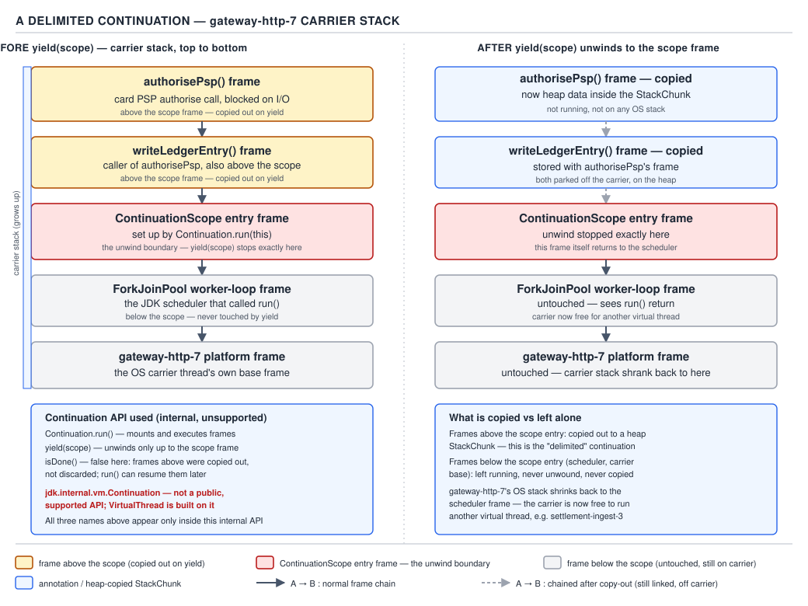
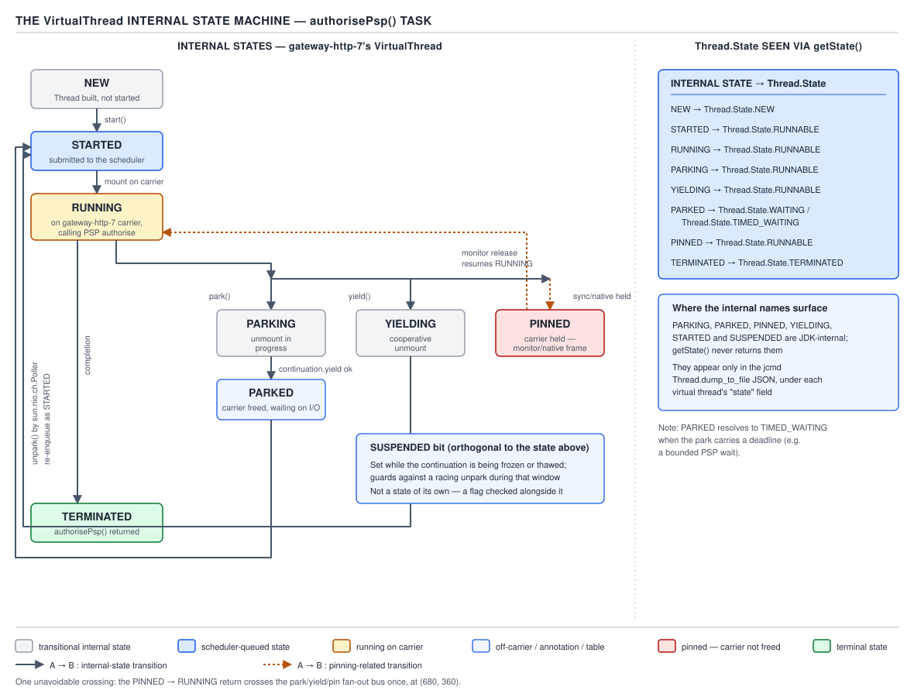

# 05 Multithreading and Concurrency — Virtual thread internals: continuations and mounting — INTERNALS (§3.12, leaves 3.12.1–3.12.11)

**Target version: Java 21 LTS.** | **Part 3 of 5** | [Index](../00-index.md)
Previous: [ForkJoinPool and work stealing](../fork-join/02-internals-work-stealing.md) · Next: [I/O, pinning and dumps](03b-internals-io-pinning-and-dumps.md)

QuizStakes runs 55,000 peak concurrent client sessions, one virtual thread per session. A checkout on `CardPayments` calls the card PSP over HTTPS — 240 ms p50, but a fat p99 tail of 11 s during processor slowness. Multiply: 55,000 virtual threads blocked on that call at once would pin 55,000 platform threads if virtual threads worked the way `Thread` used to. They don't, because a virtual thread that blocks doesn't hold a carrier — it unmounts. This file is about the machinery that makes that true: the `Continuation` primitive, `VirtualThread`'s fields and state machine, the freeze/thaw copy that happens on every mount and unmount, and the scheduler that hands carriers out.

## Hierarchy: who owns what

```
java.lang.VirtualThread          (public-ish surface: extends Thread, in java.lang)
  ├─ scheduler: Executor          (a ForkJoinPool, FIFO async mode)
  ├─ cont: Continuation           (jdk.internal.vm — the actual freeze/thaw engine)
  │    └─ tail: StackChunk        (heap object holding frozen frames)
  ├─ runContinuation: Runnable    (submitted to scheduler; wraps cont.run())
  ├─ carrierThread: Thread        (volatile; null when unmounted)
  └─ state: int                   (volatile; internal state machine, NOT Thread.State)
```

`Continuation` is the mechanism. `VirtualThread` is one client of that mechanism, layered with scheduling, interrupt semantics, and `Thread` API compatibility on top. Everything below is a straight source walk of `jdk-21+35`.

### `Continuation`: the primitive underneath everything (3.12.1, 3.12.2)

**Mental model.** A `Continuation` is a pause button for a call stack, scoped to a named boundary. You give it a `ContinuationScope` and a `Runnable`; calling `run()` executes that `Runnable` on the current stack until either it finishes or something inside it calls the static `Continuation.yield(scope)`. `yield` doesn't unwind the whole call stack the way a thrown exception would — it detaches exactly the slice of frames between the current frame and the frame that called `run()` for that scope, and hands control back to whoever called `run()`. Call `run()` again later and those exact frames reappear, mid-instruction, as if nothing happened.

**Why it exists.** Before this, the JDK had exactly one way to suspend a Java call stack: block the OS thread underneath it, which is expensive and capped by OS thread limits (typically low thousands per process before you hit memory or scheduler limits). Project Loom needed a way to suspend *only the logical unit of work*, not the OS thread carrying it, so that one OS thread could carry many suspended units over time. `Continuation` is that primitive — internal, unsupported, `jdk.internal.vm`, module-private to `java.base` (accessible only via `--add-exports` hacks). It is not a public API and you will not `import` it in application code; `VirtualThread` is its one production client in JDK 21.

**When to reach for it.** Never, directly — it's internal and unsupported, and the doc comment on the class is a one-liner: *"A one-shot delimited continuation."* One-shot: once a `Continuation` finishes (`isDone()` returns `true`), it cannot be reused. `VirtualThread` doesn't reuse one either — one `VirtualThread` has exactly one `Continuation` for its whole lifetime.

**How it works — the API surface.**

```java
public Continuation(ContinuationScope scope, Runnable target)
public final void run()                       // mount and execute/resume
public static boolean yield(ContinuationScope scope)   // unmount up to scope
public boolean isDone()
```

`run()` is `public final`, called by the carrier thread. Internally it dispatches to an `@IntrinsicCandidate` native entry point — `enterSpecial` for the very first mount of a continuation, a hidden `enter` for resumption — both JIT-recognized so the interpreter/compiler can special-case the stack-frame bookkeeping instead of treating this as an ordinary virtual call.

**Why "delimited" matters (3.12.2 — `[PROVE]`).** Say `run()` is called at frame F0. Execution proceeds through F1, F2, F3, and F3 calls `Continuation.yield(scope)`. A continuation is *delimited* because `yield` only unwinds F3, F2, F1 — the frames pushed *since* F0 entered `run()` for this scope — and stops exactly at F0. It does not touch whatever called `run()` in the first place, and it does not touch frames from an *outer* continuation scope if one exists (this is why `ContinuationScope` is a named token, not a singleton: nested scopes let `yield` target the correct boundary and skip past unrelated ones). Proof by construction: the frames below F0 are never even visible to the freeze walk — the walk starts at the top of stack and stops the instant it reaches the frame that matches `scope`'s entry marker. Contrast with a thrown, uncaught `Exception`, which unwinds *everything* until some frame catches it or the thread dies. `yield` unwinds a bounded, known slice and always returns control to a specific caller, never to "whoever happens to catch."



Look at: the shaded frames above the `ContinuationScope` entry marker are the ones `yield` copies out; the frame at the marker and everything below it never move. `Continuation.run`, `yield(scope)`, and `isDone` are the entire public surface, and the class is flagged internal/unsupported — this is deliberate: the JDK team wants the freedom to change the freeze/thaw representation between releases without a compatibility promise (and they have — the `StackChunk` layout has already changed between 19/20 preview and 21 GA).

> **Definition.** A `Continuation` is a one-shot, scope-delimited pause/resume primitive for a Java call stack: `yield(scope)` detaches only the frames above the named scope's entry point, and a later `run()` reattaches them and resumes exactly where they left off.

## `VirtualThread`'s fields and the internal state machine (3.12.3, 3.12.4)

**Mental model.** `VirtualThread` is a thin `Thread` subclass wrapped around one `Continuation`, one scheduler handle, and an `int` that tracks a state machine richer than the six values `Thread.State` exposes to callers.

**How it works — the fields**, from `VirtualThread.java` at `jdk-21+35`:

```java
private final Executor scheduler;        // the carrier pool — see 3.12.9
private final Continuation cont;         // the VTHREAD_SCOPE continuation
private final Runnable runContinuation;  // wraps cont.run(), submitted to scheduler
private volatile Thread carrierThread;   // the platform thread currently running us, or null
private volatile int state;              // internal state — see below
```

`runContinuation` is the unit of work the scheduler actually sees: a small `Runnable` closure that, when invoked by whichever carrier thread the pool assigns, calls `cont.run()`. The scheduler has no idea what a virtual thread is — it only ever runs `Runnable`s.

**`cont`'s actual runtime type — quoted source.** The field is declared `Continuation` but `VirtualThread` never constructs a bare one; it constructs a private nested subclass:

```java
private static class VThreadContinuation extends Continuation {
    VThreadContinuation(VirtualThread vthread, Runnable task) {
        super(VTHREAD_SCOPE, wrap(vthread, task));
    }
    @Override
    protected void onPinned(Continuation.Pinned reason) {
        if (TRACE_PINNING_MODE > 0) {
            boolean printAll = (TRACE_PINNING_MODE == 1);
            PinnedThreadPrinter.printStackTrace(System.out, printAll);
        }
    }
    private static Runnable wrap(VirtualThread vthread, Runnable task) {
        return new Runnable() {
            @Hidden
            public void run() {
                vthread.run(task);
            }
        };
    }
}
```

Read it line by line. The constructor passes a single shared `VTHREAD_SCOPE` token as the `ContinuationScope` — every `VirtualThread` in the JVM freezes and thaws against the *same* scope object, which is safe because `Continuation.yield(scope)` only ever unwinds the calling thread's own nested `run()` frame for that scope, not some other thread's. `wrap` exists only to give the continuation's target a `@Hidden` `run()` method — a JVM annotation that tells stack-walking APIs (`StackWalker`, exception printing) to skip this frame, so a stack trace inside application code run on a virtual thread doesn't show `VThreadContinuation$1.run()` as noise above `VirtualThread.run(task)`. `onPinned` is the callback the continuation machinery invokes instead of successfully freezing, when the freeze walk hits a frame it cannot copy — a native frame, or one inside a `synchronized` block on Java 21. That is the entire hook the next file (03b) builds pinning and `-Djdk.tracePinnedThreads` detection on top of: `TRACE_PINNING_MODE` gates whether `onPinned` prints anything at all, and whether it prints just the pinning frame or the full stack.

**The state machine (3.12.4).** These `int` constants are distinct from `java.lang.Thread.State` and are never returned by `Thread.getState()` directly — they're translated. Confirmed values from source:

| Constant | Value | Meaning |
|---|---|---|
| `NEW` | 0 | Created, not started |
| `STARTED` | 1 | `start()` called, not yet run |
| `RUNNABLE` | 2 | Queued on the scheduler, waiting for a carrier |
| `RUNNING` | 3 | Mounted, executing on a carrier |
| `PARKING` | 4 | In the middle of `park()`, about to yield |
| `PARKED` | 5 | Unmounted, waiting to be unparked |
| `PINNED` | 6 | Parked but still mounted (see next file — 03b) |
| `YIELDING` | 7 | In the middle of `Thread.yield()` (cooperative give-up, not park) |
| `TERMINATED` | 99 | Run method returned |
| `SUSPENDED` bit | `1 << 8` (256) | OR'd on while a debugger/JVMTI agent has it suspended |

**`[SOURCE]`** The source declares only two combined constants — `RUNNABLE_SUSPENDED = (RUNNABLE | SUSPENDED)` and `PARKED_SUSPENDED = (PARKED | SUSPENDED)` — not a generic `state | SUSPENDED` for every row. That is not an oversight to generalize past: a debugger can only suspend a virtual thread at the two points where it is safe to leave parked without corrupting the freeze/thaw bookkeeping — already `RUNNABLE` (queued, not mid-transition) or already `PARKED` (fully unmounted). It cannot suspend one that is mid-`PARKING`, mid-`YIELDING`, or `RUNNING`, because those are transient states where a `Continuation` freeze or the carrier's own bookkeeping is actively in flight.

**Interview:** if someone says "what state is a virtual thread in while blocked on I/O," the honest answer is `PARKED` internally, which `Thread.getState()` reports back to Java code as `WAITING` or `TIMED_WAITING` — the public API deliberately collapses the richer internal machine into the six historical `Thread.State` values so existing tooling and code keep working.



Look at: the left column is the internal `int` state with every transition edge labeled by the call that causes it (`start`, mount, `park`, `yield`, `unpark`, pinning, completion); the right column is the `Thread.State` a caller's `getState()` call actually observes for each internal state; the note that the internal names (`PARKING`, `PINNED`, etc.) surface literally only in `jcmd Thread.dump_to_file -format=json`, never through the public `Thread` API.

**`[DUMP]`** A real thread dump entry for a virtual thread parked mid-PSP-call looks like this (`jcmd <pid> Thread.dump_to_file -format=json out.json`, trimmed):

```json
{
  "tid": "0x00007f2b3c012800",
  "name": "",
  "stack": [
    "java.base/jdk.internal.misc.Unsafe.park(Native Method)",
    "java.base/java.util.concurrent.locks.LockSupport.parkNanos(LockSupport.java:269)",
    "java.base/sun.nio.ch.NioSocketImpl.park(NioSocketImpl.java:189)",
    "java.base/sun.nio.ch.NioSocketImpl.timedRead(NioSocketImpl.java:288)",
    "com.quizstakes.payments.CardPaymentGatewayClient.charge(CardPaymentGatewayClient.java:47)",
    "com.quizstakes.payments.CardPayments.authorizeAndCapture(CardPayments.java:63)"
  ],
  "state": "WAITING"
}
```

The `state` field shown by the dump tool is the *public* `Thread.State`; the internal `PARKED` value is not printed as a string in the stock dump format — `jcmd`'s virtual-thread section groups threads by carrier and shows which are mounted vs. unmounted, but the raw internal `int` is a debugger/JFR-level detail, not a dump field. Treat the JSON dump as evidence of *mountedness* (is this virtual thread attached to a carrier row or floating free) rather than a direct printout of `state`.

> **Definition.** `VirtualThread` pairs one `Continuation` (the freeze/thaw engine) with one `Executor` (the carrier pool) and a richer internal `int` state machine that `Thread.getState()` compresses down to the six public `Thread.State` values.

## Mounting and unmounting: the freeze/thaw cycle (3.12.5, 3.12.6, 3.12.7)

**Mental model.** Think of a virtual thread's call stack as a stack of Jenga blocks sitting in a moving truck (the carrier). "Mounting" is unloading those blocks onto the truck bed in the same order they were in; "unmounting" is loading them back into a storage container (the heap) so the truck can drive off and carry someone else's blocks. The blocks don't get rebuilt from scratch each time — they get physically moved.

**Why it exists.** A platform thread's stack lives in a fixed OS-allocated region and cannot be moved without OS support. A virtual thread's stack, by contrast, is Java-managed: its frames can be serialized into a heap object and copied onto (or off of) whatever carrier's native stack happens to be free. This is the entire trick that decouples "number of logical threads" from "number of OS threads."

**Mounting (3.12.5).** `VirtualThread.run()` (invoked by `runContinuation` on whatever carrier the scheduler assigned) calls `cont.run()`. Internally, `Continuation.run()` — via the `enterSpecial`/`enter` intrinsics — copies the previously frozen frames out of the `StackChunk` on the heap and back onto the carrier's native call stack, then jumps to the exact bytecode/PC offset execution was at when it last yielded. From that instant, the virtual thread's Java code is running as ordinary frames on that carrier's real OS stack — there is no interpretation overhead or trampoline once mounted; it runs at native speed indistinguishable from a platform thread's own frames.

**Unmounting (3.12.6).** When the running code calls something that would block — `LockSupport.park()`, blocking I/O, `Object.wait()` — the virtual-thread-aware code path (not the blocking call directly) invokes `Continuation.yield(VTHREAD_SCOPE)`. That walks the live frames on the carrier's native stack, from the top down to the continuation's entry frame, and copies them into a `StackChunk` object allocated on the Java heap. Once the copy completes, `yield` returns `true` to the point that requested it, and separately, `Continuation.run()` (which is still on the carrier's own call stack, one frame below the whole virtual-thread frame slice) returns normally back to `runContinuation`, back to the scheduler's worker loop, which is now free to pick up other work — including another virtual thread's `runContinuation`.

**Source walk — `mount()`, `unmount()`, `yieldContinuation()` (`[SOURCE]`).** The prose above describes the behavior; here is the actual code from `VirtualThread.java` at `jdk-21+35`, quoted and read line by line.

```java
@ChangesCurrentThread
@ReservedStackAccess
private void mount() {
    // sets the carrier thread
    Thread carrier = Thread.currentCarrierThread();
    setCarrierThread(carrier);

    // sync up carrier thread interrupt status if needed
    if (interrupted) {
        carrier.setInterrupt();
    } else if (carrier.isInterrupted()) {
        synchronized (interruptLock) {
            if (!interrupted) {
                carrier.clearInterrupt();
            }
        }
    }

    // set Thread.currentThread() to return this virtual thread
    carrier.setCurrentThread(this);
}
```

`Thread.currentCarrierThread()` reads the real, OS-backed platform thread the JVM is executing on right now — the one from `ForkJoinPool`, never the virtual thread itself, which is why the JDK needs a *separate* accessor from the ordinary `Thread.currentThread()`. `setCarrierThread(carrier)` publishes that into the `volatile carrierThread` field so anything reading it (a debugger, `unpark`, JFR) sees the mount immediately. The interrupt block exists because interrupt status is logically a property of the *virtual* thread, not the carrier, but Java's interrupt mechanism is built into `Thread` at the OS level — so on every mount the code reconciles the carrier's raw interrupt bit against the virtual thread's own `interrupted` field, clearing a stray carrier-level interrupt that doesn't belong to this virtual thread and raising one that does. The last line is the payload: it repoints what `Thread.currentThread()` returns on this OS thread to `this` — the virtual thread — so any code running from here on, including all of application code's `Thread.currentThread()` calls, sees the virtual thread, not the carrier, even though nothing about the OS thread itself has changed.

```java
@ChangesCurrentThread
@ReservedStackAccess
private void unmount() {
    // set Thread.currentThread() to return the platform thread
    Thread carrier = this.carrierThread;
    carrier.setCurrentThread(carrier);

    // break connection to carrier thread, synchronized with interrupt
    synchronized (interruptLock) {
        setCarrierThread(null);
    }
    carrier.clearInterrupt();
}
```

Exact mirror image: `carrier.setCurrentThread(carrier)` repoints `Thread.currentThread()` back to the platform thread before the connection is severed, so nothing observing the carrier mid-unmount ever sees a dangling reference to a virtual thread that no longer owns it. `setCarrierThread(null)` is guarded by `interruptLock` specifically because `interrupt()` (called from a possibly different thread entirely, targeting this virtual thread) also touches `carrierThread` and `interruptLock` together — without the lock, a racing `interrupt()` call could set the interrupt flag on a carrier that has already been reassigned to a different virtual thread. `clearInterrupt()` on the way out resets the carrier's raw OS-level interrupt bit so the next virtual thread mounted onto this same carrier doesn't inherit a stray interrupt that was never meant for it.

```java
@Hidden
@ChangesCurrentThread
private boolean yieldContinuation() {
    // unmount
    notifyJvmtiUnmount(/*hide*/true);
    unmount();
    try {
        return Continuation.yield(VTHREAD_SCOPE);
    } finally {
        // re-mount
        mount();
        notifyJvmtiMount(/*hide*/false);
    }
}
```

This is the method that actually calls the primitive from §3.12.1. `unmount()` runs *first* — the `Thread.currentThread()` identity is fixed up before the freeze even starts, so if a debugger or profiler interrupts between these two lines it never observes a virtual thread that thinks it's mounted but has no carrier bookkeeping backing that claim. `Continuation.yield(VTHREAD_SCOPE)` is the freeze call proper — it returns `true` if the freeze succeeded, `false` if the frame walk hit something unfreezable and had to give up (pinning, next file). The `finally` block is the surprising part: `mount()` runs **every time this method returns**, including the call that returns `true` because a freeze just happened — but that's not a bug, it's describing *resumption*: when this same call frame is thawed back in later (potentially on a different carrier), execution resumes inside this `finally` block, and `mount()` there is what re-establishes `Thread.currentThread()` identity on whichever carrier picked it up. One physical method body, two logically different moments in time, joined by the freeze/thaw round trip — this is the single line of code where "unmount now, remount later, possibly elsewhere" is actually implemented.

**Lazy copy — why this is not O(stack depth) in practice (3.12.7 — `[PROVE]`, `[NUM]`).** A naive implementation would copy every frame from the top of the stack down to the very first frame the virtual thread ever pushed, every single unmount — meaning a virtual thread ten calls deep into a request-processing pipeline pays for freezing all ten calls even if a deposit only ever touches the top two. The JDK does not do this. Freeze walks the stack top-down and stops as soon as it reaches a frame it has already frozen in a *previous* unmount that hasn't since been popped and re-pushed — i.e., only frames that changed since the last freeze are copied. Thaw is the mirror image: it does not eagerly copy the whole `StackChunk` back onto the carrier at mount time. It installs **return barriers** — the topmost frames are thawed eagerly enough to resume execution, and deeper frames are thawed incrementally, lazily, as execution actually returns into them. The asymptotic argument: cost is proportional to the *working set* of frames that changed between one unmount and the next mount, not to total stack depth. For QuizStakes, `AssessmentService`'s eligibility check might sit six frames below `CardPayments.authorizeAndCapture`, but if the PSP round trip only touches the top two or three frames repeatedly (loop of retries, response parsing), only those get re-copied on each freeze — the deep, quiescent frames are frozen once and left alone.

**Numbers, stated as order of magnitude only.** A shallow park/unpark round trip (a handful of frames, no deep call chain) costs on the order of a few hundred nanoseconds to low microseconds of freeze/thaw and scheduler resubmission work — this is a documented order-of-magnitude figure from the Loom project's own measurements, not a number this file re-measures, and it will vary by JIT state, stack depth, and hardware. Do not treat it as a guaranteed constant: it is the reason virtual threads are viable at 55,000-way concurrency (a platform-thread context switch, by comparison, is dominated by OS scheduler and cache-effects overhead an order of magnitude or more larger), but it is not a number you should hardcode into a capacity plan.

**Worked trace — the PSP call.** A checkout thread on `CardPayments` calls `authorizeAndCapture`, which opens a socket to the PSP and blocks on the read. Sequence:

1. Virtual thread is `RUNNING`, mounted on carrier `CarrierThread-7`.
2. `NioSocketImpl.timedRead` determines the socket isn't ready and calls the virtual-thread-aware park path (03b covers this dispatch in full; here we just need that it ends in `LockSupport.park`).
3. `VirtualThread.park()` sets `state = PARKING`, calls `Continuation.yield(VTHREAD_SCOPE)`.
4. Freeze walks the stack: `authorizeAndCapture` frame, `CardPaymentGatewayClient.charge` frame, the NIO frames — copies them into a `StackChunk`, stops at the continuation entry frame.
5. `state` becomes `PARKED`. `carrierThread` is cleared. `CarrierThread-7`'s worker loop returns to `ForkJoinPool`, free to steal or run other virtual threads' `runContinuation`s — at p99 (11 s), this carrier serves potentially hundreds of other sessions in the interim.
6. When the PSP responds, the OS's I/O readiness mechanism (via the `Poller`, covered in 03b) calls `unpark()`, which sets `state = RUNNABLE` and submits `runContinuation` back to the scheduler.
7. Some carrier — not necessarily `CarrierThread-7` — picks it up, calls `cont.run()`, thaw restores the frames, execution resumes inside `timedRead` as if the call had simply returned.

At 240 ms p50 this round trip is cheap for the pool: the virtual thread occupies zero carrier time while waiting, so 55,000 concurrent checkouts don't need 55,000 carriers — they need enough carriers to keep the CPU-bound portions of the request (bytes-on-the-wire framing, response parsing, ledger updates) moving, which `availableProcessors()` carriers already do.

> **Definition.** Mounting copies frames from a heap `StackChunk` onto a carrier's native stack and resumes execution at the saved point; unmounting copies the live, changed frames from the carrier's stack into a `StackChunk` on the heap and returns the carrier to the scheduler — and both directions copy only the frames that actually changed since the last transition, not the full stack depth.

## `StackChunk`: a real, GC'd heap object (3.12.8)

**Mental model.** `StackChunk` is not a metaphor for "the stack, sort of" — it is a genuine object on the Java heap, with a class, a size, and a lifecycle the garbage collector understands and walks like any other object graph, except its payload is raw frame data the GC must interpret specially (it knows how to find and update oop references embedded inside the frozen frames during a moving collection).

**The consequence — `[X-REF 06]`, `[TRAP]`.** Because a virtual thread's stack is a heap object, a virtual thread that never completes — blocked forever, or endlessly re-parking without progress — is not consuming a scarce OS-thread slot the way a leaked platform thread would. It is consuming **heap**, exactly the same category of resource as a `List` you forgot to clear. This directly informs the earlier, already-established capacity number: 1,000,000 virtual threads at roughly 2 KB apiece is about 2 GB of heap, most of it living in `StackChunk` objects. If QuizStakes leaks virtual threads — say a bug in `PaymentRun` batch orchestration spawns one virtual thread per `WithdrawalTransaction` and forgets to ever let them terminate because a `CompletableFuture` they're joined to never completes — the symptom is heap pressure and eventually `OutOfMemoryError: Java heap space`, not `OutOfMemoryError: unable to create new native thread`, and not thread-count exhaustion visible in `jstack`'s OS-thread listing. This is the trap: engineers who learned to hunt leaked threads by watching OS thread count will look in the wrong place. The right diagnostic is a heap histogram or JFR heap dump showing large counts of `StackChunk` and `VirtualThread` instances, cross-referenced against GC pause growth — the full GC-side mechanics of how the collector walks and relocates `StackChunk` payloads belong to the JVM internals / GC topic (06), not here.

> **Definition.** A `StackChunk` is an ordinary, GC-managed heap object holding a virtual thread's frozen frames, which means an unbounded, never-completing virtual thread is a heap leak, diagnosed with heap tooling, not a thread-table exhaustion.

## The scheduler (3.12.9, 3.12.10)

**Mental model.** The scheduler is just a `ForkJoinPool` — the same work-stealing pool from the previous file (`fork-join/02-internals-work-stealing.md`) — configured to run in a mode most application code never touches, and populated with a special thread subclass.

**How it works — confirmed from `VirtualThread.java` at `jdk-21+35`.** The default scheduler is a `ForkJoinPool` constructed in **FIFO async mode** (as opposed to the LIFO/work-stealing-deque mode `ForkJoinPool.commonPool()` uses for its own submitted tasks), with:

- **parallelism** = `Runtime.getRuntime().availableProcessors()` by default, overridable via `-Djdk.virtualThreadScheduler.parallelism=N`;
- **maxPoolSize** = `Integer.max(parallelism, 256)` — i.e., the pool can grow to 256 worker threads even on a small box, and higher than that if `parallelism` itself is set above 256;
- worker threads are instances of an internal `CarrierThread` class — a `ForkJoinWorkerThread` subclass — not plain `Thread`.

FIFO mode matters specifically for virtual threads: work-stealing deques normally run LIFO locally (better cache locality, worse fairness) and steal FIFO from other queues; virtual-thread scheduling instead runs every queue FIFO, which favors fairness across the huge number of resubmitted `runContinuation`s over cache locality for any one of them — with a million virtual threads potentially resubmitting, starving the ones queued earliest would be worse than a small cache-locality loss.

**Source walk — `createDefaultScheduler()` (`[SOURCE]`).**

```java
private static ForkJoinPool createDefaultScheduler() {
    ForkJoinWorkerThreadFactory factory = pool -> {
        PrivilegedAction<ForkJoinWorkerThread> pa = () -> new CarrierThread(pool);
        return AccessController.doPrivileged(pa);
    };
    PrivilegedAction<ForkJoinPool> pa = () -> {
        int parallelism, maxPoolSize, minRunnable;
        String parallelismValue  = System.getProperty("jdk.virtualThreadScheduler.parallelism");
        String maxPoolSizeValue  = System.getProperty("jdk.virtualThreadScheduler.maxPoolSize");
        String minRunnableValue  = System.getProperty("jdk.virtualThreadScheduler.minRunnable");
        if (parallelismValue != null) {
            parallelism = Integer.parseInt(parallelismValue);
        } else {
            parallelism = Runtime.getRuntime().availableProcessors();
        }
        if (maxPoolSizeValue != null) {
            maxPoolSize = Integer.parseInt(maxPoolSizeValue);
            parallelism = Integer.min(parallelism, maxPoolSize);
        } else {
            maxPoolSize = Integer.max(parallelism, 256);
        }
        if (minRunnableValue != null) {
            minRunnable = Integer.parseInt(minRunnableValue);
        } else {
            minRunnable = Integer.max(parallelism / 2, 1);
        }
        Thread.UncaughtExceptionHandler handler = (t, e) -> { };
        boolean asyncMode = true; // FIFO
        return new ForkJoinPool(parallelism, factory, handler, asyncMode,
                     0, maxPoolSize, minRunnable, pool -> true, 30, SECONDS);
    };
    return AccessController.doPrivileged(pa);
}
```

The `factory` lambda is the whole reason worker threads come out as `CarrierThread` instead of the plain `ForkJoinWorkerThread` the common pool uses — `CarrierThread` is a thin subclass that exists mainly so `Thread.currentCarrierThread()` and virtual-thread-aware code (`instanceof CarrierThread` checks appear in `afterYield`, quoted below) can recognize "this platform thread is a Loom carrier" cheaply, without a `ThreadLocal` or an `InheritableThreadLocal` lookup. The three system properties are read once, at pool-construction time — this is why they must be set as `-D` JVM flags at startup, not via `System.setProperty` at runtime; the pool is already built by the time application code runs. Note the asymmetry in the `maxPoolSizeValue != null` branch: if you *do* set `maxPoolSize` explicitly, `parallelism` gets clamped down to it (`Integer.min`), but if you don't, `maxPoolSize` gets computed *up* to `max(parallelism, 256)` — the 256 floor only ever applies to the derived default, never overriding an explicit, smaller `maxPoolSize` you asked for. `asyncMode = true` is the literal FIFO switch — this single boolean, passed straight into the `ForkJoinPool` constructor's `asyncMode` parameter, is the entire difference from `ForkJoinPool.commonPool()`'s LIFO deques; nothing else about the pool's task-stealing algorithm changes. The trailing `30, SECONDS` is the keep-alive for excess worker threads above core parallelism — carriers spun up temporarily (to cover pinning) that go idle for 30 seconds get reclaimed, so the pool doesn't permanently sit at `maxPoolSize` after a transient pinning spike passes.

**System properties (3.12.10 — `[NUM]`).**

| Property | Effect | Default |
|---|---|---|
| `jdk.virtualThreadScheduler.parallelism` | Core/target parallelism of the carrier pool | `availableProcessors()` |
| `jdk.virtualThreadScheduler.maxPoolSize` | Ceiling the pool can grow to (e.g. while carriers are pinned) | `max(parallelism, 256)` |
| `jdk.virtualThreadScheduler.minRunnable` | Threshold below which the pool tries to add carriers to keep runnable work serviced | `max(parallelism / 2, 1)` |

**`[VERSION-TRAP]`** `minRunnable` is the property name confirmed against Java 21 source; it is a JDK 21-era internal tuning knob and its presence and exact semantics across later releases (22–25) are not something this file asserts — treat it as Java-21-scoped unless independently re-checked against the version in use. `maxPoolSize` defaulting to 256 is confirmed directly from `VirtualThread.java` at tag `jdk-21+35` (the `Integer.max(parallelism, 256)` expression appears in the scheduler-construction code) — not merely a documented claim.

**Insight:** the 256 ceiling exists specifically to bound how many carrier threads pinning (03b) can force into existence — without a ceiling, a pathological amount of pinned, blocking legacy code could grow the carrier pool to platform-thread-exhaustion levels, defeating the entire point of virtual threads. 256 is a safety valve, not a capacity target: QuizStakes should not be running near it under healthy conditions with 55,000 concurrent sessions, because those sessions are supposed to be unmounted, not pinned, during the PSP call.

## The park path in full (3.12.11 — `[PROVE]`)

**Mental model.** `LockSupport.park()` is one function with two completely different implementations underneath depending on who calls it — a virtual thread gets the continuation path; a platform thread gets the OS path. Same public API, different physics.

**The virtual-thread path**, traced call by call:

```
LockSupport.park()
  → Thread.currentThread() is a VirtualThread instance
  → VirtualThread.park()                       // dispatch happens inside LockSupport
      state = PARKING
      Continuation.yield(VTHREAD_SCOPE)          // freeze: see 3.12.6/3.12.7
        [carrier's native frames copied into StackChunk]
        [Continuation.run() returns on the carrier]
      // back on the carrier's worker loop, virtual thread is now off-stack
      state = PARKED  (unless yield failed — see PINNED, next file)
  → carrier's ForkJoinPool worker loop resumes servicing other Runnables
  ...time passes, PSP responds...
  → unpark() called (by the Poller thread, or another thread) sets state = RUNNABLE
  → runContinuation is resubmitted to the scheduler
  → some carrier eventually calls cont.run() again → thaw → resume past the park() call
```

**The platform-thread path**, for contrast:

```
LockSupport.park()
  → Thread.currentThread() is a platform Thread
  → calls into native parking code (Unsafe.park intrinsic)
      → pthread_cond_wait (POSIX) / equivalent WaitOnAddress-style primitive (Windows)
      → the OS thread is descheduled by the OS kernel scheduler
      → the underlying OS thread stack, kernel thread-control-block, and any
        thread-local OS resources stay reserved for the entire wait
  ...time passes...
  → unpark() sets an internal permit and, if the target is parked,
    signals the condition variable, which the kernel scheduler uses to make
    the OS thread runnable again on some CPU
```

**Source walk — the real `park()` (`[SOURCE]`).** The ASCII trace above is the shape; this is the literal method from `VirtualThread.java`:

```java
@Override
void park() {
    assert Thread.currentThread() == this;

    // complete immediately if parking permit available or interrupted
    if (getAndSetParkPermit(false) || interrupted)
        return;

    // park the thread
    boolean yielded = false;
    setState(PARKING);
    try {
        yielded = yieldContinuation();  // may throw
    } finally {
        assert (Thread.currentThread() == this) && (yielded == (state() == RUNNING));
        if (!yielded) {
            assert state() == PARKING;
            setState(RUNNING);
        }
    }

    // park on the carrier thread when pinned
    if (!yielded) {
        parkOnCarrierThread(false, 0);
    }
}
```

`getAndSetParkPermit(false)` is `LockSupport`'s permit — a single boolean "you're allowed to proceed once" flag, exactly like `LockSupport.unpark()` on a platform thread. If a matching `unpark()` already ran before this `park()` call reached this line (the PSP responded unusually fast, or an unrelated caller pre-unparked), the permit is already `true`; this call consumes it and returns immediately without ever touching a `Continuation` — no freeze happens at all for a park that never actually blocks. That is the fast path, and it is why `park()`/`unpark()` are not symmetric with each other in cost: an uncontended park can be cheaper than a mounted method call that touches memory barriers, because it may do nothing but a CAS. If no permit is available, `setState(PARKING)` publishes the transitional state, then `yieldContinuation()` (walked above) attempts the freeze. The `finally` block is where pinning surfaces structurally: if `yieldContinuation()` returned `false` — the freeze walk hit an unfreezable frame — `yielded` is `false`, the state is forced back from `PARKING` to `RUNNING` (never reaching `PARKED` at all), and the method falls through to `parkOnCarrierThread(false, 0)`, which parks the *carrier* the ordinary platform-thread way, keeping it attached for the whole wait. Compare that fallback against §3.12.9's insight about the 256-worker ceiling: this is exactly the situation that ceiling exists to bound — every pinned park takes a carrier out of circulation for the duration, and the pool grows extra carriers (up to `maxPoolSize`) to compensate.

**`[PROVE]` the structural difference.** The platform-thread path never releases the OS thread — the kernel scheduler is still holding a full stack (typically ~1 MB reserved by default) and a kernel thread-control-block idle in the wait queue for the entire 11-second p99 tail. The virtual-thread path's `Continuation.yield` call physically detaches the *entire logical unit of work* from any OS thread at all during that same 11 seconds — there is no OS-level entity blocked, only a `StackChunk` sitting on the heap and a scheduling record waiting for `unpark`. This is the proof, not an assertion: count OS threads via `jstack` or `ps -T` during a slow PSP window under each model. Under the platform-thread model, OS thread count tracks concurrent-in-flight-PSP-calls 1:1. Under the virtual-thread model, OS thread count (carrier count) stays flat near `availableProcessors()`/`maxPoolSize` regardless of how many of the 55,000 sessions are mid-PSP-call, because none of them are occupying a carrier while parked.

**Pitfall forward-pointer:** this proof assumes the park path actually reaches `Continuation.yield` successfully. Some blocking operations — `synchronized`, certain native/JNI calls — cannot yet be frozen mid-frame in Java 21 and instead force `PINNED` state, keeping the carrier attached for the whole wait. That failure mode, and the JEP 491 fix that removes it for `synchronized` starting in JDK 24, is the subject of the next file (§3.12.12–22).

## Open questions

None outstanding — `maxPoolSize` default of 256 was confirmed directly against `VirtualThread.java` at `jdk-21+35` (raw GitHub view of the openjdk/jdk repository), not merely asserted from documentation.

## Pitfalls

### Assuming a parked virtual thread still "is" a thread the OS knows about

**Wrong**
```java
// Mental model: "this virtual thread is blocked, so somewhere there's an OS
// thread sitting in a syscall for it, same as always."
Thread.startVirtualThread(() -> cardPayments.authorizeAndCapture(withdrawal));
// ...then someone checks `ps -T -p <pid> | wc -l` expecting it to track
// concurrent in-flight PSP calls.
```
Running that during a burst of slow PSP calls shows OS thread count staying near `availableProcessors()`/pool size, not growing with the number of blocked checkouts — because the parked virtual thread was unmounted; nothing OS-visible is blocked on its behalf.

**Right**
```java
// To see per-virtual-thread state, use JDK-level introspection, not OS tools:
//   jcmd <pid> Thread.dump_to_file -format=json threads.json
// then look for entries showing WAITING/TIMED_WAITING state and cross-reference
// which are grouped under an active carrier vs. floating unmounted.
```
The OS has no visibility into individual virtual threads at all — only into the fixed-size carrier pool. Diagnose virtual-thread-level blocking with `jcmd`/JFR, not `ps`/`top`.

**Why people believe it:** every prior Java thread, for 25+ years, was a 1:1 wrapper over an OS thread, so "thread blocked" and "OS thread blocked" were the same fact. Virtual threads break that equivalence on purpose, and habits built on the old equivalence don't update automatically.

### Assuming unmounting is proportional to how deep the call stack is

**Wrong**
```java
// "This virtual thread is 12 frames deep into AssessmentService's eligibility
// chain before it hits the PSP call — unmounting must copy all 12 frames'
// worth of stack every single time it parks and resumes, so deep call chains
// make virtual threads slow."
```
This overstates the cost and leads people to flatten call stacks defensively for "virtual-thread performance," which is not where the actual cost lives.

**Right**
Freeze/thaw only touches frames that changed since the last freeze; a stable, quiescent set of deep frames that stays untouched across many park/unpark cycles is frozen once and left alone via the lazy copy and thaw's return-barrier mechanism (3.12.7). Cost tracks the *working set* of frames actively changing, not total depth. Write code with whatever call-stack depth is natural; don't flatten it for this reason.

**Why people believe it:** freeze/thaw sounds like "serialize the stack," and serialization intuitively feels like it should be linear in size — the lazy, incremental design is a genuinely non-obvious optimization that isn't visible from the API surface.

## Cheat sheet

| Fact | Value / detail |
|---|---|
| Primitive underneath virtual threads | `jdk.internal.vm.Continuation` — internal, unsupported |
| Continuation class doc | "A one-shot delimited continuation" |
| Public surface | `Continuation(scope, target)`, `run()`, static `yield(scope)`, `isDone()` |
| Entry intrinsics | `enterSpecial` (first mount), hidden `enter` (resume) — both `@IntrinsicCandidate` |
| Delimited means | `yield` unwinds only up to the scope's entry frame, never below |
| `VirtualThread` fields | `scheduler`, `cont`, `runContinuation`, `carrierThread` (volatile), `state` (volatile) |
| Internal states | `NEW`(0) `STARTED`(1) `RUNNABLE`(2) `RUNNING`(3) `PARKING`(4) `PARKED`(5) `PINNED`(6) `YIELDING`(7) `TERMINATED`(99); `SUSPENDED` = bit `1<<8` |
| Mounting | copy frozen frames from `StackChunk` onto carrier stack, resume at saved PC |
| Unmounting | copy live/changed frames from carrier stack into a `StackChunk`, return carrier to scheduler |
| Freeze/thaw cost | proportional to changed working set, not stack depth — lazy copy + thaw return barriers |
| `StackChunk` | real heap object, GC-managed; leaked virtual thread = heap leak, not thread leak |
| Scheduler | `ForkJoinPool`, FIFO async mode, workers of class `CarrierThread` |
| `parallelism` default | `availableProcessors()` |
| `maxPoolSize` default | `max(parallelism, 256)` — confirmed in `VirtualThread.java` `jdk-21+35` |
| `minRunnable` default | `max(parallelism/2, 1)` — Java 21; not asserted for 22–25 |
| Park path (vthread) | `park()` → `state=PARKING` → `Continuation.yield` → freeze → `state=PARKED` → carrier freed |
| Park path (platform) | `park()` → native → `pthread_cond_wait`-equivalent → OS thread stays reserved, descheduled |
| Pinning | forward pointer only — full treatment in 03b; JEP 491 removes `synchronized` pinning in JDK 24 |

## Self-test

**Q1.** Why is `Continuation` called "delimited," and what would break if `yield` instead unwound the entire stack down to the very first frame the thread ever pushed?

<details><summary>Answer</summary>

"Delimited" means `yield(scope)` only detaches frames above the named `ContinuationScope`'s entry frame — the frame where `run()` was called for that scope — and leaves everything at or below that frame untouched. If it unwound the whole stack instead, a virtual thread could never be freestanding: the carrier's own scheduling frames (the `ForkJoinPool` worker loop, `runContinuation`, `Continuation.run()` itself) live below the entry frame, and unwinding through them would corrupt or terminate the carrier's own control flow rather than just detaching the virtual thread's logical work. Delimiting keeps the freeze operation scoped exactly to "the virtual thread's own frames," nothing else.

</details>

**Q2.** A virtual thread parks, then unparks and resumes on a different `CarrierThread` than the one it started on. What had to happen to its call stack for that to be possible, and why couldn't a platform thread ever do this?

<details><summary>Answer</summary>

Its frames were copied out of the original carrier's native stack into a `StackChunk` heap object during unmount (freeze), completely detaching them from any specific OS thread. On resume, those same frames are copied (thawed) onto whichever carrier the scheduler happens to hand the resubmitted `runContinuation` to — the frames are just heap data at that point, indifferent to which carrier reattaches them. A platform thread's stack is a fixed, OS-managed memory region tied to one specific OS thread/kernel thread-control-block for its entire life; it cannot be serialized to the heap and reattached elsewhere, so a platform thread can never migrate carriers because it never "unmounts" from itself in the first place.

</details>

**Q3.** Why does the JDK bother with a lazy, incremental freeze/thaw instead of always copying the full stack? Give the QuizStakes example where this matters.

<details><summary>Answer</summary>

A full copy every park/unpark would make unmount cost scale with total call-stack depth, which punishes exactly the code style Java encourages (layered services calling into each other). The lazy approach only copies frames that changed since the last freeze and thaws deeper frames on demand via return barriers, so cost tracks the *active working set*, not depth. Example: `AssessmentService`'s eligibility check might be six frames below `CardPayments.authorizeAndCapture` when the PSP call parks; if retries and response parsing only touch the top two or three frames across multiple park/unpark cycles, the deep, untouched eligibility frames are frozen once and never re-copied, keeping the recurring park/unpark cost cheap regardless of how deep the original call chain was.

</details>

**Q4.** What internal `VirtualThread` state is a checkout session in while its HTTP call to the card PSP is in flight, and what does `Thread.getState()` report for it publicly?

<details><summary>Answer</summary>

Internally `PARKED` (after passing through `PARKING` during the yield). Publicly, `Thread.getState()` reports one of the ordinary `Thread.State` values such as `WAITING` or `TIMED_WAITING`, depending on whether the park call has a timeout — the internal `PARKED`/`PARKING`/`PINNED`/`YIELDING` distinctions are collapsed and are not directly visible through the public `Thread` API; they show up only via JVMTI/JFR-level tooling or `jcmd`'s thread dump.

</details>

**Q5.** Why is a leaked, never-completing virtual thread diagnosed as a heap problem rather than a thread-exhaustion problem?

<details><summary>Answer</summary>

A virtual thread's stack is represented, when unmounted, as a `StackChunk` — an ordinary object on the Java heap that the garbage collector manages like any other object graph (with special handling for the embedded frame data during relocation). There is no OS thread reserved for a parked virtual thread, so leaking one doesn't exhaust an OS-level thread table or hit "unable to create new native thread." Instead it accumulates heap: at roughly 2 KB per virtual thread stack, a leak of enough never-completing virtual threads shows up as heap growth and eventually `OutOfMemoryError: Java heap space`, diagnosed with a heap histogram or JFR heap dump, not `jstack`'s OS thread listing.

</details>

**Q6.** Why does the virtual-thread scheduler run its `ForkJoinPool` in FIFO async mode instead of the LIFO mode `ForkJoinPool.commonPool()` uses?

<details><summary>Answer</summary>

LIFO/work-stealing-deque mode favors whichever task was submitted most recently on a given worker's local queue, which improves cache locality but can starve older queued tasks under sustained load. With potentially a million virtual threads' `runContinuation`s cycling through resubmission after every park/unpark, FIFO async mode instead services queued work in submission order on every queue, prioritizing fairness across that huge population over the smaller cache-locality win LIFO would give any single task.

</details>

**Q7.** What does `maxPoolSize` actually bound, and why is its default `max(parallelism, 256)` rather than just `parallelism`?

<details><summary>Answer</summary>

`maxPoolSize` bounds how many `CarrierThread` worker threads the virtual-thread scheduler's `ForkJoinPool` can grow to, confirmed in `VirtualThread.java` (`jdk-21+35`) as `Integer.max(parallelism, 256)`. It defaults above raw `parallelism` because the pool needs headroom to add carriers when some are pinned (blocked while still mounted, covered in the next file) rather than parked — a pinned carrier can't be reused for other virtual threads, so without extra headroom, pinning could otherwise starve all runnable virtual-thread work down to `parallelism`-many effective carriers. 256 acts as a safety-valve ceiling, not a capacity target to run near under healthy conditions.

</details>

**Q8.** Structurally, what is the one thing that happens during a platform thread's park that never happens during a virtual thread's park, and why is that the entire reason 55,000 concurrent PSP calls don't need 55,000 OS threads?

<details><summary>Answer</summary>

A platform thread's park keeps its OS thread — its kernel thread-control-block and full reserved stack — sitting idle in the kernel's wait queue (via `pthread_cond_wait` or the platform equivalent) for the entire duration of the block. A virtual thread's park instead calls `Continuation.yield`, which physically detaches its frames onto the heap and returns the carrier OS thread to the scheduler to do other work; no OS-level entity is blocked at all during the wait. Because of that, OS/carrier thread count under the virtual-thread model stays flat near `availableProcessors()`/`maxPoolSize` regardless of how many of the 55,000 sessions are mid-PSP-call, instead of tracking concurrent-blocked-calls 1:1 the way the platform-thread model would.

</details>

---

**Leaves covered:** 3.12.1–3.12.11 (11 leaves)
**Leaves deferred:** none
**Diagrams included:** D-190, D-191
**Target version:** Java 21 LTS
**Lines:** 518
