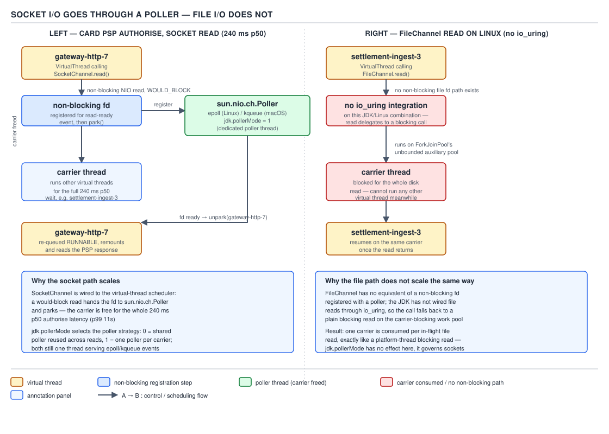
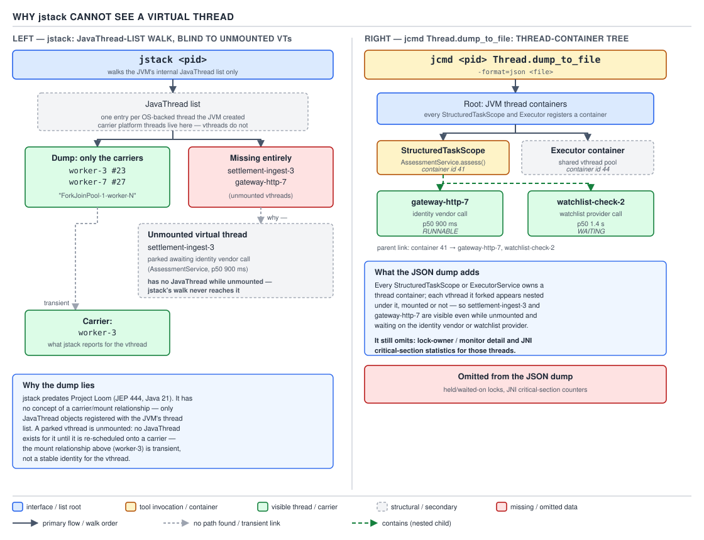

# 05 Multithreading and Concurrency — Virtual thread internals: I/O, pinning and dumps — INTERNALS (§3.12, leaves 3.12.12–3.12.19)

**Target version: Java 21 LTS.** | **Part 3 of 5** | [Index](../00-index.md)
Previous: [Continuations and mounting](03a-internals-continuations-and-mounting.md) · Next: [Cost, ThreadFlock and scoped values](03c-internals-cost-flock-and-scoped-values.md)

Day 3a established what a virtual thread *is*: a `Continuation` plus a heap-allocated
`StackChunk`, mounted onto a carrier for a slice of work and unmounted at a yield point.
This file is about what happens at the edges of that model — the two kinds of blocking
I/O behave completely differently underneath, and `synchronized` blocks used to defeat the
whole scheme. The next file, 03c, covers the resource arithmetic and the structures
(`ThreadFlock`, `ScopedValue`) that make all of this observable and composable.

## The I/O path: the poller for sockets, and the file-I/O gap

**Mental model.** A virtual thread doing `socket.read()` looks, from the calling code, like
an ordinary blocking read. Underneath there is no blocking at all: the read is issued as
non-blocking NIO, and if the data isn't there yet, the virtual thread parks and hands the
fd off to a small pool of **poller** threads that are the only things actually blocked in
the kernel, waiting on `epoll_wait`/`kqueue` for potentially thousands of fds at once.

**Why it exists.** Before virtual threads, "blocking" `InputStream`/`Socket` reads really
did block the OS thread for the duration — fine at a few hundred threads, catastrophic at
55k peak concurrent QuizStakes sessions, each making at least one blocking network call (a
card-PSP capture at 240 ms p50/11 s p99, an identity-vendor call at p50 900 ms). Platform
pools solved this with reactive/async rewrites (callbacks, `CompletableFuture` chains) that
kept the thread free but destroyed the straight-line stack trace and `try/finally`
semantics. Virtual threads restore the blocking *style* while getting the non-blocking
*behaviour* underneath, moving "who is actually blocked" from the call site into the
runtime.

**When it applies, and when it doesn't.** It applies to socket-based I/O — anything that
goes through `sun.nio.ch.Poller`: `SocketChannel`, `Socket`, HTTP clients built on NIO. It
does **not** apply to file I/O, which is the next paragraph, and it does not apply to
native blocking calls made through JNI/FFM, which Day 3a's continuation-yield failure and
this file's pinning section both cover.

**How it works.** `sun.nio.ch.Poller` is the class backing this (source:
`java.base/share/classes/sun/nio/ch/Poller.java`). A virtual thread that would block on a
socket read instead registers interest in the fd with a `Poller`, records itself in an
internal `Map<Integer, Thread>` keyed by fd, and parks. The poller thread — a real platform
thread sitting in `epoll_wait`/`kqueue` — wakes when the fd becomes readable, looks the fd
up in that map, and calls `LockSupport.unpark(thread)` on the waiting virtual thread. The
carrier that the virtual thread was mounted on was released the instant it parked; it went
back to the `ForkJoinPool` common pool and ran other virtual threads in the meantime. No
carrier is ever consumed for the duration of the socket wait.

The system property `jdk.pollerMode` selects which poller implementation runs:

| Mode | Value | Behaviour |
|---|---|---|
| `SYSTEM_THREADS` | `1` | Read/write pollers are ordinary platform threads blocked in `epoll_wait`/`kqueue`; they unpark virtual threads as fds become ready. This is the default on most platforms. |
| `VTHREAD_POLLERS` | `2` | The pollers themselves are virtual threads that poll and yield between polls, rather than blocking a platform thread. |
| `POLLER_PER_CARRIER` | `3` | Every carrier gets its own dedicated read poller (as a virtual thread); the write poller stays a single system-wide platform thread. |

Counts of poller threads are separately tunable via `jdk.readPollers` / `jdk.writePollers`,
defaulting to `provider.defaultReadPollers()` / `defaultWritePollers()` — small numbers (in
the low single digits per platform), because one poller thread can multiplex tens of
thousands of fds through `epoll`/`kqueue`; it is not one poller thread per socket.

`Thread.sleep` on a virtual thread follows the identical pattern without any I/O at all:
the virtual thread parks and the scheduler arranges an unpark from its internal timer at
the deadline, rather than the thread occupying a carrier for the sleep duration. This is
why a `StructuredTaskScope` fan-out that includes a deliberate backoff sleep between
retries against the identity vendor doesn't cost carrier capacity — it costs one scheduled
timer entry.

`FileChannel` reads on Linux are a different story entirely: the JDK's regular file I/O has
**no non-blocking mode in the OS** to poll on (regular files are always "ready" as far as
`epoll` is concerned, which makes epoll useless for them), so the JDK delegates file reads
to a small pool of threads that do carrier-blocking work — effectively, a virtual thread
doing file I/O keeps its carrier pinned or otherwise occupies a carrier-class resource for
the duration of the read, not the two-microsecond hop of a socket wait. There is no
production `io_uring` integration in the JDK as of Java 21 — the runtime has explored it
but shipped nothing that removes this gap. `[TRAP]` this is one of the most common
interview traps in this space: candidates assume "virtual threads make all blocking I/O
free" and are surprised that a service doing heavy log/file writes from virtual threads
gets no benefit and can even regress if it starves the carrier pool.



**D-192** — Socket I/O goes through a poller, file I/O does not.

```java
// AssessmentService: two socket-bound calls (poller-backed, carrier-free while waiting)
// racing against, in the same request, a file-backed audit read (carrier-blocking).
try (var scope = StructuredTaskScope.open(StructuredTaskScope.Joiner.awaitAllSuccessfulOrThrow())) {
    Subtask<IdentityVerdict> identity =
        scope.fork(() -> identityVendorClient.verify(clientId));      // socket read, poller-backed
    Subtask<WatchlistVerdict> watchlist =
        scope.fork(() -> watchlistProvider.screen(clientId));         // socket read, poller-backed
    Subtask<byte[]> priorDecision =
        scope.fork(() -> Files.readAllBytes(auditLogPath(clientId))); // FileChannel read, carrier-blocking

    scope.join();
    return AffordabilityAssessment.combine(
        identity.get(), watchlist.get(), priorDecision.get());
}
```

The two vendor calls never occupy a carrier while waiting on the network; the audit-log
read does. Under load, that third subtask is the one that can starve the carrier pool if
enough concurrent assessments all read their audit history at once — the fix is either an
async file API (not present as blocking-free in Java 21) or bounding how many concurrent
file-backed subtasks run, not adding more virtual threads.

**The gotcha.** `jdk.pollerMode=2` (virtual-thread pollers) trades a platform thread for a
virtual one but still needs *some* thread parked in the kernel poll call underneath it —
it doesn't eliminate kernel-level blocking, it changes who's doing the blocking-adjacent
bookkeeping above it. Don't read "pollers can be virtual threads" as "there is no blocking
anywhere in the stack."

> Socket reads on a virtual thread are non-blocking NIO plus an epoll/kqueue-backed
> `Poller` that unparks on readiness, freeing the carrier for the whole wait; file reads
> have no such path and still consume carrier-class capacity.

## Pinning: the Java 21 mechanism, and what JEP 491 changes

**Mental model.** "Pinning" is what happens when a virtual thread tries to park — to give
up its carrier and let something else run — but the JVM can't safely unwind the stack it's
running on. Instead of unmounting, the thread blocks *in place*, holding the carrier
hostage for however long the block lasts.

**Why it exists (why it's a real limitation, not a bug).** A virtual thread's stack lives
as a `StackChunk` on the heap so it can be captured and restored on a different carrier
later. Two kinds of frames can't be safely captured that way: frames belonging to native
code (JNI, FFM downcalls) whose C stack the JVM doesn't control, and — in Java 21 — frames
executing inside a `synchronized` block or method, because the JVM's monitor implementation
ties lock ownership to the OS thread (the carrier), not to the logical virtual thread.

**When it bites, and the sibling that avoids it.** Any blocking operation performed while
holding a `synchronized` lock or inside native code pins in Java 21: a `synchronized`
method that calls a blocking HTTP client, a `synchronized` block wrapping a `Files.read`,
or the well-known real-world case — a **tracing/instrumentation library that wraps request
handling in a `synchronized` block** to update shared counters and then lets a blocking
call happen inside it. Netflix hit exactly this: a tracing library's `synchronized`
instrumentation pinned carriers under load, silently degrading a virtual-thread rollout
until `jdk.tracePinnedThreads` surfaced it in the logs. The fix, then and now on LTS
releases, is the same sibling every time: replace `synchronized` with
`java.util.concurrent.locks.ReentrantLock`, whose `lock()`/`unlock()` are ordinary method
calls with no special relationship to the carrier — a virtual thread blocked on a
`ReentrantLock` parks and frees its carrier exactly like any other park.

**How it works, in Java 21.** `Continuation.yield()` — the primitive Day 3a walked for
mount/unmount — refuses to freeze the stack when it detects a monitor is held or a native
frame is on the stack, and returns having done nothing; the calling code then falls back to
blocking the carrier directly (a genuine OS-level block) instead of unmounting. `[PROVE]`
you can see this without reading source: run a virtual thread that does
`synchronized(lock) { Thread.sleep(1000); }` under a single-carrier
`ForkJoinPool`-based scheduler (`-Djdk.virtualThreadScheduler.parallelism=1`) alongside a
second virtual thread doing trivial work — the second thread simply never runs until the
sleep completes, because the first thread's carrier is stuck holding it. `-Xss` and heap
inspection show one `JavaThread` genuinely parked in `sleep`, not a `Continuation` in the
heap.

`-Djdk.tracePinnedThreads` (values `full` or `short`) is the Java 21 diagnostic: it prints
a stack trace every time a virtual thread pins, pointing at the `synchronized` block or
native frame responsible. The JFR event `jdk.VirtualThreadPinned` records the same
information for continuous monitoring instead of log-scraping.

`[VERSION-TRAP]` **JEP 491, "Synchronize Virtual Threads without Pinning," was delivered
final in JDK 24** — after this file's Java 21 LTS target. It changes the monitor
implementation so `ObjectMonitor` records the *virtual thread* as owner instead of the
carrier, and a monitor-enter/`Object.wait`/park that would have pinned instead becomes an
ordinary yield point: the continuation freezes, the carrier is released, and the monitor
ownership metadata travels with the frozen stack. Consequences of that change, which do
**not** apply on Java 21: `-Djdk.tracePinnedThreads` was removed (there's much less left to
trace), and `jdk.VirtualThreadPinned` was broadened to cover the pinning causes that
*remain* — park, monitor-enter, and `Object.wait` while blocked by a genuinely native or
VM-internal frame. If an interviewer states "synchronized always pins virtual threads" as
a timeless fact, the accurate answer is: true through JDK 21–23, fixed from JDK 24 onward
by JEP 491, and the Netflix-style incident is specifically a pre-JEP-491 story.

Even after JEP 491, pinning has not been eliminated — it's been narrowed: native/JNI
frames, FFM (`java.lang.foreign`) downcalls that block, some class-loading paths that
still take VM-internal locks, and other VM-internal frames still pin, because those are
exactly the cases the continuation genuinely cannot capture (there's no heap-representable
stack to save). `[RESEARCH]` This is the JDK 24+ picture; on Java 21, `synchronized` sits
in that same "cannot capture" bucket alongside them.

**The gotcha.** Pinning is not a crash and not an exception — under low load it's
invisible, because there are spare carriers to absorb the stall. It becomes a production
incident only once concurrent pinning events exceed carrier headroom, which is exactly why
it surfaces as a mysterious throughput cliff under peak traffic (QuizStakes' 55k
concurrent-session peak) rather than in a unit test.

> In Java 21, a virtual thread that parks while holding a `synchronized` monitor or a
> native frame cannot unmount — `Continuation.yield` fails and the thread blocks the
> carrier directly; JDK 24's JEP 491 removes the monitor case by giving `ObjectMonitor` a
> virtual-thread-aware owner, leaving only native/VM-internal frames as pinning causes.

## Why virtual threads are invisible to `jstack`, and the JSON dump that replaces it

**Mental model.** `jstack` was written for a world with a few hundred to a few thousand
`Thread` objects, each backed 1:1 by a `JavaThread` — the JVM's own bookkeeping structure
for an OS thread. It produces its dump by walking the JVM's list of `JavaThread`s. A
virtual thread that isn't currently mounted on a carrier simply has no `JavaThread` to
find — it exists only as a `VirtualThread` object plus a `Continuation` plus a
`StackChunk`, all ordinary heap objects, none of them visible to a tool that only knows how
to enumerate `JavaThread`s.

**Why it exists (the gap it creates).** At 55k peak concurrent QuizStakes sessions, running
predominantly on a small pool of carriers, `jstack <pid>` against the JVM shows only the
handful of platform carrier threads — maybe a dozen — each captured mid-execution of
whichever virtual thread happens to be mounted at that instant. The other tens of thousands
of *unmounted* virtual threads, most of them parked waiting on the identity vendor or the
watchlist provider inside a `StructuredTaskScope`, simply do not appear. A developer used to
"one stuck thread, one stack trace in `jstack`" will look at a hung service and find nothing
useful.

**When to reach for the replacement.** Any time you need to see what your virtual threads
are actually doing — diagnosing a suspected pinning incident, a stuck fan-out, a
`StructuredTaskScope` that never joins — reach for `jcmd`'s thread-dump-to-file, not
`jstack`. `jstack` still has its place for platform-thread-only diagnostics (it's faster and
needs no `-format` flag), but it is the wrong tool the moment virtual threads are in the
picture.

**How it works.** `jcmd <pid> Thread.dump_to_file -format=json <file>` walks a different,
newer bookkeeping structure: the runtime's `ThreadContainer`/`ThreadFlock` hierarchy
(walked in detail in 03c), which *does* track unmounted virtual threads, because every
virtual thread started via a `StructuredTaskScope` or an `ExecutorService` is registered as
a member of a container for exactly this purpose — the structured-concurrency tree is what
makes the threads discoverable at all, mounted or not.



**D-193** — Why `jstack` cannot see an unmounted virtual thread.

The JSON dump groups threads by container, one container per `StructuredTaskScope` (or
executor), with parent links reconstructing the actual nesting:

```json
{
  "threadDump": {
    "threadContainers": [
      {
        "container": "AssessmentService.affordabilityScope@41a24",
        "parent": "<root>",
        "owner": "http-nio-8443-exec-7",
        "threads": [
          {
            "name": "",
            "tid": "0x00007f2c",
            "state": "WAITING",
            "stack": [
              "java.base/java.lang.VirtualThread.parkNested(VirtualThread.java:661)",
              "java.base/sun.nio.ch.NioSocketImpl.read(NioSocketImpl.java:301)",
              "com.quizstakes.assessment.IdentityVendorClient.verify(IdentityVendorClient.java:44)"
            ]
          },
          {
            "name": "",
            "tid": "0x00007f2d",
            "state": "WAITING",
            "stack": [
              "java.base/java.lang.VirtualThread.parkNested(VirtualThread.java:661)",
              "java.base/sun.nio.ch.NioSocketImpl.read(NioSocketImpl.java:301)",
              "com.quizstakes.assessment.WatchlistProviderClient.screen(WatchlistProviderClient.java:37)"
            ]
          }
        ]
      }
    ]
  }
}
```

That single container is the `StructuredTaskScope` `AssessmentService` opens to fork the
identity-vendor call and the watchlist-provider call together — the dump structure *is* the
structured-concurrency payoff for diagnostics: instead of two anonymous stack traces
scattered among a thousand others, you get one named container showing exactly which
request they belong to and who owns them. `[DUMP]` this is the JSON dump's real value over
`jstack`'s flat list — the tree tells you *why* two threads exist together, not just that
they exist.

**The gotcha.** The JSON dump omits lock-contention and JNI statistics that a classic
`jstack -l` or a full HotSpot thread dump includes — it is optimized for the
structured-concurrency shape, not a full replacement for every diagnostic `jstack` flag.
For lock-ownership graphs across platform threads, you may still need the classic dump
alongside the JSON one.

> `jstack` enumerates the JVM's `JavaThread` list and an unmounted virtual thread has none,
> so it vanishes from the dump entirely; `jcmd Thread.dump_to_file -format=json` walks the
> `ThreadContainer` hierarchy instead, which tracks every virtual thread — mounted or not —
> grouped by the `StructuredTaskScope` or executor that owns it.

## Pitfalls

### Assuming virtual threads make all blocking I/O carrier-free

**Wrong**
```java
// Bulk-exporting PaymentRun ledger entries to local audit files, one virtual thread each,
// assumed "free" because "virtual threads don't block carriers."
try (var executor = Executors.newVirtualThreadPerTaskExecutor()) {
    for (LedgerEntry entry : paymentRun.entries()) {
        executor.submit(() -> Files.writeString(auditPathFor(entry), entry.toAuditLine()));
    }
} // Throughput barely improves over a fixed platform-thread pool — carriers are the bottleneck.
```

**Right**
```java
// Recognize FileChannel-backed writes as carrier-blocking and bound concurrency explicitly,
// sizing the bound to the carrier pool rather than trusting virtual threads to self-limit.
Semaphore fileWriteConcurrency = new Semaphore(Runtime.getRuntime().availableProcessors() * 2);
try (var executor = Executors.newVirtualThreadPerTaskExecutor()) {
    for (LedgerEntry entry : paymentRun.entries()) {
        executor.submit(() -> {
            fileWriteConcurrency.acquireUninterruptibly();
            try {
                Files.writeString(auditPathFor(entry), entry.toAuditLine());
            } finally {
                fileWriteConcurrency.release();
            }
        });
    }
}
```

**Why people believe it:** the marketing framing of virtual threads — "cheap threads,
blocking code, no async rewrite" — is accurate for socket I/O, and file I/O looks
syntactically identical (`InputStream`/`Files.*` calls), so the false generalization from
"sockets are poller-backed" to "everything I/O-shaped is poller-backed" is an easy one to
make without reading how `FileChannel` is actually implemented.

### Reaching for `jstack` on a service built around virtual threads

**Wrong**
```bash
jstack 41213 > dump.txt
# Shows a dozen carrier threads mid-execution; the 40,000 virtual threads parked in
# AssessmentService's StructuredTaskScope calls to the identity vendor are simply absent.
```

**Right**
```bash
jcmd 41213 Thread.dump_to_file -format=json /tmp/assessment-dump.json
# Every virtual thread appears, grouped by its owning StructuredTaskScope or executor,
# with parent links reconstructing the fan-out structure.
```

**Why people believe it:** `jstack` has been the reflexive "service looks hung, dump the
threads" command for two decades, and it still works correctly for platform-thread-only
services — the failure mode only appears once virtual threads are introduced, and nothing
about the command's output tells you threads are missing rather than simply idle.

## Cheat sheet

| Fact | Value / behaviour |
|---|---|
| Socket I/O backing | `sun.nio.ch.Poller`, epoll/kqueue, unparks on fd-ready |
| `jdk.pollerMode` values | `1` system-thread pollers (default), `2` vthread pollers, `3` poller-per-carrier |
| File I/O on Linux | Carrier-blocking pool, no epoll readiness, no production `io_uring` |
| `Thread.sleep` on vthread | Scheduled unpark via timer, no carrier occupied |
| Java 21 pinning causes | `synchronized`, native/JNI frames |
| JEP 491 status | Final in **JDK 24** — removes `synchronized` as a pinning cause |
| Post-JEP-491 pinning causes | Native/JNI frames, FFM downcalls, some class-loading, VM-internal frames |
| Java 21 pinning diagnostics | `-Djdk.tracePinnedThreads=full\|short`, JFR `jdk.VirtualThreadPinned` |
| Post-JEP-491 diagnostics | `-Djdk.tracePinnedThreads` removed; `jdk.VirtualThreadPinned` broadened |
| `jstack` and virtual threads | Walks `JavaThread` list only — unmounted vthreads invisible |
| Correct dump command | `jcmd <pid> Thread.dump_to_file -format=json <file>` |
| Dump structure | One container per `StructuredTaskScope`/executor, parent links |

## Self-test

**Q1.** A service does `socket.read()` inside a `StructuredTaskScope` subtask and separately
`Files.readAllBytes(path)` in a sibling subtask. Which one frees its carrier while waiting,
and why does the other not?

<details><summary>Answer</summary>

The `socket.read()` frees its carrier: it's implemented as non-blocking NIO plus
`sun.nio.ch.Poller`, so the virtual thread parks, registers the fd with the poller, and the
carrier goes back to running other virtual threads until the poller unparks it on
readiness. `Files.readAllBytes` does not free its carrier, because regular files have no
non-blocking readiness notion the OS can report through epoll/kqueue — the JDK instead
delegates the read to a pool of carrier-blocking operations, so the thread occupies
carrier-class capacity for the whole read, exactly like it would on a platform thread.

</details>

**Q2.** On Java 21, why does a `synchronized` block containing a blocking call pin the
carrier, and what changes about this in JDK 24?

<details><summary>Answer</summary>

`Continuation.yield()` refuses to freeze a stack that has a held monitor or a native frame
on it, because Java 21's monitor implementation ties lock ownership to the OS thread
(carrier), not the logical virtual thread, so unmounting mid-lock would make the ownership
bookkeeping incoherent. The thread falls back to blocking the carrier directly. JEP 491,
final in JDK 24, changes `ObjectMonitor` to record the virtual thread itself as owner, so a
monitor-enter/wait/park inside `synchronized` becomes an ordinary yield point instead — the
`synchronized` pinning case goes away, leaving only native/JNI/FFM/VM-internal frames as
remaining causes.

</details>

**Q3.** Why doesn't `jstack` show a virtual thread that's parked waiting on the watchlist
provider inside a `StructuredTaskScope`?

<details><summary>Answer</summary>

`jstack` produces its dump by walking the JVM's internal list of `JavaThread` structures,
which exist one per OS thread. A virtual thread that is currently unmounted (parked,
waiting on I/O) is represented purely as heap objects — a `VirtualThread`, a
`Continuation`, a `StackChunk` — with no backing `JavaThread` at all, so there is nothing
for `jstack`'s walk to find. It reappears only once the scheduler mounts it back onto a
carrier, at which point it briefly *does* have a `JavaThread`, coincident with whichever
carrier is running it.

</details>

**Q4.** What replaces `jstack` for a virtual-thread-heavy service, and what extra structure
does its output give you that `jstack`'s flat list never did?

<details><summary>Answer</summary>

`jcmd <pid> Thread.dump_to_file -format=json <file>`, which walks the `ThreadContainer`/
`ThreadFlock` hierarchy instead of the `JavaThread` list, so it sees every virtual thread
whether mounted or not. Its output groups threads into containers — one per
`StructuredTaskScope` or executor — with parent links, so the dump directly shows which
threads were forked together and by whom, turning what would be an anonymous flat list of
40,000 stack traces into a small number of named, owned groups.

</details>

**Q5.** A `synchronized`-wrapped tracing library pins carriers under a virtual-thread
rollout — the real incident this pattern is modeled on. What's the fix on Java 21, and why
does it work?

<details><summary>Answer</summary>

Replace the `synchronized` block with a `java.util.concurrent.locks.ReentrantLock`. A
`ReentrantLock`'s `lock()`/`unlock()` are plain method calls with no special relationship
to the carrier or to `Continuation.yield()` — a virtual thread blocked acquiring it parks
and frees its carrier exactly like any other blocking call, whereas `synchronized`'s
JVM-level monitor implementation on Java 21 ties ownership to the carrier itself and
forces `Continuation.yield()` to refuse to unmount.

</details>

## Open questions

- **Unverified:** whether `jdk.readPollers`/`jdk.writePollers` default counts are
  identical across Linux/macOS/Windows in Java 21 specifically, versus varying by
  `NativeDispatcher` provider — the source confirms the mechanism (`defaultReadPollers()`/
  `defaultWritePollers()`) but not the exact per-platform default integers for this LTS
  release.
- **Unverified:** the precise JDK version in which `sun.nio.ch.Poller`'s three
  `jdk.pollerMode` values were introduced in their current numbering (`1`/`2`/`3`) — treat
  the mode descriptions as accurate for current mainline source, not confirmed
  Java-21-vintage-exact.

---

**Leaves covered:** 3.12.12–3.12.19 (8 leaves)
**Leaves deferred:** none
**Diagrams included:** D-192, D-193
**Target version:** Java 21 LTS
**Lines:** 460
