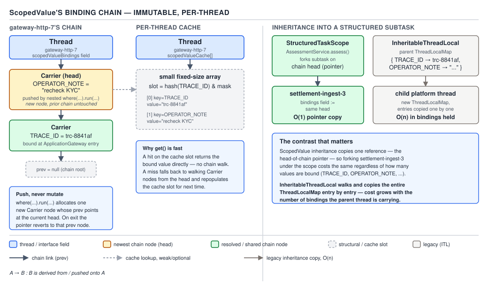

# 05 Multithreading and Concurrency — Virtual thread internals: cost, ThreadFlock and scoped values — INTERNALS (§3.12, leaves 3.12.20–3.12.22)

**Target version: Java 21 LTS.** | **Part 3 of 5** | [Index](../00-index.md)
Previous: [I/O, pinning and dumps](03b-internals-io-pinning-and-dumps.md) · Next: [Runtime observability](../observability/02-internals-runtime-observability.md)

03b covered the edges of the virtual-thread execution model: how I/O actually gets a
carrier back, and how `synchronized` used to defeat the whole scheme. This file covers
what makes the model *affordable* and *composable* at the scale QuizStakes actually runs
at — what a virtual thread costs in real memory, the runtime structure
(`ThreadContainer`/`ThreadFlock`) that both `StructuredTaskScope` and the thread dump
depend on, and the `ScopedValue` mechanism that lets state propagate through a fan-out
without `ThreadLocal`'s cost.

## Cost arithmetic: cheap, not free

**Mental model.** The pitch for virtual threads is "a thread per request/per unit of work,
no pooling required." That only holds up if a virtual thread is orders of magnitude
cheaper than a platform thread — the arithmetic is what proves or disproves the pitch.

**Why it matters.** A platform thread reserves roughly 1 MB of stack up front (the OS-level
default; tunable but rarely tuned down far because the JVM can't predict how deep a call
stack will go). A JVM cannot run tens of thousands of those without exhausting address
space and memory well before it exhausts CPU — this is precisely the ceiling that made
thread-per-request unworkable at QuizStakes' 55k-peak-concurrency scale before virtual
threads existed.

**When the arithmetic changes the design decision.** Whenever someone proposes "just spin
up a virtual thread per X" for very large X — per assessment sub-check, per ledger entry
in a `PaymentRun` batch, per row of a bulk import — the right question is not "is this
free?" but "what's X times the per-thread footprint, and does that fit in the heap budget
this service actually has?"

**How it works — what's actually allocated.** A virtual thread's resident cost is the sum
of: the `Thread`/`VirtualThread` object itself (a few dozen bytes of object header plus
fields — state, scheduler reference, interrupt flag), the `Continuation` object wrapping
it, and an *initial* `StackChunk` sized to whatever the call depth needs at first mount —
typically a few hundred bytes for shallow call chains, growing to a handful of kilobytes
for deeper ones, and reallocated (not fixed at 1 MB) as the call stack actually grows or
shrinks. `[PROVE]` this is why virtual threads can start at a few hundred bytes rather than
reserving anything close to a platform thread's stack: the `StackChunk` is a normal,
resizable heap array, not a fixed OS-level reservation.

`[NUM]` Put a number on it: **one million virtual threads at a 2 KB average `StackChunk`
size is 2 GB of heap** — real, GC-visible memory, not free. That's the exact shape of the
"cheap, not free" argument: 2 GB is a completely ordinary heap budget for a modern service,
so a million concurrent QuizStakes-scale units of work is *achievable*, but it is not zero,
and if the average `StackChunk` balloons — deep recursive call chains, large local
variables held across a park point — the multiplication stops being comfortable. A service
that naively forks one virtual thread per `LedgerEntry` in a multi-million-row `PaymentRun`
reconciliation, each holding a deep call stack across a blocking database call, can turn "a
few hundred bytes" into "several kilobytes" per thread and multiply its way into real GC
pressure — the fix is bounding concurrency (a `Semaphore` or a bounded
`StructuredTaskScope` fan-out width), not assuming the runtime absorbs any N for free.

**The gotcha.** "A few hundred bytes to a few KB" is a *starting* footprint, not a cap —
`StackChunk`s grow as the call stack grows and are retained as long as the virtual thread
is alive, so a virtual thread parked deep in a call chain (many nested method calls before
the blocking point) costs more resident memory than one parked near the top, for the exact
same amount of "real work" being done.

> A virtual thread costs a `Thread`/`VirtualThread` object, a `Continuation`, and a
> resizable heap-allocated `StackChunk` — typically a few hundred bytes to a few KB versus
> a platform thread's ~1 MB reserved stack — so a million of them land around 2 GB: cheap
> enough to enable thread-per-unit-of-work at scale, not so cheap that concurrency limits
> stop mattering.

## `ThreadContainer` / `ThreadFlock`: the structure that makes dumps and structured concurrency possible

**Mental model.** A `ThreadFlock` is a named, bounded group of threads with one owner —
think of it as the runtime-level bookkeeping object that `StructuredTaskScope` sits on top
of, the thing that actually tracks "these threads belong together and one thread is
responsible for all of them."

**Why it exists.** Before structured concurrency, an `ExecutorService.submit()` call
handed back a `Future` with no runtime-visible relationship to the thread that submitted it
— the JVM had no way to answer "which threads did this call site spawn, and are they still
running?" except by convention (naming, logging). `ThreadFlock` (package-private,
`jdk.internal.misc.ThreadFlock`) makes that relationship a first-class, queryable runtime
structure, which is exactly what both `StructuredTaskScope`'s shutdown/close discipline and
the JSON thread dump from 03b depend on.

**When it's the right level to think about.** You don't use `ThreadFlock` directly — it's
an internal type `StructuredTaskScope` is built on — but understanding it is the answer to
"how does the JVM know which threads belong to my `AssessmentService` scope" and "why does
closing a scope out of order throw." The sibling that *is* public API is
`StructuredTaskScope` itself; reach for `ThreadFlock`-level understanding only when
debugging structured-concurrency internals or explaining the dump structure, not when
writing application code.

**How it works.** A `ThreadFlock` tracks its live members in a
`ConcurrentHashMap.newKeySet()`-backed `Set<Thread>` (field `threads`), adding a thread in
its `onStart()` callback and removing it in `onExit()`, with a volatile `threadCount` kept
alongside for cheap emptiness checks during `awaitAll()`. Two guard methods enforce the
owner-thread rule that gives `StructuredTaskScope` its safety property: `ensureOwner()`
throws `WrongThreadException` if anything other than the owning thread calls `start()`,
`shutdown()`, `awaitAll()`, or `close()`; `ensureOwnerOrContainsThread()` relaxes that
slightly for operations a member thread is allowed to trigger on itself. The **LIFO-close**
rule — you must close scopes in the reverse order you opened them — is enforced by an inner
`ThreadContainerImpl` that pops itself off the *current thread's* stack of open containers
via `popForcefully()`; closing out of order finds the wrong container on top of the stack
and throws `StructureViolationException` rather than silently closing the wrong scope.
`containsThread(Thread)` walks the container hierarchy (a flock can nest inside a parent
flock, exactly the parent-link structure the JSON dump renders) to answer membership
queries used by both scoped-value inheritance checks and the dump.

**The gotcha.** `ThreadFlock` is why an `AssessmentService` scope that forks the identity
and watchlist subtasks *cannot* be closed by, say, a cleanup callback running on one of
those subtasks — only the owning thread (the one that opened the scope) can call `close()`,
which is exactly the ownership discipline `ensureOwner()` enforces, and exactly what makes
the JSON dump's `"owner"` field meaningful rather than arbitrary.

> `ThreadFlock` is the internal container type — a `ConcurrentHashMap`-backed thread set
> plus owner and LIFO-close enforcement — that `StructuredTaskScope` is built on, and it's
> the structure the JSON thread dump walks to render one container per scope with parent
> links.

## `ScopedValue` internals: an immutable binding chain plus a small cache

**Mental model.** A `ScopedValue.where(KEY, value).run(...)` doesn't push onto a mutable
per-thread map the way `ThreadLocal.set()` does. It builds one new immutable node — a
`Carrier` — linking to whatever bindings were already in effect, and runs the block with
that new chain installed. Nothing already in scope is ever mutated.

**Why it exists.** `ThreadLocal`'s `set()`/`get()`/`remove()` triad is a mutable per-thread
map: cheap to read, but every value ever set leaks until explicitly removed, and
propagating a value to a child thread (`InheritableThreadLocal`) means copying the entire
map — expensive, and a real problem at virtual-thread scale where "child thread" can mean
tens of thousands of `StructuredTaskScope` subtasks per second. `ScopedValue` (finalized as
JEP 506 in JDK 25; usable — as a preview/incubating API depending on exact release — from
Java 21 onward) is designed around the structured-concurrency shape specifically: a binding
that is installed for a bounded dynamic scope, visible only inside `run()`/`call()`, and
automatically and safely unwound the instant that call returns, with no `remove()` to
forget.

**When to reach for it, and when `ThreadLocal` still wins.** Reach for `ScopedValue` when
the value's lifetime is naturally scoped to a call — the current client's
`ClientRestrictions` snapshot for the duration of one `AssessmentService.assess()` call,
the current correlation ID for one request's `StructuredTaskScope` fan-out. Reach for (or
keep) `ThreadLocal` when the value's lifetime doesn't map to a single dynamic scope —
something that's set once per pooled platform thread and read across many unrelated tasks
on that same thread, which is a *thread-lifetime* concern `ScopedValue` isn't shaped for.

**How it works.** Binding state is represented by two linked, immutable structures: a
`Carrier` accumulates `where(...)` mappings (each holding the scoped-value key, its bound
value, a `bitmask` of affected cache slots, and a link to the previous `Carrier`), and a
`Snapshot` chains carriers together and provides `find()`, which walks the chain using the
bitmask to skip carriers that can't possibly hold the key being searched for — an
optimization so lookup cost stays roughly proportional to nesting depth actually relevant
to that key, not total bindings ever installed anywhere. `[SOURCE]`

`get()` is fast in the common case because of a small **per-thread cache** keyed on the
scoped value's hash: the hash maps to one of a small number of slots (cache size is 16 by
default, tunable 2–16 via the `java.lang.ScopedValue.cacheSize` property, with an
`INDEX_BITS` of 4 driving the power-of-two slot count), giving `get()` a fast path that's
close to a field read — check the cache slot, and only fall to walking the `Snapshot` chain
(`slowGet()`) on a miss, populating the cache afterward. `[PROVE]` this is the mechanism
that makes `ScopedValue.get()` competitive with `ThreadLocal.get()`'s direct map lookup
despite the underlying structure being an immutable linked list rather than a mutable map —
the cache absorbs the walk cost for repeated reads of the same binding within one dynamic
scope.

Inheritance into a `StructuredTaskScope` subtask is where the performance argument over
`InheritableThreadLocal` actually lands: a forked subtask simply receives a reference to
the parent's current `Snapshot` — a pointer copy — rather than copying every entry of a
map, so forking ten thousand `PaymentRun` reconciliation subtasks, each needing the current
correlation ID and `ClientRestrictions` snapshot, costs ten thousand pointer copies, not
ten thousand map copies. `[SOURCE]`



```java
private static final ScopedValue<ClientRestrictions> ACTIVE_RESTRICTIONS = ScopedValue.newInstance();
private static final ScopedValue<String> CORRELATION_ID = ScopedValue.newInstance();

ClientRestrictions restrictions = restrictionsRepository.load(clientId);

ScopedValue.where(ACTIVE_RESTRICTIONS, restrictions)
           .where(CORRELATION_ID, requestCorrelationId)
           .run(() -> {
    // Nested run() adds a new Carrier node to the chain; nothing above is mutated.
    try (var scope = StructuredTaskScope.open(StructuredTaskScope.Joiner.awaitAllSuccessfulOrThrow())) {
        // Each forked subtask inherits the current Snapshot by reference — a pointer copy —
        // so ACTIVE_RESTRICTIONS.get() and CORRELATION_ID.get() are visible with no map copy.
        Subtask<IdentityVerdict> identity = scope.fork(() ->
            identityVendorClient.verify(clientId, ACTIVE_RESTRICTIONS.get(), CORRELATION_ID.get()));
        Subtask<WatchlistVerdict> watchlist = scope.fork(() ->
            watchlistProvider.screen(clientId, ACTIVE_RESTRICTIONS.get()));

        scope.join();
        auditLog.record(CORRELATION_ID.get(), identity.get(), watchlist.get());
    }
});
```

**The gotcha.** A `ScopedValue` binding is only visible for the dynamic extent of the
`run()`/`call()` that installed it — store the `ScopedValue<T>` handle itself as a static
field (as above) or pass it around, but never try to read it from a thread that started
outside that `run()` call, including a detached thread launched with a raw
`Thread.ofVirtual().start()` instead of through the scope's fork — there is no binding to
inherit there, and `get()` throws `NoSuchElementException`.

> `ScopedValue` bindings form an immutable per-thread linked chain of `Carrier` nodes with
> a small hash-keyed cache making `get()` near-field-read speed, and a
> `StructuredTaskScope` subtask inherits that chain by copying a pointer to the current
> `Snapshot`, not by copying a map — the mechanism `InheritableThreadLocal` never had.

## Pitfalls

### Forking unbounded virtual threads because "they're basically free"

**Wrong**
```java
// Reconciling a multi-million-row PaymentRun, one virtual thread per LedgerEntry,
// each holding open a JDBC call and a moderately deep validation call stack.
try (var executor = Executors.newVirtualThreadPerTaskExecutor()) {
    for (LedgerEntry entry : paymentRun.entries()) {   // several million entries
        executor.submit(() -> reconciler.reconcile(entry));
    }
} // Heap pressure and GC pauses climb sharply well before CPU saturates.
```

**Right**
```java
// Bound the fan-out width explicitly — cheap is not free, and StackChunk size grows
// with call-stack depth, not just count.
Semaphore reconciliationConcurrency = new Semaphore(20_000);
try (var executor = Executors.newVirtualThreadPerTaskExecutor()) {
    for (LedgerEntry entry : paymentRun.entries()) {
        reconciliationConcurrency.acquire();
        executor.submit(() -> {
            try {
                reconciler.reconcile(entry);
            } finally {
                reconciliationConcurrency.release();
            }
        });
    }
}
```

**Why people believe it:** the "cheap, not free" number — 1M vthreads at 2 KB average is
2 GB — sounds like a green light for arbitrary N, but it's an *average* figure computed
against shallow call stacks; a `PaymentRun` reconciliation with a deeper validation chain
per entry pushes the real average well above 2 KB, and multiplying an unbounded N by an
underestimated per-thread cost is exactly how the heap budget gets blown.

### Reading a `ScopedValue` from a thread that wasn't forked through the scope

**Wrong**
```java
ScopedValue.where(CORRELATION_ID, requestCorrelationId).run(() -> {
    // Launched directly instead of forked through the enclosing StructuredTaskScope —
    // it never received the Snapshot pointer.
    Thread.ofVirtual().start(() -> auditLog.record(CORRELATION_ID.get(), "started"));
    // Throws NoSuchElementException: no binding is visible on this detached thread.
});
```

**Right**
```java
ScopedValue.where(CORRELATION_ID, requestCorrelationId).run(() -> {
    try (var scope = StructuredTaskScope.open(StructuredTaskScope.Joiner.awaitAllSuccessfulOrThrow())) {
        // Forked through the scope: the subtask inherits the current Snapshot by reference.
        scope.fork(() -> { auditLog.record(CORRELATION_ID.get(), "started"); return null; });
        scope.join();
    }
});
```

**Why people believe it:** `ScopedValue` reads look identical to `ThreadLocal` reads at the
call site (`SOME_VALUE.get()`), so it's easy to assume any new thread automatically "sees
whatever's currently in scope" the way a thread inheriting a copied `ThreadLocal` map
would — but there is no ambient propagation here, only a Snapshot reference handed
explicitly to threads started through a `StructuredTaskScope` fork.

## Cheat sheet

| Fact | Value / behaviour |
|---|---|
| Per-vthread footprint | Object + `Continuation` + resizable `StackChunk`, few hundred B – few KB |
| Platform thread footprint | ~1 MB reserved stack |
| Cost arithmetic | 1M vthreads × 2 KB avg = 2 GB heap |
| `ThreadFlock` member storage | `ConcurrentHashMap.newKeySet()`-backed `Set<Thread>` |
| `ThreadFlock` owner rule | `ensureOwner()` → `WrongThreadException` if not owner |
| LIFO-close enforcement | `ThreadContainerImpl.popForcefully()`, else `StructureViolationException` |
| `ScopedValue` structure | Immutable `Carrier`/`Snapshot` linked chain |
| `ScopedValue` cache | 16 slots default, 2–16 via `cacheSize` property, `INDEX_BITS=4` |
| Subtask inheritance | Pointer copy of current `Snapshot`, not a map copy |
| `ScopedValue` finalization | JEP 506, final in **JDK 25** |
| Structured concurrency status | Preview through JDK 25 (JEP 505, 5th preview) |

## Self-test

**Q1.** A capacity review estimates 1 million concurrent virtual threads for a future
QuizStakes peak, at an average 2 KB `StackChunk` size. What heap cost does that imply, and
why is "virtual threads are cheap" not the same claim as "virtual threads are free"?

<details><summary>Answer</summary>

1,000,000 × 2 KB = 2 GB of heap — a real, GC-visible allocation, not a rounding error.
"Cheap" compares favorably to a platform thread's ~1 MB reserved stack (which would put 1
million platform threads at roughly 1 TB, obviously impossible), but 2 GB is still a
concrete capacity-planning number: if the average `StackChunk` grows because call chains
before park points get deeper, or if concurrency is unbounded rather than designed for,
this cost scales linearly and can turn into real GC pressure. The distinction matters
because "free" would justify never bounding concurrency, while "cheap" still requires
sizing the number against the heap budget.

</details>

**Q2.** What data structure does a `ThreadFlock` use to track its member threads, and what
stops a non-owner thread from closing it?

<details><summary>Answer</summary>

A `ConcurrentHashMap.newKeySet()`-backed `Set<Thread>`, populated in the flock's
`onStart()` callback and pruned in `onExit()`. Closing (and starting, shutting down, and
awaiting) is gated by `ensureOwner()`, which throws `WrongThreadException` if the calling
thread isn't the one that opened the flock — this is the mechanism that guarantees only the
thread that opened a `StructuredTaskScope` can close it, which in turn is what the JSON
thread dump's `"owner"` field reflects.

</details>

**Q3.** Why is `ScopedValue` inheritance into a `StructuredTaskScope` subtask described as
"a pointer copy, not a map copy," and why does that matter at QuizStakes' scale?

<details><summary>Answer</summary>

The bound values for a thread are represented as an immutable chain of `Carrier` nodes
wrapped in a `Snapshot`. When a subtask is forked, it doesn't copy the individual key/value
entries into a new mutable structure the way `InheritableThreadLocal` copies its parent's
map — it just receives a reference to the same `Snapshot` object the parent currently has
installed, since that chain is immutable and safe to share. Forking ten thousand
`PaymentRun` reconciliation subtasks, each needing the current correlation ID and
`ClientRestrictions`, costs ten thousand reference assignments instead of ten thousand map
copies, which is the entire performance argument for `ScopedValue` over
`InheritableThreadLocal` at high fork rates.

</details>

**Q4.** How does `ScopedValue.get()` stay close to field-read speed despite the underlying
structure being a linked chain rather than a hash map?

<details><summary>Answer</summary>

Each thread keeps a small per-thread cache (16 slots by default, tunable 2–16) keyed by the
scoped value's hash code. `get()` checks the cache slot first; on a hit, that's the whole
cost, comparable to a field read. Only on a miss does it fall to `slowGet()`, which walks
the `Snapshot`'s chain of `Carrier` nodes using a bitmask to skip carriers that can't
possibly hold the key, and then populates the cache so subsequent reads of the same binding
hit the fast path.

</details>

**Q5.** Is structured concurrency (`StructuredTaskScope`) finalized in Java 21, and does
that affect anything written in this file?

<details><summary>Answer</summary>

No — structured concurrency remains a preview feature all the way through JDK 25 (JEP 505,
its fifth preview round), and `ScopedValue` itself was only finalized in JDK 25 (JEP 506).
None of this file's mechanism claims depend on finalization status: the `ThreadFlock`
internals, the `Carrier`/`Snapshot` binding chain, and the pointer-copy inheritance
behaviour described here are the preview implementation's actual internals on Java 21 and
are not expected to change shape before finalization, though exact API surface (such as
`Joiner` factory method names) is explicitly still subject to rename.

</details>

## Open questions

None — the two `[RESEARCH]`-tagged claims in this file (the `Carrier`/`Snapshot` walk and
`Snapshot` pointer-copy inheritance) were checked directly against the current
`ScopedValue.java` and `ThreadFlock.java` sources; no unresolved gaps remain.

---

**Leaves covered:** 3.12.20–3.12.22 (3 leaves)
**Leaves deferred:** none
**Diagrams included:** D-194
**Target version:** Java 21 LTS
**Lines:** 300
