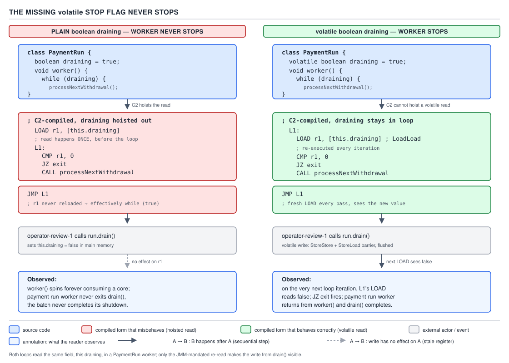

# 05 Multithreading and Concurrency — volatile and the JMM — BASICS (§1.9, leaves 1.9.1–1.9.7)

**Target version: Java 21 LTS.** | **Part 1 of 5** | [Index](../00-index.md)
Previous: [synchronized](../synchronized/01-basics.md) · Next: [volatile — cost, arrays and the publication idiom](01b-basics-volatile-cost-and-arrays.md)

`volatile` is the smallest correctness tool in the concurrency toolbox and the most
over-claimed. This file covers the three things it actually guarantees, the two beliefs
that must die before anything else in this topic makes sense, and the QuizStakes use that
shows the line between "this is enough" and "this needs a lock or an atomic".

The running example: a `PaymentRun` worker draining a batch of bank withdrawals until an
operator signals a stop.

---

### What `volatile` gives, and what it does not

**Mental model.** A `volatile` field is a field where every read is a "get me the current
truth" and every write is a "publish this now" — not a field that lives in a special
main-memory-only location. Nothing about *where* the bits sit changes. What changes is a
promise the compiler and the runtime make about *ordering and visibility* around that field.

**Why it exists.** Before `volatile` was fixed by JSR-133 (Java 5), a thread reading a
`boolean` flag set by another thread had no guarantee of ever seeing the new value, and the
JIT was free to cache the field in a register and never re-read it. Making every field
access go through `synchronized` fixes that but costs a lock acquisition on every read.
`volatile` buys visibility and ordering for a single field at the cost of a cheap read and a
moderately expensive write — no mutual exclusion, no queueing, no blocking.

**When to reach for it, and when not.** Reach for `volatile` when exactly one thread writes
and any number of threads read, and the value being published does not depend on its own
previous value — a status flag, a one-shot reference, a "done" signal. Do **not** reach for
it when two or more threads write, when the new value is computed from the old value
(`count++`, `total += x`), or when more than one field must change together atomically. Its
sibling `AtomicInteger`/`AtomicLong`/`AtomicReference` wins whenever a compound
read-modify-write is needed on a single field; `ReentrantLock` or `synchronized` wins when
several fields must change as one unit — see the `PaymentRun` example below, where
`draining` alone is safe as `volatile` but the run's cursor and its withdrawal count are not.

**How it works — the three things `volatile` actually gives (1.9.1).**

1. **Visibility.** A read of a volatile field always returns the value written by the most
   recent write to it in the synchronization order — never a thread-local stale copy, and
   the JIT is not permitted to hoist the read out of a loop or cache it in a register across
   iterations (1.9.2). This is a promise about *program order and the compiler's freedom*,
   not about a hardware address. The JLS states it in terms of the *happens-before* relation
   (JLS §17.4.5): a write to a volatile variable happens-before every subsequent read of that
   same variable. The JDK's own `jdk.internal.misc.Unsafe` implements the field access with
   `putVolatile`/`getVolatile` intrinsics — the JIT recognizes these and refuses to reorder
   or eliminate them, which is the actual mechanism behind "the JIT may not hoist the read".
2. **Ordering.** A volatile write happens-before every subsequent volatile read of the same
   field, and — this is the part that makes it a publication mechanism, not just a flag —
   everything the writing thread did *before* the write becomes visible to the reading
   thread *after* the read (1.9.3). Work the argument through: happens-before is transitive.
   If thread W does `a = 1; b = 2; draining = false /* volatile write */;` and thread R does
   `if (!draining /* volatile read */) { read a; read b; }`, then program order gives
   `a=1 hb b=2 hb draining=false`, the volatile rule gives `draining=false hb (draining read)`,
   and program order in R gives `(draining read) hb (read a); (read a) hb (read b)`. Chaining
   all of these, `a=1` and `b=2` happen-before the reads of `a` and `b` in R, even though `a`
   and `b` are plain fields with no synchronization of their own. This is why `volatile`
   publishes *everything visible to the writer*, not merely its own field — the mechanism the
   cost-and-publication note covers next calls the "piggyback rule".
3. **64-bit atomicity.** A single read or write of a `long` or `double` field is guaranteed
   atomic when the field is `volatile`. Without `volatile`, the JVM spec permits a 64-bit
   field to be split into two 32-bit stores (JLS §17.7), so a concurrent reader could observe
   half of one write and half of another — "word tearing". In practice every mainstream JVM
   on every mainstream CPU treats plain `long`/`double` as atomic too, but that is an
   implementation kindness, not a spec guarantee; only `volatile` (or `Atomic*`, or a lock)
   makes it a promise you can rely on.

**What it does not give (1.9.4).** `volatile` gives none of these:

- **Atomicity of compound operations.** `volatile int count; count++;` is still a
  read-modify-write of three separate steps — read `count`, add one, write `count` — and two
  threads can interleave between the read and the write of either. It is exactly as broken
  as a plain `int`; `volatile` makes each of the three steps individually visible and
  ordered, but does nothing to glue them into one atomic step.
- **Mutual exclusion.** No thread ever blocks on a `volatile` field. Two writers can and will
  race; the field simply ends up holding whichever write happened last in real time, with no
  serialization between them.
- **Correctness for a group of fields.** `volatile` is a per-field promise. Marking three
  related fields all `volatile` does not make changing them together atomic — a reader can
  observe field one updated and field two not yet, because there was never a single
  transaction, only three independent publications.

| Access | Guaranteed / not | Reason | Correct alternative |
|---|---|---|---|
| Visibility of a single `volatile` field | Guaranteed | Read returns the value of the synchronization-order-latest write; JIT cannot hoist or cache it | — (this is what `volatile` is for) |
| Ordering with surrounding accesses | Guaranteed | Volatile write happens-before subsequent volatile read; everything before the write is visible after the read | — (piggyback rule, next file) |
| 64-bit atomicity (`long`/`double`) | Guaranteed | JLS forbids word-tearing on a `volatile` 64-bit field | — |
| Compound `count++` | **Not guaranteed** | Read-modify-write is three separate memory operations; a race can land between any two of them | `AtomicInteger`, or a lock around the whole read-modify-write |
| Array elements accessed through a volatile reference | **Not guaranteed** | The reference publish is atomic and visible; each element write is a plain, unsynchronized store | `AtomicIntegerArray` / `AtomicReferenceArray`, or a `VarHandle` with volatile element access |
| Fields of a mutable object reached through a volatile reference | **Not guaranteed** | Same shape as the array case — the pointer is safely published, the pointee's fields are not | Make the object immutable, or guard its mutation with a lock, or use `VarHandle`/`Atomic*` fields inside it |

**D-031** — What `volatile` gives and what it does not. (The array-element and
mutable-object-field rows above are proven in full, with code, in the next file —
[volatile — cost, arrays and the publication idiom](01b-basics-volatile-cost-and-arrays.md).)

**A minimal concrete example.** A `PaymentRun` worker drains queued bank withdrawals until an
operator signals a stop. One field, single-writer (the operator thread), many-reader (the
worker loop) — the textbook shape for `volatile`.

```java
public final class PaymentRunWorker implements Runnable {

    private final PaymentRun run;
    private final BankWithdrawal withdrawal;
    private volatile boolean draining = true;

    public PaymentRunWorker(PaymentRun run, BankWithdrawal withdrawal) {
        this.run = run;
        this.withdrawal = withdrawal;
    }

    @Override
    public void run() {
        while (draining) {
            Optional<WithdrawalTransaction> next = run.nextQueued();
            if (next.isEmpty()) {
                draining = false; // batch exhausted; publish our own stop
                break;
            }
            withdrawal.submitToPaymentRun(next.get());
        }
    }

    /** Called from the operator thread via InternalPlatforms. */
    public void requestStop() {
        draining = false;
    }
}
```

`draining` alone is safe as `volatile` because exactly one fact — "keep going or not" — is
being published, and no thread ever needs to combine its old value with a new one. The
moment the worker also needs to track *how many* withdrawals it has drained so far as a
running total read by another thread, that counter needs `AtomicLong`, not `volatile` —
that is the read-modify-write problem from 1.9.4 again, now inside the same class.

**The gotcha.** It is tempting to think adding `volatile` to *more* fields makes a class
"more thread-safe". A class with five `volatile` fields that must change together is not
safer than one plain field — it has five independent publication points and zero atomicity
across them. Grouping related mutable state into one immutable value object and publishing
*that* through a single `volatile` reference is almost always the fix (this is exactly the
"safe-publication reference" use covered next).

> **Definition.** `volatile` guarantees that every read of the field observes the most
> recently written value and that the write happens-before that read, together with
> everything the writer did beforehand — nothing else.

---

### The four correct uses, and the wrong ones (1.9.6)

Supporting fact, not a fresh mechanism — everything here follows directly from the
guarantee above.

**Mechanism.** JCiP (Goetz et al., *Java Concurrency in Practice*, item 3.4) names four
patterns where the visibility-plus-ordering guarantee is *sufficient by itself*: a
stop/status flag (the `draining` field above); a one-way state transition that is never
read-then-written by the same logic (a field that moves `PENDING → SETTLED` once); a
safe-publication reference (publish a fully-constructed immutable object through one
`volatile` field so every reader sees a consistent snapshot); and the reference half of
double-checked locking (covered alongside `synchronized`/DCL). Two secondary patterns from
the same source: "independent observation", where a monitoring thread reads a `volatile`
snapshot that is allowed to be stale by design (a dashboard polling
`CLIENT_CASH_AVAILABLE` for display, never for a debit decision — the same distinction
`BalanceView` draws against `FundsLedger`); and the "cheap read-write lock" trick, where one
field is guarded by a full lock for writers but read unlocked as `volatile` by a fast-path
reader that can tolerate a slightly stale value.

**Gotcha.** All four patterns share the same shape: the field's new value never depends on
its old value, and no second field must change atomically with it. The wrong uses are
exactly the read-modify-write shapes from 1.9.4 above — counters (`activeSessions++`),
accumulators (`totalStaked += stake.amount()`), and anything computed from a prior read of
the same field, like a running average or a monotonic sequence generator.

> **Definition.** `volatile` is correct precisely for single-writer publication of an
> independent fact; it is wrong for anything the reader must combine with the field's own
> previous value.

---

### Trap — the "flushes to main memory" myth (1.9.5)

**Mental model.** Older material — and a large fraction of blog posts still online — says
`volatile` reads and writes "go to main memory, never a thread-local cached copy," as if
`volatile` flips a switch that routes the field's bytes around the CPU cache entirely.
Picture instead: the cache is never bypassed. What changes is a **fence** around the access.

**Why the myth is wrong.** The JLS never mentions caches. §17.4.5 defines `volatile`
entirely in terms of the happens-before relation between actions in different threads — a
purely logical ordering guarantee, silent on hardware. Restated in those terms: *a write to
a volatile field happens-before every subsequent read of that field by another thread, and
by transitivity, every action that happens-before the write also happens-before the read.*
That is the whole guarantee. Nothing in it says "bypass L1", because the guarantee has to
hold on hardware with no concept of "main memory" as a single flat store that every core
reads from directly.

**The store-buffer / invalidate-queue reality.** Modern CPUs already keep caches coherent
across cores via a coherence protocol (MESI and its variants) — a cache line is never
silently stale forever; coherence traffic will eventually invalidate or update it. The
problem `volatile` actually solves is **reordering**, not staleness: a core can post a write
into its store buffer and continue executing later instructions before that write drains to
its own cache, and a core can sit on invalidation messages in an invalidate queue before
applying them, letting a stale read slip through in the meantime. A `volatile` write, on
x86-64, emits a full **StoreLoad** fence — practically, a `lock`-prefixed instruction — that
forces the store buffer to drain before any subsequent load is allowed to execute. A
`volatile` read on most architectures needs a lighter fence (the cost of each side, in full,
is worked out in the next file). MESI made caches *consistent*; `volatile` makes *this
thread's program order* visible to *that thread's program order*, which is a different,
additional guarantee that coherence alone does not provide.

**Pitfall:** believing "volatile bypasses the cache" leads to predicting the wrong
performance and the wrong failure mode. The visible symptom of *not* using `volatile` is
never "the other thread reads garbage from a half-flushed cache line" — MESI already
prevents that kind of corruption. The real symptom is a thread observing writes in a
different order than the writer made them, or an old value long after the new one was
written, because nothing forced the fence that would have ordered the two threads' views.
Treating `volatile` as a cache-bypass switch also invites the false belief that a plain field
read inside a tight loop is "eventually" refreshed by the cache on its own — it is not; the
JIT is free to keep it in a register forever, which is exactly the bug in the next section.

> **Definition.** `volatile` establishes happens-before ordering between a write and
> subsequent reads across threads; cache coherence already keeps the caches themselves
> consistent, and was never the problem `volatile` exists to solve.

---

### The hoisted stop flag never stops (1.9.7)

**Mental model.** Delete `volatile` from `draining` in the worker above and the loop can run
forever even after the operator calls `requestStop()` — not occasionally, not on unlucky
hardware, but reliably once the JIT compiles the method with the optimizing compiler (C2).

**Why it exists.** This is not a theoretical hazard; it is the direct, provable consequence
of what a plain field read is allowed to mean. Without `volatile`, nothing in the JLS says
the JIT must re-read `draining` from memory on every loop iteration. Loop-invariant code
motion is one of C2's standard optimizations: if the compiler can prove nothing *in this
thread* changes `draining` inside the loop body, it is entitled to read the field once,
before the loop starts, and reduce the loop to an unconditional `while (true)`.

**How it works — proving it, not asserting it.** Take the same worker with `draining` as a
plain `boolean`:

```java
private boolean draining = true; // BROKEN — no volatile

public void run() {
    while (draining) {
        // drain one withdrawal
    }
}
```

C2 is free to hoist the read because, from the compiler's point of view, `run()` never
writes `draining`, and the JLS gives it no obligation to assume another thread might. The
JIT-compiled form is, in effect:

```
; pseudo-assembly after C2 hoists the read
    mov  eax, [this.draining]   ; read ONCE, before the loop
    test eax, eax
    jz   done
loop:
    ; drain one withdrawal — no re-read of draining anywhere in here
    jmp  loop
done:
    ret
```

The load of `draining` happens exactly once. `requestStop()` on the operator thread still
writes the field — the memory location genuinely changes — but the worker thread's compiled
code never looks at that location again. This is reproducible in minutes on a real JVM: run
the un-annotated version with `-server` (C2 default) under any load, call `requestStop()`
from another thread, and the loop does not exit, because the running native code has no
instruction left that reads the field.



**D-032** — The missing-`volatile` stop flag never stops.

With `draining` declared `volatile`, C2 is barred from performing this hoist at all — the
`getVolatile` intrinsic is a compiler barrier as well as a hardware one, so the read must
stay textually inside the loop on every iteration:

```java
private volatile boolean draining = true; // FIXED

public void run() {
    while (draining) {
        // drain one withdrawal
    }
}
```

```
; with volatile — the read is pinned inside the loop
loop:
    mov  eax, [this.draining]   ; re-read every iteration
    test eax, eax
    jz   done
    ; drain one withdrawal
    jmp  loop
done:
    ret
```

**The gotcha.** The bug is invisible under `-Xint` (interpreter only) and often invisible in
a short-lived unit test, because the interpreter re-reads every field access regardless and
C2 needs enough invocations to trigger compilation first. It shows up in production, under
sustained load, exactly when an operator most needs the stop signal to work.

**Interview:** *"You declared a stop flag as a plain `boolean` and the worker never stops —
why?"* — because C2 is entitled to prove the field is never written inside the loop's own
thread and hoist the read above the loop, turning it into `while (true)`; only `volatile`
(or a lock, or an `Atomic*`) forces the compiler to re-read it every iteration.

> **Definition.** A plain field read inside a loop may be compiled once and never repeated;
> `volatile` is what forces the JIT to keep re-reading it on every iteration.

---

## Pitfalls

### Assuming "volatile flushes to main memory" predicts performance correctly

**Wrong**

```java
// Reasoning: "volatile bypasses the cache, so every access should be about as
// expensive as an L3 miss or a memory round-trip."
private volatile boolean draining;
```

Under this belief, a developer avoids `volatile` reads in a hot loop expecting a memory
round-trip on every check — then over-engineers around a cost that does not exist, or worse,
removes `volatile` "for performance" and reintroduces the hoisted-read bug from this file.

**Right**

```java
private volatile boolean draining; // read cost ≈ plain read; only writes are pricier
```

Reads of a `volatile` field cost about the same as a plain read on mainstream hardware — the
guarantee is ordering via happens-before, enforced by a compiler barrier plus (where the
hardware needs it) a cheap acquire-style fence, not a trip to a slower memory tier. Only the
write side carries a real, StoreLoad-fence-driven cost (worked out in full in the next file).

**Why people believe it:** older textbooks and JLS pre-JSR-133 discussions used
"main-memory" language loosely because there was no widely taught vocabulary for
store-buffers, invalidate-queues, or happens-before at the time, and the phrase stuck.

---

## Cheat sheet

| Question | Answer |
|---|---|
| What does `volatile` guarantee? | Visibility of the latest write + happens-before ordering + 64-bit atomicity |
| What does it not guarantee? | Atomicity of compound ops; mutual exclusion; multi-field consistency |
| Correct uses | Stop flag, one-way transition, safe-publication reference, DCL reference, independent observation, cheap R/W lock |
| Wrong uses | Counters, accumulators, anything derived from the field's own old value |
| Cache-flush myth | False — MESI keeps caches coherent already; volatile fixes reordering/staleness via happens-before, not cache bypass |
| Missing volatile on a loop flag | JIT (C2) may hoist the read out of the loop → infinite loop, reproducible |
| `count++` on a volatile field | Still broken — three separate ops, not one atomic step |
| Piggyback rule | Covered in the next file, alongside cost and array/reference traps |

## Self-test

**Q1.** What are the three things `volatile` guarantees for a single field?

<details><summary>Answer</summary>

Visibility (a read always returns the most recently written value, and the JIT cannot hoist
or cache the read across iterations), ordering (a volatile write happens-before every
subsequent volatile read of the same field, and everything visible to the writer before the
write becomes visible to the reader after the read), and 64-bit atomicity (a `long`/`double`
read or write cannot be torn into two 32-bit halves).

</details>

**Q2.** Why is `volatile int count; count++;` still broken even though every access is
volatile?

<details><summary>Answer</summary>

`count++` is read, add one, write — three separate operations. `volatile` makes each of the
three individually visible and ordered, but does nothing to prevent another thread's
read-modify-write from interleaving between any two of them. Two threads can both read the
same value, both increment it, and both write back the same result, losing one increment.

</details>

**Q3.** What is wrong with the claim "volatile writes flush to main memory, bypassing the
cache"?

<details><summary>Answer</summary>

The JLS never mentions caches — the guarantee is happens-before ordering. Hardware caches
are already kept consistent by coherence protocols like MESI; the actual problem `volatile`
solves is reordering caused by store buffers (a write sitting in the writer's store buffer
before it drains) and invalidate queues (a reader delaying application of an invalidation),
not stale cached bytes. Believing the myth leads to predicting the wrong performance: it
suggests every volatile access is memory-round-trip expensive, when in fact reads are
essentially free and only writes carry a real fence cost.

</details>

**Q4.** Given `while (draining) { ... }` with `draining` as a plain (non-volatile) `boolean`,
why can this loop run forever even after another thread sets `draining = false`?

<details><summary>Answer</summary>

C2 is allowed to prove that nothing in the loop body's own thread writes `draining`, and is
therefore entitled to read it once before the loop and compile the loop as `while (true)`,
because the JLS gives the compiler no obligation to assume a plain field can change from
another thread. The write from the other thread still happens in memory, but the running
compiled code has no remaining instruction that reads that memory location again.

</details>

**Q5.** Name the four patterns from JCiP where `volatile`'s guarantee is sufficient by
itself, with no lock or atomic needed.

<details><summary>Answer</summary>

A stop/status flag; a one-way state transition never read-then-written by the same logic; a
safe-publication reference (publish a fully-constructed immutable object through one
`volatile` field); and the reference half of double-checked locking. (Two secondary
patterns: independent observation of a snapshot allowed to be stale by design, and the cheap
read-write-lock trick for a fast-path reader that tolerates staleness.)

</details>

**Q6.** A class has five `volatile` fields that must all change together to represent one
consistent state transition. Is it thread-safe?

<details><summary>Answer</summary>

No. `volatile` is a per-field promise — each field is individually visible and ordered, but
there is no atomicity across the five. A reader can observe field one already updated and
field two still holding its old value, because five independent publications occurred, never
one transaction. The fix is to group the related state into one immutable object and publish
that object through a single `volatile` reference.

</details>

---

**Leaves covered:** 1.9.1–1.9.7 (7 leaves)
**Leaves deferred:** none
**Diagrams included:** D-031, D-032
**Target version:** Java 21 LTS
**Lines:** 456
