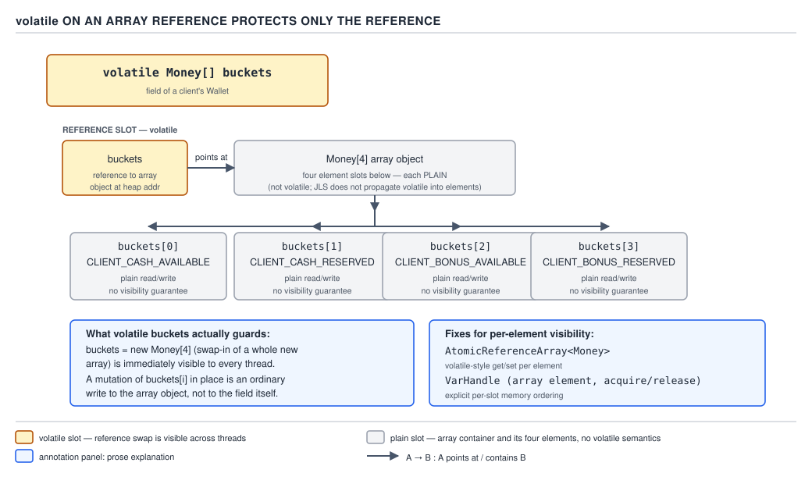

# 05 Multithreading and Concurrency — volatile and the JMM — BASICS (§1.9, leaves 1.9.8–1.9.14)

**Target version: Java 21 LTS.** | **Part 1 of 5** | [Index](../00-index.md)
Previous: [volatile — what it gives](01-basics-volatile.md) · Next: [The Java Memory Model — happens-before](02a-basics-happens-before.md)

The previous file established what `volatile` actually buys: visibility and ordering, not
atomicity. This file is the flip side — where that guarantee runs out, what it costs to get it,
and the one idiom that turns a single volatile write into a publication event for an entire object
graph.

---

### The wrong uses: counters, accumulators, and anything whose new value depends on the old

**Mental model.** `volatile` gives you a guarantee about a single read and a single write, each
seen in isolation by every thread. It says nothing about the gap between reading a value and
writing the next one. A counter increment is not one operation — it is a read, a computation, and
a write, and `volatile` protects none of the seams.

**Why people reach for it anyway.** `volatile long count` compiles, runs, and looks correct in
every manual test, because a single thread never races with itself and low-contention runs rarely
surface the interleaving. The field visibly changes across threads, which reads as "it's working."
It is working for visibility. It has never worked for correctness of the arithmetic.

**When it is right, when it is not.** `volatile` is right for a flag threads publish and other
threads observe — a shutdown signal, a "config reloaded" epoch, a status code that only ever moves
forward and where any single writer's most recent value is the whole truth. It is wrong the moment
two threads can observe the same old value and both compute from it, because the field's *next*
value depends on its *current* value and nothing enforces that only one thread performs that
read-compute-write at a time.

**Mechanism.** Consider `PaymentService` tracking how many stake reservations it has processed for
alerting:

```java
public final class ReservationCounter {
    private volatile long processed = 0;

    public void recordReservation() {
        processed = processed + 1;   // read, add, write — three steps, no atomicity
    }

    public long processed() {
        return processed;
    }
}
```

Two threads calling `recordReservation()` at the same instant both read `processed == 3400`, both
compute `3401`, and both write `3401`. One increment vanishes. At QuizStakes' burst rate of 3,400
settlements/sec through this kind of shared counter, the gap is wide open thousands of times a
second, and the miscounted total is silent — no exception, no log line, just a number that is
quietly wrong under load and exactly right in every single-threaded test that convinced someone it
worked.

The fix is not a bigger hammer on the same field — it is a type built for compound updates:
`AtomicLong` for the counter, `LongAdder` if contention on that one field becomes the bottleneck
(the padding at day 13 that spreads writes across cells). Both give the same visibility `volatile`
gives, plus an atomic `incrementAndGet`/`add` that closes the read-compute-write gap the field
alone cannot close.

**Pitfall:** believing `volatile` makes `count++` safe because the field visibly updates in a demo.
The symptom is a counter that undercounts only under concurrent load, in production, at the exact
throughput a demo never reaches. The fix is `AtomicLong`/`LongAdder` for anything whose new value
is a function of its old value — a counter, a running total, a max-seen watermark, a
compare-and-conditionally-replace.

**Interview:** "Is `volatile int count; count++;` thread-safe?" — no; `count++` is
read-modify-write, `volatile` only makes each of those three steps individually visible, not the
triple atomic. Use `AtomicInteger`.

> **`volatile` is not for anything whose next value is computed from its current value under
> concurrent access — that needs an atomic type or a lock, because `volatile` protects individual
> reads and writes, not the sequence between them.**

---

### `volatile` on an array reference protects only the reference

**Mental model.** A `volatile` field is a single memory slot with a guarantee stamped on it. When
that slot happens to hold a reference to an array, the guarantee stops at the pointer. The array's
elements live in a separate block of memory that the field does not own and the JMM does not touch
just because the field pointing at it is volatile.

**Why it exists / why the confusion.** `volatile T[] arr` reads exactly like `volatile T field` in
source, so it is natural to expect the same blanket coverage. But `arr = newArray` is a write to
the field — one slot, one guarantee. `arr[2] = value` is a write to element 2 of whatever array the
field currently references — a completely different memory location that the field's volatile-ness
never mentions.

**When each form is right.** Reassigning the whole array (`buckets = newBuckets`, publishing a
freshly built snapshot) is exactly what a volatile reference is for — safe publication of the new
array to every reader. Mutating elements in place (`buckets[i] = newValue`) gets none of that
protection; a reader can see the new array reference but a stale or torn value at index `i`,
because plain reads and writes of `T[i]` have no happens-before edge with each other at all.

**Mechanism.** Model a wallet's four ledger positions as a `volatile` array field on the client's
balance view:

```java
public final class WalletSnapshot {
    private volatile Money[] buckets = new Money[] {
        Money.zero(Currency.GBP), // CLIENT_CASH_AVAILABLE
        Money.zero(Currency.GBP), // CLIENT_CASH_RESERVED
        Money.zero(Currency.GBP), // CLIENT_BONUS_AVAILABLE
        Money.zero(Currency.GBP)  // CLIENT_BONUS_RESERVED
    };

    static final int CASH_AVAILABLE = 0;
    static final int CASH_RESERVED = 1;
    static final int BONUS_AVAILABLE = 2;
    static final int BONUS_RESERVED = 3;

    // SAFE: reassigns the reference — every reader sees either the old
    // array in full or the new array in full, never a mix of the two.
    public void replaceSnapshot(Money[] freshBuckets) {
        this.buckets = freshBuckets;
    }

    // UNSAFE: mutates an element through the volatile reference — this
    // write has no ordering guarantee with a concurrent read of buckets[i].
    public void creditCashAvailableUnsafe(Money amount) {
        buckets[CASH_AVAILABLE] = buckets[CASH_AVAILABLE].plus(amount);
    }

    public Money cashAvailable() {
        return buckets[CASH_AVAILABLE];
    }
}
```

`replaceSnapshot` is the correct use — it swaps the whole reference, so `BalanceView` reading
`buckets` at any moment sees a fully-formed array, one generation or the next, never a partial
build. `creditCashAvailableUnsafe` is the trap — the array object itself carries no volatile
semantics on its cells, so a concurrent reader of `buckets[CASH_AVAILABLE]` has no happens-before
edge to that write and may see a stale `Money`.



**D-034** — `volatile` on an array reference protects only the reference.

The fix for per-element visibility without a lock is `AtomicReferenceArray<Money>`, which gives
every element `getVolatile`/`setVolatile` semantics individually, or a `VarHandle` obtained with
`MethodHandles.arrayElementVarHandle(Money[].class)` and used with `VarHandle.setVolatile`/
`getVolatile` on the array in place. Both make each *element* the unit of visibility instead of
only the reference.

**Pitfall:** treating `volatile Money[] buckets` as if it volatile-protects `buckets[i]`. The
symptom is a `BalanceView` that shows a fresh array publication correctly but occasionally renders
a stale individual bucket value after an in-place credit. The fix is `AtomicReferenceArray` or a
`VarHandle` array accessor for element-level updates, reserving the plain volatile field for
whole-array replacement.

**Interview:** "Does `volatile` make an array thread-safe?" — no, it makes the *reference*
thread-safe; the elements need `AtomicReferenceArray`, a `VarHandle`, or a lock.

> **A `volatile` array field guarantees safe publication of the array object, and says nothing
> about the elements inside it — those need `AtomicReferenceArray`, `VarHandle`, or a lock.**

**`volatile` on a reference to a mutable object publishes the reference safely but says nothing
about later mutations of its fields.** Same shape of trap as the array case, one level up: a
`volatile Reservation reservation` field guarantees that whichever `Reservation` object a reader
sees was fully constructed before the write — but if some other thread later calls a setter on that
same `Reservation` instance without going through another volatile write, readers have no ordering
guarantee they will see that mutation at all. The practical answer QuizStakes uses is to make the
published object immutable (a record) so "publish" and "mutate" can never be separated — see the
publication idiom below, which is exactly this pattern done correctly. **Pitfall:** publishing a
mutable object once through a volatile field and then continuing to mutate it in place, assuming
the original volatile write keeps covering every later change — it does not; only the write itself
is ordered, not everything that happens to the object afterward.

> **A volatile write publishes the object as it was at the moment of the write — later in-place
> mutation of that same object carries no such guarantee unless it happens through another
> volatile write (or an equivalent happens-before edge).**

**`volatile` is illegal on `final` fields and on local variables.** The compiler rejects
`volatile final Money limit` outright — `final` promises the value never changes after
construction, `volatile` exists to manage *changing* values across threads, and the JLS treats the
combination as contradictory rather than merely redundant. Locals are barred for a simpler reason:
`volatile` is about cross-thread visibility, and a local variable's storage (typically a stack slot
or a register) is never shared across threads in the first place — there is nothing for the
modifier to apply to. **Gotcha:** a `final` field already gets a safe-publication guarantee for
free, from the JMM's special final-field freeze rule at constructor exit — `volatile` was never
needed there, which is part of why the JLS bans stacking them.

> **`volatile final` fails to compile because `final` already rules out changing values, and
> `volatile` on a local variable is meaningless because locals are never shared between threads.**

---

### The cost: a volatile read is free, a volatile write is not

**Mental model.** Picture two very different-sized locks. A volatile *read* costs the same as an
ordinary field read on every mainstream JVM target — no hardware fence is emitted for it at all on
x86 or AArch64, because the hardware already gives loads acquire-like ordering with respect to
later operations on these architectures. A volatile *write* is the expensive half: it must stop the
store from being reordered past a later load, and no ordinary store instruction can promise that on
its own, so the compiler emits an extra barrier-carrying instruction after it.

**Why the asymmetry exists.** The JMM requires four barrier types around volatile access:
StoreStore and LoadLoad/LoadStore come essentially free on x86 and AArch64 because those
architectures' own memory models already forbid the reorderings those barriers would prevent. The
one reordering that both architectures *do* allow — a later load moving ahead of an earlier store
(StoreLoad) — is exactly the one the JMM must forbid around a volatile write, and no plain store
instruction expresses that restriction. Sequential consistency for volatiles is the promise; a
full StoreLoad fence after every volatile write is the tax that promise imposes.

**When the cost matters.** It rarely matters for a single volatile write on an uncontended path —
the absolute cost is a handful of nanoseconds. It matters when a volatile write sits in a hot loop
processing at QuizStakes' 3,400 settlements/sec burst rate, or when a field is written far more
often than read, because every one of those writes pays the StoreLoad tax while every read on the
other side pays nothing. That asymmetry is the argument for reaching for `LongAdder` over a single
`volatile`/`AtomicLong` counter under write-heavy contention (day 13) — spreading the expensive
side across cells, not for eliminating it.

**Mechanism, instruction by instruction.** `[ASM]` The JSR-133 cookbook and current HotSpot code
generation agree on the shape, though the exact instruction chosen for the StoreLoad fence is an
implementation choice, not a JLS mandate:

- **x86-64 volatile read** compiles to a plain `mov` — no fence. Loads on x86-TSO already have
  acquire-like behavior with respect to later loads and stores.
- **x86-64 volatile write** compiles to a `mov` immediately followed by a fence-equivalent
  instruction — historically `mfence`, and in HotSpot specifically a locked no-op,
  `lock addl $0,0(%rsp)` (touching the top of stack rather than the field, purely to get a
  lock-prefixed instruction cheaply). The `lock` prefix is what forces the StoreLoad ordering: no
  later load on that core can execute until the locked instruction retires.
- **AArch64 volatile read** compiles to `ldar` (load-acquire) — a single instruction with built-in
  acquire semantics, no separate `dmb` barrier needed since HotSpot's post-JDK-9 codegen switched
  from `ldr` + `dmb` to `ldar`/`ldapr` directly.
- **AArch64 volatile write** compiles to `stlr` (store-release) — a single instruction with
  built-in release semantics, replacing an older `dmb` + `str` sequence.

`[PROVE]` The read side needing no fence follows from the hardware model itself, not from a JVM
optimization: x86-TSO already forbids reordering a load ahead of an earlier load, and forbids
reordering any load ahead of an earlier store *to the same address* — the JMM's LoadLoad and
LoadStore requirements around a volatile read are already satisfied before the JVM emits a single
instruction. On AArch64, `ldar` was purpose-built by the architecture to give exactly the
acquire ordering Java needs, again as a single load with no companion fence. The write side has no
such free ride: StoreLoad — "no load after this store may become visible before the store does" —
is not implied by any ordinary store on either architecture, so an explicit fence-carrying
instruction (`lock addl`/`xchg` on x86, `stlr`'s built-in release, which HotSpot verified via
`8179954` is strong enough to be sequentially consistent on AArch64) is unavoidable.

`[NUM]` The concrete comparison, as order-of-magnitude, never as measured constants — no
authoritative per-instruction cycle table exists across microarchitectures:

**D-033** — Volatile read is free; volatile write is not.

| Access | Instruction emitted | Barrier implemented | Cost |
|---|---|---|---|
| x86-64 volatile read | `mov` | none (LoadLoad/LoadStore already free on x86-TSO) | same order of magnitude as a plain read |
| x86-64 volatile write | `mov` + `lock addl $0,(%rsp)` (or `xchg`) | StoreLoad | roughly the order of magnitude of an uncontended CAS |
| AArch64 volatile read | `ldar` | LoadLoad/LoadStore (load-acquire) | same order of magnitude as a plain read |
| AArch64 volatile write | `stlr` | StoreStore/StoreLoad (store-release) | one order of magnitude above a plain write, well below a contended fence |
| Plain read | `mov` / `ldr` | none | baseline |
| Plain write | `mov` / `str` | none | baseline |
| Uncontended CAS | `lock cmpxchg` (x86) / `ldaxr`+`stlxr` loop (AArch64) | full fence | same order of magnitude as a volatile write |

**Interview:** "Is a volatile read expensive?" — no, on x86-64 and AArch64 it costs the same order
of magnitude as a plain read; the write is the expensive half, roughly an uncontended-CAS order of
magnitude, because it alone must close the StoreLoad gap.

> **A volatile read costs the same order of magnitude as a plain read on x86-64 and AArch64; a
> volatile write costs roughly the order of magnitude of an uncontended CAS, because only the
> write side must enforce StoreLoad ordering.**

**Volatile versus `AtomicInteger.get`/`set` — identical memory semantics, different vocabulary.**
`[PROVE]` `AtomicInteger.get()` is specified to have the memory effects of reading a volatile
variable, and `AtomicInteger.set(int)` is specified to have the memory effects of writing a
volatile variable — the JDK's own javadoc ties them to the exact same JMM guarantee `volatile`
gives a field. The proof that they must coincide: both are built to give sequentially consistent
ordering for that single value, and the JMM defines only one level of "sequentially consistent
single-value ordering" — there is no stronger or weaker flavor for a plain read/write to land on
besides the volatile one. What `AtomicInteger` adds on top is the compound, atomic
read-modify-write operations (`incrementAndGet`, `compareAndSet`, `getAndAdd`) that a bare
`volatile int` cannot offer — exactly the operations leaf 1.9.8 showed a bare volatile counter is
missing. Underneath, `AtomicInteger.set` compiles to `putVolatile` (later renamed `setVolatile` in
the `VarHandle`-based implementation); `AtomicInteger.lazySet`, and its `VarHandle` successor
`setRelease`, deliberately drop to the weaker release-store semantics — visible eventually and
ordered with respect to prior writes, but without the StoreLoad fence a full volatile write pays,
trading a sliver of ordering for the cheaper store when a caller does not need immediate
cross-thread visibility.

> **`AtomicInteger.get`/`set` have exactly `volatile`'s read/write memory semantics; the value the
> atomic type adds is the compound compare-and-swap style operations, not stronger visibility.**

---

### The volatile-write-then-volatile-read publication idiom, and the piggyback rule

**Mental model.** One volatile write does not just publish the field it targets — it drags every
plain write that happened *before* it, in program order, along for the ride. A single volatile
field can act as a gate: build an entire object in plain fields, do one volatile write to "open the
gate," and every reader who does the matching volatile read sees the whole object correctly, not
just the gated field.

**Why it exists.** Making every field of a rich object volatile is possible but wasteful — it pays
the write-side StoreLoad tax on every single field mutation during construction, when all that is
actually needed is one ordering point at the moment the finished object becomes visible to other
threads. The JMM's happens-before rule for volatile — "a write to a volatile field happens-before
every subsequent read of that field" — combines with program order — "actions before X in one
thread happen-before X in that thread" — to produce a much stronger transitive guarantee for free.

**When to reach for it, when not.** This idiom is exactly right for one-time or infrequent
publication of an immutable (or effectively-immutable-after-publish) object: a `Reservation`
assembled by `PaymentService` and handed to `BalanceView` through a single volatile field. It is
the wrong tool once the object needs to be mutated *after* publication by multiple threads — at
that point the "plain writes before the volatile write" guarantee no longer applies to writes that
happen after, and the design needs a lock, an atomic reference swap of a fresh immutable copy, or a
`java.util.concurrent` collection instead.

**Mechanism — the piggyback rule.** `PaymentService` builds a `Reservation` in plain fields, then
publishes it with one volatile write:

```java
public record Reservation(
        ClientId clientId,
        RoundId roundId,
        Money stakeAmount,
        StakeSplit split,
        Instant reservedAt) {}

public final class PaymentService {
    private volatile Reservation lastReservation;

    public void reserveStake(ClientId clientId, RoundId roundId, Money stake, StakeSplit split) {
        // Every field of this record is written in plain program order, below.
        Reservation reservation =
                new Reservation(clientId, roundId, stake, split, Instant.now());

        // ONE volatile write. It publishes not just this reference, but every
        // plain write that built `reservation` above it, in program order.
        this.lastReservation = reservation;
    }
}

public final class BalanceView {
    private final PaymentService paymentService;

    public BalanceView(PaymentService paymentService) {
        this.paymentService = paymentService;
    }

    public Optional<Reservation> currentReservation() {
        // ONE volatile read. Everything PaymentService wrote before its
        // volatile write is now guaranteed visible here, fully formed.
        Reservation reservation = paymentService.lastReservation;
        return Optional.ofNullable(reservation);
    }
}
```

`BalanceView.currentReservation()` never sees a `Reservation` with a null `clientId` or a
half-written `StakeSplit`, even with zero synchronization on its own read path, because the single
volatile write in `reserveStake` happens-before the single volatile read in
`currentReservation`, and program order inside `reserveStake` happens-before that same volatile
write. Chain those two happens-before edges together and every field write that built the record
is transitively ordered before `BalanceView`'s read of any of them — this chaining is exactly what
"piggybacking" means: the plain writes ride the volatile write's happens-before edge without being
volatile themselves. `Reservation` being a record makes the idiom airtight — there is no setter
through which a later plain mutation could slip in after publication and lose the guarantee, the
trap leaf 1.9.10 above described.

**Gotcha:** the guarantee runs in one direction only — writes *before* the volatile write are
covered; writes issued by the same thread *after* the volatile write are not retroactively pulled
under an earlier read's guarantee, and a second, later volatile write is needed to publish them.
Piggybacking also requires the *same* volatile field on both ends — publishing through
`lastReservation` and reading a *different* volatile field gives no ordering relationship between
the two threads at all.

**Interview:** "How can a single volatile field make a whole multi-field object safe to publish
without synchronization?" — because a volatile write happens-before a subsequent volatile read of
the same field, and program order means every plain write before that volatile write is
transitively ordered before every plain read after the matching volatile read; the volatile field is
the one link, everything before it on the writer side piggybacks across.

> **A volatile write happens-before a subsequent volatile read of the same field, and every plain
> write earlier in program order on the writer's side piggybacks across that same edge — one
> volatile field can safely publish an entire object built from plain fields.**

---

## Pitfalls

### Assuming `volatile Money[] buckets` makes every bucket update thread-safe

**Wrong**
```java
private volatile Money[] buckets = new Money[4];
void creditCash(Money deposit) {
    buckets[CASH_AVAILABLE] = buckets[CASH_AVAILABLE].plus(deposit); // element write is plain
}
```
A concurrent reader of `buckets[CASH_AVAILABLE]` has no happens-before edge to this write and may
observe a stale `Money` value indefinitely.

**Right**
```java
private final AtomicReferenceArray<Money> buckets = new AtomicReferenceArray<>(4);
void creditCash(Money deposit) {
    buckets.getAndUpdate(CASH_AVAILABLE, current -> current.plus(deposit));
}
```
`AtomicReferenceArray` gives each element its own volatile-equivalent get/set, closing exactly the
gap the plain array left open.

**Why people believe it:** `volatile` reads identically whether it decorates a scalar field or an
array-typed field, so it is easy to assume the modifier reaches through the reference into
everything it points at — it does not; it stops at the slot holding the pointer.

### Assuming `volatile long count; count++;` is safe because it "visibly works" in testing

**Wrong**
```java
private volatile long processed = 0;
public void recordReservation() { processed = processed + 1; }
```
Under QuizStakes' 3,400 settlements/sec burst, concurrent read-compute-write interleavings silently
drop increments; single-threaded or low-concurrency tests never surface the loss.

**Right**
```java
private final LongAdder processed = new LongAdder();
public void recordReservation() { processed.increment(); }
public long processedCount() { return processed.sum(); }
```
`LongAdder` closes the read-modify-write gap `volatile` never covered, and spreads contention
across cells for the write-heavy case besides.

**Why people believe it:** the field's new value does show up across threads immediately — the
visibility half of the contract really is satisfied — so the bug is invisible until throughput is
high enough to make the race window matter.

## Cheat sheet

| Question | Answer |
|---|---|
| Does `volatile` make `count++` safe? | No — read-modify-write needs `AtomicLong`/`LongAdder` |
| Does `volatile T[]` protect elements? | No — only the reference; use `AtomicReferenceArray`/`VarHandle` |
| Does `volatile` on a mutable-object reference cover later mutation? | No — only the publish moment; later mutation needs its own edge |
| Can a field be `volatile final`? | No — compile error, contradictory |
| Can a local variable be `volatile`? | No — never shared, so meaningless |
| Volatile read cost (x86-64 / AArch64) | `mov` / `ldar` — free, same order of magnitude as plain read |
| Volatile write cost (x86-64 / AArch64) | `mov`+`lock addl` / `stlr` — order of magnitude of uncontended CAS |
| Why is the write expensive but not the read? | Only StoreLoad needs an explicit fence; LoadLoad/LoadStore are free on x86-TSO/AArch64 |
| `AtomicInteger.get`/`set` vs `volatile` | Identical memory semantics; atomic adds compound ops |
| `AtomicInteger.lazySet`/`setRelease` | Weaker release store, no StoreLoad fence |
| Publication idiom | One volatile write after building an object in plain fields; one volatile read to consume it |
| Piggyback rule | Plain writes *before* the volatile write are covered; writes *after* are not |

## Self-test

**Q1.** Why does `volatile long count; count = count + 1;` lose increments under concurrent
access, even though `count` is volatile?

<details><summary>Answer</summary>

`count = count + 1` is three separate steps — a volatile read, a computation, and a volatile
write — and `volatile` only guarantees each of those steps individually is visible; it gives no
atomicity across the sequence. Two threads can both read the same old value, both compute the same
next value, and both write it, so one increment is silently lost. `AtomicLong`/`LongAdder` close
this gap with an atomic compound operation.

</details>

**Q2.** `volatile Money[] buckets` is declared on a wallet snapshot. Which of these is safe without
further synchronization: (a) `buckets = newArray;` or (b) `buckets[2] = newValue;`?

<details><summary>Answer</summary>

Only (a). Reassigning the field is a single volatile write of the reference, safely published to
every reader. (b) writes to an element of whatever array the field currently references — a plain,
unsynchronized write with no ordering guarantee relative to a concurrent read of that same index.

</details>

**Q3.** Why is `volatile final Money limit` a compile error rather than merely redundant?

<details><summary>Answer</summary>

The JLS treats the combination as contradictory: `final` promises the value never changes after
construction, while `volatile` exists specifically to manage a value that *does* change across
threads. A `final` field already gets a safe-publication guarantee for free from the JMM's
final-field-freeze rule at constructor exit, so `volatile` would add nothing even if it were
allowed.

</details>

**Q4.** Why is a volatile read essentially free on x86-64 and AArch64, but a volatile write is
not?

<details><summary>Answer</summary>

The JMM requires LoadLoad, LoadStore, StoreStore, and StoreLoad ordering around volatile access.
x86-TSO and AArch64 already forbid the reorderings that LoadLoad/LoadStore/StoreStore would
prevent, so a volatile read needs no extra instruction (a plain `mov` on x86-64, `ldar` on
AArch64). Neither architecture forbids a later load moving ahead of an earlier store on its own, so
the volatile write must add an explicit StoreLoad fence — `lock addl $0,(%rsp)` (or `xchg`) on
x86-64, the built-in release semantics of `stlr` on AArch64 — roughly the cost order of magnitude
of an uncontended CAS.

</details>

**Q5.** What exactly does `AtomicInteger` add on top of what a bare `volatile int` already gives?

<details><summary>Answer</summary>

Nothing on the memory-visibility side — `AtomicInteger.get()`/`set(int)` are specified to have
exactly the memory effects of reading/writing a volatile variable. What it adds is atomic compound
operations (`incrementAndGet`, `compareAndSet`, `getAndAdd`) that close the read-modify-write gap a
plain volatile field cannot close on its own.

</details>

**Q6.** `PaymentService` builds a `Reservation` record across five plain-field constructor
arguments, then does `this.lastReservation = reservation;` where `lastReservation` is `volatile`.
`BalanceView` reads `paymentService.lastReservation`. Why is every field of that `Reservation`
guaranteed visible to `BalanceView`, even though only the reference assignment is volatile?

<details><summary>Answer</summary>

The volatile write to `lastReservation` happens-before the subsequent volatile read of the same
field by `BalanceView`. Program order means every plain write that built the `Reservation` (all
five constructor arguments) happens-before that volatile write in `PaymentService`'s own thread.
Chaining those two happens-before edges makes every one of those plain writes transitively
happen-before `BalanceView`'s read — the plain writes piggyback on the volatile write's ordering
edge without needing to be volatile themselves.

</details>

**Q7.** Does the piggyback rule protect a plain field that `PaymentService` writes *after* the
volatile publication, e.g. `reservation.someLateField = x;` issued right after
`this.lastReservation = reservation;`?

<details><summary>Answer</summary>

No. The happens-before edge only covers writes that occur *before* the volatile write in program
order. A write issued after the volatile write has no guarantee of being visible to a thread that
already performed its volatile read — publishing that later change requires another volatile write
(or an equivalent happens-before edge) after it.

</details>

**Q8.** Why does `AtomicInteger.lazySet`/the `VarHandle` `setRelease` skip the StoreLoad fence
that a full volatile write pays, and what does it give up by doing so?

<details><summary>Answer</summary>

`lazySet`/`setRelease` only guarantee release-store ordering — the store is ordered after all
earlier writes in program order and becomes visible to a thread that later acquires the same
location, but without the additional StoreLoad barrier a full volatile write inserts. What is given
up is the guarantee that a subsequent load in the writing thread cannot be reordered ahead of this
store; for a value that will only ever be consumed via an acquire-style read elsewhere, that
guarantee is unnecessary and the cheaper store is worth it.

</details>

**Q9.** A `Bonus` object is published once through a volatile field, then a different thread calls
a mutator on that same `Bonus` instance directly (not through another volatile write). Is the
mutation guaranteed visible to a thread that already read the volatile field?

<details><summary>Answer</summary>

No. The volatile write only guarantees visibility of the object as it existed at the moment of that
write, plus everything written before it in program order. A later in-place mutation performed
through a plain field access has no ordering guarantee relative to another thread's earlier
volatile read — the safe pattern is to keep the published object immutable and publish a new
instance through another volatile write instead of mutating in place.

</details>

**Q10.** On AArch64, which single instruction implements a volatile write, and why does its
"built-in release semantics" description matter for the StoreLoad requirement?

<details><summary>Answer</summary>

`stlr` (store-release). Its release semantics ensure all prior stores are visible before this
store, and HotSpot's use of it for volatile writes was verified (JDK bug 8179954) to be strong
enough to deliver sequentially consistent ordering for Java volatiles on AArch64 — meaning no
separate `dmb` StoreLoad fence is needed after it, unlike the `lock`-prefixed instruction x86-64
requires.

</details>

---

**Leaves covered:** 1.9.8–1.9.14 (7 leaves)
**Leaves deferred:** none
**Diagrams included:** D-033, D-034
**Target version:** Java 21 LTS
**Lines:** 591
