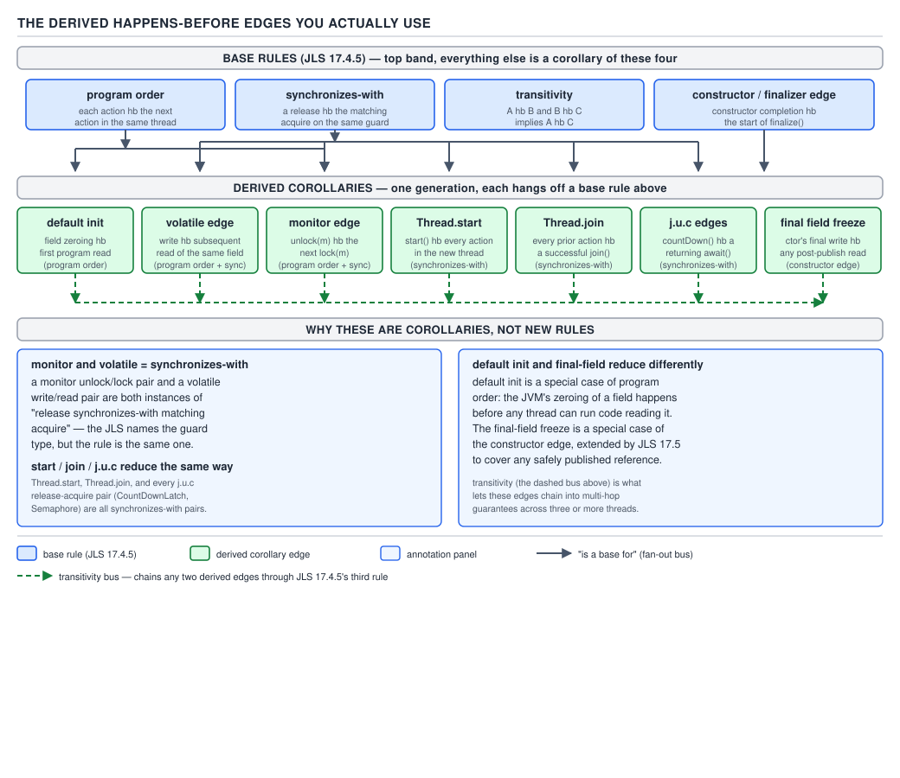

# 05 Multithreading and Concurrency — volatile and the JMM — BASICS (§1.10, leaves 1.10.1–1.10.13)

**Target version: Java 21 LTS.** | **Part 1 of 5** | [Index](../00-index.md)
Previous: [volatile — cost, arrays and the publication idiom](01b-basics-volatile-cost-and-arrays.md) · Next: [The JMM — reordering and barriers](02b-basics-reordering-and-barriers.md)

You have seen `volatile` fix a visibility bug. This file explains *why* it fixes it — not
"it flushes to main memory" (there is no such flush; MESI already keeps caches coherent), but the
actual contract the language gives you: the Java Memory Model, and the happens-before relation
that is its output.

### The JMM as a contract

**Mental model.** Think of the JMM as a legal contract between four parties who would otherwise
disagree: you (the programmer, reasoning one line at a time), the compiler (which wants to reorder
and eliminate instructions for speed), the JIT (which wants to do it again at runtime), and the
hardware (whose store buffers and invalidate queues make writes visible to other cores on their own
schedule, not yours). None of those three lower layers owes you sequential consistency for free —
left alone they reorder, cache, and eliminate accesses in ways individually correct for one thread
and collectively baffling for several. The JMM says: *if you follow these rules, we guarantee this
much, and no less.*

**Why it exists.** Before the JMM was formalized, "what value can a read see" was tribal knowledge
— different JVMs, and different JIT versions of the same JVM, answered it differently for the same
racy program. A specification that cannot say what a program does cannot ship in a portable
language.

**When you actually reach for it explicitly.** You never invoke the JMM directly in code. You reach
for it when deciding whether a `Reservation` built on one thread is safe to read on another without
a lock: happens-before is the only thing that can answer that honestly. Skip it and you are
guessing.

**How it works, mechanically.** JLS chapter 17 does not talk about caches, store buffers or
compiler passes. It defines the contract one level above hardware: a set of *actions* (reads,
writes, locks, unlocks — leaf below), an order in which each thread performs its own actions
(*program order*), a global order over synchronization actions (*synchronization order*), and a
relation built from both called **happens-before**. The whole model reduces to one rule: *if A
happens-before B, the compiler, JIT and hardware together must make sure B sees the effect of A.*
With no happens-before edge between two conflicting accesses, the model promises nothing.

`[SOURCE]` JLS 17, opening paragraph (17.4, "Memory Model"): "A memory model describes, given a
program and an execution trace of that program, whether the execution trace is a legal execution
of the program... The Java programming language memory model works by examining each read in an
execution trace and checking that the write observed by that read is valid according to certain
rules." Read that twice: the model is defined over *execution traces*, not over source code lines
— it is a referee that validates or rejects an interleaving after the fact, which is exactly why
"the compiler wouldn't do that" is not an argument you can make about a JMM-illegal program.

```java
// PaymentService publishes a Reservation to FundsLedger with no synchronization at all —
// legal to the compiler, illegal under the JMM once a second thread reads reservedAmount.
final class PaymentService {
    private Reservation pending; // plain field: NOT volatile, NOT guarded by a lock

    void authorise(ClientId clientId, Money amount) {
        Reservation r = new Reservation(clientId, amount, Instant.now());
        pending = r; // (A) plain write — no happens-before edge is created here
    }

    Reservation peek() {
        return pending; // (B) plain read — may see a partially constructed Reservation,
                         //     a stale null, or a fully-built object: the JMM permits all three
    }
}
```

**The gotcha.** Reads (A) and (B) are a conflicting access with no happens-before edge between
them (leaf below defines both terms). The JMM does not merely say "this might be slow" — it says
`peek()` calling thread is entitled to see *any* prior value of `pending`, including one that was
never assigned by this thread, because an unsynchronized plain field carries no ordering
guarantee at all. This is not a corner case; it is the default.

> **The JMM is the specification that tells you, for any two accesses to shared memory, whether
> the language guarantees thread B sees thread A's write — and that guarantee is called
> happens-before.**

**A note on 1.10.2 and 1.10.3 (why the current model exists).** The JMM you are reading is not the
original one. JSR-133 (2004) rewrote it because the JDK 1.4 model was demonstrably broken:
`[RESEARCH]` a `final` field could legally appear to *change value* after construction — a
`String`'s backing `char[]` could be observed as all-zero, then later correctly initialized,
because nothing forbade reordering the constructor's writes past the publishing reference
assignment. Double-checked locking without `volatile` was provably unfixable for the same reason.
`[RESEARCH]` `[PROVE]` The proof: let `w1` be the constructor's field write and `w2` the write
publishing the reference. Old-model reordering permitted `w2` before `w1`, since a plain reference
assignment has no data dependency on the field write. A second thread reading the reference after
`w2` but before `w1` observes the default value — and no `if (helper == null)` check on the
*reading* side can close a window that lives on the *writing* side. JSR-133's fix was the
final-field freeze (reordering file next) and a from-scratch happens-before definition, delivered
as JLS chapter 17 and structurally unchanged from Java 5 through Java 21.

---

**Shared variables and conflicting accesses (17.4.1, 17.4.1 note).** The JMM only has anything to
say about *shared variables*: instance fields, static fields, and array elements — anything on the
heap that more than one thread could see. `[SOURCE]` JLS 17.4.1: "Local variables..., formal
method parameters..., and exception handler parameters... are never shared between threads." A
`ClientId` local inside `authorise()` above is invisible to this whole discussion — no other
thread can name it. The `pending` field can be raced on, because any thread holding a
`PaymentService` reference can reach it. **Definition:** two accesses *conflict* if they occur in
different threads, at least one is a write, and they are not otherwise ordered — the raw material
a data race (1.10.12) is built from.

**Program order and sequential consistency (17.4.3).** *Program order* is "the order the source
code says this one thread's actions happen in" — trivial for a single thread; the JMM never lets a
thread disagree with its own program order about its own actions. *Sequential consistency* is the
much stronger idea that **all** threads' actions interleave into one global total order every
thread agrees on, each thread's own actions appearing in program order within it. `[SOURCE]` JLS
17.4.3 says plainly this is a reasoning tool, not a hardware promise: "sequentially consistent
executions... are simple to reason about, [but] most modern... implementations of the JVM do not
implement it." The real machine gives you sequential consistency only for a *correctly
synchronized* program — the DRF-SC guarantee at the end of this file.

### JLS 17.4.2 — inter-thread actions and the action tuple

**Mental model.** Everything the JMM reasons about — reads, writes, locks — is flattened into one
uniform shape: a tuple `<t, k, v, u>`. Think of it as a log line: which thread did it, what kind of
thing it did, which variable or monitor it touched, and a unique id to tell two otherwise-identical
actions apart (two threads can both write `0` to the same field; the tuple still distinguishes the
two events). Every rule the rest of chapter 17 states — program order, synchronizes-with,
happens-before — is a relation *over these tuples*, nothing more exotic.

**Why it exists.** A model that talked about "statements" or "bytecode instructions" would be tied
to a compilation strategy. Reducing every observable event to a short, closed list of *kinds* lets
the JMM state universal rules ("a volatile write synchronizes-with a volatile read of the same
variable") regardless of inlining, loop unrolling, or register allocation.

**When this matters versus when it's plumbing.** You never construct one of these tuples in code.
It matters when you need to argue precisely which specific access two threads are racing on — e.g.
distinguishing "the volatile write to `Reservation.status`" from "the plain write to
`Reservation.reason`" in the same object, which the tuple's `v` component keeps separate.

**How it works.** `[SOURCE]` JLS 17.4.2 defines the tuple and enumerates the kinds of inter-thread
action: "reads (normal, or as part of a volatile), writes (normal, or as part of a volatile),
synchronization actions (lock, unlock, and the reads and writes of volatile variables), actions
that start a thread or detect that a thread has terminated..., external actions, and thread
divergence actions." Unpacked: **read**/**write** are plain non-volatile accesses. **volatile
read**/**volatile write** are their own kind, not a flag on a plain access, because they carry
different ordering guarantees (next file). **lock**/**unlock** are monitor entry/exit —
`synchronized` and `ReentrantLock` internals both surface as these. **start**,
**join-detected-termination**, and **interrupt/detect-interrupt** are thread-lifecycle actions the
JLS treats as first-class. **external action** covers I/O and environment-determined results.
**thread divergence action** exists so a side-effect-free infinite loop doesn't invalidate the
model's guarantees for everyone else — the JIT may assume such a loop terminates, for optimization.

```java
// One statement, several tuples. Reasoning about visibility means reasoning about
// which tuple raced with which — not about "the withdrawal method" as one blob.
final class FundsLedger {
    private volatile Money reservedTotal = Money.zero(Currency.GBP); // volatile field
    private String lastAuditNote; // plain field

    void publish(Reservation r) {
        lastAuditNote = "reserved " + r.amount();      // tuple <t, WRITE,        lastAuditNote, u1>
        reservedTotal = reservedTotal.plus(r.amount()); // tuples <t, VOLATILE_READ, reservedTotal, u2>
                                                         //        <t, VOLATILE_WRITE, reservedTotal, u3>
    }
}
```

**The gotcha.** `reservedTotal = reservedTotal.plus(...)` is *two* tuples on the same variable, a
read then a write — `volatile` makes each individually atomic and ordered, but the read-modify-write
pair as a whole is **not** atomic (the classic non-atomic compound-action pitfall, covered in the
next file's `AtomicLong` comparison). Naming the tuples separately is what makes that visible;
treating the statement as one opaque "increment" is what hides it.

> **An inter-thread action is a `<thread, kind, variable-or-monitor, id>` tuple — the JMM's atomic
> unit of observation, and every ordering rule in chapter 17 is a relation over these tuples.**

### The six synchronizes-with edges

**Mental model.** Program order alone only orders one thread against itself. To let thread B trust
anything thread A did, you need a bridge between the two threads' program orders — a specific,
enumerated set of action *pairs* the JLS declares linked. That bridge is **synchronizes-with**, and
JLS 17.4.4 names exactly six kinds of pair that qualify. If your mental list of "things that create
visibility" has a seventh entry, it is either a restatement of one of these six or it is wrong.

**Why it exists.** Sequential consistency (above) is too strong to implement efficiently — no JVM
gives it to you for free. Happens-before (next section) is built by composing program order with a
*small, closed* set of cross-thread edges, so that the compiler and hardware are free to reorder
everything **not** touched by one of these six pairs. Synchronizes-with is the load-bearing wall;
remove it and the whole reordering-freedom argument for why `volatile` and locks are affordable
collapses.

**When each one is the tool you reach for, versus a sibling.** Monitor unlock/lock gives visibility
*and* mutual exclusion — reach for it when a multi-step update needs atomicity too. Volatile
write/read gives visibility *alone*, cheaper, for an update that is already a single write (a
status flag, a reference swap) — reaching for it on a compound update is the tuple-section pitfall
above. `start()`/termination-detection make "hand work to a new thread" and "wait for a worker to
finish" safe with no explicit lock. Default initialisation is the one edge free of charge — every
field's zero/null value happens-before anything else, so an uninitialized `int` is never observed
as garbage, only `0`. Interrupt/detect-interrupt is the narrowest: it orders only the interrupt
*signal*, not any data the interrupted thread was working on.

**How it works.** `[SOURCE]` JLS 17.4.4 states each edge individually; the two most quoted:
"An unlock action on monitor `m` synchronizes-with all subsequent lock actions on `m`" and "A write
to a volatile variable `v`... synchronizes-with all subsequent reads of `v` by any thread (where
'subsequent' is defined according to the synchronization order)." The phrase "according to the
synchronization order" matters: it is a single, JVM-wide total order over *only* the synchronization
actions (locks, unlocks, volatile reads/writes, and the lifecycle actions below) — not over every
action in the program, and not something your code ever queries directly.

**D-036** — The six synchronizes-with edges.

| JLS 17.4.4 clause | Action A | Action B | QuizStakes example |
|---|---|---|---|
| "An unlock action on `m` synchronizes-with all subsequent lock actions on `m`" | unlock of monitor `m` | lock of the same monitor `m` | `synchronized(ledgerLock) { balance = balance.plus(x); }` in one thread unlocks; the next thread's `synchronized(ledgerLock)` block locking the same `FundsLedger` instance sees the updated `balance` |
| "A write to a volatile variable `v` synchronizes-with all subsequent reads of `v`" | volatile write of `v` | volatile read of the same `v` | `PaymentService` writes `volatile Reservation pending = r;`; `FundsLedger.peek()` reading `pending` afterwards sees every field of the fully-built `Reservation` |
| "A call to `start()` on a thread synchronizes-with the first action in the thread it starts" | `Thread.start()` | first action of the started thread | `paymentRunExecutor.execute(() -> processBankWithdrawal(tx))` — everything `PaymentRun` set up before submitting is visible to the withdrawal task's first line |
| "The default initialization of any object happens-before any other actions... of a program" | JVM's default write of a field's zero value | any subsequent read of that field | a freshly allocated `Reservation` field `voidedAt` reads as `null`, never as garbage, before any constructor line runs |
| "The final action in thread T1 synchronizes-with any [action] that detects that T1 has terminated," via `isAlive()`/`join()` | last action of T1 | `T2` observing termination via `join()`/`isAlive()` | the withdrawal-batch worker thread's last write to `PaymentRun.status = COMPLETED` is visible to the coordinator thread once `worker.join()` returns |
| "If thread T1 interrupts T2, the interrupt... synchronizes-with any point where... T2 has been interrupted" | `T1.interrupt()` on the worker | `T2` observing via `InterruptedException` or `Thread.interrupted()` | cancelling a stuck `BankWithdrawal` retry loop: the cancelling thread's `interrupt()` synchronizes-with the retry loop noticing `Thread.interrupted()` and aborting |

```java
// The monitor edge and the volatile edge, side by side, on the same domain object.
final class FundsLedger {
    private final Object ledgerLock = new Object();
    private Money balance = Money.zero(Currency.GBP);      // guarded by ledgerLock: needs the monitor edge
    private volatile boolean settlementPaused = false;      // single flag: the volatile edge suffices

    void credit(Money amount) {
        synchronized (ledgerLock) {                          // lock — start of a synchronizes-with pair
            balance = balance.plus(amount);
        }                                                     // unlock — synchronizes-with the NEXT lock on ledgerLock
    }

    void pauseSettlement() { settlementPaused = true; }        // volatile write
    boolean isPaused()     { return settlementPaused; }        // volatile read: synchronizes-with the write above
}
```

**The gotcha.** These six are pairwise **independent** — a volatile write does not synchronize-with
a subsequent lock, and locking a monitor gives you nothing about a volatile field guarded by a
*different* mechanism. Mixing `synchronized` for `balance` and `volatile` for `settlementPaused` in
the snippet above is correct precisely because each field is fully covered by exactly one of the
six edges; the bug shows up when a field is written under a lock in one method and read without any
synchronization at all in another — no edge in this table covers that pair, full stop.

> **Synchronizes-with is the closed set of six action pairs JLS 17.4.4 declares linked across
> threads: monitor unlock/lock, volatile write/read, `start()`, default initialisation, termination
> detection, and interrupt/detect-interrupt — happens-before is built from nothing but these plus
> program order.**

### Happens-before as a transitive closure

**Mental model.** Happens-before is not a seventh rule alongside the six above — it is the *glue*
that stitches program order (within a thread) and synchronizes-with (across threads) into one
relation, then closes it under transitivity. Picture two threads' program-order chains as ropes;
each synchronizes-with edge is a knot tying one rope to the other. Happens-before is "can I walk
from A to B along ropes and knots" — because the walk can cross a knot, run along the other rope,
and cross back at a second knot, the relation reaches far further than any single edge alone.

**Why it exists as *only* four rules.** Every blog's "list of happens-before rules" — fifteen,
twenty entries — is a derived-corollary list (next leaf), not the definition. The JLS keeps the
definition to four clauses so the model has one small, provable core; everything else is a
*theorem*, checkable against the four rules rather than trusted by citation count.

**When you invoke it versus a derived rule.** In practice you reason from a derived edge
("`start()` orders my setup before the worker's first line"), not the four base rules directly.
You drop back to the base definition only when a derived rule doesn't obviously cover your case, or
when you need to *prove* something new is safe — exactly what the chain below does.

**How it works.** `[SOURCE]` JLS 17.4.5 states it as: "(1) If `x` and `y` are actions of the same
thread and `x` comes before `y` in program order, then `hb(x, y)`. (2) There is a happens-before
edge from the end of a constructor of an object to the start of a finalizer for that object.
(3) If an action `x` synchronizes-with a following action `y`, then we also have `hb(x, y)`.
(4) If `hb(x, y)` and `hb(y, z)`, then `hb(x, z)`." Four clauses: program order, the
constructor-to-finalizer edge (a historical carve-out for `Object.finalize()`, largely irrelevant
now that finalizers are deprecated for removal), synchronizes-with promotion, and transitivity.
Everything else — "a volatile write happens-before a subsequent read", "`start()` happens-before
the first action" — is clause (3) applied to one of the six synchronizes-with pairs; it is not a
fifth clause.

`[PROVE]` Work the `BlockingQueue.put`/`take` edge (your row's second example) through the four
clauses rather than citing it. `BankWithdrawalQueue` is a `LinkedBlockingQueue<WithdrawalTransaction>`.
`PaymentService` calls `queue.put(tx)`; `BankWithdrawal` calls `queue.take()` and gets that same
`tx`. Internally `put`/`take` are implemented with a `ReentrantLock` guarding the queue's internal
state (`java.util.concurrent` guarantees the *outcome*, but the mechanism is ordinary
lock/unlock). Trace it:

1. `PaymentService` builds `tx` with several plain writes, call the last one `w`. By clause (1)
   (program order), `hb(w, lockAcquire)` where `lockAcquire` is the internal lock the `put` call
   takes to enqueue `tx` — `w` comes before the enqueue call in `PaymentService`'s own program
   order.
2. The enqueue happens, then the internal lock is released: call that release `unlockPut`. By
   clause (1) again, `hb(lockAcquire, unlockPut)`.
3. `BankWithdrawal`'s `take()` call acquires the *same* internal lock afresh: call that
   `lockTake`. This is a monitor unlock followed by a lock on the same monitor — one of the six
   synchronizes-with edges. By clause (3), `hb(unlockPut, lockTake)`.
4. `take()` reads `tx` out of the internal structure and returns it; call the point where
   `BankWithdrawal`'s code first uses a field of `tx` (e.g. `tx.amount()`) action `r`. By clause
   (1) on `BankWithdrawal`'s own program order, `hb(lockTake, r)`.
5. Chain all four with clause (4), transitivity, twice: `hb(w, lockAcquire)` and
   `hb(lockAcquire, unlockPut)` give `hb(w, unlockPut)`; that with `hb(unlockPut, lockTake)` gives
   `hb(w, lockTake)`; that with `hb(lockTake, r)` gives `hb(w, r)`.

Five actions, two threads, one lock nobody in application code ever names — and the result is that
every plain field `PaymentService` wrote into `tx` before `put()` is guaranteed visible to
`BankWithdrawal` after `take()`. That guarantee is `java.util.concurrent`'s package-level promise
(next leaf); this is the proof of *why* it's true, not an appeal to authority.



**D-037** — The derived happens-before edges you actually use.

**The gotcha.** "Happens-before" is a terrible name for what it means — it sounds temporal, like
"happens earlier in wall-clock time." It is not. Two actions can happen-before each other in the
JMM sense while executing at literally the same nanosecond on two cores, or even be reordered by
the hardware in real time, as long as the *visible effect* respects the ordering. Conversely, `A`
finishing before `B` starts in wall-clock time gives you **no** happens-before guarantee at all
without one of the six edges connecting them — this is the single most common source of "but it
worked in my testing" races.

> **Happens-before is the transitive closure of program order and synchronizes-with (plus the
> constructor/finalizer edge) — four base clauses; every other "rule" you can name is one of these
> four applied to a specific synchronizes-with pair.**

**The working list (1.10.10), for recall, not for re-deriving each time.** Program order; monitor
unlock → subsequent lock; volatile write → subsequent read; `start()` → first action; last action
→ successful `join()`; default initialisation → everything; transitivity across all of the above;
the final-field freeze (constructor write of a `final` field → any read of the reference, covered
in depth in the reordering file next); and the `java.util.concurrent` edges, immediately below.
This list is what an interviewer actually wants named — the proof above is what shows you didn't
just memorize it.

---

**The `java.util.concurrent` memory-consistency edges (1.10.11).** `[SOURCE]` `[RESEARCH]` Not a
seventh kind of base rule — each is a synchronizes-with pair built from an internal lock or
`volatile` field inside the JDK class, exactly as proved above for `BlockingQueue`. The package
summary states the guarantee at the *API* level so you never re-derive it per class: "Actions in a
thread prior to placing an object into any concurrent collection happen-before actions subsequent
to the access or removal of that element from the collection in another thread." That single
sentence is why `ConcurrentHashMap.put` followed by another thread's `get` needs no extra
`volatile` or lock around the payload.

**D-038** — The `java.util.concurrent` happens-before edges.

| Releasing action | Acquiring action | What becomes visible |
|---|---|---|
| placing an object into a concurrent collection (e.g. `ConcurrentHashMap.put`, `BlockingQueue.put`) | removal/access of that element by another thread (e.g. `get`, `take`) | every write made before the placement, to the element and anything it references |
| submitting a `Runnable`/`Callable` to an `Executor` | the task beginning execution | every write made before submission, visible at the start of `run()`/`call()` |
| actions taken by the asynchronous computation | a successful `Future.get()` return | every write the computation performed before completing |
| `Lock.unlock()`, `Semaphore.release()`, `CountDownLatch.countDown()` | the matching `Lock.lock()`, `Semaphore.acquire()`, or `await()` returning | every write made before the release, to the acquiring thread |
| one thread's `Exchanger.exchange()` call | the paired thread's `Exchanger.exchange()` return | every write each side made before exchanging, to the other side |
| actions before `CyclicBarrier.await()`/`Phaser.awaitAdvance()` | the barrier action, then the return from `await()`/`awaitAdvance()` in every party | every write made by every party before reaching the barrier, to every party after it releases |

The bank-withdrawal handoff from the proof above is row one of this table, used without
re-deriving it each time: `bankWithdrawalQueue.put(tx)` on the `PaymentService` thread, then
`bankWithdrawalQueue.take()` on the `BankWithdrawal` worker thread, needs no `volatile`, no lock,
and no other synchronization in application code to see every field of `tx`.

**The gotcha.** The guarantee is scoped to *that specific element's* prior writes — placing `tx`
into the queue does not retroactively make some unrelated shared field on `PaymentService` visible
to the taking thread. The edge is per-handoff, not a blanket "everything is now synchronized"
grant.

> **Every `java.util.concurrent` happens-before guarantee is the same lock/volatile
> synchronizes-with proof done once, inside the JDK, and published as an API-level promise so
> callers never have to redo it.**

---

**Data races and correctly synchronized programs (1.10.12).** A *data race* is exactly what
"conflicting access" (17.4.1, above) plus "no happens-before edge between them" defines. The
`PaymentService.pending`/`peek()` pair at the top of this file, with `volatile` stripped off, is a
textbook data race. A program is **correctly synchronized** if none of its sequentially-consistent
executions contains a data race: reason about the program as if it were SC (ropes, knots, no
reordering); if that idealized reasoning never finds a racing pair, it qualifies for the theorem
below.

### The DRF-SC guarantee

**Mental model.** This is the theorem that makes everything above worth doing. Eliminate every data
race — insert the right locks or `volatile`s so every conflicting pair has a happens-before edge —
and the JMM stops being able to punish you for hardware and compiler reordering at all: your
program behaves *as if* it ran under plain sequential consistency, the simple one-global-
interleaving model everyone actually reasons with. You buy back the mental model performance would
otherwise cost you.

**Why it exists.** Without this theorem, "eliminate the race" would be only half the story — you'd
still have to separately reason about reordering on the *correctly synchronized* accesses too.
DRF-SC is the promise that you never have to: get the synchronization right, and the reordering
question disappears by construction, not by luck.

**When it does and doesn't apply.** It is a whole-program guarantee, not a per-line one. A program
with even one genuine data race anywhere gets no protection from this theorem for *any* of its
behavior, including parts that look perfectly synchronized in isolation — racy programs fall back
to the much weaker "no out-of-thin-air values" rules covered in the reordering file next.

**How it works / `[PROVE]` the argument.** Assume program `P` is correctly synchronized: in every
sequentially-consistent execution of `P`, every pair of conflicting accesses is ordered by
happens-before (that's what "no data race" meant above, restated). Claim: every *actual* execution
of `P` — including ones where the JIT reordered instructions and the hardware delayed store
visibility — produces results indistinguishable from some sequentially-consistent execution.

Proof sketch by contradiction. Suppose an actual execution produced a result no
sequentially-consistent interleaving could produce. Some observable difference must trace back to
two conflicting accesses `A` (on T1) and `B` (on T2) whose *relative order*, as observed, differs
between the actual execution and every SC interleaving — otherwise every observation would agree
with some SC interleaving and there would be nothing to contradict. But `A` and `B` conflict
(different threads, same variable, one a write) and `P` was assumed correctly synchronized, so by
definition `hb(A, B)` or `hb(B, A)` holds in every SC execution of `P`. The JMM's foundational
soundness rule (17.4.8) requires every legal actual execution to respect happens-before for the
*specific* accesses it validates — it cannot present `B`'s effect before `A`'s if `hb(A, B)` holds,
because happens-before is the compiler/JIT/hardware's marching order, not a lint rule. So the
actual execution must agree with the SC order on `A` and `B` after all — contradicting the
assumption. No such pair can exist; therefore no observable difference can exist; therefore every
actual execution of a correctly synchronized `P` is indistinguishable from some SC execution.

The practical payoff: once `PaymentService` publishes `Reservation` via the `volatile pending`
field (or the `BlockingQueue` handoff above) instead of the plain field, `FundsLedger` is entitled
to reason about the whole interaction as if both threads ran on one core, taking turns, in some
fixed order — no store buffers, no instruction reordering, no invalidate-queue delay to model. That
is the entire reward for the discipline the rest of this note set spends five files building up.

> **DRF-SC: a data-race-free program's every actual execution is indistinguishable from some
> sequentially-consistent execution — correct synchronization is not just "no wrong values", it is
> a license to stop thinking about barriers and reorderings altogether.**

## Pitfalls

### Assuming "happens-before" means "happens earlier in time"

**Wrong:** "the `PaymentService` write finishes at t=100ms, the `FundsLedger` read starts at
t=105ms, so obviously happens-before holds and the read sees the write" — with `pending` a plain
field, that is still a data race, wall-clock order notwithstanding.

**Right:** make `pending` `volatile`. Now happens-before holds between the write and any subsequent
read, because it is a synchronizes-with pair (volatile write/read) — not because of when each line
executed on the clock.

**Why people believe it:** the English word "before" is temporal, and in the single-threaded case
program order genuinely does match wall-clock order, so the intuition transfers incorrectly to the
cross-thread case where only an explicit synchronizes-with edge — never elapsed time — creates the
guarantee.

### Assuming volatile "flushes to main memory"

**Wrong:** "a volatile write pushes the value out of the CPU cache into RAM, and a volatile read
pulls the freshest value back in from RAM."

**Right:** modern hardware caches are already kept coherent across cores by a protocol like MESI —
there is no stale "second copy in a cache line" for a volatile write to flush away. A volatile
write participates in the synchronization order and emits the store/load barriers (next file) that
stop the compiler and CPU from *reordering* it past neighboring accesses, so the synchronizes-with
edge to a subsequent volatile read is honored. The correct sentence is "a volatile write and a
subsequent volatile read of the same field are ordered by happens-before," not "data physically
moves to RAM."

**Why people believe it:** "main memory" is a plausible mental shortcut for "the thing all threads
share," and pre-multicore explanations of `volatile` leaned on it before coherence protocols were
common knowledge in application-level discussions.

### Treating the six synchronizes-with edges as interchangeable

**Wrong**
```java
class PaymentRun {
    private volatile boolean settled;
    private List<WithdrawalTransaction> batch = new ArrayList<>(); // guarded by nothing
    void settle() {
        batch.add(next());        // plain write, no edge of its own
        settled = true;           // volatile write
    }
    void checkAndRead() {
        if (settled) process(batch.get(0)); // "works" only while settled sits after every
    }                                        // plain write in program order — fragile
}
```
**Right:** either guard `batch` with the same monitor guarding `settled`, or replace it with a
`java.util.concurrent` structure whose own internal edge (D-038) covers the handoff, so the
visibility guarantee doesn't depend on accidentally correct field ordering inside one method.

**Why people believe it:** the volatile write in `settle()` does, in this exact snippet, sit after
the plain writes in program order, so the code "happens to work" under transitivity — until a
future edit reorders the two lines or adds a second writer thread, at which point nothing in the
type system flags the loss.

## Cheat sheet

| Concept | One-line fact |
|---|---|
| JMM | Contract between programmer, compiler, JIT and hardware: defines which values a read may legally see |
| Action tuple | `<thread, kind, variable/monitor, id>` — the atomic unit every JMM rule reasons about |
| Shared variable | Instance field, static field, array element — never a local, parameter, or catch parameter |
| Conflicting access | Same variable, different threads, at least one write |
| Program order | One thread's own actions, in source order — never violated for a thread's own view of itself |
| Sequential consistency | One global interleaving all threads agree on — a reasoning model, not a hardware guarantee |
| Synchronizes-with | Exactly 6 edges: unlock→lock, volatile write→read, `start()`, default init, termination detection, interrupt/detect |
| Happens-before | Transitive closure of program order + synchronizes-with + constructor/finalizer edge — 4 base clauses only |
| `j.u.c` edges | Each is a proven synchronizes-with pair (lock/volatile) published as an API-level guarantee |
| Data race | Conflicting access with no happens-before edge between the two sides |
| Correctly synchronized | Every SC execution is data-race-free |
| DRF-SC | Correctly synchronized ⇒ every actual execution is indistinguishable from some SC execution |

## Self-test

**Q1.** Why is the JMM defined over "execution traces" rather than over source code?

<details><summary>Answer</summary>

Because the compiler, JIT and hardware are all free to transform the source before it becomes an
execution, and the JMM's job is to validate or reject the *resulting* trace of actions — it has to
speak the language of what actually ran, not the language of what was written, or it could not
police the very transformations it exists to constrain.

</details>

**Q2.** Name the four base clauses of happens-before (JLS 17.4.5) without listing a derived rule.

<details><summary>Answer</summary>

(1) Program order within a thread. (2) The constructor-to-finalizer edge. (3) Synchronizes-with
promotion: if `x` synchronizes-with `y`, then `hb(x, y)`. (4) Transitivity: `hb(x, y)` and
`hb(y, z)` imply `hb(x, z)`. Anything else — "volatile write happens-before subsequent read",
"`start()` happens-before first action" — is clause (3) applied to a specific synchronizes-with
pair, not a fifth base clause.

</details>

**Q3.** `PaymentService` writes several plain fields on a `Reservation`, then calls
`bankWithdrawalQueue.put(tx)`. `BankWithdrawal` calls `bankWithdrawalQueue.take()` and reads those
fields. Which JLS clause chain proves the fields are visible, and where does the synchronizes-with
edge actually occur?

<details><summary>Answer</summary>

Program order (clause 1) orders each plain write before the `put()` call's internal lock
acquisition, and again orders the internal lock's release before whatever `BankWithdrawal` does
after `take()`'s lock acquisition. The synchronizes-with edge itself is not the `put`/`take` call
pair directly — it is the internal `ReentrantLock`'s unlock (inside `put`) synchronizing-with its
own subsequent lock (inside `take`), one of the six 17.4.4 edges. Transitivity (clause 4) chains
the two program-order legs through that one lock/unlock edge into a single happens-before
relation from the plain writes to the reads.

</details>

**Q4.** Why does a `synchronized` block guarding `balance` give no visibility guarantee for a
`volatile boolean settlementPaused` field written in a completely different, unsynchronized method?

<details><summary>Answer</summary>

The six synchronizes-with edges are pairwise independent — a monitor unlock only
synchronizes-with a *subsequent lock on that same monitor*, and a volatile write only
synchronizes-with a *subsequent volatile read of that same field*. There is no cross edge between
"unlocking monitor A" and "reading volatile field B"; each field needs its own qualifying edge, and
mixing mechanisms per-field is fine only as long as every field individually has one.

</details>

**Q5.** State the DRF-SC theorem, and in one sentence say why it is provable rather than merely
asserted.

<details><summary>Answer</summary>

If a program is correctly synchronized (every conflicting access pair is ordered by
happens-before in all its sequentially-consistent executions), then every actual execution of that
program is indistinguishable from some sequentially-consistent execution. It is provable because
the JMM's soundness rule forces any legal actual execution to respect every happens-before edge on
the specific accesses that hold one, so a conflicting pair that is always ordered by hb can never
be observed out of order — leaving no possible point of divergence from some SC interleaving.

</details>

**Q6.** What does "default initialisation happens-before everything" actually buy you, concretely?

<details><summary>Answer</summary>

It guarantees a freshly allocated field is observed as its zero/null value and never as
uninitialized garbage, even by a thread that races to read it before any constructor code runs. A
`Reservation.voidedAt` field will read `null` under a race, never a stray non-null bit pattern left
over in memory — the field-level safety this provides is unconditional and needs no
`volatile`/lock to obtain, unlike every other guarantee in this file.

</details>

**Q7.** Is a data race in one unrelated part of a program allowed to affect the DRF-SC guarantee
for a different, seemingly well-synchronized part of the same program?

<details><summary>Answer</summary>

Yes — correctly synchronized is a whole-program property in this theorem's statement. A single
race anywhere in the program means the program as a whole does not satisfy the hypothesis, so
DRF-SC's conclusion (indistinguishable from SC) is not available for any part of it, even parts
that look properly locked in isolation; those parts fall back to the much weaker no-out-of-thin-air
guarantees covered in the next file.

</details>

---

**Leaves covered:** 1.10.1–1.10.13 (13 leaves)
**Leaves deferred:** none
**Diagrams included:** D-036, D-037, D-038
**Target version:** Java 21 LTS
**Lines:** 595
