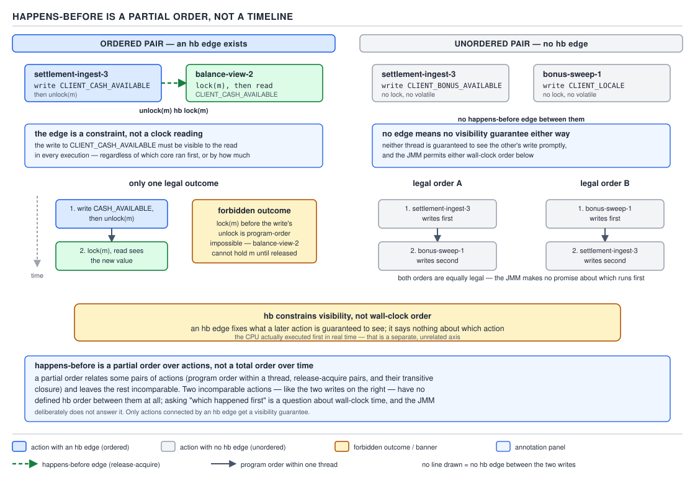
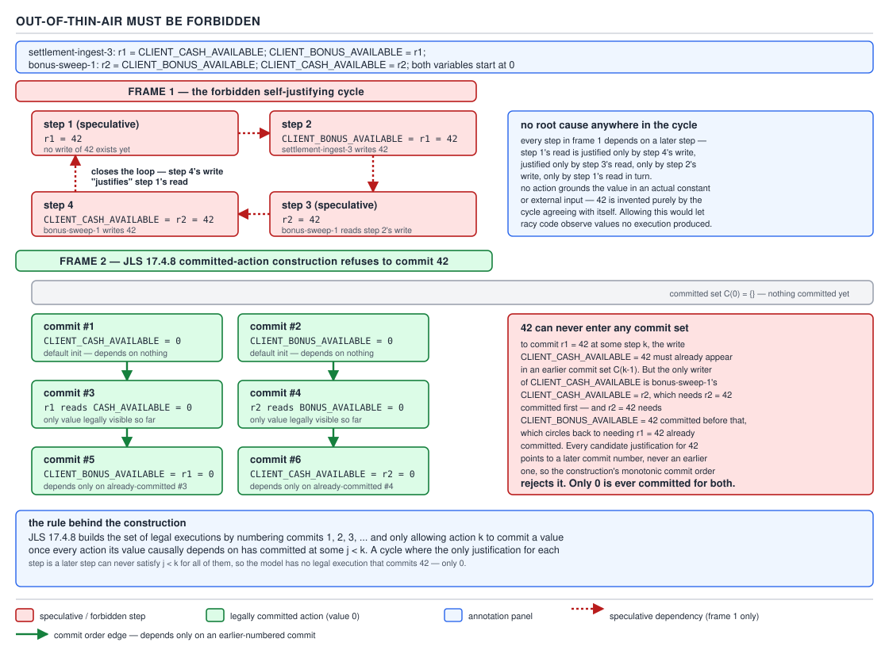
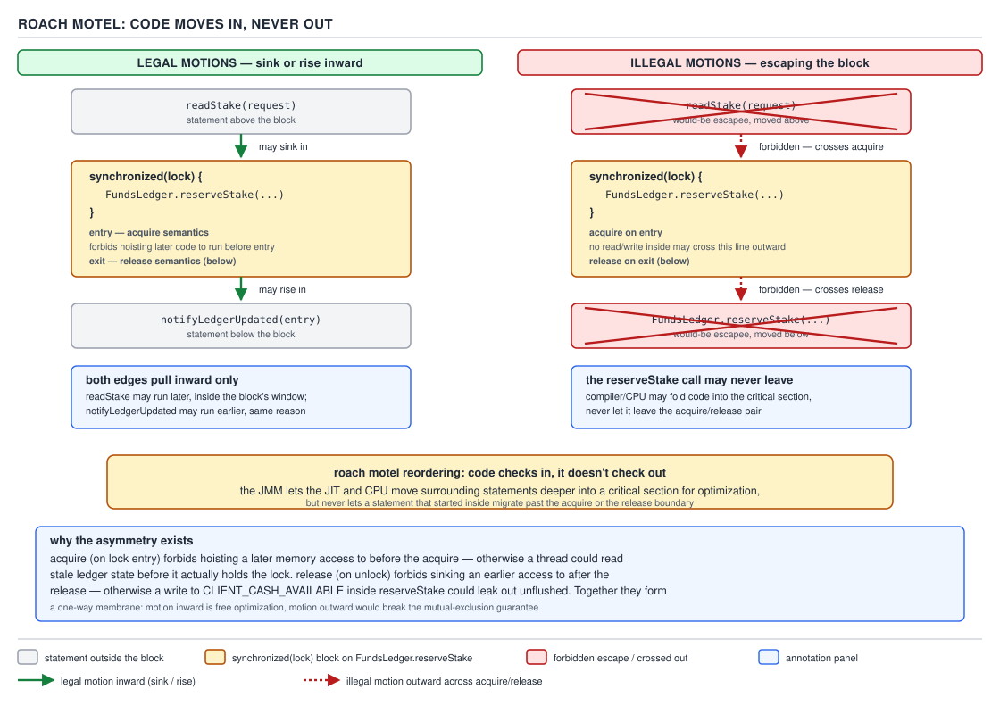
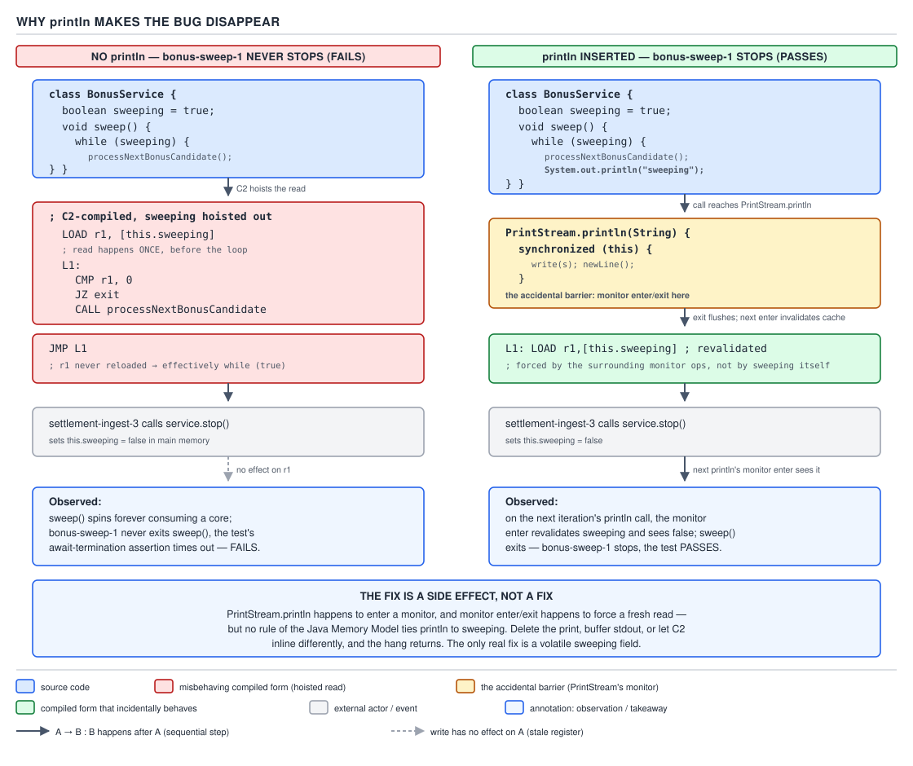

# 05 Multithreading and Concurrency — volatile and the JMM — BASICS (§1.10, leaves 1.10.14–1.10.26)

**Target version: Java 21 LTS.** | **Part 1 of 5** | [Index](../00-index.md)
Previous: [The JMM — happens-before](02a-basics-happens-before.md) · Next: [Final fields and safe publication](03a-basics-final-fields-and-publication.md)

The previous file built happens-before edges: what creates one, what `volatile` and
`synchronized` guarantee. This file covers the traps that come *after* the rules — what
happens-before does not mean, why "it's just a read" is almost always wrong, why the JMM forbids
values appearing out of nowhere, and the four barrier types the JIT and CPU insert to make any of
it true.

## Happens-before is a partial order, not a timeline

The single most damaging misreading of the JMM is picturing happens-before as "what ran first".
It is not a clock. It is a **visibility and ordering constraint between specific actions**, and
it says nothing at all about pairs of actions it does not mention.

**Why it exists.** The JMM was never trying to describe wall-clock execution — that would pin the
JIT and the CPU to program order and kill every optimization that makes the JVM fast. Instead the
spec draws a graph: program order edges within a thread, plus synchronizes-with edges across
threads (a `volatile` write synchronizes-with a later `volatile` read of the same field that sees
that write; a monitor release synchronizes-with a later acquire of the same monitor). Happens-before
is the transitive closure of that graph. Two actions connected by an edge have a guarantee. Two
actions with **no path between them are simply unordered** — the runtime is free to execute them
in either order, interleave them, or (for independent actions with no aliasing) reorder them
across CPU cycles.

**When to reach for it, and when not.** Reach for happens-before when reasoning about *visibility
of a write to a specific reader*. Do not reach for it to reason about "which thread got there
first" — that question has no answer unless an edge (a `volatile` flag, a lock, a
`CountDownLatch`) has been introduced. If two threads write to two *different* ledger positions
with no synchronization between them, asking "did the cash write happen before the bonus write"
is a category error, not an unanswered question.

**How it works.** Formally, happens-before is a relation `hb` over the actions in an execution,
defined as the transitive closure of program order ∪ synchronizes-with — irreflexive and
transitive by construction, hence a strict partial order, not total: plenty of pairs `(a, b)`
satisfy neither `a hb b` nor `b hb a`. Program order within one thread *is* total. Cross-thread,
without an explicit synchronizes-with edge, there is no ordering at all, only whatever the
hardware happens to produce on a given run — which can differ between a laptop's x86 chip and a
production AArch64 box.



**D-035** — Happens-before is a partial order, not a timeline.

**A minimal concrete example.** Two settlement-adjustment threads update two unrelated ledger
counters with no synchronization between them:

```java
public final class SettlementCounters {
    private long cashAdjustments;   // plain field, no synchronization at all
    private long bonusAdjustments;  // plain field, no synchronization at all

    public void recordCashAdjustment() {
        cashAdjustments++;          // Thread A, unsynchronized
    }

    public void recordBonusAdjustment() {
        bonusAdjustments++;         // Thread B, unsynchronized
    }
}
```

There is no happens-before edge between `recordCashAdjustment()` and `recordBonusAdjustment()`.
Both orders — cash-then-bonus and bonus-then-cash — are legal executions of this program, and so
is any interleaving of their individual load/increment/store steps, because each method itself is
a read-modify-write race on its own field (a second, independent bug). The JMM makes no promise
about which "happened first"; the question is unanswerable, not merely unobserved.

**The gotcha.** People read "happens-before" and mentally substitute "happened before" — "well
obviously the deposit thread ran before the bonus thread, I saw it in the logs". Log timestamps
reflect one observed interleaving on one run with one JIT compilation state, not a specification.
The next run, under different load or a different inlining decision, can legally reorder anything
with no hb edge.

**Interview:** "Is happens-before transitive?" — yes, and that's exactly why it's useful: `A hb B`
and `B hb C` gives you `A hb C` for free, which is how a `volatile` flag can safely publish an
entire object graph built before the flag was set. "Is it total?" — no, and confusing that is the
single most common JMM interview trap.

> **Definition:** Happens-before is the transitive closure of program order and
> synchronizes-with; it constrains visibility and ordering only between actions it explicitly
> connects, and says nothing about any other pair.

## The benign data race myth

**Mental model.** A "benign" data race is the belief that some races are safe to leave alone
because the worst that happens is a redundant recomputation — "so what if two threads both
compute the cached value, they'll compute the same thing". Wrong for the JVM: the JIT is allowed
to do far more to a racy field than merely reorder it.

**Why people believe it.** In an idealized model where the compiler loads a field once per use and
writes go straight through, a redundant recomputation is harmless — worst case the work runs
twice and gets the same answer. That model does not describe HotSpot. The JIT may re-read a plain
field multiple times where the source reads it once, hoist a read out of a loop, fold two reads
into one where profiling suggests they're equal, or prove a branch dead because it "knows" (from
one observed value) that a plain field never changes.

**When it is actually safe, and only then.** The one case the JLS and every credible JMM reference
accepts as benign is **racy single-check idempotent lazy initialization of an immutable value**,
where every outcome of the race is the same, fully-constructed, immutable value. Java's own
`String.hashCode()` caching (`hash == 0` sentinel, immutable `String`, recompute-and-store) is the
canonical example: the recomputed value is provably identical every time, the raced-on field is a
plain `int` that reads either `0` or the one true hash, and recomputing has no side effect worth
avoiding. Anything where the values could differ, the published object is mutable, or the racy
read drives a decision with side effects, is not benign — it is a bug that has not yet triggered.

**A minimal concrete example — the pattern that looks benign but is not.** A lazily-computed
lookup table of jurisdiction-specific deposit limits, read without synchronization from
`AssessmentService`:

```java
public final class JurisdictionLimitCache {
    private volatile Map<Jurisdiction, LimitSet> cache; // NOT racy: volatile makes this safe

    public LimitSet limitsFor(Jurisdiction jurisdiction) {
        Map<Jurisdiction, LimitSet> local = cache;
        if (local == null) {
            local = buildLimitTable();   // pure function, same output every call
            cache = local;               // volatile write publishes the whole map safely
        }
        return local.get(jurisdiction);
    }
}
```

Drop the `volatile` and this becomes the trap: a reader can observe a non-null `cache` reference
while still seeing the map's internal `HashMap` fields in pre-construction state, because the JIT
and CPU are free to reorder the field write ahead of the constructor's stores finishing. The
*recomputation itself* is benign (same table every time); the *unsynchronized publication of a
mutable object* is not — the failure mode the "it's benign, it's just recomputing the same thing"
argument always smuggles past.

**The gotcha.** "Benign" is a property of the *value*, never of the *publication mechanism*. A
racy read of a plain field can still tear a 64-bit `long`/`double` write on a 32-bit JVM (not
relevant on Java 21 targets, but the myth predates 64-bit ubiquity), and can still let the JIT
prove a branch unreachable from one stale sample.

**Interview:** "Is `hash == 0` caching a benign race?" — yes, textbook case: immutable value,
identical recomputation, plain `int` field, no partially-constructed object escapes. "Is caching
a computed `LimitSet` the same way, without `volatile`, also benign?" — no: the *value* may be
idempotent, but the *object* being published needs a happens-before edge or a partially built
`LimitSet` can leak to another thread.

> **Definition:** A data race is benign only when every legal interleaving of the JIT's freedom to
> re-read, fold, hoist, or reorder a plain field still produces the same immutable, fully
> constructed value — a bar essentially no mutable object clears.

## Out-of-thin-air values and the JLS 17.4.8 causality machinery

**Mental model.** Without a rule forbidding it, the JMM's freedom to reorder and speculate could
produce a value never written by any thread — a number materializing from nowhere via a
self-justifying chain of "IF this value were X, THEN this reordering is legal, WHICH produces X".
JLS §17.4.8 exists purely to slam that door shut while still letting the JIT do everything else.

**Why it exists — the classic example.** Take two plain (non-`volatile`) fields, both starting at
`0`, mirroring two adjacent ledger positions:

```java
// x mirrors CLIENT_CASH_AVAILABLE, y mirrors CLIENT_BONUS_AVAILABLE.
// Both fields start at 0. No synchronization anywhere.
int x = 0, y = 0;

// Reconciliation worker A
r1 = x;   // read CLIENT_CASH_AVAILABLE mirror
y = r1;   // write CLIENT_BONUS_AVAILABLE mirror

// Reconciliation worker B
r2 = y;   // read CLIENT_BONUS_AVAILABLE mirror
x = r2;   // write CLIENT_CASH_AVAILABLE mirror
```

Neither thread ever writes `42` anywhere in the program text. Yet a naive "the compiler may
reorder anything with no dependency" model can justify `r1 == r2 == 42` through pure circularity:
*assume* worker A's read of `x` sees `42` speculatively, ahead of any write; that justifies worker
A writing `42` to `y`; that justifies worker B's read of `y` seeing `42`; which justifies worker B
writing `42` to `x` — the exact value worker A's speculative read assumed. `[PROVE]` The
assumption bootstraps its own justification with no actual write of `42` anywhere; a model that
allows this is unusable, since any value could appear from a self-consistent loop with no causal
origin.

**JLS 17.4.6–17.4.7 — the formal machinery.** The spec models an execution as an eight-tuple:
actions, program order, the write-seen function `W` (mapping each read to the write it observed),
the value-written function `V`, synchronization order, synchronizes-with, and happens-before —
plus five *well-formedness* constraints (each read's value matches what `W` says it saw; program
order and synchronization order are consistent with happens-before; every synchronization action
has a matching partner; and so on). `[SOURCE]` This tuple can describe executions that are
internally consistent yet still causally absurd — exactly the `r1 == r2 == 42` case above: it is
well-formed (every read's value matches some write), but nothing ever *causes* `42` to exist.

**JLS 17.4.8 — committed-action sets.** `[SOURCE]` This section adds causality on top of
well-formedness by defining validity as *incremental commitment*: start with the empty set of
committed actions, and repeatedly commit a new batch only if its writes are justified using
**only** the values already committed. `[PROVE]` Applied to the example: committing `x = 0` and
`y = 0` (the initial writes) is free. The next actions that depend only on committed values are
reads that see `0` — so `r1 = 0` and `r2 = 0` commit next, forcing `y = 0` and `x = 0` to be
re-derived, not `42`. No commitment order ever lets `42` enter the committed set, because
committing it would require `42` to already be justified by an earlier commitment — the exact
circularity 17.4.8 exists to reject.



**D-041** — Out-of-thin-air must be forbidden.

**JLS 17.4.9 — observable behaviour and non-terminating executions.** `[RESEARCH]` A related rule
covers a loop with no side effects that never terminates. Java lets the compiler **assume** such a
loop eventually exits when optimizing surrounding code, but forbids fabricating new *observable*
behavior (I/O, volatile writes, synchronization) that would not otherwise occur. C++ takes the
harder line that a side-effect-free infinite loop is **undefined behavior**, letting the optimizer
delete it and everything downstream; Java stopped short of that so a loop holding a thread in
`SPIN` waiting on a compliance gate can't be deleted just because the compiler can't prove it
terminates.

**The known open problem.** `[RESEARCH]` 17.4.8's causality machinery is not compositional —
proofs that individual optimizations are each independently legal do not compose into a proof that
applying them together is legal, and published papers have found executions the current spec
accepts that most practitioners consider surprising. JEP 188, "Java Memory Model Update," is an
active OpenJDK draft (status: draft, last updated January 2025) aiming for a mechanically
checkable reformulation; it has not shipped through Java 21 and carries no target version. The
interview-safe answer: "17.4.8 is the formal part nobody applies by hand; in practice you reason
with happens-before and trust the JIT vendors got the causality machinery right."

**The gotcha.** Out-of-thin-air prevention is not opt-in — it is a background guarantee the JMM
gives every Java program regardless of synchronization. It does *not* give the other guarantees
(visibility, ordering) that `volatile` and `synchronized` provide; a data race can still produce
wildly wrong-but-not-thin-air values, like stale reads. It is the floor, not the whole guarantee.

**Interview:** "Why can't `r1` and `r2` both be `42` in that classic example?" — walk the
committed-action argument: committing `42` for either read would require it to already be
justified by an earlier commitment, and the only actions available to commit first are the
initial zero-writes, so `0` is the only value that can ever enter the committed set for `x` and
`y` in this program.

> **Definition:** JLS §17.4.8 defines validity as incremental commitment of actions whose writes
> are justified only by already-committed values, which forbids self-justifying "out of thin air"
> values while still permitting the JIT and CPU to reorder anything that does not require such a
> justification.

## The four barrier categories

**Mental model.** A memory barrier is not "a wall that stops reordering everywhere" — it is a
named, narrow constraint between exactly two kinds of memory operation, on exactly one side of a
program-order pair. There are four of them, and the entire menu of ordering guarantees the JMM,
`volatile`, and `synchronized` provide is built from combinations of these four.

**Why it exists.** CPUs and compilers reorder loads and stores for throughput — store buffers let
a core continue past a slow write, out-of-order execution lets an independent later load complete
before an earlier one finishes. Left unconstrained this breaks every cross-thread protocol.
Barriers name precisely which reorderings must not happen, without giving up the ones that don't
matter.

**The four categories, named for the operation pair they forbid crossing:**

| Barrier | Forbids | Permitted on x86-TSO | Permitted on AArch64 | HotSpot `OrderAccess` name | Instruction emitted |
|---|---|---|---|---|---|
| LoadLoad | a load reordered after a later load | no (loads stay in order) | yes, unless fenced | `acquire()` | AArch64 `ldar`; x86 needs none |
| LoadStore | a load reordered after a later store | no | yes, unless fenced | `acquire()` | AArch64 `ldar`; x86 needs none |
| StoreStore | a store reordered after a later store | no (stores stay in order) | yes, unless fenced | `release()` | AArch64 `stlr`; x86 needs none |
| StoreLoad | a store reordered after a later load | **yes — this is the one x86 allows** | yes, unless fenced | `fence()` | x86 `mfence` / locked instruction; AArch64 `dmb ish` |

**D-039** — The four barrier categories, and which x86 permits.

`[NUM]` `[PROVE]` x86's TSO (total store order) already forbids three of the four reorderings at
the hardware level — it only lets a store followed by a later, independent load get reordered,
because the store sits in the store buffer while the CPU races ahead. That is why a `volatile`
write on x86 compiles to a plain store *plus* a following fence (or a `lock`-prefixed instruction
used as one) — the JVM only pays for the one reordering x86 actually allows. AArch64's weaker
native model permits all four, so a correct `volatile` there must emit real barrier instructions
(`ldar`/`stlr`) for every one of them. This is the measurable reason `volatile` and uncontended
`synchronized` are cheaper on x86 than on AArch64 for identical bytecode. `[ASM]` The exact byte
sequence differs by JIT and CPU generation; treat the names above as documented HotSpot behavior,
not a captured disassembly.

**How `volatile`/`synchronized` compose these.** A `volatile` write gets StoreStore before and
StoreLoad after; a `volatile` read gets LoadLoad and LoadStore after. A monitor acquire gets the
LoadLoad/LoadStore *acquire* pairing (nothing after can move before); a monitor release gets the
StoreStore/LoadStore *release* pairing (nothing before can move after).

**The gotcha.** "x86 doesn't need barriers" is a half-truth people repeat until it costs them a
bug on ARM. Code that "worked" on an x86 CI box because TSO hid a missing `volatile` or
acquire/release pairing can fail the moment it runs on Graviton, Ampere, or any AArch64 host — a
class of bug that has bitten real migrations to ARM-based cloud instances.

**Interview:** "Which of the four does x86 need instructions for?" — StoreLoad only; the other
three are free because TSO already forbids them, which is also why `volatile` reads are
essentially free on x86 while `volatile` writes pay for a real fence.

> **Definition:** LoadLoad, LoadStore, StoreStore, and StoreLoad are the four reordering
> categories a memory barrier can forbid; every JMM guarantee (`volatile`, monitor
> acquire/release) is assembled from some subset of them, and x86-TSO already provides three of
> the four for free.

## The roach-motel rule

**Mental model.** Code checks into a `synchronized` block, but it can't check out — from the
optimizer's point of view, a `synchronized` block behaves like a roach motel: statements from
outside are allowed to move *in*, but no statement from inside is ever allowed to move *out*.

**Why it exists.** A monitor's whole point is that everything inside it appears, to other threads
synchronizing on the same monitor, to have happened strictly between acquire and release. If the
compiler could sink a statement from *after* the block to *before* the release, or hoist one from
*before* the block to *after* the acquire, that guarantee would be silently violated — a thread
waiting on the lock could observe partial effects meant to be entirely inside or outside it.

**How it works.** `[PROVE]` The acquire is a one-directional gate: later actions may not move
*before* it, but earlier actions may freely move *after* it, into the block — that only enlarges
the critical section, which cannot break anything the lock protects. The release is the mirror:
earlier actions may not move *after* it, but later actions may move *before* it, into the block.
Net effect: the block may only ever grow by pulling neighboring code inward, never shrink by
pushing code outward.



**D-040** — Roach motel: code moves in, never out.

**A minimal concrete example.** A wallet debit that logs an audit line and updates a derived
balance around a lock:

```java
public final class WalletDebitService {
    private final Object lock = new Object();
    private Money cashAvailable;
    private Money stakeableTotal; // CASH_AVAILABLE + BONUS_AVAILABLE, recomputed after debit

    public void debitCash(Money amount) {
        auditLog.record("debit requested", amount);   // may sink INTO the block
        synchronized (lock) {
            cashAvailable = cashAvailable.subtract(amount);
        }
        stakeableTotal = recomputeStakeable();          // may rise INTO the block
    }
}
```

The JIT is free to sink `auditLog.record(...)` down into the `synchronized` block, or hoist
`recomputeStakeable()` up into it — both only shrink the amount of code running unprotected,
which cannot introduce a new race. What it may never do is take `cashAvailable =
cashAvailable.subtract(amount)` and move it out to either side of the block — that would let
another thread's `synchronized (lock)` observe the debit either too early or too late relative to
the lock's own acquire/release pair.

**The gotcha.** "Roach motel" describes what the *optimizer* may do around a lock already held —
it says nothing about correctness if the reader side forgets to take the lock at all. A
`synchronized` write with an unsynchronized read elsewhere gets none of this protection.

**Interview:** "Can the JIT move a statement from inside a `synchronized` block to just after the
closing brace?" — no, that's forbidden (release semantics: nothing before may move after). "Can it
move a statement from just before the block to just after the opening brace?" — yes, that's legal
and doesn't affect correctness (acquire semantics only forbid the opposite direction).

> **Definition:** The roach-motel rule says a monitor acquire forbids later code moving before it
> and a monitor release forbids earlier code moving after it, so code may only move *into* a
> `synchronized` block, never out of it.

## What sleep, yield, and onSpinWait do not give you

`Thread.sleep`, `Thread.yield`, and `Thread.onSpinWait` carry **zero synchronization semantics** in
the JMM. `[SOURCE]` `[TRAP]` None creates a happens-before edge, flushes or invalidates anything,
or is documented anywhere in the `Thread` javadoc as a memory-visibility guarantee — they are
scheduling hints only (`sleep` yields the CPU for at least the given duration; `yield` is an
unspecified scheduler hint; `onSpinWait`, added by JEP 285, lets the CPU throttle a spin loop, e.g.
Intel's `PAUSE`, saving power with no ordering effect).

**Pitfall:** "I added a `Thread.sleep(10)` between the writer and the reader and the race went
away, so the sleep fixed it." It fixed nothing — it changed the *timing* of an already-broken
program enough that the unlucky interleaving became statistically rare on that machine, that JIT
tier, that day. The same code can fail again under different load or a JIT recompilation. The fix
is a `volatile` field, a lock, or another real synchronization primitive — never a `sleep`,
`yield`, or `onSpinWait` call standing in for one.

> **Definition:** `sleep`, `yield`, and `onSpinWait` affect scheduling only; they establish no
> happens-before edge and must never be used as a substitute for actual synchronization.

## Why `println` accidentally makes a race disappear

`[TRAP]` `[PROVE]` `System.out.println` and most logging calls carry **no formal synchronization
guarantee** in the JMM — but `PrintStream` implements its write methods with an internal
`synchronized` block, purely so concurrent writers don't interleave garbled output. That internal
lock is a real monitor acquire/release: it forces a StoreStore/LoadStore barrier at release and a
LoadLoad/LoadStore barrier at acquire on every call, which is often enough to publish a field a
racy program was relying on happens-before for and never actually got.

This is the classic "our `BonusService` test only fails without the print statement" bug: a test
spins reading a plain `boolean granted` field set by another thread computing a bonus grant, with
no `volatile` and no lock. Add a debug `System.out.println("waiting for grant: " + granted)`
inside the spin loop and the test starts passing — not because the race was fixed, but because
the accidental monitor inside `PrintStream.println` forces the reader's cached copy of `granted`
to reload every iteration. Delete the print (as any reviewer will ask before merge) and the JIT is
free again to hoist the read out of the loop, spinning forever on a stale `false`.



**D-042** — Why `println` makes the bug disappear.

**Pitfall:** treating a passing test with a stray debug print as proof of correctness. The fix is
never the print statement — it is making `granted` `volatile`, or replacing the spin with a
`CountDownLatch`/`CompletableFuture` that has real synchronizes-with semantics. The print
statement's synchronized block was never part of the program's actual contract with its readers;
removing it (or a future JDK optimizing `PrintStream` differently) is entirely within spec.

> **Definition:** `PrintStream`'s internal `synchronized` block is an implementation detail, not a
> JMM guarantee — it can accidentally supply the happens-before edge a racy program is missing,
> which is why removing a debug print can turn a passing test back into a failing one.

---

## Pitfalls

### Assuming happens-before means "ran earlier in time"

**Wrong**
```java
// Thread A logs "cash adjusted" then Thread B logs "bonus adjusted" in every test run I've seen,
// so I'm safe assuming cash adjustments always happen before bonus adjustments in production.
```
Two unsynchronized actions with no hb edge can legally interleave differently on the next run,
the next core count, or the next JIT tier — the observed order in testing is one sample, not a
guarantee.

**Right**
```java
// Introduce an explicit edge: a shared volatile flag, a CountDownLatch, or a lock — then the
// ordering is a spec guarantee, not an observation.
```

**Why people believe it:** logs and debuggers make execution look sequential because you're
watching one interleaving at a time; the JMM's "no edge, no order" rule is invisible until a
different interleaving actually occurs.

### Treating a cached-value race as automatically benign

**Wrong**
```java
private Map<Jurisdiction, LimitSet> cache; // plain field, "it's just a cache, worst case we
                                            // recompute it twice"
```
The recomputation is idempotent, but the *publication* of a mutable `HashMap` reference without a
happens-before edge can expose a partially-constructed map to another thread.

**Right**
```java
private volatile Map<Jurisdiction, LimitSet> cache; // volatile write publishes the fully
                                                      // constructed map safely
```

**Why people believe it:** "benign race" is a real, named, accepted pattern (racy single-check
lazy init of an immutable value) — but people generalize it to any cache without checking that
both the *value* and its *publication* actually meet the bar.

### Using `Thread.sleep` as a synchronization primitive

**Wrong**
```java
writerThread.start();
Thread.sleep(50);           // "give it time to publish the value"
System.out.println(sharedField);
```
`sleep` changes timing odds, not visibility rules; `sharedField` still has no happens-before edge
to the write.

**Right**
```java
writerThread.start();
latch.await();               // CountDownLatch.countDown() happens-before await() returning
System.out.println(sharedField);
```

**Why people believe it:** the sleep makes the bug statistically rare enough to stop reproducing
locally, which reads as "fixed" until it resurfaces under production load.

## Cheat sheet

| Concept | One-line fact |
|---|---|
| Happens-before | Transitive closure of program order + synchronizes-with; a strict partial order, not total |
| No edge between A and B | Either order is legal; the question "which ran first" is meaningless |
| Benign data race | Accepted only for racy single-check lazy init of an immutable, fully-published value |
| JLS 17.4.6–17.4.7 | Execution = 8-tuple (actions, program order, W, V, sync order, sync-with, hb) + 5 well-formedness rules |
| JLS 17.4.8 | Causality via incremental commitment of actions justified only by already-committed values |
| Out-of-thin-air example | `r1=x;y=r1` / `r2=y;x=r2`, both start 0 — `r1==r2==42` must be forbidden |
| JLS 17.4.9 | Compiler may assume side-effect-free infinite loops terminate for optimization, but may not fabricate observable behavior; C++ instead calls it UB |
| JEP 188 | Draft JMM causality rework; not shipped through Java 21; interview answer: "17.4.8 is the formal part nobody applies by hand" |
| LoadLoad / LoadStore / StoreStore | All three already forbidden by x86-TSO — free on x86, real instructions on AArch64 |
| StoreLoad | The one reordering x86 allows; needs `mfence`/locked instruction; AArch64 needs `dmb ish` |
| Roach motel | Acquire: later code can't move before it. Release: earlier code can't move after it. Code only moves *into* a `synchronized` block |
| `sleep`/`yield`/`onSpinWait` | Zero synchronization semantics — scheduling hints only |
| `println` / logging | No formal JMM guarantee, but `PrintStream`'s internal lock accidentally supplies a real barrier |

## Self-test

**Q1.** Two threads write to two different plain fields with no synchronization between them. Is
there a happens-before edge between the writes?

<details><summary>Answer</summary>

No. Happens-before only exists along program order or synchronizes-with edges (and their
transitive closure). Two unrelated writes in different threads with neither have no edge, and
therefore no defined ordering between them — either order, or any interleaving of their
sub-steps, is a legal execution.

</details>

**Q2.** Why is happens-before called a partial order rather than a total order?

<details><summary>Answer</summary>

Because plenty of pairs of actions satisfy neither `a hb b` nor `b hb a` — it is irreflexive and
transitive (making it a strict partial order) but not total. Program order within a single thread
is total; happens-before across the whole execution generally is not.

</details>

**Q3.** Is `String.hashCode()`'s racy `hash == 0` caching a benign data race? What makes it safe?

<details><summary>Answer</summary>

Yes. It is safe because every possible recomputation produces the identical value (the string is
immutable), the field holds only a plain `int` (no partially-constructed object can leak), and a
redundant recomputation has no observable side effect. All three conditions must hold; dropping
any one (e.g., publishing a mutable object instead of a primitive) removes the safety.

</details>

**Q4.** In the classic `r1 = x; y = r1;` / `r2 = y; x = r2;` example (both fields start at 0), why
can't `r1 == r2 == 42`?

<details><summary>Answer</summary>

Because JLS 17.4.8 validates an execution by incrementally committing actions whose writes are
justified only by *already-committed* values. Committing `42` for either read would require `42`
to already be justified by some earlier commitment, but the only actions available to commit
first are the initial writes of `0` — so `0` is the only value that can ever enter the committed
set, and `42` can never be justified no matter how the reordering is imagined.

</details>

**Q5.** What is the difference between how Java and C++ treat a side-effect-free infinite loop,
per JLS 17.4.9?

<details><summary>Answer</summary>

Java allows the compiler to assume such a loop terminates for the purpose of optimizing
surrounding code, but forbids fabricating new observable behavior (I/O, volatile writes,
synchronization actions) that would not otherwise occur. C++ takes the harder line that a
side-effect-free infinite loop is undefined behavior, letting the optimizer remove it (and
anything downstream) entirely.

</details>

**Q6.** Which of the four barrier categories does x86-TSO actually require an instruction for, and
why are the other three free?

<details><summary>Answer</summary>

Only StoreLoad requires a real instruction (`mfence` or a locked instruction used as a fence) on
x86. LoadLoad, LoadStore, and StoreStore are already forbidden by the x86-TSO hardware memory
model itself — loads stay in program order relative to each other and to earlier stores, and
stores stay in program order relative to each other — so the JIT does not need to emit anything
extra to guarantee them.

</details>

**Q7.** Why is a monitor acquire described as one-directional rather than a full barrier in both
directions?

<details><summary>Answer</summary>

An acquire only forbids later actions from moving *before* it (so nothing inside the critical
section can leak visibility earlier than the lock is actually held). It does not forbid earlier
actions from moving *after* it — hoisting code from before the block into the block only shrinks
the unprotected region, which cannot introduce a new race, so it's legal.

</details>

**Q8.** Why does adding a `System.out.println` inside a racy spin loop sometimes make a failing
test pass?

<details><summary>Answer</summary>

`PrintStream`'s write methods are internally `synchronized` to prevent interleaved output from
concurrent writers. That internal monitor acquire/release is a real happens-before edge with real
barrier instructions, which can accidentally force the reader to reload a field it would otherwise
have cached — even though the JMM specification gives `println` no formal synchronization
guarantee at all. Removing the print removes that accidental barrier, and the underlying race
reappears.

</details>

---

**Leaves covered:** 1.10.14–1.10.26 (13 leaves)
**Leaves deferred:** none
**Diagrams included:** D-035, D-039, D-040, D-041, D-042
**Target version:** Java 21 LTS
**Lines:** 596
