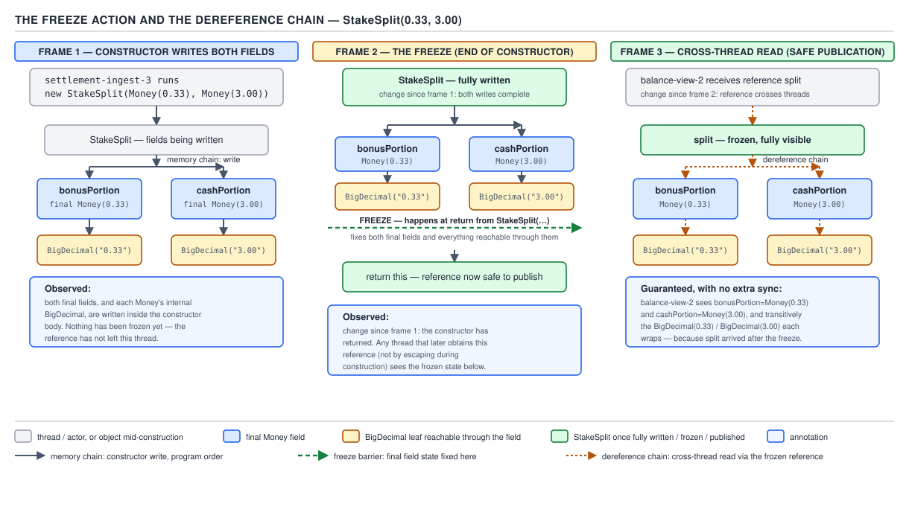
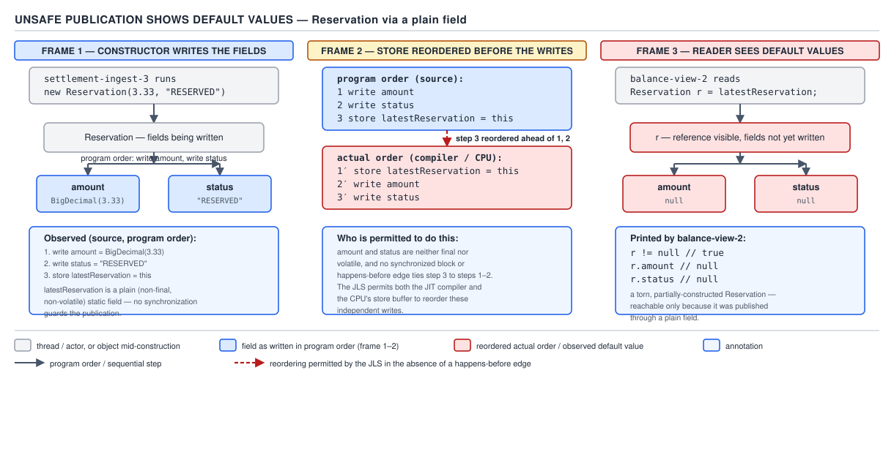

# 05 Multithreading and Concurrency — volatile and the JMM — BASICS (§1.11, leaves 1.11.1–1.11.14)

**Target version: Java 21 LTS.** | **Part 1 of 5** | [Index](../00-index.md)
Previous: [The JMM — reordering and barriers](02b-basics-reordering-and-barriers.md) · Next: [Lazy initialisation and singletons](03b-basics-lazy-init-and-singletons.md)

Everything in `volatile`, `synchronized`, and `AtomicReference` publishes a value across
threads by installing a happens-before edge at the point of publication. `final` fields do
something different: they give a visibility guarantee **with no synchronization at all**,
as long as the object was built correctly. This file is about that guarantee, exactly where
it breaks, and the five ways to publish a reference safely when a `final` field alone is not
enough.

---

### 1. JLS 17.5 and the freeze action

**Mental model.** A `final` field is not "read-only" in the JMM's eyes — it is a field that
gets a one-time visibility promise stapled to it at the moment construction finishes. Picture
the constructor's field writes as ink still wet on a page. The **freeze** action is the
moment the page dries. Any thread that later reaches the object through a reference obtained
*after* the page dried reads dry ink: the correctly initialised value, guaranteed, without a
lock, a `volatile`, or an `Atomic*` in sight.

**Why it exists.** Before JSR-133 (Java 5), there was no such promise. A `final` field could
legally appear to a second thread as its default value (`0`, `null`, `false`) even after the
constructor had returned, because nothing forced the constructor's writes to become visible
before the reference did — making every "immutable" value object, the safe answer candidates
reach for, potentially unsafe unless also published through a happens-before edge. JSR-133
closed exactly this hole for `final` fields, so immutability could deliver on its promise.

**When it applies, and when it does not.** It applies to every `final` field of an object
that is **correctly constructed** (§2 below) — reached through a reference obtained after
construction completed. It does **not** apply to non-final fields, or to any field at all if
`this` escaped during construction. It is also not a substitute for `volatile` on a field
reassigned later — `final` fields are, definitionally, never reassigned.

**How it works.** JLS §17.5 states the guarantee plainly. `[SOURCE]`

> "A thread that can see an object after it is has been completely initialized is guaranteed
> to see the correctly initialized values for that object's final fields."

Two words carry the whole mechanism: "completely initialized". §17.5.1 defines the **freeze**
action that makes "completely initialized" precise. `[SOURCE]` `[PROVE]`

> "The write to a final field... within the constructor... is frozen after it is written,
> within the constructor. A freeze action on a final field f of an object o takes place when
> the constructor in which f is written exits, either normally or abruptly."

Read it as: the freeze is not a barrier you insert — it is a boundary the JLS places
automatically at every constructor exit, for every `final` field that constructor wrote. The
freeze then interacts with two further pieces of machinery to make the guarantee reach past
the immediately-written field:

- **The memory chain.** The freeze creates a partial order between the constructor's writes
  to `final` fields and the subsequent action that publishes the reference `o`. Any thread
  that reads `o` after that publishing action is guaranteed to observe the frozen values.
- **The dereference chain.** If a `final` field itself holds a reference to another object,
  the guarantee is **transitive**: a thread that correctly sees the outer object's `final`
  field is also guaranteed to see the *state of the object that field points to*, as it stood
  at the freeze — not merely a non-null reference to it.

Work the proof through with a concrete `StakeSplit` — a record still runs the compact
constructor through the same freeze machinery as a hand-written class:

```java
public record StakeSplit(Money bonusPortion, Money cashPortion) {
    public StakeSplit {
        if (bonusPortion.amount().signum() < 0 || cashPortion.amount().signum() < 0) {
            throw new IllegalArgumentException("stake split legs must not be negative");
        }
        // invariant enforced by the caller that builds bonusPortion + cashPortion:
        // their sum must equal the stake exactly — e.g. a 3.33 stake splits as
        // bonusPortion = 0.33, cashPortion = 3.00, never 0.34 + 3.00.
    }
}
```

Frame 1: the compact constructor runs, writing the reference stored in `bonusPortion` and
the reference stored in `cashPortion`. Each of those references points at a `Money`, whose
own `BigDecimal amount` field was frozen when *that* constructor exited, earlier. Frame 2:
`StakeSplit`'s own constructor exits — the freeze action fires for `bonusPortion` and
`cashPortion` together. Frame 3: a second thread receives a reference to this `StakeSplit`
(say, through a `BlockingQueue`, itself safe-published — see §5). By the dereference chain,
that thread is guaranteed to see not just non-null `bonusPortion`/`cashPortion` references,
but the correctly initialised `BigDecimal` inside each `Money`, two objects deep, with no
lock taken anywhere in the read path.



**D-043** — The freeze action and the dereference chain.

**The gotcha.** The guarantee is about the state *as of the freeze*, not "forever". If a
`final Money` field itself contained a mutable object and something later mutated it through
a back-door reference, the freeze says nothing about that later write — final fields freeze
the reference and the state reachable through it at construction time, not a lock on all
future access.

> **Definition.** The freeze action is the point, at constructor exit, from which the JMM
> guarantees that any thread obtaining the object's reference afterward sees its `final`
> fields, and everything reachable through them, exactly as they stood at that exit.

---

### 2. "Correctly constructed" — the whole guarantee rests on one word

**Mental model.** Think of construction as a room with the door shut. §1's guarantee is a
promise about what the room looks like *once the door has fully closed and someone hands you
the key*. If anyone was let into the room while it was still being furnished, the promise is
void for everyone — including the person who opened the door only a crack.

**Why it exists.** The freeze action's proof depends on ordering: the constructor's writes to
`final` fields happen-before the freeze, which happens-before the reference becomes visible to
another thread. That chain has one weak link — the last step assumes the reference was not
visible to any other thread until construction ended. If it was, the chain never forms, and
the JMM makes no promise at all, final fields or not.

**When it applies, and when it fails.** "Correctly constructed" means `this` did not escape
during the constructor body — no other thread obtained a reference to the object being built
before the constructor returned. `[TRAP]` `[PROVE]` The proof of failure is direct: if a
second thread holds a reference while the constructor is still running, that thread can read
the object's fields — final or not — *before* the freeze fires. There is no happens-before
edge between "constructor started writing `bonusPortion`" and "other thread dereferences
`bonusPortion`", so the read is plain and unordered, subject to every reordering the JMM
otherwise permits. `final` adds nothing once the reference is out before the door shuts.

**Pitfall:** "It's `final`, so it's safe to read from any thread the moment I have a
reference." **Wrong** — safety depends on *how* the reference was obtained. **Right**:
`final` protects a thread that received the reference *after* construction completed. A
reference leaked *during* construction gets none of it.

> **Definition.** An object is correctly constructed when no reference to it — via `this` or
> any alias — became visible to another thread before its constructor returned; only for a
> correctly constructed object does the `final`-field guarantee of §1 hold.

---

### 3. The four ways `this` escapes

**Mental model.** Escape is always the constructor handing out a copy of the room key before
the furniture is bolted down. There are exactly four doors it can go out of.

**Why it matters here.** Every one of these four leaks the reference to `this` — or an
inner-class reference that closes over it — while the constructor body is still running,
which is precisely the condition §2 says voids the `final`-field guarantee.

**The four escapes.** `[TRAP]`

1. **Registering a listener from inside the constructor.** `someBus.subscribe(this)` hands
   the bus a reference before the constructor finishes; whichever thread delivers the next
   event may see a half-built object.
2. **Starting a thread from inside the constructor**, passing `this` (directly, or as the
   `Runnable` target). The new thread can begin reading `this` concurrently with the rest of
   the constructor body.
3. **Passing `this` to a static factory or registry** — e.g. `ActiveReservations.track(this)`
   — before construction ends. Any thread that looks the object up in that registry sees it
   under construction.
4. **Calling an overridable (non-`private`, non-`final`) method from the constructor.** A
   subclass override executes with the superclass's fields still being written, and if that
   override leaks `this` to another thread the escape happens via a path the base class's
   author never wrote directly.

```java
public final class Reservation {
    private final ClientId clientId;
    private final Money amount;

    public Reservation(ClientId clientId, Money amount, NotificationService notifier) {
        this.clientId = clientId;
        // ESCAPE (way 1): notifier now holds `this` before amount is assigned.
        notifier.onReservationOpened(this);
        this.amount = amount;
    }
}
```

A thread woken by `onReservationOpened` can read `reservation.amount` and get `null` —
`Money` is not primitive-defaulted, it defaults to `null` — despite `amount` being `final`.

**How to fix it — §4 gives the idiom.**

> **Definition.** `this`-escape is any action, inside a constructor, that makes a reference
> to the object under construction (or an inner class closing over it) reachable from another
> thread before the constructor returns.

---

**Supporting fact — 1.11.5 the safe-construction idiom.** `[BUILD]`

Mechanism: make the constructor `private`, and expose a `static` factory that performs any
work needing to publish `this` — registering, starting a thread, notifying — only *after* the
object reference is returned from the constructor call:

```java
public final class Reservation {
    private final ClientId clientId;
    private final Money amount;

    private Reservation(ClientId clientId, Money amount) {
        this.clientId = clientId;
        this.amount = amount;
    }

    public static Reservation openAndNotify(ClientId clientId, Money amount,
                                             NotificationService notifier) {
        Reservation reservation = new Reservation(clientId, amount); // constructor fully returns first
        notifier.onReservationOpened(reservation);                   // publish only now
        return reservation;
    }
}
```

Gotcha: the discipline has to be enforced everywhere the type is built — a second public
constructor added later re-opens the hole. Definition: the safe-construction idiom defers any
action that could publish `this` until after the constructor that would otherwise leak it has
returned.

**Supporting fact — 1.11.6 reading a final field before it is assigned.** `[SOURCE]` `[TRAP]`

Mechanism: JLS §17.5.2 covers reading a `final` field **during** construction, before its own
write executes — typically via one of the four §3 escapes.

> "If a thread other than the one executing the constructor reads the value of a final field
> before the constructor has completed... it might see the default value for the field's
> type, rather than the value assigned in the constructor."

Gotcha: this needs a reachable escape — it is not a claim that `final` reads are ever stale
for a correctly constructed object. Definition: a `final` field read via an escaped reference
before its own assignment may show the type's default value, not the assigned one.

**Supporting fact — 1.11.7 reflection and re-freezing.** `[SOURCE]` `[TRAP]`

Mechanism: JLS §17.5.3 lets a `final` field be modified post-construction via
`Field.setAccessible` + `Field.set`; a fresh freeze fires after each such write.

> "...a final field that is initially written with the default value for its type... and
> then is modified via reflection... this new value... freezes again after that write."

Gotcha: a reader that already read the field, or a value the compiler constant-folded at
compile time (a compile-time-constant `static final`), is not guaranteed to see the change —
the re-freeze does not retroactively correct either. Definition: reflection re-triggers the
freeze on a `final` field, but prior reads or folds of it are unaffected.

**Supporting fact — 1.11.8 write-protected fields.** `[SOURCE]` `[RESEARCH]`

Mechanism: JLS §17.5.4 carves out `System.in`/`out`/`err` — `public static final` yet mutable
via `setIn`/`setOut`/`setErr` through VM-privileged native methods, not reflection.

> "...the fields System.in, System.out, and System.err are updated using private native
> methods... the compiler must not... assume the value of the field will not change."

Gotcha: a named, closed list of three, not a general escape hatch — it exists so `javac`
never constant-folds them. Definition: these three `final` fields are explicitly excluded
from constant-folding and the immutability assumption the compiler otherwise makes.

**Supporting fact — 1.11.9 why `String` is safe.** `[X-REF 03]` `[PROVE]`

Mechanism, worked through: `String.hash` is a non-final, lazily-computed cache of
`hashCode()`, written without a lock. Racing writers all compute the *same* value from
`value` (a pure function), so the race is **benign** — no reader ever observes a wrong
answer, only redundant recomputation. That safety depends entirely on `value` itself being
`final` and freeze-protected (§1): an unstable `value` would let racing reads see different
bytes, breaking "every writer agrees." Gotcha: the benign-race argument collapses the moment
the input it reads is not itself safely published. See guide 03 for the interning discussion
this feeds into.

**Supporting fact — 1.11.10 publication, defined.** Mechanism: publication is making a
reference reachable outside the scope that created it — returning it, storing it in a field
another thread can read, passing it on, adding it to a collection. **Unsafe** publication does
this with no happens-before edge to the object's construction. Gotcha: most publication in a
correct single-threaded path is safe by construction — the risk is specific to concurrent,
cross-thread visibility. Definition: unsafe publication exposes a reference with no ordering
guarantee that the object's fields are visible to the receiving thread.

---

### 4. Unsafe publication in detail — a non-null reference to a half-built object

**Mental model.** Picture handing someone a sealed envelope while you are still writing the
letter inside it. They can open the envelope (the reference is non-null, it dereferences
fine) but the page inside may be blank, or half a sentence, because nothing stopped them from
opening it before you finished writing.

**Why it happens.** The JMM permits the compiler and the runtime to reorder a constructor's
field writes relative to the store that publishes the reference — as long as no
happens-before edge forbids it, this reordering is legal exactly like any other reordering
covered in file 02b. A plain field write publishing a reference is not `volatile`, carries no
memory barrier, and creates no such edge.

**When it bites.** Any type with **non-final** fields, published through a **plain field**,
read from a thread that did not itself perform the construction. `final` fields are immune
via §1; `volatile` fields and lock-guarded fields are immune via §5. A plain reference field
is the one publication path that offers no protection at all.

**How it works — worked through.** `[PROVE]`

```java
public class ReservationHolder {
    public Reservation reservation; // plain field — NOT final, NOT volatile

    public void open(ClientId clientId, Money amount) {
        // Constructor runs: writes clientId then amount inside `new Reservation(...)`.
        this.reservation = new Reservation(clientId, amount); // the publishing store
    }
}
```

Frame 1: the `Reservation` constructor writes `clientId` then `amount`. Frame 2: the JMM
permits the store to `this.reservation` — the publishing write — to become visible to another
thread *before* those two field writes do, because there is no ordering edge tying them
together on a plain field. Frame 3: a second thread calling `holder.reservation` at the wrong
moment reads a **non-null** `Reservation` reference and then reads `status == null` and
`amount == null` off it — the default values for reference fields — even though the
constructor "already ran" from the writing thread's point of view.



**D-044** — Unsafe publication shows default values.

**The gotcha.** This is not a rare interleaving that "probably won't happen in practice" —
it is legal under the JMM regardless of how unlikely a given JIT/CPU combination makes it,
and a passing test proves nothing about it, because the reordering is a compiler/runtime
liberty, not a guaranteed transformation; the bug is dormant until an optimisation level,
CPU architecture, or JIT version decides to exercise it.

**Interview:** "Why can a reader see a non-null object with null/zero fields?" — because the
reference publish and the constructor's field writes are two independent, unordered stores
on a plain field, and the JMM allows them to become visible out of order absent a
happens-before edge.

> **Definition.** Unsafe publication is exposing a reference to a mutable object through a
> plain field (or any path with no happens-before edge to the constructor), letting another
> thread observe a non-null reference whose fields have not yet received their constructed
> values.

---

### 5. The five safe-publication mechanisms

**Mental model.** Five different ways to make sure the "envelope" (§4) is only handed over
after the "letter" (the object's state) is finished — five different happens-before edges,
each installed by a different piece of machinery.

**Why five, and not one.** Each fits a different shape of problem: a value fixed for the
whole JVM lifetime, a reference that changes over time, an object built once and never
mutated, state that is mutated under a lock, or a hand-off through a library that already
does one of the other four internally.

**When each wins.**

| Mechanism | Fits | Loses to |
|---|---|---|
| Static initializer | One-time, JVM-lifetime state (a shared config, a singleton) | Anything created per-request |
| `volatile` field / `AtomicReference` | A reference reassigned over time, read far more than written | A field also needing compound atomic updates across multiple fields |
| `final` field of a correctly constructed object | Immutable value objects (`Money`, `StakeSplit`) | Anything mutated after construction |
| Field guarded by a lock, read under the same lock | Mutable state accessed by multiple threads at multiple points | Read-heavy, rarely-written data — the lock cost is wasted |
| `java.util.concurrent` collection / executor | Handing an object across a thread boundary through a queue/pool | Direct field access where no such collection is already in play |

**How each works, briefly — the mechanism, not a re-derivation.** A static initializer runs
under a class-initialization lock the JVM treats as a happens-before edge to every later
reader (file 03b covers class-init deadlock). A `volatile` write/read pair is a
release/acquire edge (files 02a–02b). A `final` field's edge is the freeze action from §1. A
lock's edge is unlock-happens-before-subsequent-lock (file 01). A `java.util.concurrent`
collection's internal locking or CAS installs one of the previous four edges on the caller's
behalf — `BlockingQueue.put`/`take` is why "drop it on a `ConcurrentLinkedQueue`" is a
legitimate answer, not a hand-wave.

```java
// Safe publication via AtomicReference — a Reservation reassigned as its lifecycle advances.
public final class ReservationHolder {
    private final AtomicReference<Reservation> current = new AtomicReference<>();

    public void open(ClientId clientId, Money amount) {
        current.set(new Reservation(clientId, amount)); // release: constructor writes happen-before this store
    }

    public Reservation currentReservation() {
        return current.get(); // acquire: sees every write that happened-before the matching set()
    }
}
```

**The gotcha.** Safe publication of the *reference* is not the same claim as safe publication
of everything reachable through it — a `volatile Reservation` field safely publishes the
`Reservation` object itself, but if `Reservation` had a non-final, unguarded mutable field,
concurrent access to *that* field is a separate race the publication mechanism does nothing
about. Which of these two remaining leaves (1.11.13, 1.11.14) applies depends on exactly that
distinction.

> **Definition.** Safe publication is exposing a reference through a path that carries a
> happens-before edge from the object's construction (or last mutation) to the reading
> thread — a static initializer, `volatile`/`Atomic*`, a `final` field, a lock, or a
> `java.util.concurrent` collection.

---

**Supporting fact — 1.11.13 effectively immutable objects.** Mechanism: a type that is
technically mutable (no `final` fields enforcing it) but which the program simply never
mutates once published — e.g. a `Reservation` built once and only ever read afterward. Safe
if, and only if, it was safely published by one of the §5 mechanisms; the JMM has no idea the
program "promises" not to mutate it. Gotcha: the next engineer who adds a setter and calls it
from a background job breaks the guarantee silently, with no compiler warning. Definition: an
effectively immutable object is mutable by type but never mutated after safe publication.

**Supporting fact — 1.11.14 mutable objects.** Mechanism: an object that genuinely changes
state after publication — e.g. a `Reservation` whose `status` transitions as the stake
resolves — needs safe publication for the *initial* reference **and** a lock (or
`volatile`/CAS per field) held for *every subsequent access*, for the object's whole lifetime.
Gotcha: safely publishing the reference once buys nothing for later mutations — the single
most common gap between "I made it `volatile`" and "it's actually thread-safe" once more than
one field must move together. Definition: a mutable object requires safe publication at
hand-off and lock discipline on every field access thereafter, indefinitely.

---

## Pitfalls

### Assuming `final` alone makes any object safe to hand to another thread

**Wrong**

```java
public class ReservationBox {
    public Reservation reservation; // plain field, holds a "final-fielded" Reservation
}
```

Believing `Reservation`'s own `final` fields protect readers of `ReservationBox.reservation`
regardless of how the box's field is published. A reader can still see the box's plain field
update before the `Reservation` reference (and, transitively, its `final` fields) are visible
— the box's field carries no happens-before edge of its own.

**Right**

```java
public class ReservationBox {
    private final AtomicReference<Reservation> reservation = new AtomicReference<>();
    void openFrom(Reservation r) { reservation.set(r); }
    Reservation current() { return reservation.get(); }
}
```

The `final`-field guarantee protects `Reservation`'s own fields once a thread has a correctly
published reference to it — it says nothing about how that reference itself gets from one
thread to another. The *holder* needs its own safe-publication mechanism.

**Why people believe it:** `final` is advertised as "the safe, simple immutability keyword" —
but the guarantee is scoped to the object it is declared on, not to every field pointing at it.

### Assuming a passing test proves a publication path is safe

**Wrong**

```java
// Ran 10,000 times locally with no failure — "so it's fine".
ReservationHolder.reservation = new Reservation(clientId, amount); // plain field
```

**Right** — use one of the five §5 mechanisms and reason about the happens-before edge
directly rather than about observed failure rates; the JLS makes no promise about how often
a legal reordering manifests on a given JIT/CPU/optimisation-level combination.

**Why people believe it:** unsafe publication failures are rare in practice on common
hardware and JIT configurations, which trains exactly the wrong intuition — "it hasn't
happened" and "it cannot happen" are unrelated claims here.

---

## Cheat sheet

| Fact | Detail |
|---|---|
| Freeze action | Fires at constructor exit, for every `final` field that constructor wrote (JLS 17.5.1) |
| Guarantee scope | Only for a correctly constructed object — `this` must not have escaped |
| Transitivity | Dereference chain extends the guarantee to state reachable through a `final` field |
| `this`-escape, 4 ways | Listener registration, thread start, static factory/registry, overridable method call |
| Fix for escape | Private constructor + static factory that publishes only after construction returns |
| Read before assignment (17.5.2) | May observe the type's default value |
| Reflective final write (17.5.3) | Re-freezes, but constant-folded readers may never see the new value |
| `System.in/out/err` (17.5.4) | `final` but explicitly excluded from constant-folding, mutable via `setIn/Out/Err` |
| Why `String` is safe | `value` is `final` (freeze-protected); `hash` is a benign race safe only because `value` is stable |
| Unsafe publication | Reference store and constructor field stores reordered — non-null ref, default-valued fields |
| Five safe-publication mechanisms | Static initializer; `volatile`/`AtomicReference`; `final` field; lock-guarded field; `j.u.c` collection/executor |
| Effectively immutable | Mutable type, never mutated post-publication — safe only if safely published |
| Mutable, ongoing | Needs safe publication **and** a lock on every subsequent access, forever |

## Self-test

**Q1.** Why does a `final Money` field inside a correctly constructed `StakeSplit` never
need `volatile` to be read safely from another thread?

<details><summary>Answer</summary>

Because JLS 17.5's freeze action fires when `StakeSplit`'s constructor exits, and the
dereference chain extends that guarantee transitively through the `final` reference into the
`Money` object it points to. Any thread that obtains the `StakeSplit` reference after
construction is guaranteed to see the frozen state, with no synchronization required — as
long as `StakeSplit` was correctly constructed (no `this`-escape).

</details>

**Q2.** A `Reservation` is registered with a `NotificationService` on the first line of its
constructor, before `amount` is assigned. What can the notification callback observe?

<details><summary>Answer</summary>

`this` has escaped before construction finished, so the "correctly constructed" precondition
is violated — the `final`-field guarantee does not apply at all. The callback can observe
`amount` as `null` (the default value for a reference field), because it may run
concurrently with, or even entirely before, the assignment of `amount`.

</details>

**Q3.** Name the four ways `this` can escape a constructor.

<details><summary>Answer</summary>

Registering a listener with `this`; starting a thread with `this` (directly or as a
`Runnable` target); passing `this` to a static factory or registry; and calling an
overridable method from the constructor, which a subclass override can use to leak the
partially-built instance.

</details>

**Q4.** `ReservationHolder.reservation` is a plain (non-final, non-volatile) field. Thread A
runs `holder.reservation = new Reservation(clientId, amount)`. Thread B reads
`holder.reservation` and finds it non-null. What, precisely, is Thread B allowed to see for
`reservation.amount`?

<details><summary>Answer</summary>

`null` — the default value for a reference field — despite the constructor "having run" from
Thread A's perspective. The JMM permits the store publishing the reference to become visible
before the constructor's own field writes, because a plain field carries no happens-before
edge between the two. This is unsafe publication, not a rare bug — it is legal under the
spec.

</details>

**Q5.** List the five safe-publication mechanisms.

<details><summary>Answer</summary>

A static initializer; a `volatile` field or `AtomicReference`; a `final` field of a correctly
constructed object; a field guarded by a lock and read under that same lock; and any
`java.util.concurrent` collection or executor (its internal synchronization installs the edge
on the caller's behalf).

</details>

**Q6.** `String.hash` is not `final`, yet two threads can call `hashCode()` on the same
`String` concurrently with no observable bug. Why is this race benign, and what does the
argument depend on?

<details><summary>Answer</summary>

Every thread computing `hashCode()` derives the same value from the same input, so a race
between writers can only ever produce redundant, identical writes to `hash` — no reader can
observe an incorrect value. The argument depends entirely on the input being stable: `value`
(the backing array `hashCode()` reads) is `final` and therefore safely published by the
freeze action. If `value` were not `final`, concurrent readers of `value` itself could race,
and the "every writer computes the same answer" premise would no longer hold.

</details>

**Q7.** What does JLS §17.5.3 say happens when a `final` field is modified via reflection,
and why doesn't that guarantee every reader sees the new value?

<details><summary>Answer</summary>

A fresh freeze action fires after the reflective `Field.set` completes, giving later readers
of the reference the same visibility guarantee as an ordinary constructor-time freeze. It
does not guarantee every reader sees the change because a reader that already read the field
before the reflective write, or a compiler that constant-folded the field's original value
at compile time (legal for compile-time-constant `static final` fields), has no obligation
or mechanism to observe the update.

</details>

**Q8.** Is a `Reservation` that is safely published once, but whose `status` field is later
mutated by a background settlement job, thread-safe to read from any thread at any time?

<details><summary>Answer</summary>

Not without more. Safe publication guarantees the state visible *at the point of
publication*. Because `status` is mutated afterward, `Reservation` is a genuinely mutable
object (leaf 1.11.14, not 1.11.13), and every subsequent access — read or write — needs its
own synchronization (a lock, or `volatile`/CAS on that field) for the whole lifetime of the
object, not just at hand-off.

</details>

---

**Leaves covered:** 1.11.1–1.11.14 (14 leaves)
**Leaves deferred:** none
**Diagrams included:** D-043, D-044
**Target version:** Java 21 LTS
**Lines:** 598
