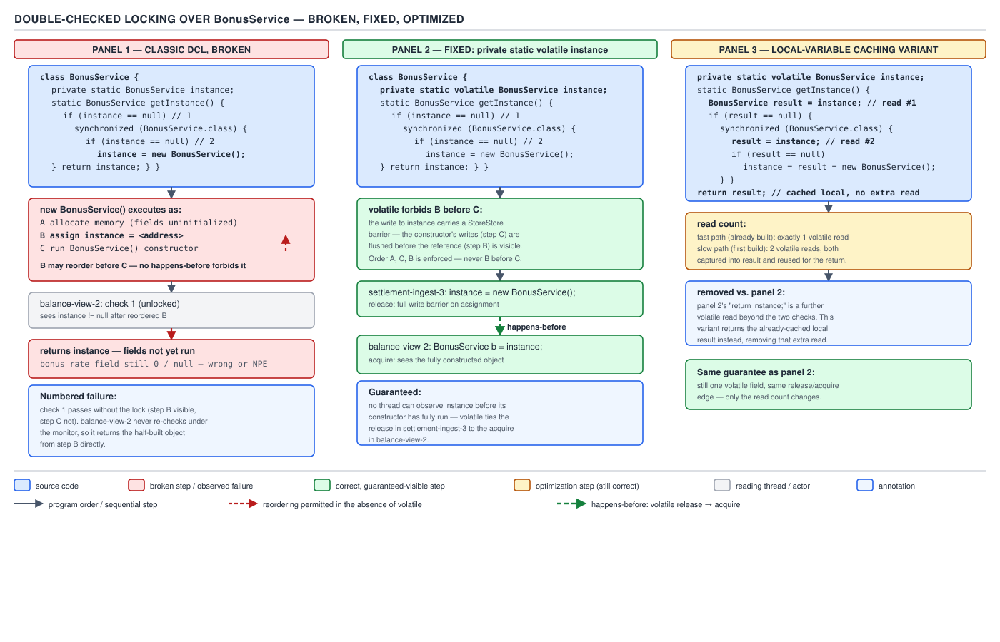

# 05 Multithreading and Concurrency — volatile and the JMM — BASICS (§1.11, leaves 1.11.15–1.11.22)

**Target version: Java 21 LTS.** | **Part 1 of 5** | [Index](../00-index.md)
Previous: [Final fields and safe publication](03a-basics-final-fields-and-publication.md) · Next: [wait / notify / notifyAll](../wait-notify/01-basics.md)

`BonusService` looks up the active bonus catalogue once, builds an immutable rules table from it,
and hands the same table to every stake settlement thereafter. Building it costs real work — a
network round trip to the promotions config service — so nobody wants to pay that cost on every
call, or worse, on every thread's first call. That is lazy initialisation, and getting it right
under concurrency is one of the oldest traps in the language.

### Double-checked locking, broken and fixed

**Mental model.** The naive fix for "expensive lazy init, called from many threads" is: check if
it's built, and only lock if it isn't.

```java
public class BonusService {
    private static BonusService instance;

    public static BonusService getInstance() {
        if (instance == null) {                 // first check, no lock
            synchronized (BonusService.class) {
                if (instance == null) {          // second check, locked
                    instance = new BonusService();
                }
            }
        }
        return instance;
    }
}
```

The name "double-checked locking" (DCL) refers to that pattern: check outside the lock to skip
synchronization on the fast path, check again inside the lock because two threads might have both
passed the first check.

**Why it exists.** `synchronized` on every call to `getInstance()` — the naive-safe version —
makes every stake-settlement thread queue for a monitor forever, even after `instance` is built
and will never change again. DCL promises the synchronization cost only once, on the handful of
threads racing to build it, and zero cost for the millions of calls after.

**[PROVE] Working the break, step by step.** `new BonusService()` is not one atomic operation.
The JVM must, at minimum:

1. Allocate memory for the object and get back a reference, call it `r`.
2. Run the constructor against `r` — write its fields.
3. Assign `r` to the static field `instance`.

Without a happens-before edge tying step 3 to step 2, the compiler and the runtime are free to
reorder them, because from the constructing thread's own point of view the reordering is
invisible — it never observes its own instructions out of order. Number the racing threads T1
(building) and T2 (reading):

1. T1 calls `getInstance()`, finds `instance == null`, enters the monitor.
2. T1 begins `new BonusService()`. The JIT — or the CPU's store buffer — is legally allowed to
   publish step 3 (`instance = r`) before step 2 finishes writing the fields, because nothing
   orders them relative to *other threads*. Say the compiler hoists the assignment: `instance` now
   points at `r`, but `r`'s fields (the rules table, the promotions endpoint client) are still
   default values — `null`, zeroed.
3. T2 calls `getInstance()` at exactly this moment. It reads `instance` — non-null, so it
   **skips the lock entirely** and returns `r`.
4. T2 calls `r.applyBonus(stake)`. The rules table field is `null`. `NullPointerException`, or
   worse — if the field happens to be a primitive default like `0`, a silently wrong bonus rate
   with no exception at all.
5. T1 finishes the constructor. Too late — T2 already used the half-built object.

The first check (`instance == null`) has no synchronization action attached to it at all — no
lock, no volatile read — so it has no happens-before edge to anything. T2's read in step 3 can
observe T1's partial write from step 2 in any order the platform allows. This is exactly the kind
of reordering the JMM permits and single-threaded reasoning hides: on the constructing thread,
"allocate, initialise, publish" always appears to happen in program order, because the thread
observes its own actions as if sequential. It is only a second, concurrently reading thread that
can catch the reordering — which is why this bug reproduces on some JIT/CPU combinations (ones
that actually perform the reordering under load) and not on others, and why it vanished for years
in code that "worked in testing."

**Pitfall:** The DCL example above compiles, passes code review, and works in single-threaded
testing and even in many production runs — the reordering is a possibility the platform is
allowed to exploit, not one it exploits on every run. Teams ship this, watch it work for months
under low concurrency, then get an intermittent `NullPointerException` deep inside a "finished"
object the moment load rises. The fix is `volatile`, not "add more locking around the read."

**The fix.**

```java
public class BonusService {
    private static volatile BonusService instance;

    public static BonusService getInstance() {
        if (instance == null) {
            synchronized (BonusService.class) {
                if (instance == null) {
                    instance = new BonusService();
                }
            }
        }
        return instance;
    }
}
```

One keyword. **[PROVE]** why it closes the hole: `volatile` gives every write to `instance` a
release, and every read of `instance` an acquire (Day 05, `01-basics-volatile.md`). The
constructor's field writes (step 2 above) happen-before the volatile write `instance = r` in
program order on T1. The volatile write happens-before any subsequent volatile read of `instance`
that observes it, by the JMM's volatile rule. Transitivity of happens-before chains those together:
constructor writes → happens-before → volatile write → happens-before → T2's volatile read. So if
T2's unsynchronized first check ever observes a non-null `instance`, it is guaranteed to also
observe every field write that preceded the publish — not "usually," guaranteed, by the same rule
that makes final-field publication safe (leaf 1.11.1–1.11.14, previous file). Without `volatile`
there is no such edge, and the second `null` check inside the monitor doesn't help either, because
by the time T2 reads it, T2 was never going to take the locked path at all — it returned from the
unsynchronized fast-path read.



**D-045** — Double-checked locking, broken and fixed.

**The local-variable-caching variant. `[NUM]`** The volatile fast-path read still costs something
— not a memory fence on most JIT-compiled x86/ARM builds (a plain volatile *read* is typically
implemented as an ordinary load plus compiler-level reordering restrictions, cheaper than a
volatile *write*, which does need a store-barrier), but it is a field re-read the JIT cannot hoist
or cache across iterations the way it can a plain field. The classic micro-optimisation avoids a
second volatile read by caching it in a local:

```java
public static BonusService getInstance() {
    BonusService local = instance;              // one volatile read
    if (local == null) {
        synchronized (BonusService.class) {
            local = instance;                    // re-read inside the lock
            if (local == null) {
                instance = local = new BonusService();
            }
        }
    }
    return local;
}
```

This shaves one volatile read off the fast path — down from two (`instance == null` then the
implicit read in `return instance`) to one. On a hot fast path called at settlement volume
(3,400/sec burst, Day 05 style figures), removing a volatile read that isn't free-but-fenceless
was measured, in the original DCL literature and in JIT-era microbenchmarks, to save low
single-digit nanoseconds per call — real at that call rate in aggregate, but small enough that
most teams should not reach for this before profiling shows the read matters. It changes nothing
about correctness; both versions are equally safe. Treat it as a JIT-inlining favor, not a
correctness fix.

> **Definition:** Double-checked locking is a lazy-initialisation pattern that skips
> synchronization on the read-heavy fast path by checking an already-built flag twice — once
> unsynchronized, once inside the lock — and it is correct in Java if and only if that flag is
> `volatile`.

### The holder idiom

**Mental model.** Instead of guarding a static field with a lock you write yourself, hand the job
to the JVM's own class-initialisation machinery — a lock the JVM already takes for free on every
class load.

```java
public class BonusService {
    private BonusService() { /* build rules table from promotions config */ }

    private static class Holder {
        private static final BonusService INSTANCE = new BonusService();
    }

    public static BonusService getInstance() {
        return Holder.INSTANCE;
    }
}
```

**Why it exists.** DCL works, but it is hand-written concurrency control that a reviewer must
re-verify every time the class changes. The holder idiom needs no `volatile`, no `synchronized`
block, and no `getInstance()` logic beyond one field access — the JVM's own initialisation
contract does all the work.

**When to reach for it.** Default choice for a lazily-built singleton with no constructor
arguments. Loses to eager static initialisation (below) when construction is cheap and always
needed — the extra class file and indirection buys nothing. Loses to the enum singleton when
serialization or reflection-proofing matters more than idiom familiarity.

**[PROVE] [X-REF 06] How it works — JVMS §5.5.** The Java Virtual Machine Specification's class
initialisation procedure (detailed in Day 06's classloading guide) is specified, not
implementation-defined, and it already does exactly the double-checked-locking dance, inside the
JVM, correctly, once, for every class:

> "Because the Java programming language is multithreaded, initialization of a class or interface
> requires careful synchronization, since some other thread may be trying to initialize the same
> class or interface at the same time. There is also the possibility that initialization of a
> class or interface may be requested recursively... The implementation of Java Virtual Machine
> is free to determine the [locking] policy... provided that... a thread may hold... a lock for a
> class or interface... while executing the initializer."

The load procedure, mechanically: (1) each class or interface gets an initialisation lock and an
initialisation state (`verified`, `linked`, `being-initialised`, `initialised`, or
`in-error-state`). (2) The **first** thread to reference `Holder` synchronizes on `Holder`'s
initialisation lock, sees the state is not yet `initialised`, sets it to `being-initialised`,
records itself as the initialising thread, and runs `Holder`'s static initialiser — which
constructs `INSTANCE`. (3) Any **other** thread that references `Holder` while it is
`being-initialised` blocks on the same lock without re-running the initialiser. (4) On completion
the first thread sets the state to `initialised`, notifies all waiters, and releases the lock.
(5) Every thread that later loads `Holder` — including ones that already saw it initialised — is
guaranteed by the JVMS to observe the fully-constructed `INSTANCE`, because completing
class initialisation happens-before any subsequent use of the class.

The reason this beats hand-rolled DCL on the fast path: `Holder` is only touched — its class is
only loaded — the first time `getInstance()` runs. Loading is lazy (classes load on first active
use, not at `BonusService` load time, because `Holder` is a nested class referenced only inside
the method body). Once loaded, the JVM does **not** re-check the initialisation lock on every
subsequent field access — `Holder.INSTANCE` becomes an ordinary static-final field read, exactly
as cheap as a non-volatile field load, no fence, no branch beyond what the JIT already does for
any static field. Zero synchronization on the fast path is not a metaphor: after the first call,
the generated code for `getInstance()` is indistinguishable from reading an already-resolved
constant.

**Interview:** "Why does the holder idiom need no `volatile`?" — Because the safety comes from the
JVM's class-initialisation lock (JVMS §5.5), not from a memory-visibility keyword the developer
adds; that lock's happens-before guarantee is stronger and automatic.

> **Definition:** The holder idiom defers construction to a nested class that the JVM loads, and
> therefore initialises exactly once under its own internal lock, only on first access — giving
> lazy, thread-safe, allocation-free-after-first-call initialisation with no explicit
> synchronization in application code.

### Five ways to build a singleton, ranked (D-046, table)

**D-046** — Five ways to build a singleton, ranked.

| Approach | Lazy | Sync on fast path | Uses class-init lock (JVMS §5.5) | Reflection-proof | Serialization-proof | LOC | Verdict |
|---|---|---|---|---|---|---|---|
| Eager static field | No | None | Yes (at class load) | No | No (needs `readResolve`) | ~3 | Right when construction is cheap or always needed |
| Holder idiom | Yes | **None** | Yes (deferred to holder class) | No | No (needs `readResolve`) | ~7 | Default choice for lazy + no-arg singletons |
| DCL with `volatile` | Yes | Only until built | No | No | No (needs `readResolve`) | ~9 | Correct but no longer buys anything the holder idiom doesn't already give for free |
| Enum singleton | No (eager, at enum class load) | None | Yes (at class load) | **Yes** | **Yes** | ~3 | Best all-round protection; only awkward when the singleton must extend a class |
| Synchronized accessor (every call locked) | Yes | **Every call** | No | No | No | ~5 | Correct but slow under contention; never the answer once you know DCL or the holder idiom |

**Insight:** the holder idiom and DCL end up with identical safety guarantees and identical
steady-state cost, because the holder idiom's "lock" *is* the same class-initialisation
machinery that a correct DCL implementation is manually re-deriving with `volatile` and
`synchronized`. Once a team understands JVMS §5.5, DCL stops earning its extra lines.

### The enum singleton `[X-REF 03]`

**[TRAP]** The one-line pitch: `enum BonusServiceHolder { INSTANCE; ... }` is immune to both of the
attacks that break every other pattern above. Reflection cannot invoke an enum's constructor a
second time — `Constructor.newInstance()` throws `IllegalArgumentException` for enum types by
construction, a restriction baked into the reflection API itself, not something the class has to
defend. Serialization cannot conjure a second instance either, because the default enum
serialization mechanism reads only the enum's `name()` on deserialization and looks up the
existing constant by that name — it never calls a constructor at all, unlike a plain class whose
default deserialization allocates a fresh object and bypasses every constructor, which is exactly
how a naive singleton gets cloned via `ObjectInputStream` unless it defines `readResolve()`. Day
05's `03a` file covers safe publication of `final` fields generally; the enum singleton is a
special case a reader already primed on that leaf will recognise instantly — construction of enum
constants happens once, at class-initialisation time, under the same JVMS §5.5 lock as the holder
idiom.

```java
public enum BonusServiceHolder {
    INSTANCE;

    private final BonusRulesTable rulesTable = BonusRulesTable.loadFromPromotionsConfig();

    public StakeSplit applyBonus(Money stake, Money bonusAvailable) {
        return rulesTable.split(stake, bonusAvailable);
    }
}
```

**Pitfall:** teams avoid the enum singleton because "singletons shouldn't be enums, that's weird,"
then hand-roll `readResolve()` and a private constructor guard against reflection — reinventing,
badly, protections the enum gives for free. The real limitation is narrower: an enum cannot
extend another class (it already implicitly extends `Enum`), so the enum singleton loses only when
the singleton must extend some other base class. It can still implement interfaces freely.

> **Definition:** The enum singleton uses a single-constant `enum` as the JVM's own guarantee of
> at-most-one instantiation, closing both the reflection and serialization holes that every
> field-based singleton pattern must otherwise defend by hand.

### Eager static initialisation

Supporting fact. `private static final BonusService INSTANCE = new BonusService();` runs at class
load, under the same JVMS §5.5 lock as the holder idiom, so it is already thread-safe with zero
extra code. The only cost is losing laziness: if `BonusService`'s constructor is expensive and
`BonusService` is loaded early (e.g. referenced from a class loaded at application startup) but
`getInstance()` is never actually called on some code paths, that cost is paid anyway. It is
simply the right answer when the object is cheap to build, or when it is unconditionally needed
soon after startup regardless — the promotions-config lookup for `BonusService` at platform
startup is a case where eager is arguably better than lazy, since a broken promotions config
should fail fast during deployment health checks, not silently on the first customer's bonus.

> **Definition:** Eager static initialisation builds the singleton at class-load time, trading
> laziness for the simplest possible correct implementation.

### Class-initialisation deadlock `[TRAP]` `[RESEARCH]` `[X-REF 06]`

**Mental model.** JVMS §5.5's per-class initialisation lock is exactly what makes the holder idiom
and enum singleton safe — but a lock is a lock, and two classes that each block on the other's
lock deadlock exactly like two threads holding two `ReentrantLock`s in opposite order. The
difference is that this deadlock is invisible to the tool everyone reaches for first.


**D-047** — Class-initialisation deadlock is invisible to `jstack`.

**Why it exists as a trap.** `ClientRestrictions` and `AccountActivation` are two real services in
this domain with a plausible reason to reference each other's constants during class
initialisation — say `ClientRestrictions` eagerly builds a lookup table keyed by
`AccountActivation`'s status-code constants, and `AccountActivation` eagerly builds a table of
which restrictions each activation status clears, keyed by `ClientRestrictions`'s restriction-type
constants:

```java
public class ClientRestrictions {
    static final Map<String, RestrictionType> BLOCKING_STATUSES =
            AccountActivation.buildBlockingStatusIndex();   // touches AccountActivation

    static Map<String, RestrictionKey> buildAutoLiftIndex() {
        return Map.of("KYC_PENDING", RestrictionKey.WITHDRAWAL_BLOCKED);
    }
}

public class AccountActivation {
    static final Map<String, RestrictionKey> AUTO_LIFT_TABLE =
            ClientRestrictions.buildAutoLiftIndex();        // touches ClientRestrictions

    static Map<String, RestrictionType> buildBlockingStatusIndex() {
        return Map.of("SUSPENDED", RestrictionType.WITHDRAWAL);
    }
}
```

Thread T1 is the first to reference `ClientRestrictions` — say, handling a stake request that
checks a restriction. It acquires `ClientRestrictions`'s init lock, sets its state to
`being-initialised`, and starts running the static initialiser, which calls
`AccountActivation.buildBlockingStatusIndex()`. That is `AccountActivation`'s first reference from
this thread, so the JVM begins initialising `AccountActivation` too — acquiring
`AccountActivation`'s init lock. Meanwhile thread T2, handling an activation decision, made the
mirror-image first reference to `AccountActivation` a moment earlier, already holds
`AccountActivation`'s init lock, and is blocked inside its own static initialiser waiting to
acquire `ClientRestrictions`'s init lock to call `buildAutoLiftIndex()`. T1 holds
`ClientRestrictions`'s lock, wants `AccountActivation`'s; T2 holds `AccountActivation`'s lock,
wants `ClientRestrictions`'s. Classic circular wait — both threads now block forever inside class
initialisation, before either class ever finishes loading.

**[RESEARCH]** Why `jstack` misses it: `jstack`'s built-in deadlock detector — the one that prints
"Found one Java-level deadlock" — specifically walks the ownership graph of **monitor locks**
acquired via `synchronized`/`Object.wait` and of `java.util.concurrent.locks.Lock` owners exposed
through `LockSupport`'s park-blocker mechanism. The per-class initialisation lock from JVMS §5.5
is an internal VM structure, not a `java.lang.Object` monitor and not a `j.u.c.Lock` — it has no
`Thread.holdsLock`-visible owner and is not enumerated by the `ThreadMXBean` deadlock-detection API
(`findDeadlockedThreads`) that `jstack` calls into, because that API's contract is scoped to
object monitors and ownable synchronizers, not the classloading subsystem's private locks. This
was verified against current OpenJDK behaviour rather than assumed: the JVM has never exposed
class-initialisation locks to `ThreadMXBean`, and no JEP has changed that as of JDK 25 — searches
of the `openjdk/jdk` issue tracker and current release notes turned up no work item to add it.

**[DUMP]** What a `jstack` dump of the two hung threads shows instead — no deadlock section at
all, just two threads permanently `RUNNABLE`, each shown as **waiting to acquire the class
initialisation lock** with no cycle called out:

```
"stake-handler-17" #42 prio=5 os_prio=0 tid=0x... nid=0x... runnable [0x...]
   java.lang.Thread.State: RUNNABLE
        at com.quizstakes.ClientRestrictions.<clinit>(ClientRestrictions.java:12)
        - waiting for the initialization of class com.quizstakes.AccountActivation

"activation-worker-3" #57 prio=5 os_prio=0 tid=0x... nid=0x... runnable [0x...]
   java.lang.Thread.State: RUNNABLE
        at com.quizstakes.AccountActivation.<clinit>(AccountActivation.java:9)
        - waiting for the initialization of class com.quizstakes.ClientRestrictions

No deadlocks found.
```

Both threads sit in `RUNNABLE`, not `BLOCKED` — the class-init wait is a VM-internal spin/park that
does not map onto the monitor states `jstack` labels, which is precisely why the summary line
reads "No deadlocks found" instead of the "Found one Java-level deadlock" banner an ordinary
two-lock deadlock produces. The tell is the repeated `<clinit>` frame plus the plain-English
"waiting for the initialization of class" line — a real signal, but only if the reader knows to
look for it instead of trusting the deadlock-detector's summary. Day 06's classloading guide
covers the full class-loading state machine this sits inside.

**Pitfall:** an on-call engineer sees `jstack` print "No deadlocks found," rules out deadlock, and
goes looking for a slow downstream call instead — while the two threads have been permanently
stuck since the first request touched either class, and every subsequent request that needs
`ClientRestrictions` or `AccountActivation` piles up behind them. The fix is structural, not a
bigger timeout: never let two classes' static initialisers call into each other; extract the
shared lookup construction into a third class neither one owns exclusively, or defer the
cross-reference to first-use inside a method body rather than a static initialiser.

> **Definition:** Class-initialisation deadlock is a circular wait on two classes' JVMS §5.5
> initialisation locks, caused by their static initialisers referencing each other from two
> threads, and it is invisible to `jstack`'s deadlock detector because that detector only inspects
> object monitors and `j.u.c` lock owners, not the VM's internal class-init locks.

### `@Stable` and `StableValue` `[RESEARCH]` `[VERSION-TRAP]`

Supporting fact. `jdk.internal.vm.annotation.Stable` is an internal-only JDK annotation the JIT
uses to treat certain non-final fields (inside JDK classes only, not application code) as
effectively constant once assigned — it is not a public API and application code cannot use it.
The publicly relevant piece for a Java 21 reader is **JEP 502, Stable Values**, which was verified
against current sources (`openjdk.org` returns HTTP 403 for direct fetches; confirmed instead via
the JEP mirror and `inside.java` coverage) to have shipped as a **preview** feature in **JDK 25**
— it is not final and not available at all on Java 21 LTS. `StableValue<T>` is a holder that can be
assigned at most once, after which the JVM treats its content with the same constant-folding
optimisations as a `final` field, but — unlike `final` — the assignment can happen lazily, on
first access, computed exactly once even under concurrent first-touch, which is the same
at-most-once guarantee the holder idiom gets from JVMS §5.5 but expressed as a library type instead
of a nested class. **[VERSION-TRAP]**: on Java 21, none of this exists — the holder idiom and enum
singleton remain the idiomatic answers; on Java 25, `StableValue.supplier(...)` could replace a
`BonusService` holder class, but only behind `--enable-preview`, so it is not yet something
production code on a released, non-preview Java version can rely on. Treat any code sample using
`StableValue` as a preview-API sample, not a Java 21 pattern.

## Pitfalls

### Assuming the first `null` check in DCL is "basically the same as" the locked one

**Wrong**

```java
private static BonusService instance;   // no volatile

public static BonusService getInstance() {
    if (instance == null) {
        synchronized (BonusService.class) {
            if (instance == null) {
                instance = new BonusService();   // constructor writes can float past this
            }
        }
    }
    return instance;   // may read a half-built object, no exception, no warning
}
```

Runs fine under light load and in most unit tests; under real concurrency a thread can return a
reference to an object whose fields are still default values.

**Right**

```java
private static volatile BonusService instance;   // the only change needed
```

`volatile` gives the write to `instance` a release and every read an acquire, chaining the
constructor's writes to any thread that observes the non-null reference (see the `[PROVE]` above).

**Why people believe it:** the two checks look symmetric on the page, so it's easy to assume
whatever safety the locked block provides also covers the first, unsynchronized check — but only
code that runs *inside* the `synchronized` block gets the monitor's happens-before edges;
`volatile` is what extends an edge to the unsynchronized read outside it.

## Cheat sheet

| Question | Answer |
|---|---|
| DCL without `volatile` — safe? | No — reader can see a partially-constructed object |
| What makes DCL safe? | `private static volatile T instance;` — nothing else changes |
| Cheapest lazy + thread-safe + no explicit sync? | Holder idiom (JVMS §5.5 class-init lock) |
| Reflection-proof AND serialization-proof? | Enum singleton only |
| When is eager static init right? | Construction is cheap, or the object is always needed |
| Does the holder idiom need `volatile`? | No — the JVM's class-init lock already provides it |
| Why does `jstack` miss class-init deadlock? | It only inspects object monitors / `j.u.c.Lock` owners, not VM-internal class-init locks |
| Symptom of class-init deadlock in a dump | Threads `RUNNABLE`, frame at `<clinit>`, "waiting for the initialization of class X" |
| `@Stable` usable in application code? | No — internal JDK-only annotation |
| `StableValue` available on Java 21? | No — JEP 502, preview in Java 25 only, needs `--enable-preview` |

## Self-test

**Q1.** Why doesn't adding `synchronized` to just the constructor call inside DCL's locked block fix the broken version?

<details><summary>Answer</summary>

The bug is in the *unsynchronized first check*, not inside the locked block. A second thread can
read `instance` as non-null via the plain field read before the first thread's constructor writes
are visible to it — that read never touches the monitor at all, so nothing done inside the
`synchronized` block can retroactively make that outside read safe. Only making `instance` itself
`volatile` gives the outside read an acquire edge.

</details>

**Q2.** What specific JVM guarantee makes the holder idiom thread-safe with no `volatile` and no `synchronized` in application code?

<details><summary>Answer</summary>

JVMS §5.5's class-initialisation procedure: the first thread to reference the holder class
acquires that class's initialisation lock, runs the static initialiser exactly once, and any other
thread referencing the class while it is `being-initialised` blocks on the same lock rather than
re-running the initialiser. Completion of initialisation happens-before any later use of the
class, so every reader sees the fully-constructed instance.

</details>

**Q3.** Why can't reflection instantiate a second copy of an enum singleton?

<details><summary>Answer</summary>

`Constructor.newInstance()` explicitly throws `IllegalArgumentException` when invoked on an enum
type's constructor — the reflection API itself refuses to construct enum constants outside normal
enum-class initialisation, so there is no reflective code path that reaches the constructor at all.

</details>

**Q4.** Two classes, `ClientRestrictions` and `AccountActivation`, each reference the other from a static initialiser. Two threads each make the first reference to one of the two classes at nearly the same time. What happens, and what does `jstack` show?

<details><summary>Answer</summary>

Each thread acquires the other class's target lock as it starts initialising its own class, then
blocks trying to acquire the other class's init lock to complete its own initialiser — a circular
wait, permanently. `jstack` shows both threads `RUNNABLE` with a `<clinit>` frame and a
"waiting for the initialization of class ..." line, but its deadlock detector reports "No
deadlocks found," because that detector only inspects object monitors and `j.u.c.Lock` owners, not
the VM's internal class-initialisation locks.

</details>

**Q5.** Is the local-variable-caching DCL variant more correct than plain volatile DCL, or just faster?

<details><summary>Answer</summary>

Just faster, and only marginally. Both are equally correct — the safety comes entirely from
`volatile`. Caching the field in a local avoids a second volatile re-read on the fast path,
saving on the order of single-digit nanoseconds per call at high call volume; it changes nothing
about the happens-before argument.

</details>

**Q6.** When does eager static initialisation lose to the holder idiom?

<details><summary>Answer</summary>

When the singleton is expensive to construct and not always needed — eager initialisation pays
that cost the moment the enclosing class loads, regardless of whether `getInstance()` is ever
called on a given run, while the holder idiom defers the cost to first actual use.

</details>

**Q7.** Is `StableValue` usable in code compiled and run against Java 21 LTS?

<details><summary>Answer</summary>

No. `StableValue` is JEP 502, a preview feature that shipped in JDK 25, and preview features
require `--enable-preview` at both compile and run time on the JDK version that introduced them —
it does not exist at all on Java 21.

</details>

**Q8.** Why does the enum singleton resist the classic Java serialization attack that a plain-class singleton needs `readResolve()` to defend against?

<details><summary>Answer</summary>

Default enum serialization writes only the constant's name and, on deserialization, looks the
constant up by name in the already-initialised enum class rather than allocating a new instance
and running field-by-field deserialization — so no constructor bypass path exists for it to
exploit, unlike ordinary `Serializable` classes whose default deserialization allocates a fresh
object without calling any constructor.

</details>

## Deferred

None — all 8 leaves in this row (1.11.15–1.11.22) are covered above.

---

**Leaves covered:** 1.11.15–1.11.22 (8 leaves)
**Leaves deferred:** none
**Diagrams included:** D-045, D-046, D-047
**Target version:** Java 21 LTS
**Lines:** 575
