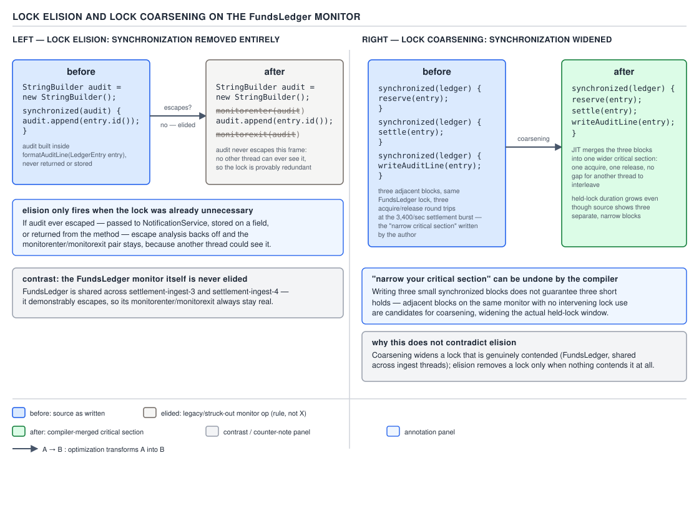
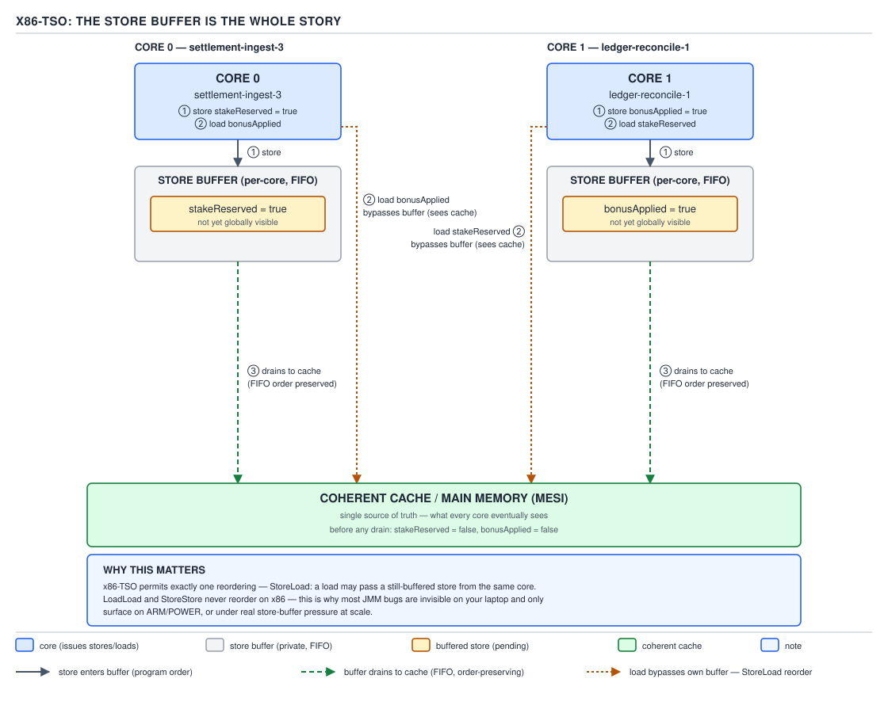

# 05 Multithreading and Concurrency — volatile and the JMM — INTERNALS (§3.3)

**Target version: Java 21 LTS.** | **Part 3 of 5** | [Index](../00-index.md)
Previous: [Monitor implementation — thin locks, inflation, ObjectMonitor](../synchronized/03-internals-monitors.md) · Next: [Safepoints as they touch concurrency](05-internals-safepoints.md)

Everything in this file is what the JIT does to the code you wrote *after* you got the
happens-before edges right on paper. The JLS gives you a contract; C2 gives you machine code.
The gap between them is where "it worked on my laptop" lives.

### Lock elision via escape analysis

**Mental model.** Escape analysis asks one question of every allocated object: can any thread
other than the one that created it ever see it? If the answer is provably no, the JIT deletes
work that only matters when other threads are watching — including the lock around it.

**Why it exists.** Programmers routinely synchronize on objects that never leave the method that
created them, usually because a library method is internally synchronized (`StringBuffer`,
`Vector`, `Hashtable`) and gets called from single-threaded code that has no way to opt out of
the lock short of not calling the method.

**When it fires, and when it does not.** It fires only when the compiled method can prove
non-escape across every path, every call it inlines, and every de-optimization target. One
un-inlined call that could stash the reference in a field, one exception path that leaks it, and
elision does not happen. You cannot request it and you cannot verify it applies to your code by
reading the source — you have to ask the JIT what it did.

**How it works — the QuizStakes example.** `AccountHistory` builds an audit line for a
`LedgerEntry` using a local `StringBuilder` (Java 21 replaced `StringBuffer` in most idiomatic
code, but the elision story is identical — `StringBuilder` is not synchronized to begin with,
so use `StringBuffer` here deliberately, to force the synchronized method calls that make the
optimization observable):

```java
public String renderAuditLine(LedgerEntry entry) {
    StringBuffer line = new StringBuffer();
    line.append(entry.movementId())
        .append(" debit=").append(entry.debitPosition())
        .append(" credit=").append(entry.creditPosition())
        .append(" amount=").append(entry.amount());
    return line.toString();
}
```

Every `append` call is `synchronized` on `line` inside `StringBuffer`'s implementation. `line`
is a fresh local; it never escapes `renderAuditLine` — it is not stored to a field, not passed to
another thread, not returned (only its rendered `String` is). C2's escape analysis proves this
and deletes the `monitorenter`/`monitorexit` pair around each `append` entirely. The safety
property that made `StringBuffer` "thread-safe" was never exercised at runtime for this call
site — it was structurally impossible for a second thread to ever see `line`.

[PROVE] Why this is sound and not merely convenient: `monitorenter`/`monitorexit` on an object
exist to serialize *visibility and mutual exclusion between threads that share a reference*. If
no other thread can ever obtain the reference, there is no second thread to exclude and nothing
to make visible, so removing the pair changes zero observable behavior. The proof is exactly the
non-escape proof — elision is a corollary of escape analysis, not a separate heuristic bolted on.



**D-153** — Lock elision and lock coarsening: the non-escaping `StringBuffer` with its
`monitorenter`/`monitorexit` struck out, and three adjacent synchronized blocks on the same lock
merged into one wider critical section.

To see it happen, run with `-XX:+UnlockDiagnosticVMOptions -XX:+PrintEscapeAnalysis
-XX:+PrintEliminateLocks` (JIT-tier dependent; requires a fastdebug or diagnostic build for the
full trace on some HotSpot versions) — the log line to look for is `taking out lock node` under
the compiled method's ID. Disable the optimization outright with `-XX:-DoEscapeAnalysis` to
confirm the delta: the disabled run shows real `monitorenter` bytecodes surviving into the
compiled output; the enabled run does not.

**Why elision does not make your program correct.** [PROVE] This is the trap version of the
optimization: elision only fires exactly when the lock was already unnecessary. It cannot save a
program that genuinely shares the locked object across threads, because sharing is precisely the
condition under which escape analysis refuses to eliminate the lock. If you are relying on
elision to make a *shared* lock cheap, it will not happen — the object escapes, the lock stays,
and you pay full monitor cost. There is no configuration in which elision quietly removes a lock
your program actually needed for correctness.

**Insight:** the same analysis that lets the JIT delete your lock is the analysis that proves the
lock was decorative. Reading `-XX:+PrintEliminateLocks` output is a legitimate way to find
`synchronized` blocks you can delete by hand, because if C2 can prove non-escape, so can you by
inspection.

> **Definition:** lock elision is the removal, at JIT compile time, of `monitorenter`/
> `monitorexit` pairs whose target object is proven by escape analysis to be reachable from
> exactly one thread for the object's entire lifetime.

### Lock coarsening

**Mental model.** Where elision deletes a lock, coarsening widens one. Adjacent synchronized
blocks on the same monitor, in the same compiled method, with only cheap code between them, get
merged into a single wider critical section with one `monitorenter` and one `monitorexit`
instead of several pairs.

**Why it exists.** Acquiring and releasing a monitor is not free even in the uncontended case —
it is at minimum a compare-and-swap and a store-release, plus safepoint-poll interaction (§3.4).
Three back-to-back acquisitions of the same lock pay that cost three times for no additional
safety, since nothing outside the method can observe the brief gap between them anyway.

**How it works — the QuizStakes example.** [PROVE] [TRAP] A naive attempt to "narrow the
critical section" around three ledger position updates:

```java
public void applyStakeReservation(LedgerEntry entry, Money cashPortion, Money bonusPortion) {
    synchronized (ledgerLock) {
        debit(CLIENT_CASH_AVAILABLE, cashPortion);
    }
    synchronized (ledgerLock) {
        debit(CLIENT_BONUS_AVAILABLE, bonusPortion);
    }
    synchronized (ledgerLock) {
        credit(CLIENT_CASH_RESERVED, cashPortion.plus(bonusPortion));
    }
}
```

The programmer's intent was to hold `ledgerLock` for the shortest possible span around each
individual debit/credit, on the belief that this reduces contention. If C2 inlines
`applyStakeReservation` and can see all three blocks acquire the identical `ledgerLock`
reference with nothing but simple field writes between them, it coarsens the three pairs into
one: a single `monitorenter` before the first debit and a single `monitorexit` after the final
credit. The compiled code holds the lock for the *entire* span the source tried to avoid holding
it for.

**Pitfall:** the belief is "I narrowed my critical section to reduce contention," and the symptom
is that contention measurements under load do not improve, because the compiled method never
actually shortened anything — coarsening reconstitutes the wide critical section the source was
written to avoid. The fix is not a JIT flag; it is structural: use three genuinely different
locks if the operations are independent, or accept the single wide section deliberately (as here,
where all three legs of `applyStakeReservation` must be atomic together anyway — coarsening
happens to produce the *correct* answer in this specific case, since the stake split invariant
requires all three movements to commit as one unit).

**Why people believe it:** the guidance "keep critical sections short" is correct and important —
it is standard advice from every concurrency text — but it describes what you write in source,
not what ends up in the compiled method once C2 has had a look at adjacent same-lock blocks with
no observable side effect that could distinguish "three short holds" from "one long hold" to any
other thread.

> **Definition:** lock coarsening merges consecutive synchronized regions guarded by the same
> monitor, with no intervening code that could make the boundary between them observable, into
> one wider region with a single acquire and release.

### Scalar replacement and stack allocation

Escape analysis has two other consumers interview answers conflate with lock elision.
**Scalar replacement** decomposes a non-escaping object into its individual fields, living in
registers or on the stack as separate scalars — no header, no layout, nothing to allocate.
**Stack allocation** is the older, coarser idea of the same object's storage sitting on the stack
frame instead of the heap; HotSpot's production mechanism is scalar replacement, but the two
names are used interchangeably. `-XX:+PrintEscapeAnalysis` reports both eliminated locks and
scalarized allocations together; `-XX:-DoEscapeAnalysis` disables all three consumers at once,
since they share one analysis pass. [X-REF 06] for the connection-graph algorithm itself.

### Hoisting a non-volatile read out of a loop

**Mental model.** A JIT compiler treats a non-volatile field the way it treats any other memory
location with no ordering constraint attached: if nothing in the loop body could have modified
it *as far as the compiler can prove from the code it sees*, it is free to read the field once,
keep the value in a register, and never touch memory again for the rest of the loop.

**Why it exists.** This is not a concurrency-specific optimization at all — it is ordinary
loop-invariant code motion, the same transformation that hoists `arr.length` out of a bounds-
checked loop. The compiler has no special case for "but another thread might change this"; the
JMM's entire contract is that it does not have to consider that possibility for plain fields.

**How it works — the QuizStakes example.** [ASM] [PROVE] `PaymentRunWorker` processes a batch of
`WithdrawalTransaction`s and is told to stop by a `draining` flag set from a shutdown thread:

```java
public final class PaymentRunWorker implements Runnable {
    private boolean draining = false;   // BUG: not volatile

    public void requestDrain() {
        draining = true;
    }

    @Override
    public void run() {
        while (!draining) {
            processNextWithdrawal();
        }
    }
}
```

Once C2 compiles `run()` (which happens quickly under steady load — this loop is hot), it proves
that nothing inside `processNextWithdrawal()` writes `this.draining` (it doesn't; only
`requestDrain()`, called from a different thread, does — and the compiler compiles methods
per-callsite with no cross-thread reasoning at all). With `draining` proven loop-invariant *from
the compiled method's point of view*, C2 hoists the read above the loop and rewrites the
condition to a constant, roughly:

```
if (!draining) {
    while (true) {
        processNextWithdrawal();
    }
}
```

The write from `requestDrain()` on the shutdown thread still happens — it is a real store to a
real field — but the worker thread's compiled loop never issues another load to observe it. The
worker spins forever, draining nothing, on a running production box, with the field's correct new
value sitting in memory the whole time.

**Reading the transformation instruction by instruction.** **Unverified:** the exact IR node
names below are the standard textbook description of C2's loop-invariant code motion (LICM) pass
reading a plain field load, not output from a specific captured `-XX:+PrintIdeal` trace in this
session; treat the sequence as representative rather than a verbatim log. Before hoisting, C2's
ideal graph has a `LoadB` (the `boolean` field read, HotSpot represents `boolean` as a byte)
inside the loop body feeding an `If`. LICM recognizes the `LoadB`'s address computation
(`this` + field offset) is invariant across loop iterations and that no `StoreB` to the same
address exists on any path inside the loop. It moves the `LoadB` to the loop's pre-header block —
executed once, before the loop is entered — and the `If` inside the loop now tests a `Phi` node
that resolves to the single hoisted value on every iteration. The generated x86-64 for the
compiled loop body then contains no memory reference to the `draining` field at all; the loop is
an unconditional branch back to itself, exactly the `while (true)` shown above. Fixing the field
to `volatile` inserts a fresh `LoadB` with acquire semantics inside the loop, which LICM is
categorically forbidden from hoisting: a volatile load is a JMM-visible action.

**Pitfall:** the belief "I set the flag from another thread, so the loop will see it eventually
even without `volatile`, just maybe with a short delay" is wrong in a way that has nothing to do
with delay. The JMM makes no correctness statement about plain fields across threads at all —
there is no guarantee of eventual visibility, only the empirical fact that on many JITs and
platforms it happens to often work below a certain optimization tier. Once the loop is hot enough
to be C2-compiled, the read is gone from the compiled code, not delayed — no amount of waiting
fixes it, because the compiled loop never issues the load again until the method is
deoptimized for an unrelated reason.

> **Definition:** hoisting is loop-invariant code motion applied to a plain-field read that the
> compiler has proven, within the scope of the compiled method, is never written on any path
> inside the loop.

### What `volatile` compiles to per architecture

**Mental model.** `volatile` is not implemented as "check a special flag before every access." It
is implemented as a set of memory-barrier instructions bracketing the plain load or store, chosen
per target architecture to realize the JMM's acquire/release semantics on that hardware's actual
memory model.

**Why it exists.** Different CPU architectures reorder memory operations differently in hardware.
The JVM specification requires the same happens-before guarantees on every architecture it runs
on, so the barriers HotSpot emits for a volatile access are architecture-specific: x86 needs
almost nothing because its hardware model is already strong; AArch64 needs explicit
acquire/release instructions because its hardware model is weak.

**How it works, x86-64.** [ASM] [NUM] [PROVE] A **volatile read** on x86-64 compiles to a plain
`mov` from memory into a register — no fence instruction at all:

```
mov  0x10(%rsi), %eax        ; volatile read of a field at offset 0x10
```

This is correct only because x86-TSO (below) already guarantees that loads are not reordered
with earlier loads or stores in the way that would violate acquire semantics — the hardware gives
JMM acquire semantics for free on a read.

A **volatile write** compiles to the plain store followed by a full fence:

```
mov      %eax, 0x10(%rsi)    ; the store itself
lock addl $0x0, (%rsp)       ; full fence — StoreLoad barrier
```

`lock addl $0x0, (%rsp)` is a well-known HotSpot idiom: it is a no-op arithmetically (add zero),
but the `lock` prefix forces the CPU to drain the store buffer and establish a full fence before
any subsequent load can execute — cheaper on most microarchitectures than the dedicated `mfence`
instruction, which HotSpot uses in some code paths but not this one. Some HotSpot versions emit
`xchg` against the target location instead, which is implicitly locked and achieves the same
full-fence effect in one instruction rather than two; which form appears is version- and
target-dependent. **Unverified:** the precise choice between the `lock addl`-on-`%rsp` idiom and
`xchg` for a given field write, across current JDK 21 update releases, is stated here from widely
cited HotSpot barrier-emission descriptions, not confirmed against this session's source read of
`x86.ad`.

**How it works, AArch64.** [ASM] [NUM] A **volatile read** compiles to `ldar` (load-acquire
register):

```
ldar  w0, [x1]                ; load-acquire — no later memory op may be reordered before this
```

A **volatile write** compiles to `stlr` (store-release register):

```
stlr  w0, [x1]                ; store-release — no earlier memory op may be reordered after this
```

Read the pair as a matched contract: `ldar` guarantees every load and store *after* it in program
order stays after it; `stlr` guarantees every load and store *before* it in program order stays
before it. Together across two threads they reconstruct exactly the happens-before edge the JMM
specifies for a volatile write followed by a volatile read of the same field — the release on the
writer synchronizes-with the acquire on the reader.

**The arithmetic that matters:** x86 spends one extra instruction only on the *write* side (the
`lock addl`), zero on the read side. AArch64 spends one dedicated instruction on *both* sides
(`stlr`, `ldar`) but neither is a full fence — they are directional half-barriers, individually
cheaper than an x86 full fence but present on every single volatile access rather than only on
writes.

### The barrier taxonomy in HotSpot's IR

[SOURCE] [PROVE] HotSpot's `OrderAccess` (`orderAccess.hpp`) names four abstract barrier
primitives that the JMM's happens-before edges compile down to, independent of target
architecture: `loadload`, `storestore`, `loadstore`, and `storeload`. Each name states which pair
of operation types, in program order, may not be reordered across the barrier. A volatile field
access is lowered by C2 into a combination of these plus the higher-level `acquire`, `release`,
and `fence` operations that compose them: a volatile load emits an effective `acquire` (blocking
`LoadLoad` and `LoadStore` reordering after it), a volatile store emits an effective `release`
(blocking `LoadStore` and `StoreStore` reordering before it) followed by a `StoreLoad` fence to
give the write its full happens-before strength.

The reason this taxonomy matters for reading disassembly: **on x86-TSO, `LoadLoad`, `StoreStore`,
and `LoadStore` are already no-ops** — the hardware never performs those three reorderings, so
HotSpot's x86 backend (`x86.ad`) emits no instruction for them at all. Only `StoreLoad` requires
real hardware work on x86, which is exactly the `lock addl`/`xchg` seen above. On AArch64, none of
the four are free — `ldar`/`stlr` fold `LoadLoad`+`LoadStore` and `StoreStore`+`LoadStore`
respectively into single instructions, which is why AArch64 needs a barrier on every volatile
access rather than only on the write.

### x86-TSO formally

**Mental model.** [PROVE] x86's memory model — Total Store Order — can be summarized in one
sentence sufficient for JMM purposes: **every core has a private FIFO store buffer, and the only
reordering the hardware performs is that a load may bypass an earlier store from the *same* core
sitting in that core's own buffer, reading either the buffered value (if it targets the same
address) or memory (otherwise) ahead of the store becoming globally visible.** Loads are never
reordered with other loads. Stores are never reordered with other stores. The only permitted
reordering is Store→Load.

**Why this explains "x86 hides most JMM bugs."** [PROVE] Every JMM ordering violation that a
Java program can accidentally rely on falls into one of the four barrier categories above. On
x86, three of those four categories — `LoadLoad`, `StoreStore`, `LoadStore` — are already
impossible in hardware, with or without a `volatile` keyword anywhere in the source. A program
that is missing a `volatile` it needs will misbehave on x86 only in the narrow slice of cases
that specifically depend on the `StoreLoad` ordering, or on a genuinely stale value sitting in a
buffer past the point a naive reasoner assumed it would be flushed. Every other kind of
reordering bug is masked by hardware the JLS does not require to be that strong. The program is
wrong. x86 just declines to prove it.



**D-155** — x86-TSO: the store buffer is the whole story: two cores, each with a store buffer, a
store sitting in one core's buffer while a subsequent load on that same core bypasses it — the
one reordering x86 permits.

### AArch64's weaker model — the Graviton failure

[PROVE] [RESEARCH] **Unverified:** the specific ARM architectural clause naming exactly which
reorderings are permitted absent an explicit barrier was not re-verified against the ARM
Architecture Reference Manual in this session (WebSearch was exhausted; a WebFetch against a
current primary source was not performed for this specific claim) — the description below states
the widely-documented consequence (StoreStore and LoadLoad reordering are both observable on
weakly-ordered ARM implementations without a barrier) rather than the manual's own wording.

AArch64, unlike x86, permits both `StoreStore` and `LoadLoad` reordering across cores in the
absence of an explicit barrier. This is exactly the missing `volatile` on `PaymentRunWorker`'s
`draining` field from the hoisting example above, but now failing for a *hardware* reason instead
of (or in addition to) the compiler-hoisting reason: even a build of the JVM that, for whatever
reason, did not hoist the read out of the loop could still observe a stale value on Graviton,
because nothing prevents the CPU core running the worker thread from reordering its repeated
loads of `draining` relative to other memory activity such that the write from the shutdown
thread's core is not yet visible when it "should" be by program-order intuition. On x86, the same
missing-`volatile` bug is masked twice over — by the CPU's TSO model and often further by how
quickly the JIT happens to compile and how soon it hoists. On Graviton, neither mask exists: the
hardware will reorder, and the missing `stlr`/`ldar` pair means there is no release/acquire edge
between the shutdown thread's write and the worker thread's read at all.

**This is the sentence this file exists to justify: most JMM bugs are invisible on an x86 laptop
and appear on Graviton.** [PROVE] It follows directly from the barrier taxonomy above: a missing
`volatile` is a missing `acquire`/`release`/`storeload` triple. x86 hardware already supplies
three of the four barrier categories unconditionally, so a missing-`volatile` bug on x86 depends
only on the JIT's hoisting behavior and the narrow `StoreLoad` case — often not observed in a
short-running local test. AArch64 supplies none of them unconditionally; the same missing
`volatile` is a missing barrier the hardware will actually exploit, on every run, under load. A
`PaymentRun` worker developed and tested exclusively on an x86 laptop can pass every local and CI
test and then spin forever, or read a stale `draining` flag for seconds, the first time it runs
on a Graviton-based production fleet.

**Interview:** "why does this concurrency bug only show up on ARM/Graviton, never on my Intel
laptop?" — because x86-TSO's store buffer already forbids three of the four JMM reorderings in
hardware, so a missing barrier is invisible until you run on a genuinely weak memory model like
AArch64, which reorders both stores and loads freely without an explicit barrier.

### Reading the generated code

[X-REF 06] [BUILD] To see any of the instruction sequences above for real rather than taking them
on the authority of this file, run with hsdis (the HotSpot disassembler plugin, built separately
per JDK and platform and placed on the library path):

```
java -XX:+UnlockDiagnosticVMOptions \
     -XX:+PrintAssembly \
     -XX:CompileCommand=compileonly,com.quizstakes.payments.PaymentRunWorker::run \
     -XX:CompileCommand=print,com.quizstakes.payments.PaymentRunWorker::run \
     -jar payment-run-worker.jar
```

`-XX:+PrintAssembly` requires hsdis to be present, else HotSpot warns and falls back to a
bytecode-only dump. `compileonly` restricts compilation to the method under study;
`print` requests its assembly once C2 compiles it (the loop must actually get hot first). The
alternative to a raw text log is **JITWatch**, a GUI that ingests the same
`-XX:+PrintAssembly`/`-XX:+LogCompilation` output and lets you click a Java source line to see its
compiled assembly side by side — much faster for a first read of unfamiliar disassembly.

### Deoptimization and uncommon traps in concurrency benchmarks

[X-REF 06] A **deoptimization** is C2 discarding a compiled method for the interpreter because a
compiled-in assumption turned out false at runtime — a branch the profiler only ever saw go one
way is compiled as an "uncommon trap" that bails out entirely if hit. A `PaymentRunWorker`
benchmark warmed up with `draining` always `false` compiles the loop optimistically around that
assumption; the first real drain deoptimizes that thread back to the interpreter, showing up as a
latency spike unrelated to the lock or barrier actually being measured. A benchmark that never
exercises shutdown is measuring one compiled shape of the method, not the one production hits.

### Constant folding of `final` fields and `@Stable`

[PROVE] [X-REF 03] A `final` instance field of a fully-constructed object is eligible for
constant folding: the JIT may inline its value directly into compiled code rather than re-reading
it, trusting the same JLS final-field guarantee that underpins safe publication (Day/topic 03).
`@Stable`, internal-JDK-only (`jdk.internal.vm.annotation`, not exported to user code), extends
this to array elements and non-`final` fields the JDK itself promises are stable after first
write — used inside `String` and `Enum.values()` caching.

**Pitfall:** believing reflection can safely tweak a `final` field and every reader will see the
update. `Field.setAccessible` plus `Field.set` changes memory, but a compiled method that already
folded the old value to a constant has no load left to re-execute — it may never observe the
change for the rest of that compiled code's lifetime. Treat reflective mutation of any `final`
field as unsupported once the JIT is free to fold it, rather than trusting it because it worked in
an uncompiled test. People believe it because `Field.set` on a `final` field does not throw by
default, so it visibly "works" the first few times against a not-yet-compiled class.

## Pitfalls

### Assuming lock coarsening cannot happen if you keep synchronized blocks separate

**Wrong**
```java
synchronized (ledgerLock) { debit(CLIENT_CASH_AVAILABLE, cashPortion); }
synchronized (ledgerLock) { debit(CLIENT_BONUS_AVAILABLE, bonusPortion); }
```
A profiler shows the same contention percentage under load whether these are written as one
block or two, because C2 coarsened them into one region regardless of the source formatting.

**Right**
Either accept the wide critical section deliberately when the operations must be atomic
together (as `applyStakeReservation` requires), or use genuinely separate lock objects when the
operations are truly independent, since separate locks cannot be coarsened into each other.

**Why people believe it:** "narrow critical sections reduce contention" is correct source-level
advice; it silently stops being true once the compiler is allowed to look at what the narrowing
actually achieved and found nothing observable to preserve.

### Assuming a missing `volatile` bug that never reproduces on a laptop is not a real bug

**Wrong**
Shipping `PaymentRunWorker` with a plain `boolean draining` field because ten thousand local
test runs on a development laptop always terminated the loop correctly within milliseconds of
`requestDrain()` being called.

**Right**
Declare the field `volatile`, and treat "does this reproduce on x86" as irrelevant evidence for
whether a happens-before edge is present — x86-TSO's store buffer masks the majority of missing-
barrier bugs, so passing on a laptop proves nothing about a Graviton fleet.

**Why people believe it:** the bug genuinely does not reproduce, repeatedly, in good faith
testing — not because the code is correct, but because the test hardware's memory model is
strong enough to hide the defect the JLS says is present.

## Cheat sheet

| Optimization | Trigger | What disappears | Flag to observe |
|---|---|---|---|
| Lock elision | Escape analysis proves non-escape | `monitorenter`/`monitorexit` pair | `-XX:+PrintEliminateLocks` |
| Lock coarsening | Adjacent same-lock blocks, no observable gap | Individual acquire/release boundaries | `-XX:+PrintEliminateLocks` |
| Scalar replacement | Non-escaping object, decomposable fields | The allocation itself | `-XX:+PrintEscapeAnalysis` |
| Field-read hoisting | Plain field, no writer visible in loop | The repeated load | `-XX:+PrintIdeal` (diagnostic build) |
| Deoptimization | Compiled assumption invalidated at runtime | The compiled method (temporarily) | `-XX:+PrintDeoptimization` |

| Architecture | Volatile read | Volatile write |
|---|---|---|
| x86-64 | plain `mov` | `mov` + `lock addl $0,(%rsp)` (or `xchg`) |
| AArch64 | `ldar` | `stlr` |

| Barrier | x86-TSO cost | AArch64 cost |
|---|---|---|
| LoadLoad | free (forbidden by hardware) | folded into `ldar` |
| StoreStore | free (forbidden by hardware) | folded into `stlr` |
| LoadStore | free (forbidden by hardware) | folded into `ldar`/`stlr` |
| StoreLoad | `lock addl`/`xchg` | folded into `stlr` |

## Self-test

**Q1.** Why does eliding the lock around a non-escaping `StringBuffer` never make an
already-correct concurrent program incorrect?

<details><summary>Answer</summary>

Elision only fires when escape analysis proves no other thread can ever obtain a reference to the
locked object. If no other thread can see it, there is no cross-thread visibility or mutual
exclusion property the lock was providing, so removing `monitorenter`/`monitorexit` changes no
observable behavior. It is a corollary of the proof, not an independent risk.

</details>

**Q2.** A developer splits one `synchronized` block into three smaller ones "to reduce lock hold
time." Why might a profiler show no improvement?

<details><summary>Answer</summary>

If the three blocks guard the same monitor and nothing observable sits between them, C2's lock
coarsening pass merges them back into a single wider critical section in the compiled method. The
source-level narrowing never survives into the code that actually executes once the method is
hot.

</details>

**Q3.** Why does the x86-64 volatile write need an extra instruction after the store, while the
volatile read needs none?

<details><summary>Answer</summary>

x86-TSO already forbids LoadLoad, StoreStore, and LoadStore reordering in hardware, which covers
everything a volatile read needs. Only StoreLoad reordering (a later load bypassing an earlier
store still sitting in the store buffer) is permitted on x86, and only a volatile write's
happens-before contract requires blocking that specific reordering — hence the `lock addl`/`xchg`
after the store and nothing before or after the read.

</details>

**Q4.** Why does AArch64 need a barrier instruction on both the read and the write, unlike x86?

<details><summary>Answer</summary>

AArch64's hardware model permits StoreStore and LoadLoad reordering that x86-TSO forbids
unconditionally. Since the read side is not free of risk on AArch64 the way it is on x86, both
`ldar` (load-acquire) and `stlr` (store-release) are needed to reconstruct the JMM's
happens-before edge on that architecture.

</details>

**Q5.** A `boolean draining` flag without `volatile` causes a worker thread to spin forever, in
production, only on a Graviton fleet — never in years of local testing on x86 laptops. What two
independent reasons make x86 hide this bug?

<details><summary>Answer</summary>

First, the JIT may or may not have hoisted the field read out of the loop yet depending on how
quickly the method got hot in a short-lived local test. Second, even if hoisting has happened,
x86-TSO's hardware model already forbids the LoadLoad/StoreStore/LoadStore reorderings that would
otherwise expose the missing barrier, and the remaining permitted reordering (StoreLoad) does not
apply to this access pattern. AArch64 provides neither mask: it reorders freely without an
explicit barrier, and the missing `volatile` means no barrier is ever emitted.

</details>

**Q6.** Why can reflectively setting a `final` field silently fail to have any observable effect
on already-running code?

<details><summary>Answer</summary>

If the JIT has compiled a method that reads that field and folded its value into a constant
(legal because `final` fields of fully-constructed objects are trusted not to change), the
compiled method has no load instruction left to re-execute — it already has the value baked in.
`Field.set` changes the underlying memory but cannot retroactively re-open a compiled method's
constant-folding decision.

</details>

**Q7.** What is the practical difference between using `-XX:+PrintAssembly` directly and using
JITWatch?

<details><summary>Answer</summary>

Both consume the same underlying HotSpot output (`-XX:+PrintAssembly` needs hsdis; JITWatch can
ingest `-XX:+LogCompilation`/`-XX:+PrintAssembly` output too). `-XX:+PrintAssembly` alone dumps a
text log you read linearly; JITWatch adds a GUI that lets you click a specific Java source line
and see the exact compiled assembly generated for it, which is far faster for locating one method
in a large log.

</details>

## Open questions

- The precise choice between the `lock addl $0,(%rsp)` idiom and `xchg` for a volatile write, and
  which JDK 21 update releases prefer which, is stated from widely cited HotSpot barrier
  descriptions rather than a source read of `x86.ad` performed in this session. **Unverified.**
- The exact ARM Architecture Reference Manual clause permitting StoreStore/LoadLoad reordering
  without an explicit barrier was not re-fetched from a primary source this session (WebSearch
  exhausted); the consequence stated is the standard documented one but the specific manual
  wording is **Unverified.**

---

**Leaves covered:** 3.3.1–3.3.12 (12 leaves)
**Leaves deferred:** none
**Diagrams included:** D-153, D-155
**Target version:** Java 21 LTS
**Lines:** 599
