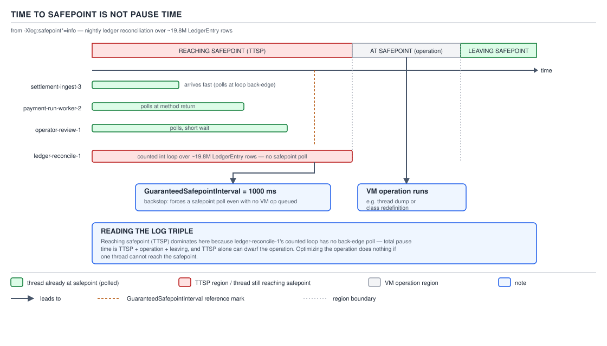
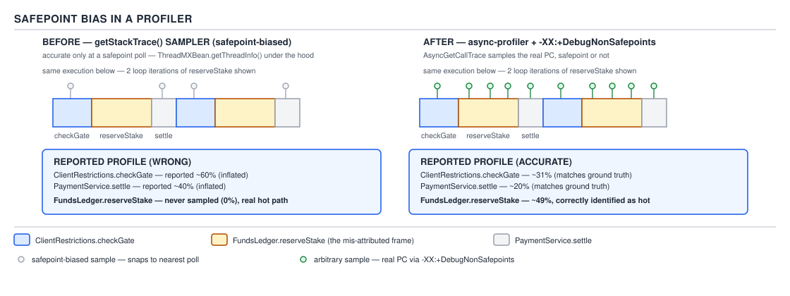

# 05 Multithreading and Concurrency — volatile and the JMM — INTERNALS (§3.4)

**Target version: Java 21 LTS.** | **Part 3 of 5** | [Index](../00-index.md)
Previous: [JIT optimisations that touch locks and memory](04-internals-jit-and-barriers.md) · Next: [AbstractQueuedSynchronizer — the queue and the acquire loop](../locks/04a-internals-aqs-queue-and-acquire.md)

Everything upstream in this topic — happens-before, barriers, volatile — describes what a single
thread's memory operations mean to another thread. This file describes the mechanism the JVM
uses to stop every thread at once when it needs a globally consistent view of the heap: the
safepoint. Every "the app froze for 300ms and there was no GC in the log" incident traces back to
this file.

### What a safepoint is

**Mental model.** A safepoint is a moment at which every Java thread's internal state is fully
known to the JVM — every reference on every stack frame is located precisely enough (an "oop
map," a map of which stack slots and registers hold object pointers) that the VM can walk, move,
or inspect the entire live object graph without a thread concurrently mutating a reference out
from under it mid-walk.

**Why it exists.** A moving garbage collector cannot relocate an object while some thread might
be dereferencing a stale pointer to its old location. A stack walk for a thread dump cannot trust
a frame whose contents are being rewritten as it reads them. Deoptimization cannot rebuild
interpreter frames from compiled-frame state that is only valid at specific, known points in the
compiled code. All of these operations — GC, deoptimization, stack walking, class redefinition —
require the same precondition: every thread paused at a point where its state is exactly
describable. That precondition is what "at a safepoint" means.

**When to reach for it, and when not.** This is not a mechanism application code invokes — it is
a mechanism the JVM invokes on application code's behalf, and the only lever a developer has is
indirect: writing code shapes that reach safepoints promptly (see 3.4.3 below) versus code shapes
that don't. There is no sibling to weigh it against; the only choice is whether your hot loops
cooperate with it.

**How it works — the poll.** [RESEARCH] Since JDK 10 (JEP 312 laid the groundwork), safepoint
polling is **thread-local**: each thread periodically checks whether a safepoint has been
requested by testing a page of memory (the "polling page") for a protection change, rather than
all threads busy-polling a shared global flag. Compiled code emits a poll — on x86-64 typically a
`test` instruction against an address on the polling page — at method-return points and at
backward branches (loop back-edges). When a safepoint is requested, the VM changes the polling
page's protection so that the next poll instruction executed by any thread **faults**; the trap
handler recognizes this specific fault as a safepoint request and parks the thread rather than
delivering a real `SIGSEGV`. This is why enabling `-XX:+PrintSafepointStatistics` or attaching a
native debugger to a JVM mid-safepoint-transition can show what looks like a segfault in the
polling machinery — it is by design, not corruption. The per-thread nature of the poll (rather
than a single shared flag every thread reads) is exactly what makes **handshakes** possible
(3.4.6): the VM can bring one specific thread to a safepoint-like state without coordinating a
stop-the-world event for every other thread.

### Time-to-safepoint is not pause time

**Mental model.** [NUM] [RESEARCH] A safepoint operation has three phases, and only the middle
one is the "pause" most engineers mean when they say "the GC paused for 40ms." **Reaching
safepoint (TTSP)** is the time from the VM deciding it wants a safepoint to the last straggling
thread actually arriving at one. **At safepoint** is the time the actual VM operation (a GC
cycle, a deopt, a thread dump) takes once every thread has arrived. **Leaving safepoint** is the
time to release every parked thread and resume. A GC log reporting "40ms pause" is frequently
reporting only the middle phase — the TTSP that preceded it can silently be another 200ms that
never appears in a GC-focused log at all.

**Why it exists as a distinct metric.** [PROVE] TTSP is bounded by the *slowest* thread to reach
a poll, and every other thread that arrived earlier sits idle waiting for it — the safepoint
cannot begin its work-phase until the last thread checks in. A single misbehaving thread inflates
the pause experienced by the entire JVM, not just its own.

**When this matters, and when it doesn't.** It matters for latency-sensitive services under p99
SLA pressure — anything reconciling ~19.8M `LedgerEntry` rows overnight where a stop-the-world
GC or a diagnostic thread dump needs to happen without stalling settlement processing for
seconds. It is largely invisible for batch jobs with no latency SLA, where a slow-arriving thread
costs wall-clock time but nothing breaches a contract.

**How it works — the classic long-TTSP causes.** [NUM] [RESEARCH] Three shapes of code reliably
produce long TTSP:

1. **A counted `int` loop with no poll.** HotSpot's C2 compiler omits the safepoint poll from the
   back-edge of a **counted loop** — a loop over a fixed, provably-bounded `int` index — as a
   throughput optimization, on the reasoning that the loop is guaranteed to terminate quickly
   anyway. A loop counted with a `long` index, or one whose bound is not provably fixed at compile
   time, keeps its poll. **Pitfall:** the belief "any tight loop will yield to a safepoint request
   promptly because there's a poll on every back-edge" is wrong specifically for `int`-counted
   loops over large bounds — a reconciliation job iterating an `int`-indexed array of ~19.8M
   `LedgerEntry` rows with no method call inside the loop body can run for the loop's entire
   duration with zero safepoint polls, holding every other thread in the JVM (including GC
   threads waiting to run a young-gen collection) at their own already-reached safepoints for as
   long as that one loop takes to finish. The fix is not a JVM flag — it is restructuring the loop
   to call a method periodically (a virtual or non-inlined call site carries its own poll) or to
   use a `long` index / a form the compiler does not recognize as an eligible counted loop.
2. **A long `arraycopy`.** A single `System.arraycopy` (or an intrinsic-lowered bulk copy) over a
   very large array runs as one uninterruptible unit with no intervening poll, for the same
   throughput reason.
3. **A page fault storm.** If the safepoint-reaching threads are simultaneously blocked on page
   faults — for instance, touching freshly committed heap pages for the first time under memory
   pressure — TTSP is bounded by the OS's fault-servicing latency, not by anything the JVM
   controls at all.

**The guaranteed safepoint.** [NUM] [RESEARCH] `-XX:GuaranteedSafepointInterval`, default **1000
ms**, forces the VM to bring itself to a safepoint at least this often even when no GC,
deoptimization, or other VM operation is queued — largely so that JFR periodic sampling and
similar polling-dependent diagnostics have a guaranteed cadence to attach to. It can be disabled
only behind `-XX:+UnlockDiagnosticVMOptions -XX:GuaranteedSafepointInterval=0`, and disabling it
removes the only backstop against a JVM that otherwise reaches a real safepoint only rarely under
light load.



**D-156** — Time to safepoint is not pause time: the `Reaching safepoint` (TTSP), `At safepoint`,
and `Leaving safepoint` regions from `-Xlog:safepoint*`, four threads arriving at different times,
one stuck in a counted `int` loop with no poll dominating TTSP, and `GuaranteedSafepointInterval
= 1000 ms` marked on the timeline.

**A minimal concrete example.** [BUILD] A reconciliation job over `LedgerEntry` rows, written the
way that silently produces a long-TTSP loop, versus the fixed version:

```java
// BROKEN: int-counted loop with no method call — the JIT omits the safepoint poll
public long sumLedgerAmounts(LedgerEntry[] entries) {
    long total = 0L;
    for (int i = 0; i < entries.length; i++) {   // int-counted, provably bounded
        total += entries[i].amount().amount().unscaledValue().longValueExact();
    }
    return total;
}

// FIXED: an uninlined call on every iteration reintroduces a poll site
public long sumLedgerAmountsSafepointFriendly(LedgerEntry[] entries) {
    long total = 0L;
    for (int i = 0; i < entries.length; i++) {
        total += extractAmount(entries[i]);       // real call site: carries its own poll
    }
    return total;
}

private long extractAmount(LedgerEntry entry) {
    return entry.amount().amount().unscaledValue().longValueExact();
}
```

The fixed version is not "faster" — it is slightly slower per iteration due to the call overhead
— but it bounds the worst-case TTSP contribution of this method to roughly one call's worth of
work rather than the full ~19.8M-row pass.

**The gotcha.** Splitting the loop body into a method does not guarantee JIT inlining leaves the
call site intact as a poll point forever — if the extracted method is small and hot enough to be
inlined back into the caller, and the resulting inlined loop is again recognized as a simple
counted loop, the poll can disappear again after enough warm-up. The genuinely reliable fix for a
pathological case is a `long`-typed loop index, which C2 does not treat as an eligible counted
loop for poll omission.

**Interview:** "the service reported a 300ms stall with nothing in the GC log — what happened?" —
almost always TTSP: some thread took a long time reaching a safepoint (a counted `int` loop, a
bulk `arraycopy`, or a page fault storm), and the resulting stall is invisible to a log that only
records the At-safepoint work-phase duration.

> **Definition:** time-to-safepoint is the interval from a safepoint being requested to the last
> thread arriving at a poll; it is measured and reported separately from the safepoint's own
> work-phase duration, and it is frequently the larger of the two.

### Safepoint logging

[DUMP] [RESEARCH] `-Xlog:safepoint*=info` (or the more detailed
`-Xlog:safepoint+stats*=debug`) emits, per safepoint, a triple of phases. **Unverified:** the
exact field names and column widths below reproduce the documented `-Xlog:safepoint*` format from
widely cited JDK operations references rather than a live capture taken in this session; the
structure (three named phases, per-thread arrival accounting) is correct, but treat the literal
column text as representative, not a verbatim capture:

```
[12.401s][info][safepoint] Application time: 0.9987421 seconds
[12.402s][info][safepoint] Entering safepoint region: G1CollectForAllocation
[12.402s][info][safepoint] Leaf: Reaching safepoint:      1834112 ns
[12.404s][info][safepoint] Leaf: At safepoint:            2210441 ns
[12.404s][info][safepoint] Leaf: Leaving safepoint:          8332 ns
[12.404s][info][safepoint] Total time for which application threads were stopped: 0.0040443 seconds
```

Read it left to right: `Application time` is how long the JVM ran uninterrupted before this
safepoint. `Reaching safepoint` is TTSP — here 1.83ms, driven by whichever thread was slowest to
poll. `At safepoint` is the actual work — here a G1 allocation-triggered collection at 2.21ms.
`Leaving safepoint` is the release, negligible at 8µs. The final `Total time... stopped` line is
what most GC dashboards surface as "the pause," and it is the *sum* of all three phases, which is
the entire point of separating them in the log: a dashboard showing "4ms pauses, all fine" can be
hiding a 1.8ms TTSP that, on a different night with a slower-draining loop, becomes 300ms while
the "At safepoint" work itself stays a constant 2ms.

### Handshakes

[RESEARCH] JEP 312 introduced **handshakes**: a mechanism to execute a callback on one specific
target thread, brought to a safepoint-equivalent state, without requiring every other thread in
the JVM to stop. Operations that historically required a full VM-wide safepoint — because there
was no cheaper way to guarantee the target thread's state was safely inspectable — moved to
per-thread handshakes once the thread-local polling infrastructure (3.4.1) made it possible to
target one thread's poll independently of the rest. Historically safepoint-only operations
including certain thread-dump requests and (in older JDKs) biased-lock revocation moved to
handshakes; the practical consequence is that many diagnostic operations that used to stall the
whole JVM now stall only the one thread being inspected.

### Why this matters for a concurrency answer

[DUMP] [X-REF 06] A thread dump is not a free, side-effect-less snapshot — `Thread.getAllStackTraces`
and `jstack` both require a safepoint (or, since JEP 312, may use per-thread handshakes for parts
of the work) to guarantee the stacks they read are not being concurrently rewritten. Calling
`getStackTrace()` in a tight monitoring loop is a self-inflicted, repeated safepoint request. The
practical rule this file exists to justify: "the app froze for 300ms and there was no GC in the
log" is very often a safepoint story that has nothing to do with garbage collection at all — a
monitoring agent polling stack traces too aggressively, or a batch job's counted loop dominating
TTSP for an unrelated VM operation that happened to be requested at the wrong moment.

### Safepoint bias in profilers

**Mental model.** A sampling profiler built on `Thread.getStackTrace()` (or `jstack`-style
sampling) can only take a sample when the target thread is at a safepoint, because that is the
only state from which the stack is guaranteed walkable by that API. This sounds like a harmless
implementation detail; it is actually a systematic measurement bias.

**Why it exists.** The safepoint requirement is not a limitation the profiler chose — it is
inherited from the same "every reference must be exactly locatable" constraint that governs GC.
A `getStackTrace`-based sampler has no way to ask for a stack trace *without* first bringing the
thread to a safepoint.

**When to reach for a safepoint-biased sampler, and when not.** `jstack`-style sampling is fine
for a coarse, occasional look at where threads are blocked (lock contention, I/O waits) since
those states tend to persist across many safepoint-eligible instants. It is actively misleading
for CPU hot-path profiling, where the interesting code is exactly the tight, uninterrupted
compute loop that, per 3.4.3, may go a long time between safepoint polls.

**How it works — the systematic distortion.** [RESEARCH] Because a `getStackTrace`-based sampler
only ever captures a thread at a safepoint, any method whose hot loop is precisely the kind of
counted, poll-free loop described in 3.4.3 is one the sampler can *never* catch mid-execution —
every sample taken while that loop is running either misses it entirely (caught between
invocations, at a poll point outside the loop) or, if the loop happens to be interrupted at a
call site inside it, attributes time to whatever code executed at the nearest safepoint rather
than to the loop's actual hot instructions. A method that consumes 80% of wall-clock time can
appear to consume none of it in a `getStackTrace`-based flame graph, because the sampler
literally cannot observe it between safepoints.

**The fix — `AsyncGetCallTrace` and async-profiler.** [RESEARCH] `AsyncGetCallTrace` is a
JVM-internal API (used by async-profiler and similar tools) that walks a thread's stack from a
signal handler at an arbitrary point in execution, not only at a safepoint. Paired with
`-XX:+DebugNonSafepoints` (which asks the JIT to retain enough debug-info mapping at non-safepoint
program counters for the stack walk to be interpreted correctly), this samples the *actual*
running code, including the interior of counted loops that never reach a JVM-level safepoint
poll, eliminating the systematic blind spot.



**D-157** — Safepoint bias in a profiler: a `getStackTrace`-based sampler taking every sample at a
safepoint, with the hot method running between polls never appearing in its output, set against
`AsyncGetCallTrace`/async-profiler with `-XX:+DebugNonSafepoints` correctly attributing the same
time.

**A minimal concrete example.** [BUILD] The command-line contrast:

```
# safepoint-biased: jstack sampling in a loop, misses tight counted loops entirely
while true; do jstack <pid> >> stacks.txt; sleep 0.01; done

# unbiased: async-profiler with non-safepoint debug info retained
java -XX:+UnlockDiagnosticVMOptions -XX:+DebugNonSafepoints \
     -agentpath:/opt/async-profiler/libasyncProfiler.so=start,event=cpu,file=profile.html \
     -jar ledger-reconciliation-job.jar
```

**The gotcha.** `-XX:+DebugNonSafepoints` is a diagnostic flag with a real, if modest, footprint —
it forces the JIT to retain more debug metadata than it otherwise would, trading a small amount
of compiled-code overhead for profiling accuracy; it is reasonable to enable for a profiling
session and unnecessary to leave on in ordinary production operation.

**Interview:** "why did the profiler show 0% time in the method that's obviously the bottleneck?"
— the profiler is safepoint-biased (`jstack`/`getStackTrace`-based) and the method is a tight
counted loop the JIT never inserts a poll into, so the sampler can never catch a sample inside it;
switch to `AsyncGetCallTrace`-based tooling (async-profiler) with `-XX:+DebugNonSafepoints`.

> **Definition:** safepoint bias is the systematic under-representation, in a
> `getStackTrace`-based profiler, of code that executes between safepoint polls — most severely,
> tight counted loops that the JIT has deliberately stripped of polls for throughput.

### Virtual threads and safepoints

[PROVE] A **mounted** virtual thread — one currently scheduled onto a carrier platform thread and
actively executing — reaches JVM safepoints exactly the way any platform thread does, through
that carrier: the carrier's poll instructions are the virtual thread's poll instructions, since
they are, at the hardware level, the same OS thread executing the same compiled code. An
**unmounted** virtual thread — parked, its continuation stack captured onto the heap while it
waits for I/O or a lock — is, at that moment, a heap object like any other. It has no OS thread
under it, executes no instructions, and is consequently not a safepoint participant at all: it
cannot delay TTSP, because there is no running thread to bring to a poll, and it is not walked by
a safepoint-driven stack walk in the way a platform thread's stack is (its captured state is
ordinary heap data, subject to ordinary GC rather than safepoint stack-walking machinery). This
is why a program using tens of thousands of virtual threads does not multiply TTSP risk by
thread count the way tens of thousands of platform threads would: only the (bounded, carrier-pool
sized) set of currently-mounted virtual threads actually needs to reach a poll for any given
safepoint.

## Pitfalls

### Assuming "no GC in the log" rules out a JVM-level pause

**Wrong**
Concluding a 300ms production stall must be an OS-level or network issue because the GC log shows
no collection anywhere near that timestamp.

**Right**
Check `-Xlog:safepoint*` for the same window. A long `Reaching safepoint` phase — caused by a
counted `int` loop, a large `arraycopy`, or a page-fault storm on one thread — produces exactly
this symptom: a real JVM-level stop with nothing in a GC-only log, because the safepoint that
finally fired may have been for a thread dump, a deoptimization, or the 1000ms
`GuaranteedSafepointInterval` tick rather than for garbage collection at all.

**Why people believe it:** GC logging is usually the only safepoint-adjacent logging enabled by
default in most monitoring setups, so "no GC" is treated as a proxy for "no JVM-level pause,"
when it is only a proxy for "no GC-triggered pause."

### Assuming a `getStackTrace`-based profiler's 0% is trustworthy

**Wrong**
Deciding a method is not the bottleneck because a `jstack`-sampling-based tool never shows it
consuming meaningful time, and reallocating investigation effort elsewhere.

**Right**
Recognize that a tight, `int`-counted loop is systematically invisible to a safepoint-biased
sampler regardless of how much CPU time it actually consumes, and re-profile with
`AsyncGetCallTrace`-based tooling (async-profiler) plus `-XX:+DebugNonSafepoints` before trusting
a 0% reading for hot-loop-shaped code.

**Why people believe it:** the profiler's output looks precise and quantitative — a percentage,
not a guess — and there is no visible indication in the tool's own output that its sampling
mechanism has a structural blind spot tied to safepoint polling.

## Cheat sheet

| Term | Meaning |
|---|---|
| Safepoint | A point where every thread's state (oop maps) is exactly known |
| TTSP | Reaching safepoint — time for the last thread to arrive at a poll |
| At safepoint | The actual VM operation's duration once all threads have arrived |
| `GuaranteedSafepointInterval` | Default 1000 ms; forces a safepoint even with nothing queued |
| Counted `int` loop | Loses its poll on the back-edge; the classic long-TTSP trap |
| Handshake (JEP 312) | Per-thread safepoint-equivalent; avoids a global stop |
| `-Xlog:safepoint*` | Reaching / At / Leaving safepoint, per operation |
| `getStackTrace`/`jstack` sampling | Safepoint-biased; blind to poll-free hot loops |
| `AsyncGetCallTrace` + `-XX:+DebugNonSafepoints` | Unbiased sampling; async-profiler's mechanism |
| Mounted virtual thread | Safepoint participant via its carrier |
| Unmounted virtual thread | Heap object; not a safepoint participant at all |

## Self-test

**Q1.** Why can a GC log reporting a 4ms pause coexist with a genuinely 300ms stop-the-world
stall visible to end users?

<details><summary>Answer</summary>

The GC log's pause figure typically reports only the "At safepoint" work-phase duration. The
"Reaching safepoint" (TTSP) phase that precedes it is accounted separately and can be far larger
if one thread is slow to reach a poll — for example, stuck in a counted `int` loop — even while
the GC's own work-phase remains a constant few milliseconds.

</details>

**Q2.** Why does an `int`-indexed loop over a huge array lose its safepoint poll while a
`long`-indexed loop over the same data does not?

<details><summary>Answer</summary>

HotSpot's C2 compiler recognizes provably-bounded `int`-counted loops as "counted loops" and
omits the safepoint poll from the back-edge as a throughput optimization, trusting the loop to
terminate quickly. A `long`-indexed loop, or one whose bound the compiler cannot prove fixed, is
not eligible for that specific optimization and retains its poll.

</details>

**Q3.** What does `-XX:GuaranteedSafepointInterval=1000` actually guarantee, and why does JFR
periodic sampling depend on it?

<details><summary>Answer</summary>

It forces the VM to a safepoint at least once every 1000ms even with no GC, deoptimization, or
other VM operation queued. Diagnostics like JFR's periodic sampling rely on safepoints occurring
at a predictable cadence to attach their own sampling work to; without the guarantee, a
lightly-loaded JVM could go far longer between safepoints, starving those diagnostics of a
regular opportunity to run.

</details>

**Q4.** A CPU profiler built on `jstack` sampling shows 0% time in a method that other evidence
says is the bottleneck. What is the most likely explanation?

<details><summary>Answer</summary>

Safepoint bias: `jstack`/`getStackTrace`-based sampling can only capture a thread at a safepoint,
and a tight counted loop inside that method may have no safepoint poll at all, making it
structurally invisible to that class of sampler regardless of how much CPU time it consumes.
`AsyncGetCallTrace`-based tooling with `-XX:+DebugNonSafepoints` does not share this blind spot.

</details>

**Q5.** Why doesn't spawning 50,000 virtual threads multiply the risk of long time-to-safepoint
the way 50,000 platform threads would?

<details><summary>Answer</summary>

An unmounted virtual thread is a heap object with no OS thread under it and executes no
instructions, so it cannot delay a safepoint's arrival phase at all. Only the bounded set of
virtual threads currently mounted onto carrier platform threads needs to reach a poll for any
given safepoint — the pool of carriers, not the pool of virtual threads, is what bounds the
arrival-time risk.

</details>

**Q6.** What is the practical difference between a full stop-the-world safepoint and a handshake
introduced by JEP 312?

<details><summary>Answer</summary>

A safepoint requires every Java thread in the JVM to reach a poll before the requested operation
can proceed. A handshake targets one specific thread, bringing only that thread to a
safepoint-equivalent state so a callback can run against it, without requiring any other thread
to stop — moving operations like certain thread-dump work off the shared global stop.

</details>

**Q7.** In a `-Xlog:safepoint*` line reporting `Reaching safepoint: 1834112 ns` and `At safepoint:
2210441 ns`, which number should a latency-sensitive service treat as "the pause," and why might
neither alone be sufficient?

<details><summary>Answer</summary>

Neither alone is the pause an end user experiences — the total stop time is the sum of Reaching,
At, and Leaving safepoint. A dashboard that only tracks the At-safepoint figure (often what GC
tooling surfaces) can look healthy while TTSP quietly grows on a different code path, so both
figures, and their sum, need monitoring.

</details>

## Open questions

- The literal `-Xlog:safepoint*` output format (field names, exact spacing, and the specific
  labels `Leaf: Reaching safepoint` / `Leaf: At safepoint` / `Leaf: Leaving safepoint`) reproduces
  the widely documented structure of this log rather than a live capture taken in this session.
  **Unverified.**

---

**Leaves covered:** 3.4.1–3.4.10 (10 leaves)
**Leaves deferred:** none
**Diagrams included:** D-156, D-157
**Target version:** Java 21 LTS
**Lines:** 446
