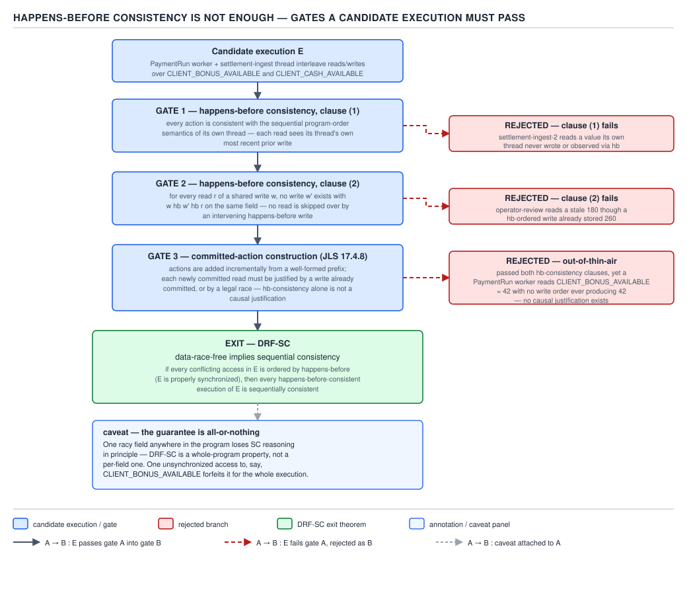
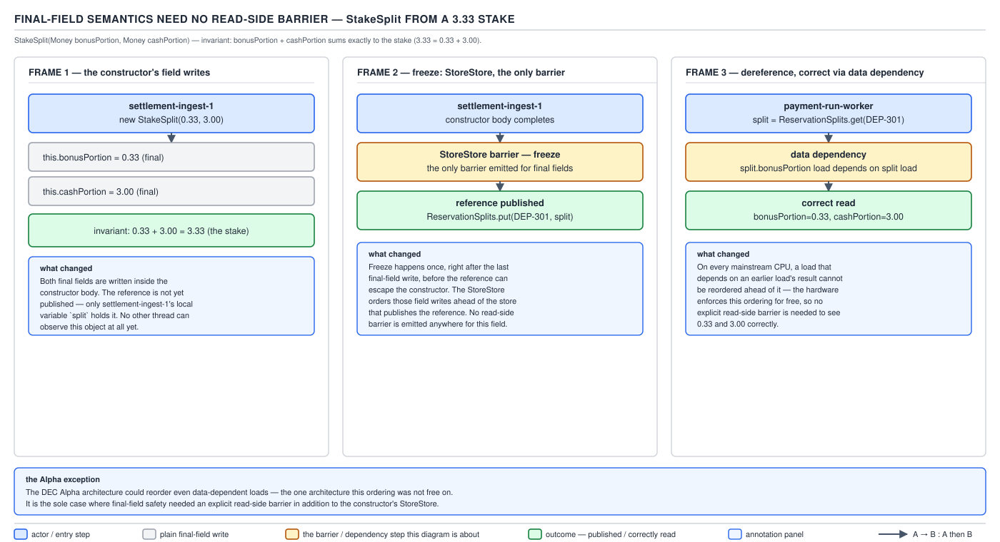

# 05 Multithreading and Concurrency — volatile and the JMM — INTERNALS (§3.7)

**Target version: Java 21 LTS.** | **Part 3 of 5** | [Index](../00-index.md)
Previous: [LockSupport, park/unpark and the OS layer](../locks/05-internals-locksupport-and-os.md) · Next: [ConcurrentHashMap internals — the table and resize](../concurrent-collections/03a-internals-chm-table-and-resize.md)

Every earlier file in this topic used "happens-before" informally. This file is the formal
account: what JLS chapter 17 actually says the Java Memory Model *is*, why the obvious definition
of happens-before is not sufficient on its own, and the concrete litmus tests that separate what
hardware allows from what the JMM allows from what your intuition assumes.

### 3.7.1 The JMM as a constraint on executions

**Mental model.** The JMM is not a description of any particular CPU or compiler. It is a
**legality filter over abstract program executions**. `[SOURCE]` JLS 17.4 frames it precisely:
a program has a set of possible executions (interleavings of reads, writes, locks, volatile
accesses); an execution is *legal* only if it satisfies the model's constraints (intra-thread
semantics, happens-before consistency, the causality/committed-sets rules of 17.4.8). A JVM
implementation — any compiler, any CPU, any combination of reorderings and caching — is a
**conforming implementation** if and only if every execution it can actually produce, for any
program, is one of the model's legal executions. Nothing more specific than that is promised or
forbidden: the model says nothing about store buffers, cache lines, or instruction reordering
directly — those are implementation techniques that happen to be legal because their observable
effect stays inside what the model permits.

**Why it exists:** without this framing, "correct" would have to be defined per-architecture —
x86 fences here, ARM fences there — and a program correct on one CPU could silently break on
another. The JMM instead gives Java programs a single portable contract, and pushes the
architecture-specific work of honoring that contract onto the JIT compiler (Part 3, §3.4's
barrier-insertion discussion) and the JVM's own runtime.

> **Definition:** the JMM defines correctness as a property of *executions*, not of hardware —
> an implementation is legal exactly when every execution it can produce is a legal execution of
> the abstract model, however it is achieved underneath.

### 3.7.2 Well-formedness on a concrete program

**[PROVE] [SOURCE]** JLS 17.4.7 lists the constraints every candidate execution must satisfy to
even be a *candidate* before happens-before consistency is checked: each read sees a write to the
same variable; program order within a thread is respected (intra-thread semantics); the
synchronization order is consistent with program order for synchronization actions; every lock
release is matched to acquire the same monitor in a way that respects mutual exclusion. Take a
concrete two-thread `PaymentRun` fragment:

```java
int cashAvailable = 0;         // shared, not volatile
volatile boolean settled = false;

// Thread A (settlement)
cashAvailable = 420;   // w1
settled = true;        // w2 (volatile write)

// Thread B (dispatch)
if (settled) {                 // r1 (volatile read)
    System.out.println(cashAvailable); // r2
}
```

Consider a *candidate* execution where `r1` reads `true` (so B enters the branch) but `r2` reads
`0` instead of `420`. Program order in A requires `w1` before `w2`. The synchronization order
requirement (17.4.7's `hb`-consistency for the volatile pair) forces `w2` before `r1` whenever
`r1` observes `w2`'s written value `true`. Chaining program order and the synchronization edge:
`w1 →hb w2 →hb r1 →hb r2`. Happens-before consistency (3.7.3) then requires `r2` to see `w1`'s
value unless some other write to `cashAvailable` intervenes — there is none in this program — so
the `r2 = 0` execution is **excluded**: it is not a legal execution of this program under 17.4.7.
This is the formal justification for the informal claim used everywhere earlier in this topic —
"the volatile write publishes the preceding writes" — worked as an actual exclusion argument
rather than asserted.

### 3.7.3 The happens-before consistency rule

**[PROVE] [SOURCE]** JLS 17.4.7's core rule, stated precisely: a read `r` of variable `v` is
allowed to observe a write `w` to `v` if and only if **both** clauses hold:

1. `w` does not happen-after `r` — i.e., it is not the case that `r →hb w`.
2. There is no other write `w'` to `v` such that `w →hb w' →hb r` — no happens-before-ordered
   write sits strictly between `w` and `r`.

Both clauses are load-bearing and neither alone suffices. Clause 1 alone would let `r` see a
write that (per program order or synchronization order) is known to occur *after* it — clearly
wrong, it would violate causality within the observed order. Clause 2 alone, without clause 1,
says nothing about writes that race with `r` with no happens-before relationship to it at all — a
data race between `w` and `r` — which is exactly the case happens-before consistency is
*permissive* about: a racy read may see **any** write not excluded by the two clauses, which is
precisely why racy code has multiple legal outcomes and non-racy (happens-before-ordered) code
has exactly one.

### 3.7.4 Why happens-before consistency alone is not enough

**[PROVE] [SOURCE]** Happens-before consistency, applied naively, admits **out-of-thin-air (OOTA)**
values — values that appear in an execution with no causal chain that could have produced them.
The textbook JLS example: two racy (non-volatile) variables `x` and `y`, both initially 0.

```java
// Thread A                       // Thread B
r1 = x;                            r2 = y;
y  = r1;                           x  = r2;
```

Consider the candidate execution `r1 == 42` and `r2 == 42`. Check happens-before consistency:
`A`'s read of `x` reads `42` (allowed — no happens-before-ordered write to `x` exists to exclude
it, since `x = r2` in B and `x`'s initial write race with A's read); `B`'s read of `y` reads `42`
similarly. Neither clause of 3.7.3 is violated — happens-before consistency alone says this
execution is *legal*, even though **no thread ever wrote 42 anywhere in the program**. The value
materialized from nothing.

This is unacceptable — it would let a compiler or hardware effectively invent values — so JLS
17.4.8 adds the **committed-sets construction**: an execution is legal only if it can be built up
as a sequence of increasingly-large *committed* subsets of actions, where each newly committed
action's value is already determined by (or independent of) the actions committed so far, and the
whole sequence converges to the full execution while respecting happens-before-consistency at
every step. Walk it on the example: to commit `r1 = 42`, some write of `42` to `x` must already
be committed and happens-before-consistent at that point in the construction; the only writer of
`x` is `x = r2` in B, which itself requires `r2` already committed to `42`, which requires `y`
already written `42`, which requires `r1` already committed to `42` — a cycle with **no base
case**. There is no way to bootstrap the value `42` into existence from nothing else in the
program, so the committed-sets construction correctly excludes this execution, unlike
happens-before consistency alone.

> **Definition:** happens-before consistency permits a read to see any write not excluded by its
> two clauses — including OOTA values with no causal origin — so JLS 17.4.8 adds a committed-sets
> construction that only admits executions buildable action-by-action from causally-justified
> values, closing that gap.

### 3.7.5 The DRF-SC theorem, sketched

**[PROVE]** Data-Race-Free implies Sequential Consistency: if *every* legal execution of a
program under the JMM is free of data races (every pair of conflicting accesses — same variable,
at least one a write — is ordered by happens-before in every execution), then every legal
execution of that program is equivalent to some execution of a naively sequentially-interleaved
machine — the mental model most engineers actually use when reasoning about concurrent code. This
is the theorem that licenses "just think about interleavings" as a sound technique *for correctly
synchronized programs*: if your `PaymentRun` code properly synchronizes every shared field (locks,
volatiles, or safe publication), you may reason about it as if the JVM ran one instruction from
one thread at a time, even though the actual hardware reorders, buffers, and pipelines aggressively
underneath.

### 3.7.6 The theorem is conditional — and the cost of losing it

**[PROVE] [TRAP]** The DRF-SC guarantee is an all-or-nothing property of the *whole program*, not
a per-field guarantee. Introduce **one** racy, unsynchronized shared field anywhere in a large
`PaymentRun` codebase and the formal guarantee that "every execution is sequentially consistent"
is voided **globally** — the theorem's premise ("every execution is data-race-free") is now false,
so its conclusion no longer applies to the program as a whole, not just to the racy field.

In practice, the damage from one stray non-volatile shared counter is almost always local — real
JIT/CPU behavior does not usually reorder unrelated, correctly-synchronized fields just because a
race exists elsewhere. But that is an empirical observation about compiler behavior, not a
guarantee the JMM makes. **Pitfall:** treating "our race is contained to one metrics counter,
everything else is properly locked" as a formal correctness argument. **Symptom:** a race in an
unrelated diagnostics field survives review because "it's just a counter," while the formal
guarantee for the rest of the program has already lapsed. **Fix:** fix every race regardless of
how unimportant the field looks — the safety margin relied on is empirical, not linguistic.

### 3.7.7 The five litmus tests

**[PROVE] [RESEARCH]** These five patterns are the standard vocabulary for talking precisely
about memory-model strength — each one is a program shape where "obvious" sequential reasoning
gives one answer, and different models (raw hardware, the JMM under weaker access modes, the JMM
under `volatile`) disagree about whether a surprising outcome is legal.

Rendered as a table, `D-166`.


**D-166** — the five litmus tests, rendered here as a Markdown table since D-166 is a `table`-type
diagram.

| Test | Program | Surprising outcome | x86-TSO | AArch64 (relaxed) | JMM (plain fields) | JMM (`volatile`) | Fix |
|---|---|---|---|---|---|---|---|
| **Store buffering (Dekker)** | A: `x=1; r1=y;` / B: `y=1; r2=x;` both init 0 | `r1==0 && r2==0` | **permitted** (store buffer delays visibility) | permitted | permitted | **forbidden** (total order over volatile writes forces at least one to see the other) | make `x`, `y` `volatile` |
| **Message passing (publication)** | A: `data=42; ready=true;` / B: `if(ready) print(data)` | prints `0` instead of `42` | forbidden for TSO on same-thread program order, but forbidden for the *right reason* only if `ready` has a barrier | **permitted** without a barrier (weak ordering reorders independent stores) | permitted (no ordering between plain writes) | **forbidden** (`ready`'s volatile write happens-before the volatile read, which happens-before the print) | make `ready` `volatile` |
| **IRIW** | Two writers: A writes `x=1`, B writes `y=1`; two readers: C reads `x` then `y`, D reads `y` then `x` | C sees `x=1,y=0` while D sees `y=1,x=0` — the two writes appear in **different orders** to different readers | permitted on some multi-socket configurations without a total store order guarantee across all cores | permitted (no global total order under acquire/release alone) | permitted | **forbidden** — `volatile` requires a single total synchronization order (3.7.9) that every thread agrees on | make all four accesses `volatile`, not merely acquire/release |
| **Load buffering** | A: `r1=y; x=1;` / B: `r2=x; y=1;` both init 0 | `r1==1 && r2==1` (each read sees the *other* thread's later write) | forbidden on TSO (loads are not delayed past later stores in the way needed) | **permitted** (out-of-order execution can hoist the later store's effect early via speculation) | permitted | forbidden with `volatile` on all four accesses | make `x`, `y` `volatile` |
| **Coherence (CoRR)** | Thread A writes `x=1` then `x=2`; Thread B reads `x` twice in a row | B observes `2` then `1` — reads of the *same* location go "backwards" | forbidden (single coherent order per address is guaranteed by cache-coherence protocols on all mainstream hardware) | forbidden | forbidden — the JMM guarantees per-location coherence unconditionally, even for plain reads | forbidden | not needed — coherence is guaranteed even for non-volatile fields |

**[PROVE]** The IRIW row is the payoff. Acquire/release (C++11-style, and the JMM's own
`VarHandle` acquire/release modes, 3.7.13) only orders a *given* thread's accesses relative to the
*specific* release it synchronizes-with — independent acquire/release pairs used by different
threads are never thereby placed into one shared global order. IRIW exposes exactly this: C and D
each do their own correctly-ordered acquire-style reads, yet nothing in acquire/release semantics
stops C and D from disagreeing about the *relative order* of two unrelated writers' stores.
Sequential consistency is strictly stronger: it demands a **single total order** over all
seq_cst (in Java, all `volatile`) operations that every thread's observations must respect — A's
write to `x` and B's write to `y` occupy fixed relative positions under that order, and every
reader must agree on which came first. That total order — across *all* volatiles, not just
pairwise acquire/release edges — is the provable reason `volatile` costs more than acquire/release
rather than being a merely stronger-sounding synonym for it.

**Interview:** "why is `volatile` seq_cst instead of acquire/release, and does it matter?" —
acquire/release alone permits IRIW-shaped anomalies; Java forbids that by requiring one total
synchronization order over all volatile actions. It matters whenever three or more threads read
multiple independently-written volatiles, a case acquire/release cannot make airtight.

### 3.7.8 IRIW argued through — cross-reference

See 3.7.7's table and paragraph above for the full argument; not duplicated here. One addition:
this is *why* `VarHandle.setRelease`/`getAcquire` are a
legitimate, cheaper choice than `volatile` for a single producer/consumer pair (Part 3's
`AtomicReference`/`VarHandle` material) but are the **wrong** choice the moment a third or fourth
thread needs to agree on the relative order of two other threads' independent writes — exactly the
`CLIENT_CASH_AVAILABLE`/`CLIENT_BONUS_AVAILABLE` shape in 3.7.7's store-buffering row generalized
to more writers.

### 3.7.9 Synchronization order as a total order

**[SOURCE]** JLS 17.4.4 defines the **synchronization order**: a total order over all
*synchronization actions* in an execution — volatile reads and writes, lock acquires and
releases, thread start/join, and a handful of others. "Total" means every synchronization action
in the execution is comparable to every other one, program-order-consistent per thread, and this
order is what makes IRIW-style disagreement impossible for volatiles (3.7.7–3.7.8): there is
exactly one order, and every thread's happens-before relationships involving those actions are
derived consistently from it. Happens-before itself is then defined as the transitive closure of
program order plus the synchronizes-with edges drawn from this total synchronization order — so
synchronization order is strictly the more fundamental relation; happens-before is built on top of
it, not the reverse.

### 3.7.10 Final-field semantics, formalised

**[PROVE] [SOURCE]** JLS 17.5 gives final fields a guarantee independent of happens-before: a
properly constructed object's final fields are visible to any thread that obtains a reference to
that object **after** construction, with no synchronization required on the reading side —
provided the reference did not "escape" during construction (Part 2's unsafe-publication
material, `D-044`).

Formally this rests on two extra relations layered on top of ordinary happens-before: the
**freeze action** — a marker JLS 17.5 inserts at the end of a constructor for every final field it
initializes — and the **memory chain (`mc`)** relation, which tracks how a reference can be passed
from thread to thread (via a field write then a field read, an array store then an array load, and
so on) independent of ordinary happens-before edges. The guarantee, precisely: if a freeze `f` of
final field `F` occurs in a constructor, and a reference to the constructed object reaches another
thread via a dereference chain consisting only of `mc`-linked steps starting from a variable whose
value was written after `f` (in the writing thread's program order), then a read of `F` through
that reference sees the frozen value — *even with no happens-before edge at all* between the
constructor and the read.

Walk it on QuizStakes's `StakeSplit`:

```java
public final class StakeSplit {
    private final Money bonusPortion;
    private final Money cashPortion;

    public StakeSplit(Money bonusPortion, Money cashPortion) {
        this.bonusPortion = bonusPortion;   // final-field write
        this.cashPortion  = cashPortion;    // final-field write
        // freeze action for both fields inserted here, at constructor exit
    }
}
```

```java
static StakeSplit published; // plain field, not volatile

// Thread A
StakeSplit split = new StakeSplit(bonusPortion, cashPortion); // freeze happens here
published = split;                                             // plain write — the "escape"

// Thread B (no lock, no volatile read)
StakeSplit s = published;
if (s != null) {
    process(s.bonusPortion, s.cashPortion); // guaranteed to see the constructed values
}
```

Dereference chain: A's plain write of `published` happens strictly after the freeze of both final
fields (program order inside A). B's plain read of `published`, followed by dereferencing
`s.bonusPortion`, forms an `mc`-linked chain from that same write. JLS 17.5's guarantee applies
directly: B is guaranteed to see the fully-constructed `Money` values for both fields, **without**
`published` being `volatile` and without any lock — a guarantee ordinary happens-before reasoning
(3.7.3) cannot produce on its own, because there is no synchronization action anywhere in this
snippet to build a happens-before edge from.

`[TRAP]` The guarantee is voided the instant `this` escapes *before* the constructor finishes
(e.g. registering `this` in a static collection from inside the constructor body) — the freeze
action has not yet executed for later-initialized fields, and a thread obtaining the reference
early can observe default (zero/null) field values, the classic unsafe-publication failure from
Part 2 (`D-044`).



**D-167** — happens-before consistency is not enough: the out-of-thin-air example from 3.7.4,
showing why the committed-sets construction of 17.4.8 is required on top of the two-clause rule
from 3.7.3.

### 3.7.11 Why final fields need no read-side barrier

**[PROVE] [ASM] [RESEARCH]** On every mainstream architecture except DEC Alpha, final-field
safety is implemented with **only a write-side barrier** — a `StoreStore` fence emitted at the end
of the constructor, after the last final-field store and before the reference to the object can
possibly become visible to another thread. No corresponding barrier is emitted on the read side at
all.

Why this is sound: the correctness argument relies on **data dependency**, not on ordering two
independent memory operations. To dereference `s.bonusPortion`, the reading thread must first load
the reference `s` itself; the load of the field then depends data-wise on that reference having
already been loaded. Every mainstream CPU (x86, ARM/AArch64, POWER) respects data/address
dependencies in program order as a hardware guarantee — a core does not speculatively read through
a pointer it has not yet loaded — so "the reference load happens before the field load" is free,
enforced by the dependency itself, with no fence needed. The `StoreStore` on the write side is
still required, because *that* ordering (final-field stores before the reference becomes visible)
is between two **independent** stores with no dependency relating them, which a CPU or compiler is
otherwise free to reorder.

`[ASM]` The barrier sequence, quoted from the well-documented JSR-133 cookbook mapping rather than
captured from a live disassembly this session:

```
; end of StakeSplit constructor, x86-64
mov  [rdi+16], rsi      ; this.bonusPortion = bonusPortion
mov  [rdi+24], rdx      ; this.cashPortion  = cashPortion
; StoreStore barrier — on x86-TSO this is a NO-OP: TSO never reorders store→store
; ret
```

```
; equivalent on AArch64
str  x1, [x0, #16]      ; this.bonusPortion = bonusPortion
str  x2, [x0, #24]      ; this.cashPortion  = cashPortion
dmb  ishst               ; StoreStore realized as a real barrier — AArch64 can reorder stores
; ret
```

Read it: on x86-TSO the `StoreStore` costs nothing (3.7.12's cookbook table lists it as a no-op on
TSO) since total store order already forbids reordering store-past-store; on AArch64, which
permits store-store reordering, the JIT must emit a real `dmb ishst` or the two final-field writes
could become visible out of order to another core. **Unverified:** the literal instruction
sequence above is reconstructed from the cookbook mapping (3.7.12), not captured from a live
`-XX:+PrintAssembly` run this session.

`[RESEARCH]` Alpha is the historical exception the JLS spec text calls out: its memory model does
not respect data dependencies for reads, so a genuine read-side barrier would be required there.
No JDK 21 target platform is an Alpha system, which is why this is a footnote, but it is the
reason the JLS text hedges ("except on Alpha") rather than stating the write-side-only barrier
as universally sufficient.



**D-168** — final-field semantics need no read-side barrier: the write-side `StoreStore` at
construction end versus the data-dependency argument that makes a corresponding read-side fence
unnecessary on every mainstream architecture but Alpha.

### 3.7.12 The JSR-133 cookbook barrier table

**[SOURCE] [RESEARCH]** Doug Lea's JSR-133 cookbook is the standard practical translation of the
formal model into "which barrier goes between which pair of adjacent operations." Rendered as a
table, `D-154`.


**D-154** — the JSR-133 cookbook barrier table, rendered here as a Markdown table since D-154 is
a `table`-type diagram.

| 1st ↓ \ 2nd → | Normal load | Normal store | Volatile load | Volatile store |
|---|---|---|---|---|
| **Normal load** | — | — | — | LoadStore |
| **Normal store** | — | — | — | StoreStore |
| **Volatile load** | LoadLoad | LoadStore | LoadLoad + LoadStore | LoadLoad + LoadStore |
| **Volatile store** | — | — | StoreLoad | StoreLoad |

Reading the table: a barrier in cell (row, column) is required between an operation of the row's
kind followed by an operation of the column's kind. Monitor enter behaves like a volatile load for
barrier purposes (an "acquire"); monitor exit behaves like a volatile store (a "release") — this
is exactly `D-030`'s "unlock happens-before lock" edge, given its concrete barrier translation
here.

**On x86-TSO:** TSO forbids reordering everything except a store followed by a later load, so
`LoadLoad`, `LoadStore`, and `StoreStore` compile to **nothing**; only `StoreLoad` needs a real
instruction (`mfence` or a `lock`-prefixed dummy).

**On AArch64:** weak-ordered in all four directions, so barriers are real. A volatile load
compiles to `ldar` (load-acquire, subsuming the following `LoadLoad`/`LoadStore`), a volatile
store to `stlr` (store-release, subsuming the preceding `LoadStore`/`StoreStore`); `StoreLoad`
still needs a full `dmb ish` between an `stlr` and a following `ldar`, since `stlr`/`ldar` give
acquire/release ordering only, not sequential consistency — the IRIW gap from 3.7.7–3.7.8.

### 3.7.13 `VarHandle` access modes mapped to the hardware model

**[PROVE] [RESEARCH]** `VarHandle`, introduced in JDK 9, exposes four families of access mode with
a direct mapping onto the C++11/hardware ordering vocabulary:

| `VarHandle` mode | C++11 / hardware equivalent | Guarantee |
|---|---|---|
| Plain (`get`/`set`) | relaxed, **without** the atomicity guarantee C++11 relaxed still has | may tear on non-atomic-width types (Part 2's `long`/`double` tearing, `D-025`); no ordering |
| Opaque (`getOpaque`/`setOpaque`) | relaxed (C++11 `memory_order_relaxed`) | atomic, but no ordering relative to other variables — only guarantees the access itself is not torn and is globally ordered relative to *itself* |
| Acquire/Release (`getAcquire`/`setRelease`) | acquire/release (`memory_order_acquire`/`_release`) | one-directional fence: an acquire read cannot be reordered before it, a release write cannot be reordered after it — pairs with a matching counterpart but gives **no** total order across unrelated acquire/release pairs (the IRIW gap, 3.7.7–3.7.8) |
| Volatile (`getVolatile`/`setVolatile`) | sequentially consistent (`memory_order_seq_cst`) | full total order across all seq_cst operations — equivalent to plain Java `volatile` |

`[PROVE]` This is the formal justification for a claim used elsewhere in this topic without
derivation: `java.util.concurrent` internals routinely use plain or opaque `VarHandle` accesses
(3.6.7's `Thread.parkBlocker` write is exactly one — an opaque write, not a full volatile one)
specifically because the field in question has a narrower correctness requirement than full
sequential consistency, and paying for a `volatile`-strength (seq_cst) access everywhere would be
strictly more expensive with no additional correctness benefit for that particular field.

### 3.7.14 Known formal gaps — interview-safe framing

**[RESEARCH]** JLS chapter 17's causality model (17.4.8's committed-sets construction) is known,
by the JMM's own authors and by ongoing JCP/OpenJDK discussion, to have real gaps: the causality
rules are **not compositional** — transformations individually justified in isolation can, applied
together as a real optimizing compiler does, produce a result the model does not license.
Separately, some compiler optimizations in routine use today (speculative code motion,
redundant-load elimination) are strictly not provably legal under the current formal text, though
no known compiler bug results in practice. A long-running effort exists to replace or rework the
formalism. **Interview-safe framing:** "the JMM is the right practical contract to program
against, but its own formal foundations are known incomplete — active language-spec work, not a
reason to distrust `happens-before` reasoning in ordinary code."

### 3.7.15 "Correctly synchronized" — library author versus application author

**[TRAP]** For an application author, "correctly synchronized" should mean exactly what 3.7.5–3.7.6
describe: every shared, mutable field is protected by a lock, is `volatile`, or is safely published
via a final field — full happens-before or sequential-consistency-strength accesses throughout.
`java.util.concurrent` internals do not hold themselves to that same bar, and legitimately so:
`ConcurrentHashMap`'s bin-locking internals, `LongAdder`'s per-cell counters, and AQS's own status
words (Part 3, §3.5) make deliberate use of plain and opaque `VarHandle` accesses precisely because
their authors have hand-verified, for that specific narrow field and access pattern, that a weaker
guarantee than full happens-before still preserves the class's documented external contract.

**Pitfall:** copying that pattern into application code. **Wrong belief:** "I saw
`ConcurrentHashMap` use a plain/opaque read instead of `volatile`, so plain reads on shared fields
are fine as long as the field 'usually' gets published correctly." **Symptom:** an intermittent,
JIT- or architecture-dependent visibility bug, because application code never did the
hand-verification the library author did. **Fix:** default to full happens-before-strength
synchronization unless profiling identifies a bottleneck, and even then match the same level of
proof `java.util.concurrent`'s authors apply — not "it works in my testing."

---

## Pitfalls

### Believing a data race is "contained" to the racy field alone

**Wrong**
```java
// "it's just a diagnostics counter, the real logic below is all properly locked"
long debugStakeCount; // not volatile, not guarded — incremented from multiple threads

void reserveStake(Money amount) {
    debugStakeCount++;           // racy, "harmless"
    lock.lock();
    try {
        ledger.reserve(amount);  // properly synchronized
    } finally {
        lock.unlock();
    }
}
```

**Right**
```java
final LongAdder debugStakeCount = new LongAdder(); // atomic, no race, cheap under contention

void reserveStake(Money amount) {
    debugStakeCount.increment();
    lock.lock();
    try {
        ledger.reserve(amount);
    } finally {
        lock.unlock();
    }
}
```

**Why people believe it:** in practice, compilers rarely reorder unrelated, correctly-synchronized
code just because an unrelated race exists elsewhere, so the belief seems empirically confirmed —
but the DRF-SC theorem's guarantee is formally global, not per-field (3.7.6), so "seems fine in
testing" is not the same claim as "is guaranteed correct."

### Assuming acquire/release is just a cheaper spelling of `volatile`

**Wrong**
```java
// three threads: A writes flagA, B writes flagB, C and D each read both flags
static final VarHandle FLAG_A_VH = ...; // configured for acquire/release
static final VarHandle FLAG_B_VH = ...; // configured for acquire/release
// assumption: "acquire/release everywhere is basically volatile, just faster"
```

**Right**
```java
// use volatile (or getVolatile/setVolatile) whenever more than two threads
// need to agree on the relative order of independently-written flags
static volatile boolean flagA;
static volatile boolean flagB;
```

**Why people believe it:** for the common two-thread producer/consumer shape, acquire/release and
`volatile` are observationally identical, so the distinction never bites until a third or fourth
thread enters the picture — exactly the IRIW shape from 3.7.7–3.7.8, which is specifically the
case acquire/release does not cover.

## Cheat sheet

| Concept | Statement |
|---|---|
| JMM's subject | legality of *executions*, not a hardware description |
| Happens-before consistency | read sees write `w` iff `w` not-after `r`, and no `hb`-later write `w'` sits between |
| Why hb-consistency alone fails | permits out-of-thin-air values (3.7.4) |
| Fix | 17.4.8 committed-sets construction — values must be causally bootstrappable |
| DRF-SC theorem | data-race-free program ⇒ every execution equivalent to sequentially consistent |
| Theorem's scope | whole-program, not per-field — one race voids it globally (in principle) |
| Synchronization order | total order over all sync actions (volatiles, locks, start/join) |
| happens-before | program order + synchronizes-with, transitively closed over sync order |
| Final-field guarantee | freeze action + memory-chain dereference ⇒ visible with no happens-before edge |
| Final-field barrier | write-side `StoreStore` only; no read-side barrier except on Alpha (data dependency) |
| Cookbook StoreLoad | the only barrier real on x86-TSO; all others are no-ops there |
| AArch64 volatile load/store | `ldar` / `stlr`; `StoreLoad` case still needs `dmb ish` |
| `VarHandle` plain | relaxed, not even atomic — can tear |
| `VarHandle` opaque | relaxed, atomic, no cross-variable ordering |
| `VarHandle` acquire/release | one-directional fence, no total order (IRIW gap) |
| `VarHandle` volatile | seq_cst, total order — same strength as `volatile` |
| IRIW | why `volatile` (seq_cst) > acquire/release: a real total order across all threads |

## Self-test

**Q1.** State both clauses of the happens-before consistency rule, and explain why a single clause
alone would be wrong.

<details><summary>Answer</summary>

A read `r` of `v` may see write `w` iff (1) `w` does not happen-after `r`, and (2) no other write
`w'` to `v` satisfies `w →hb w' →hb r`. Clause 1 alone would permit `r` to see a write known (by
program or synchronization order) to occur after it. Clause 2 alone says nothing about writes with
no happens-before relationship to `r` at all, so combined with clause 1's exclusion it correctly
leaves racy reads free to see any non-excluded write, which is the intended permissiveness for
genuinely racy code.

</details>

**Q2.** Why does happens-before consistency alone permit out-of-thin-air values, and what
mechanism excludes them?

<details><summary>Answer</summary>

Because it only checks pairwise read/write relationships, not whether a value could ever have been
causally produced — a mutually-reinforcing pair of racy reads/writes (3.7.4's `x`/`y` example) can
satisfy both clauses for a value like 42 that no write in the program ever actually assigns. JLS
17.4.8's committed-sets construction excludes this by requiring the execution be buildable as an
increasing sequence of committed actions, each justified by already-committed values — a
self-referential value with no base case cannot be committed.

</details>

**Q3.** What does the DRF-SC theorem guarantee, and what exactly voids that guarantee?

<details><summary>Answer</summary>

If every execution of a program is data-race-free, every execution is equivalent to some
sequentially consistent interleaving, licensing simple interleaving-based reasoning. The guarantee
is voided, formally, by the presence of even a single data race anywhere in the program — the
premise "every execution is data-race-free" becomes false for the whole program, not just for the
racy field, even though real-world damage is usually local.

</details>

**Q4.** In the IRIW litmus test, what exactly do the two readers disagree about, and why does
acquire/release fail to prevent it while `volatile` succeeds?

<details><summary>Answer</summary>

Two writers independently write to two different variables; two readers each read both variables,
and the readers can observe the two writes as having happened in opposite relative orders from
each other. Acquire/release only orders a thread's own accesses relative to the specific
release/acquire pair it synchronizes with — it creates no shared global order across independent
writers. `volatile` requires a single total synchronization order over all volatile actions
(3.7.9), which forces every thread, including both readers, to agree on the relative order of the
two writes.

</details>

**Q5.** Why does final-field publication safety need only a write-side `StoreStore` barrier and no
read-side barrier, on every mainstream architecture but Alpha?

<details><summary>Answer</summary>

Reading a final field requires first loading the object reference, and the field load then has a
genuine data dependency on that reference. All mainstream CPUs honor data/address dependencies in
program order in hardware, so "reference loaded before field loaded" is free. The write side has
no such dependency between the final-field stores and the (separate) store that publishes the
reference, so a real `StoreStore` fence is needed there to prevent the publish from being reordered
ahead of the field initialization.

</details>

---

**Leaves covered:** 3.7.1–3.7.15 (15 leaves)
**Leaves deferred:** none
**Diagrams included:** D-154, D-166, D-167, D-168
**Target version:** Java 21 LTS
**Lines:** 595

## Open questions

- **3.7.11:** the literal `StoreStore`/`dmb ishst` instruction sequences shown are reconstructed
  from the documented JSR-133 cookbook mapping applied to the `StakeSplit` constructor, not
  captured from a live `-XX:+PrintAssembly` disassembly this session.
