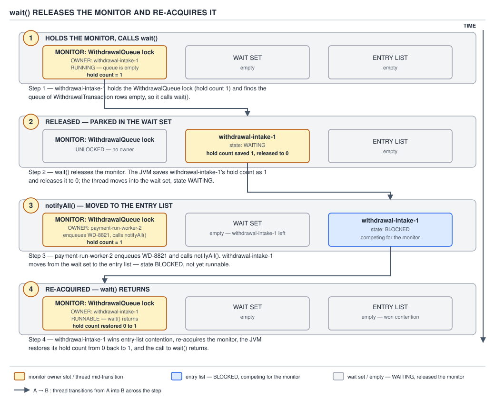
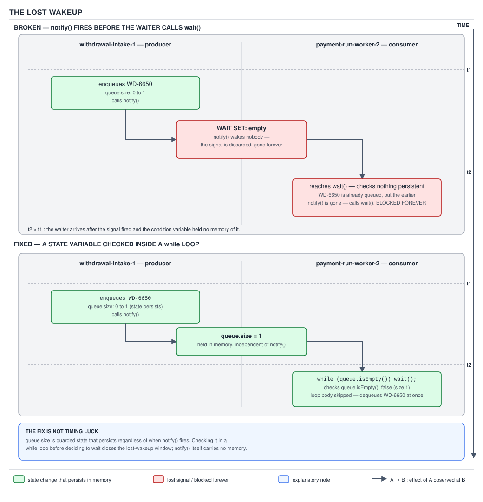
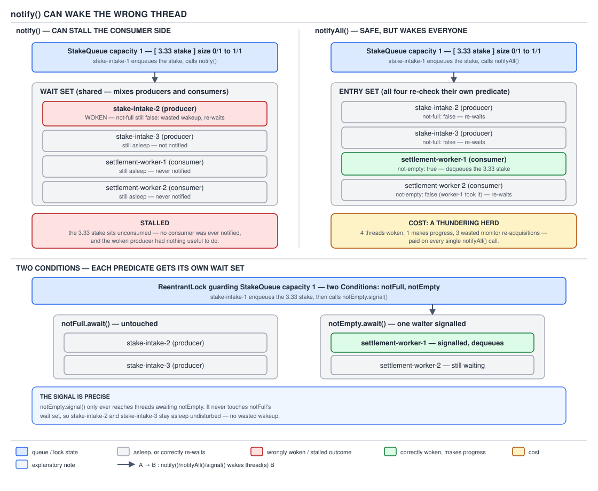

# 05 Multithreading and Concurrency — wait / notify / notifyAll — BASICS (§1.12)

**Target version: Java 21 LTS.** | **Part 1 of 5** | [Index](../00-index.md)
Previous: [Lazy initialisation and singletons](../volatile-and-jmm/03b-basics-lazy-init-and-singletons.md) · Next: [Atomics and compare-and-swap](../atomics/01a-basics-cas-and-atomics.md)

## Why `wait`/`notify` live on `Object`, not `Thread`

Every Java object already carries a monitor — the thing `synchronized` locks. Rather than invent a
separate "condition variable" type, the JDK's designers hung the wait/notify protocol directly off
`Object`: any object you can synchronize on, you can also wait on (`1.12.1`) — a design decision,
not an accident. The lock and the condition are the same object, convenient for small cases and a
straitjacket for anything larger (one lock, one set of conditions — exactly why
`java.util.concurrent.locks.Condition` exists later in this topic).

The running example: a bounded QuizStakes buffer of `WithdrawalTransaction`s waiting to be swept
into the next `PaymentRun`. Bank withdrawals run ~7k/day across 4 settlement windows — two producer
threads append approved bank withdrawals as compliance clears them, two consumer threads drain the
buffer when a window opens and the operator has signed off. The buffer's monitor is what both sides
call `wait`/`notify` on.

### `wait`/`notify` require the monitor, or `IllegalMonitorStateException` `[TRAP]`

All three methods — `wait()`, `notify()`, `notifyAll()` — throw `IllegalMonitorStateException` if
the calling thread does not currently hold the object's monitor. This is not optional context: the
JDK cannot atomically "release the monitor and suspend" unless it already knows which monitor and
which thread.

**Pitfall:** the belief is "wait/notify are just thread-coordination calls, call them wherever."
The symptom is `IllegalMonitorStateException` thrown at the `wait()` line, immediately, every time,
not intermittently — which is itself the tell that it is a locking bug, not a race. The fix is to
wrap the whole check-and-act sequence in `synchronized (this)` (or a dedicated lock object), never
just the bare call to `wait()`/`notify()`.

> **Definition:** `wait`, `notify`, and `notifyAll` are `Object` methods that require the calling
> thread to already hold the object's monitor, because they manipulate that monitor's ownership and
> the object's associated wait set atomically.

---

## `wait()` releases exactly one monitor and re-acquires before returning

### 1–3. Mental model, why it exists, when to reach for it

`wait()` is not "pause the thread." It is "atomically release this specific lock and sleep on this
object's wait list, such that no `notify` can be lost in the gap." The atomicity is the entire
point — if release-then-sleep were two separate steps, a `notify` could land in the window between
them and vanish. Before condition variables, coordinating "producer, wait until there is room"
required busy-spinning or hand-rolled polling with sleeps, both wasteful; `wait`/`notify` block
without spinning while holding no lock. Reach for raw `wait`/`notify` essentially never in
production today — reach for `BlockingQueue`, `CountDownLatch`, `Semaphore`, or `Condition` instead
(leaf `1.12.16`, expanded below). Understanding it matters because those synchronizers are built on
the same idea internally, and because interviewers ask it directly.

### 4. How it works — release, suspend, re-acquire, then return `[PROVE]`

Call `wait()` while holding the monitor (e.g. inside `synchronized (pending) { ... }`). The JVM: (1)
atomically records the thread's current **hold count** on that monitor (recursive `synchronized`
blocks nest — `wait()` must remember how many times to re-lock); (2) releases the monitor entirely,
regardless of nesting depth; (3) adds the thread to the object's **wait set**, state `WAITING` (or
`TIMED_WAITING` for timed overloads); (4) on being moved out — by `notify`/`notifyAll`, interrupt,
or timeout — the thread first moves to the **entry list** for that same monitor, state `BLOCKED`,
competing for the lock like any other blocked thread; (5) once it wins the monitor, the JVM
restores the saved hold count, and only then does `wait()` return. This is why a notified thread
visibly passes through `BLOCKED`, not straight to `RUNNABLE` — it must re-win the lock it gave up.



**D-048** — `wait()` releases the monitor and re-acquires it.

### 5. Minimal concrete example

```java
class WithdrawalQueue {
    private final Deque<WithdrawalTransaction> pending = new ArrayDeque<>();
    private final int capacity;

    WithdrawalQueue(int capacity) { this.capacity = capacity; }

    synchronized void offer(WithdrawalTransaction tx) throws InterruptedException {
        while (pending.size() == capacity) {
            wait(); // releases the monitor on `this`; re-acquires before returning
        }
        pending.addLast(tx);
        notifyAll();
    }

    synchronized WithdrawalTransaction take() throws InterruptedException {
        while (pending.isEmpty()) {
            wait();
        }
        WithdrawalTransaction tx = pending.removeFirst();
        notifyAll();
        return tx;
    }
}
```

Two compliance-clearance threads call `offer`; two payment-run sweepers call `take`. While any
thread sits inside `wait()`, the monitor on the queue instance is completely free — the other three
threads can enter `synchronized` methods on it.

### 6. The gotcha — `wait()` releases *only that* monitor `[TRAP]`

If the calling thread holds a second, unrelated lock at the time it calls `wait()`, that second
lock is **not** released — `wait()` only ever touches the monitor of the object it was called on.
Picture a `PaymentRunCoordinator` that holds `signOffLock` and, nested inside it, `synchronized
(queue) { while (queue.isEmptyUnsafe()) queue.wait(); }`: the thread sleeps inside `queue.wait()`
while still holding `signOffLock` for the entire sleep. If the thread that would call
`notifyAll()` on `queue` after appending a withdrawal also needs `signOffLock` first, this
deadlocks permanently — the waiter never releases `signOffLock` (it is asleep on a different
monitor), and the notifier can never acquire `signOffLock` to reach the `notifyAll()` that would
wake the waiter. (The full broken/fixed pair is worked in the Pitfalls section below.)

**Pitfall:** the belief is "`wait()` frees up whatever locks I'm holding so other threads can make
progress." The symptom is a deadlock that only appears under nested locking, where one thread is
`WAITING` forever and a second thread is `BLOCKED` forever trying to acquire a lock the first
thread still owns. The fix: never call `wait()` while holding a second lock unless you have proven
that lock is not needed by the thread that will notify you — in practice, avoid nested locks around
`wait()` entirely.

> **Definition:** `wait()` atomically releases only the monitor it was invoked on, suspends the
> thread into that monitor's wait set, and re-acquires the same monitor — restoring any recursive
> hold count — before returning; any other lock held by the thread is retained across the entire
> wait.

---

## The wait set (JLS 17.2) `[SOURCE]`

Every object has an associated wait set — a set of threads, not a queue with guaranteed order.
`notify()` removes one arbitrary thread from it; `notifyAll()` removes all of them. JLS §17.2
defines this precisely: "Every object, in addition to having an associated monitor, has an
associated wait set... A thread becomes the owner of the object's monitor... invokes `wait`... it
is added to the wait set." JLS §17.2.1–17.2.4 spell out four related interactions worth knowing by
name even without quoting them line by line: what happens on `wait` itself (17.2.1), what a
notification does (17.2.2), how interruption interacts with waiting (17.2.3), and — the sharp edge
— what happens when a thread is *both* notified and interrupted at nearly the same instant
(17.2.4): the JLS permits the implementation to treat this either as a normal notification followed
by an interrupt, or purely as an interrupt, but the notification is never silently dropped — if it
is not delivered to this thread, some other waiting thread receives it instead.

> **Definition:** the wait set (JLS 17.2) is an unordered collection of threads suspended inside
> `wait()` on a given object; `notify` removes one thread from it, `notifyAll` removes all of them,
> and JLS 17.2.4 guarantees a notification is never simply lost to interruption.

---

## Always wait in a `while` loop, never an `if` `[TRAP]`

### 1–3. Mental model, why it exists, when to reach for it

Treat every `wait()` call as a suggestion to re-check, never a guarantee the condition holds on
wake. `if (!cond) wait();` assumes the only way to leave `wait()` is via a notify that also
guarantees the predicate is now true — neither half of that assumption holds, for two independent
reasons below. There is no correct use of `if` guarding a bare `wait()`; every textbook and every
`java.util.concurrent` synchronizer implementation uses the `while` form, always.

### 4. How it works — two independent reasons

**Reason one — spurious wakeups are permitted by the spec `[SOURCE]` `[PROVE]`.** The
`Object.wait()` javadoc states it plainly: "A thread can also wake up without being notified,
interrupted, or timing out, a so-called *spurious wakeup*. While this will rarely occur in
practice, applications must guard against it by testing for the condition that should have caused
the thread to be awakened, and continuing to wait if the condition is not satisfied." This is not
theoretical laxity — `wait()` is commonly implemented in terms of the platform's `pthread_cond_wait`,
and POSIX itself permits spurious returns from the underlying primitive. The JVM does not promise
to filter them out. Proof by construction: even a JVM with a flawless internal wait-set
implementation is still built on top of an OS primitive that reserves the right to return early for
reasons outside the JVM's control (signal delivery, implementation-level races in the native
threading library) — so the guarantee "wait() only returns because of notify, interrupt, or
timeout" cannot be made at the language level, and the spec correctly declines to make it.

**Reason two — the state can change between wake-up and re-acquisition `[PROVE]`.** Even ignoring
spurious wakeups: with `notifyAll`, every waiter wakes and races for the monitor. Only one wins
first; it acts, and the state it consumed is now gone. Concretely: two payment-run sweepers wait on
`queue`; a compliance thread appends one withdrawal and calls `notifyAll()`. Both wake. Sweeper A
reacquires first, sees `!isEmpty()`, removes the item. Sweeper B then reacquires — the queue is
empty again — and with `if` instead of `while`, it calls `removeFirst()` on an empty deque. Even
with plain `notify` (no racing waiters), the gap between "state changed" and "waiter finishes
re-acquiring" can be crossed by yet another thread changing the state again. The fix is identical
either way: re-test the condition after `wait()` returns, every time, unconditionally.



**D-049** — the lost wakeup: a signal sent before the waiter reaches `wait()` is gone forever,
because the condition variable holds no memory; the `while`-loop-plus-state-variable form re-checks
the state directly and returns immediately instead of blocking.

### 5. Minimal concrete example — the canonical template

```java
class WithdrawalQueue {
    private final Deque<WithdrawalTransaction> pending = new ArrayDeque<>();
    private final int capacity;

    WithdrawalQueue(int capacity) { this.capacity = capacity; }

    synchronized void offer(WithdrawalTransaction tx) throws InterruptedException {
        while (pending.size() == capacity) {   // NOT if — re-checked after every wake
            wait();
        }
        pending.addLast(tx);
        notifyAll();
    }

    synchronized WithdrawalTransaction take() throws InterruptedException {
        while (pending.isEmpty()) {             // same discipline on the consumer side
            wait();
        }
        WithdrawalTransaction tx = pending.removeFirst();
        notifyAll();
        return tx;
    }
}
```

`synchronized { while (!cond) wait(); act(); }` paired with `synchronized { changeState();
notifyAll(); }` is the whole pattern — every raw `wait`/`notify` use case in this note follows it.

### 6. The gotcha — the missed-signal / lost-wakeup bug `[TRAP]` `[PROVE]`

If `notify`/`notifyAll` is called *before* the waiter reaches `wait()`, the signal is not queued
anywhere — it has no effect, because there was no one in the wait set to remove. The waiter then
calls `wait()` afterward and blocks forever, having missed a notification that already happened.
Concretely: a compliance thread flips a raw boolean `ready = true` and calls `notifyAll()` at t1,
before a sweeper thread has even entered its `synchronized` block; the sweeper reaches `wait()` at
t2 > t1, finds no one notifying it, and sleeps with no future notify coming. The state-checking
`while` loop fixes this precisely because it does not depend on catching the notify's timing — the
sweeper checks the actual state variable (`pending.isEmpty()`) directly, so even arriving at the
check after the state already changed still works, with no dependence on "being in time" for the
notify.

**Pitfall:** the belief is "if I call `notify()`, any thread that later calls `wait()` on the same
object will see it." The symptom is a producer/consumer system that works fine under low load and
hangs under high load, when a notify sometimes lands before the wait call. The fix is always to
gate `wait()` on a real, persistently-checked state variable in a `while` loop — never rely on the
notification itself as the source of truth.

> **Definition:** the `while` loop around `wait()` is required for two independent reasons —
> spurious wakeups, which the JLS explicitly permits, and races among competing waiters or against
> the notifier — and it is also what makes a `wait`/`notify` pair immune to the lost-wakeup bug,
> because the loop re-checks real state rather than trusting the signal's timing.

---

## `notify` versus `notifyAll` — a wrong wakeup wastes the signal `[TRAP]` `[PROVE]`

### 1–3. Mental model, why it exists, when to reach for it

`notify()` picks one arbitrary thread out of the wait set — the JVM does not know or care whether
that thread can make progress; `notifyAll()` wakes every thread and lets them sort it out via the
`while` re-check. Picking `notify` is an optimization, safe only when every waiter shares the
*same* condition and any one of them succeeding is equally good — e.g. a single-slot resource pool
with one kind of waiter. The `WithdrawalQueue` above has **two different kinds of waiters in one
wait set**: producers waiting for "not full", consumers for "not empty." That is exactly the shape
where `notify()` is dangerous and `notifyAll()` is the only sound choice — why the earlier example
already used `notifyAll()` throughout.

### 4. How it works — the wrong-thread wakeup

Suppose the queue instead called `notify()` after `offer()`, reasoning "I just added something, a
consumer should wake." With two producers and two consumers sharing `queue`'s single wait set,
`notify()` might instead wake a *producer* blocked on `pending.size() == capacity` — an irrelevant
wakeup (its predicate is still false, it re-checks and re-sleeps) while the consumer that could
have drained the new item stays asleep. The signal that should have gone to a consumer is spent on
a producer instead, and it is gone — no notify is queued or retried.



**D-050** — a shared wait set holding two producer and two consumer threads on one bounded
withdrawal queue: `notify()` can wake a producer when only a consumer could proceed, wasting the
signal; `notifyAll()` wakes everyone, three re-check and re-sleep, one proceeds; a `Condition`-based
design gives producers and consumers separate wait sets so `signal()` is always precise.

### 5. Minimal concrete example — separating the wait sets with `Condition`

```java
class WithdrawalQueue {
    private final Lock lock = new ReentrantLock();
    private final Condition notFull = lock.newCondition();
    private final Condition notEmpty = lock.newCondition();
    private final Deque<WithdrawalTransaction> pending = new ArrayDeque<>();
    private final int capacity;

    WithdrawalQueue(int capacity) { this.capacity = capacity; }

    void offer(WithdrawalTransaction tx) throws InterruptedException {
        lock.lock();
        try {
            while (pending.size() == capacity) {
                notFull.await();
            }
            pending.addLast(tx);
            notEmpty.signal(); // only ever wakes a consumer — precise
        } finally {
            lock.unlock();
        }
    }

    WithdrawalTransaction take() throws InterruptedException {
        lock.lock();
        try {
            while (pending.isEmpty()) {
                notEmpty.await();
            }
            WithdrawalTransaction tx = pending.removeFirst();
            notFull.signal(); // only ever wakes a producer — precise
            return tx;
        } finally {
            lock.unlock();
        }
    }
}
```

Two `Condition` objects on one `Lock` give producers and consumers separate wait sets, so
`signal()` is always precise — there is no "wrong kind of thread" left to wake.

### 6. The gotcha — the thundering herd, and its fix

`notifyAll()` on a large wait set wakes every thread even when only one can proceed; the rest pay
the cost of re-acquiring the monitor, re-checking, and going back to `wait()` for nothing —
expensive under heavy contention. `Condition` objects fix this at the root by giving each predicate
its own wait set, so the equivalent of `notifyAll()` (`signalAll()`) is rarely needed and `signal()`
alone is precise. This does not mean `notifyAll()` was wrong to use above — with only two kinds of
waiters and no `Condition` split, `notifyAll()` is the correct, if less efficient, choice.

**Interview:** "when would you use `notify()` over `notifyAll()`?" — only when every waiter shares
the identical condition; otherwise `notifyAll()` is the safe default and `Condition` is the fix.

> **Definition:** `notify()` wakes one arbitrary thread from the object's wait set with no regard
> for which predicate it is waiting on, which is safe only when all waiters share one condition;
> `notifyAll()` wakes all of them and relies on the mandatory `while` re-check to filter correctly,
> at the cost of unnecessary wakeups that `Condition`-per-predicate designs avoid.

---

## Supporting facts

**JLS 17.2.1–17.2.4 as a set (leaf `1.12.6`).** Beyond the wait-set definition (17.2) and the
notified-and-interrupted interaction already covered (17.2.4): §17.2.1 specifies that a thread
calling `wait` must own the monitor and is added to the wait set as one atomic action with the
release; §17.2.2 specifies that `notify`/`notifyAll` select from the wait set and move the
thread(s) to compete for the monitor, without transferring ownership directly; §17.2.3 specifies
that an interrupted waiting thread wakes with `InterruptedException` rather than silently
continuing. **Gotcha:** none of these clauses relax the `while`-loop requirement — they describe
*how* a wakeup happens, not what it guarantees about program state. **Definition:** JLS
17.2.1–17.2.4 jointly specify the atomic release-and-suspend on `wait`, the selection semantics of
`notify`/`notifyAll`, and how interruption interleaves with both.

**The canonical state-dependent-action template (leaf `1.12.10`).** `synchronized { while (!cond)
wait(); act(); }` paired with `synchronized { changeState(); notifyAll(); }` — already used
throughout this note's `offer`/`take` pair. **Gotcha:** `changeState()` must happen before
`notifyAll()` inside the same `synchronized` block as the mutation, or a waiter can wake, see stale
state, and re-sleep needlessly. **Definition:** the template pairs a `while`-guarded `wait()` with
a state mutation immediately followed by a notify, both under the same monitor.

**Timed `wait` cannot tell you why it returned (leaf `1.12.14`) `[TRAP]`.** `wait(long timeoutMs)`
and `wait(long, int)` return whether notified, spuriously woken, or timed out — the return value is
`void` in every case. **Pitfall:** the belief is "if `wait(timeout)` returns, I can tell whether it
timed out." The symptom is code that treats every return as a successful notification and acts on
stale state. The fix: check `System.nanoTime()` against a deadline computed before the call, inside
the same `while` loop, and re-check `cond` once more after it exits. **Definition:** a timed `wait`
gives no signal distinguishing timeout from notification or spurious wakeup; the caller must track
elapsed time explicitly.

**Interruption during `wait` (leaf `1.12.15`).** If another thread calls `interrupt()` on a thread
blocked in `wait()`, the JVM first re-acquires the monitor exactly as on a normal wakeup, *then*
throws `InterruptedException` with the interrupt flag cleared. **Gotcha:** re-acquisition happens
before the exception is thrown, so an interrupted waiter still pays the full cost of contending for
the lock. **Definition:** `wait()` responds to interruption by re-acquiring the monitor, clearing
the interrupt flag, and throwing `InterruptedException`, in that order.

**Why modern code reaches for higher-level synchronizers instead (leaf `1.12.16`).**
`BlockingQueue`, `CountDownLatch`, `Semaphore`, and `Condition` all replace hand-rolled
`wait`/`notify` — a real payment-run buffer in production would almost certainly be an
`ArrayBlockingQueue<WithdrawalTransaction>`, not a hand-built monitor. **Gotcha:** raw
`wait`/`notify` still matters because it is asked directly in interviews and because every one of
those higher-level synchronizers is implemented on the same wait-set/AQS ideas underneath (AQS
internals come later in this topic). **Definition:** `wait`/`notify` are the primitive that
`BlockingQueue`, `CountDownLatch`, `Semaphore`, and `Condition` are built from.

---

## Pitfalls

### Assuming `wait()` releases every lock the thread holds

**Wrong**

```java
synchronized (signOffLock) {
    synchronized (queue) {
        while (queue.isEmptyUnsafe()) {
            queue.wait(); // signOffLock is still held for the entire sleep
        }
    }
}
```

If the thread that would call `notifyAll()` on `queue` also needs `signOffLock` first, this
deadlocks: the waiter never releases `signOffLock`, so the notifier can never reach the notify.

**Right**

```java
synchronized (queue) {
    while (queue.isEmptyUnsafe()) {
        queue.wait(); // only queue's monitor is held here — none at all, in fact
    }
}
// acquire signOffLock separately, after the wait resolves, if still needed
```

Never nest an unrelated lock around `wait()`; if ordering truly requires both, acquire the second
lock only after `wait()` returns.

**Why people believe it:** `wait()` is often introduced as "pausing the thread," which sounds
global, when the guarantee is scoped to exactly the one monitor the method was called on.

### Guarding `wait()` with `if` instead of `while`

**Wrong**

```java
synchronized WithdrawalTransaction take() throws InterruptedException {
    if (pending.isEmpty()) {
        wait();
    }
    return pending.removeFirst(); // may throw on an empty deque
}
```

Two consumers race after one `notifyAll()`; the second one to reacquire the monitor finds the
queue empty again and calls `removeFirst()` on empty — `NoSuchElementException`. A spurious wakeup
produces the identical failure with only one consumer.

**Right**

```java
synchronized WithdrawalTransaction take() throws InterruptedException {
    while (pending.isEmpty()) {
        wait();
    }
    return pending.removeFirst();
}
```

Re-check the actual predicate every time `wait()` returns, unconditionally.

**Why people believe it:** `notify`/`notifyAll` look like a targeted signal ("I changed the thing
you were waiting for"), so it feels redundant to re-check — but the spec never promises the state
is still true, or that this waiter is even the one the signal was meant for.

---

## Cheat sheet

| Fact | Detail |
|---|---|
| Location | `wait`/`notify`/`notifyAll` are on `Object`, not `Thread` |
| Precondition | must hold the monitor, else `IllegalMonitorStateException` |
| `wait()` releases | exactly one monitor — the one it was called on; other held locks are retained |
| Path back | `WAITING` (wait set) → `BLOCKED` (entry list) → re-acquire → `RUNNABLE` |
| Guard `wait()` with | `while (!cond) wait();` — never `if` |
| Reason 1 for `while` | spurious wakeups are permitted by the spec (`pthread_cond_wait` heritage) |
| Reason 2 for `while` | racing waiters / state can change before re-acquisition |
| Lost wakeup | `notify` before the waiter reaches `wait()` — signal has no memory, gone forever |
| `notify()` | wakes one arbitrary thread — safe only if every waiter shares one condition |
| `notifyAll()` | wakes all — safe default when the wait set mixes conditions (e.g. producers + consumers) |
| Scalable fix | one `Condition` per predicate on a `Lock` — `signal()` becomes precise |
| Timed `wait` | cannot tell you if it timed out — check `System.nanoTime()` yourself |
| Interrupt during `wait` | monitor is re-acquired first, then `InterruptedException` is thrown, flag cleared |
| Prefer in production | `BlockingQueue`, `CountDownLatch`, `Semaphore`, `Condition` over raw `wait`/`notify` |

---

## Self-test

**Q1.** Why does `wait()` require the calling thread to already hold the monitor?

<details><summary>Answer</summary>

Releasing the monitor and adding the thread to the wait set must happen as one atomic action to
avoid losing a `notify` sent in the gap; the JVM can only guarantee that atomicity if the thread
already owns the monitor. Calling `wait()` without holding it throws `IllegalMonitorStateException`.

</details>

**Q2.** A thread holds locks `A` and `B` and calls `B.wait()`. Which locks does it still hold while
suspended?

<details><summary>Answer</summary>

Only `A`. `wait()` releases exclusively the monitor it was invoked on (`B`); `A` is retained for the
wait — a classic deadlock source if the thread that would notify on `B` also needs `A` first.

</details>

**Q3.** Why does a notified thread go to `BLOCKED` before `RUNNABLE`?

<details><summary>Answer</summary>

`notify`/`notifyAll` only move a thread from the wait set into the entry list for the same monitor
— they do not hand it the lock directly. The thread competes for and re-acquires the monitor like
any other thread entering a `synchronized` block (`BLOCKED`); only once it wins the lock, restoring
its saved recursive hold count, does it become `RUNNABLE` and `wait()` return.

</details>

**Q4.** Give two independent reasons `wait()` must be called inside a `while` loop rather than an
`if`.

<details><summary>Answer</summary>

First, the `Object.wait()` javadoc explicitly permits spurious wakeups, tracing back to the
underlying `pthread_cond_wait` primitive's own allowance for early returns. Second, even with a
genuine notify, the state can be stale by the time this thread re-checks it: with `notifyAll`,
several waiters race and only the first consumes the state change; even with plain `notify`,
another thread can alter the state again before this waiter finishes re-acquiring the monitor.

</details>

**Q5.** What causes the lost-wakeup bug, and what is the fix?

<details><summary>Answer</summary>

A `notify`/`notifyAll` call that happens before the waiting thread ever reaches `wait()`. The wait
set at that moment does not contain this thread, so the notification has no effect and is not
queued for later delivery. The fix is to gate `wait()` on a real, persistently checked state
variable inside a `while` loop, so the waiter sees the up-to-date state directly instead of
depending on catching a transient notify at the right instant.

</details>

**Q6.** When is `notify()` safe to use instead of `notifyAll()`?

<details><summary>Answer</summary>

Only when every thread in the object's wait set is waiting on the exact same condition, and
satisfying it for any one arbitrarily chosen waiter is always correct. If the wait set mixes kinds
of waiters — producers waiting for "not full", consumers for "not empty" — `notify()` can wake a
thread whose predicate is still false, wasting the signal while the thread that could proceed stays
asleep.

</details>

**Q7.** How do `Condition` objects solve the problem that `notify()` can wake the wrong thread?

<details><summary>Answer</summary>

By giving each predicate its own wait set. A `Lock` can back two `Condition`s — `notFull` and
`notEmpty` — each with only the relevant threads waiting on it. `signal()` on `notEmpty` can then
only ever wake a consumer, and `signal()` on `notFull` only a producer — the wakeup is precise by
construction, not by luck.

</details>

**Q8.** A timed `wait(500)` returns. How do you determine whether it timed out?

<details><summary>Answer</summary>

You cannot tell from the return of `wait()` itself. Record a deadline (e.g.
`System.nanoTime() + Duration.ofMillis(500).toNanos()`) before calling `wait`, and after it
returns, compare the current time against that deadline while re-checking the actual condition in
the same `while` loop that governs the wait.

</details>

**Q9.** What happens if a thread waiting inside `wait()` is interrupted?

<details><summary>Answer</summary>

The JVM first re-acquires the object's monitor exactly as on a normal wakeup, restoring the saved
recursive hold count, and only then clears the interrupt flag and throws `InterruptedException`.
Interruption does not skip re-contending for a busy monitor.

</details>

**Q10.** Why should production code prefer `BlockingQueue` or `Condition` over raw `wait`/`notify`,
given that they are built on the same idea?

<details><summary>Answer</summary>

Raw `wait`/`notify` puts the full correctness burden — the `while` re-check, avoiding lost wakeups,
choosing `notify` versus `notifyAll` correctly, avoiding nested-lock deadlocks — on the application
author. `BlockingQueue`, `CountDownLatch`, `Semaphore`, and `Condition` implement the same
release/suspend/re-acquire mechanics internally but expose a narrower, harder-to-misuse API (e.g.
`put`/`take` that cannot forget the `while` loop). Raw `wait`/`notify` is still worth knowing
because it is asked directly and is the mechanism those synchronizers are built from.

</details>

---

**Leaves covered:** 1.12.1–1.12.16 (16 leaves)
**Leaves deferred:** none
**Diagrams included:** D-048, D-049, D-050
**Target version:** Java 21 LTS
**Lines:** 600
