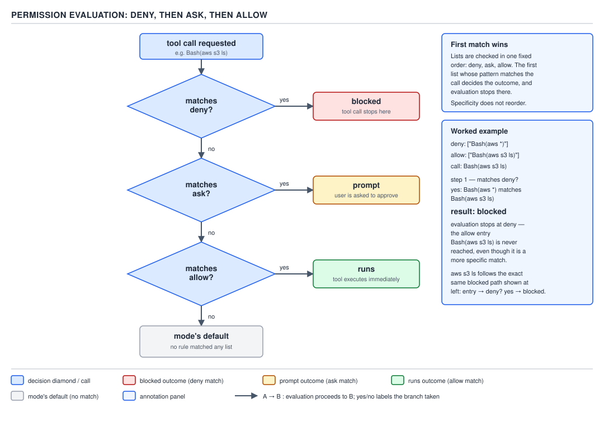
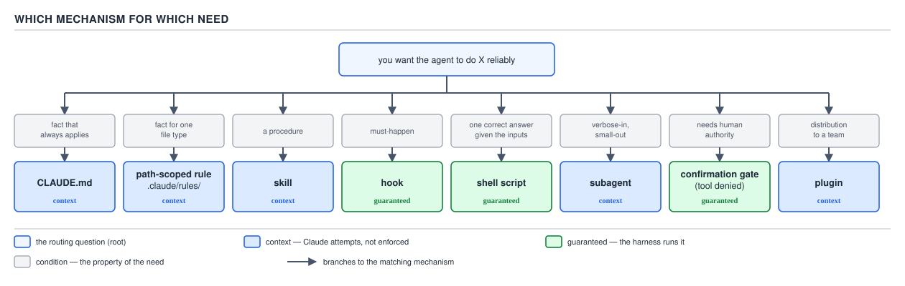

# 21 AI for Coding — PARTs 0 and 1 — the interview wrap-up (§0.1–§1.5)

**Target version: Claude Code v2.1.2xx (August 2026).** | **Part 1 of 6** | [Index](00-index.md)
Previous: [built-ins, kill switches and the decision table](skills/06-builtins-and-decision-table.md) · Next: [subagents: definition and precedence](subagents/01-basics-definition-and-precedence.md)

This file closes PART 0 (the model, the context window, the agent loop, orientation) and PART 1 (the
`.claude` folder, settings, `CLAUDE.md` and memory, permissions, skills and slash commands) — six
subject folders, 167 leaves, none of them owned here. Everything below is drawn from the note files
under `ground-zero/`, `claude-folder/`, `settings/`, `memory/`, `permissions/`, and `skills/`; read
those for the full argument, this file for the recall pass the night before an interview.

## Summary table

### Ground zero — the model, the context window, the agent loop, orientation

| Mechanism | The number | The trap |
|---|---|---|
| The model itself | Stateless function, text in/text out, zero memory between calls | "It remembers" is always the harness re-sending the transcript, never the model |
| Token | ≈3–4 chars of English ≈ 1 token; code/JSON tokenize worse | Counting characters, not tokens, under- or over-estimates cost |
| Context window | 200K standard, 1M extended (Sonnet 5 auto, others via `[1m]`) | Same per-token price beyond 200K — "1M costs more" is not automatically true |
| Cost/latency scaling | Scales with *total* conversation length, not the latest message | A 10-turn vs 100-turn session differs by ≈44.6×, not 10× |
| Prompt caching | Unchanged prefix reused at ~10% of input price | Editing text before the tail, or a cold cache, forces full-price reprocessing |
| Cache TTL | 1 hour (main conversation, subscription plans) or 5 minutes otherwise | A 6-minute pause on the 5-minute tier throws the whole cache away |
| The agent loop | assemble request → model emits text/`tool_use` → harness executes → repeat | The model never calls a tool — it only proposes one; the harness decides |
| Turn bounding | `--max-turns` bounds agency, a wall-clock timeout bounds time | Only one of the two bounds a runaway loop that neither errors nor stops |
| `ToolSearch` / deferred tools | Cuts ≈85% of up-front tool-definition tokens | Believing every tool's full schema is always resident |
| `/context` | The single most important diagnostic habit in the guide | Skipping it and guessing why context is full instead of reading the grid |
| `--safe-mode` vs `--bare` | Safe-mode disables customization, keeps permissions; bare skips discovery entirely | Treating them as the same "clean start" — bare drops permissions rules too |

### The `.claude` folder

| Mechanism | The number | The trap |
|---|---|---|
| `.claude/` | Configuration-as-code — a discovered directory, not a registry | Treating it like a database with an API instead of files you can diff |
| Discovery walk | Reads from the primary working directory and every directory above it | Assuming every artefact walks upward — subdirectory files load on demand, not at launch |
| `~/.claude.json` | Tool-owned: sign-in, MCP registrations, per-project trust | Hand-editing it — it is not a settings file |
| `CLAUDE_CONFIG_DIR` | Relocates the whole user tree | Forgetting Windows resolves `~/.claude` to `%USERPROFILE%\.claude` regardless |
| What's not in `.claude/` | Plugin cache, transcripts, auto-memory directory | Expecting `git status` inside a repo to show auto-memory or transcripts — they live outside deliberately |

### Settings: files, scope, precedence

| Mechanism | The number | The trap |
|---|---|---|
| Four settings files | user, shared project, project local, managed | Forgetting managed exists and isn't one of the three you can edit yourself |
| Precedence, highest first | **managed → command line → project local → shared project → user** | "More specific wins" and "command line always wins" — both false; managed beats the CLI |
| Settings file creation | None on install; user file on first stored `/config`; local file on first "don't ask again" | Assuming a fresh install ships a template settings.json — it ships none |
| Local file location in a repo | Repository root, not the starting directory (v2.1.211+) | Expecting it in the subdirectory you launched `claude` from inside a monorepo |
| Key groups | 15 named groups in `settings-reference` | Hunting through prose instead of the group index when looking for a key |
| Silently-ignored keys | Unknown keys, parenthesised `mcp__` rules, path rules on tools that don't consult them | All three are accepted at load and then ignored — with a startup warning almost nobody reads |
| Verifying a setting applied | `/config`, `/permissions`, `claude doctor`, the invalid-settings dialog | Trusting that a value in the file means the value is *live* |

### `CLAUDE.md` and the memory system

| Mechanism | The number | The trap |
|---|---|---|
| Two mechanisms | `CLAUDE.md` (you write) vs. auto memory (Claude writes) | Confusing "Claude wrote it" auto memory for a `CLAUDE.md` you can edit by hand as prose |
| Enforcement | **Context, not enforced configuration** — only a hook guarantees | The most-missed fact in the whole part: Claude *tries*, a hook *runs* |
| Load order | Managed → user → project → local, concatenated, root-down | "Overriding" is the wrong verb — every level's text is present, none replaces another |
| `@path` imports | Max depth **4 hops**, relative to the importing file, skipped in code fences | Believing an import saves context — the imported file loads at launch regardless |
| Size guidance | Target under 200 lines; hard skip past 4 MiB | A 1,000-line `CLAUDE.md` doesn't error, it just gets followed worse |
| `paths:` frontmatter budget | 1,000 expanded patterns / 4 MiB, shared | Brace-expanding past the budget silently leaves the offending pattern unexpanded |
| Auto memory index | First 200 lines / 25 KB of `MEMORY.md` loads; topic files on demand | Assuming every memory the tool ever wrote is in context every session |
| Subagent access | Auto memory does **not** load into subagents (a fork excepted) | Debugging "the subagent forgot" as a memory bug instead of a scoping fact |
| Survives `/compact` | Project-root `CLAUDE.md`: yes, re-read from disk | Nested `CLAUDE.md` and path-scoped rules only reload on next match, not automatically |

### The permission system

| Mechanism | The number | The trap |
|---|---|---|
| Foundation | Rules are enforced by **Claude Code**, not the model | Prompting "never run `rm -rf`" is not a control — a `deny` rule is |
| Evaluation order | **deny → ask → allow, first match wins, specificity never reorders** | A broad `deny` cannot carry a narrower `allow` exception — same for `ask` over `allow` |
| Bare vs. scoped deny | Bare tool name removes it from context; scoped deny leaves it visible | Expecting a scoped `Bash(rm *)` deny to also hide the `Bash` tool entirely |
| Compound commands | 7 separators (`&&`, `||`, `;`, `\|`, `\|&`, `&`, newline), each checked independently | "Don't ask again" on one compound command saves up to 5 rules, not 1 |
| Wrapper stripping | `timeout`, `nice`, `nohup`, `stdbuf`, `command`, `builtin`, `noglob`, bare `xargs` | Environment *runners* (`devbox run`, `npx`, `docker exec`, `direnv exec`, `mise exec`) are **not** stripped |
| Read/Edit path rules | gitignore syntax; consulted for `Edit`/`Read` **only** | `Write(...)`, `NotebookEdit(...)`, `Glob(...)` path rules are accepted and never consulted |
| Six permission modes | `default`/`manual`, `acceptEdits`, `plan`, `auto`, `dontAsk`, `bypassPermissions` | Naming only four is itself the tell that the answer is stale |
| `acceptEdits` real list | edits + `mkdir`, `touch`, `rm`, `rmdir`, `mv`, `cp`, `sed` | Not `git commit`, not a build tool, not running the compiled program |
| `bypassPermissions` | Allows protected-path writes (`.git`, `.claude`) on current docs | It does **not** "still protect `.git`" — that belief is the version trap |
| Workspace trust | Gates `allow` + `additionalDirectories` only; `deny`/`ask` ungated | Only the *permissive* direction needs review — restriction can't be exploited by a hostile repo |
| `-p`/SDK + untrusted folder | Rules **not used**, stderr warning — the safe case | The danger is trust being sticky per path, re-applied unreviewed once trusted once |
| Sandbox | OS-level boundary under the rule system | Catches an arbitrary subprocess a `Read`/`Edit` deny cannot see at all |

### Skills and slash commands

| Mechanism | The number | The trap |
|---|---|---|
| The merge | Custom commands **are** skills — same mechanism, same behaviour | Treating `commands/` and `skills/` as two systems that might conflict differently |
| Four locations | Enterprise → Personal → Project; plugin skills namespaced, never conflict | A skill at any level overrides a same-named **bundled** skill, not its alias |
| Progressive disclosure | Only `description` + `when_to_use` resident; body loads on fire | 50 skills ≈ 19,200 idle tokens; the same content as `CLAUDE.md` entries ≈ 140,000 |
| Listing cap | **1,536 characters** combined `description` + `when_to_use`, per entry | Past the pool budget, least-invoked skills lose their description entirely, silently |
| `allowed-tools` | **Pre-approves** for the invoking turn only, clears next message | It does not *restrict* — every other tool stays callable; `disallowed-tools` restricts |
| Frontmatter detection | Read only when `---` is the file's **literal first line** | A leading comment or blank line turns the whole file into plain content |
| Skill lifecycle | Enters as one message, stays; re-invocation with identical content dedups | Not re-read from disk on later turns — write standing instructions, not one-shot steps |
| Compaction re-attach | 5,000 tokens/skill, 25,000 combined, newest-first | Old skills can silently vanish from context after `/compact` |
| Built-ins vs. bundled skills | `/doctor`, `/rewind` are **skills**; `/run` is a **built-in** | The reverse of the naive assumption — only a skill can be shadowed or disabled |
| The decision table | `CLAUDE.md` / path-rule / skill / **hook** / subagent / plugin | Only the hook is *guaranteed* — the other five are read and can be skipped |

## Interview questions and answers

**1. What's the actual difference between the model emitting a tool call and the tool running — and why does prompting the model not count as a control?**

The model never calls a tool in the literal sense of executing anything. What it produces, when it decides a tool is needed, is a `tool_use` block — a chunk of structured output naming a tool and its arguments, exactly the same kind of thing as any other text it emits. That block goes back to the harness, and it is the harness — Claude Code, not the model — that looks at the name, checks it against the permission rules, and decides whether to actually run the corresponding function. Only after that decision does anything touch the filesystem or the network; the result then gets appended to the transcript as a `tool_result` message and fed back in on the next turn.

That gap between "the model proposed it" and "the harness ran it" is the entire basis of the permission system, and it's exactly why a `CLAUDE.md` line or a system-prompt instruction like "never run `rm -rf`" is not a control in any meaningful sense. The model is still a text generator sampling from a probability distribution — under the right pressure, a long context, an ambiguous instruction, or a prompt-injected string it read off a web page, it can and does propose the tool call anyway. What actually stops that command from executing is a `deny` rule the harness evaluates deterministically before the tool ever runs, with no model judgment involved in the block itself. So the honest framing in an interview is: prompting shapes what the model *tries*, permission rules decide what *runs*, and only the second one is a guarantee.

**2. Why does the whole conversation get re-sent on every single turn, and what does that actually do to cost?**

Claude Code's request format is stateless on the API side — there's no server-side session, no cookie, nothing analogous to an HTTP session store. Each call is a self-contained JSON object with a `system` field and an ordered `messages` array, and to continue a conversation, the harness has to hand back every prior message plus the new one. The honest Java analogy is a `@RestController` method that receives the entire conversation as its request body on every single call, from a client that just keeps appending to that body — the difference from a real stateless controller is that there's no session ID standing in for history; the full history *is* the payload every time.

The consequence is that cost and latency scale with the length of the whole conversation, not with your latest message, and the arithmetic is worse than intuition suggests. If turn 1 sends 1,000 tokens and each subsequent turn adds another 1,000 tokens of both new user input and new assistant output, a 10-turn session processes roughly 10 × 1,000 tokens summed across all the requests made so far — call it in the tens of thousands — while a 100-turn session isn't just 10× that, because every one of those hundred requests is resending everything before it. Worked out concretely for this scaling, 10 turns land around 104,000 total tokens processed across the session, and 100 turns land around 4,640,000 — a ratio of roughly 44.6×, not the 10× the turn-count alone would suggest. Prompt caching mitigates this heavily in practice, since the unchanged prefix of the growing conversation gets reused at roughly 10% of the normal input price, but caching only helps if you're appending to the end rather than editing something near the beginning — an edit near the start invalidates the cached prefix and forces full-price reprocessing of everything after it.

**3. Walk through how the settings precedence order works, and why "managed beats the command line" surprises people.**

There are four kinds of settings files that can all set the same key, and Claude Code resolves conflicts with a fixed order, highest priority first: managed settings, then whatever's passed via `--settings` on the command line, then the project's local file (`.claude/settings.local.json`, gitignored, personal), then the shared project file (`.claude/settings.json`, committed), then the user's own `~/.claude/settings.json`. Whichever file sets a given key at the highest layer in that list wins outright — it's not a merge of "most specific" values, it's a fixed stack, and a key set at a lower layer simply doesn't apply if a higher layer already set it.

The part that trips people up is the assumption that the command line, being the thing you typed most recently and most deliberately, must always win. It doesn't. Managed settings — the file an enterprise administrator controls, sitting at a fixed OS-specific path outside any project or user directory — outranks even an explicit `--settings` flag on the invocation. That's a deliberate design choice: managed settings exist specifically so an organization can lock down things like which permission modes are reachable or which model is used, and if the command line could simply override that, managed settings wouldn't be an enforcement layer at all, just a suggestion a developer could route around with one flag. So the correct mental model going into an interview is that the precedence chain isn't "most specific wins" and isn't "most recent wins" — it's a fixed hierarchy where the whole point of the top layer is that nothing below it, including deliberate developer intent expressed on the command line, can contest it.


**D-20** — The five-layer precedence stack: managed, command line, project local, shared project, user, highest first.

**4. Is `CLAUDE.md` an enforcement mechanism, and if not, when do you reach for a hook instead?**

No, and this is probably the single most-repeated correction across the whole memory subject: `CLAUDE.md` is context, not enforced configuration. Every session, the tool concatenates the managed policy file, the user-level file, the project file, and any local file, root-down, and injects the whole thing into the system prompt. Claude reads that text and, under ordinary conditions, tries to follow it — a line like "always run the linter before finishing" is treated the same way as any other instruction in the prompt. But "tries to follow" is exactly the weak point: under time pressure, in a long session where the instruction has scrolled far back in the effective attention budget, or when a more immediate instruction conflicts with it, the model can and does skip it, and there's no error, no log line, nothing surfaced to tell you it happened. It just silently didn't happen.

A hook is categorically different because it's not text the model reads — it's a command the harness itself runs at a defined event, like `PreToolUse` or `PostToolUse`, and the harness can inspect that command's exit code and actually block the triggering action if it fails. So the decision rule is: if the instruction only needs to be *usually* followed and the cost of an occasional miss is tolerable, a `CLAUDE.md` line is fine and cheap. If the instruction is a must-happen with no acceptable exceptions — tests must pass before a commit lands, a linter must run before a file is considered done — that has to be a hook, because a hook is the one mechanism in this whole subject area that the harness enforces rather than merely reads.

**5. Explain the deny/ask/allow evaluation order, and why a narrow allow rule can't carve an exception out of a broad deny.**

Claude Code keeps three separate rule lists per tool call: `deny`, `ask`, and `allow`. The evaluation order is fixed and always the same regardless of how the rules are written: `deny` is checked first, then `ask`, then `allow`, and the very first rule that matches wins — nothing about a rule being more specific than another rule reorders that sequence. So if a `deny` rule matches a given command, evaluation stops right there; the `ask` and `allow` lists are never even consulted for that call.

That's exactly why a broad `deny` swallows a narrower `allow` intended as an exception. Take `Bash(aws *)` in `deny` and `Bash(aws s3 ls)` in `allow` — the intent is obviously "block AWS CLI calls in general, but let read-only S3 listing through." What actually happens is that `aws s3 ls` gets checked against `deny` first, `Bash(aws *)` matches it because the wildcard covers everything after `aws`, and the call is blocked before the allow rule is ever reached. The identical shape applies one level down: an `ask` rule that matches a command will force a prompt even if a more specific `allow` rule also matches, because `ask` is still checked before `allow` in the fixed order. The practical fix, and the thing worth saying explicitly in an interview, is that you can't write an allowlist exception into a broad denylist — if you want `aws s3 ls` to run freely while blocking the rest of the AWS CLI, the deny rule itself has to be written narrowly enough to exclude it, because the allow list is structurally never going to get a chance to rescue anything the deny list already caught.



**D-28** — Permission evaluation order: `deny`, then `ask`, then `allow`; first match wins, specificity never reorders it.

**6. What does `allowed-tools` in a skill's frontmatter actually do — and what's the misconception it invites?**

The natural reading of a field called `allowed-tools` is that it's a restriction — a list of the only tools this skill is permitted to call, the way you might read a role's permission set. That reading is backwards. `allowed-tools` is a *pre-approval* list: it grants permission for the specific tool calls named, for the turn in which the skill is invoked, so that those calls don't trigger a permission prompt the user would otherwise have to click through. It does not remove or restrict access to any other tool — everything else the model could normally call remains fully callable during that same invocation, exactly as if `allowed-tools` weren't there at all. And critically, the pre-approval isn't sticky: it clears on the very next user message, so it only ever covers the one turn where the skill fired.

The field that actually restricts is the differently-named `disallowed-tools`, which removes tools from the callable pool while the skill is active. So the honest audit value of `allowed-tools` in an interview answer is narrower than people assume: reading a skill's `allowed-tools` list tells you which specific calls won't interrupt the user with a prompt, not what the skill's total blast radius is bounded to — for the real ceiling on what a skill (or the whole session) can do, you have to look at `permissions.deny`, which is absolute and session-scoped rather than skill-scoped and turn-scoped.

**7. What is progressive disclosure, and why does it make fifty skills affordable while fifty equivalent `CLAUDE.md` entries would not be?**

Progressive disclosure is the loading strategy behind skills: only a skill's `name`, `description`, and optional `when_to_use` field are resident in context at all times, as a short entry in the skill listing the model sees on every turn. The full body of the `SKILL.md` file — the actual instructions, any code, any references — is not loaded until the skill actually fires, either because the model decided to invoke it or because a user typed `/name`. Before that moment, the body costs nothing beyond the listing entry.

The arithmetic makes the gap concrete rather than just qualitative. Fifty installed skills, each contributing a modest listing entry, sit around 19,200 idle tokens resident every single turn — real, but small relative to a 200K window. If that same fifty topics' worth of instructions were instead written as fifty always-on entries directly in `CLAUDE.md`, every one of them is injected in full on every single turn regardless of relevance, and the equivalent content comes out around 140,000 tokens — the difference between a rounding error and something that eats the majority of a standard context window before you've typed a single message. The mechanism producing that gap is exactly the "load on demand vs. load always" split: a `CLAUDE.md` entry has no concept of firing conditionally, so its whole cost is paid every turn whether or not it's relevant to what you're doing right now, while a skill's cost structure is deliberately split into a cheap always-on stub and an expensive on-demand body.

**8. Name and describe the six permission modes — why is answering "four" a red flag in an interview?**

The six modes, from most cautious to least, are `default` (labelled Manual in every interface), `acceptEdits`, `plan`, `auto`, `dontAsk`, and `bypassPermissions`. `default` runs reads only and prompts for everything else. `acceptEdits` auto-approves file edits plus a specific set of filesystem Bash commands — `mkdir`, `touch`, `rm`, `rmdir`, `mv`, `cp`, and `sed` — scoped to the working directory. `plan` allows reads and, when auto mode is available, classifier-approved shell commands during planning, but holds every file edit until you approve the plan. `auto` lets nearly everything run, with a background classifier model reviewing each action instead of a human. `dontAsk` runs only calls that already match an `allow` rule or the built-in read-only command set, denying anything unmatched outright rather than queuing a prompt. And `bypassPermissions` runs essentially everything immediately with no classifier and no prompt, including protected-path writes.

Answering "four modes" — leaving out `auto` and `dontAsk` — is a tell in an interview because it means the candidate's mental model predates a real shift in how sessions default. As of this target version, `auto` is the built-in starting mode on Pro, Max, and Team plans, meaning a brand-new session on those plans doesn't even start in the mode a four-mode answer would call the baseline. So naming only four modes isn't just an incomplete list, it's evidence the candidate is describing an older product, which is worth stating plainly rather than glossing over — the strongest answer names all six and explicitly flags that `auto` is now the default a fresh session lands in.

**9. What is workspace trust, and what actually happens to a repository's permission rules when you run it under `-p` or the SDK?**

Workspace trust is the one-time approval dialog Claude Code shows before applying the *permissive* parts of a project's committed settings — specifically `permissions.allow` rules and `permissions.additionalDirectories` entries — because those are the parts that widen what a session can do without asking, and a hostile or careless committed settings file shouldn't get to grant that capability unreviewed. `deny` and `ask` rules are never gated by this dialog, because they only narrow behavior or force a prompt, and applying either of those before trust is granted can't let an untrusted repository do anything more dangerous than it could already do — it can only make the session more cautious.

The genuinely important trap sits in what happens under `-p` or an SDK session, because the trust dialog is interactive UI and neither of those has a UI to show it in. The intuitive assumption is that skipping the dialog must mean the rules get applied anyway — "it counts as accepted." That's actually the wrong direction for the main case: on a truly untrusted folder, a `-p` or SDK run does **not** apply the committed `allow` rules or `additionalDirectories` at all; it prints a `this workspace has not been trusted` warning to stderr and proceeds without them, which is the safe outcome, not the dangerous one. The phrase "counts as accepted" that does appear in the documentation describes a much narrower thing — it governs only whether Claude Code runs `git` to check if `.claude/settings.local.json` is tracked (repository-supplied, held back) or untracked (treated as your own file, applied immediately) — it is not a blanket statement that a first automated run applies unreviewed rules. Where the real risk actually lives is one step later: trust is keyed to the repository path and, once granted by any means — a human clicking through it once, or an administrator pre-seeding the trust flag — it's never re-checked against the current commit's content. A CI pipeline that runs against an already-trusted path applies whatever `allow` rules the currently checked-out commit happens to contain, silently, with no re-review triggered by a pull request having changed that list.

**10. What's the decision table for choosing a mechanism when you need something to happen, and which of the six mechanisms is the only one that's actually enforced?**

The table runs off one axis — is this a fact that's always true, a fact scoped to certain files, a procedure invoked on demand, a must-happen with no exceptions, a need to keep verbose work out of the parent's context, or a need to distribute one of the above to a team. A fact true everywhere goes in `CLAUDE.md`. A fact scoped to one file type goes in a path-scoped rule under `.claude/rules/`, using `paths:` frontmatter so it only loads when a matching file is touched. A named procedure invoked on demand is a skill. A must-happen with zero tolerance for being skipped is a hook. Verbose work in with a small answer needed out is a subagent, since only its final message crosses back into the parent's context. And distributing any of the above to a whole team, versioned together, is a plugin.

The one fact worth stating explicitly, because it's the axis the whole table is built on: five of those six mechanisms are context — the model reads the text and, under ordinary conditions, tries to follow it, but nothing in the harness enforces that it actually does. Only the hook is different in kind, because it's not prose the model interprets at all; it's a command the harness itself executes at a defined lifecycle event, and the harness can inspect its exit code and actually block the action on failure. A plugin doesn't add a seventh enforcement level of its own — it just inherits whatever it happens to package, so a plugin bundling a hook is guaranteed and a plugin bundling only a skill or a `CLAUDE.md` snippet is still just context, distributed. So the one-line interview answer to "when do you reach for a hook instead of an instruction" is: when the instruction has to survive being ignored.



**D-41** — The decision table's six terminals, each carrying its enforcement strength: context, or guaranteed.

**11. Walk through the `.claude` folder's discovery walk — what loads at launch, what loads on demand, and what never gets picked up from the folder at all.**

Claude Code discovers configuration by walking upward from the session's primary working directory through every parent directory, and different artefact types behave differently once discovered. Settings files, the top-level project `CLAUDE.md`, and the project's committed permission rules all load once, at session start, from that upward walk. Skills, commands, and subagents defined in a `.claude/` directory nested somewhere below the working directory don't load at startup at all — they become available lazily, the first time Claude reads a file that lives in that particular subtree, which is the mechanism that makes a monorepo's per-package configuration affordable rather than forcing every package's skills into every session regardless of relevance. A nested `CLAUDE.md`, similarly, loads on demand when Claude reads a file in that specific subdirectory, not at launch alongside the root-level file.

The part worth naming as its own fact is what's deliberately excluded from `.claude/` entirely: the plugin cache, session transcripts, and the auto-memory directory all live outside the project tree, on purpose, even though conceptually they're all "state Claude Code keeps about this project." Auto memory in particular lives under `~/.claude/projects/<project>/memory/`, keyed off the git repository rather than the working directory, specifically so it's machine-local and never accidentally gets committed alongside the project's actual configuration. The single most useful invariant to carry out of this subject is that if a session's behavior ever surprises you, some file caused it, and `/context` plus `claude doctor` will name that file — the discovery walk isn't a black box, it's a fixed, inspectable order.

**12. What's the difference between `CLAUDE.md` and auto memory, and what actually survives a `/compact`?**

They're two separate mechanisms that happen to both load into every session, and conflating them is easy because both end up as text in the system prompt. `CLAUDE.md` is a file you write by hand — instructions, conventions, standing context you decided the model needs. Auto memory is the opposite direction: it's a set of files Claude itself writes, across four categories (`user`, `feedback`, `project`, `reference`), recording things it learned during a session that seemed durable enough to keep, and it deliberately skips anything that's either already in `CLAUDE.md` or trivially derivable from the codebase itself. Auto memory isn't guaranteed to write anything every session either — Claude decides per session whether there's anything worth recording at all.

What survives a `/compact` draws a sharp line between the two, and within `CLAUDE.md` itself. The project-root `CLAUDE.md` is re-read straight from disk and re-injected after a compaction, so anything durably written there comes back intact. Nested `CLAUDE.md` files and path-scoped rules under `.claude/rules/` are more conditional — they only reload the next time Claude touches a file that matches their scope, not automatically alongside the root file. And anything that was only ever said in the conversation itself — an instruction typed mid-session that never made it into a file — is simply gone once compaction summarizes past it; a summary is not a verbatim record. The practical habit this produces: if an instruction matters enough to survive the session, it belongs in a file, not just in a message, and the diagnostic ladder for "it forgot" is always the same — check whether it ever loaded via `/context`, whether it's specific enough, whether something else contradicts it, and only then whether it should have been a hook instead.

## Predict the output

**Puzzle 1 — a broad deny against a narrow allow**

```json
{
  "permissions": {
    "deny": ["Bash(aws *)"],
    "allow": ["Bash(aws s3 ls)"]
  }
}
```

**Action:** with this file loaded, the model attempts `aws s3 ls s3://reports-bucket`.

<details><summary>Answer</summary>

**Blocked**, with no prompt and no fallback to the allow rule. Evaluation order is fixed: `deny` is
checked first, and `Bash(aws *)` matches `aws s3 ls s3://reports-bucket` because the wildcard spans
everything after `aws`, including `s3 ls s3://reports-bucket`. The match on `deny` stops evaluation
immediately — `allow` is never consulted for this call, regardless of how specifically it was written.
A narrower `allow` rule can never carve an exception out of a broader `deny`; the only fix is narrowing
the `deny` rule itself, for example to `Bash(aws s3 rm *)` and `Bash(aws s3 cp * s3://* )` for the
specific destructive/writing subcommands actually meant to be blocked.

</details>

**Puzzle 2 — an environment runner slipping past a prefix rule**

```json
{
  "permissions": {
    "allow": ["Bash(devbox run *)"]
  }
}
```

**Action:** the model runs `devbox run rm -rf ./build`.

<details><summary>Answer</summary>

**Runs immediately, no prompt.** The rule `Bash(devbox run *)` matches the whole command text starting
with `devbox run`, and the wildcard covers everything after it — including `rm -rf ./build`. Unlike the
small set of wrappers Claude Code actually strips before matching (`timeout`, `time`, `nice`, `nohup`,
`stdbuf`, `command`, `builtin`, `noglob`, bare `xargs`), an environment runner like `devbox run` (same
class as `npx`, `docker exec`, `direnv exec`, `mise exec`) is not stripped — its inner command is opaque
to the matcher, so a prefix allow on the runner authorizes anything run through it. The fix is a
runner-plus-inner-command rule instead of a bare runner wildcard, for example `Bash(devbox run pytest
*)`, which only matches `devbox run` invocations of that specific inner command.

</details>

**Puzzle 3 — two settings layers, managed involved**

Managed settings (`/Library/Application Support/ClaudeCode/managed-settings.json` on macOS):

```json
{
  "permissions": {
    "defaultMode": "default"
  }
}
```

Project settings (`.claude/settings.json`, committed):

```json
{
  "permissions": {
    "defaultMode": "bypassPermissions"
  }
}
```

**Action:** an engineer clones the repository, trusts it, and starts `claude` with no other flags.

<details><summary>Answer</summary>

**The session starts in `default` (Manual) mode**, not `bypassPermissions`. The precedence order is
fixed regardless of specificity or intent: managed → command line → project local → shared project →
user. Managed settings outrank every other layer, including a project's own committed settings and even
an explicit `--permission-mode` flag typed on the command line. A team member who committed
`bypassPermissions` as the project default cannot make it take effect on any machine where an
administrator's managed settings already pin `defaultMode` to `default` — there is no lower-precedence
file or flag capable of reopening what managed settings closed.

</details>

**Puzzle 4 — a skill whose frontmatter does not start on line 1**

```markdown
<!-- draft: needs review before merging -->
---
name: format-on-edit
description: Reformats a file with the project's configured formatter immediately after Claude edits it.
allowed-tools: Bash(mvn spotless:apply)
---

## Steps

1. Run the formatter on the file just edited.
2. Report the diff it produced.
```

**Action:** a user types `/format-on-edit` in a session where this file sits at
`.claude/skills/format-on-edit/SKILL.md`.

<details><summary>Answer</summary>

**Not found — `/format-on-edit` does not resolve as a command.** Frontmatter is only parsed when the
opening `---` fence is the file's literal first line. Here, an HTML comment precedes it, so the parser
never recognizes a frontmatter block at all: the entire file, comment and `---` fences included, is
treated as undifferentiated markdown content with no `name` field to register a command under. The fix
is deleting or moving the comment below the closing `---` fence — frontmatter comments belong inside the
body, not above the opening fence.

</details>

**Puzzle 5 — an `@path` import chain hitting the four-hop limit**

Project root `CLAUDE.md`:

```markdown
# Project conventions

@docs/backend-conventions.md
```

`docs/backend-conventions.md`:

```markdown
# Backend conventions

@docs/java-style.md
```

`docs/java-style.md`:

```markdown
# Java style

@docs/java-records.md
```

`docs/java-records.md`:

```markdown
# Records guidance

@docs/java-records-examples.md
```

`docs/java-records-examples.md`:

```markdown
# Examples

@docs/java-records-deep-dive.md
```

`docs/java-records-deep-dive.md`:

```markdown
# Deep dive

Use a compact canonical constructor to validate invariants at construction time.
```

**Action:** a session starts in this project and Claude reads the project's root `CLAUDE.md`.

<details><summary>Answer</summary>

**Everything through `java-records-examples.md` loads; `java-records-deep-dive.md` does not.** Counting
the root `CLAUDE.md`'s own import as hop 1, the chain runs: `backend-conventions.md` (hop 1) →
`java-style.md` (hop 2) → `java-records.md` (hop 3) → `java-records-examples.md` (hop 4) →
`java-records-deep-dive.md` (hop 5). The recursive import limit is four hops, so resolution stops after
`java-records-examples.md` — its own `@docs/java-records-deep-dive.md` line is left unexpanded rather
than followed, and the compact-constructor guidance never enters context. The fix is flattening the
chain — importing `java-records-deep-dive.md` directly from an earlier file that's still within the
four-hop budget, or from the root `CLAUDE.md` itself as a sibling import.

</details>

## Open questions

None.

---

**Leaves covered:** none exclusively — this file closes §0.1–§1.5 (167 leaves), each written up in its own note file
**Leaves deferred:** none
**Diagrams included:** re-embedded by id where an answer turns on one
**Target version:** Claude Code v2.1.2xx (August 2026)
**Lines:** 377
